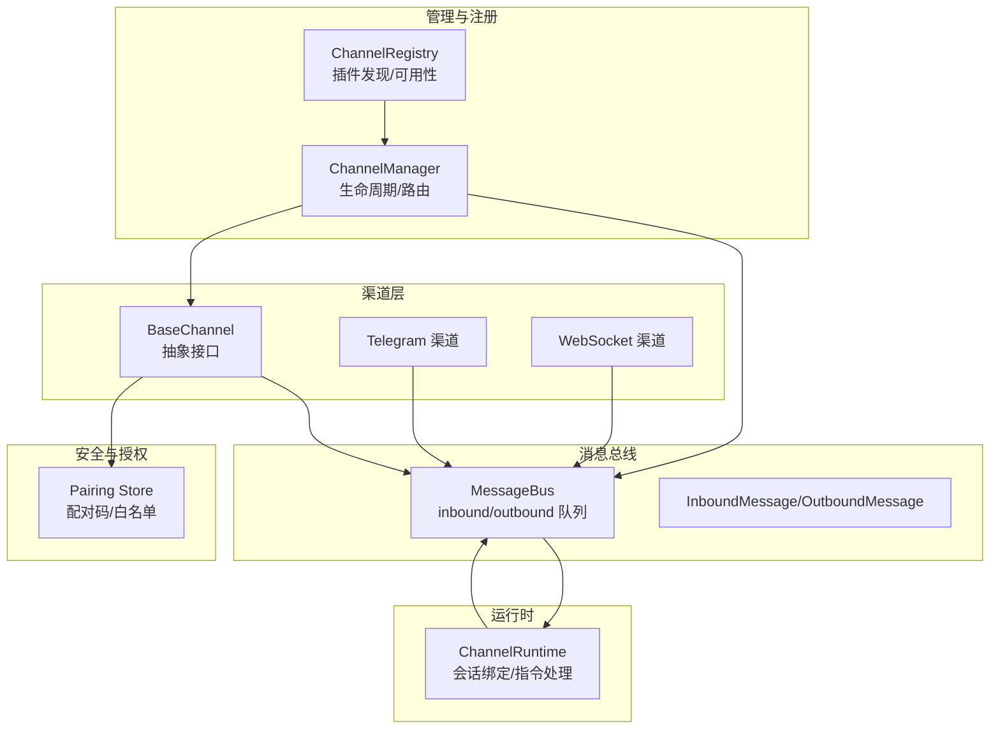
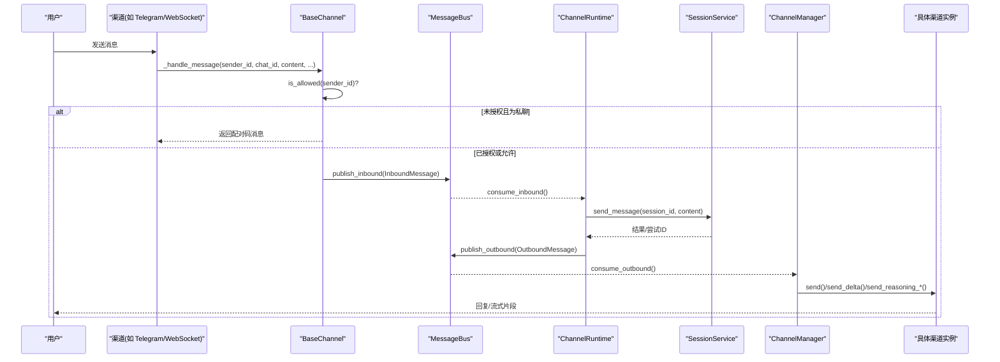
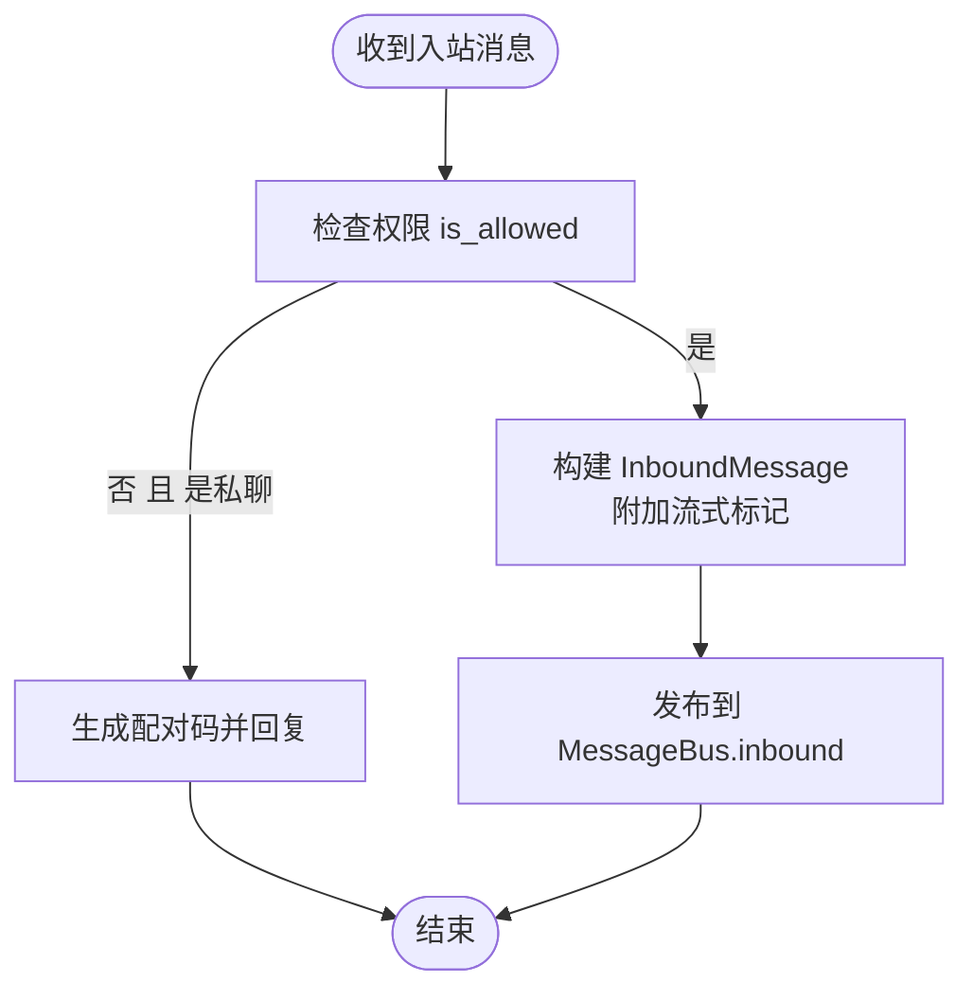
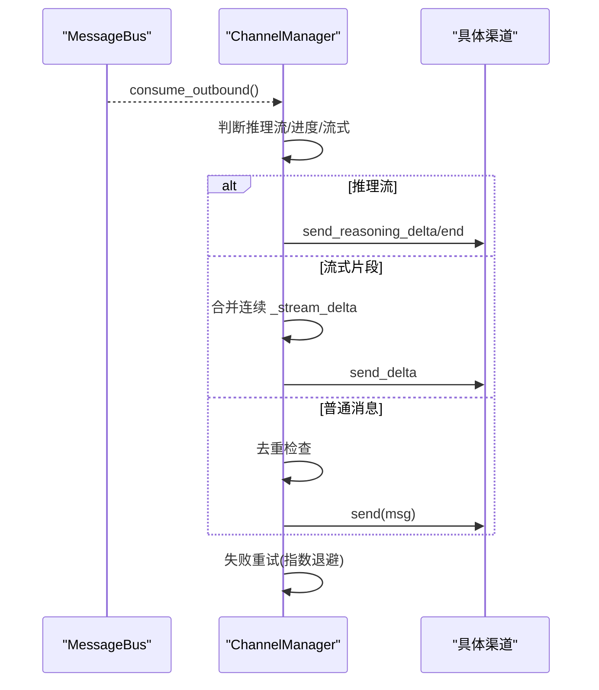
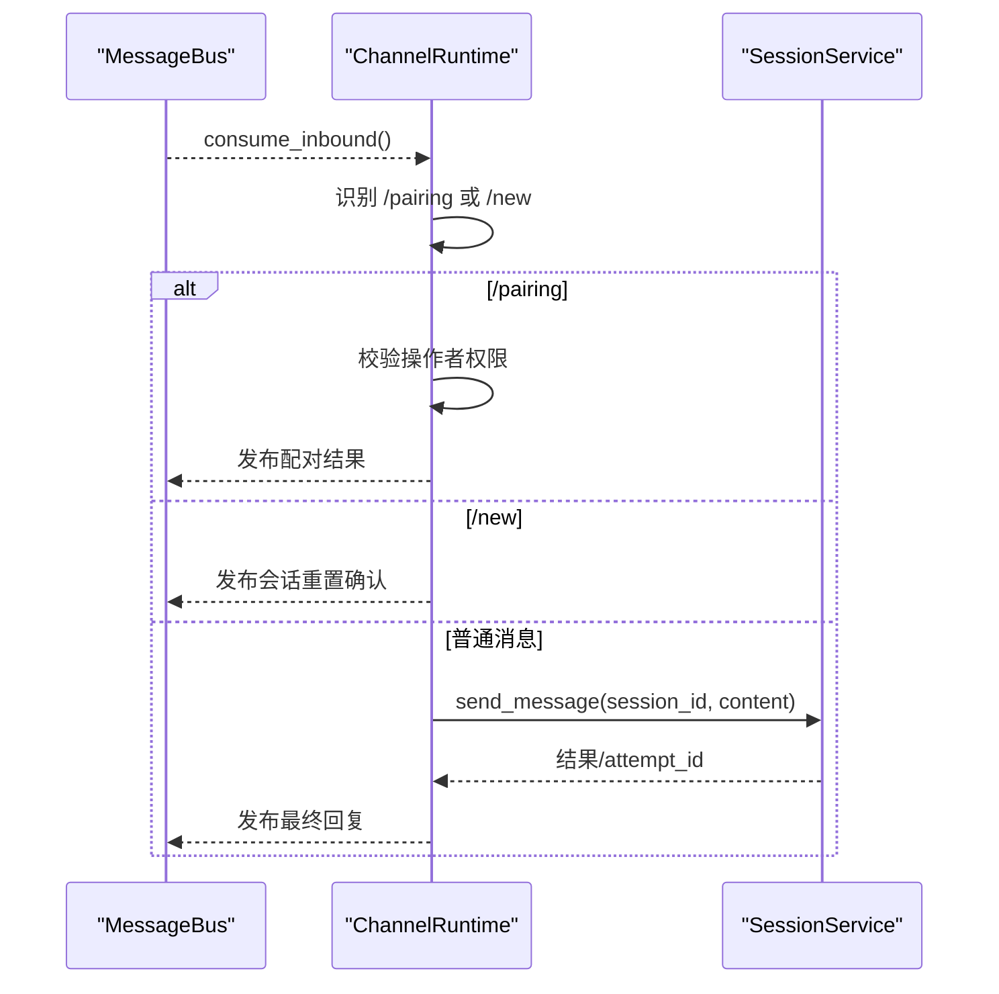
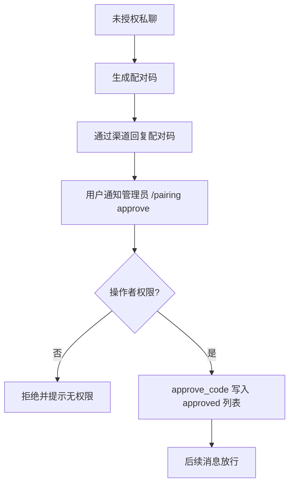
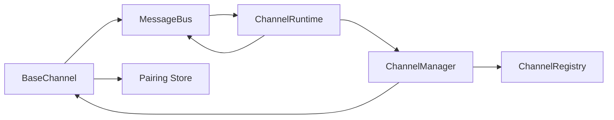

# 渠道架构设计

<cite>
**本文引用的文件**
- [agent/src/channels/base.py](file://agent/src/channels/base.py)
- [agent/src/channels/manager.py](file://agent/src/channels/manager.py)
- [agent/src/channels/registry.py](file://agent/src/channels/registry.py)
- [agent/src/channels/bus/events.py](file://agent/src/channels/bus/events.py)
- [agent/src/channels/bus/queue.py](file://agent/src/channels/bus/queue.py)
- [agent/src/channels/pairing/store.py](file://agent/src/channels/pairing/store.py)
- [agent/src/channels/runtime.py](file://agent/src/channels/runtime.py)
- [agent/src/channels/config.py](file://agent/src/channels/config.py)
- [agent/src/channels/telegram.py](file://agent/src/channels/telegram.py)
- [agent/src/channels/websocket.py](file://agent/src/channels/websocket.py)
</cite>

## 目录
1. [简介](#简介)
2. [项目结构](#项目结构)
3. [核心组件](#核心组件)
4. [架构总览](#架构总览)
5. [详细组件分析](#详细组件分析)
6. [依赖关系分析](#依赖关系分析)
7. [性能考量](#性能考量)
8. [故障排查指南](#故障排查指南)
9. [结论](#结论)
10. [附录：自定义渠道实现示例](#附录自定义渠道实现示例)

## 简介
本文件系统性阐述 Vibe-Trading 的“多渠道统一接入”架构，围绕以下目标展开：
- BaseChannel 抽象基类的设计模式与扩展点（消息处理流程、权限控制、流式传输支持等）
- ChannelManager 的职责与生命周期管理
- ChannelRegistry 的插件化注册机制
- MessageBus 的事件驱动架构（入站/出站消息处理）
- 配对码机制与安全访问控制
- 多渠道统一接口设计与扩展点
- 基于真实代码库的具体示例，指导如何实现自定义渠道

## 项目结构
渠道子系统位于 agent/src/channels 下，采用分层与职责分离的组织方式：
- base.py：定义所有渠道必须实现的抽象接口与通用逻辑
- manager.py：渠道管理器，负责发现、初始化、启停、出站路由与重试
- registry.py：内置渠道扫描与外部插件发现（entry_points），提供可用性检查
- bus/events.py、bus/queue.py：事件模型与异步消息队列
- pairing/store.py：配对码持久化存储与命令处理
- runtime.py：运行时编排，将入站消息路由到会话服务，并处理 /pairing 等指令
- config.py：渠道配置加载辅助
- 具体渠道实现：如 telegram.py、websocket.py 等，演示如何继承 BaseChannel

图表来源
- [agent/src/channels/base.py:22-238](file://agent/src/channels/base.py#L22-L238)
- [agent/src/channels/manager.py:36-479](file://agent/src/channels/manager.py#L36-L479)
- [agent/src/channels/registry.py:87-284](file://agent/src/channels/registry.py#L87-L284)
- [agent/src/channels/bus/events.py:20-55](file://agent/src/channels/bus/events.py#L20-L55)
- [agent/src/channels/bus/queue.py:8-44](file://agent/src/channels/bus/queue.py#L8-L44)
- [agent/src/channels/runtime.py:34-375](file://agent/src/channels/runtime.py#L34-L375)
- [agent/src/channels/pairing/store.py:80-319](file://agent/src/channels/pairing/store.py#L80-L319)

章节来源
- [agent/src/channels/base.py:22-238](file://agent/src/channels/base.py#L22-L238)
- [agent/src/channels/manager.py:36-479](file://agent/src/channels/manager.py#L36-L479)
- [agent/src/channels/registry.py:87-284](file://agent/src/channels/registry.py#L87-L284)
- [agent/src/channels/bus/events.py:20-55](file://agent/src/channels/bus/events.py#L20-L55)
- [agent/src/channels/bus/queue.py:8-44](file://agent/src/channels/bus/queue.py#L8-L44)
- [agent/src/channels/runtime.py:34-375](file://agent/src/channels/runtime.py#L34-L375)
- [agent/src/channels/pairing/store.py:80-319](file://agent/src/channels/pairing/store.py#L80-L319)

## 核心组件
- BaseChannel：抽象基类，定义 start/stop/send、流式发送钩子、权限校验、默认消息处理流程。
- ChannelManager：发现并实例化渠道，启动/停止，出站消息分发、去重、流合并、重试。
- ChannelRegistry：扫描内置渠道模块与外部插件，提供可用性与安装提示。
- MessageBus：异步队列，解耦渠道与 Agent 核心，承载 Inbound/Outbound 消息。
- ChannelRuntime：运行期编排，绑定会话、处理 /pairing 指令、错误与忙状态反馈。
- Pairing Store：配对码生成、审批、拒绝、撤销与持久化。

章节来源
- [agent/src/channels/base.py:22-238](file://agent/src/channels/base.py#L22-L238)
- [agent/src/channels/manager.py:36-479](file://agent/src/channels/manager.py#L36-L479)
- [agent/src/channels/registry.py:87-284](file://agent/src/channels/registry.py#L87-L284)
- [agent/src/channels/bus/queue.py:8-44](file://agent/src/channels/bus/queue.py#L8-L44)
- [agent/src/channels/runtime.py:34-375](file://agent/src/channels/runtime.py#L34-L375)
- [agent/src/channels/pairing/store.py:80-319](file://agent/src/channels/pairing/store.py#L80-L319)

## 架构总览
下图展示从用户消息到渠道回复的整体数据流与控制流：

图表来源
- [agent/src/channels/base.py:179-227](file://agent/src/channels/base.py#L179-L227)
- [agent/src/channels/bus/queue.py:19-33](file://agent/src/channels/bus/queue.py#L19-L33)
- [agent/src/channels/runtime.py:114-245](file://agent/src/channels/runtime.py#L114-L245)
- [agent/src/channels/manager.py:283-419](file://agent/src/channels/manager.py#L283-L419)

## 详细组件分析

### BaseChannel 抽象基类
- 设计要点
  - 统一入口：_handle_message 负责权限校验、DM 配对码下发、标记流式需求、构造 InboundMessage 并发布到总线。
  - 权限控制：is_allowed 优先 allowlist（含通配符）、其次配对批准列表；支持 deny 语义。
  - 流式支持：send_delta、send_reasoning_delta、send_reasoning_end、send_file_edit_events 等钩子；supports_streaming 自动检测是否启用。
  - 生命周期：start/stop 由子类实现；login 可选交互登录；is_running 暴露运行态。
  - 默认行为：send_reasoning 复用流式 delta/end；default_config 便于引导配置。

- 关键流程
  - 入站消息进入 _handle_message -> 权限检查 -> DM 未授权时下发配对码 -> 否则封装 InboundMessage 并 publish_inbound。
  - 若 supports_streaming，则附加元数据标记希望接收流式输出。

图表来源
- [agent/src/channels/base.py:154-227](file://agent/src/channels/base.py#L154-L227)

章节来源
- [agent/src/channels/base.py:22-238](file://agent/src/channels/base.py#L22-L238)

### ChannelManager 渠道管理器
- 职责
  - 初始化：通过 Registry 扫描内置与插件渠道，按配置启用并实例化。
  - 生命周期：start_all 并行启动各渠道；stop_all 有序停止并更新状态。
  - 出站路由：_dispatch_outbound 消费 OutboundMessage，区分推理流、进度/工具提示、普通消息，执行去重与流合并，调用具体渠道发送。
  - 重试策略：_send_with_retry 指数退避重试，可配置最大重试次数。
  - 状态上报：get_status 汇总每个渠道的可用/加载/运行状态。

- 关键流程
  - 出站消息到达后，先判断是否为推理流（_reasoning_delta/_reasoning_end/_reasoning），若是且 channel 开启 show_reasoning，则直接发送到对应渠道。
  - 对 _stream_delta 进行合并，减少 API 调用。
  - 对重复内容进行指纹去重，避免重复推送。

图表来源
- [agent/src/channels/manager.py:283-419](file://agent/src/channels/manager.py#L283-L419)

章节来源
- [agent/src/channels/manager.py:36-479](file://agent/src/channels/manager.py#L36-L479)

### ChannelRegistry 插件化注册表
- 功能
  - discover_channel_names：零导入扫描内置渠道模块名。
  - inspect_channel/load_channel_class：安全地检查渠道可用性，必要时给出安装提示。
  - discover_plugins/discover_enabled：通过 entry_points 发现外部插件，并与内置渠道合并（内置优先）。
  - inspect_channels：聚合所有渠道的配置/启用/可用状态，供状态端点使用。

- 关键点
  - 可选依赖懒加载与缺失提示，避免启动时引入重型 SDK。
  - 全局配置键过滤，确保仅将渠道段作为渠道配置解析。

章节来源
- [agent/src/channels/registry.py:87-284](file://agent/src/channels/registry.py#L87-L284)

### MessageBus 消息总线
- 数据结构
  - InboundMessage：包含 channel、sender_id、chat_id、content、media、metadata、session_key_override。
  - OutboundMessage：包含 channel、chat_id、content、reply_to、media、metadata、buttons。

- 行为
  - 两个 asyncio.Queue：inbound 与 outbound，提供 publish/consume 方法。
  - 提供队列长度属性用于监控。

章节来源
- [agent/src/channels/bus/events.py:20-55](file://agent/src/channels/bus/events.py#L20-L55)
- [agent/src/channels/bus/queue.py:8-44](file://agent/src/channels/bus/queue.py#L8-L44)

### ChannelRuntime 运行时编排
- 职责
  - 启动/停止：可选择启动 ChannelManager；维护消费者任务与处理器任务集合。
  - 入站处理：识别 /pairing 指令，校验操作者权限，调用配对命令处理器；识别会话重置指令；否则绑定/创建会话并调用 SessionService。
  - 会话映射：持久化 channel:chat_id 到 session_id 的映射，支持重置。
  - 错误与忙状态：捕获 SessionBusyError 与异常，向用户返回友好提示。

- 关键流程
  - 消费者循环持续消费 inbound，创建任务处理每条消息。
  - 等待会话响应时轮询，超时前返回最后助手消息。

图表来源
- [agent/src/channels/runtime.py:114-245](file://agent/src/channels/runtime.py#L114-L245)

章节来源
- [agent/src/channels/runtime.py:34-375](file://agent/src/channels/runtime.py#L34-L375)

### 配对码机制与安全访问控制
- 流程
  - 未授权私聊：BaseChannel._handle_message 检测到未授权且为私聊时，生成配对码并通过 OutboundMessage 返回，附带元数据标记。
  - 配对命令：ChannelRuntime 识别 /pairing 指令，校验操作者（全局或频道级），调用 handle_pairing_command 执行 list/approve/deny/revoke。
  - 存储：Pairing Store 使用线程锁保护 JSON 文件，原子写入，过期清理，支持跨通道范围限制。

- 安全要点
  - 非全局操作者只能在其所在频道范围内查看/操作配对请求。
  - 配对码具有 TTL，过期自动清理。
  - 支持撤销已批准用户。

图表来源
- [agent/src/channels/base.py:179-211](file://agent/src/channels/base.py#L179-L211)
- [agent/src/channels/runtime.py:121-164](file://agent/src/channels/runtime.py#L121-L164)
- [agent/src/channels/pairing/store.py:80-319](file://agent/src/channels/pairing/store.py#L80-L319)

章节来源
- [agent/src/channels/base.py:154-227](file://agent/src/channels/base.py#L154-L227)
- [agent/src/channels/runtime.py:121-164](file://agent/src/channels/runtime.py#L121-L164)
- [agent/src/channels/pairing/store.py:80-319](file://agent/src/channels/pairing/store.py#L80-L319)

## 依赖关系分析
- 耦合与内聚
  - BaseChannel 与 MessageBus、Pairing Store 松耦合，通过事件与函数接口交互。
  - ChannelManager 依赖 Registry 与具体渠道实现，但通过抽象接口隔离。
  - ChannelRuntime 依赖 SessionService，但不直接依赖具体渠道。
- 外部依赖
  - 渠道插件通过 entry_points 注册，避免硬编码。
  - 可选 SDK 懒加载，提升启动性能与稳定性。

图表来源
- [agent/src/channels/base.py:22-238](file://agent/src/channels/base.py#L22-L238)
- [agent/src/channels/manager.py:36-479](file://agent/src/channels/manager.py#L36-L479)
- [agent/src/channels/registry.py:87-284](file://agent/src/channels/registry.py#L87-L284)
- [agent/src/channels/runtime.py:34-375](file://agent/src/channels/runtime.py#L34-L375)
- [agent/src/channels/pairing/store.py:80-319](file://agent/src/channels/pairing/store.py#L80-L319)

章节来源
- [agent/src/channels/manager.py:36-479](file://agent/src/channels/manager.py#L36-L479)
- [agent/src/channels/registry.py:87-284](file://agent/src/channels/registry.py#L87-L284)

## 性能考量
- 出站流合并：ChannelManager 对同一目标的连续 _stream_delta 进行合并，降低 API 调用频率。
- 去重机制：基于内容指纹与 origin/message_id 的去重，避免重复推送。
- 重试策略：指数退避重试，可配置最大重试次数，平衡可靠性与资源占用。
- 懒加载与扫描：Registry 使用 pkgutil 扫描模块名，按需导入，避免不必要的第三方 SDK 引入。
- 队列缓冲：MessageBus 使用 asyncio.Queue 解耦生产与消费，提高吞吐与弹性。

[本节为通用性能讨论，不直接分析具体文件]

## 故障排查指南
- 渠道不可用
  - 现象：ChannelManager 在初始化阶段记录 unavailable 并跳过。
  - 排查：检查 Registry 的 availability 与 install_hint，确认依赖是否安装。
  - 参考路径
    - [agent/src/channels/manager.py:75-99](file://agent/src/channels/manager.py#L75-L99)
    - [agent/src/channels/registry.py:130-160](file://agent/src/channels/registry.py#L130-L160)

- 出站失败
  - 现象：发送失败日志与重试信息。
  - 排查：检查渠道实现是否正确抛出异常；确认重试次数与退避时间；观察队列积压。
  - 参考路径
    - [agent/src/channels/manager.py:421-452](file://agent/src/channels/manager.py#L421-L452)

- 会话忙或超时
  - 现象：用户收到“仍在处理上一条消息”或超时错误。
  - 排查：确认 SessionService 是否繁忙；调整 reply_timeout_s 与 poll_interval_s。
  - 参考路径
    - [agent/src/channels/runtime.py:213-245](file://agent/src/channels/runtime.py#L213-L245)
    - [agent/src/channels/runtime.py:261-277](file://agent/src/channels/runtime.py#L261-L277)

- 配对码问题
  - 现象：用户未收到配对码或审批失败。
  - 排查：检查 BaseChannel 权限逻辑与 DM 判定；确认 Pairing Store 文件完整性与权限。
  - 参考路径
    - [agent/src/channels/base.py:179-211](file://agent/src/channels/base.py#L179-L211)
    - [agent/src/channels/pairing/store.py:43-68](file://agent/src/channels/pairing/store.py#L43-L68)

章节来源
- [agent/src/channels/manager.py:75-99](file://agent/src/channels/manager.py#L75-L99)
- [agent/src/channels/registry.py:130-160](file://agent/src/channels/registry.py#L130-L160)
- [agent/src/channels/manager.py:421-452](file://agent/src/channels/manager.py#L421-L452)
- [agent/src/channels/runtime.py:213-245](file://agent/src/channels/runtime.py#L213-L245)
- [agent/src/channels/base.py:179-211](file://agent/src/channels/base.py#L179-L211)
- [agent/src/channels/pairing/store.py:43-68](file://agent/src/channels/pairing/store.py#L43-L68)

## 结论
Vibe-Trading 的渠道架构以 BaseChannel 为核心抽象，结合 ChannelManager 的生命周期与路由能力、ChannelRegistry 的插件化注册、MessageBus 的事件驱动解耦、以及 Pairing Store 的安全访问控制，实现了多渠道统一接入与可扩展的消息处理体系。该设计在保证高内聚低耦合的同时，提供了丰富的扩展点与健壮的错误处理机制，适合私有助理与企业级场景的多平台集成。

[本节为总结性内容，不直接分析具体文件]

## 附录：自定义渠道实现示例
以下示例说明如何基于 BaseChannel 实现一个自定义渠道，覆盖关键扩展点：

- 步骤概览
  - 新建模块文件，例如 mychannel.py，继承 BaseChannel。
  - 实现 start/stop：连接平台、监听消息、调用 _handle_message 转发入站消息。
  - 实现 send：发送 OutboundMessage 到平台。
  - 可选实现 send_delta/send_reasoning_delta/send_reasoning_end：支持流式输出。
  - 在 channels 配置中启用该渠道，或通过插件机制注册。

- 关键扩展点
  - 权限控制：如需自定义白名单或鉴权，可在 is_allowed 基础上扩展。
  - 流式传输：根据平台特性实现 send_delta 与 reasoning 相关钩子。
  - 配置：可通过 default_config 提供默认配置项，便于引导。

- 参考实现
  - Telegram 渠道展示了长文本拆分、HTML 转义、工具提示渲染等细节。
  - WebSocket 渠道展示了认证、令牌签发、媒体上传、工作区范围等高级特性。

章节来源
- [agent/src/channels/base.py:22-238](file://agent/src/channels/base.py#L22-L238)
- [agent/src/channels/telegram.py:1-200](file://agent/src/channels/telegram.py#L1-L200)
- [agent/src/channels/websocket.py:53-143](file://agent/src/channels/websocket.py#L53-L143)