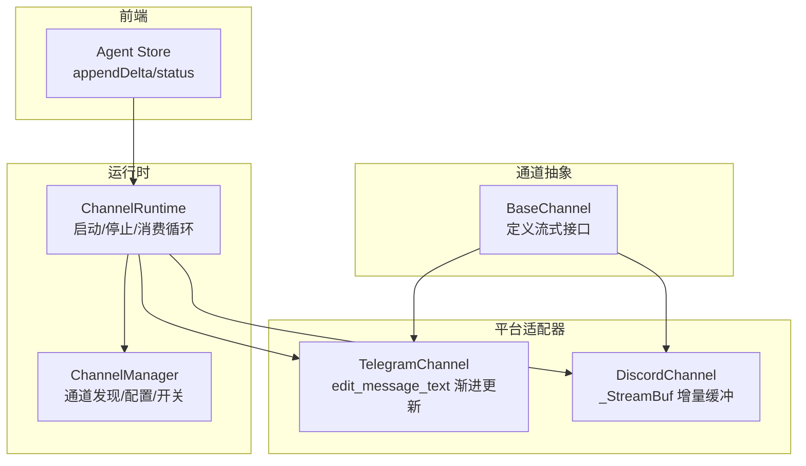
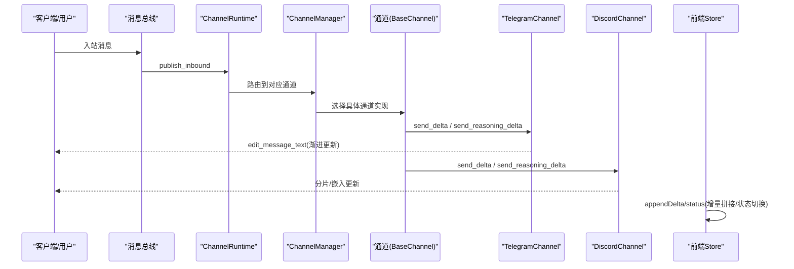
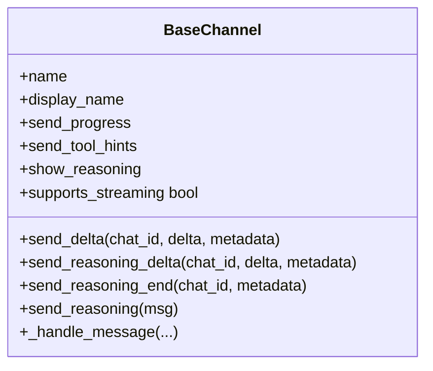
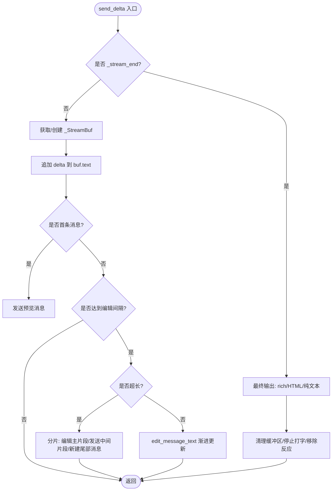
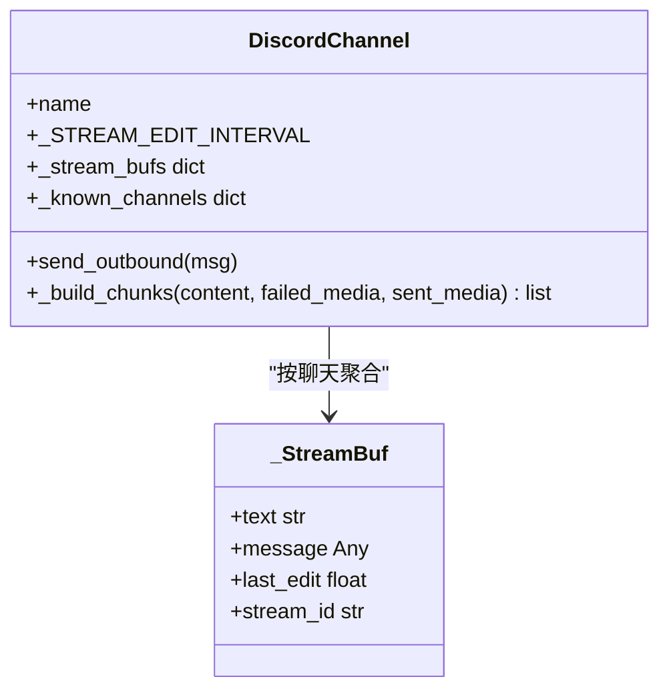
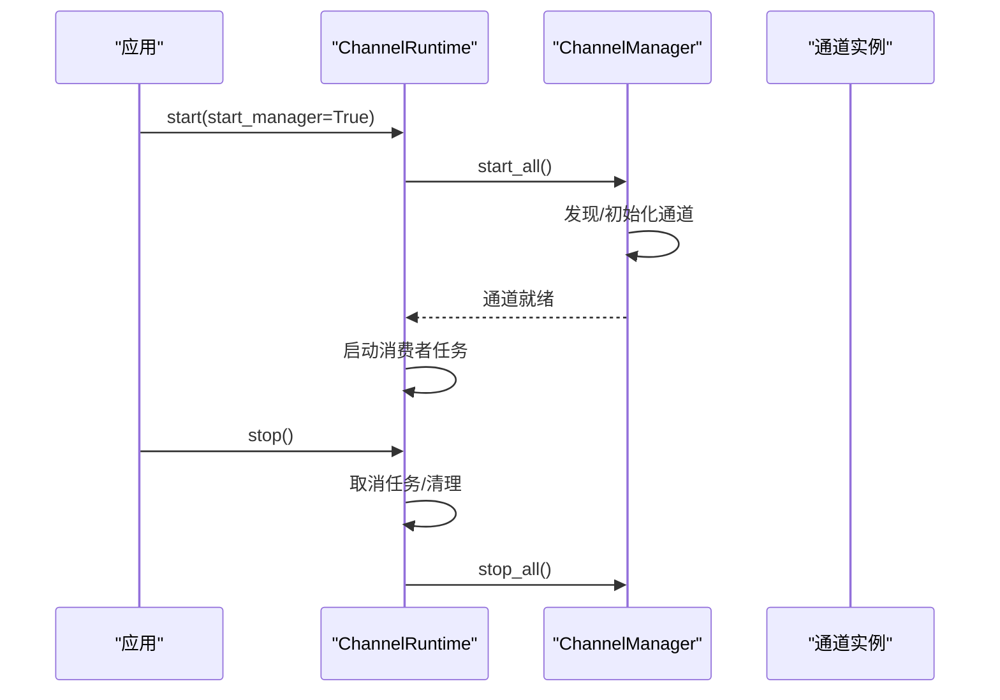
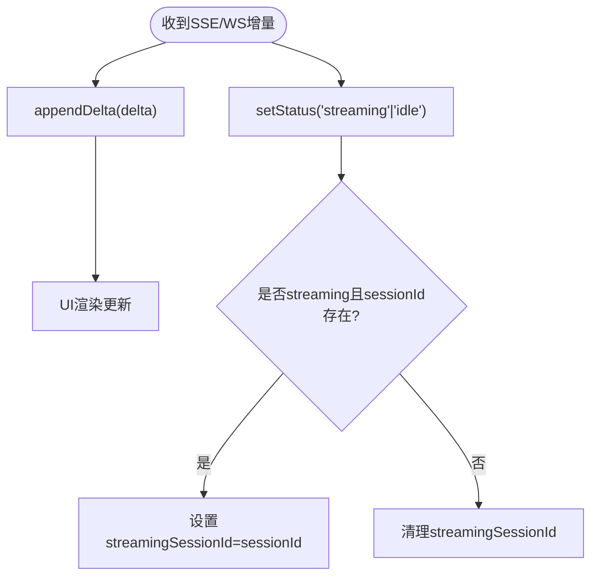
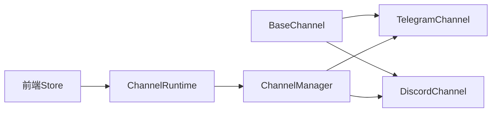

# 流式传输实现

<cite>
**本文引用的文件**
- [agent/src/channels/base.py](file://agent/src/channels/base.py)
- [agent/src/channels/telegram.py](file://agent/src/channels/telegram.py)
- [agent/src/channels/discord.py](file://agent/src/channels/discord.py)
- [agent/src/channels/runtime.py](file://agent/src/channels/runtime.py)
- [agent/src/channels/manager.py](file://agent/src/channels/manager.py)
- [frontend/src/stores/agent.ts](file://frontend/src/stores/agent.ts)
</cite>

## 目录
1. [简介](#简介)
2. [项目结构](#项目结构)
3. [核心组件](#核心组件)
4. [架构总览](#架构总览)
5. [详细组件分析](#详细组件分析)
6. [依赖关系分析](#依赖关系分析)
7. [性能考虑](#性能考虑)
8. [故障排查指南](#故障排查指南)
9. [结论](#结论)
10. [附录](#附录)

## 简介
本文件聚焦 Vibe-Trading 的“流式传输”能力，围绕 send_delta() 与 send_reasoning_delta() 的设计与实现要求，系统阐述增量更新、状态管理、错误重试、会话隔离与并发控制。同时记录不同渠道（Telegram、Discord）的适配策略，给出长文本、富媒体与交互式内容的处理要点，并提供性能优化、内存管理与网络异常处理的实践建议，以及调试与性能分析指引。

## 项目结构
- 通道抽象层：BaseChannel 定义统一的发送与流式接口，包括 send_delta、send_reasoning_delta、send_reasoning_end、send_file_edit_events 等。
- 平台适配器：Telegram 与 Discord 分别实现各自的流式渲染策略（编辑消息、嵌入更新、分片追加）。
- 运行时与调度：ChannelRuntime 负责启动/停止通道任务；ChannelManager 负责通道发现、初始化、配置注入与全局开关（如 show_reasoning、send_progress）。
- 前端消费：前端 store 维护 streamingText、会话状态与快速增量累积，确保 UI 流畅。

图表来源
- [agent/src/channels/base.py:22-163](file://agent/src/channels/base.py#L22-L163)
- [agent/src/channels/telegram.py:920-1060](file://agent/src/channels/telegram.py#L920-L1060)
- [agent/src/channels/discord.py:40-48](file://agent/src/channels/discord.py#L40-L48)
- [agent/src/channels/runtime.py:34-102](file://agent/src/channels/runtime.py#L34-L102)
- [agent/src/channels/manager.py:36-137](file://agent/src/channels/manager.py#L36-L137)
- [frontend/src/stores/agent.ts:136-165](file://frontend/src/stores/agent.ts#L136-L165)

章节来源
- [agent/src/channels/base.py:22-163](file://agent/src/channels/base.py#L22-L163)
- [agent/src/channels/runtime.py:34-102](file://agent/src/channels/runtime.py#L34-L102)
- [agent/src/channels/manager.py:36-137](file://agent/src/channels/manager.py#L36-L137)

## 核心组件
- BaseChannel 流式契约
  - send_delta(chat_id, delta, metadata): 增量文本块投递；默认空实现，子类覆盖以启用流式。
  - send_reasoning_delta(chat_id, delta, metadata): 推理/思考内容增量；默认空实现，支持低优先级子视图就地更新。
  - send_reasoning_end(chat_id, metadata): 推理段结束信号，用于刷新并冻结渲染组。
  - supports_streaming: 根据配置与是否覆写 send_delta 判断是否启用流式。
  - _handle_message: 入站消息进入总线前，若支持流式则注入元数据标记。

- TelegramChannel 流式实现要点
  - 使用 _StreamBuf 按 chat_id 聚合文本，首次 delta 发送预览消息，后续按间隔 edit_message_text 渐进更新。
  - 超长内容通过分片拆分，必要时追加新消息；最终输出尝试富文本（rich messages），失败回退到 HTML/纯文本。
  - 内置重试与限流保护（超时、Flood Control），避免连接池耗尽时的雪崩。
  - 流式结束清理缓冲区、移除反应、停止打字指示。

- DiscordChannel 流式实现要点
  - 使用 _StreamBuf 按聊天聚合，维护 last_edit 时间戳与 stream_id，控制编辑频率。
  - 文本按平台限制分片发送；附件上传失败时生成回退提示文本。
  - 命令交互与线程上下文透传，保证会话隔离。

- ChannelRuntime 与 ChannelManager
  - Runtime 负责生命周期管理（start/stop）、消费者任务与处理器任务取消。
  - Manager 负责通道发现、实例化、布尔开关（show_reasoning/send_progress/send_tool_hints）解析与应用。

- 前端 Agent Store
  - appendDelta 将增量拼接至 streamingText；setStatus 在 streaming 状态下绑定 sessionId，并在非 streaming 或会话切换时清理。
  - 测试覆盖快速累积、重置与工具调用并发场景。

章节来源
- [agent/src/channels/base.py:85-163](file://agent/src/channels/base.py#L85-L163)
- [agent/src/channels/telegram.py:349-356](file://agent/src/channels/telegram.py#L349-L356)
- [agent/src/channels/telegram.py:920-1060](file://agent/src/channels/telegram.py#L920-L1060)
- [agent/src/channels/discord.py:40-48](file://agent/src/channels/discord.py#L40-L48)
- [agent/src/channels/discord.py:246-319](file://agent/src/channels/discord.py#L246-L319)
- [agent/src/channels/runtime.py:34-102](file://agent/src/channels/runtime.py#L34-L102)
- [agent/src/channels/manager.py:36-137](file://agent/src/channels/manager.py#L36-L137)
- [frontend/src/stores/agent.ts:136-165](file://frontend/src/stores/agent.ts#L136-L165)

## 架构总览
下图展示从入站到流式输出的端到端流程，包含通道抽象、平台适配、运行时调度与前端消费。

图表来源
- [agent/src/channels/base.py:85-163](file://agent/src/channels/base.py#L85-L163)
- [agent/src/channels/telegram.py:920-1060](file://agent/src/channels/telegram.py#L920-L1060)
- [agent/src/channels/discord.py:246-319](file://agent/src/channels/discord.py#L246-L319)
- [agent/src/channels/runtime.py:34-102](file://agent/src/channels/runtime.py#L34-L102)
- [agent/src/channels/manager.py:36-137](file://agent/src/channels/manager.py#L36-L137)
- [frontend/src/stores/agent.ts:136-165](file://frontend/src/stores/agent.ts#L136-L165)

## 详细组件分析

### BaseChannel 流式契约与默认行为
- send_delta: 增量文本块投递；默认不实现，子类覆盖后由 supports_streaming 判定启用。
- send_reasoning_delta / send_reasoning_end: 推理内容增量与结束信号；默认空实现，支持低优先级子视图就地更新。
- send_reasoning(msg): 便捷方法，将完整推理块包装为 delta+end 对。
- supports_streaming: 读取配置中的 streaming 标志，并结合是否覆写 send_delta 决定启用。
- _handle_message: 若通道支持流式，向入站消息注入 _wants_stream 标记，便于下游识别。

图表来源
- [agent/src/channels/base.py:22-163](file://agent/src/channels/base.py#L22-L163)

章节来源
- [agent/src/channels/base.py:85-163](file://agent/src/channels/base.py#L85-L163)

### Telegram 流式实现：编辑消息与富文本回退
- 增量策略
  - 首个 delta 发送预览消息，后续按最小间隔 edit_message_text 渐进更新。
  - 使用 _StreamBuf 缓存 text、message_id、last_edit、stream_id，按 chat_id 键控，支持多流隔离。
- 超长内容处理
  - 超过平台限制时，分片拆分；主片段编辑当前消息，中间片段作为独立消息发送，尾部开启新消息继续流式。
- 最终输出
  - 优先尝试富文本（rich messages），成功则删除预览消息；失败回退到 HTML 或纯文本。
- 错误与重试
  - 统一封装重试：超时与 Flood Control 指数退避；“未修改”错误静默忽略。
- 结束清理
  - 收到 _stream_end 时停止打字指示、移除反应、清空缓冲区。

图表来源
- [agent/src/channels/telegram.py:920-1060](file://agent/src/channels/telegram.py#L920-L1060)
- [agent/src/channels/telegram.py:1061-1098](file://agent/src/channels/telegram.py#L1061-L1098)
- [agent/src/channels/telegram.py:860-880](file://agent/src/channels/telegram.py#L860-L880)

章节来源
- [agent/src/channels/telegram.py:349-356](file://agent/src/channels/telegram.py#L349-L356)
- [agent/src/channels/telegram.py:920-1060](file://agent/src/channels/telegram.py#L920-L1060)
- [agent/src/channels/telegram.py:1061-1098](file://agent/src/channels/telegram.py#L1061-L1098)
- [agent/src/channels/telegram.py:860-880](file://agent/src/channels/telegram.py#L860-L880)

### Discord 流式实现：嵌入更新与分片发送
- 增量策略
  - 使用 _StreamBuf 按聊天聚合文本，维护 message、last_edit、stream_id，控制编辑频率。
- 文本与附件
  - 文本按平台限制分片发送；附件大小限制与失败回退（生成失败提示文本）。
- 会话与上下文
  - 命令交互中传递 parent_channel_id、thread_id 等元数据，确保会话隔离与线程上下文正确。

图表来源
- [agent/src/channels/discord.py:40-48](file://agent/src/channels/discord.py#L40-L48)
- [agent/src/channels/discord.py:246-319](file://agent/src/channels/discord.py#L246-L319)

章节来源
- [agent/src/channels/discord.py:40-48](file://agent/src/channels/discord.py#L40-L48)
- [agent/src/channels/discord.py:246-319](file://agent/src/channels/discord.py#L246-L319)

### 运行时与通道管理器
- ChannelRuntime
  - start: 加载会话映射、启动管理器与消费者任务。
  - stop: 取消消费者与处理器任务，安全关闭管理器。
- ChannelManager
  - 发现并启用通道，注入全局布尔开关（send_progress/send_tool_hints/show_reasoning）。
  - 构建通道参数（如 websocket/matrix 的特殊服务注入）。

图表来源
- [agent/src/channels/runtime.py:72-102](file://agent/src/channels/runtime.py#L72-L102)
- [agent/src/channels/manager.py:36-137](file://agent/src/channels/manager.py#L36-L137)

章节来源
- [agent/src/channels/runtime.py:72-102](file://agent/src/channels/runtime.py#L72-L102)
- [agent/src/channels/manager.py:36-137](file://agent/src/channels/manager.py#L36-L137)

### 前端流式消费：增量拼接与会话隔离
- appendDelta: 将增量拼接至 streamingText，保持 UI 连续显示。
- setStatus: 在 streaming 状态设置 streamingSessionId，非 streaming 或会话切换时清理，避免跨会话污染。
- 测试覆盖快速累积、重置与并发工具调用场景，确保状态一致性。

图表来源
- [frontend/src/stores/agent.ts:136-165](file://frontend/src/stores/agent.ts#L136-L165)

章节来源
- [frontend/src/stores/agent.ts:136-165](file://frontend/src/stores/agent.ts#L136-L165)

## 依赖关系分析
- BaseChannel 是所有通道实现的契约，Telegram/Discord 均继承并覆写 send_delta 以启用流式。
- ChannelManager 负责通道发现与配置注入，影响 show_reasoning 等全局行为。
- ChannelRuntime 协调通道生命周期，确保任务正确启停。
- 前端 Store 与后端通道解耦，通过事件/消息消费增量，维持本地状态一致。

图表来源
- [agent/src/channels/base.py:22-163](file://agent/src/channels/base.py#L22-L163)
- [agent/src/channels/manager.py:36-137](file://agent/src/channels/manager.py#L36-L137)
- [agent/src/channels/runtime.py:34-102](file://agent/src/channels/runtime.py#L34-L102)
- [frontend/src/stores/agent.ts:136-165](file://frontend/src/stores/agent.ts#L136-L165)

章节来源
- [agent/src/channels/base.py:22-163](file://agent/src/channels/base.py#L22-L163)
- [agent/src/channels/manager.py:36-137](file://agent/src/channels/manager.py#L36-L137)
- [agent/src/channels/runtime.py:34-102](file://agent/src/channels/runtime.py#L34-L102)
- [frontend/src/stores/agent.ts:136-165](file://frontend/src/stores/agent.ts#L136-L165)

## 性能考虑
- 编辑节流
  - Telegram 使用最小编辑间隔（可配置）控制 edit_message_text 频率，避免频繁 API 调用。
  - Discord 维护 last_edit 时间戳，控制增量更新节奏。
- 分片与溢出处理
  - 超长内容按平台限制分片，主片段编辑、中间片段独立发送、尾部新开消息继续流式，减少单次负载。
- 重试与限流
  - 统一重试封装，指数退避应对超时与 Flood Control；“未修改”错误静默处理，避免无效重试。
- 内存管理
  - _StreamBuf 按 chat_id/stream_id 键控，结束时及时清理，防止内存泄漏。
- 前端渲染
  - 增量拼接 streamingText，避免整段重绘；会话切换时清理 streamingSessionId，防止状态污染。

[本节提供通用指导，无需特定文件引用]

## 故障排查指南
- 常见问题定位
  - 流式无响应：检查 supports_streaming 是否为真（配置 streaming 且子类覆写 send_delta）。
  - 编辑失败：查看“未修改”错误是否被正确处理；确认重试与限流逻辑生效。
  - 超长内容截断：确认分片逻辑与末尾消息创建是否正确。
  - 前端状态不一致：确认 setStatus 与 appendDelta 的顺序与清理逻辑。
- 日志与调试
  - 通道日志：关注警告与异常堆栈，尤其是网络错误与平台 API 错误。
  - 前端测试：利用现有测试用例验证快速累积、重置与并发场景。
- 恢复策略
  - 网络抖动：依赖指数退避重试；遇到 Flood Control 按 retry_after 等待。
  - 会话冲突：通过 stream_id 区分多流，避免跨流覆盖。

章节来源
- [agent/src/channels/telegram.py:860-880](file://agent/src/channels/telegram.py#L860-L880)
- [agent/src/channels/telegram.py:920-1060](file://agent/src/channels/telegram.py#L920-L1060)
- [agent/src/channels/discord.py:246-319](file://agent/src/channels/discord.py#L246-L319)
- [frontend/src/stores/agent.ts:136-165](file://frontend/src/stores/agent.ts#L136-L165)

## 结论
Vibe-Trading 的流式传输以 BaseChannel 为契约，结合 Telegram 与 Discord 的平台特性，实现了稳定、高效、可扩展的增量更新机制。通过编辑节流、分片溢出处理、重试与限流、会话隔离与前端状态管理，系统在长文本、富媒体与交互式内容场景下具备良好表现。建议在新增渠道时遵循该契约，复用重试与节流模式，并确保正确的状态清理与会话隔离。

[本节总结性内容，无需特定文件引用]

## 附录
- 关键实现路径参考
  - 流式契约与默认行为：[agent/src/channels/base.py:85-163](file://agent/src/channels/base.py#L85-L163)
  - Telegram 渐进编辑与溢出处理：[agent/src/channels/telegram.py:920-1060](file://agent/src/channels/telegram.py#L920-L1060)、[agent/src/channels/telegram.py:1061-1098](file://agent/src/channels/telegram.py#L1061-L1098)
  - Discord 增量缓冲与分片发送：[agent/src/channels/discord.py:40-48](file://agent/src/channels/discord.py#L40-L48)、[agent/src/channels/discord.py:246-319](file://agent/src/channels/discord.py#L246-L319)
  - 运行时与通道管理：[agent/src/channels/runtime.py:72-102](file://agent/src/channels/runtime.py#L72-L102)、[agent/src/channels/manager.py:36-137](file://agent/src/channels/manager.py#L36-L137)
  - 前端增量消费与会话隔离：[frontend/src/stores/agent.ts:136-165](file://frontend/src/stores/agent.ts#L136-L165)

[本节为路径索引，无需额外分析]