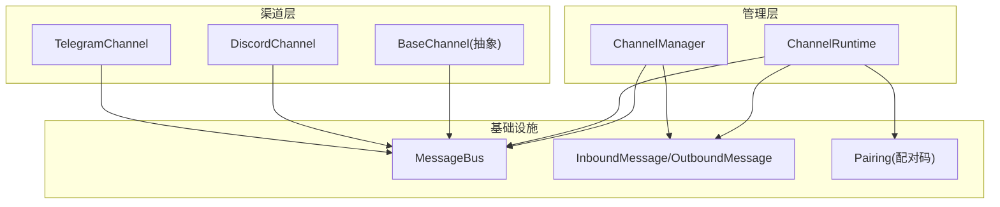
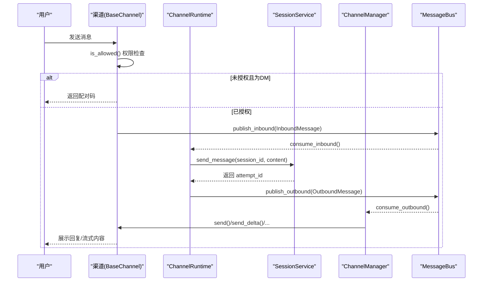
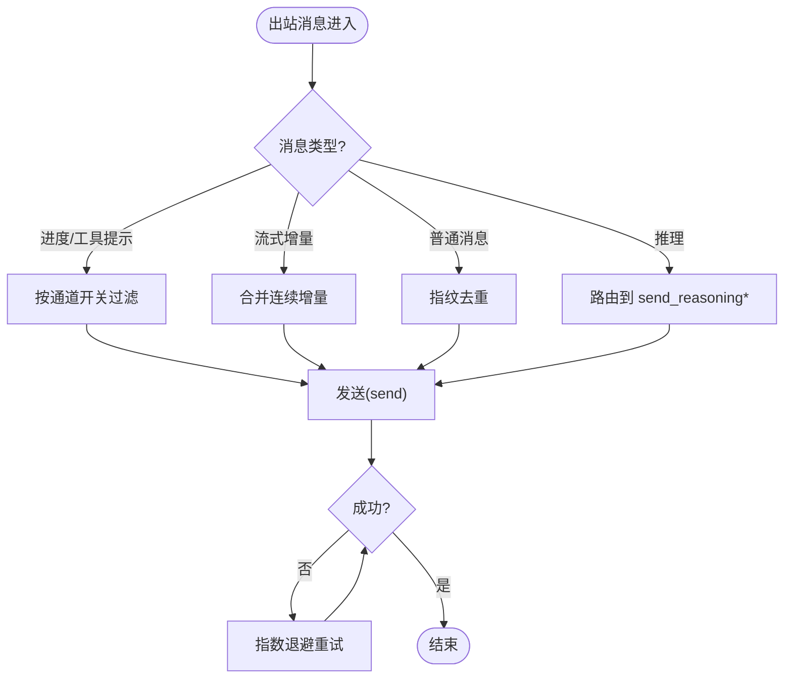
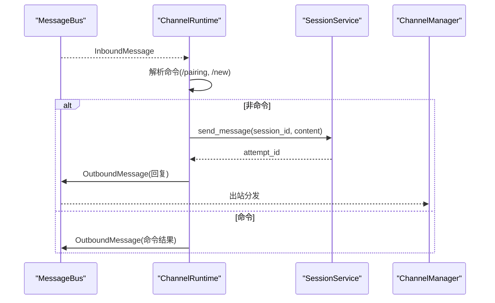
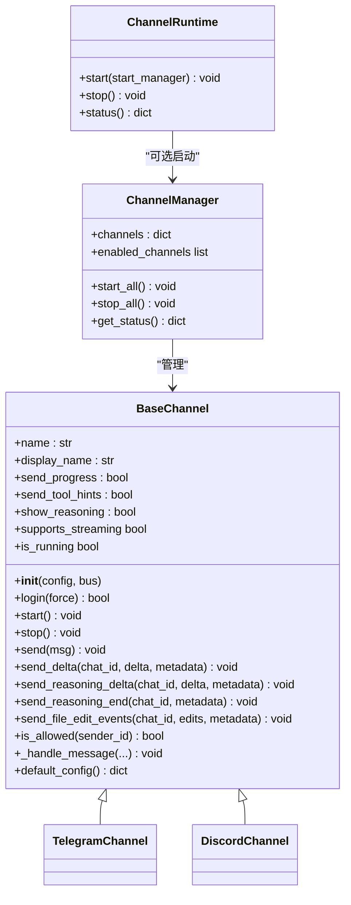

# 渠道基础接口实现

<cite>
**本文引用的文件**
- [agent/src/channels/base.py](file://agent/src/channels/base.py)
- [agent/src/channels/manager.py](file://agent/src/channels/manager.py)
- [agent/src/channels/runtime.py](file://agent/src/channels/runtime.py)
- [agent/src/channels/config.py](file://agent/src/channels/config.py)
- [agent/src/channels/bus/events.py](file://agent/src/channels/bus/events.py)
- [agent/src/channels/pairing/__init__.py](file://agent/src/channels/pairing/__init__.py)
- [agent/src/channels/telegram.py](file://agent/src/channels/telegram.py)
- [agent/src/channels/discord.py](file://agent/src/channels/discord.py)
</cite>

## 目录
1. [简介](#简介)
2. [项目结构](#项目结构)
3. [核心组件](#核心组件)
4. [架构总览](#架构总览)
5. [详细组件分析](#详细组件分析)
6. [依赖关系分析](#依赖关系分析)
7. [性能考虑](#性能考虑)
8. [故障排查指南](#故障排查指南)
9. [结论](#结论)
10. [附录：实现示例与最佳实践](#附录：实现示例与最佳实践)

## 简介
本文面向 Vibe-Trading 的“渠道基础接口”实现，系统性阐述 BaseChannel 抽象类的设计理念、必须实现的三个核心方法（start/stop/send）、可选的流式传输方法（send_delta/send_reasoning_delta/send_reasoning_end 等）的实现模式与最佳实践。同时覆盖渠道生命周期管理、状态控制、错误处理、权限控制、配对码机制、消息路由原理，并提供调试技巧与性能优化建议。

## 项目结构
Vibe-Trading 的渠道子系统围绕“消息总线 + 渠道管理器 + 运行时编排”展开：
- 抽象基类 BaseChannel：定义统一接口与通用能力（权限校验、配对码、流式钩子）。
- ChannelManager：负责发现、初始化、启停各渠道，以及出站消息分发与重试。
- ChannelRuntime：将入站消息接入会话服务，并处理 /pairing、会话重置等命令。
- 事件模型 InboundMessage/OutboundMessage：跨渠道的消息载体。
- 配对模块 pairing：生成/校验配对码、处理 /pairing 命令。
- 具体渠道实现（如 Telegram、Discord）：继承 BaseChannel 完成平台适配。

图表来源
- [agent/src/channels/base.py:22-238](file://agent/src/channels/base.py#L22-L238)
- [agent/src/channels/manager.py:36-479](file://agent/src/channels/manager.py#L36-L479)
- [agent/src/channels/runtime.py:34-375](file://agent/src/channels/runtime.py#L34-L375)
- [agent/src/channels/bus/events.py:20-55](file://agent/src/channels/bus/events.py#L20-L55)
- [agent/src/channels/pairing/__init__.py:1-34](file://agent/src/channels/pairing/__init__.py#L1-L34)

章节来源
- [agent/src/channels/base.py:22-238](file://agent/src/channels/base.py#L22-L238)
- [agent/src/channels/manager.py:36-479](file://agent/src/channels/manager.py#L36-L479)
- [agent/src/channels/runtime.py:34-375](file://agent/src/channels/runtime.py#L34-L375)
- [agent/src/channels/bus/events.py:20-55](file://agent/src/channels/bus/events.py#L20-L55)
- [agent/src/channels/pairing/__init__.py:1-34](file://agent/src/channels/pairing/__init__.py#L1-L34)

## 核心组件
- BaseChannel：定义渠道的统一契约，提供权限校验、配对码流程、流式发送钩子、运行状态标记等。
- ChannelManager：集中管理渠道实例，负责启动/停止、出站消息路由、去重与合并、重试策略。
- ChannelRuntime：消费入站消息，解析命令（/pairing、/new 等），映射到会话并等待回复，再回写出站消息。
- MessageBus：进程内消息队列，承载 InboundMessage/OutboundMessage 的发布与消费。
- Pairing：配对码生成、存储、校验与命令处理，用于 DM 场景下的首次授权。

章节来源
- [agent/src/channels/base.py:22-238](file://agent/src/channels/base.py#L22-L238)
- [agent/src/channels/manager.py:36-479](file://agent/src/channels/manager.py#L36-L479)
- [agent/src/channels/runtime.py:34-375](file://agent/src/channels/runtime.py#L34-L375)
- [agent/src/channels/bus/events.py:20-55](file://agent/src/channels/bus/events.py#L20-L55)
- [agent/src/channels/pairing/__init__.py:1-34](file://agent/src/channels/pairing/__init__.py#L1-L34)

## 架构总览
下图展示了从用户消息到系统回复的完整链路：渠道监听 → 权限校验 → 入站消息 → 运行时处理 → 会话服务 → 出站消息 → 渠道发送。

图表来源
- [agent/src/channels/base.py:179-227](file://agent/src/channels/base.py#L179-L227)
- [agent/src/channels/runtime.py:121-245](file://agent/src/channels/runtime.py#L121-L245)
- [agent/src/channels/manager.py:283-419](file://agent/src/channels/manager.py#L283-L419)
- [agent/src/channels/bus/events.py:20-55](file://agent/src/channels/bus/events.py#L20-L55)

## 详细组件分析

### BaseChannel 抽象类
- 设计理念
  - 统一契约：所有渠道必须实现 start()/stop()/send()，保证一致的启动、停止与发送语义。
  - 通用能力：内置权限校验（allow_from/allowFrom、配对批准）、配对码流程、流式发送钩子、运行状态标记。
  - 可扩展性：通过可选的 send_delta/send_reasoning_delta/send_reasoning_end/send_file_edit_events 支持不同平台的原生流式能力。
- 关键方法与属性
  - start(): 启动渠道监听，连接平台并转发消息至 bus。
  - stop(): 释放资源，断开连接。
  - send(msg): 发送 OutboundMessage；失败应抛异常以便上层重试。
  - send_delta/chat_id/delta/metadata: 流式文本增量推送。
  - send_reasoning_delta/send_reasoning_end: 推理/思考内容的流式片段与结束信号。
  - send_file_edit_events: 结构化编辑事件推送（富活动面渠道可重写）。
  - supports_streaming: 根据配置与子类是否重写 send_delta 判断是否启用流式。
  - is_allowed(sender_id): 权限判定（allowlist > 配对批准 > 拒绝）。
  - _handle_message(...): 内部入口，封装权限检查、配对码下发、入站消息发布。
  - default_config(): 默认配置模板。
  - is_running: 运行状态。
- 错误处理
  - send() 抛出异常由 ChannelManager 统一重试；_handle_message 中权限拒绝会记录日志并在 DM 下发配对码。
- 复杂度与性能
  - 权限检查 O(1)。
  - 流式发送需结合 _stream_id 做缓冲与合并，避免频繁 API 调用。

章节来源
- [agent/src/channels/base.py:22-238](file://agent/src/channels/base.py#L22-L238)

### ChannelManager 渠道管理器
- 职责
  - 发现并加载渠道（内置或插件），构建实例，应用全局/局部布尔开关（send_progress/send_tool_hints/show_reasoning）。
  - 启动/停止所有渠道，维护运行状态。
  - 出站消息分发：按 metadata 路由到 send/send_delta/send_reasoning_* 等；对连续流式 delta 进行合并；对重复内容进行指纹去重；指数退避重试。
- 关键流程
  - _dispatch_outbound(): 循环消费出站队列，识别推理/进度/工具提示/流式消息，执行相应发送逻辑。
  - _coalesce_stream_deltas(): 合并同一目标(_stream_id)的连续流式增量，减少 API 调用。
  - _send_with_retry(): 最多尝试 N 次（可配置），指数退避。
- 状态与诊断
  - get_status(): 汇总各渠道可用/加载/运行状态及错误信息。

图表来源
- [agent/src/channels/manager.py:283-419](file://agent/src/channels/manager.py#L283-L419)

章节来源
- [agent/src/channels/manager.py:36-479](file://agent/src/channels/manager.py#L36-L479)

### ChannelRuntime 运行时
- 职责
  - 消费入站消息，处理 /pairing 与 /new 等命令。
  - 将消息路由到 SessionService，等待助手回复后写入出站消息。
  - 维护 channel:chat_id -> session_id 的映射并持久化。
- 权限与控制
  - 仅允许配置的 operators 使用 /pairing；区分全局 operator 与通道级 operator。
  - 会话忙时给出友好提示而非暴露异常。
- 超时与轮询
  - 等待回复有超时与轮询间隔控制，避免阻塞。

图表来源
- [agent/src/channels/runtime.py:121-245](file://agent/src/channels/runtime.py#L121-L245)

章节来源
- [agent/src/channels/runtime.py:34-375](file://agent/src/channels/runtime.py#L34-L375)

### 事件模型与消息总线
- InboundMessage：包含 channel、sender_id、chat_id、content、media、metadata、session_key_override。
- OutboundMessage：包含 channel、chat_id、content、reply_to、media、metadata、buttons。
- 元数据约定
  - _reasoning/_reasoning_delta/_reasoning_end：推理流式控制。
  - _stream_delta/_stream_end/_stream_id：流式增量控制。
  - _progress/_tool_hint：进度与工具提示过滤。
  - message_id/origin_message_id：用于去重与被动回复。

章节来源
- [agent/src/channels/bus/events.py:20-55](file://agent/src/channels/bus/events.py#L20-L55)

### 权限控制与配对码机制
- 权限判定顺序：allow_from/allowFrom 白名单（支持通配符 *）→ 配对批准 → 拒绝。
- DM 未授权时自动下发配对码，并通过 PAIRING_CODE_META_KEY 标记。
- /pairing 命令仅限 operators 执行，支持全局与通道级 operator 区分。
- 配对码生命周期：生成、批准/拒绝、过期格式化、列表查看、撤销。

章节来源
- [agent/src/channels/base.py:165-227](file://agent/src/channels/base.py#L165-L227)
- [agent/src/channels/runtime.py:121-164](file://agent/src/channels/runtime.py#L121-L164)
- [agent/src/channels/pairing/__init__.py:1-34](file://agent/src/channels/pairing/__init__.py#L1-L34)

### 消息路由原理
- 入站：渠道通过 _handle_message 校验权限并发布 InboundMessage。
- 运行时：ChannelRuntime 解析命令、创建/复用会话、调用 SessionService、等待回复并产出 OutboundMessage。
- 出站：ChannelManager 根据 metadata 路由到 send/send_delta/send_reasoning_* 等，并进行去重、合并、重试。

章节来源
- [agent/src/channels/base.py:179-227](file://agent/src/channels/base.py#L179-L227)
- [agent/src/channels/runtime.py:121-245](file://agent/src/channels/runtime.py#L121-L245)
- [agent/src/channels/manager.py:283-419](file://agent/src/channels/manager.py#L283-L419)

## 依赖关系分析
- BaseChannel 依赖 MessageBus、InboundMessage/OutboundMessage、Pairing 工具。
- ChannelManager 依赖 BaseChannel、MessageBus、注册表与配置。
- ChannelRuntime 依赖 MessageBus、ChannelManager、SessionService、Pairing。
- 具体渠道（Telegram/Discord）继承 BaseChannel，实现平台特定逻辑。

图表来源
- [agent/src/channels/base.py:22-238](file://agent/src/channels/base.py#L22-L238)
- [agent/src/channels/manager.py:36-479](file://agent/src/channels/manager.py#L36-L479)
- [agent/src/channels/runtime.py:34-375](file://agent/src/channels/runtime.py#L34-L375)

章节来源
- [agent/src/channels/base.py:22-238](file://agent/src/channels/base.py#L22-L238)
- [agent/src/channels/manager.py:36-479](file://agent/src/channels/manager.py#L36-L479)
- [agent/src/channels/runtime.py:34-375](file://agent/src/channels/runtime.py#L34-L375)

## 性能考虑
- 流式合并：ChannelManager 对同一 _stream_id 的连续 _stream_delta 进行合并，显著降低 API 调用次数。
- 去重机制：基于内容指纹与 message_id/origin_message_id 防止重复出站。
- 重试策略：指数退避（1s/2s/4s），可配置最大重试次数。
- 进度与工具提示过滤：按通道开关控制，避免不必要的 UI 噪音。
- 超时与轮询：运行时等待回复具备超时与轮询间隔，避免长时间阻塞。

[本节为通用指导，不直接分析具体文件]

## 故障排查指南
- 渠道不可用/加载失败：检查 ChannelManager 的 status 输出中的 available/loading/error 字段，确认依赖是否安装。
- 权限被拒：确认 allow_from/allowFrom 配置是否正确；在 DM 中接收配对码并完成批准。
- 流式无显示：确保通道配置 streaming=true 且子类实现了 send_delta；注意 _stream_id 一致性。
- 重复消息：检查 metadata 中 message_id/origin_message_id 是否正确传递。
- 运行时错误：关注 ChannelRuntime 的错误分支，捕获 SessionBusyError 与通用异常并返回友好提示。

章节来源
- [agent/src/channels/manager.py:64-137](file://agent/src/channels/manager.py#L64-L137)
- [agent/src/channels/runtime.py:211-245](file://agent/src/channels/runtime.py#L211-L245)

## 结论
BaseChannel 提供了统一的渠道抽象与通用能力，配合 ChannelManager 与 ChannelRuntime 构建了高内聚、低耦合的渠道体系。通过权限控制、配对码机制、流式传输与健壮的重试/去重策略，系统能够在多平台环境下稳定地收发消息并呈现丰富的交互体验。遵循本文档的模式与最佳实践，可快速扩展新的渠道实现。

[本节为总结，不直接分析具体文件]

## 附录：实现示例与最佳实践

### 必须实现的三个抽象方法
- start(): 建立与平台的长连接，持续监听入站消息，调用 _handle_message 转发到总线。
- stop(): 安全断开连接，清理任务与资源。
- send(msg): 将 OutboundMessage 发送到平台；失败抛异常以触发重试。

章节来源
- [agent/src/channels/base.py:58-81](file://agent/src/channels/base.py#L58-L81)

### 可选的流式传输方法
- send_delta(chat_id, delta, metadata): 推送流式文本增量；需结合 _stream_id 做缓冲与合并。
- send_reasoning_delta(chat_id, delta, metadata): 推送推理/思考内容的增量片段。
- send_reasoning_end(chat_id, metadata): 结束一次推理片段渲染。
- send_file_edit_events(chat_id, edits, metadata): 推送结构化编辑事件（富活动面渠道可重写）。

最佳实践
- 仅在 supports_streaming 为真时启用流式；否则走普通 send。
- 使用 _stream_id 区分并发流，避免串扰。
- 合理合并增量，减少 API 调用频率。
- 在 send_reasoning_* 中保持低优先级渲染，不影响主回复流。

章节来源
- [agent/src/channels/base.py:83-150](file://agent/src/channels/base.py#L83-L150)
- [agent/src/channels/manager.py:323-419](file://agent/src/channels/manager.py#L323-L419)

### 渠道生命周期管理与状态控制
- 启动：ChannelManager.start_all() 并行启动各渠道，记录 running 状态。
- 停止：ChannelManager.stop_all() 取消分发任务并逐一 stop() 渠道。
- 状态查询：get_status() 返回各渠道可用/加载/运行状态与错误信息。

章节来源
- [agent/src/channels/manager.py:206-253](file://agent/src/channels/manager.py#L206-L253)
- [agent/src/channels/manager.py:456-479](file://agent/src/channels/manager.py#L456-L479)

### 权限控制与配对码机制
- 权限：allow_from/allowFrom 白名单（支持 *），或通过配对批准。
- DM 未授权：自动下发配对码，标记 PAIRING_CODE_META_KEY。
- /pairing 命令：仅 operators 可执行，支持全局与通道级 operator。

章节来源
- [agent/src/channels/base.py:165-227](file://agent/src/channels/base.py#L165-L227)
- [agent/src/channels/runtime.py:121-164](file://agent/src/channels/runtime.py#L121-L164)
- [agent/src/channels/pairing/__init__.py:1-34](file://agent/src/channels/pairing/__init__.py#L1-L34)

### 消息路由原理
- 入站：_handle_message 校验权限并发布 InboundMessage。
- 运行时：解析命令、创建/复用会话、调用 SessionService、等待回复并产出 OutboundMessage。
- 出站：ChannelManager 按 metadata 路由到 send/send_delta/send_reasoning_*，并进行去重、合并、重试。

章节来源
- [agent/src/channels/base.py:179-227](file://agent/src/channels/base.py#L179-L227)
- [agent/src/channels/runtime.py:121-245](file://agent/src/channels/runtime.py#L121-L245)
- [agent/src/channels/manager.py:283-419](file://agent/src/channels/manager.py#L283-L419)

### 调试技巧
- 观察 ChannelManager.status() 与 ChannelRuntime.status()，定位渠道可用性与运行状态。
- 开启日志：关注权限拒绝、重复消息抑制、重试警告。
- 使用测试用例验证：参考 test_channels_runtime.py 中的断言与模拟。

章节来源
- [agent/src/channels/manager.py:456-479](file://agent/src/channels/manager.py#L456-L479)
- [agent/src/channels/runtime.py:104-112](file://agent/src/channels/runtime.py#L104-L112)
- [agent/tests/test_channels_runtime.py:75-200](file://agent/tests/test_channels_runtime.py#L75-L200)

### 性能优化建议
- 流式合并：确保 _stream_id 一致，充分利用合并逻辑。
- 去重：正确设置 message_id/origin_message_id。
- 重试：合理配置 send_max_retries，避免过度重试。
- 过滤：按需关闭进度/工具提示以减少 UI 压力。

[本节为通用指导，不直接分析具体文件]

### 具体渠道实现参考
- TelegramChannel：继承 BaseChannel，实现平台特定的消息拆分、HTML 转义、工具提示块等。
- DiscordChannel：继承 BaseChannel，实现 bot 客户端、命令同步、线程上下文、流式缓冲区等。

章节来源
- [agent/src/channels/telegram.py:1-200](file://agent/src/channels/telegram.py#L1-L200)
- [agent/src/channels/discord.py:1-200](file://agent/src/channels/discord.py#L1-L200)