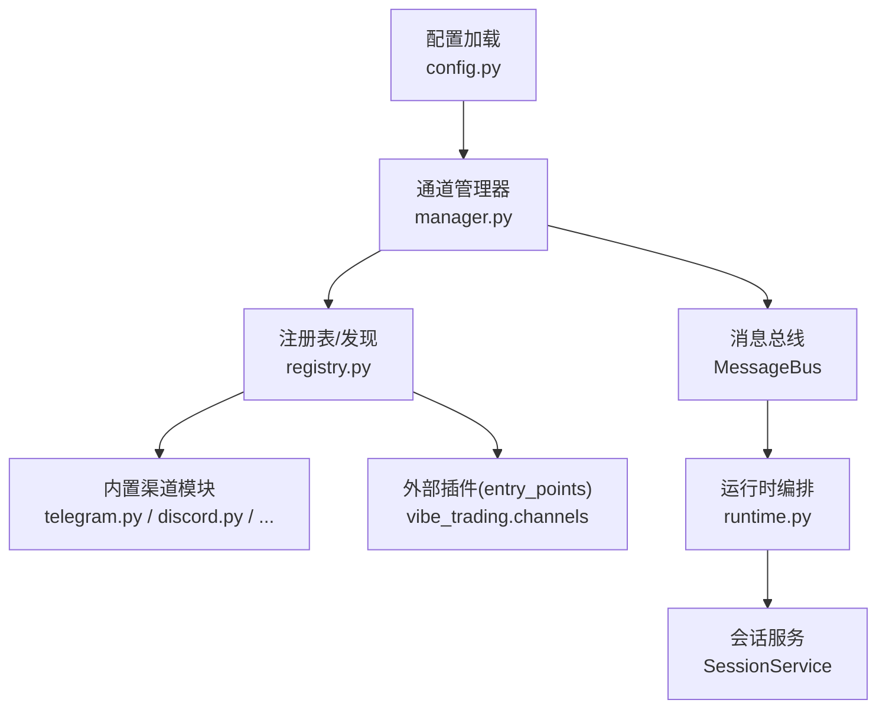
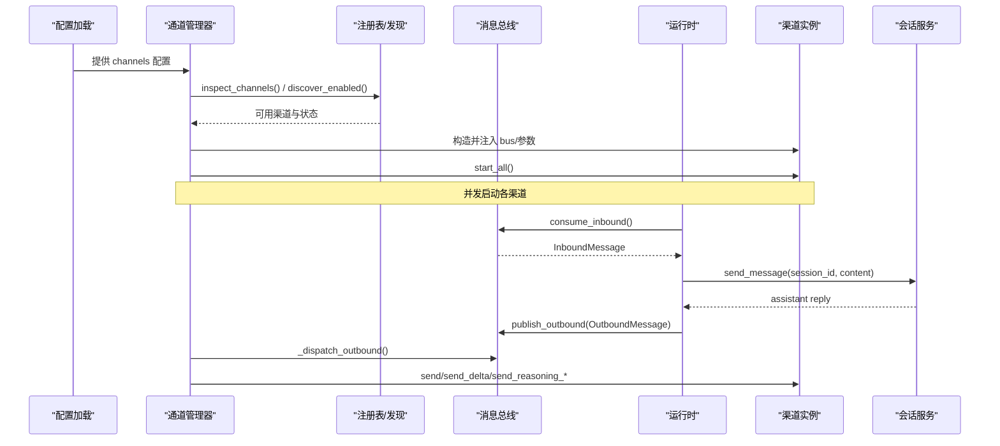
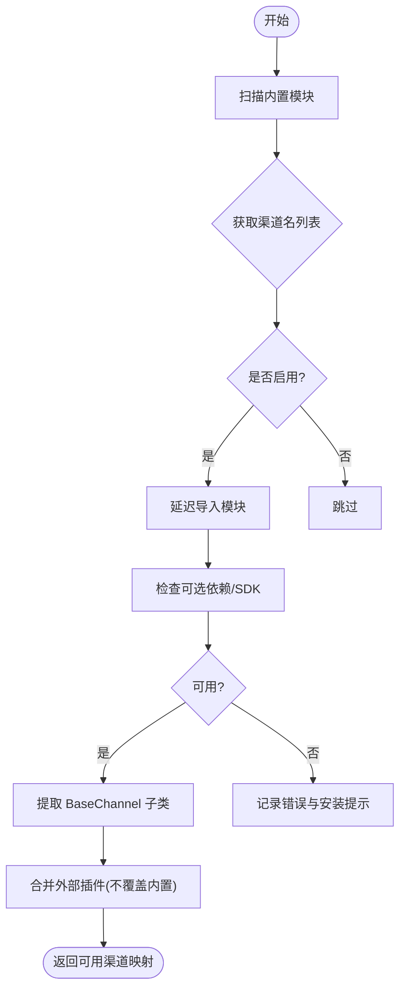
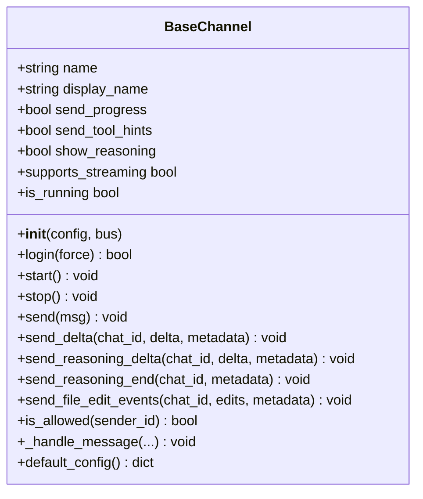
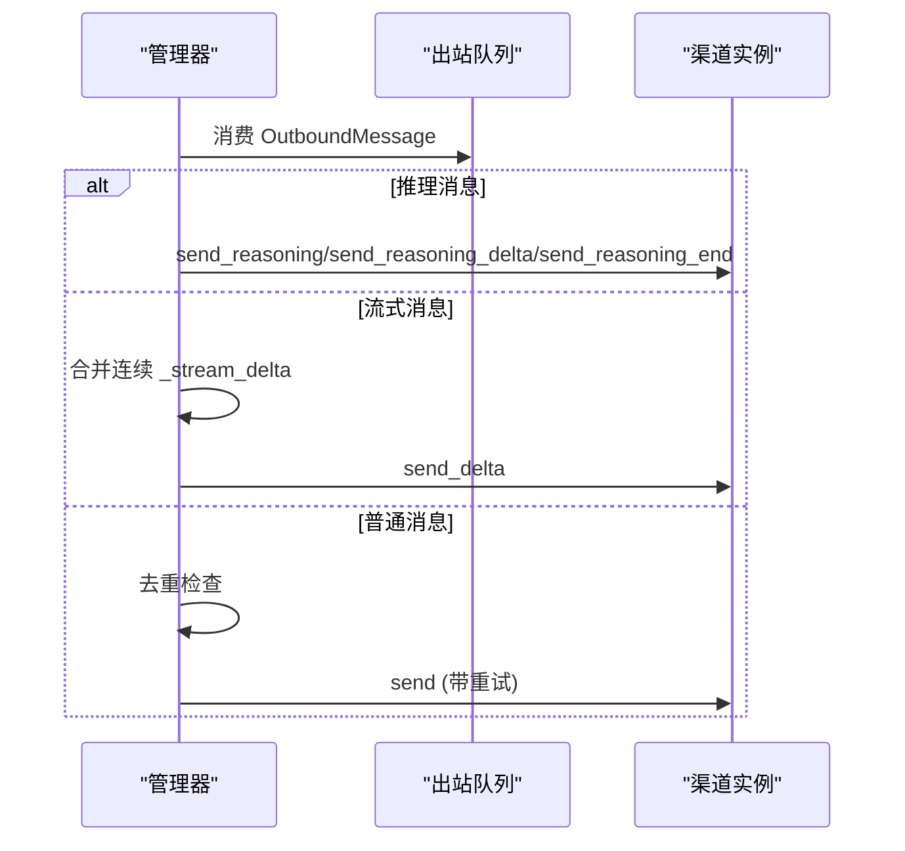
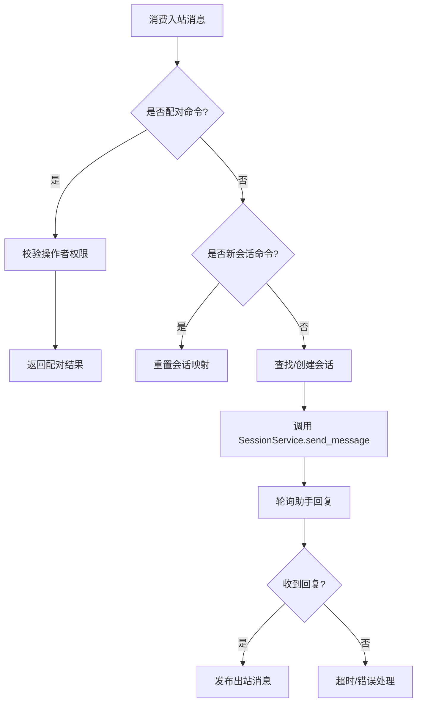
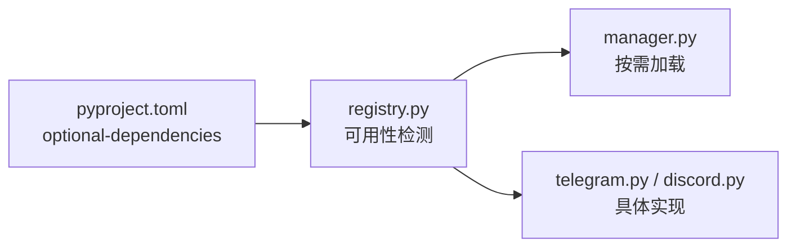

# 渠道注册机制

<cite>
**本文引用的文件**
- [agent/src/channels/registry.py](file://agent/src/channels/registry.py)
- [agent/src/channels/base.py](file://agent/src/channels/base.py)
- [agent/src/channels/manager.py](file://agent/src/channels/manager.py)
- [agent/src/channels/config.py](file://agent/src/channels/config.py)
- [agent/src/channels/runtime.py](file://agent/src/channels/runtime.py)
- [agent/src/channels/telegram.py](file://agent/src/channels/telegram.py)
- [agent/src/channels/discord.py](file://agent/src/channels/discord.py)
- [pyproject.toml](file://pyproject.toml)
- [agent/tests/test_channels_api.py](file://agent/tests/test_channels_api.py)
- [agent/tests/test_channels_runtime.py](file://agent/tests/test_channels_runtime.py)
</cite>

## 目录
1. [简介](#简介)
2. [项目结构](#项目结构)
3. [核心组件](#核心组件)
4. [架构总览](#架构总览)
5. [详细组件分析](#详细组件分析)
6. [依赖关系分析](#依赖关系分析)
7. [性能考量](#性能考量)
8. [故障排查指南](#故障排查指南)
9. [结论](#结论)
10. [附录：开发工具链与测试指南](#附录开发工具链与测试指南)

## 简介
本文件系统性阐述 Vibe-Trading 的渠道注册机制，覆盖动态发现、插件化加载、生命周期管理、元数据与版本兼容、冲突处理、错误恢复与性能监控，并提供自定义渠道开发与测试的实践指南。通过该机制，系统可在运行时自动扫描内置渠道模块与外部插件，按需加载并启动，将消息总线与聊天平台（如 Telegram、Discord、Slack 等）无缝集成。

## 项目结构
围绕渠道子系统的关键目录与职责如下：
- 注册与发现：src/channels/registry.py
- 抽象基类与权限控制：src/channels/base.py
- 通道管理器与出站路由：src/channels/manager.py
- 配置加载：src/channels/config.py
- 运行时编排与会话绑定：src/channels/runtime.py
- 具体渠道实现示例：src/channels/telegram.py、src/channels/discord.py
- 可选依赖声明：pyproject.toml
- 行为验证用例：agent/tests/test_channels_api.py、agent/tests/test_channels_runtime.py

图表来源
- [agent/src/channels/config.py:11-22](file://agent/src/channels/config.py#L11-L22)
- [agent/src/channels/manager.py:36-137](file://agent/src/channels/manager.py#L36-L137)
- [agent/src/channels/registry.py:87-284](file://agent/src/channels/registry.py#L87-L284)
- [agent/src/channels/runtime.py:34-112](file://agent/src/channels/runtime.py#L34-L112)

章节来源
- [agent/src/channels/config.py:11-22](file://agent/src/channels/config.py#L11-L22)
- [agent/src/channels/manager.py:36-137](file://agent/src/channels/manager.py#L36-L137)
- [agent/src/channels/registry.py:87-284](file://agent/src/channels/registry.py#L87-L284)
- [agent/src/channels/runtime.py:34-112](file://agent/src/channels/runtime.py#L34-L112)

## 核心组件
- 注册表与发现（registry.py）
  - 内置模块扫描：基于包内模块枚举，排除内部模块名集合，避免误报。
  - 插件发现：通过 entry_points(group="vibe_trading.channels") 加载外部渠道插件。
  - 可用性检查：惰性导入第三方 SDK，结合标志位与可选包检测，给出安装提示。
  - 启用筛选：仅导入已启用的渠道，降低启动开销。
  - 状态探测：inspect_channels 汇总所有内置与配置的渠道，标注 configured/enabled/available/loaded/running。
- 抽象基类（base.py）
  - 统一接口：start/stop/send、流式发送 send_delta、推理内容 send_reasoning_*、文件编辑事件 send_file_edit_events。
  - 权限与配对：is_allowed 支持 allow_from、配对码流程；_handle_message 封装入站消息到总线。
  - 默认配置：default_config 用于引导生成默认配置片段。
- 通道管理器（manager.py）
  - 初始化：解析配置、构建 channel 实例、应用全局布尔覆盖、记录状态。
  - 生命周期：start_all/stop_all 并发启动/停止各渠道，维护出站分发任务。
  - 出站路由：去重、流合并、重试退避、推理/进度/工具提示过滤。
  - 状态查询：get_status 暴露运行态。
- 配置加载（config.py）
  - 从结构化 Agent 配置中抽取 channels 部分，返回字典供管理器使用。
- 运行时（runtime.py）
  - 入站消费：从总线消费 InboundMessage，路由到 SessionService。
  - 会话映射：持久化 channel:chat_id -> session_id 映射，支持重置会话。
  - 命令处理：/pairing 授权校验与响应；/new 等会话控制命令。
  - 超时与错误：等待助手回复超时、忙状态友好提示、异常兜底回显。

章节来源
- [agent/src/channels/registry.py:87-284](file://agent/src/channels/registry.py#L87-L284)
- [agent/src/channels/base.py:22-238](file://agent/src/channels/base.py#L22-L238)
- [agent/src/channels/manager.py:36-479](file://agent/src/channels/manager.py#L36-L479)
- [agent/src/channels/config.py:11-22](file://agent/src/channels/config.py#L11-L22)
- [agent/src/channels/runtime.py:34-375](file://agent/src/channels/runtime.py#L34-L375)

## 架构总览
下图展示了从配置加载到渠道发现、实例化、启动、消息流转的全链路。

图表来源
- [agent/src/channels/config.py:11-22](file://agent/src/channels/config.py#L11-L22)
- [agent/src/channels/registry.py:193-284](file://agent/src/channels/registry.py#L193-L284)
- [agent/src/channels/manager.py:206-479](file://agent/src/channels/manager.py#L206-L479)
- [agent/src/channels/runtime.py:114-245](file://agent/src/channels/runtime.py#L114-L245)

## 详细组件分析

### 注册表与动态发现（registry.py）
- 内置模块扫描
  - 使用 pkgutil 枚举 src.channels 下非内部模块，得到候选渠道名列表。
  - 通过 importlib 延迟导入，仅在需要时加载具体模块，避免不必要的第三方依赖引入。
- 插件发现
  - 通过 entry_points(group="vibe_trading.channels") 读取外部插件注册的渠道类。
  - 内置渠道优先：同名外部插件会被忽略并记录警告，防止覆盖内置实现。
- 可用性检查与安装提示
  - 对每个渠道尝试导入并查找 BaseChannel 子类；若缺失可选依赖或 SDK 不可用，返回 ChannelAvailability 并附带 install_hint。
  - 支持懒加载包的可选依赖检测（如 whatsapp 的 neonize）。
- 启用筛选
  - discover_enabled 仅导入 enabled_names 中的渠道，减少启动时的导入成本。
- 状态探测
  - inspect_channels 聚合内置与配置项中的渠道，标注 configured/enabled/available/loaded/running，便于 API 展示。

图表来源
- [agent/src/channels/registry.py:87-284](file://agent/src/channels/registry.py#L87-L284)

章节来源
- [agent/src/channels/registry.py:87-284](file://agent/src/channels/registry.py#L87-L284)

### 抽象基类与权限控制（base.py）
- 统一接口
  - start/stop：启动监听与资源清理。
  - send：发送完整消息；send_delta：流式增量；send_reasoning_*：推理内容流；send_file_edit_events：文件编辑活动。
- 权限与配对
  - is_allowed：支持 allow_from 白名单、* 通配、以及配对存储批准。
  - _handle_message：未授权 DM 场景下发配对码；通过后封装为 InboundMessage 发布到总线。
- 默认配置
  - default_config：返回默认 enabled=False 的配置片段，便于引导。

图表来源
- [agent/src/channels/base.py:22-238](file://agent/src/channels/base.py#L22-L238)

章节来源
- [agent/src/channels/base.py:22-238](file://agent/src/channels/base.py#L22-L238)

### 通道管理器与出站路由（manager.py）
- 初始化与状态
  - 调用 inspect_channels 收集状态，解析 enabled 列表，加载插件与内置渠道类。
  - 构建 channel 实例，应用全局布尔覆盖（send_progress/send_tool_hints/show_reasoning），记录 loaded/running。
- 启动与停止
  - start_all 并发启动各渠道，创建出站分发任务；stop_all 取消分发任务并逐个 stop。
- 出站分发
  - 推理消息优先路由；进度/工具提示按开关过滤；流式消息合并以减少 API 调用；重复消息去重。
  - 失败重试：指数退避（1s/2s/4s），可配置最大重试次数。
- 状态查询
  - get_status 返回各渠道 enabled/loaded/running/display_name 等。

图表来源
- [agent/src/channels/manager.py:206-479](file://agent/src/channels/manager.py#L206-L479)

章节来源
- [agent/src/channels/manager.py:206-479](file://agent/src/channels/manager.py#L206-L479)

### 运行时编排与会话绑定（runtime.py）
- 入站消费与会话映射
  - 持续消费 InboundMessage，按 channel:chat_id 映射到持久化的 session_id。
  - 首次会话创建后写入 sessions.json，支持重启恢复。
- 命令处理
  - /pairing：校验操作者权限（全局或频道级），返回配对结果。
  - /new、/reset、/newsession：重置当前会话。
- 回复等待与错误处理
  - 轮询 SessionService 的最新助手消息，超时返回最后一条；忙状态友好提示；异常兜底回显错误信息。

图表来源
- [agent/src/channels/runtime.py:114-245](file://agent/src/channels/runtime.py#L114-L245)

章节来源
- [agent/src/channels/runtime.py:114-245](file://agent/src/channels/runtime.py#L114-L245)

### 具体渠道实现要点
- Telegram（telegram.py）
  - 长消息拆分、HTML 转义、Markdown 表格渲染、流式编辑策略等。
  - 通过 BaseChannel 接入消息总线。
- Discord（discord.py）
  - 客户端事件转发、应用命令注册、线程/频道允许策略、流式缓冲区等。
  - 通过 BaseChannel 接入消息总线。

章节来源
- [agent/src/channels/telegram.py:1-200](file://agent/src/channels/telegram.py#L1-L200)
- [agent/src/channels/discord.py:1-200](file://agent/src/channels/discord.py#L1-L200)

## 依赖关系分析
- 可选依赖与可用性
  - pyproject.toml 中定义各渠道的 optional-dependencies（如 telegram、discord、slack 等）。
  - registry.py 通过 _AVAILABILITY_FLAGS 与 _LAZY_IMPORT_PACKAGES 检测 SDK 是否可用，并在不可用时提供安装提示。
- 插件扩展点
  - 外部插件通过 entry_points(group="vibe_trading.channels") 注册渠道类，名称与内置冲突时以内置为准。

图表来源
- [pyproject.toml:105-200](file://pyproject.toml#L105-L200)
- [agent/src/channels/registry.py:52-63](file://agent/src/channels/registry.py#L52-L63)
- [agent/src/channels/registry.py:223-238](file://agent/src/channels/registry.py#L223-L238)

章节来源
- [pyproject.toml:105-200](file://pyproject.toml#L105-L200)
- [agent/src/channels/registry.py:52-63](file://agent/src/channels/registry.py#L52-L63)
- [agent/src/channels/registry.py:223-238](file://agent/src/channels/registry.py#L223-L238)

## 性能考量
- 延迟导入与最小化依赖
  - 仅导入已启用渠道，避免第三方 SDK 的冷启动开销。
- 出站合并与去重
  - 流式消息合并减少 API 调用；重复消息指纹去重降低冗余。
- 重试与退避
  - 指数退避重试提升鲁棒性，同时避免雪崩。
- 并发启动
  - 多渠道路由并发启动，缩短整体启动时间。

[本节为通用指导，无需特定文件引用]

## 故障排查指南
- 渠道不可用或缺失依赖
  - 现象：status 中 available=False，包含 error 与 install_hint。
  - 处理：根据 install_hint 安装对应可选依赖，或确认 SDK 标志位。
- 启动失败
  - 现象：loaded=False，error 字段包含异常信息。
  - 处理：查看日志定位异常原因，修正配置或依赖。
- 出站失败
  - 现象：多次重试仍失败，日志记录失败次数与延迟。
  - 处理：检查网络、凭据与平台限制；必要时调整 send_max_retries。
- 会话忙或超时
  - 现象：用户快速发消息被拒绝或提示仍在处理。
  - 处理：等待回复或使用 /new 重置会话；调整 reply_timeout_s。

章节来源
- [agent/src/channels/registry.py:130-160](file://agent/src/channels/registry.py#L130-L160)
- [agent/src/channels/manager.py:206-479](file://agent/src/channels/manager.py#L206-L479)
- [agent/src/channels/runtime.py:114-245](file://agent/src/channels/runtime.py#L114-L245)

## 结论
Vibe-Trading 的渠道注册机制通过“扫描+惰性导入+插件扩展”的组合，实现了高内聚、低耦合的动态渠道生态。管理器负责生命周期与出站路由，运行时负责入站到会话的桥接，配合完善的可用性检测、错误恢复与性能优化，使多渠道接入具备可扩展性与稳定性。

[本节为总结，无需特定文件引用]

## 附录：开发工具链与测试指南
- 自定义渠道开发步骤
  - 新建模块：在 src/channels 下新增渠道模块，实现 BaseChannel 的抽象方法。
  - 可选依赖：在 pyproject.toml 中添加可选依赖分组，并在模块中做可用性检测。
  - 插件注册：如需作为外部插件，通过 entry_points(group="vibe_trading.channels") 注册渠道类。
  - 配置引导：在渠道类中实现 default_config，便于自动生成配置片段。
- 测试框架使用
  - 单元测试：参考 test_channels_runtime.py，使用 MessageBus 与 FakeSessionService 模拟环境，验证发现、状态与路由逻辑。
  - API 测试：参考 test_channels_api.py，通过 TestClient 验证 /channels/status、/channels/start、/channels/stop 等行为。
  - 覆盖率建议：覆盖 discover_channel_names、inspect_channels、discover_plugins、ChannelManager.start_all/stop_all、ChannelRuntime._handle_inbound 等关键路径。

章节来源
- [agent/tests/test_channels_runtime.py:75-193](file://agent/tests/test_channels_runtime.py#L75-L193)
- [agent/tests/test_channels_api.py:17-102](file://agent/tests/test_channels_api.py#L17-L102)