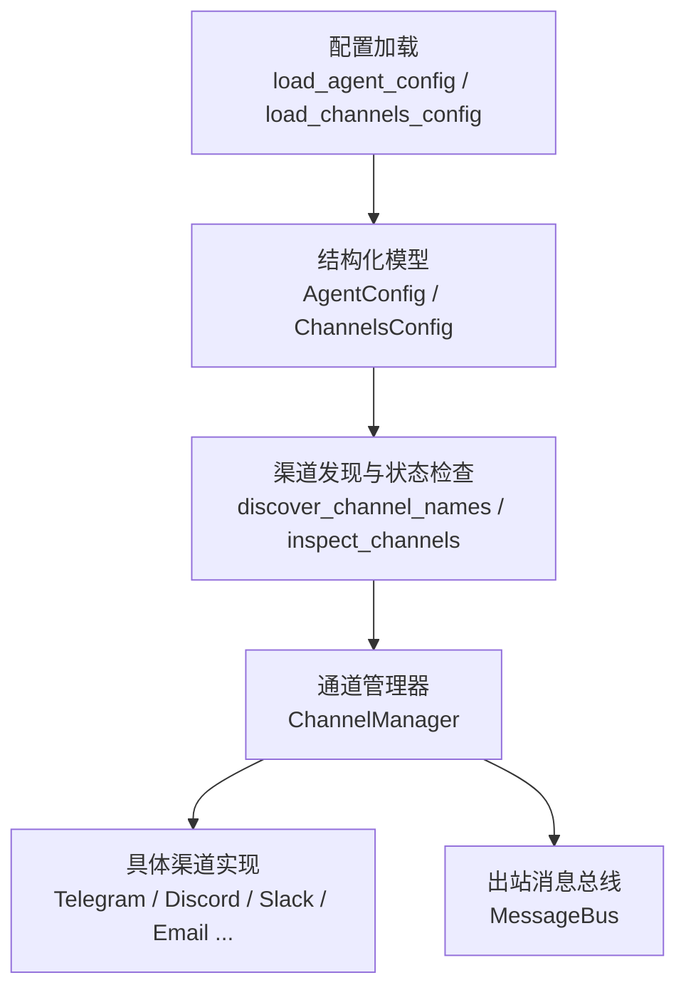
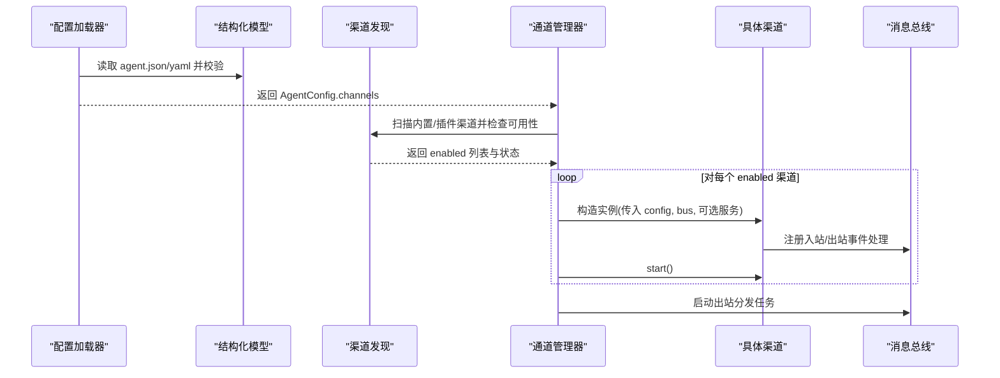
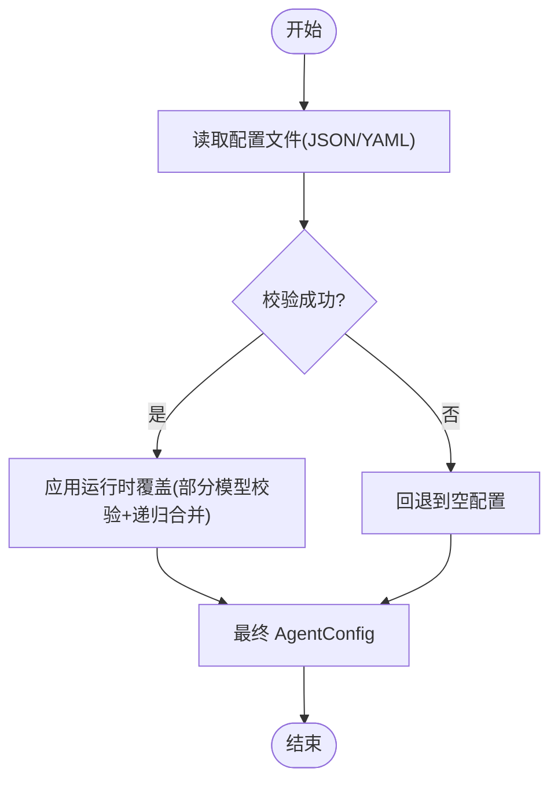
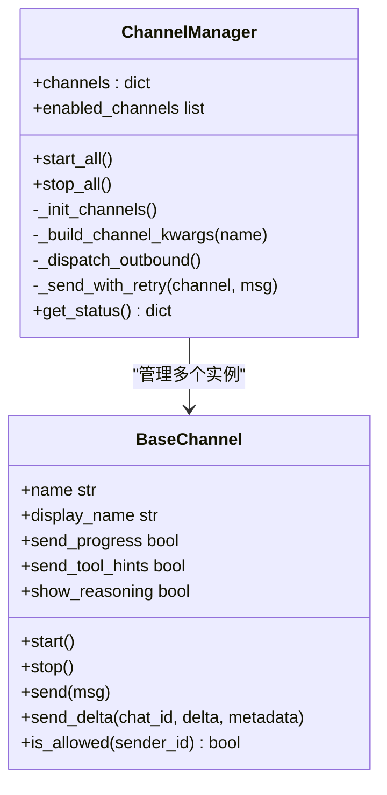
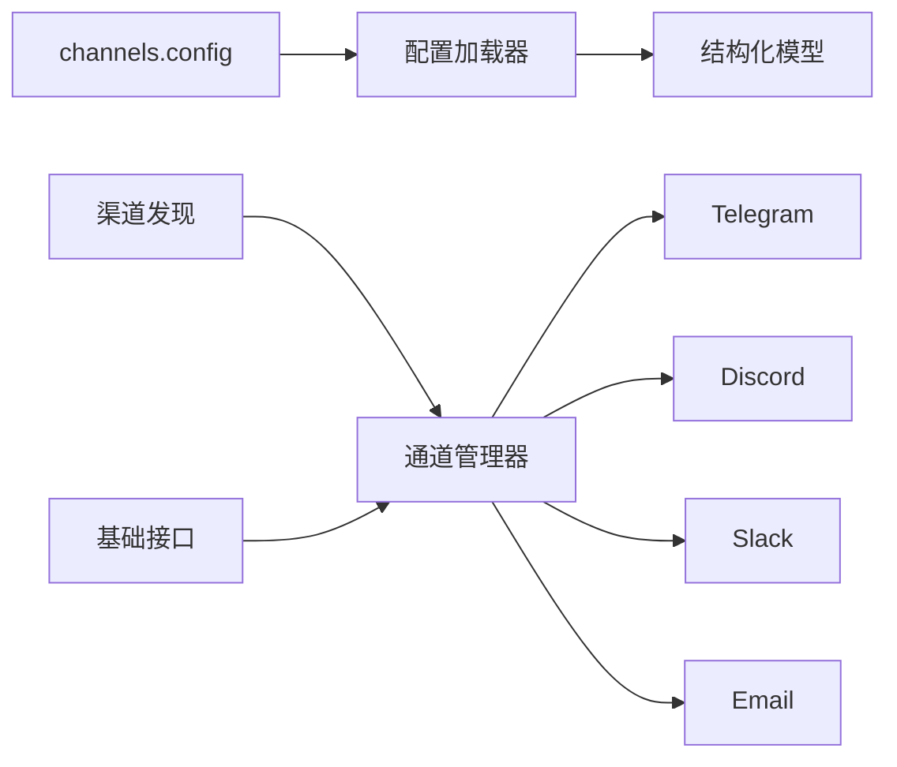

# 渠道配置管理

<cite>
**本文引用的文件**   
- [config.py](file://agent/src/channels/config.py)
- [manager.py](file://agent/src/channels/manager.py)
- [base.py](file://agent/src/channels/base.py)
- [registry.py](file://agent/src/channels/registry.py)
- [schema.py](file://agent/src/config/schema.py)
- [loader.py](file://agent/src/config/loader.py)
- [telegram.py](file://agent/src/channels/telegram.py)
- [discord.py](file://agent/src/channels/discord.py)
- [slack.py](file://agent/src/channels/slack.py)
- [email.py](file://agent/src/channels/email.py)
</cite>

## 目录
1. [简介](#简介)
2. [项目结构](#项目结构)
3. [核心组件](#核心组件)
4. [架构总览](#架构总览)
5. [详细组件分析](#详细组件分析)
6. [依赖关系分析](#依赖关系分析)
7. [性能与可靠性](#性能与可靠性)
8. [故障排除指南](#故障排除指南)
9. [结论](#结论)
10. [附录：渠道配置示例与迁移建议](#附录渠道配置示例与迁移建议)

## 简介
本文件面向 Vibe-Trading 的“渠道配置管理”，系统性说明渠道配置的加载顺序、优先级、热重载支持、验证规则、默认值机制、安全策略（敏感信息保护）、以及常见渠道的配置要点。内容覆盖从简单文本渠道到复杂富媒体渠道，并给出调试与排障方法。

## 项目结构
Vibe-Trading 将渠道配置抽象为结构化模型，并通过统一的 ChannelManager 进行发现、初始化、启停与消息路由。渠道实现以插件化方式注册，支持内置模块与外部插件。

**图表来源**
- [loader.py:28-55](file://agent/src/config/loader.py#L28-L55)
- [config.py:11-22](file://agent/src/channels/config.py#L11-L22)
- [registry.py:87-220](file://agent/src/channels/registry.py#L87-L220)
- [manager.py:36-137](file://agent/src/channels/manager.py#L36-L137)

**章节来源**
- [loader.py:28-55](file://agent/src/config/loader.py#L28-L55)
- [config.py:11-22](file://agent/src/channels/config.py#L11-L22)
- [registry.py:87-220](file://agent/src/channels/registry.py#L87-L220)
- [manager.py:36-137](file://agent/src/channels/manager.py#L36-L137)

## 核心组件
- 配置加载器：负责读取磁盘配置文件（JSON/YAML），解析为结构化模型，并支持运行时覆盖合并。
- 结构化模型：定义全局渠道配置字段、校验规则、别名兼容（snake_case/camelCase）。
- 渠道发现与注册：扫描内置渠道与外部插件，检测可用性与安装提示。
- 通道管理器：根据配置启用渠道，构建参数，启动/停止，统一出站消息分发与重试。
- 基础接口：定义各渠道需实现的发送、流式更新、权限控制等能力。

**章节来源**
- [loader.py:28-151](file://agent/src/config/loader.py#L28-L151)
- [schema.py:429-457](file://agent/src/config/schema.py#L429-L457)
- [registry.py:87-220](file://agent/src/channels/registry.py#L87-L220)
- [manager.py:36-137](file://agent/src/channels/manager.py#L36-L137)
- [base.py:22-178](file://agent/src/channels/base.py#L22-L178)

## 架构总览
下图展示从配置加载到渠道运行的端到端流程，包括发现、初始化、启动与出站分发。

**图表来源**
- [loader.py:28-55](file://agent/src/config/loader.py#L28-L55)
- [config.py:11-22](file://agent/src/channels/config.py#L11-L22)
- [registry.py:193-220](file://agent/src/channels/registry.py#L193-L220)
- [manager.py:64-137](file://agent/src/channels/manager.py#L64-L137)
- [manager.py:213-230](file://agent/src/channels/manager.py#L213-L230)

## 详细组件分析

### 配置加载与优先级
- 加载顺序与回退
  - 优先使用显式路径；否则按运行时根目录查找 swarm-agent.json，再回退到 agent.json/yaml/yml。
  - 若文件不存在或解析失败，回退为空配置对象，保证系统可启动。
- 运行时覆盖
  - 支持 session-level 覆盖，先按部分模型校验，再递归合并，最后整体校验。
  - 对 mcpServers/mcp_servers 等高风险键默认剥离，除非设置环境变量允许注入。
- 热重载支持
  - 通过 merge_agent_config_overrides 可在运行时动态叠加覆盖层，无需重启进程。

**图表来源**
- [loader.py:28-55](file://agent/src/config/loader.py#L28-L55)
- [loader.py:57-100](file://agent/src/config/loader.py#L57-L100)
- [loader.py:137-151](file://agent/src/config/loader.py#L137-L151)
- [loader.py:154-229](file://agent/src/config/loader.py#L154-L229)

**章节来源**
- [loader.py:28-55](file://agent/src/config/loader.py#L28-L55)
- [loader.py:57-100](file://agent/src/config/loader.py#L57-L100)
- [loader.py:107-151](file://agent/src/config/loader.py#L107-L151)
- [loader.py:154-229](file://agent/src/config/loader.py#L154-L229)

### 全局渠道配置与默认值
- 全局字段（ChannelsConfig）
  - send_progress：是否向渠道发送进度消息（默认开启）。
  - send_tool_hints：是否发送工具提示（默认关闭）。
  - send_max_retries：出站重试次数上限（1–10，默认2）。
  - reply_timeout_s：回复超时（秒，范围 1–86400，默认600）。
  - operators：跨渠道操作者白名单（默认空，严格模式）。
- 别名兼容
  - 支持 snake_case 与 camelCase 双写，内部统一映射。
- 默认值与校验
  - 所有字段均有默认值与边界约束，避免非法配置导致崩溃。

**章节来源**
- [schema.py:429-457](file://agent/src/config/schema.py#L429-L457)
- [schema.py:301-305](file://agent/src/config/schema.py#L301-L305)

### 渠道发现与启用
- 内置渠道扫描：通过包扫描获取模块名，过滤内部模块。
- 插件发现：通过 entry_points 组加载外部渠道类。
- 可用性检查：捕获导入错误与可选依赖缺失，输出安装提示。
- 启用判定：仅当 channel 段 enabled=true 时才会被初始化。

**章节来源**
- [registry.py:87-127](file://agent/src/channels/registry.py#L87-L127)
- [registry.py:130-160](file://agent/src/channels/registry.py#L130-L160)
- [registry.py:163-220](file://agent/src/channels/registry.py#L163-L220)

### 通道管理器与出站分发
- 初始化流程
  - 收集 enabled 名称，加载对应类，构建构造参数（如 websocket/matrix 的特殊服务注入）。
  - 解析全局布尔开关到每个渠道实例（send_progress/send_tool_hints/show_reasoning）。
  - 记录渠道状态（available/loaded/running/error/display_name）。
- 出站分发
  - 去重：基于内容指纹与 origin_message_id 抑制重复。
  - 流式聚合：合并同一目标连续 _stream_delta 消息以减少 API 调用。
  - 重试：指数退避（1s/2s/4s），最大尝试次数由 send_max_retries 控制。
  - 推理流：_reasoning_* 消息仅在 show_reasoning 开启时转发。
- 权限校验
  - allow_from/allowFrom 白名单；未配置时在 DM 中下发配对码。

**图表来源**
- [manager.py:36-137](file://agent/src/channels/manager.py#L36-L137)
- [manager.py:213-230](file://agent/src/channels/manager.py#L213-L230)
- [manager.py:256-453](file://agent/src/channels/manager.py#L256-L453)
- [base.py:22-178](file://agent/src/channels/base.py#L22-L178)

**章节来源**
- [manager.py:64-137](file://agent/src/channels/manager.py#L64-L137)
- [manager.py:213-230](file://agent/src/channels/manager.py#L213-L230)
- [manager.py:256-453](file://agent/src/channels/manager.py#L256-L453)
- [base.py:154-178](file://agent/src/channels/base.py#L154-L178)

### 渠道实现要点与配置项

#### Telegram
- 关键配置
  - enabled/token/mode(polling/webhook)/proxy
  - allow_from/group_policy/reply_to_message/react_emoji
  - streaming/inline_keyboards/rich_messages/stream_edit_interval
  - webhook_url/webhook_listen_host/webhook_listen_port/webhook_path/webhook_secret_token/webhook_max_connections
- 行为要点
  - Webhook 模式要求 HTTPS 公网 URL 与 secret token。
  - 长轮询与 Webhook 两种接收模式；支持富消息与内联键盘。
  - 消息长度限制与 HTML 拆分，保障不溢出。

**章节来源**
- [telegram.py:368-421](file://agent/src/channels/telegram.py#L368-L421)
- [telegram.py:423-479](file://agent/src/channels/telegram.py#L423-L479)
- [telegram.py:510-624](file://agent/src/channels/telegram.py#L510-L624)

#### Discord
- 关键配置
  - enabled/token/allow_from/allow_channels/intents/group_policy
  - read_receipt_emoji/working_emoji/working_emoji_delay/streaming/proxy(proxy_username/proxy_password)
- 行为要点
  - 支持 Slash 命令、线程上下文、附件下载与大小限制。
  - 流式编辑：首条消息后持续 edit 直至结束。
  - 群组策略：mention/open；支持父频道识别。

**章节来源**
- [discord.py:50-66](file://agent/src/channels/discord.py#L50-L66)
- [discord.py:339-447](file://agent/src/channels/discord.py#L339-L447)
- [discord.py:473-531](file://agent/src/channels/discord.py#L473-L531)

#### Slack
- 关键配置
  - enabled/mode/socket/webhook_path/bot_token/app_token/user_token_read_only
  - reply_in_thread/react_emoji/done_emoji/include_thread_context/thread_context_limit
  - allow_from/group_policy/group_allow_from/group_require_mention
  - dm.enabled/policy/allow_from
- 行为要点
  - Socket Mode 连接，带握手超时保护。
  - 支持按钮交互、线程上下文拉取、目标 ID/名称解析。
  - 群组策略：open/mention/allowlist（可要求 @提及）。

**章节来源**
- [slack.py:25-55](file://agent/src/channels/slack.py#L25-L55)
- [slack.py:92-140](file://agent/src/channels/slack.py#L92-L140)
- [slack.py:151-200](file://agent/src/channels/slack.py#L151-L200)
- [slack.py:642-671](file://agent/src/channels/slack.py#L642-L671)

#### Email
- 关键配置
  - enabled/consent_granted
  - IMAP: host/port/username/password/mailbox/use_ssl
  - SMTP: host/port/username/password/use_tls/use_ssl/from_address
  - auto_reply_enabled/poll_interval_seconds/mark_seen/post_action/post_action_move_mailbox/expunge/ignore_skipped
  - max_body_chars/subject_prefix/allow_from
  - verify_dkim/verify_spf
  - allowed_attachment_types/max_attachment_size/max_attachments_per_email
- 行为要点
  - IMAP 轮询收件箱，SMTP 发件；支持自动回复与后置动作（删除/移动）。
  - 反欺骗：DKIM/SPF 校验；附件类型与大小限制。
  - 会话关联：In-Reply-To/References 保持对话链。

**章节来源**
- [email.py:33-73](file://agent/src/channels/email.py#L33-L73)
- [email.py:141-205](file://agent/src/channels/email.py#L141-L205)
- [email.py:210-311](file://agent/src/channels/email.py#L210-L311)
- [email.py:313-334](file://agent/src/channels/email.py#L313-L334)

## 依赖关系分析
- 配置层依赖
  - loader 依赖 schema 模型进行强校验；channels.config 复用 loader 获取 channels 段。
- 渠道层依赖
  - manager 依赖 registry 进行发现与可用性检查；依赖 base 定义统一接口。
  - 各渠道实现依赖各自 SDK（如 telegram、discord、slack_sdk、imaplib/smtplib）。
- 外部依赖
  - 可选依赖通过 availability flags 与 lazy import 探测，提供安装提示。

**图表来源**
- [loader.py:28-55](file://agent/src/config/loader.py#L28-L55)
- [config.py:11-22](file://agent/src/channels/config.py#L11-L22)
- [registry.py:87-220](file://agent/src/channels/registry.py#L87-L220)
- [manager.py:36-137](file://agent/src/channels/manager.py#L36-L137)

**章节来源**
- [loader.py:28-55](file://agent/src/config/loader.py#L28-L55)
- [config.py:11-22](file://agent/src/channels/config.py#L11-L22)
- [registry.py:87-220](file://agent/src/channels/registry.py#L87-L220)
- [manager.py:36-137](file://agent/src/channels/manager.py#L36-L137)

## 性能与可靠性
- 出站重试与退避：指数退避（1/2/4 秒），最大尝试次数受 send_max_retries 控制。
- 流式聚合：合并连续 _stream_delta 减少 API 调用。
- 去重：基于内容指纹与消息 ID 抑制重复。
- 资源隔离：Telegram 分离 getUpdates 与 API 请求池，避免争用。
- 超时与断开保护：Slack Socket Mode 握手超时；Email IMAP 断线重连标记。

**章节来源**
- [manager.py:26-27](file://agent/src/channels/manager.py#L26-L27)
- [manager.py:371-419](file://agent/src/channels/manager.py#L371-L419)
- [manager.py:421-453](file://agent/src/channels/manager.py#L421-L453)
- [telegram.py:520-534](file://agent/src/channels/telegram.py#L520-L534)
- [slack.py:120-134](file://agent/src/channels/slack.py#L120-L134)
- [email.py:110-124](file://agent/src/channels/email.py#L110-L124)

## 故障排除指南
- 渠道不可用
  - 现象：status 显示 available=false，附带 error 与 install_hint。
  - 排查：确认已安装对应可选依赖；检查环境变量标志位；查看日志中的 ImportError。
- 无法启动
  - 现象：channel 未 loaded/running。
  - 排查：检查 enabled 字段；核对必填参数（如 token、webhook_url、secret_token）；查看异常堆栈。
- 出站失败
  - 现象：多次重试仍失败。
  - 排查：检查网络/代理；确认速率限制；查看 send_max_retries 与退避间隔；关注 _retry_wait 元数据。
- 权限拒绝
  - 现象：DM 收到配对码或群聊忽略消息。
  - 排查：在 allow_from/allowFrom 中添加 sender；或在平台侧完成 pairing 授权。
- Email 特殊问题
  - 现象：无法下载私有文件或认证失败。
  - 排查：确认 bot token 权限；检查 SPF/DKIM 校验；调整 allowed_attachment_types 与大小限制。

**章节来源**
- [registry.py:130-160](file://agent/src/channels/registry.py#L130-L160)
- [manager.py:75-137](file://agent/src/channels/manager.py#L75-L137)
- [manager.py:421-453](file://agent/src/channels/manager.py#L421-L453)
- [base.py:165-178](file://agent/src/channels/base.py#L165-L178)
- [email.py:456-495](file://agent/src/channels/email.py#L456-L495)

## 结论
Vibe-Trading 的渠道配置体系以结构化模型为核心，结合严格的校验与安全的默认值，确保多平台渠道的稳定接入与运行。通过统一的 ChannelManager 与消息总线，实现了高可靠的消息分发与流式体验。配合丰富的渠道实现与灵活的权限控制，既能满足简单文本场景，也能支撑富媒体与复杂交互需求。

## 附录：渠道配置示例与迁移建议

### 配置示例（描述性）
- 简单文本渠道（Email）
  - 启用：enabled=true
  - 认证：IMAP/SMTP 主机、端口、用户名、密码
  - 安全：开启 DKIM/SPF 校验；限制附件类型与大小
  - 行为：自动回复、轮询间隔、后置动作（删除/移动）
- 即时通讯渠道（Telegram）
  - 启用：enabled=true
  - 认证：token；Webhook 模式需 HTTPS 公网 URL 与 secret token
  - 行为：polling/webhook 模式选择；富消息与内联键盘；流式编辑间隔
- 即时通讯渠道（Discord）
  - 启用：enabled=true
  - 认证：token；可选代理与凭据
  - 行为：群组策略（mention/open）；附件大小限制；流式编辑
- 企业协作渠道（Slack）
  - 启用：enabled=true
  - 认证：bot_token/app_token；Socket Mode
  - 行为：线程上下文；按钮交互；群组策略（open/mention/allowlist）

### 安全配置与敏感信息保护
- 敏感字段
  - token、password、secret_token、client_secret 等应保存在受保护的配置文件中，避免硬编码。
- 传输安全
  - OAuth 必须使用 HTTPS；禁止明文传输刷新令牌。
- 访问控制
  - 使用 allow_from/allowFrom 白名单；operators 用于跨渠道管理权限。
- 最小权限
  - 仅启用必要工具与功能；对 live broker 禁用通配工具列表。

**章节来源**
- [schema.py:307-347](file://agent/src/config/schema.py#L307-L347)
- [schema.py:349-412](file://agent/src/config/schema.py#L349-L412)
- [schema.py:458-492](file://agent/src/config/schema.py#L458-L492)
- [base.py:165-178](file://agent/src/channels/base.py#L165-L178)

### 配置迁移策略
- 版本兼容
  - 支持 snake_case 与 camelCase 双写；旧键保留兼容映射。
- 逐步替换
  - 通过运行时覆盖逐步替换旧配置；先验证覆盖层，再持久化。
- 回退机制
  - 解析失败或校验失败时回退到空配置，保证系统可用性。
- 审计与日志
  - 记录加载失败原因与详情；便于定位迁移问题。

**章节来源**
- [schema.py:301-305](file://agent/src/config/schema.py#L301-L305)
- [loader.py:57-100](file://agent/src/config/loader.py#L57-L100)
- [loader.py:28-55](file://agent/src/config/loader.py#L28-L55)