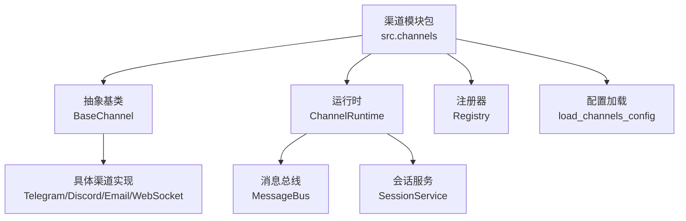
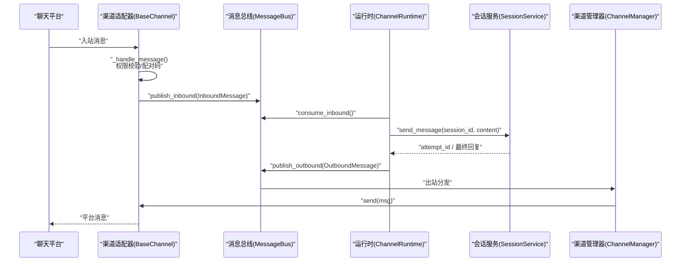
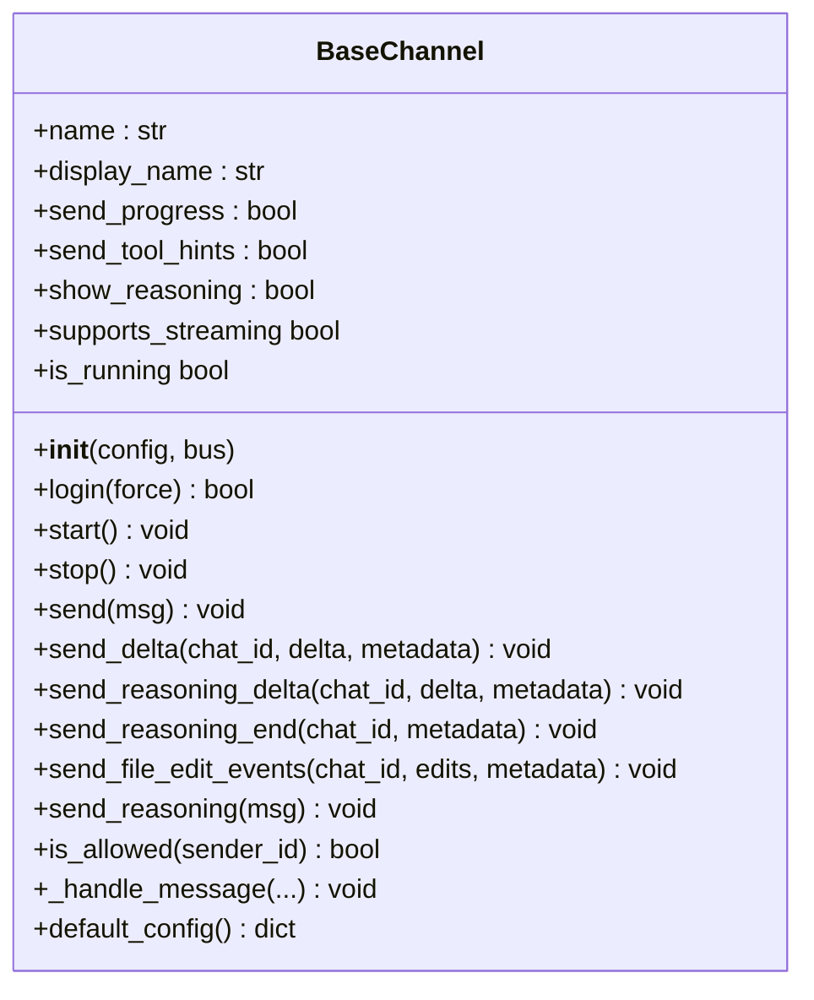
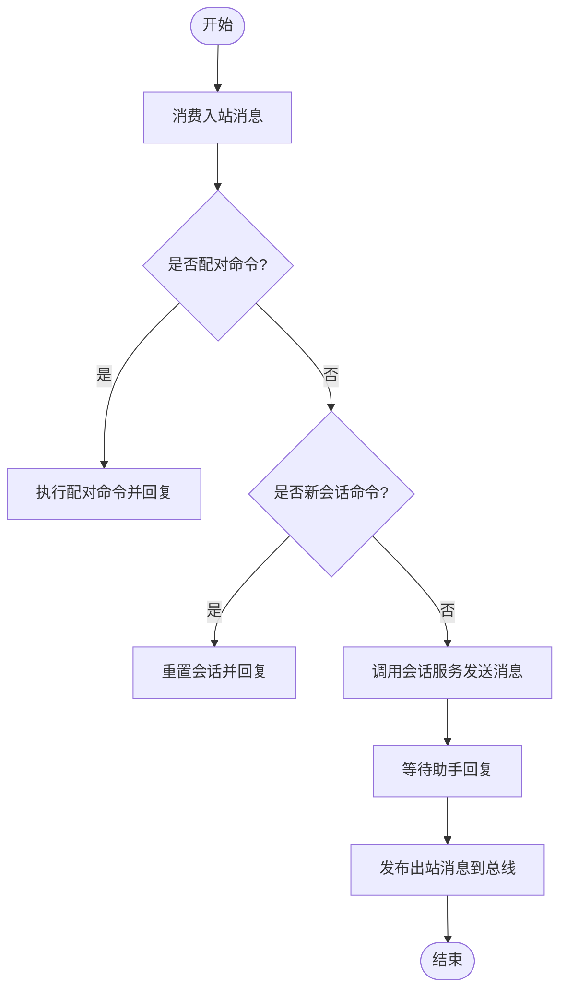
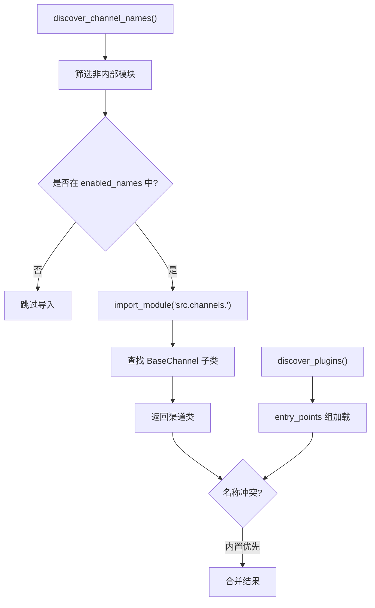
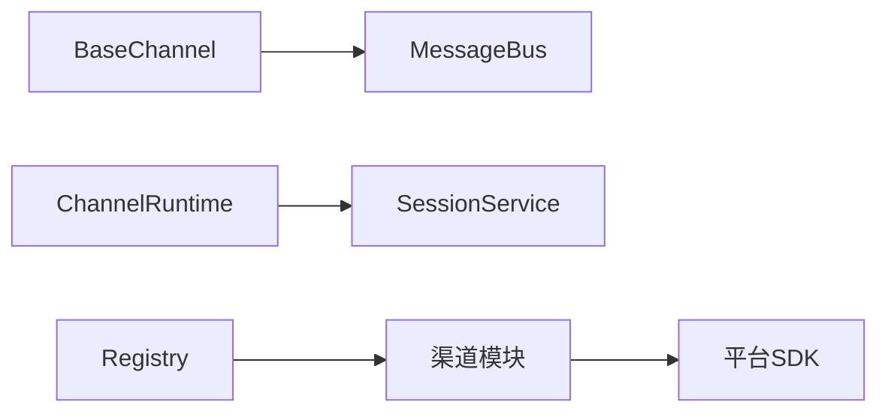

# 自定义渠道开发

<cite>
**本文引用的文件**
- [agent/src/channels/base.py](file://agent/src/channels/base.py)
- [agent/src/channels/registry.py](file://agent/src/channels/registry.py)
- [agent/src/channels/config.py](file://agent/src/channels/config.py)
- [agent/src/channels/runtime.py](file://agent/src/channels/runtime.py)
- [agent/src/channels/__init__.py](file://agent/src/channels/__init__.py)
- [agent/src/channels/telegram.py](file://agent/src/channels/telegram.py)
- [agent/src/channels/discord.py](file://agent/src/channels/discord.py)
- [agent/src/channels/email.py](file://agent/src/channels/email.py)
- [agent/src/channels/websocket.py](file://agent/src/channels/websocket.py)
- [agent/tests/test_channels_runtime.py](file://agent/tests/test_channels_runtime.py)
</cite>

## 目录
1. [简介](#简介)
2. [项目结构](#项目结构)
3. [核心组件](#核心组件)
4. [架构总览](#架构总览)
5. [详细组件分析](#详细组件分析)
6. [依赖关系分析](#依赖关系分析)
7. [性能考虑](#性能考虑)
8. [故障排查指南](#故障排查指南)
9. [结论](#结论)
10. [附录](#附录)

## 简介
本指南面向需要在 Vibe-Trading 中实现“自定义渠道”的开发者。你将基于抽象基类 BaseChannel 创建新的渠道适配器，掌握必须实现的接口、可选的流式传输方法、配置与验证、注册与动态加载机制，以及错误处理、重试、资源管理与性能优化实践。文末提供从简单文本到富媒体的完整开发示例路径与调试测试建议。

## 项目结构
Vibe-Trading 的渠道子系统位于 agent/src/channels 下，采用插件化架构：
- 抽象层：BaseChannel 定义统一接口与通用能力（权限校验、配对码、默认配置等）。
- 运行时：ChannelRuntime 负责将入站消息路由到会话服务，并协调 ChannelManager 启动/停止各渠道。
- 注册与发现：Registry 自动发现内置渠道与外部插件，支持按需导入与可用性检查。
- 配置加载：Config 从结构化 Agent 配置中解析 channels 段。
- 具体实现：Telegram、Discord、Email、WebSocket 等作为参考实现。

图表来源
- [agent/src/channels/__init__.py:1-35](file://agent/src/channels/__init__.py#L1-L35)
- [agent/src/channels/base.py:22-46](file://agent/src/channels/base.py#L22-L46)
- [agent/src/channels/runtime.py:34-81](file://agent/src/channels/runtime.py#L34-L81)
- [agent/src/channels/registry.py:87-127](file://agent/src/channels/registry.py#L87-L127)
- [agent/src/channels/config.py:11-21](file://agent/src/channels/config.py#L11-L21)

章节来源
- [agent/src/channels/__init__.py:1-35](file://agent/src/channels/__init__.py#L1-L35)

## 核心组件
- BaseChannel：所有渠道适配器的抽象基类，定义生命周期与发送接口，并提供权限控制、配对码、流式钩子等通用逻辑。
- ChannelRuntime：运行期编排者，消费 MessageBus 入站消息，映射到会话，等待回复后回发到对应渠道。
- Registry：扫描内置渠道模块与外部插件入口点，返回可用渠道类；支持按需导入与缺失依赖提示。
- Config：从 Agent 配置中读取 channels 段，转换为字典供管理器使用。

关键职责与交互
- 渠道通过 start() 建立连接并开始监听，调用 _handle_message() 将入站消息发布到 MessageBus。
- Runtime 消费入站消息，调用 SessionService 发送消息，等待助手回复后通过 OutboundMessage 发回渠道。
- Manager 负责实例化并管理多个渠道的生命周期与出站分发（由 base 注释与 runtime 行为共同体现）。

章节来源
- [agent/src/channels/base.py:22-81](file://agent/src/channels/base.py#L22-L81)
- [agent/src/channels/runtime.py:34-119](file://agent/src/channels/runtime.py#L34-L119)
- [agent/src/channels/registry.py:87-127](file://agent/src/channels/registry.py#L87-L127)
- [agent/src/channels/config.py:11-21](file://agent/src/channels/config.py#L11-L21)

## 架构总览
下图展示了从平台消息到会话处理再到渠道回复的端到端流程。

图表来源
- [agent/src/channels/base.py:179-227](file://agent/src/channels/base.py#L179-L227)
- [agent/src/channels/runtime.py:114-210](file://agent/src/channels/runtime.py#L114-L210)
- [agent/src/channels/__init__.py:6-14](file://agent/src/channels/__init__.py#L6-L14)

## 详细组件分析

### BaseChannel 抽象类与必须实现的接口
- 必须实现
  - start(): 启动渠道，建立连接并开始监听入站消息，内部通过 _handle_message() 转发到消息总线。
  - stop(): 停止渠道并释放资源。
  - send(msg): 发送出站消息，失败时应抛出异常以便上层重试。
- 可选流式钩子
  - send_delta(chat_id, delta, metadata): 推送文本增量片段。
  - send_reasoning_delta(chat_id, delta, metadata): 推送模型推理/思考内容的增量片段。
  - send_reasoning_end(chat_id, metadata): 结束一段推理流。
  - send_file_edit_events(chat_id, edits, metadata): 推送结构化文件编辑事件（富媒体场景）。
  - send_reasoning(msg): 默认实现复用 send_reasoning_delta/end 以简化单块推理发送。
- 权限与配对
  - is_allowed(sender_id): 允许列表 > 配对存储 > 拒绝。
  - _handle_message(): DM 未授权时下发配对码；否则构造 InboundMessage 并发布到总线。
- 其他
  - supports_streaming: 根据配置与是否重写 send_delta 判断是否启用流式。
  - default_config(): 返回默认配置，便于引导或初始化。

图表来源
- [agent/src/channels/base.py:22-151](file://agent/src/channels/base.py#L22-L151)
- [agent/src/channels/base.py:154-238](file://agent/src/channels/base.py#L154-L238)

章节来源
- [agent/src/channels/base.py:22-238](file://agent/src/channels/base.py#L22-L238)

### 运行时 ChannelRuntime 与消息路由
- 启动/停止：start() 可选择启动 ChannelManager，并创建消费者任务；stop() 取消任务并清理。
- 入站处理：_consume_loop() 持续消费入站消息，分派到 _handle_inbound()。
- 会话绑定：为每个 channel:chat_id 维护持久会话映射，必要时新建会话。
- 回复等待：轮询会话消息直到出现助手回复或超时。
- 错误处理：捕获忙状态与异常，向渠道返回友好提示。

图表来源
- [agent/src/channels/runtime.py:72-119](file://agent/src/channels/runtime.py#L72-L119)
- [agent/src/channels/runtime.py:121-245](file://agent/src/channels/runtime.py#L121-L245)
- [agent/src/channels/runtime.py:247-310](file://agent/src/channels/runtime.py#L247-L310)

章节来源
- [agent/src/channels/runtime.py:72-310](file://agent/src/channels/runtime.py#L72-L310)

### 注册与动态加载机制
- 内置渠道发现：通过包扫描列出 src.channels 下的模块名（排除内部模块）。
- 按需导入：仅当渠道在 enabled_names 中时才导入其模块，避免第三方 SDK 的昂贵导入。
- 外部插件：通过 entry_points 组 vibe_trading.channels 发现并加载。
- 可用性检查：inspect_channel() 捕获导入与依赖缺失，返回安装提示。
- 全局配置键过滤：忽略 ChannelsConfig 的全局字段，只识别渠道段。

图表来源
- [agent/src/channels/registry.py:87-127](file://agent/src/channels/registry.py#L87-L127)
- [agent/src/channels/registry.py:130-160](file://agent/src/channels/registry.py#L130-L160)
- [agent/src/channels/registry.py:177-220](file://agent/src/channels/registry.py#L177-L220)
- [agent/src/channels/registry.py:223-284](file://agent/src/channels/registry.py#L223-L284)

章节来源
- [agent/src/channels/registry.py:87-284](file://agent/src/channels/registry.py#L87-L284)

### 配置结构与验证规则
- 渠道配置段：每个渠道在 channels 下拥有独立段，包含 enabled、allow_from、streaming 等通用字段，以及渠道特定字段。
- 结构化模型：各渠道使用 Pydantic BaseModel 定义配置，如 TelegramConfig、DiscordConfig、EmailConfig、WebSocketConfig，提供类型校验与默认值。
- 全局配置键：ChannelsConfig 的全局字段不会被视为渠道段；注册器会过滤这些键。
- 默认配置：BaseChannel.default_config() 可被覆盖以提供引导默认值；各渠道也可提供 default_config()。

示例（参考）
- TelegramConfig：enabled、token、mode、allow_from、group_policy、streaming、webhook_* 等。
- DiscordConfig：enabled、token、allow_from、allow_channels、intents、group_policy、streaming、proxy_* 等。
- EmailConfig：IMAP/SMTP 相关参数、post_action、allowed_attachment_types、verify_dkim/spf 等。
- WebSocketConfig：host/port/path/token、websocket_requires_token、max_message_bytes、ping_*、ssl_* 等。

章节来源
- [agent/src/channels/telegram.py:368-405](file://agent/src/channels/telegram.py#L368-L405)
- [agent/src/channels/discord.py:50-66](file://agent/src/channels/discord.py#L50-L66)
- [agent/src/channels/email.py:33-73](file://agent/src/channels/email.py#L33-L73)
- [agent/src/channels/websocket.py:53-143](file://agent/src/channels/websocket.py#L53-L143)
- [agent/src/channels/registry.py:22-31](file://agent/src/channels/registry.py#L22-L31)
- [agent/src/channels/config.py:11-21](file://agent/src/channels/config.py#L11-L21)

### 参考实现要点

#### 文本渠道：Email
- 入站：IMAP 轮询，解析邮件内容、附件与元数据，调用 _handle_message() 发布到总线。
- 出站：SMTP 回复至发件人地址。
- 安全：支持 DKIM/SPF 校验，限制附件大小与类型。
- 资源：连接断开重连、已处理 UID 集合上限防止内存增长。

章节来源
- [agent/src/channels/email.py:82-200](file://agent/src/channels/email.py#L82-L200)

#### 富媒体与流式：Telegram
- 流式：支持 send_delta/send_reasoning_delta，按平台限制拆分 Markdown/HTML，避免超长消息。
- 富媒体：内联键盘、表情反应、工具提示折叠块等。
- 模式：polling/webhook 两种接入方式，支持代理与连接池。

章节来源
- [agent/src/channels/telegram.py:1-200](file://agent/src/channels/telegram.py#L1-L200)
- [agent/src/channels/telegram.py:368-405](file://agent/src/channels/telegram.py#L368-L405)

#### 群组与线程：Discord
- 流式：维护每聊天室的缓冲区，逐步编辑消息以呈现增量。
- 权限：支持 allow_channels 白名单与 group_policy（mention/open）。
- 应用命令：注册斜杠命令并通过 _handle_message() 进入统一流程。

章节来源
- [agent/src/channels/discord.py:1-200](file://agent/src/channels/discord.py#L1-L200)

#### 本地客户端通道：WebSocket
- 双向通信：作为 WS 服务器，客户端携带 client_id/token 认证。
- 安全：支持 token_issue_path 签发短时效令牌，禁止无鉴权暴露到 0.0.0.0。
- 大消息：限制最大帧大小，支持 base64 图片与本地媒体路径。

章节来源
- [agent/src/channels/websocket.py:53-143](file://agent/src/channels/websocket.py#L53-L143)
- [agent/src/channels/websocket.py:163-200](file://agent/src/channels/websocket.py#L163-L200)

## 依赖关系分析
- BaseChannel 依赖消息总线事件与队列，用于入站/出站消息传递。
- ChannelRuntime 依赖 SessionService 进行会话管理与消息收发。
- Registry 依赖 Python 标准库 importlib/pkgutil 与可选的外部 SDK 标志位，实现懒加载与可用性检测。
- 各渠道实现依赖各自平台的 SDK（如 telegram、discord、websockets），并通过 Pydantic 模型校验配置。

图表来源
- [agent/src/channels/base.py:10-17](file://agent/src/channels/base.py#L10-L17)
- [agent/src/channels/runtime.py:15-21](file://agent/src/channels/runtime.py#L15-L21)
- [agent/src/channels/registry.py:5-15](file://agent/src/channels/registry.py#L5-L15)

章节来源
- [agent/src/channels/base.py:10-17](file://agent/src/channels/base.py#L10-L17)
- [agent/src/channels/runtime.py:15-21](file://agent/src/channels/runtime.py#L15-L21)
- [agent/src/channels/registry.py:5-15](file://agent/src/channels/registry.py#L5-L15)

## 性能考虑
- 懒加载与按需导入：仅导入启用的渠道模块，避免第三方 SDK 的冷启动开销。
- 流式输出：优先使用 send_delta/send_reasoning_delta 减少长消息拼接与频繁 IO。
- 消息拆分：遵循平台字符/字节限制，合理切分 Markdown/HTML，避免渲染溢出。
- 连接与池化：复用连接池（如 Telegram 的连接池）、设置合理的超时与重试间隔。
- 资源上限：对附件大小、消息长度、已处理记录数设置上限，防止内存与磁盘膨胀。
- 轮询与节流：合理设置 poll_interval_s 与 stream_edit_interval，平衡实时性与负载。

[本节为通用指导，不直接分析具体文件]

## 故障排查指南
- 渠道不可用：使用 inspect_channel()/inspect_channels() 查看 available 与 install_hint，按提示安装依赖。
- 启动失败：检查渠道配置项（如 token、host、path）是否符合模型校验规则；确认端口未被占用。
- 入站未到达：确认 _handle_message() 是否正确调用，权限 allow_from 是否放行，DM 是否触发配对码。
- 出站失败：确保 send() 抛出异常以便上层重试；检查网络与平台 API 限流。
- 会话忙：Runtime 会捕获 SessionBusyError 并返回友好提示；可使用 /new 或 /reset 重置会话。
- 日志定位：关注渠道 logger 与 runtime 异常日志，结合消息元数据（message_id、attempt_id）追踪链路。

章节来源
- [agent/src/channels/registry.py:130-160](file://agent/src/channels/registry.py#L130-L160)
- [agent/src/channels/runtime.py:211-245](file://agent/src/channels/runtime.py#L211-L245)
- [agent/src/channels/base.py:165-227](file://agent/src/channels/base.py#L165-L227)

## 结论
通过 BaseChannel 抽象类，Vibe-Trading 提供了统一的渠道扩展点。开发者只需实现 start()/stop()/send() 三个核心接口，并根据需要实现流式与富媒体能力。借助 Registry 的动态加载与配置模型的严格校验，可以安全地集成多种聊天平台。配合 ChannelRuntime 的会话绑定与错误处理，能够构建稳定高效的 IM 渠道生态。

[本节为总结性内容，不直接分析具体文件]

## 附录

### 自定义渠道开发步骤清单
- 新建渠道模块：在 src.channels 下新增模块，定义继承自 BaseChannel 的类。
- 实现接口：
  - start(): 建立连接并开始监听。
  - stop(): 关闭连接并释放资源。
  - send(): 发送消息，失败抛异常。
- 可选增强：
  - 实现 send_delta/send_reasoning_delta/send_reasoning_end 以支持流式。
  - 实现 send_file_edit_events 以支持富媒体活动。
  - 覆盖 default_config() 提供默认配置。
- 配置与校验：
  - 使用 Pydantic BaseModel 定义渠道配置，添加必要字段与校验器。
  - 在 channels 配置段中启用并填写凭据。
- 注册与加载：
  - 内置模块自动被发现；外部插件通过 entry_points 注册。
  - 使用 inspect_channels() 验证可用性与安装提示。
- 测试与调试：
  - 使用 ChannelRuntime 的 FakeSessionService 进行单元测试。
  - 模拟入站/出站消息，验证权限、配对码与流式行为。

章节来源
- [agent/src/channels/base.py:22-151](file://agent/src/channels/base.py#L22-L151)
- [agent/src/channels/registry.py:87-160](file://agent/src/channels/registry.py#L87-L160)
- [agent/tests/test_channels_runtime.py:32-73](file://agent/tests/test_channels_runtime.py#L32-L73)
- [agent/tests/test_channels_runtime.py:75-118](file://agent/tests/test_channels_runtime.py#L75-L118)

### 调试技巧与测试方法
- 最小化复现：使用 websocket 渠道作为本地桥接，快速验证入站/出站链路。
- 断点与日志：在 _handle_message()、send()、send_delta() 处加日志，观察元数据流转。
- 单元测试：
  - 构造 MessageBus 与 ChannelManager，注入 mock SessionService。
  - 验证 enabled/configured/loaded/running 状态与错误信息。
- 压力测试：
  - 高并发入站消息，观察队列积压与超时策略。
  - 大附件与长消息，验证拆分与限流逻辑。

章节来源
- [agent/tests/test_channels_runtime.py:75-118](file://agent/tests/test_channels_runtime.py#L75-L118)
- [agent/tests/test_channels_runtime.py:138-192](file://agent/tests/test_channels_runtime.py#L138-L192)