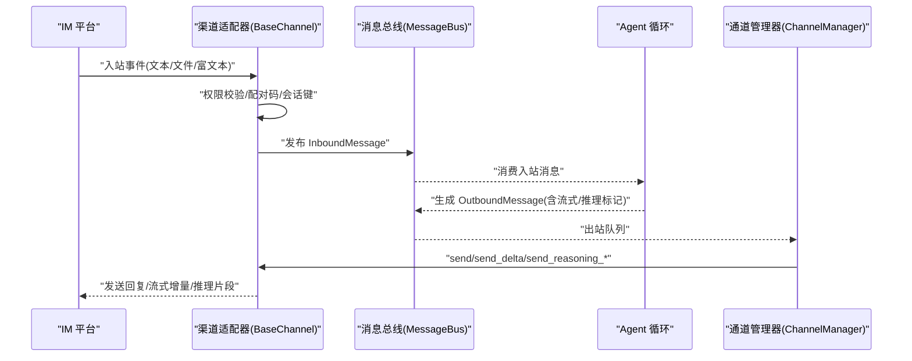
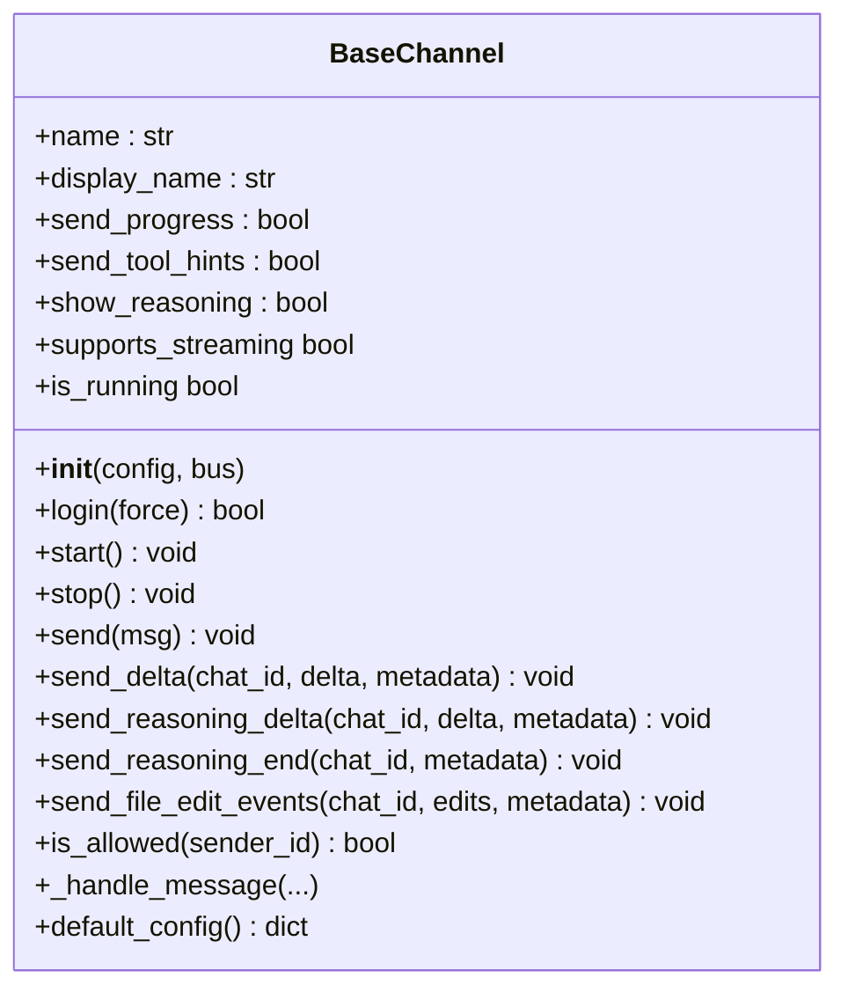
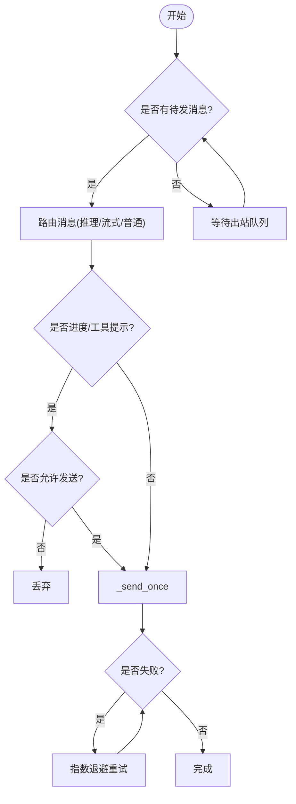
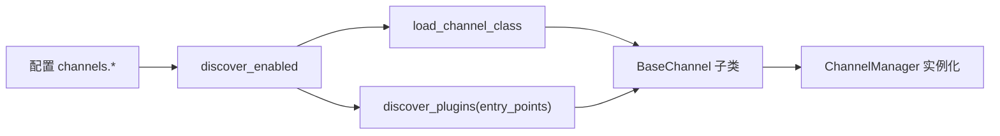
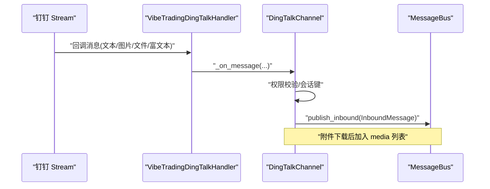
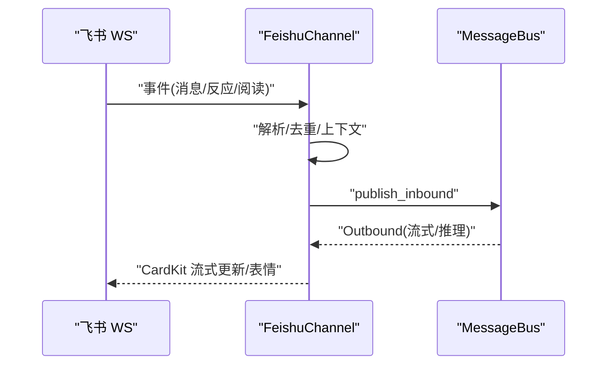
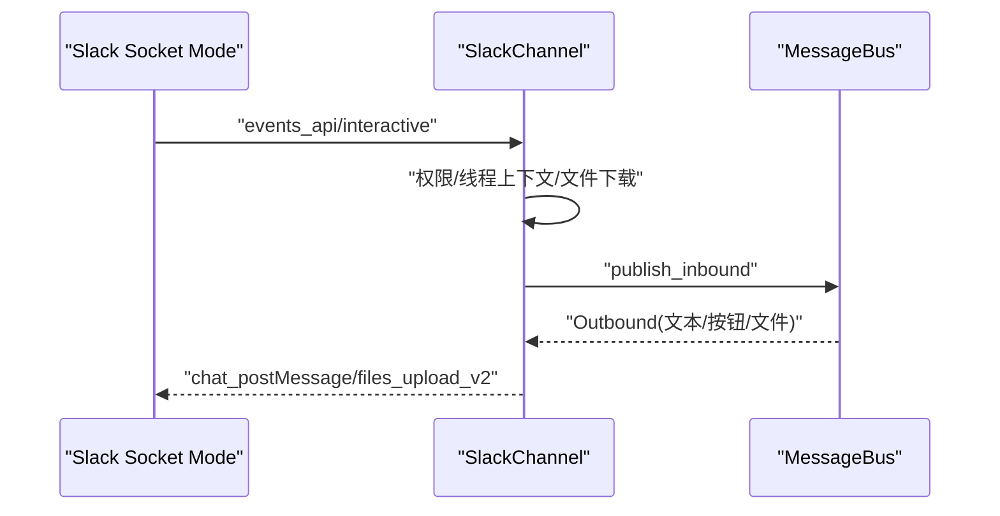
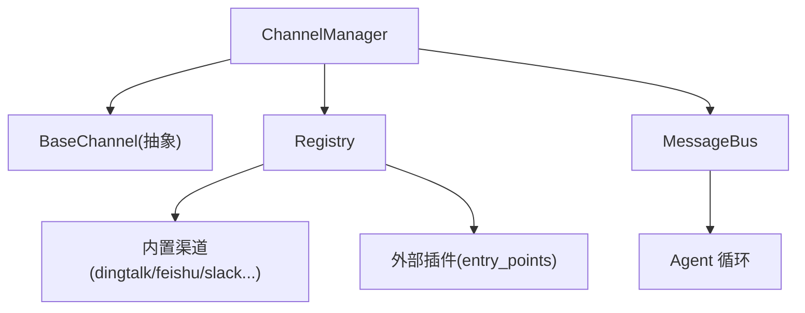

# 自定义渠道开发示例

<cite>
**本文引用的文件**
- [agent/src/channels/__init__.py](file://agent/src/channels/__init__.py)
- [agent/src/channels/base.py](file://agent/src/channels/base.py)
- [agent/src/channels/manager.py](file://agent/src/channels/manager.py)
- [agent/src/channels/registry.py](file://agent/src/channels/registry.py)
- [agent/src/channels/config.py](file://agent/src/channels/config.py)
- [agent/src/channels/utils.py](file://agent/src/channels/utils.py)
- [agent/src/channels/pairing/__init__.py](file://agent/src/channels/pairing/__init__.py)
- [agent/src/channels/dingtalk.py](file://agent/src/channels/dingtalk.py)
- [agent/src/channels/feishu.py](file://agent/src/channels/feishu.py)
- [agent/src/channels/slack.py](file://agent/src/channels/slack.py)
- [agent/tests/test_channels_api.py](file://agent/tests/test_channels_api.py)
- [agent/tests/test_cli_channels.py](file://agent/tests/test_cli_channels.py)
</cite>

## 目录
1. [简介](#简介)
2. [项目结构](#项目结构)
3. [核心组件](#核心组件)
4. [架构总览](#架构总览)
5. [详细组件分析](#详细组件分析)
6. [依赖关系分析](#依赖关系分析)
7. [性能考虑](#性能考虑)
8. [故障排查指南](#故障排查指南)
9. [结论](#结论)
10. [附录](#附录)

## 简介
本教程面向希望在 Vibe-Trading 中从零开发“自定义渠道”的开发者。文档基于现有钉钉、飞书、Slack 等内置渠道的实现模式，系统讲解认证流程、消息格式转换、错误处理、流式输出与权限控制等关键能力，并提供从需求分析到部署上线的完整步骤、代码模板、最佳实践与常见问题解决方案。同时给出测试用例与性能基准建议，帮助你构建稳定、可维护且用户体验优秀的渠道适配器。

## 项目结构
Vibe-Trading 的渠道子系统采用插件化架构：通过统一抽象接口 BaseChannel 定义接入规范，由 ChannelManager 负责生命周期管理与出站路由，Registry 负责自动发现内置与外部插件，MessageBus 提供异步消息总线。各渠道（如钉钉、飞书、Slack）实现各自的平台 SDK 集成与消息适配。

```mermaid
graph TB
A["渠道抽象<br/>BaseChannel"] --> B["通道管理器<br/>ChannelManager"]
B --> C["消息总线<br/>MessageBus"]
B --> D["注册中心<br/>Registry"]
D --> E["内置渠道模块<br/>dingtalk / feishu / slack ..."]
D --> F["外部插件<br/>entry_points"]
C --> G["Agent 循环<br/>会话/工具/LLM"]
```

图表来源
- [agent/src/channels/__init__.py:1-49](file://agent/src/channels/__init__.py#L1-L49)
- [agent/src/channels/manager.py:36-137](file://agent/src/channels/manager.py#L36-L137)
- [agent/src/channels/registry.py:87-160](file://agent/src/channels/registry.py#L87-L160)

章节来源
- [agent/src/channels/__init__.py:1-49](file://agent/src/channels/__init__.py#L1-L49)
- [agent/src/channels/manager.py:36-137](file://agent/src/channels/manager.py#L36-L137)
- [agent/src/channels/registry.py:87-160](file://agent/src/channels/registry.py#L87-L160)

## 核心组件
- BaseChannel：定义所有渠道必须实现的抽象接口，包括 start/stop/send、可选的流式发送 send_delta、推理内容 send_reasoning_*、权限校验 is_allowed、默认配置 default_config 等。
- ChannelManager：启动/停止渠道、出站消息分发、重试与合并、状态管理。
- Registry：扫描内置渠道模块与外部插件，检查可用性并加载类。
- MessageBus：异步入站/出站消息队列，连接渠道与 Agent 循环。
- utils：媒体目录、URL 安全校验、消息分片、文件名安全化等通用工具。
- pairing：DM 授权码生成与审批流程，支持 allow_from 白名单与配对码机制。

章节来源
- [agent/src/channels/base.py:22-238](file://agent/src/channels/base.py#L22-L238)
- [agent/src/channels/manager.py:36-479](file://agent/src/channels/manager.py#L36-L479)
- [agent/src/channels/registry.py:1-284](file://agent/src/channels/registry.py#L1-L284)
- [agent/src/channels/utils.py:16-180](file://agent/src/channels/utils.py#L16-L180)
- [agent/src/channels/pairing/__init__.py:1-34](file://agent/src/channels/pairing/__init__.py#L1-L34)

## 架构总览
下图展示了从平台消息到达至 Agent 处理再到回复发送的端到端流程，以及流式输出与推理内容的特殊路由。

图表来源
- [agent/src/channels/__init__.py:1-49](file://agent/src/channels/__init__.py#L1-L49)
- [agent/src/channels/base.py:179-227](file://agent/src/channels/base.py#L179-L227)
- [agent/src/channels/manager.py:283-419](file://agent/src/channels/manager.py#L283-L419)

## 详细组件分析

### 基础抽象与权限控制（BaseChannel）
- 生命周期：start/stop 为必填；login 用于交互式登录（如扫码）。
- 发送：send 为必填；send_delta/send_reasoning_* 为可选扩展，用于流式与推理内容。
- 权限：is_allowed 支持 allow_from 白名单与配对码审批；_handle_message 在 DM 未授权时下发配对码。
- 默认配置：default_config 便于引导初始化。

图表来源
- [agent/src/channels/base.py:22-238](file://agent/src/channels/base.py#L22-L238)

章节来源
- [agent/src/channels/base.py:22-238](file://agent/src/channels/base.py#L22-L238)

### 通道管理器（ChannelManager）
- 启动/停止：start_all/stop_all 并发启动各渠道，统一异常捕获与状态更新。
- 出站分发：_dispatch_outbound 聚合流式增量、过滤进度/工具提示、去重重复回复、按 channel 路由。
- 重试策略：_send_with_retry 指数退避，避免瞬时失败导致丢失消息。
- 布尔覆盖：支持全局与渠道级 send_progress/send_tool_hints/show_reasoning 覆盖。

图表来源
- [agent/src/channels/manager.py:213-479](file://agent/src/channels/manager.py#L213-L479)

章节来源
- [agent/src/channels/manager.py:36-479](file://agent/src/channels/manager.py#L36-L479)

### 注册与发现（Registry）
- 内置渠道扫描：discover_channel_names 使用 pkgutil 扫描 src.channels 下的模块。
- 插件发现：discover_plugins 通过 entry_points 组加载外部渠道。
- 可用性检查：inspect_channel 检测可选依赖缺失并返回安装提示。
- 启用集合：discover_enabled/discover_all 根据配置决定加载哪些渠道。

图表来源
- [agent/src/channels/registry.py:87-284](file://agent/src/channels/registry.py#L87-L284)

章节来源
- [agent/src/channels/registry.py:1-284](file://agent/src/channels/registry.py#L1-L284)

### 配置加载（Config）
- load_channels_config 从结构化 agent 配置中读取 channels 部分，供 ChannelManager 使用。

章节来源
- [agent/src/channels/config.py:1-22](file://agent/src/channels/config.py#L1-L22)

### 工具与安全（Utils）
- get_media_dir：将入站媒体保存到受信任的 uploads 目录，确保 Agent 工具可访问。
- validate_url_target：严格校验 URL 方案、主机与解析 IP，阻止内网/私有地址与多播。
- split_message：按最大长度切分消息，优先在换行或空格处断开。
- safe_filename：清理不安全字符，防止路径穿越。

章节来源
- [agent/src/channels/utils.py:16-180](file://agent/src/channels/utils.py#L16-L180)

### 配对与授权（Pairing）
- 生成/格式化配对码：generate_code/format_pairing_reply。
- 审批/拒绝/列表/撤销：approve_code/deny_code/list_pending/revoke。
- 元数据键：PAIRING_CODE_META_KEY/PAIRING_COMMAND_META_KEY 用于标记配对相关消息。

章节来源
- [agent/src/channels/pairing/__init__.py:1-34](file://agent/src/channels/pairing/__init__.py#L1-L34)

### 内置渠道实现模式

#### 钉钉（DingTalk）
- 认证：Stream Mode 使用 dingtalk-stream SDK 建立 WebSocket 接收事件；发送使用 HTTP API 获取 access_token。
- 入站：VibeTradingDingTalkHandler 解析 ChatbotMessage，提取文本、图片、文件、富文本，并下载附件到媒体目录。
- 出站：_send_markdown_text/_send_media_ref 分别发送 Markdown 文本与媒体；支持群聊/私聊路由。
- 安全：远程媒体下载限制大小与跳转次数，校验目标 URL，HTML 文件上传前压缩为 zip。
- 会话：支持 group_user_isolation，群组内按用户隔离会话。

图表来源
- [agent/src/channels/dingtalk.py:46-164](file://agent/src/channels/dingtalk.py#L46-L164)
- [agent/src/channels/dingtalk.py:694-727](file://agent/src/channels/dingtalk.py#L694-L727)

章节来源
- [agent/src/channels/dingtalk.py:166-774](file://agent/src/channels/dingtalk.py#L166-L774)

#### 飞书（Feishu/Lark）
- 认证：支持 QR 扫码创建应用并写入凭据；WebSocket 长连接接收事件，无需公网 IP。
- 入站：解析多种消息类型（分享卡片、互动卡、Post 富文本），提取文本与图片 key。
- 出站：CardKit 流式更新，节流编辑间隔；支持表情反应与阅读回执。
- 会话：topic_isolation 支持群组话题隔离；reply_to_message 支持引用回复。
- 安全：延迟导入重型 SDK，避免启动开销；线程隔离事件循环。

图表来源
- [agent/src/channels/feishu.py:39-67](file://agent/src/channels/feishu.py#L39-L67)
- [agent/src/channels/feishu.py:569-785](file://agent/src/channels/feishu.py#L569-L785)

章节来源
- [agent/src/channels/feishu.py:341-785](file://agent/src/channels/feishu.py#L341-L785)

#### Slack
- 认证：Socket Mode 通过 app_token 建立 WSS；bot_token 调用 Web API。
- 入站：_on_socket_request 处理 message/app_mention，支持按钮交互；下载私有文件到媒体目录。
- 出站：_to_mrkdwn 将 Markdown 转为 mrkdwn，支持表格转换；split_message 切分超长消息；支持线程回复与表情反应。
- 会话：thread_ts 作为 session_key 隔离线程上下文；group_policy 支持 open/mention/allowlist。
- 安全：下载 HTML 防护、超时与代理限制提示。

图表来源
- [agent/src/channels/slack.py:92-140](file://agent/src/channels/slack.py#L92-L140)
- [agent/src/channels/slack.py:312-455](file://agent/src/channels/slack.py#L312-L455)
- [agent/src/channels/slack.py:151-199](file://agent/src/channels/slack.py#L151-L199)

章节来源
- [agent/src/channels/slack.py:25-755](file://agent/src/channels/slack.py#L25-L755)

## 依赖关系分析
- 内置渠道与外部插件通过 Registry 统一发现；ChannelManager 仅依赖抽象接口，解耦具体实现。
- 各渠道对第三方 SDK 采用懒加载与可用性检查，避免启动失败影响整体服务。
- 出站消息经 ChannelManager 统一重试与合并，降低平台 API 压力。

图表来源
- [agent/src/channels/manager.py:36-137](file://agent/src/channels/manager.py#L36-L137)
- [agent/src/channels/registry.py:87-284](file://agent/src/channels/registry.py#L87-L284)

章节来源
- [agent/src/channels/manager.py:36-137](file://agent/src/channels/manager.py#L36-L137)
- [agent/src/channels/registry.py:87-284](file://agent/src/channels/registry.py#L87-L284)

## 性能考虑
- 流式合并：ChannelManager 对连续 _stream_delta 进行合并，减少 API 调用频率。
- 重试退避：_send_with_retry 使用指数退避，避免雪崩。
- 懒加载 SDK：飞书/WhatsApp 等重型 SDK 延迟导入，缩短启动时间。
- 媒体限制：钉钉/Slack 对文件大小、跳转次数、代理与超时进行限制，防止资源耗尽。
- 线程隔离：飞书在独立线程运行 WS 客户端，避免主事件循环冲突。

[本节为通用指导，不直接分析具体文件]

## 故障排查指南
- 渠道不可用：检查 Registry 返回的 available/error/install_hint，确认依赖已安装。
- 启动失败：查看 ChannelManager 日志中的异常堆栈，定位具体渠道初始化问题。
- 发送失败：关注 _send_with_retry 的重试日志，确认网络与平台 API 状态。
- 权限问题：未授权用户在 DM 会收到配对码；检查 allow_from 与 pairing store。
- 媒体下载失败：检查 URL 安全校验、代理设置与平台权限（如 Slack files:read）。

章节来源
- [agent/src/channels/registry.py:130-160](file://agent/src/channels/registry.py#L130-L160)
- [agent/src/channels/manager.py:206-253](file://agent/src/channels/manager.py#L206-L253)
- [agent/src/channels/base.py:165-227](file://agent/src/channels/base.py#L165-L227)
- [agent/src/channels/utils.py:97-180](file://agent/src/channels/utils.py#L97-L180)

## 结论
Vibe-Trading 的渠道子系统以 BaseChannel 为核心抽象，配合 ChannelManager 与 Registry 实现了高内聚、低耦合的多渠道接入能力。通过统一的权限模型、流式输出、重试与合并机制，以及严格的安全校验，开发者可以高效地扩展新渠道。建议遵循本文提供的模板与实践，结合平台特性优化用户体验与兼容性，并通过测试与基准验证稳定性与性能。

[本节为总结性内容，不直接分析具体文件]

## 附录

### 从零开发一个新渠道：完整流程
- 需求分析
  - 明确平台能力：认证方式（OAuth/Token/扫码）、消息类型（文本/富文本/文件/卡片）、流式支持、线程/群组策略。
  - 确定技术栈：官方 SDK 或 REST/WebSocket；是否需要代理/超时/重试策略。
- 实现步骤
  - 新建模块：在 src/channels 下创建 mychannel.py，继承 BaseChannel，实现 name/display_name/default_config/start/stop/send。
  - 入站处理：解析平台事件，调用 _handle_message 发布 InboundMessage；必要时下载媒体到 get_media_dir。
  - 出站发送：实现 send，支持文本/文件/按钮/卡片；如需流式，实现 send_delta 与 send_reasoning_*。
  - 权限控制：利用 is_allowed 与 allow_from；DM 未授权时下发配对码。
  - 配置加载：在 config.json 的 channels.mychannel 中启用并填写凭据。
  - 注册与发现：若为内置模块，自动被 Registry 发现；若为外部插件，通过 entry_points 注册。
- 测试与基准
  - 单元测试：模拟入站事件与出站发送，验证权限、分片、重试逻辑。
  - 集成测试：使用 TestClient 调用 /channels/status、/channels/start、/channels/stop 等接口。
  - 性能基准：测量流式合并效果、重试成功率、媒体下载耗时与内存占用。
- 部署上线
  - 环境准备：安装依赖、配置凭据、开放必要端口/代理。
  - 监控告警：记录渠道状态、错误率、重试次数、媒体大小限制命中情况。
  - 灰度发布：先小范围启用，观察稳定性后再全量。

章节来源
- [agent/src/channels/base.py:22-238](file://agent/src/channels/base.py#L22-L238)
- [agent/src/channels/registry.py:87-284](file://agent/src/channels/registry.py#L87-L284)
- [agent/src/channels/config.py:11-22](file://agent/src/channels/config.py#L11-L22)
- [agent/tests/test_channels_api.py:49-102](file://agent/tests/test_channels_api.py#L49-L102)
- [agent/tests/test_cli_channels.py:12-115](file://agent/tests/test_cli_channels.py#L12-L115)

### 代码模板（路径参考）
- 渠道基类：[agent/src/channels/base.py:22-238](file://agent/src/channels/base.py#L22-L238)
- 管理器：[agent/src/channels/manager.py:36-479](file://agent/src/channels/manager.py#L36-L479)
- 注册中心：[agent/src/channels/registry.py:87-284](file://agent/src/channels/registry.py#L87-L284)
- 工具函数：[agent/src/channels/utils.py:16-180](file://agent/src/channels/utils.py#L16-L180)
- 配对模块：[agent/src/channels/pairing/__init__.py:1-34](file://agent/src/channels/pairing/__init__.py#L1-L34)

### 最佳实践
- 始终实现 send，并在失败时抛出异常以便管理器重试。
- 合理使用流式接口，减少频繁 API 调用；注意 _stream_id 与 _stream_end 语义。
- 对远程媒体进行安全校验与大小限制，避免 SSRF 与资源耗尽。
- 使用 split_message 切分超长消息，保证平台兼容性。
- 在 DM 未授权时下发配对码，提升用户体验。

[本节为通用指导，不直接分析具体文件]

### 常见问题解决方案
- 渠道不可用：检查依赖安装与 availability flags；参考 install_hint。
- 无法接收消息：确认事件订阅/回调注册正确；检查权限与 allow_from。
- 发送失败：查看重试日志与平台错误码；调整超时与代理设置。
- 媒体无法显示：确认 MIME 类型与平台支持；必要时转换为兼容格式。
- 流式卡顿：检查合并策略与节流参数；确保 _stream_end 正确触发。

章节来源
- [agent/src/channels/registry.py:130-160](file://agent/src/channels/registry.py#L130-L160)
- [agent/src/channels/manager.py:421-453](file://agent/src/channels/manager.py#L421-L453)
- [agent/src/channels/utils.py:97-180](file://agent/src/channels/utils.py#L97-L180)