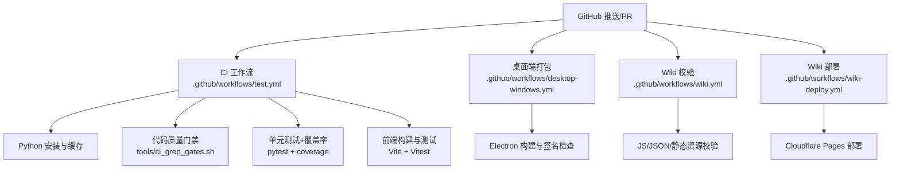
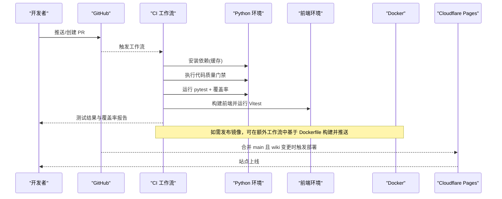
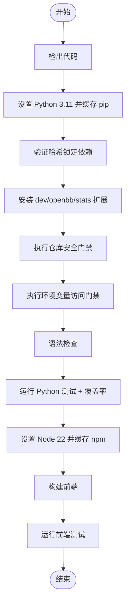
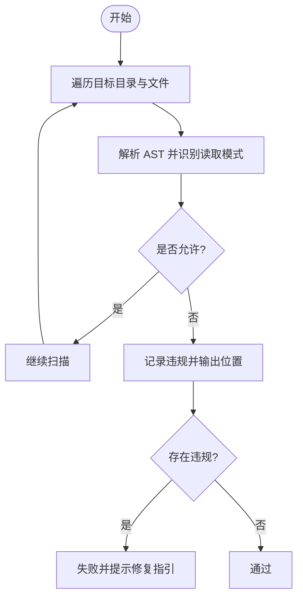
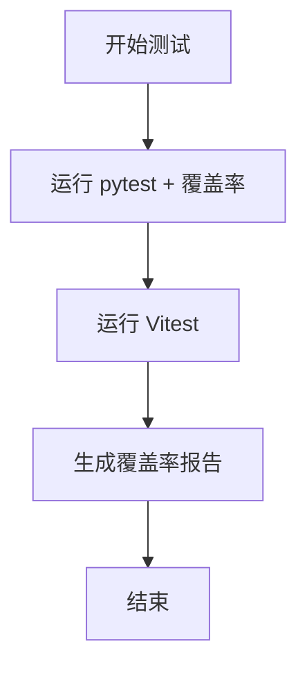
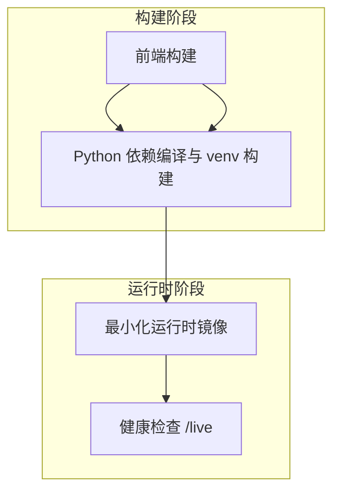
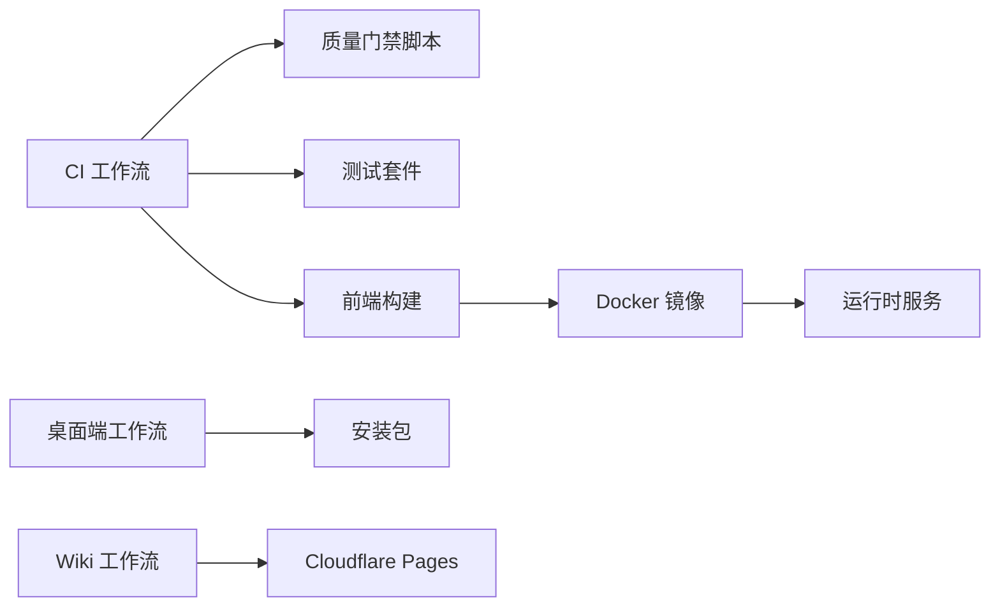

# CI/CD 集成

<cite>
**本文引用的文件**
- [test.yml](file://.github/workflows/test.yml)
- [desktop-windows.yml](file://.github/workflows/desktop-windows.yml)
- [wiki-deploy.yml](file://.github/workflows/wiki-deploy.yml)
- [wiki.yml](file://.github/workflows/wiki.yml)
- [dependabot.yml](file://.github/dependabot.yml)
- [ci_grep_gates.sh](file://tools/ci_grep_gates.sh)
- [ci_env_var_gate.py](file://tools/ci_env_var_gate.py)
- [Dockerfile](file://Dockerfile)
- [docker-compose.yml](file://docker-compose.yml)
- [pyproject.toml](file://pyproject.toml)
- [vitest.config.ts](file://frontend/vitest.config.ts)
- [package.json](file://frontend/package.json)
</cite>

## 目录
1. [简介](#简介)
2. [项目结构](#项目结构)
3. [核心组件](#核心组件)
4. [架构总览](#架构总览)
5. [详细组件分析](#详细组件分析)
6. [依赖分析](#依赖分析)
7. [性能考虑](#性能考虑)
8. [故障排查指南](#故障排查指南)
9. [结论](#结论)
10. [附录](#附录)

## 简介
本文件面向 Vibe-Trading 的持续集成与持续交付（CI/CD）体系，系统化说明代码质量门禁、测试执行、前端构建与测试、桌面端打包、镜像构建与部署、以及依赖治理策略。文档同时给出不同环境（开发、预发布、生产）的流水线落地建议与常见问题排障方法，帮助团队在保障质量的前提下快速、安全地交付。

## 项目结构
仓库采用多语言、多产物结构：Python 后端与量化模块位于 agent，前端位于 frontend，桌面端 Electron 应用位于 desktop/electron，Wiki 静态站点位于 wiki。CI/CD 通过 GitHub Actions 编排，结合 Docker 进行容器化构建与运行，使用 Dependabot 管理依赖更新。

**图表来源**
- [test.yml:1-164](file://.github/workflows/test.yml#L1-L164)
- [desktop-windows.yml:1-95](file://.github/workflows/desktop-windows.yml#L1-L95)
- [wiki.yml:1-59](file://.github/workflows/wiki.yml#L1-L59)
- [wiki-deploy.yml:1-39](file://.github/workflows/wiki-deploy.yml#L1-L39)

**章节来源**
- [test.yml:1-164](file://.github/workflows/test.yml#L1-L164)
- [desktop-windows.yml:1-95](file://.github/workflows/desktop-windows.yml#L1-L95)
- [wiki.yml:1-59](file://.github/workflows/wiki.yml#L1-L59)
- [wiki-deploy.yml:1-39](file://.github/workflows/wiki-deploy.yml#L1-L39)

## 核心组件
- 触发条件与工作流
  - CI：对 main 分支 push/PR 及手动触发执行 Python 与前端质量检查与测试。
  - 桌面端：针对相关路径变更或手动触发，构建 Windows 安装包并生成校验和。
  - Wiki：对 wiki 目录变更进行语法与静态资源校验；main 分支合并后自动部署到 Cloudflare Pages。
- 代码质量门禁
  - 统一脚本 ci_grep_gates.sh 执行多项安全与合规检查（YAML 安全、商标词、数据泄露、时间函数规范、环境变量访问集中化）。
  - 环境变量访问强制通过集中配置层，AST 扫描工具 ci_env_var_gate.py 拦截违规读取。
- 测试与覆盖率
  - Python：pytest 执行单元/集成测试，启用 coverage 输出覆盖率报告。
  - 前端：Vitest 执行测试，v8 覆盖率收集。
- 构建与部署
  - 容器镜像：多阶段构建，前端静态资源与 Python 运行时分离，最小化镜像体积与安全面。
  - 本地运行：docker-compose 提供完整服务栈与持久卷、资源限制与安全加固。
- 依赖治理
  - Dependabot 按月批量升级次要/补丁版本，重大版本单独审阅；对特定依赖设置忽略规则以控制风险。

**章节来源**
- [test.yml:1-164](file://.github/workflows/test.yml#L1-L164)
- [ci_grep_gates.sh:1-156](file://tools/ci_grep_gates.sh#L1-L156)
- [ci_env_var_gate.py:1-302](file://tools/ci_env_var_gate.py#L1-L302)
- [pyproject.toml:232-272](file://pyproject.toml#L232-L272)
- [vitest.config.ts:1-24](file://frontend/vitest.config.ts#L1-L24)
- [Dockerfile:1-108](file://Dockerfile#L1-L108)
- [docker-compose.yml:1-90](file://docker-compose.yml#L1-L90)
- [dependabot.yml:1-103](file://.github/dependabot.yml#L1-L103)

## 架构总览
下图展示从代码提交到制品产出的端到端流程，包括质量门禁、测试、构建与部署环节。

**图表来源**
- [test.yml:1-164](file://.github/workflows/test.yml#L1-L164)
- [wiki-deploy.yml:1-39](file://.github/workflows/wiki-deploy.yml#L1-L39)
- [Dockerfile:1-108](file://Dockerfile#L1-L108)

## 详细组件分析

### 持续集成流水线（Python + 前端）
- 触发条件
  - main 分支 push、PR 至 main、手动触发。
- 作业定义
  - Python 环境：安装依赖（启用 pip 缓存），验证哈希锁定依赖，安装可选扩展（openbb、stats），执行仓库安全门禁脚本，执行环境变量访问门禁，语法检查，运行测试并生成覆盖率。
  - 前端环境：安装 Node 22，构建前端，运行 Vitest。
- 缓存策略
  - pip 缓存与 npm 缓存分别用于加速依赖安装。
- 关键命令路径
  - 质量门禁：bash tools/ci_grep_gates.sh
  - 环境变量门禁：pytest tools/test_ci_env_var_gate.py
  - 测试与覆盖率：pytest --cov=agent --cov-report=term-missing --cov-report=xml
  - 前端构建与测试：npm ci && npm run build；npx vitest run

**图表来源**
- [test.yml:1-164](file://.github/workflows/test.yml#L1-L164)

**章节来源**
- [test.yml:1-164](file://.github/workflows/test.yml#L1-L164)

### 代码质量门禁与安全扫描
- 统一门禁脚本 ci_grep_gates.sh
  - 禁止不安全 yaml.load()（RCE 风险）
  - 禁止出现受保护商标词
  - 禁止在 wiki/alpha-library 中出现按股票代码的数据泄露
  - 禁止使用已弃用的 datetime.utcnow()/裸 datetime.now()
  - 禁止绕过集中配置层直接读取环境变量（调用 AST 工具）
- 环境变量访问门禁 ci_env_var_gate.py
  - 扫描指定目录下的 Python 源码，识别 os.getenv/os.environ.get/os.environ[...] 等读取行为
  - 允许白名单模式（如 copy/items/setdefault/写入场景/特定文件中的 pop）
  - 仅允许在 agent/src/config/ 内直接读取环境变量
  - 支持 noqa 注释豁免

**图表来源**
- [ci_grep_gates.sh:1-156](file://tools/ci_grep_gates.sh#L1-L156)
- [ci_env_var_gate.py:1-302](file://tools/ci_env_var_gate.py#L1-L302)

**章节来源**
- [ci_grep_gates.sh:1-156](file://tools/ci_grep_gates.sh#L1-L156)
- [ci_env_var_gate.py:1-302](file://tools/ci_env_var_gate.py#L1-L302)

### 测试覆盖率与回归测试
- Python 测试
  - 使用 pytest 执行测试套件，排除 e2e 与需要真实 LLM 的测试以避免 CI 状态漂移
  - 覆盖率采集范围限定为 agent 目录，输出文本与 XML 报告
  - 测试配置与覆盖范围由 pyproject.toml 管理
- 前端测试
  - 使用 Vitest 在 jsdom 环境中运行，覆盖率使用 v8 提供者，输出 text/html/lcov
  - 测试包含范围与排除规则在 vitest.config.ts 中定义
- 回归测试
  - CI 中显式忽略 e2e 与 live 测试，确保回归稳定；必要时通过环境变量开关启用

**图表来源**
- [test.yml:1-164](file://.github/workflows/test.yml#L1-L164)
- [pyproject.toml:232-272](file://pyproject.toml#L232-L272)
- [vitest.config.ts:1-24](file://frontend/vitest.config.ts#L1-L24)

**章节来源**
- [test.yml:1-164](file://.github/workflows/test.yml#L1-L164)
- [pyproject.toml:232-272](file://pyproject.toml#L232-L272)
- [vitest.config.ts:1-24](file://frontend/vitest.config.ts#L1-L24)

### 持续部署策略（镜像构建与应用部署）
- 镜像构建（Dockerfile）
  - 多阶段构建：前端构建阶段、Python 依赖编译与 venv 构建阶段、最小化运行时阶段
  - 运行时仅携带必要系统库与字体，避免编译器与开发头文件进入最终镜像
  - 健康检查指向 /live 端点，默认端口 8899
- 本地运行（docker-compose）
  - 挂载持久卷保存 runs/sessions/uploads/swarm 运行数据与用户态数据
  - 资源限制：内存、CPU、进程数上限
  - 安全加固：drop ALL 能力，仅保留 SETUID/SETGID，只读根文件系统，tmpfs 临时目录
- 部署目标与环境
  - 开发环境：docker-compose 启动前后端，便于热开发与调试
  - 预发布环境：可基于同一镜像，注入预发布环境变量与限流策略
  - 生产环境：建议使用私有镜像仓库与密钥管理，配合编排平台（Kubernetes/Docker Swarm）滚动更新与健康检查

**图表来源**
- [Dockerfile:1-108](file://Dockerfile#L1-L108)

**章节来源**
- [Dockerfile:1-108](file://Dockerfile#L1-L108)
- [docker-compose.yml:1-90](file://docker-compose.yml#L1-L90)

### GitHub Actions 工作流配置
- CI 工作流（test.yml）
  - 触发：main 分支 push/PR 与手动触发
  - 作业：Python 测试与覆盖率、前端构建与测试、Windows 后台生命周期回归、桌面端源生命周期
  - 缓存：pip/npm 缓存
- 桌面端打包（desktop-windows.yml）
  - 触发：相关路径变更或手动触发
  - 作业：构建前端、安装桌面依赖、组装最小 Python 运行时、验证后端生命周期、构建 NSIS 安装包、生成 SHA256 校验和
- Wiki 校验与部署（wiki.yml、wiki-deploy.yml）
  - 校验：JavaScript 语法、locale JSON、社交卡片元数据、静态文件完整性
  - 部署：main 分支合并且 wiki 变更时，通过 Cloudflare Wrangler 部署到 Pages

**章节来源**
- [test.yml:1-164](file://.github/workflows/test.yml#L1-L164)
- [desktop-windows.yml:1-95](file://.github/workflows/desktop-windows.yml#L1-L95)
- [wiki.yml:1-59](file://.github/workflows/wiki.yml#L1-L59)
- [wiki-deploy.yml:1-39](file://.github/workflows/wiki-deploy.yml#L1-L39)

### 依赖治理与漏洞检测
- Dependabot 策略
  - 按月批量升级次要/补丁版本，重大版本单独审阅
  - 对部分依赖设置忽略规则（如 pandas 主版本、websockets、ccxt 传递依赖等），避免破坏性升级
  - GitHub Actions 工作流版本也纳入依赖治理
- 漏洞检测
  - 当前仓库未配置专门的依赖漏洞扫描步骤；建议在 CI 中增加依赖漏洞扫描（如 pip-audit、npm audit、Trivy 等）并在 PR 中阻断高危漏洞
  - 注意：Dependabot 告警来自依赖图，不受 ignore 影响，仍会在安全标签页显示

**章节来源**
- [dependabot.yml:1-103](file://.github/dependabot.yml#L1-L103)

## 依赖分析
- 组件耦合
  - CI 工作流强依赖 Python 与 Node 环境，并通过缓存降低构建时间
  - 质量门禁脚本与 AST 工具构成代码质量基线，任何绕过将导致 CI 失败
  - 前端与后端解耦，前端构建产物被复制到运行时镜像并由 API 服务提供静态资源
- 外部依赖
  - Docker 镜像依赖系统库（Pango/HarfBuzz/Fontconfig/Cairo/gdk-pixbuf）与字体以支持 PDF 渲染
  - 桌面端依赖 Electron 与 NSIS 打包工具链
- 潜在循环依赖
  - 未发现明显循环依赖；各工作流职责清晰，模块化良好

**图表来源**
- [test.yml:1-164](file://.github/workflows/test.yml#L1-L164)
- [desktop-windows.yml:1-95](file://.github/workflows/desktop-windows.yml#L1-L95)
- [wiki.yml:1-59](file://.github/workflows/wiki.yml#L1-L59)
- [wiki-deploy.yml:1-39](file://.github/workflows/wiki-deploy.yml#L1-L39)
- [Dockerfile:1-108](file://Dockerfile#L1-L108)

**章节来源**
- [test.yml:1-164](file://.github/workflows/test.yml#L1-L164)
- [desktop-windows.yml:1-95](file://.github/workflows/desktop-windows.yml#L1-L95)
- [wiki.yml:1-59](file://.github/workflows/wiki.yml#L1-L59)
- [wiki-deploy.yml:1-39](file://.github/workflows/wiki-deploy.yml#L1-L39)
- [Dockerfile:1-108](file://Dockerfile#L1-L108)

## 性能考虑
- 缓存优化
  - 使用 pip/npm 缓存减少依赖安装时间
  - 前端构建产物复用，仅在依赖变化时重新安装
- 并行执行
  - 桌面端背景生命周期测试矩阵并行执行，缩短整体耗时
- 资源限制
  - docker-compose 中限制 CPU/内存/进程数，防止单任务占用过多资源
- 镜像大小
  - 多阶段构建移除编译期依赖，减小镜像体积，提升拉取与启动速度

[本节为通用指导，不直接分析具体文件]

## 故障排查指南
- 质量门禁失败
  - 查看 ci_grep_gates.sh 输出定位违规类型（YAML、商标词、数据泄露、时间函数、环境变量访问）
  - 对于环境变量访问问题，使用 ci_env_var_gate.py 的 allowlist 输出确认允许模式，或在 config 层集中读取
- 测试失败
  - Python：检查 pytest 输出与覆盖率报告，关注 skipped 用例是否因可选依赖缺失导致
  - 前端：检查 Vitest 日志与浏览器控制台，确认 jsdom 环境与 mock 是否正确
- 构建失败
  - 前端：确认 Node 版本与依赖锁文件一致，清理 node_modules 后重试
  - 桌面端：确认 Electron 与 NSIS 工具链可用，检查签名与证书配置
- 部署失败
  - Wiki：检查 Cloudflare API Token 与 Account ID 是否配置正确，wrangler 版本兼容性
  - 镜像：检查健康检查端点可达性与端口映射

**章节来源**
- [ci_grep_gates.sh:1-156](file://tools/ci_grep_gates.sh#L1-L156)
- [ci_env_var_gate.py:1-302](file://tools/ci_env_var_gate.py#L1-L302)
- [test.yml:1-164](file://.github/workflows/test.yml#L1-L164)
- [desktop-windows.yml:1-95](file://.github/workflows/desktop-windows.yml#L1-L95)
- [wiki-deploy.yml:1-39](file://.github/workflows/wiki-deploy.yml#L1-L39)

## 结论
Vibe-Trading 的 CI/CD 体系通过严格的代码质量门禁、全面的测试与覆盖率采集、稳定的前端与桌面端构建流程，以及安全的容器化部署策略，实现了高质量、可追溯、可回滚的交付能力。建议在生产环境引入依赖漏洞扫描与更细粒度的环境隔离，进一步提升安全性与稳定性。

[本节为总结性内容，不直接分析具体文件]

## 附录
- 不同部署目标的流水线建议
  - 开发环境：使用 docker-compose 启动，开启热重载与调试端口
  - 预发布环境：基于同一镜像，注入预发布变量与限流策略，执行冒烟测试
  - 生产环境：使用私有镜像仓库与密钥管理，编排平台滚动更新，健康检查与灰度发布
- 性能基准测试
  - 可在 CI 中增加轻量级基准测试（如因子计算、数据加载吞吐），对比阈值告警
- 回归测试
  - 保持 e2e 与 live 测试在独立开关下运行，避免 CI 不稳定

[本节为通用指导，不直接分析具体文件]