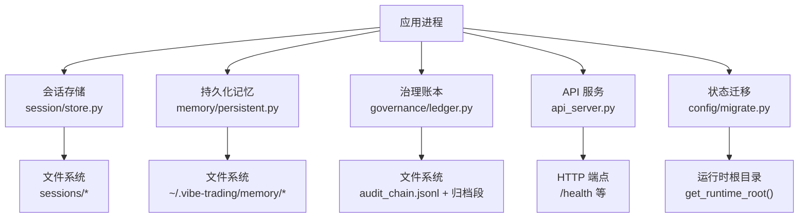
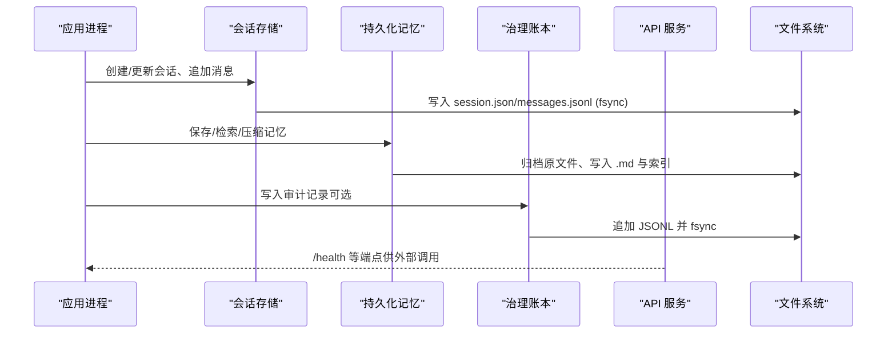
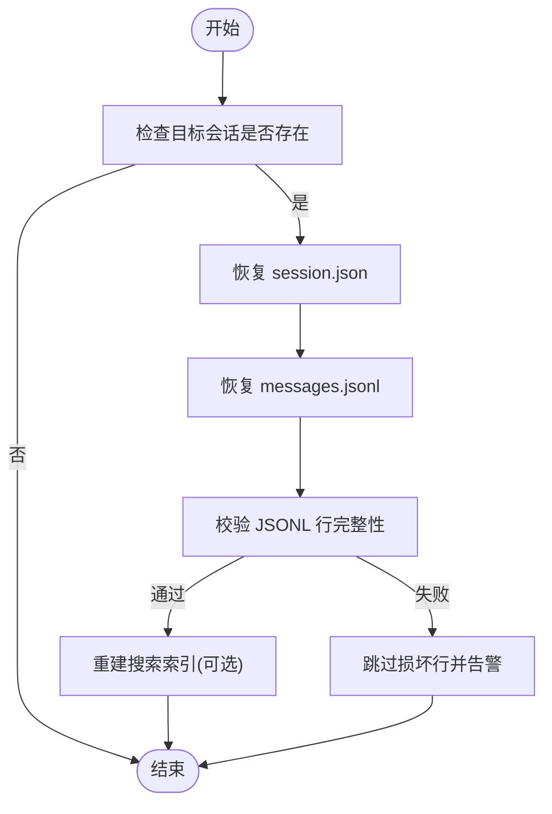
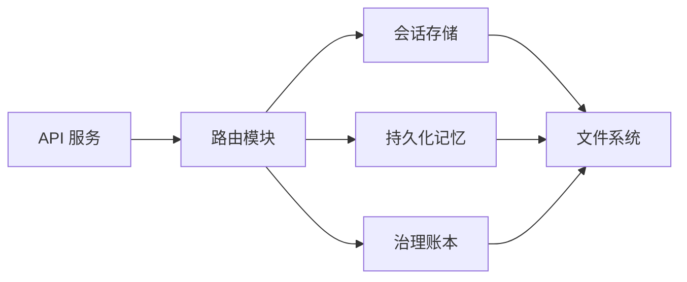

# 备份恢复

<cite>
**本文引用的文件**
- [agent/src/session/store.py](file://agent/src/session/store.py)
- [agent/src/memory/persistent.py](file://agent/src/memory/persistent.py)
- [agent/src/config/migrate.py](file://agent/src/config/migrate.py)
- [agent/src/governance/ledger.py](file://agent/src/governance/ledger.py)
- [agent/api_server.py](file://agent/api_server.py)
- [agent/tests/test_state_migration.py](file://agent/tests/test_state_migration.py)
- [agent/tests/test_governance.py](file://agent/tests/test_governance.py)
- [agent/src/trading/connectors/alpaca/sdk.py](file://agent/src/trading/connectors/alpaca/sdk.py)
</cite>

## 目录
1. [简介](#简介)
2. [项目结构](#项目结构)
3. [核心组件](#核心组件)
4. [架构总览](#架构总览)
5. [详细组件分析](#详细组件分析)
6. [依赖关系分析](#依赖关系分析)
7. [性能考虑](#性能考虑)
8. [故障排查指南](#故障排查指南)
9. [结论](#结论)
10. [附录](#附录)

## 简介
本文件面向 Vibe-Trading 的“备份与恢复”体系，围绕会话数据、研究结果、配置信息与用户数据的持久化位置、一致性保障、可验证性与灾难恢复策略进行系统化说明。仓库内已实现：
- 会话与消息的本地文件系统存储（JSON + JSONL），具备原子追加与 fsync 保证；
- 跨会话记忆系统的文件归档与压缩，支持原文件归档与原子写入；
- 一次性状态迁移工具，将历史代码相对路径下的状态迁移至运行时根目录；
- 哈希链式审计账本，提供完整性校验、导出与离线验证能力；
- 配置与凭据的安全落盘与权限控制。

本方案强调“可验证、可恢复、可审计”，并给出自动化运维建议与云存储集成思路。

## 项目结构
与备份恢复直接相关的核心模块分布如下：
- 会话存储：基于目录结构的 JSON/JSONL 持久化，包含 session.json、messages.jsonl、attempts 子目录；
- 持久化记忆：以 Markdown 为载体的跨会话记忆，含索引、压缩与归档；
- 状态迁移：启动时从旧路径迁移到运行时根目录，使用隐藏暂存名与原子重命名；
- 治理账本：哈希链式 JSONL，支持旋转归档、导出与离线验证；
- API 服务：挂载路由，暴露系统健康检查等接口，便于外部监控与备份触发。

图表来源
- [agent/src/session/store.py:16-55](file://agent/src/session/store.py#L16-L55)
- [agent/src/memory/persistent.py:196-206](file://agent/src/memory/persistent.py#L196-L206)
- [agent/src/governance/ledger.py:368-469](file://agent/src/governance/ledger.py#L368-L469)
- [agent/api_server.py:185-188](file://agent/api_server.py#L185-L188)
- [agent/src/config/migrate.py:114-153](file://agent/src/config/migrate.py#L114-L153)

章节来源
- [agent/src/session/store.py:16-55](file://agent/src/session/store.py#L16-L55)
- [agent/src/memory/persistent.py:196-206](file://agent/src/memory/persistent.py#L196-L206)
- [agent/src/governance/ledger.py:368-469](file://agent/src/governance/ledger.py#L368-L469)
- [agent/api_server.py:185-188](file://agent/api_server.py#L185-L188)
- [agent/src/config/migrate.py:114-153](file://agent/src/config/migrate.py#L114-L153)

## 核心组件
- 会话存储（SessionStore）：负责会话元数据、消息日志与执行尝试记录的创建、读取、更新与删除；消息采用追加模式并 fsync 落盘，确保崩溃后不丢失最近一条记录。
- 持久化记忆（PersistentMemory）：跨会话记忆条目以 Markdown 存储，支持内容去重、重要性衰减、FTS 索引、语义链接与压缩归档；压缩前会先原子归档原文件，避免数据丢失。
- 状态迁移（migrate_legacy_state）：首次启动时将旧代码相对路径下的 sessions/runs/swarm/uploads 迁移到运行时根目录，使用隐藏暂存名与原子重命名，中断后可恢复。
- 治理账本（Ledger）：哈希链式 JSONL 审计账本，每次写入前完整校验现有链，拒绝扩展损坏链；支持按大小旋转归档、导出为自包含 JSON 并离线验证。
- API 服务（api_server）：注册各功能路由，暴露 /health 等系统端点，便于外部监控与定时任务触发备份流程。

章节来源
- [agent/src/session/store.py:59-163](file://agent/src/session/store.py#L59-L163)
- [agent/src/memory/persistent.py:258-313](file://agent/src/memory/persistent.py#L258-L313)
- [agent/src/config/migrate.py:114-153](file://agent/src/config/migrate.py#L114-L153)
- [agent/src/governance/ledger.py:368-469](file://agent/src/governance/ledger.py#L368-L469)
- [agent/api_server.py:185-188](file://agent/api_server.py#L185-L188)

## 架构总览
下图展示备份恢复相关的数据流与关键交互：

图表来源
- [agent/src/session/store.py:151-163](file://agent/src/session/store.py#L151-L163)
- [agent/src/memory/persistent.py:258-313](file://agent/src/memory/persistent.py#L258-L313)
- [agent/src/governance/ledger.py:368-469](file://agent/src/governance/ledger.py#L368-L469)
- [agent/api_server.py:185-188](file://agent/api_server.py#L185-L188)

## 详细组件分析

### 会话数据备份与恢复
- 数据结构与布局
  - 每个会话一个目录，包含 session.json、messages.jsonl、attempts/{attempt_id}/attempt.json；
  - 消息为 JSONL 追加日志，每次写入后 flush+fsync，确保崩溃恢复。
- 备份策略
  - 全量快照：定期复制 sessions 目录至备份介质；
  - 增量备份：仅复制新增或变更的 session 目录及 messages.jsonl 尾部；
  - 一致性：在备份前暂停写入或使用事务性快照（如 LVM snapshot），或在备份期间通过 API 触发只读模式。
- 恢复流程
  - 完全恢复：停止服务，替换 sessions 目录，重启服务；
  - 部分恢复：仅恢复特定会话目录与对应消息；
  - 灾难恢复：结合治理账本校验与会话索引重建。

图表来源
- [agent/src/session/store.py:79-163](file://agent/src/session/store.py#L79-L163)

章节来源
- [agent/src/session/store.py:16-55](file://agent/src/session/store.py#L16-L55)
- [agent/src/session/store.py:79-163](file://agent/src/session/store.py#L79-L163)

### 研究结果与运行产物备份
- 运行产物位置
  - runs 目录存放回测与运行产物；
  - swarm 运行产物位于运行时根目录的 swarm/runs。
- 备份策略
  - 全量：定期打包 runs 与 swarm/runs；
  - 增量：基于文件时间戳或变更检测；
  - 一致性：在打包前对关键工件进行校验（如 run_card.json）。
- 恢复流程
  - 完全恢复：覆盖 runs 与 swarm/runs 目录；
  - 部分恢复：按 run_id 恢复单个运行目录。

章节来源
- [agent/src/config/migrate.py:32-39](file://agent/src/config/migrate.py#L32-L39)
- [agent/tests/test_state_migration.py:17-35](file://agent/tests/test_state_migration.py#L17-L35)

### 配置信息与用户数据备份
- 配置与凭据
  - 配置文件与环境变量集中管理；
  - 券商配置（如 Alpaca）以受限权限写入，避免越权访问。
- 备份策略
  - 加密备份：对敏感配置进行加密存储；
  - 最小权限：备份脚本仅读取必要目录；
  - 版本化：保留多版本配置以便回滚。
- 恢复流程
  - 完全恢复：恢复 .env 与配置目录；
  - 部分恢复：仅恢复特定配置项。

章节来源
- [agent/src/trading/connectors/alpaca/sdk.py:170-179](file://agent/src/trading/connectors/alpaca/sdk.py#L170-L179)

### 用户记忆与知识资产备份
- 记忆存储
  - 以 Markdown 形式存储在 ~/.vibe-trading/memory；
  - 支持压缩与归档，压缩前先原子归档原文件。
- 备份策略
  - 全量：定期备份 memory 目录；
  - 增量：基于文件修改时间；
  - 完整性：校验 MEMORY.md 索引与条目一致性。
- 恢复流程
  - 完全恢复：覆盖 memory 目录并重建索引；
  - 部分恢复：恢复特定条目并重建关联。

章节来源
- [agent/src/memory/persistent.py:258-313](file://agent/src/memory/persistent.py#L258-L313)
- [agent/src/memory/persistent.py:462-578](file://agent/src/memory/persistent.py#L462-L578)

### 数据一致性保证与完整性检查
- 会话消息
  - 每次写入后 flush+fsync，确保崩溃后不丢失；
  - 读取时跳过损坏行并记录警告。
- 治理账本
  - 哈希链式结构，每次写入前完整校验现有链；
  - 支持导出与离线验证，确保传输与存储过程中的完整性。
- 状态迁移
  - 使用隐藏暂存名与原子重命名，避免半写状态；
  - 中断后可恢复，确保迁移过程幂等。

章节来源
- [agent/src/session/store.py:151-163](file://agent/src/session/store.py#L151-L163)
- [agent/src/governance/ledger.py:368-469](file://agent/src/governance/ledger.py#L368-L469)
- [agent/src/config/migrate.py:57-102](file://agent/src/config/migrate.py#L57-L102)

### 自动备份配置与保留策略
- 备份频率
  - 建议：会话与消息每 5-15 分钟增量备份；运行产物每日全量备份；
  - 治理账本：实时或每分钟增量备份。
- 存储位置
  - 本地：独立磁盘或 NAS；
  - 远程：S3/OSS 等对象存储，启用加密与版本控制。
- 保留策略
  - 会话与消息：保留 30-90 天；
  - 运行产物：保留 180-365 天；
  - 治理账本：永久保留，支持归档与离线验证。

[本节为通用指导，无需源码引用]

### 云存储集成（S3/OSS）
- 集成方式
  - 使用 SDK 或 CLI 将本地备份上传至对象存储；
  - 启用服务端加密与客户端加密；
  - 开启版本控制以支持回滚。
- 安全考虑
  - 使用最小权限的访问密钥；
  - 通过 IAM 角色或临时凭证限制访问；
  - 网络层启用 TLS。

[本节为通用指导，无需源码引用]

### 备份脚本编写指南与自动化运维
- 脚本要点
  - 锁定写入：在备份前暂停服务或使用只读模式；
  - 一致性快照：使用文件系统快照或数据库事务；
  - 完整性校验：备份后校验哈希或签名；
  - 错误处理：记录日志并告警失败。
- 自动化流程
  - 定时任务：cron 或系统调度器；
  - 监控告警：备份成功/失败通知；
  - 清理策略：按保留策略自动清理过期备份。

[本节为通用指导，无需源码引用]

### 空间管理与安全考虑
- 空间管理
  - 监控磁盘使用率，设置阈值告警；
  - 定期清理临时文件与未使用的备份；
  - 压缩与去重以减少存储空间。
- 安全考虑
  - 传输加密：使用 TLS 或专用通道；
  - 访问控制：最小权限原则；
  - 审计日志：记录所有备份与恢复操作。

[本节为通用指导，无需源码引用]

## 依赖关系分析

图表来源
- [agent/api_server.py:185-188](file://agent/api_server.py#L185-L188)
- [agent/src/session/store.py:16-55](file://agent/src/session/store.py#L16-L55)
- [agent/src/memory/persistent.py:196-206](file://agent/src/memory/persistent.py#L196-L206)
- [agent/src/governance/ledger.py:368-469](file://agent/src/governance/ledger.py#L368-L469)

章节来源
- [agent/api_server.py:185-188](file://agent/api_server.py#L185-L188)

## 性能考虑
- 会话消息写入
  - 追加模式减少锁竞争；
  - fsync 保证一致性但影响性能，可根据场景调整。
- 治理账本
  - 哈希链校验为 O(n)，适合低写入量场景；
  - 支持归档分割以避免单文件过大。
- 记忆系统
  - 压缩与归档减少存储占用；
  - FTS 索引提升检索性能。

[本节为通用指导，无需源码引用]

## 故障排查指南
- 会话消息损坏
  - 现象：读取消息时跳过损坏行；
  - 处理：检查 messages.jsonl 完整性，必要时手动修复。
- 治理账本损坏
  - 现象：append_record 抛出损坏错误；
  - 处理：使用 verify_chain 定位损坏位置，必要时重建账本。
- 状态迁移失败
  - 现象：迁移过程中断；
  - 处理：检查暂存文件，重新运行迁移。

章节来源
- [agent/src/session/store.py:174-193](file://agent/src/session/store.py#L174-L193)
- [agent/src/governance/ledger.py:408-469](file://agent/src/governance/ledger.py#L408-L469)
- [agent/src/config/migrate.py:57-102](file://agent/src/config/migrate.py#L57-L102)

## 结论
Vibe-Trading 的备份恢复体系以文件系统为核心，结合哈希链式审计与原子写入机制，提供了高一致性与可验证性的数据保护方案。通过合理的备份策略、自动化运维与安全措施，可有效应对日常备份与灾难恢复场景。

[本节为总结性内容，无需源码引用]

## 附录
- 常用命令
  - 备份：rsync 或自定义脚本；
  - 恢复：覆盖目录并重启服务；
  - 校验：verify_chain 与导出验证。
- 参考文件
  - 会话存储：agent/src/session/store.py；
  - 持久化记忆：agent/src/memory/persistent.py；
  - 状态迁移：agent/src/config/migrate.py；
  - 治理账本：agent/src/governance/ledger.py。

[本节为补充信息，无需源码引用]