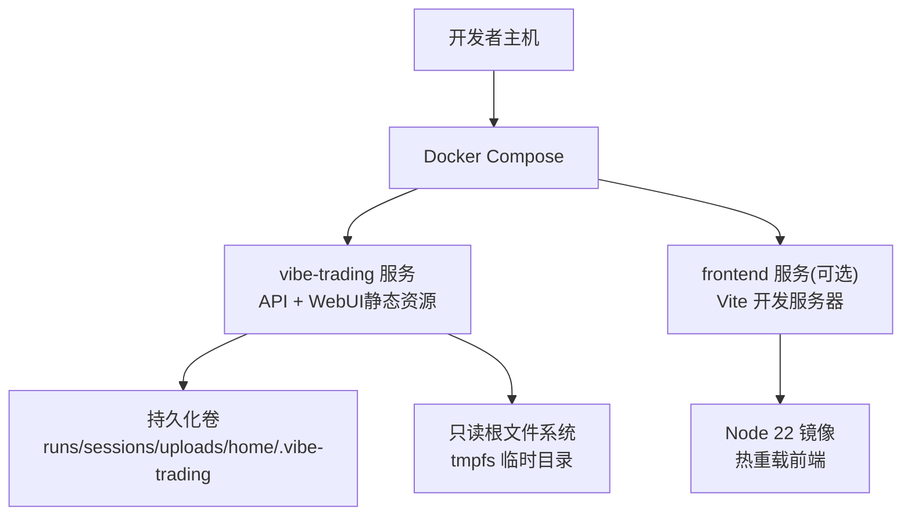
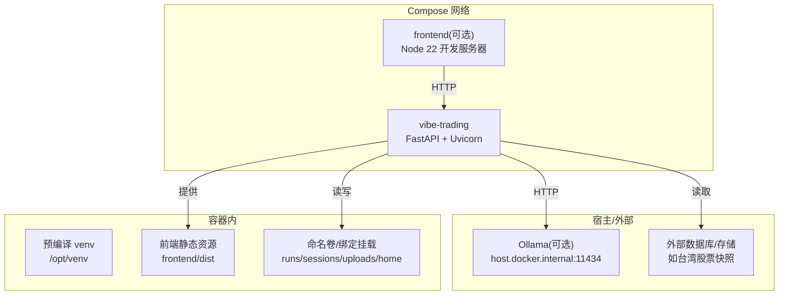
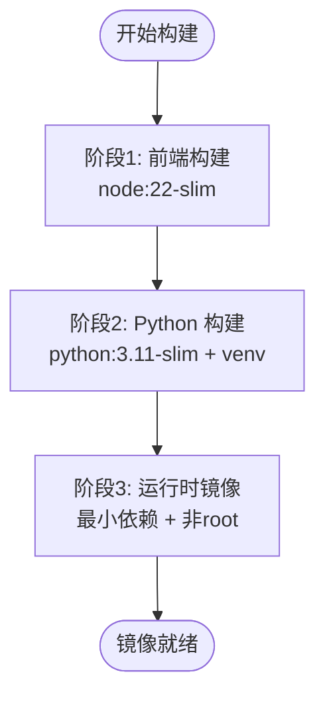
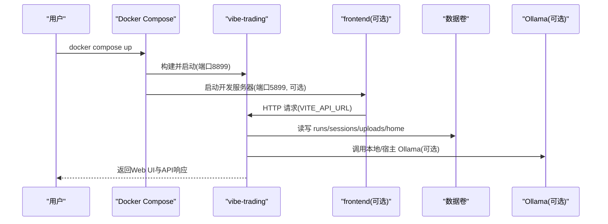
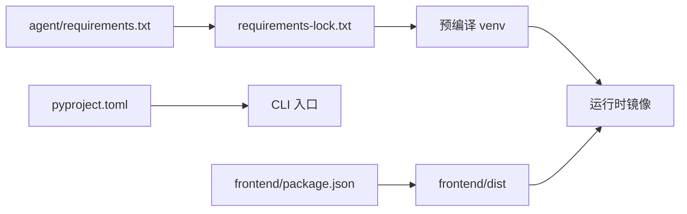

# 容器化部署

<cite>
**本文引用的文件**
- [Dockerfile](file://Dockerfile)
- [docker-compose.yml](file://docker-compose.yml)
- [.devcontainer/devcontainer.json](file://.devcontainer/devcontainer.json)
- [.dockerignore](file://.dockerignore)
- [agent/requirements.txt](file://agent/requirements.txt)
- [pyproject.toml](file://pyproject.toml)
</cite>

## 目录
1. [简介](#简介)
2. [项目结构](#项目结构)
3. [核心组件](#核心组件)
4. [架构总览](#架构总览)
5. [详细组件分析](#详细组件分析)
6. [依赖关系分析](#依赖关系分析)
7. [性能与体积优化](#性能与体积优化)
8. [故障排查指南](#故障排查指南)
9. [结论](#结论)
10. [附录](#附录)

## 简介
本章节面向希望将 Vibe-Trading 以容器方式在开发或生产环境部署的工程师，系统说明多阶段 Docker 构建流程、镜像最佳实践、docker-compose 编排配置、环境变量注入、健康检查与日志策略，以及常见问题与优化技巧。文档严格基于仓库中的 Dockerfile、docker-compose.yml、.devcontainer 与相关配置文件进行分析与总结。

## 项目结构
Vibe-Trading 的容器化由以下关键文件协同完成：
- Dockerfile：定义三阶段构建（前端构建、Python 依赖编译、运行时最小镜像）与安全与运行配置。
- docker-compose.yml：编排 API 服务与可选的前端开发服务，管理端口、环境变量、数据卷、资源限制与安全加固。
- .devcontainer/devcontainer.json：VS Code Dev Container 配置，提供本地一体化开发体验。
- .dockerignore：排除不必要的上下文文件，减小构建上下文并提升缓存命中率。
- agent/requirements.txt 与 pyproject.toml：声明 Python 依赖与可执行入口，配合 requirements-lock.txt 实现可重复安装。

图表来源
- [docker-compose.yml:1-90](file://docker-compose.yml#L1-L90)
- [Dockerfile:1-108](file://Dockerfile#L1-L108)

章节来源
- [Dockerfile:1-108](file://Dockerfile#L1-L108)
- [docker-compose.yml:1-90](file://docker-compose.yml#L1-L90)
- [.devcontainer/devcontainer.json:1-40](file://.devcontainer/devcontainer.json#L1-L40)
- [.dockerignore:1-54](file://.dockerignore#L1-L54)

## 核心组件
- 多阶段构建
  - 前端构建阶段：使用 Node 22 slim 镜像构建 React/Vite 前端产物，仅输出静态资源到 dist。
  - Python 构建阶段：使用 python:3.11-slim 创建隔离 venv，安装锁定依赖并 editable 安装项目，生成 wheel 与可执行入口。
  - 运行时阶段：仅复制预编译 venv 与必要系统库，剥离编译器与开发工具，降低镜像体积与攻击面。
- 安全与权限
  - 非 root 用户运行：创建普通用户 vibe 与无 shell 的系统账户 vibe-sandbox，进程以 vibe 身份启动；LLM 生成的代码通过子进程以 vibe-sandbox 执行，遵循最小权限原则。
  - 只读根文件系统：启用 read_only，并通过 tmpfs 挂载 /tmp、~/.cache、~/.config 等写路径。
  - 能力裁剪：默认 drop ALL，仅保留 SETUID/SETGID 用于子进程降权。
- 健康检查
  - 内置 HEALTHCHECK 定期探测 /live 端点，便于编排平台进行存活探针。
- 环境变量与配置
  - 通过 env_file 与环境变量注入 LLM、数据库、代理等配置；Compose 中为 Ollama 默认指向 host.docker.internal，并提供覆盖方式。
- 数据持久化
  - 通过命名卷与绑定挂载持久化 runs、sessions、uploads、用户级状态目录与台湾股票快照数据。

章节来源
- [Dockerfile:1-108](file://Dockerfile#L1-L108)
- [docker-compose.yml:1-90](file://docker-compose.yml#L1-L90)

## 架构总览
下图展示了 compose 编排下的服务拓扑、网络与数据流：

图表来源
- [docker-compose.yml:1-90](file://docker-compose.yml#L1-L90)
- [Dockerfile:1-108](file://Dockerfile#L1-L108)

## 详细组件分析

### 多阶段 Docker 构建过程
- 前端构建阶段
  - 使用 node:22-slim 镜像，安装依赖并执行构建命令，产出静态资源至 frontend/dist。
  - 该阶段仅负责构建，不进入最终镜像。
- Python 依赖编译阶段
  - 使用 python:3.11-slim 镜像，安装 build-essential 以支持原生扩展编译。
  - 创建独立 venv 并安装锁定依赖，确保可重复构建。
  - 以 editable 方式安装项目，使 CLI 入口可用。
- 运行时优化阶段
  - 仅复制预编译 venv 与必要的系统库（PDF 渲染所需字体与图形库）。
  - 设置环境变量禁用字节码写入与缓冲，提升日志实时性。
  - 创建非 root 用户与沙箱用户，设置目录权限，暴露端口与健康检查。
  - 启动命令调用 CLI 的 serve 子命令，同时提供前端静态资源。

图表来源
- [Dockerfile:1-108](file://Dockerfile#L1-L108)

章节来源
- [Dockerfile:1-108](file://Dockerfile#L1-L108)

### Docker 镜像最佳实践
- 镜像大小优化
  - 多阶段构建分离构建与运行依赖，避免编译器与开发工具进入运行时镜像。
  - 使用 --no-cache-dir 与清理 apt 列表减少层体积。
  - 仅安装 PDF 渲染所需的系统库，避免冗余。
- 安全配置
  - 非 root 用户运行，限制能力集，启用只读根文件系统与 tmpfs 临时目录。
  - 子进程以无 shell 的沙箱用户执行，降低风险。
- 健康检查
  - 内置 /live 健康检查，便于编排平台自动重启异常实例。
- 可观测性
  - 关闭字节码写入与缓冲，便于日志收集与调试。

章节来源
- [Dockerfile:1-108](file://Dockerfile#L1-L108)

### docker-compose 编排配置
- 服务依赖
  - vibe-trading：主服务，构建自 Dockerfile，暴露 8899 端口，挂载数据卷，注入环境变量。
  - frontend（可选）：Node 22 开发服务器，监听 5899，依赖 vibe-trading 启动后运行。
- 网络配置
  - 默认桥接网络，服务间通过服务名通信。
  - 通过 extra_hosts 映射 host.docker.internal 到 host-gateway，便于访问宿主机上的 Ollama。
- 数据卷管理
  - 命名卷：runs、sessions、swarm-runs、uploads、home（用户级状态）。
  - 绑定挂载：agent/.env 与台湾股票快照数据（只读）。
- 资源限制
  - 内存、CPU、进程数限制，防止单任务占用过多资源。
- 安全加固
  - 能力裁剪、只读根文件系统、tmpfs 临时目录、no-new-privileges。

图表来源
- [docker-compose.yml:1-90](file://docker-compose.yml#L1-L90)

章节来源
- [docker-compose.yml:1-90](file://docker-compose.yml#L1-L90)

### 开发环境容器配置
- VS Code Dev Container
  - 使用 mcr.microsoft.com/devcontainers/python:1-3.11-bookworm 基础镜像，并启用 Node 20 特性。
  - 转发 8899（API）与 5899（前端）端口，便于浏览器访问。
  - 初始化命令安装 Python 包与前端依赖，提供开箱即用的开发体验。
  - 自定义 VS Code 扩展与 Python 解释器路径。

章节来源
- [.devcontainer/devcontainer.json:1-40](file://.devcontainer/devcontainer.json#L1-L40)

### 环境变量注入、健康检查与日志策略
- 环境变量注入
  - 通过 env_file 加载 agent/.env，并在 compose 中注入信任回环、数据库路径、Ollama 地址等。
  - 支持通过顶层 .env 或显式环境变量覆盖默认值。
- 健康检查
  - 容器内周期性探测 /live 端点，失败时标记不健康，编排平台可据此重启。
- 日志策略
  - 关闭字节码写入与缓冲，保证日志实时输出，便于集中采集。
  - 结合编排平台的日志驱动（stdout/stderr）统一收集。

章节来源
- [Dockerfile:1-108](file://Dockerfile#L1-L108)
- [docker-compose.yml:1-90](file://docker-compose.yml#L1-L90)

## 依赖关系分析
- Python 依赖
  - 通过 agent/requirements.txt 声明核心依赖，配合 requirements-lock.txt 实现可重复安装。
  - pyproject.toml 定义项目元数据、依赖与可选依赖组，并暴露 CLI 入口。
- 前端依赖
  - 前端构建阶段使用 npm ci 安装依赖，确保锁文件一致。
- 系统依赖
  - 运行时仅安装 PDF 渲染所需系统库与字体，避免引入编译工具链。

图表来源
- [agent/requirements.txt:1-69](file://agent/requirements.txt#L1-L69)
- [pyproject.toml:1-272](file://pyproject.toml#L1-L272)
- [Dockerfile:1-108](file://Dockerfile#L1-L108)

章节来源
- [agent/requirements.txt:1-69](file://agent/requirements.txt#L1-L69)
- [pyproject.toml:1-272](file://pyproject.toml#L1-L272)
- [Dockerfile:1-108](file://Dockerfile#L1-L108)

## 性能与体积优化
- 构建缓存优化
  - 先复制依赖文件再复制源码，利用 Docker 层缓存加速重建。
  - 使用 npm ci 与 pip install --require-hashes 确保依赖稳定且可缓存。
- 镜像体积优化
  - 多阶段构建剥离构建期依赖。
  - 仅安装运行时必需的系统库与字体。
  - 使用 slim 基础镜像与清理 apt 缓存。
- 运行时性能
  - 限制内存、CPU 与进程数，防止单任务拖垮宿主。
  - 使用只读根文件系统与 tmpfs 减少磁盘写入放大。
- 网络与 I/O
  - 合理设置超时与重试策略（依赖库层面），避免阻塞。
  - 对大文件上传与报告生成使用异步与分页处理（应用层）。

[本节为通用指导，无需特定文件引用]

## 故障排查指南
- 无法连接 Ollama
  - 现象：容器内 localhost 指向自身而非宿主。
  - 解决：使用 host.docker.internal 或通过 extra_hosts 映射 host-gateway；可通过环境变量覆盖 OLLAMA_BASE_URL。
- 权限问题
  - 现象：写入 runs/sessions/uploads 失败。
  - 解决：确保命名卷或绑定挂载路径存在且具备正确权限；compose 已创建目录并设置所有者。
- 健康检查失败
  - 现象：/live 不可达。
  - 解决：检查服务是否成功启动、端口是否正确暴露、防火墙是否放行。
- 构建缓慢或失败
  - 现象：npm/pip 安装慢或失败。
  - 解决：检查网络代理、镜像源；确认 lock 文件有效；必要时清理 Docker 构建缓存。
- 资源不足
  - 现象：OOM 或 CPU 限流。
  - 解决：调整 compose 中的 mem_limit、cpus、pids_limit；评估任务并发与数据规模。

章节来源
- [docker-compose.yml:1-90](file://docker-compose.yml#L1-L90)
- [Dockerfile:1-108](file://Dockerfile#L1-L108)

## 结论
Vibe-Trading 的容器化方案采用多阶段构建、最小运行时镜像、非 root 用户与只读根文件系统的安全实践，结合 docker-compose 的数据卷与资源限制，提供了从开发到生产的完整部署路径。通过环境变量注入与健康检查，服务具备良好的可观测性与自愈能力。建议在生产环境中根据实际负载调整资源限制，并结合集中式日志与监控体系进行运维保障。

[本节为总结性内容，无需特定文件引用]

## 附录
- 快速启动
  - 开发：使用 .devcontainer 一键搭建开发环境。
  - 本地：docker compose up 启动 API 与可选前端开发服务。
- 生产部署
  - 使用固定版本镜像与锁文件，配置环境变量与数据卷，设置健康检查与日志收集。
- 扩展阅读
  - 参考 pyproject.toml 的可选依赖组按需启用功能（如 mt5、openbb、stats 等）。

[本节为补充信息，无需特定文件引用]