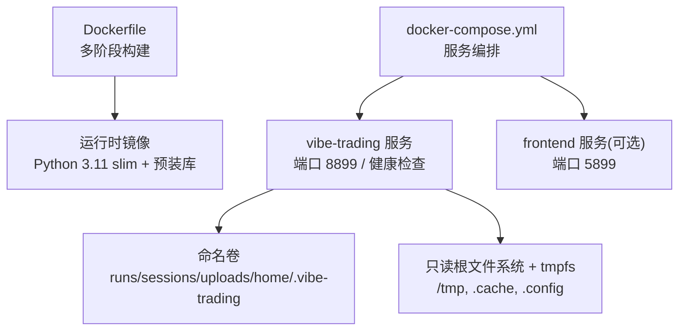
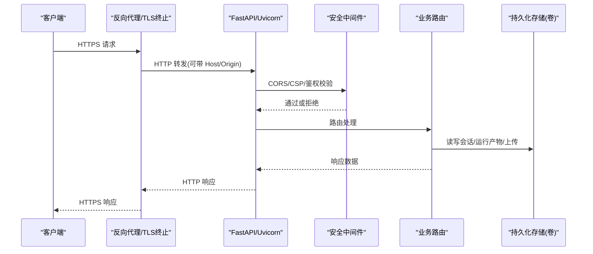
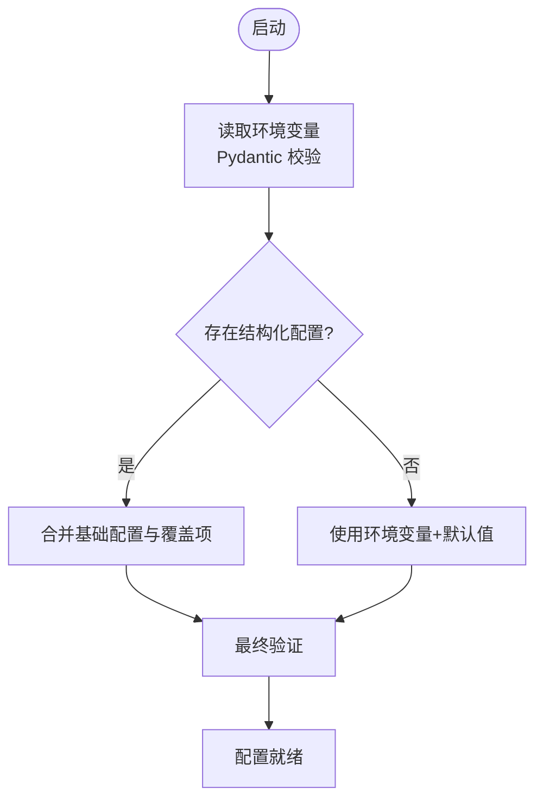
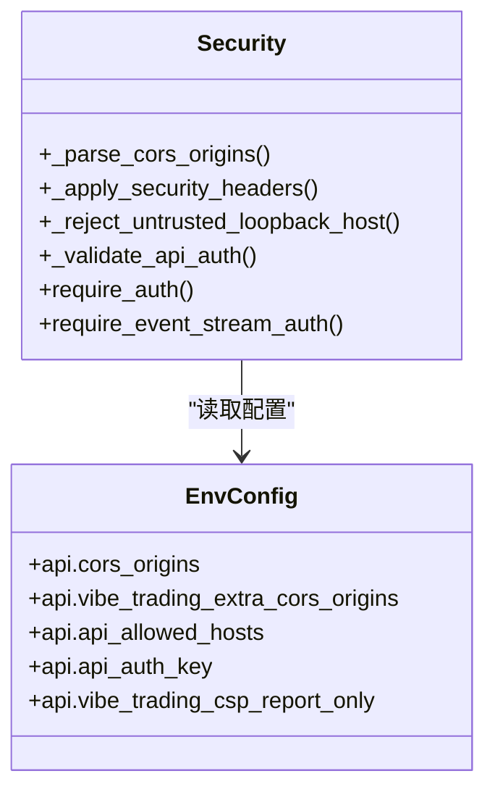
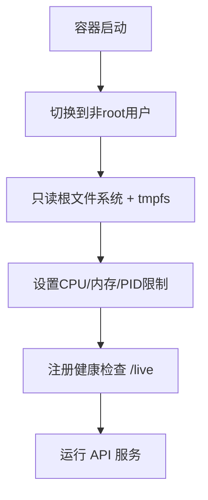
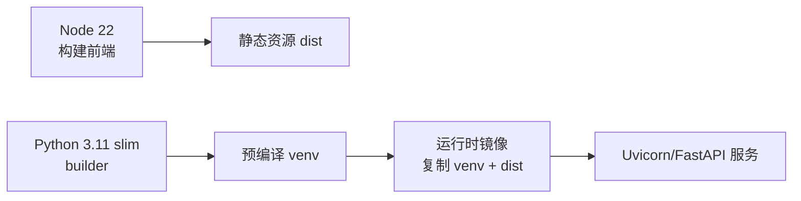

# 生产环境配置

<cite>
**本文引用的文件**
- [Dockerfile](file://Dockerfile)
- [docker-compose.yml](file://docker-compose.yml)
- [pyproject.toml](file://pyproject.toml)
- [agent/api_server.py](file://agent/api_server.py)
- [agent/src/config/env_schema.py](file://agent/src/config/env_schema.py)
- [agent/src/config/loader.py](file://agent/src/config/loader.py)
- [agent/src/config/paths.py](file://agent/src/config/paths.py)
- [agent/src/api/security.py](file://agent/src/api/security.py)
</cite>

## 目录
1. [简介](#简介)
2. [项目结构](#项目结构)
3. [核心组件](#核心组件)
4. [架构总览](#架构总览)
5. [详细组件分析](#详细组件分析)
6. [依赖关系分析](#依赖关系分析)
7. [性能与资源规划](#性能与资源规划)
8. [故障排查指南](#故障排查指南)
9. [结论](#结论)
10. [附录：云平台部署要点](#附录云平台部署要点)

## 简介
本文件面向生产环境，系统化说明 Vibe-Trading 的系统要求、资源规划、网络与安全配置、环境变量管理策略、反向代理与 TLS 建议、进程管理与监控、以及在不同云平台的部署注意事项。内容严格基于仓库中的 Dockerfile、Compose 配置、API 服务入口与安全模块、以及集中式环境变量 Schema 实现。

## 项目结构
Vibe-Trading 的生产镜像采用多阶段构建：前端静态资源由 Node 构建，Python 依赖在独立 venv 中预编译并复制到最小化运行时镜像；容器默认以非 root 用户运行，暴露 8899 端口并提供健康检查。Compose 编排了 API 服务与可选的前端开发服务，并通过命名卷持久化会话、运行产物、上传文件与用户数据。

**图示来源**
- [Dockerfile:48-107](file://Dockerfile#L48-L107)
- [docker-compose.yml:1-66](file://docker-compose.yml#L1-L66)

**章节来源**
- [Dockerfile:1-107](file://Dockerfile#L1-L107)
- [docker-compose.yml:1-90](file://docker-compose.yml#L1-L90)

## 核心组件
- 应用服务：FastAPI + Uvicorn，提供 REST/SSE/WebSocket 等接口，并托管前端静态资源。
- 配置系统：集中式 Pydantic 模型统一读取、校验和合并环境变量与结构化配置文件。
- 安全与鉴权：CORS、CSP、Host 白名单、SSE 票据、API Key 认证、日志脱敏。
- 进程与资源：容器内最小权限运行，限制内存/CPU/PID，启用 no-new-privileges，读写分离。
- 数据持久化：通过命名卷持久化运行态数据（会话、运行结果、上传文件、用户状态）。

**章节来源**
- [agent/api_server.py:163-183](file://agent/api_server.py#L163-L183)
- [agent/src/config/env_schema.py:545-577](file://agent/src/config/env_schema.py#L545-L577)
- [agent/src/api/security.py:147-158](file://agent/src/api/security.py#L147-L158)
- [docker-compose.yml:40-66](file://docker-compose.yml#L40-L66)

## 架构总览
下图展示生产环境下请求从外部进入，经反向代理（建议）到 API 服务，再到后端业务逻辑与数据层的流程。

**图示来源**
- [agent/api_server.py:173-183](file://agent/api_server.py#L173-L183)
- [agent/src/api/security.py:166-173](file://agent/src/api/security.py#L166-L173)
- [docker-compose.yml:20-39](file://docker-compose.yml#L20-L39)

## 详细组件分析

### 环境变量与配置管理
- 单一真相源：所有环境变量通过 Pydantic 模型集中定义、类型校验、默认值与别名处理，避免分散的 os.getenv。
- 分组覆盖：LLM、数据源、API、Swarm、Agent 调优、路径、OCR、记忆系统等分组清晰，便于按环境切换。
- 兼容与迁移：支持旧变量名向后兼容（如 OCR 相关），并在顶层自动补齐 API Key 别名。
- 结构化配置加载：支持 JSON/YAML 结构化配置文件，具备回退与合并机制，会话级覆盖受安全约束。

**图示来源**
- [agent/src/config/env_schema.py:71-114](file://agent/src/config/env_schema.py#L71-L114)
- [agent/src/config/env_schema.py:545-577](file://agent/src/config/env_schema.py#L545-L577)
- [agent/src/config/loader.py:28-55](file://agent/src/config/loader.py#L28-L55)
- [agent/src/config/loader.py:57-100](file://agent/src/config/loader.py#L57-L100)

**章节来源**
- [agent/src/config/env_schema.py:122-197](file://agent/src/config/env_schema.py#L122-L197)
- [agent/src/config/env_schema.py:245-295](file://agent/src/config/env_schema.py#L245-L295)
- [agent/src/config/loader.py:107-134](file://agent/src/config/loader.py#L107-L134)
- [agent/src/config/loader.py:137-151](file://agent/src/config/loader.py#L137-L151)
- [agent/src/config/paths.py:13-34](file://agent/src/config/paths.py#L13-L34)

### 安全与鉴权
- CORS：默认仅允许本地开发来源；可通过环境变量追加额外可信来源，禁止通配符。
- CSP：默认严格策略，文档页面放宽至 CDN；支持“仅报告”模式用于灰度回滚。
- Host 白名单：防止 DNS 重绑定攻击，仅信任回环与显式配置的 Host。
- SSE 票据：浏览器 EventSource 无法携带 Authorization 头，通过一次性票据短期授权。
- API Key：支持 Header/Query 两种传入方式（按场景控制），未配置时仅信任本地回环访问。
- 日志脱敏：对访问日志中的敏感查询参数进行脱敏。

**图示来源**
- [agent/src/api/security.py:69-103](file://agent/src/api/security.py#L69-L103)
- [agent/src/api/security.py:166-173](file://agent/src/api/security.py#L166-L173)
- [agent/src/api/security.py:235-253](file://agent/src/api/security.py#L235-L253)
- [agent/src/api/security.py:347-366](file://agent/src/api/security.py#L347-L366)
- [agent/src/api/security.py:463-504](file://agent/src/api/security.py#L463-L504)
- [agent/src/config/env_schema.py:245-295](file://agent/src/config/env_schema.py#L245-L295)

**章节来源**
- [agent/src/api/security.py:147-158](file://agent/src/api/security.py#L147-L158)
- [agent/src/api/security.py:235-253](file://agent/src/api/security.py#L235-L253)
- [agent/src/api/security.py:300-341](file://agent/src/api/security.py#L300-L341)
- [agent/src/api/security.py:463-504](file://agent/src/api/security.py#L463-L504)

### 进程管理与资源限制
- 非 root 运行：容器内创建普通用户，降低风险面。
- 只读根文件系统：关键写目录通过命名卷挂载；临时目录使用 tmpfs。
- 能力裁剪：drop ALL，仅保留必要的 SETUID/SETGID 以支撑子进程降权执行。
- 资源上限：限制 CPU、内存、进程数，防止单任务拖垮主机。
- 健康检查：HTTP 探针探测 /live，供编排器判断存活。

**图示来源**
- [Dockerfile:88-107](file://Dockerfile#L88-L107)
- [docker-compose.yml:40-66](file://docker-compose.yml#L40-L66)

**章节来源**
- [Dockerfile:88-107](file://Dockerfile#L88-L107)
- [docker-compose.yml:40-66](file://docker-compose.yml#L40-L66)

### 数据持久化与缓存
- 持久化卷：runs、sessions、uploads、swarm runs、用户家目录等通过命名卷持久化，重建不丢失。
- 数据缓存：提供数据缓存开关与根路径配置，可按需开启以提升性能。
- 台湾股票快照：只读挂载外部数据目录，避免污染工作树。

**章节来源**
- [docker-compose.yml:20-39](file://docker-compose.yml#L20-L39)
- [agent/src/config/env_schema.py:185-187](file://agent/src/config/env_schema.py#L185-L187)

### 会话管理与通道
- 会话服务：API 启动时初始化会话服务，支持事件流与通道运行时。
- 通道自动启动：可通过环境变量控制是否自动启动消息通道运行时。
- 安全写入：设置写入需要本地或鉴权，防止越权修改。

**章节来源**
- [agent/api_server.py:127-160](file://agent/api_server.py#L127-L160)
- [agent/src/config/env_schema.py:363-365](file://agent/src/config/env_schema.py#L363-L365)
- [agent/src/api/security.py:640-656](file://agent/src/api/security.py#L640-L656)

## 依赖关系分析
- 运行时依赖：Python 3.11 slim，安装 weasyprint 所需系统库与字体，确保 PDF 渲染可用。
- 前端构建：Node 22 构建静态资源，复制进运行时镜像。
- 包管理：requirements-lock.txt 锁定依赖哈希，保证可重复构建。

**图示来源**
- [Dockerfile:4-11](file://Dockerfile#L4-L11)
- [Dockerfile:17-43](file://Dockerfile#L17-L43)
- [Dockerfile:48-86](file://Dockerfile#L48-L86)

**章节来源**
- [Dockerfile:17-43](file://Dockerfile#L17-L43)
- [Dockerfile:48-86](file://Dockerfile#L48-L86)
- [pyproject.toml:24-69](file://pyproject.toml#L24-L69)

## 性能与资源规划
- 资源限制：默认限制 2 CPU、4GB 内存、512 进程数，适合单机自托管；可在 Compose 覆盖文件中调整。
- 只读根文件系统 + tmpfs：减少磁盘写入放大，提升稳定性。
- 健康检查：每 30 秒探测一次，超时 5 秒，重试 3 次，适合编排器自愈。
- 依赖优化：builder 与 runtime 分离，运行时不含编译工具链，减小镜像体积。

**章节来源**
- [docker-compose.yml:61-66](file://docker-compose.yml#L61-L66)
- [Dockerfile:102-107](file://Dockerfile#L102-L107)
- [Dockerfile:48-75](file://Dockerfile#L48-L75)

## 故障排查指南
- 无法访问 API：
  - 确认绑定的 host 是否为回环地址或未配置 API Key 时的远程访问被拒绝。
  - 检查 CORS 与 Host 白名单是否包含实际来源。
- 前端无法加载：
  - 确认已构建前端静态资源并挂载到运行时镜像。
- 健康检查失败：
  - 检查 /live 端点可达性与端口映射。
- 权限问题：
  - 确认卷挂载后属主为 vibe 用户，且 tmpfs 可用。
- 日志泄露：
  - 确认已安装访问日志脱敏过滤器，避免 api_key/ticket 明文落盘。

**章节来源**
- [agent/api_server.py:349-354](file://agent/api_server.py#L349-L354)
- [agent/src/api/security.py:166-173](file://agent/src/api/security.py#L166-L173)
- [Dockerfile:102-107](file://Dockerfile#L102-L107)
- [docker-compose.yml:88-97](file://docker-compose.yml#L88-L97)
- [agent/src/api/security.py:272-297](file://agent/src/api/security.py#L272-L297)

## 结论
Vibe-Trading 在生产环境中通过多阶段镜像、最小化运行时、严格的容器安全策略、集中式环境变量与结构化配置、以及完善的安全中间件，提供了高可用、易运维的基础设施。结合合理的反向代理与 TLS 终止、资源限制与健康检查，可满足大多数企业级部署需求。

## 附录：云平台部署要点
- AWS
  - ECS/Fargate：将 Compose 转换为 Task Definition，设置环境变量与卷（EFS）持久化；ALB 终止 TLS，设置健康检查路径为 /live。
  - IAM：为 EFS 与 Secrets Manager 集成授予最小权限。
- Azure
  - Container Apps：使用环境变量注入密钥，挂载 Azure Files 作为持久卷；App Gateway 或 Front Door 终止 TLS。
  - Key Vault：通过引用注入敏感配置。
- GCP
  - Cloud Run：设置环境变量与 Secret Manager 引用；Cloud Load Balancer 终止 TLS，健康检查 /live。
  - Cloud SQL/Storage：如需数据库或对象存储，通过 VPC 接入。
- 本地服务器
  - 使用 docker-compose 直接运行；如需公网暴露，务必在 Nginx/Caddy 前加 TLS 与 Host 白名单。
  - 定期备份命名卷数据（runs/sessions/uploads/home）。

[本节为通用指导，不直接分析具体代码文件]