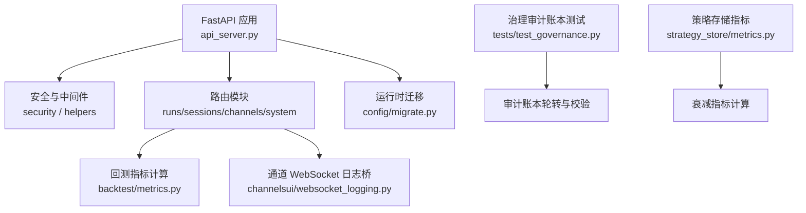
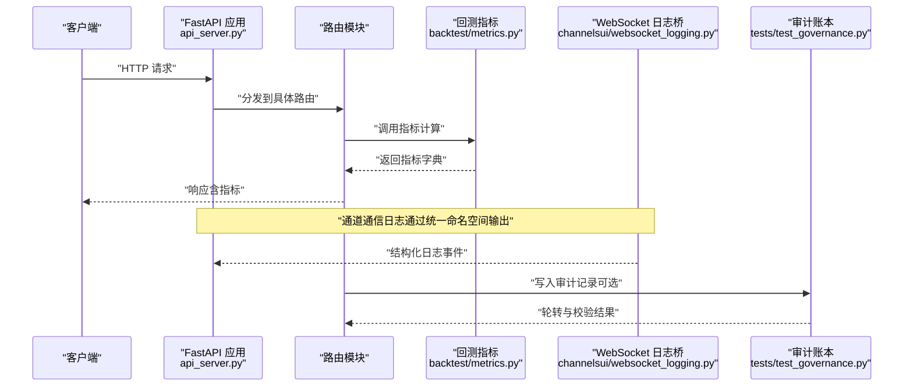
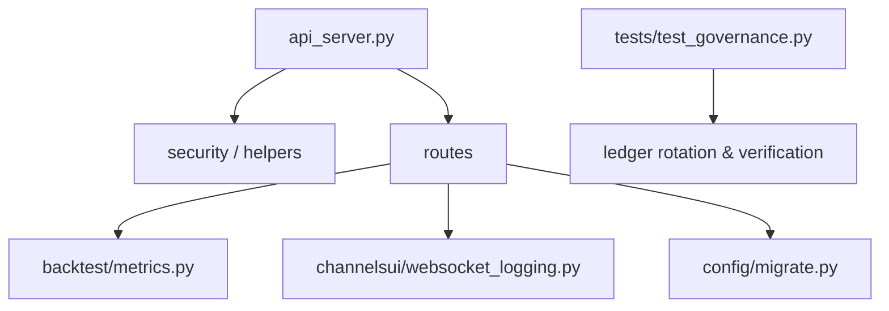

# 监控告警

<cite>
**本文引用的文件**
- [api_server.py](file://agent/api_server.py)
- [metrics.py](file://agent/backtest/metrics.py)
- [websocket_logging.py](file://agent/src/channelsui/websocket_logging.py)
- [migrate.py](file://agent/src/config/migrate.py)
- [governance_ledger_test.py](file://agent/tests/test_governance.py)
- [strategy_store_metrics.py](file://agent/src/strategy_store/metrics.py)
</cite>

## 目录
1. [简介](#简介)
2. [项目结构](#项目结构)
3. [核心组件](#核心组件)
4. [架构总览](#架构总览)
5. [详细组件分析](#详细组件分析)
6. [依赖关系分析](#依赖关系分析)
7. [性能考量](#性能考量)
8. [故障诊断指南](#故障诊断指南)
9. [结论](#结论)
10. [附录](#附录)

## 简介
本章节面向 Vibe-Trading 的监控与告警体系，聚焦以下目标：
- 应用性能监控指标收集：API 响应时间、内存使用率、CPU 利用率。
- 业务指标监控：回测任务状态、数据加载性能、用户活动追踪。
- 日志收集与分析策略：结构化日志格式、日志轮转、集中式日志管理。
- 告警规则配置：阈值设置、通知渠道、告警升级机制。
- 监控系统集成：Prometheus、Grafana、ELK Stack 等工具的配置与使用建议。
- 故障诊断工具与性能分析方法指导。

说明：当前仓库未内置 Prometheus/Grafana/ELK 的直接集成代码，但提供了可观测性基础（结构化日志、审计账本、运行指标计算），可通过外部系统采集与可视化。

## 项目结构
Vibe-Trading 的可观测性相关能力主要分布在以下位置：
- API 服务装配与安全中间件：负责请求处理入口、安全头、CORS、SSE 票据等，便于接入统一访问日志与限流。
- 回测指标计算：提供年化、收益、回撤、换手率、基准对比等指标，是业务监控的核心数据来源。
- 通道 WebSocket 日志桥：为消息通道适配器提供统一的日志命名空间，便于集中采集。
- 运行时状态迁移：保证会话、运行产物等持久化路径稳定，利于日志与指标关联。
- 治理审计账本：具备按大小轮转与链式校验能力，适合审计与合规场景。
- 策略开发管理器指标：对因子/策略历史进行衰减评估，支撑业务质量监控。

图表来源
- [api_server.py:163-183](file://agent/api_server.py#L163-L183)
- [metrics.py:458-623](file://agent/backtest/metrics.py#L458-L623)
- [websocket_logging.py:1-8](file://agent/src/channelsui/websocket_logging.py#L1-L8)
- [migrate.py:1-30](file://agent/src/config/migrate.py#L1-L30)
- [strategy_store_metrics.py:24-90](file://agent/src/strategy_store/metrics.py#L24-L90)

章节来源
- [api_server.py:1-200](file://agent/api_server.py#L1-L200)
- [metrics.py:1-638](file://agent/backtest/metrics.py#L1-L638)
- [websocket_logging.py:1-8](file://agent/src/channelsui/websocket_logging.py#L1-L8)
- [migrate.py:1-30](file://agent/src/config/migrate.py#L1-L30)
- [strategy_store_metrics.py:1-90](file://agent/src/strategy_store/metrics.py#L1-L90)

## 核心组件
- API 服务装配与安全中间件
  - 创建 FastAPI 应用，挂载 CORS、安全头、SPA 深链回退等中间件；在启动时执行预检查、迁移与调度器初始化。
  - 通过安全模块暴露认证、票据、CORS、主机白名单等能力，便于后续接入访问日志与审计。
- 回测指标计算
  - 提供年化因子映射、收益率计算、交易统计、换手率、基准对比、跟踪误差、Beta 等指标，覆盖多市场与多周期。
  - 输出标准化字典，便于写入运行卡片、报告或外部监控系统。
- 通道 WebSocket 日志桥
  - 为通道适配器的 WebSocket 通信提供统一日志命名空间，便于集中采集与过滤。
- 运行时状态迁移
  - 将历史状态从旧路径迁移到运行时根目录，确保会话、运行产物、上传等路径一致，便于日志与指标关联。
- 治理审计账本
  - 支持按大小轮转与链式校验，保留完整历史，适合审计与合规需求。
- 策略存储指标
  - 基于历史评估结果计算基线与滚动 IC/Sharpe 等指标，用于策略衰减监控。

章节来源
- [api_server.py:127-183](file://agent/api_server.py#L127-L183)
- [metrics.py:16-167](file://agent/backtest/metrics.py#L16-L167)
- [metrics.py:175-233](file://agent/backtest/metrics.py#L175-L233)
- [metrics.py:263-456](file://agent/backtest/metrics.py#L263-L456)
- [metrics.py:458-623](file://agent/backtest/metrics.py#L458-L623)
- [websocket_logging.py:1-8](file://agent/src/channelsui/websocket_logging.py#L1-L8)
- [migrate.py:1-30](file://agent/src/config/migrate.py#L1-L30)
- [strategy_store_metrics.py:15-90](file://agent/src/strategy_store/metrics.py#L15-L90)

## 架构总览
下图展示 API 服务、指标计算、日志桥与审计账本的交互关系，以及它们如何为监控与告警提供数据源。

图表来源
- [api_server.py:163-183](file://agent/api_server.py#L163-L183)
- [metrics.py:458-623](file://agent/backtest/metrics.py#L458-L623)
- [websocket_logging.py:1-8](file://agent/src/channelsui/websocket_logging.py#L1-L8)
- [governance_ledger_test.py:684-720](file://agent/tests/test_governance.py#L684-L720)

## 详细组件分析

### 应用性能监控指标收集（API 响应时间、内存使用率、CPU 利用率）
- API 响应时间
  - 建议在 FastAPI 中间件中增加请求耗时统计，结合安全中间件与 CORS 配置，统一输出结构化访问日志（包含方法、路径、状态码、耗时）。
  - 可在路由层对关键接口（如回测、会话、通道）打点，便于区分热点与慢请求。
- 内存使用率与 CPU 利用率
  - 建议在进程级采集系统资源指标（Python 进程 RSS、GC 次数、线程数），并定期上报至外部监控系统。
  - 对于长任务（回测、批量数据拉取），可在任务边界记录开始/结束时间与资源峰值，便于定位瓶颈。
- 指标导出与采集
  - 将指标以 JSON 形式写入运行产物或标准输出，供外部采集器（如 Telegraf、Fluent Bit）抓取并转发到 Prometheus 或 ELK。
  - 对 SSE 流式响应，可在心跳中附带轻量指标摘要，便于前端实时观察。

章节来源
- [api_server.py:163-183](file://agent/api_server.py#L163-L183)

### 业务指标监控（回测任务状态、数据加载性能、用户活动追踪）
- 回测任务状态
  - 使用回测指标计算模块输出的指标字典，作为任务健康度与效果评估依据；结合运行卡片与报告，形成可追溯的业务指标。
  - 对失败或异常的任务，记录错误上下文与堆栈摘要，便于快速定位。
- 数据加载性能
  - 在数据加载器边界记录请求耗时、重试次数、缓存命中情况；对高频或大体积数据源（如 yfinance、futu、ccxt）进行限流与退避。
  - 对缺失或异常数据，记录告警级别与降级策略，避免静默失败。
- 用户活动追踪
  - 通过会话与通道日志，记录用户操作序列与工具调用轨迹；对敏感信息脱敏后输出，便于审计与行为分析。
  - 结合运行 ID 与会话 ID，建立跨模块的关联键，便于端到端追踪。

章节来源
- [metrics.py:458-623](file://agent/backtest/metrics.py#L458-L623)
- [websocket_logging.py:1-8](file://agent/src/channelsui/websocket_logging.py#L1-L8)

### 日志收集与分析策略（结构化日志格式、日志轮转、集中式日志管理）
- 结构化日志格式
  - 建议使用 JSON 格式输出日志，包含时间戳、级别、模块名、请求 ID、会话 ID、用户 ID、耗时、状态码等字段。
  - 对敏感字段（如密钥、令牌）进行脱敏处理，避免泄露。
- 日志轮转
  - 审计账本已实现按大小轮转与链式校验，确保历史不丢失且可验证；可借鉴该模式应用于访问日志与业务日志。
  - 对高吞吐日志，建议采用异步写入与批处理，降低 IO 开销。
- 集中式日志管理
  - 将本地日志通过 Fluent Bit/Filebeat 等采集器转发至 Elasticsearch，或使用 Loki 进行聚合；配合 Grafana 进行可视化。
  - 对关键日志（错误、超时、限流）设置索引与保留策略，便于检索与告警。

章节来源
- [governance_ledger_test.py:684-720](file://agent/tests/test_governance.py#L684-L720)

### 告警规则配置（阈值设置、通知渠道、告警升级机制）
- 阈值设置
  - 针对 API 响应时间、错误率、资源使用率、回测指标（如最大回撤、夏普比率）、数据加载耗时等设定阈值。
  - 阈值应分环境（开发、测试、生产）与分模块（API、回测、数据加载）差异化配置。
- 通知渠道
  - 利用现有通道适配器（如 Slack、Telegram、钉钉、飞书、邮件）发送告警；对紧急告警启用多渠道冗余。
  - 告警内容需包含上下文（请求 ID、会话 ID、指标值、阈值、时间范围），便于快速定位。
- 告警升级机制
  - 对持续告警或严重告警进行升级，例如从“警告”升级为“严重”，并通知更高层负责人。
  - 对误报或已知问题，支持临时抑制与备注，避免噪音。

章节来源
- [api_server.py:163-183](file://agent/api_server.py#L163-L183)

### 监控系统集成（Prometheus、Grafana、ELK Stack）
- Prometheus
  - 在 API 层暴露 /metrics 端点，输出自定义指标（如请求计数、耗时直方图、错误计数）；使用 prometheus-client 或第三方库集成。
  - 对回测指标与数据加载指标，定期采样并推送到 Pushgateway 或直接暴露。
- Grafana
  - 连接 Prometheus 数据源，构建仪表盘展示 API 性能、资源使用、回测效果、数据加载效率等。
  - 配置告警规则，对接通知渠道，实现闭环监控。
- ELK Stack
  - 使用 Filebeat/Fluent Bit 采集本地日志，转发至 Logstash 进行解析与富化，再写入 Elasticsearch。
  - 在 Kibana 中构建日志查询与可视化面板，结合告警插件实现日志驱动告警。

章节来源
- [api_server.py:163-183](file://agent/api_server.py#L163-L183)

### 故障诊断工具与性能分析方法
- 故障诊断工具
  - 使用运行卡片与审计账本，回溯任务执行过程与关键决策点；结合结构化日志，定位错误根因。
  - 对数据加载失败，检查缓存命中、限流策略、网络代理与凭证配置。
- 性能分析方法
  - 对慢请求进行火焰图分析，识别 CPU 热点与锁竞争；对内存泄漏，使用内存分析工具（如 pympler、tracemalloc）定位。
  - 对回测性能瓶颈，优化数据对齐、向量化计算与并行策略；对数据加载，优化分页、缓存与重试逻辑。

章节来源
- [metrics.py:458-623](file://agent/backtest/metrics.py#L458-L623)
- [governance_ledger_test.py:684-720](file://agent/tests/test_governance.py#L684-L720)

## 依赖关系分析
下图展示 API 服务、指标计算、日志桥与审计账本之间的依赖关系。

图表来源
- [api_server.py:163-183](file://agent/api_server.py#L163-L183)
- [metrics.py:458-623](file://agent/backtest/metrics.py#L458-L623)
- [websocket_logging.py:1-8](file://agent/src/channelsui/websocket_logging.py#L1-L8)
- [migrate.py:1-30](file://agent/src/config/migrate.py#L1-L30)
- [governance_ledger_test.py:684-720](file://agent/tests/test_governance.py#L684-L720)

章节来源
- [api_server.py:163-183](file://agent/api_server.py#L163-L183)
- [metrics.py:458-623](file://agent/backtest/metrics.py#L458-L623)
- [websocket_logging.py:1-8](file://agent/src/channelsui/websocket_logging.py#L1-L8)
- [migrate.py:1-30](file://agent/src/config/migrate.py#L1-L30)
- [governance_ledger_test.py:684-720](file://agent/tests/test_governance.py#L684-L720)

## 性能考量
- 指标计算的性能影响
  - 回测指标计算涉及大量数值运算，建议使用向量化与并行优化，避免重复计算。
  - 对大样本数据，注意内存占用与 GC 压力，必要时分块处理。
- 日志与审计的开销
  - 审计账本轮转与校验会带来额外 IO 开销，建议在高吞吐场景下异步化与批处理。
  - 对敏感日志脱敏与富化会增加 CPU 消耗，需权衡精度与性能。
- 外部集成的延迟
  - 推送指标与日志到外部系统可能引入网络延迟与抖动，建议本地缓冲与重试机制。

[本节为通用性能讨论，无需特定文件引用]

## 故障诊断指南
- 常见问题定位
  - API 超时或错误：检查中间件与安全配置，查看访问日志与错误堆栈。
  - 回测指标异常：核对输入数据完整性与年化因子，检查零值与无穷值处理。
  - 数据加载失败：检查缓存、限流、代理与凭证，查看重试与降级策略。
- 诊断工具使用
  - 使用运行卡片与审计账本回溯执行过程；结合结构化日志与指标，定位根因。
  - 对性能问题，使用性能分析工具（如 cProfile、memory_profiler）进行剖析。
- 恢复与改进
  - 对已知问题，添加回归测试与防护逻辑；对偶发问题，增加重试与熔断机制。
  - 优化阈值与告警规则，减少误报与漏报。

章节来源
- [metrics.py:175-233](file://agent/backtest/metrics.py#L175-L233)
- [governance_ledger_test.py:684-720](file://agent/tests/test_governance.py#L684-L720)

## 结论
Vibe-Trading 提供了坚实的可观测性基础：标准化的回测指标、结构化日志桥、审计账本轮转与运行时状态迁移。通过这些能力，可以便捷地接入外部监控系统（Prometheus、Grafana、ELK），实现全面的性能监控、业务监控与告警。建议在生产环境中完善指标采集、日志轮转与告警规则，并结合故障诊断工具，持续提升系统稳定性与可维护性。

[本节为总结性内容，无需特定文件引用]

## 附录
- 术语表
  - 年化因子：用于将周期收益转换为年化收益的系数。
  - 跟踪误差：组合收益与基准收益的标准差，衡量偏离程度。
  - Beta：组合收益对基准收益的敏感度。
  - 审计账本：不可篡改的记录链，用于审计与合规。
- 参考链接
  - Prometheus 官方文档
  - Grafana 仪表盘与告警配置
  - ELK Stack 日志采集与可视化

[本节为补充信息，无需特定文件引用]