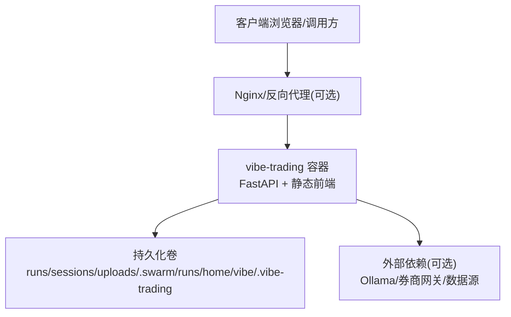
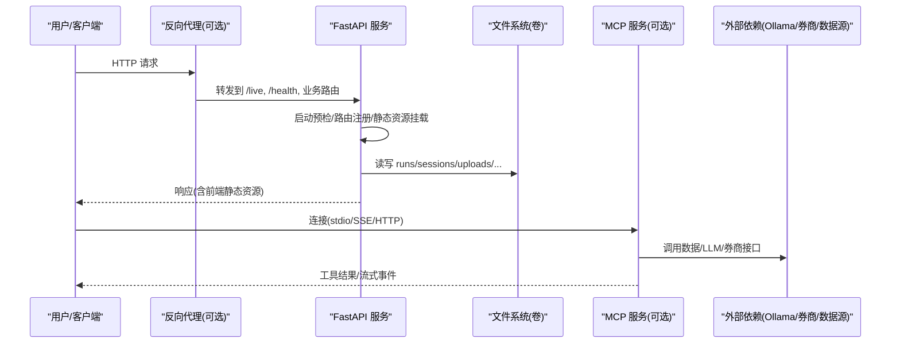
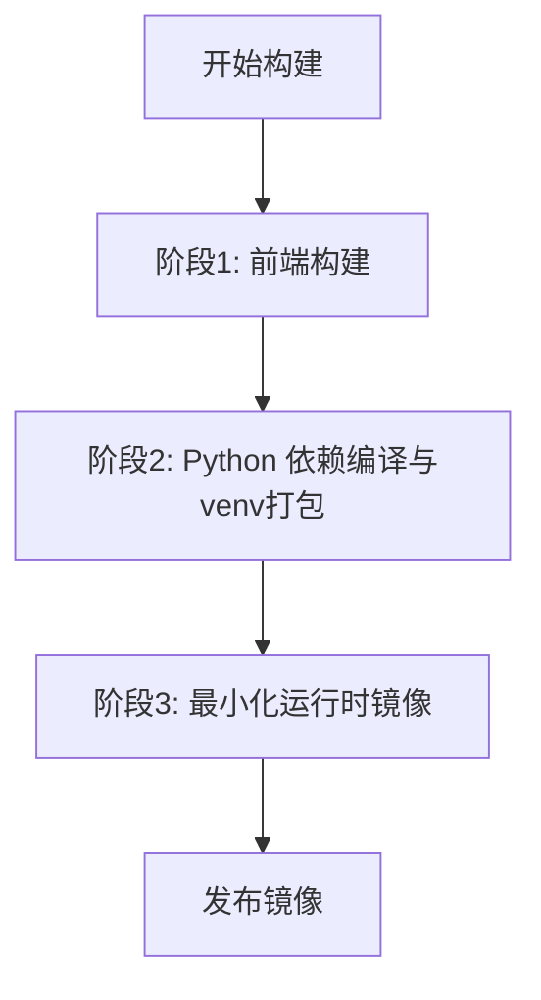
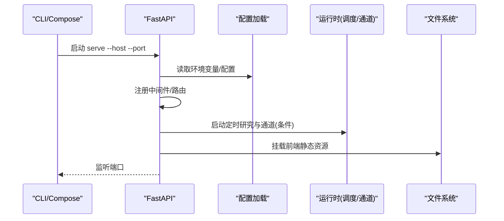
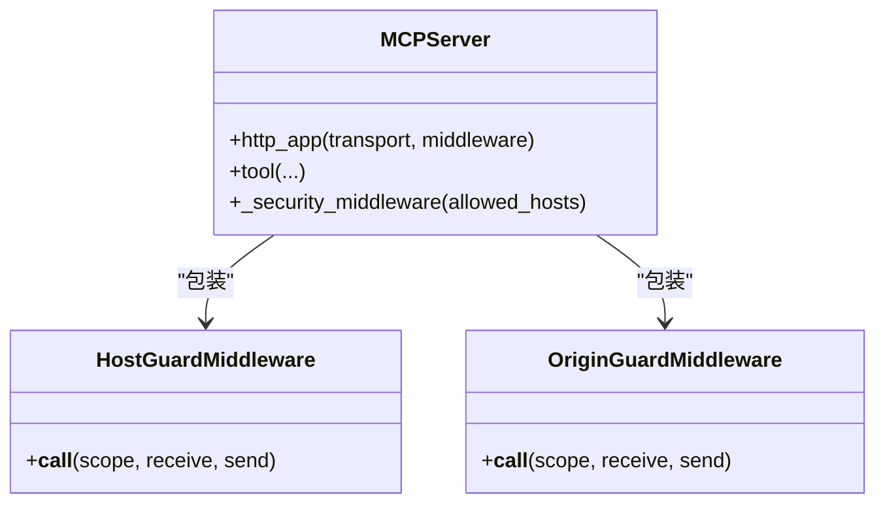
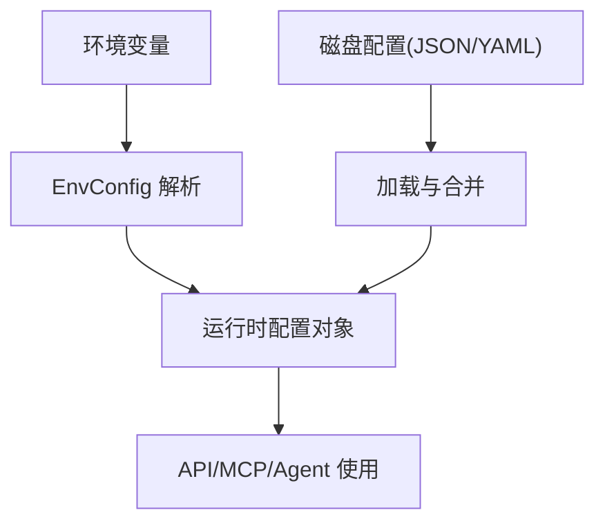
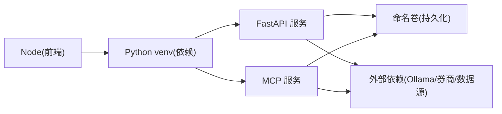
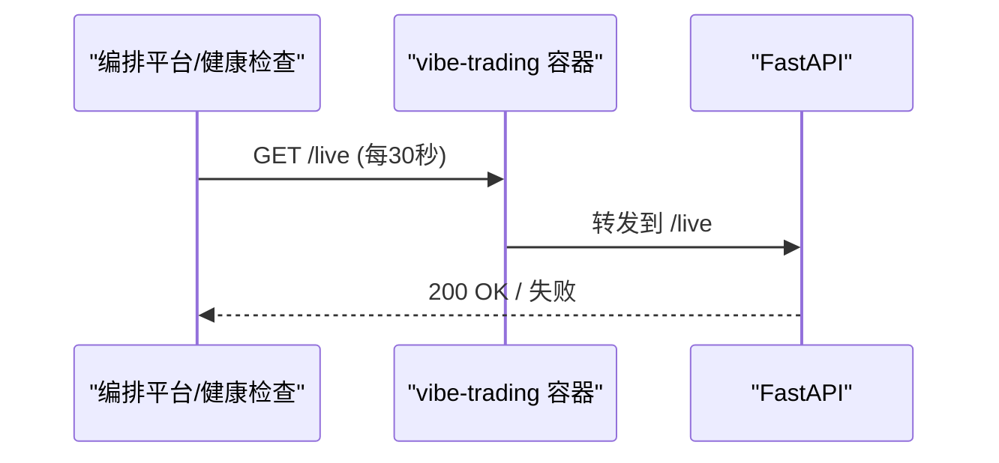

# 部署运维

<cite>
**本文引用的文件**
- [Dockerfile](file://Dockerfile)
- [docker-compose.yml](file://docker-compose.yml)
- [agent/api_server.py](file://agent/api_server.py)
- [agent/mcp_server.py](file://agent/mcp_server.py)
- [agent/src/config/env_schema.py](file://agent/src/config/env_schema.py)
- [agent/src/config/loader.py](file://agent/src/config/loader.py)
</cite>

## 目录
1. [简介](#简介)
2. [项目结构](#项目结构)
3. [核心组件](#核心组件)
4. [架构总览](#架构总览)
5. [详细组件分析](#详细组件分析)
6. [依赖关系分析](#依赖关系分析)
7. [性能与资源限制](#性能与资源限制)
8. [监控、健康检查与日志](#监控健康检查与日志)
9. [生产环境配置与最佳实践](#生产环境配置与最佳实践)
10. [CI/CD 集成](#cicd-集成)
11. [故障排查指南](#故障排查指南)
12. [结论](#结论)

## 简介
本文件面向 Vibe-Trading 的容器化部署与运维，覆盖镜像构建（多阶段优化）、环境变量配置、健康检查、生产与负载均衡、监控告警、日志收集、备份恢复、CI/CD 集成以及常见问题处理。文档基于仓库中的 Dockerfile、docker-compose、API 服务入口与环境配置模型等实际代码进行说明，并提供可操作的部署示例与最佳实践。

## 项目结构
Vibe-Trading 采用前后端分离：前端通过 Node 构建静态资源，后端以 Python FastAPI 提供 REST/MCP 能力；运行时由 Docker 容器承载，Compose 编排数据卷与安全加固。

**图表来源**
- [Dockerfile:48-107](file://Dockerfile#L48-L107)
- [docker-compose.yml:1-66](file://docker-compose.yml#L1-L66)

**章节来源**
- [Dockerfile:4-107](file://Dockerfile#L4-L107)
- [docker-compose.yml:1-66](file://docker-compose.yml#L1-L66)

## 核心组件
- 容器镜像与运行态
  - 三阶段构建：前端构建、Python 依赖编译与 venv 打包、最小化运行时镜像。
  - 非 root 用户运行、只读根文件系统、必要的临时目录 tmpfs、资源限制。
- API 服务
  - FastAPI 应用装配、路由注册、CORS、安全头、SPA 静态资源挂载。
  - 启动预检、定时研究执行器、通道运行时自动启停。
- MCP 服务
  - 支持 stdio/SSE/Streamable HTTP，网络传输具备 Host/Origin 白名单防护。
  - 工具集按需暴露，默认关闭 shell 类工具，需显式开启。
- 配置系统
  - 集中化的环境变量 schema（Pydantic），统一读取与校验，支持别名与兼容迁移。
  - 磁盘配置加载与合并（JSON/YAML），会话级覆盖与受限键清洗。

**章节来源**
- [Dockerfile:4-107](file://Dockerfile#L4-L107)
- [agent/api_server.py:163-183](file://agent/api_server.py#L163-L183)
- [agent/api_server.py:321-395](file://agent/api_server.py#L321-L395)
- [agent/mcp_server.py:69-316](file://agent/mcp_server.py#L69-L316)
- [agent/src/config/env_schema.py:122-577](file://agent/src/config/env_schema.py#L122-L577)
- [agent/src/config/loader.py:28-151](file://agent/src/config/loader.py#L28-L151)

## 架构总览
下图展示容器内外的关键交互：客户端经反向代理访问 API，API 服务启动时执行预检并挂载前端静态资源；MCP 服务可作为独立进程或嵌入使用；数据通过命名卷持久化。

**图表来源**
- [Dockerfile:99-107](file://Dockerfile#L99-L107)
- [agent/api_server.py:127-183](file://agent/api_server.py#L127-L183)
- [agent/api_server.py:321-395](file://agent/api_server.py#L321-L395)
- [agent/mcp_server.py:69-316](file://agent/mcp_server.py#L69-L316)
- [docker-compose.yml:20-66](file://docker-compose.yml#L20-L66)

## 详细组件分析

### 容器镜像与多阶段构建
- 阶段一：Node 构建前端静态资源（npm ci + build）。
- 阶段二：Python builder 安装编译型依赖并创建隔离 venv，再安装项目包（可编辑模式）。
- 阶段三：运行时镜像仅携带 venv 与必要库，非 root 用户运行，暴露端口与健康检查。

**图表来源**
- [Dockerfile:4-107](file://Dockerfile#L4-L107)

**章节来源**
- [Dockerfile:4-107](file://Dockerfile#L4-L107)

### API 服务启动流程
- 生命周期管理：启动预检（迁移、preflight、调度器、通道运行时）→ 中间件注册 → 路由模块挂载 → 静态资源挂载 → 启动 Uvicorn。
- 安全与跨域：CORS、安全头、SPA deep-link 回退、拒绝不可信 loopback 主机。

**图表来源**
- [agent/api_server.py:127-183](file://agent/api_server.py#L127-L183)
- [agent/api_server.py:321-395](file://agent/api_server.py#L321-L395)

**章节来源**
- [agent/api_server.py:127-183](file://agent/api_server.py#L127-L183)
- [agent/api_server.py:321-395](file://agent/api_server.py#L321-L395)

### MCP 服务与网络安全
- 传输方式：stdio（默认）、SSE（遗留）、Streamable HTTP（推荐）。
- 网络安全：Host/Origin 白名单，防止 DNS 重绑定攻击；shell 工具默认关闭，需显式开启。
- 工具注册：懒加载工具集，按会话/进程上下文注入 session_id。

**图表来源**
- [agent/mcp_server.py:142-316](file://agent/mcp_server.py#L142-L316)

**章节来源**
- [agent/mcp_server.py:69-316](file://agent/mcp_server.py#L69-L316)

### 环境变量与配置体系
- 集中 schema：所有环境变量在 Pydantic 模型中定义，带类型、默认值与别名，支持布尔/数值安全转换。
- 路径与权限：运行时用户 vibe 拥有写目录，敏感路径受策略控制。
- 磁盘配置：支持 JSON/YAML 加载与合并，会话级覆盖可被清洗掉受限键（如 mcpServers）。

**图表来源**
- [agent/src/config/env_schema.py:122-577](file://agent/src/config/env_schema.py#L122-L577)
- [agent/src/config/loader.py:28-151](file://agent/src/config/loader.py#L28-L151)

**章节来源**
- [agent/src/config/env_schema.py:122-577](file://agent/src/config/env_schema.py#L122-L577)
- [agent/src/config/loader.py:28-151](file://agent/src/config/loader.py#L28-L151)

## 依赖关系分析
- 容器层：Node 构建前端，Python 构建 venv，运行时仅包含必要库与字体。
- 服务层：FastAPI 聚合路由，MCP 暴露工具；两者共享配置与运行时状态。
- 存储层：命名卷持久化 runs、sessions、uploads、swarm runs、用户家目录。
- 外部依赖：Ollama（本地 LLM）、券商网关（Futu/OpenD 等）、数据源（yfinance/akshare/ccxt 等）。

**图表来源**
- [Dockerfile:4-107](file://Dockerfile#L4-L107)
- [docker-compose.yml:20-66](file://docker-compose.yml#L20-L66)

**章节来源**
- [Dockerfile:4-107](file://Dockerfile#L4-L107)
- [docker-compose.yml:20-66](file://docker-compose.yml#L20-L66)

## 性能与资源限制
- 资源限制：CPU、内存、进程数上限，避免单任务拖垮宿主。
- 只读根文件系统：减少误写风险，配合 tmpfs 用于缓存与 PDF 渲染临时文件。
- 依赖优化：编译期依赖仅在 builder 阶段，运行时镜像更小更安全。
- 并发与超时：工具超时、SSE 心跳、重试延迟可通过环境变量调优。

**章节来源**
- [docker-compose.yml:40-66](file://docker-compose.yml#L40-L66)
- [Dockerfile:62-75](file://Dockerfile#L62-L75)
- [agent/src/config/env_schema.py:323-378](file://agent/src/config/env_schema.py#L323-L378)

## 监控、健康检查与日志
- 健康检查：容器内置 /live 探针（/health 为兼容别名），供编排平台探测存活。
- 日志采集：Uvicorn 访问日志已做敏感信息脱敏；建议将 stdout/stderr 接入集中日志系统。
- 指标与审计：运行产物（run_card、trace、token 用量）落盘，便于事后分析与成本核算。
- 桌面端健康轮询：Electron 前端会轮询 /health 等待后端就绪。

**图表来源**
- [Dockerfile:102-104](file://Dockerfile#L102-L104)
- [agent/api_server.py:163-183](file://agent/api_server.py#L163-L183)

**章节来源**
- [Dockerfile:102-104](file://Dockerfile#L102-L104)
- [agent/api_server.py:384-390](file://agent/api_server.py#L384-L390)

## 生产环境配置与最佳实践
- 反向代理与负载均衡
  - 建议使用 Nginx/Traefik/Ingress 作为入口，启用 HTTPS、限流、WAF。
  - 将 /live 与 /health 暴露给健康检查；业务路由走认证与鉴权。
- 环境变量与密钥
  - 使用 .env 文件或编排平台密钥管理注入敏感变量（API_AUTH_KEY、数据源密钥等）。
  - 注意 OLLAMA_BASE_URL 在容器内指向宿主机的方式（compose 已默认 host.docker.internal）。
- 数据持久化
  - 使用命名卷保存 runs、sessions、uploads、swarm runs、用户家目录，确保重建不丢失。
- 安全加固
  - 非 root 运行、只读根文件系统、丢弃 capabilities、no-new-privileges。
  - 严格 CORS 与 Host/Origin 白名单；远程访问必须设置 API 认证。
- 备份与恢复
  - 定期快照命名卷（runs/sessions/uploads/.swarm/runs/home/vibe/.vibe-trading）。
  - 恢复时挂载相同卷路径，重启服务即可。

**章节来源**
- [docker-compose.yml:20-66](file://docker-compose.yml#L20-L66)
- [agent/src/config/env_schema.py:245-295](file://agent/src/config/env_schema.py#L245-L295)
- [Dockerfile:88-97](file://Dockerfile#L88-L97)

## CI/CD 集成
- 构建与测试
  - 使用 Dockerfile 多阶段构建镜像，确保依赖哈希锁定与最小化运行时。
  - 运行单元测试与前端测试，验证路由、鉴权、路径安全等。
- 流水线步骤建议
  - 拉取代码 → 安装依赖 → 运行 lint/test → 构建镜像 → 推送镜像 → 部署到目标环境。
  - 使用 Compose 或 K8s 部署，注入环境变量与密钥，挂载数据卷。
- 质量门禁
  - 依赖锁校验、安全扫描、镜像签名、健康检查冒烟测试。

[本节为通用实践说明，不直接分析具体文件]

## 故障排查指南
- 无法从容器访问 Ollama
  - 确认 OLLAMA_BASE_URL 指向宿主地址；Linux 下需要 extra_hosts 映射 host-gateway。
- 远程访问被拒绝
  - 未设置 API_AUTH_KEY 时，非 loopback 访问会被拒绝；需在 Settings 或环境变量中配置。
- 启动后 /live 不健康
  - 检查端口绑定、依赖库是否完整（PDF 渲染所需字体与库）、前置依赖是否可用。
- 数据丢失
  - 确认命名卷是否正确挂载；重建容器不会清除卷数据。
- MCP 工具不可用
  - 检查是否显式开启了 shell 工具；网络传输需配置 Host/Origin 白名单。

**章节来源**
- [docker-compose.yml:11-19](file://docker-compose.yml#L11-L19)
- [agent/api_server.py:349-354](file://agent/api_server.py#L349-L354)
- [Dockerfile:62-75](file://Dockerfile#L62-L75)
- [agent/mcp_server.py:93-127](file://agent/mcp_server.py#L93-L127)

## 结论
Vibe-Trading 提供了完善的容器化与生产就绪能力：多阶段构建最小化镜像、严格的安全加固、集中化的环境变量与配置体系、健壮的健康检查与日志脱敏、以及可扩展的 MCP 工具生态。结合反向代理、负载均衡、监控告警与备份恢复策略，可在生产环境中稳定运行并持续演进。