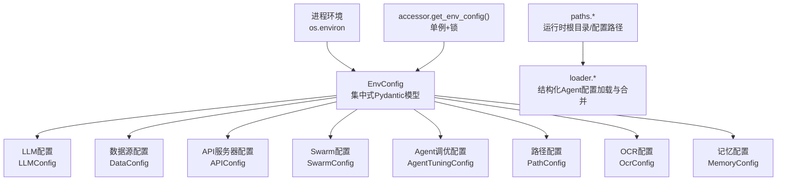
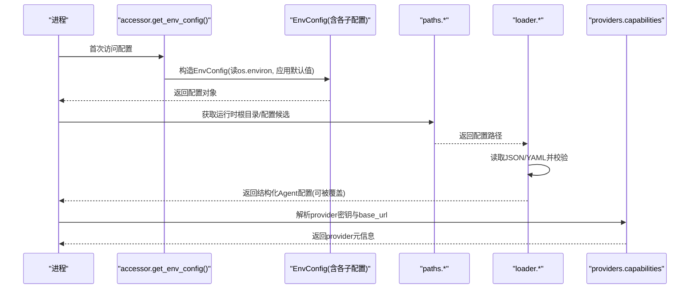
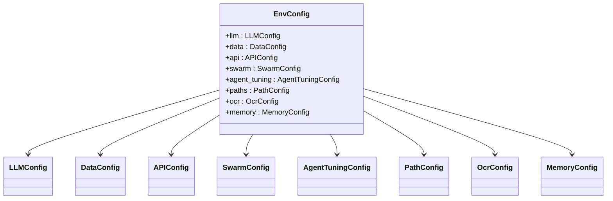

# 环境变量管理

<cite>
**本文引用的文件**
- [agent/src/config/env_schema.py](file://agent/src/config/env_schema.py)
- [agent/src/config/accessor.py](file://agent/src/config/accessor.py)
- [agent/src/config/paths.py](file://agent/src/config/paths.py)
- [agent/src/config/loader.py](file://agent/src/config/loader.py)
- [agent/src/providers/capabilities.py](file://agent/src/providers/capabilities.py)
- [agent/backtest/loaders/base.py](file://agent/backtest/loaders/base.py)
- [agent/src/memory/hierarchy.py](file://agent/src/memory/hierarchy.py)
- [agent/tests/test_ocr_integration.py](file://agent/tests/test_ocr_integration.py)
- [agent/mcp_server.py](file://agent/mcp_server.py)
- [agent/tests/test_mcp_regression.py](file://agent/tests/test_mcp_regression.py)
- [agent/tests/test_tool_registry_security.py](file://agent/tests/test_tool_registry_security.py)
- [README_zh.md](file://README_zh.md)
</cite>

## 更新摘要
**变更内容**
- 新增安全相关环境变量文档：VIBE_TRADING_ENABLE_SHELL_TOOLS 和 VIBE_TRADING_MCP_ALLOWED_HOSTS
- 更新 API 服务器设置章节，详细说明新的安全控制机制
- 增强网络安全配置说明，包括 MCP 传输安全和中继攻击防护
- 补充 shell 工具的安全使用指南和最佳实践

## 目录
1. [简介](#简介)
2. [项目结构](#项目结构)
3. [核心组件](#核心组件)
4. [架构总览](#架构总览)
5. [详细组件分析](#详细组件分析)
6. [依赖关系分析](#依赖关系分析)
7. [性能与可靠性](#性能与可靠性)
8. [故障排查指南](#故障排查指南)
9. [结论](#结论)
10. [附录：变量清单与使用示例](#附录变量清单与使用示例)

## 简介
本文件系统性梳理 Vibe-Trading 的环境变量管理体系，覆盖 LLM 提供商配置、数据源凭据、API 服务器设置、Swarm 执行参数、Agent 调优选项、路径配置、OCR 引擎设置以及记忆系统标志。文档基于代码库中的集中式 Pydantic 配置模型与环境读取逻辑，给出每个变量的作用、默认值、数据类型、验证规则与冲突解决机制，并说明如何与配置文件协同工作以及如何实现动态更新。

**重要安全更新**：最新版本增强了安全控制机制，新增了 shell 工具访问控制和网络传输安全配置，确保在生产环境中部署的安全性。

## 项目结构
Vibe-Trading 将环境变量统一收口到单一 Pydantic 模型中，按功能域划分为多个子配置类，顶层通过 EnvConfig 组合。运行时通过单例访问器提供线程安全的缓存与重置能力；路径模块负责用户根目录与配置文件发现；加载器负责结构化 Agent 配置（JSON/YAML）与运行时覆盖的合并。

图表来源
- [agent/src/config/env_schema.py:1-577](file://agent/src/config/env_schema.py#L1-L577)
- [agent/src/config/accessor.py:52-93](file://agent/src/config/accessor.py#L52-L93)
- [agent/src/config/paths.py:13-87](file://agent/src/config/paths.py#L13-L87)
- [agent/src/config/loader.py:28-151](file://agent/src/config/loader.py#L28-L151)

章节来源
- [agent/src/config/env_schema.py:1-577](file://agent/src/config/env_schema.py#L1-L577)
- [agent/src/config/accessor.py:52-93](file://agent/src/config/accessor.py#L52-L93)
- [agent/src/config/paths.py:13-87](file://agent/src/config/paths.py#L13-L87)
- [agent/src/config/loader.py:28-151](file://agent/src/config/loader.py#L28-L151)

## 核心组件
- 集中式配置模型：所有环境变量通过 Pydantic 字段定义类型、别名、默认值与校验规则，缺失时从 os.environ 读取，非法数值安全回退到默认值。
- 布尔解析：统一的字符串到布尔转换，支持多种真值形式。
- 单例访问器：get_env_config() 提供线程安全的懒加载与缓存；reset_env_config() 支持热更新后重建实例。
- 路径与配置加载：根据 VIBE_TRADING_HOME 或默认 ~/.vibe-trading 定位运行时根目录，并按优先级查找 agent.json/yaml/yml；支持运行时覆盖与安全限制。
- Provider 能力层：按 provider 映射 API Key/Base URL 环境变量，未显式设置 base URL 时回落到 catalog 默认地址。

章节来源
- [agent/src/config/env_schema.py:47-114](file://agent/src/config/env_schema.py#L47-L114)
- [agent/src/config/accessor.py:52-93](file://agent/src/config/accessor.py#L52-L93)
- [agent/src/config/paths.py:13-87](file://agent/src/config/paths.py#L13-L87)
- [agent/src/config/loader.py:28-151](file://agent/src/config/loader.py#L28-L151)
- [agent/src/providers/capabilities.py:121-330](file://agent/src/providers/capabilities.py#L121-L330)

## 架构总览
下图展示环境变量在运行时的装配顺序与关键分支：

图表来源
- [agent/src/config/accessor.py:52-93](file://agent/src/config/accessor.py#L52-L93)
- [agent/src/config/env_schema.py:545-577](file://agent/src/config/env_schema.py#L545-L577)
- [agent/src/config/paths.py:13-87](file://agent/src/config/paths.py#L13-L87)
- [agent/src/config/loader.py:28-151](file://agent/src/config/loader.py#L28-L151)
- [agent/src/providers/capabilities.py:293-330](file://agent/src/providers/capabilities.py#L293-L330)

## 详细组件分析

### LLM 提供商配置（LLMConfig）
- 主要变量与作用
  - LANGCHAIN_PROVIDER / LANGCHAIN_MODEL_NAME / LANGCHAIN_TEMPERATURE：选择 provider、模型与温度。
  - ANTHROPIC_MAX_TOKENS：Anthropic 最大 token 数，需为正整数。
  - TIMEOUT_SECONDS / MAX_RETRIES：请求超时与重试次数。
  - LANGCHAIN_REASONING_EFFORT / VIBE_TRADING_DEEPSEEK_ADAPTER / MOONSHOT_USER_AGENT / OPENAI_CODEX_BASE_URL / OPENAI_MODEL：特定 provider 的行为开关与端点。
  - VIBE_TRADING_DISABLE_HTTP_PROXY：是否禁用 HTTP 代理。
- 默认值与类型
  - 默认 provider 为 openai；timeout_seconds 默认 120；max_retries 默认 2；temperature 默认 0.0；adapter 默认 auto。
- 验证规则
  - 布尔字段通过统一 _parse_env_bool 处理；数值字段若解析失败则静默回退默认值。
- 与 Provider 能力层的关系
  - capabilities.py 将 provider 名映射到 *_API_KEY/*_BASE_URL 环境变量；当未设置 base URL 时回落到 catalog 默认地址。

章节来源
- [agent/src/config/env_schema.py:122-146](file://agent/src/config/env_schema.py#L122-L146)
- [agent/src/providers/capabilities.py:121-330](file://agent/src/providers/capabilities.py#L121-L330)

### 数据源凭据（DataConfig）
- 主要变量与作用
  - TUSHARE_TOKEN、FINNHUB_API_KEY、ALPHAVANTAGE_API_KEY、TIINGO_API_KEY、FMP_API_KEY、FRED_API_KEY：各数据源密钥。
  - CCXT_EXCHANGE / CCXT_TIMEOUT_MS / CCXT_FETCH_BUDGET_S：加密货币交易所、超时与预算。
  - FUTU_HOST / FUTU_PORT：富途本地主机与端口。
  - VIBE_TRADING_IWENCAI_KEY / VIBE_TRADING_SEC_UA / SEC_13F_* / OPENALEX_MAILTO / QVERIS_* / RSSHUB_BASE_URL / DASHSCOPE_API_KEY / LONGBRIDGE_* / ETORO_*：中国搜索、SEC 扫描、QVeris、RSSHub、DashScope、长桥、Etoro 等。
  - VIBE_TW_STOCK_DB：台湾股票数据库路径。
  - VIBE_TRADING_DATA_CACHE / VIBE_TRADING_DATA_CACHE_ROOT：是否启用本地缓存及缓存根目录。
- 默认值与类型
  - 多数密钥为空字符串；CCXT 默认 binance；富途默认 127.0.0.1:11111；SEC 13F 默认 XML 大小与预算；数据缓存默认关闭。
- 验证规则
  - 数值型字段解析失败会回退默认值；非正预算会被警告并回退。
- 使用示例
  - 启用数据缓存：设置 VIBE_TRADING_DATA_CACHE=1，可选指定 VIBE_TRADING_DATA_CACHE_ROOT。
  - 配置 QVeris：设置 QVERIS_API_KEY 与可选 QVERIS_BASE_URL。

章节来源
- [agent/src/config/env_schema.py:153-198](file://agent/src/config/env_schema.py#L153-L198)
- [agent/backtest/loaders/base.py:147-181](file://agent/backtest/loaders/base.py#L147-L181)
- [README_zh.md:152-152](file://README_zh.md#L152-L152)

### OCR 引擎设置（OcrConfig）
- 主要变量与作用
  - VIBE_TRADING_OCR_ENGINE：OCR 引擎选择，默认 auto。
  - VIBE_TRADING_OCR_LLM_MODEL：用于视觉 OCR 的 LLM 模型名称。
- 兼容性与默认值
  - 支持旧别名 VIBE_TRADING_OCR_QWEN_MODEL 到新字段的迁移，并在日志中提示弃用。
- 使用示例
  - 安装 rapidocr_onnxruntime 后，可通过测试套件端到端验证 OCR 流程。

章节来源
- [agent/src/config/env_schema.py:205-237](file://agent/src/config/env_schema.py#L205-L237)
- [agent/tests/test_ocr_integration.py:1-57](file://agent/tests/test_ocr_integration.py#L1-L57)

### API 服务器设置（APIConfig）
- 主要变量与作用
  - API_AUTH_KEY / VIBE_TRADING_API_KEY：认证密钥；后者会自动复制到 api_auth_key 以兼容历史 CLI。
  - CORS_ORIGINS / VIBE_TRADING_EXTRA_CORS_ORIGINS：跨域白名单，后者为追加模式。
  - API_ALLOWED_HOSTS / VIBE_TRADING_MCP_ALLOWED_HOSTS：网络 MCP 传输的主机白名单，空表示仅环回。
  - ENABLE_SESSION_RUNTIME / VIBE_TRADING_TRUST_DOCKER_LOOPBACK / VIBE_TRADING_CSP_REPORT_ONLY / VIBE_TRADING_ENABLE_SHELL_TOOLS：会话运行时开关、Docker 环回信任、CSP 报告模式、Shell 工具暴露。
  - VIBE_TRADING_ALLOWED_FILE_ROOTS / WRITE_ROOTS / RUN_ROOTS：文件读写与运行目录白名单。
  - VIBE_TRADING_API_URL：API 服务地址。
  - FUTU_TRADE_PWD_MD5：富途交易密码 MD5。
- 默认值与类型
  - 默认不开启 shell 工具；CSP 默认强制；API URL 默认 http://127.0.0.1:8000。
- 使用示例
  - 远程访问 Web UI：设置 API_AUTH_KEY 并在 Settings 中填入同一 key；或在 Docker Desktop 宿主网关场景设置 VIBE_TRADING_TRUST_DOCKER_LOOPBACK=1。

**安全增强**：新增的安全控制机制包括：
- **VIBE_TRADING_ENABLE_SHELL_TOOLS**：显式启用 shell 工具（bash、background_run、cancel_background），默认关闭以防止远程攻击
- **VIBE_TRADING_MCP_ALLOWED_HOSTS**：配置 MCP 网络传输的主机白名单，防止 DNS 重绑定攻击

章节来源
- [agent/src/config/env_schema.py:245-295](file://agent/src/config/env_schema.py#L245-L295)
- [agent/mcp_server.py:171-192](file://agent/mcp_server.py#L171-L192)
- [README_zh.md:698-700](file://README_zh.md#L698-L700)

### Swarm 执行参数（SwarmConfig）
- 主要变量与作用
  - SWARM_WORKER_TIMEOUT / SWARM_WORKER_MAX_ITER / SWARM_MAX_WORKERS / SWARM_TIMEOUT：worker 超时、迭代上限、并发 worker 数与整体 swarm 超时。
  - SWARM_HEARTBEAT_INTERVAL_S / SWARM_STREAM_RETRY_DELAY_S：心跳间隔与流式重试延迟。
  - SWARM_GROUNDING_MAX_SYMBOLS：grounding 最多标的数量。
- 默认值与类型
  - 默认 worker 超时 300s，最大迭代 50，并发 4，整体超时 1800s，心跳 3s，重试 1s，最多 8 个标的。
- 使用示例
  - 调整并发与超时：SWARM_MAX_WORKERS=8、SWARM_TIMEOUT=3600。

章节来源
- [agent/src/config/env_schema.py:302-316](file://agent/src/config/env_schema.py#L302-L316)

### Agent 调优选项（AgentTuningConfig）
- 主要变量与作用
  - TOKEN_THRESHOLD / VT_HEARTBEAT_INTERVAL_S / VT_REASONING_DELTA_MIN_INTERVAL_S / VT_STREAM_RETRY_DELAY_S：上下文压缩阈值、心跳与重试间隔。
  - VIBE_TRADING_TOOL_TIMEOUT_SECONDS / VIBE_TRADING_GOAL_MAX_CONTINUATIONS / VIBE_TRADING_SSE_TIMEOUT：工具超时、目标最大续跑次数、SSE 超时。
  - CONTENT_FILTER_WARNING_THRESHOLD：内容过滤告警阈值。
  - VIBE_TRADING_ENABLE_ADVISORY / VIBE_TRADING_ENABLE_SCHEDULER / VIBE_TRADING_CHANNELS_AUTO_START：顾问、定时任务、通道自动启动开关。
  - VIBE_TRADING_SCHEDULER_*：调度器失败次数与重试延迟上下限。
  - VIBE_TRADING_DISABLE_BOTTLENECK / VIBE_TRADING_BENCH_WORKERS / VIBE_TRADING_SEARCH_BACKENDS / VIBE_TRADING_SLASH_ARG_MAX / VIBE_TRADING_SEARCH_BING_FALLBACK：性能与搜索后端开关。
  - VIBE_LIVE_AUTHORIZE_TIMEOUT_SECONDS：券商授权超时。
- 默认值与类型
  - 默认关闭顾问、调度器与通道自动启动；SSE 超时 90s；Bing 回退开启。
- 使用示例
  - 启用定时研究：VIBE_TRADING_ENABLE_SCHEDULER=1；调整搜索后端列表：VIBE_TRADING_SEARCH_BACKENDS="duckduckgo,google,bing"。

章节来源
- [agent/src/config/env_schema.py:323-377](file://agent/src/config/env_schema.py#L323-L377)

### 路径配置（PathConfig）
- 主要变量与作用
  - VIBE_TRADING_HYPOTHESES_PATH / VIBE_TRADING_GOAL_DB_PATH / VIBE_TRADING_PLAYBOOK_DIR / VIBE_TRADING_SWARM_AGENT_CONFIG / VIBE_TRADING_STRATEGY_STORE_DB_PATH：自定义假设、目标数据库、剧本目录、swarm 专用 agent 配置、策略存储数据库路径。
  - ALLOW_SESSION_MCP_SERVERS：是否允许会话级注入 MCP 服务器（高风险）。
  - VIBE_TRADING_THEME / VIBE_GOAL_SESSION_ID：主题与目标会话 ID。
- 默认值与类型
  - 默认均为空；ALLOW_SESSION_MCP_SERVERS 默认关闭。
- 使用示例
  - 指定 swarm 专用配置：VIBE_TRADING_SWARM_AGENT_CONFIG=/path/to/swarm-agent.json。

章节来源
- [agent/src/config/env_schema.py:385-403](file://agent/src/config/env_schema.py#L385-L403)
- [agent/src/config/loader.py:154-229](file://agent/src/config/loader.py#L154-L229)

### 记忆系统标志（MemoryConfig）
- 预设模式 VT_MEMORY
  - off：全部功能关闭。
  - on：Tier 1（质量评分、衰减、GC）开启。
  - full：Tier 1 + Tier 2（层级路由、语义链接、压缩、FTS5 索引）全部开启。
- 独立标志
  - VT_MEMORY_QUALITY / VT_MEMORY_GC / VT_MEMORY_DECAY / VT_MEMORY_HIERARCHY / VT_MEMORY_LINKS / VT_MEMORY_COMPRESSION / VT_MEMORY_FTS_INDEX：逐项覆盖预设基线。
- 行为
  - 若某项标志已在环境变量显式设置，则不覆盖；否则按预设填充。
- 使用示例
  - 快速启用完整记忆：VT_MEMORY=full；或仅启用层级路由：VT_MEMORY_HIERARCHY=1。

章节来源
- [agent/src/config/env_schema.py:411-537](file://agent/src/config/env_schema.py#L411-L537)
- [agent/src/memory/hierarchy.py:1-106](file://agent/src/memory/hierarchy.py#L1-L106)

### 环境变量优先级与冲突解决
- 读取顺序
  - 构造 EnvConfig 时优先使用 Python 参数或字段别名；若未提供，则从 os.environ 读取对应 UPPER_SNAKE_CASE 别名。
  - 数值字段解析失败时静默回退默认值，避免启动崩溃。
- 特殊别名与兼容性
  - VIBE_TRADING_API_KEY 会自动复制到 api_auth_key，保证 CLI 与 API 一致。
  - OcrConfig 支持旧别名 VIBE_TRADING_OCR_QWEN_MODEL 迁移到新字段。
- 安全限制
  - 会话级 MCP 注入键（mcpServers/mcp_servers）默认剥离，除非显式设置 ALLOW_SESSION_MCP_SERVERS=1。
- 动态更新
  - 通过 accessor.reset_env_config() 清空缓存，下次 get_env_config() 重新读取 os.environ，实现热更新。

章节来源
- [agent/src/config/env_schema.py:545-577](file://agent/src/config/env_schema.py#L545-L577)
- [agent/src/config/env_schema.py:214-237](file://agent/src/config/env_schema.py#L214-L237)
- [agent/src/config/loader.py:107-134](file://agent/src/config/loader.py#L107-L134)
- [agent/src/config/accessor.py:52-93](file://agent/src/config/accessor.py#L52-L93)

### 环境变量与配置文件的关系
- 运行时根目录由 VIBE_TRADING_HOME 或默认 ~/.vibe-trading 决定。
- 配置文件优先级：VIBE_TRADING_SWARM_AGENT_CONFIG → <runtime_root>/swarm-agent.json → <runtime_root>/agent.json/yaml/yml。
- 结构化配置（JSON/YAML）与环境变量并存：环境变量控制运行时行为与凭据，配置文件控制更复杂的 agent/MCP 拓扑；两者通过 loader 合并与覆盖。

章节来源
- [agent/src/config/paths.py:13-87](file://agent/src/config/paths.py#L13-L87)
- [agent/src/config/loader.py:154-229](file://agent/src/config/loader.py#L154-L229)

## 依赖关系分析
- EnvConfig 作为根节点聚合各子配置；accessor 提供单例访问；paths 与 loader 负责文件系统层面的配置发现与合并；capabilities 将 provider 名映射到环境变量。
- 数据源与 OCR 依赖外部库（如 rapidocr_onnxruntime），可通过测试套件验证可用性。

图表来源
- [agent/src/config/env_schema.py:545-577](file://agent/src/config/env_schema.py#L545-L577)

章节来源
- [agent/src/config/env_schema.py:545-577](file://agent/src/config/env_schema.py#L545-L577)

## 性能与可靠性
- 数值容错：非法数值直接回退默认值，避免启动阻塞。
- 预算与超时：CCXT/Fred/RSSHub 等预算与超时变量具备安全降级；工具超时与 SSE 超时可调。
- 缓存：可选的数据本地缓存减少网络开销与限流风险。
- 心跳与重试：Swarm 与 Agent 的心跳与重试参数提升稳定性。

章节来源
- [agent/backtest/loaders/base.py:147-181](file://agent/backtest/loaders/base.py#L147-L181)
- [agent/src/config/env_schema.py:302-377](file://agent/src/config/env_schema.py#L302-L377)

## 故障排查指南
- 无法连接 LLM：检查 provider 对应的 *_API_KEY 与 *_BASE_URL；使用 provider doctor 命令查看脱敏快照。
- OCR 不可用：确认已安装 rapidocr_onnxruntime；检查 VIBE_TRADING_OCR_ENGINE 与 VIBE_TRADING_OCR_LLM_MODEL。
- 数据源限流或失败：调整 CCXT_TIMEOUT_MS、CCXT_FETCH_BUDGET_S 等预算；启用 VIBE_TRADING_DATA_CACHE。
- 远程访问被拒：设置 API_AUTH_KEY 或使用 VIBE_TRADING_TRUST_DOCKER_LOOPBACK=1。
- 动态更新生效：修改 .env 后调用 reset_env_config() 再访问 get_env_config()。
- **安全相关问题**：
  - Shell 工具不可用：确认设置了 VIBE_TRADING_ENABLE_SHELL_TOOLS=1
  - MCP 连接被拒绝：检查 VIBE_TRADING_MCP_ALLOWED_HOSTS 配置是否正确

章节来源
- [agent/tests/test_ocr_integration.py:1-57](file://agent/tests/test_ocr_integration.py#L1-L57)
- [agent/src/config/accessor.py:52-93](file://agent/src/config/accessor.py#L52-L93)
- [README_zh.md:698-700](file://README_zh.md#L698-L700)

## 结论
Vibe-Trading 通过集中式 Pydantic 模型统一管理环境变量，提供强类型、可验证、可回退的配置体系。配合路径发现、结构化配置文件与 Provider 能力层，实现了灵活、安全且可动态更新的运行期配置。**最新的安全增强**包括显式的 shell 工具访问控制和网络传输安全配置，确保在生产环境中部署的安全性。推荐在生产环境中显式设置关键凭据与开关，并通过测试与日志验证配置生效。

## 附录：变量清单与使用示例

### LLM 提供商配置
- 变量
  - LANGCHAIN_PROVIDER、LANGCHAIN_MODEL_NAME、LANGCHAIN_TEMPERATURE
  - ANTHROPIC_MAX_TOKENS
  - TIMEOUT_SECONDS、MAX_RETRIES
  - LANGCHAIN_REASONING_EFFORT、VIBE_TRADING_DEEPSEEK_ADAPTER、MOONSHOT_USER_AGENT、OPENAI_CODEX_BASE_URL、OPENAI_MODEL
  - VIBE_TRADING_DISABLE_HTTP_PROXY
- 默认值
  - provider=openai；timeout=120；retries=2；temperature=0.0；adapter=auto
- 使用示例
  - 切换 provider：LANGCHAIN_PROVIDER=openrouter；设置 base URL：OPENROUTER_BASE_URL=https://...

章节来源
- [agent/src/config/env_schema.py:122-146](file://agent/src/config/env_schema.py#L122-L146)
- [agent/src/providers/capabilities.py:121-330](file://agent/src/providers/capabilities.py#L121-L330)

### 数据源凭据
- 变量
  - TUSHARE_TOKEN、FINNHUB_API_KEY、ALPHAVANTAGE_API_KEY、TIINGO_API_KEY、FMP_API_KEY、FRED_API_KEY
  - CCXT_EXCHANGE、CCXT_TIMEOUT_MS、CCXT_FETCH_BUDGET_S
  - FUTU_HOST、FUTU_PORT
  - VIBE_TRADING_IWENCAI_KEY、VIBE_TRADING_SEC_UA、VIBE_TRADING_SEC_13F_MAX_XML_MB、VIBE_TRADING_SEC_13F_BUDGET_S、VIBE_TRADING_SEC_FTD_URL、VIBE_TRADING_SEC_FTD_FILES
  - VIBE_TRADING_OPENALEX_MAILTO、VIBE_TW_STOCK_DB
  - VIBE_TRADING_DATA_CACHE、VIBE_TRADING_DATA_CACHE_ROOT
  - ALIYUN_IQS_API_KEY、QVERIS_API_KEY、QVERIS_BASE_URL、RSSHUB_BASE_URL、DASHSCOPE_API_KEY
  - LONGBRIDGE_APP_KEY、LONGBRIDGE_APP_SECRET、LONGBRIDGE_ACCESS_TOKEN
  - ETORO_API_KEY、ETORO_USER_KEY
- 默认值
  - 密钥多为空；CCXT 默认 binance；富途默认 127.0.0.1:11111；SEC 13F 默认 25MB/120s；数据缓存默认关闭
- 使用示例
  - 启用缓存：VIBE_TRADING_DATA_CACHE=1；配置 QVeris：QVERIS_API_KEY=...

章节来源
- [agent/src/config/env_schema.py:153-198](file://agent/src/config/env_schema.py#L153-L198)
- [agent/backtest/loaders/base.py:147-181](file://agent/backtest/loaders/base.py#L147-L181)

### API 服务器设置
- 变量
  - API_AUTH_KEY、VIBE_TRADING_API_KEY
  - CORS_ORIGINS、VIBE_TRADING_EXTRA_CORS_ORIGINS
  - API_ALLOWED_HOSTS、VIBE_TRADING_MCP_ALLOWED_HOSTS
  - ENABLE_SESSION_RUNTIME、VIBE_TRADING_TRUST_DOCKER_LOOPBACK、VIBE_TRADING_CSP_REPORT_ONLY、VIBE_TRADING_ENABLE_SHELL_TOOLS
  - VIBE_TRADING_ALLOWED_FILE_ROOTS、VIBE_TRADING_ALLOWED_WRITE_ROOTS、VIBE_TRADING_ALLOWED_RUN_ROOTS
  - VIBE_TRADING_API_URL、FUTU_TRADE_PWD_MD5
- 默认值
  - 默认不开启 shell 工具；CSP 强制；API URL 默认 http://127.0.0.1:8000
- 使用示例
  - 远程访问：设置 API_AUTH_KEY；Docker 宿主网关：VIBE_TRADING_TRUST_DOCKER_LOOPBACK=1

**安全配置示例**：
- 启用 shell 工具（谨慎使用）：`VIBE_TRADING_ENABLE_SHELL_TOOLS=1`
- 配置 MCP 主机白名单：`VIBE_TRADING_MCP_ALLOWED_HOSTS=127.0.0.1,localhost,mcp.internal.example.com`

章节来源
- [agent/src/config/env_schema.py:245-295](file://agent/src/config/env_schema.py#L245-L295)
- [agent/mcp_server.py:171-192](file://agent/mcp_server.py#L171-L192)
- [README_zh.md:698-700](file://README_zh.md#L698-L700)

### Swarm 执行参数
- 变量
  - SWARM_WORKER_TIMEOUT、SWARM_WORKER_MAX_ITER、SWARM_MAX_WORKERS、SWARM_TIMEOUT
  - SWARM_HEARTBEAT_INTERVAL_S、SWARM_STREAM_RETRY_DELAY_S、SWARM_GROUNDING_MAX_SYMBOLS
- 默认值
  - 300s/50/4/1800s/3.0s/1.0s/8
- 使用示例
  - 提高并发：SWARM_MAX_WORKERS=8；延长整体超时：SWARM_TIMEOUT=3600

章节来源
- [agent/src/config/env_schema.py:302-316](file://agent/src/config/env_schema.py#L302-L316)

### Agent 调优选项
- 变量
  - TOKEN_THRESHOLD、VT_HEARTBEAT_INTERVAL_S、VT_REASONING_DELTA_MIN_INTERVAL_S、VT_STREAM_RETRY_DELAY_S
  - VIBE_TRADING_TOOL_TIMEOUT_SECONDS、VIBE_TRADING_GOAL_MAX_CONTINUATIONS、VIBE_TRADING_SSE_TIMEOUT
  - CONTENT_FILTER_WARNING_THRESHOLD
  - VIBE_TRADING_ENABLE_ADVISORY、VIBE_TRADING_ENABLE_SCHEDULER、VIBE_TRADING_CHANNELS_AUTO_START
  - VIBE_TRADING_SCHEDULER_MAX_CONSECUTIVE_FAILURES、VIBE_TRADING_SCHEDULER_RETRY_BASE_DELAY_MS、VIBE_TRADING_SCHEDULER_RETRY_MAX_DELAY_MS
  - VIBE_TRADING_DISABLE_BOTTLENECK、VIBE_TRADING_BENCH_WORKERS、VIBE_TRADING_SEARCH_BACKENDS、VIBE_TRADING_SLASH_ARG_MAX、VIBE_TRADING_SEARCH_BING_FALLBACK
  - VIBE_LIVE_AUTHORIZE_TIMEOUT_SECONDS
- 默认值
  - 默认关闭顾问、调度器与通道自动启动；SSE 超时 90s；Bing 回退开启
- 使用示例
  - 启用调度器：VIBE_TRADING_ENABLE_SCHEDULER=1；覆盖搜索后端：VIBE_TRADING_SEARCH_BACKENDS="duckduckgo,google,bing"

章节来源
- [agent/src/config/env_schema.py:323-377](file://agent/src/config/env_schema.py#L323-L377)

### 路径配置
- 变量
  - VIBE_TRADING_HYPOTHESES_PATH、VIBE_TRADING_GOAL_DB_PATH、VIBE_TRADING_PLAYBOOK_DIR、VIBE_TRADING_SWARM_AGENT_CONFIG、VIBE_TRADING_STRATEGY_STORE_DB_PATH
  - ALLOW_SESSION_MCP_SERVERS、VIBE_TRADING_THEME、VIBE_GOAL_SESSION_ID
- 默认值
  - 默认均为空；ALLOW_SESSION_MCP_SERVERS 默认关闭
- 使用示例
  - 指定 swarm 配置：VIBE_TRADING_SWARM_AGENT_CONFIG=/path/to/swarm-agent.json

章节来源
- [agent/src/config/env_schema.py:385-403](file://agent/src/config/env_schema.py#L385-L403)
- [agent/src/config/loader.py:154-229](file://agent/src/config/loader.py#L154-L229)

### OCR 引擎设置
- 变量
  - VIBE_TRADING_OCR_ENGINE、VIBE_TRADING_OCR_LLM_MODEL
- 默认值
  - engine 默认 auto；模型为空
- 使用示例
  - 安装 rapidocr_onnxruntime 后端到端验证 OCR；迁移旧别名 VIBE_TRADING_OCR_QWEN_MODEL 到新字段

章节来源
- [agent/src/config/env_schema.py:205-237](file://agent/src/config/env_schema.py#L205-L237)
- [agent/tests/test_ocr_integration.py:1-57](file://agent/tests/test_ocr_integration.py#L1-L57)

### 记忆系统标志
- 预设
  - VT_MEMORY=off|on|full
- 独立标志
  - VT_MEMORY_QUALITY、VT_MEMORY_GC、VT_MEMORY_DECAY、VT_MEMORY_HIERARCHY、VT_MEMORY_LINKS、VT_MEMORY_COMPRESSION、VT_MEMORY_FTS_INDEX
- 默认值
  - 默认 off；各项标志默认关闭
- 使用示例
  - 启用完整记忆：VT_MEMORY=full；仅启用层级：VT_MEMORY_HIERARCHY=1

章节来源
- [agent/src/config/env_schema.py:411-537](file://agent/src/config/env_schema.py#L411-L537)
- [agent/src/memory/hierarchy.py:1-106](file://agent/src/memory/hierarchy.py#L1-L106)

### 安全相关环境变量

#### Shell 工具控制（VIBE_TRADING_ENABLE_SHELL_TOOLS）
- **作用**：控制 shell 工具的访问权限，包括 bash、background_run、cancel_background 等进程控制工具
- **默认值**：False（默认关闭）
- **安全考虑**：这些工具可以执行任意系统命令，仅在可信环境中启用
- **使用场景**：
  - 本地开发环境：`VIBE_TRADING_ENABLE_SHELL_TOOLS=1`
  - 生产环境：保持默认关闭，或通过命令行参数 `--enable-shell-tools` 临时启用
- **影响范围**：HTTP/SSE API、MCP server（所有传输方式）、CLI 交互模式

章节来源
- [agent/src/config/env_schema.py:279-281](file://agent/src/config/env_schema.py#L279-L281)
- [agent/mcp_server.py:93-107](file://agent/mcp_server.py#L93-L107)
- [agent/tests/test_tool_registry_security.py:10-27](file://agent/tests/test_tool_registry_security.py#L10-L27)

#### MCP 网络传输安全（VIBE_TRADING_MCP_ALLOWED_HOSTS）
- **作用**：配置 MCP 网络传输（SSE/HTTP）的主机白名单，防止 DNS 重绑定攻击
- **格式**：逗号分隔的主机列表，支持通配符（*、*.domain）
- **默认值**：空字符串（仅允许环回地址：127.0.0.1、::1、localhost）
- **安全特性**：
  - 阻止 DNS 重绑定攻击
  - 支持 IPv6 地址和括号格式
  - 大小写不敏感匹配
  - Origin 头验证
- **使用示例**：
  - 允许内部域名：`VIBE_TRADING_MCP_ALLOWED_HOSTS=mcp.internal.example.com`
  - 允许子域名：`VIBE_TRADING_MCP_ALLOWED_HOSTS=*.example.com`
  - 允许所有（谨慎使用）：`VIBE_TRADING_MCP_ALLOWED_HOSTS=*`

章节来源
- [agent/src/config/env_schema.py:262-267](file://agent/src/config/env_schema.py#L262-L267)
- [agent/mcp_server.py:171-192](file://agent/mcp_server.py#L171-L192)
- [agent/tests/test_mcp_host_origin_guard.py:160-171](file://agent/tests/test_mcp_host_origin_guard.py#L160-L171)