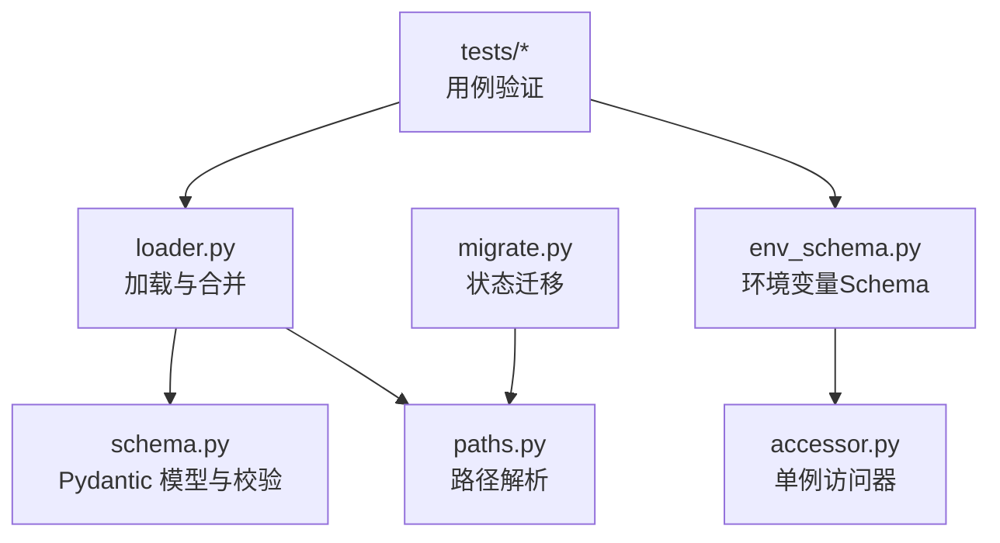
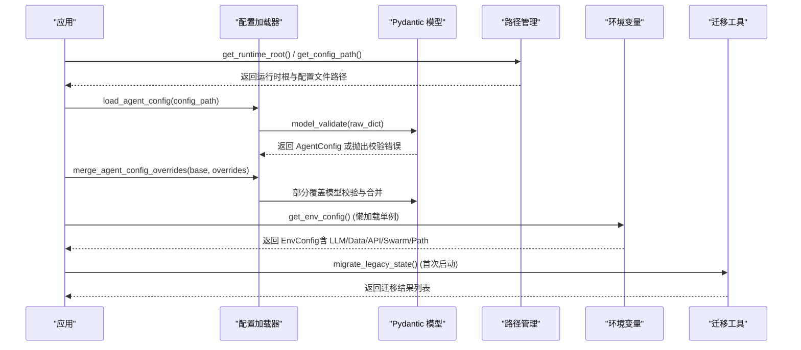
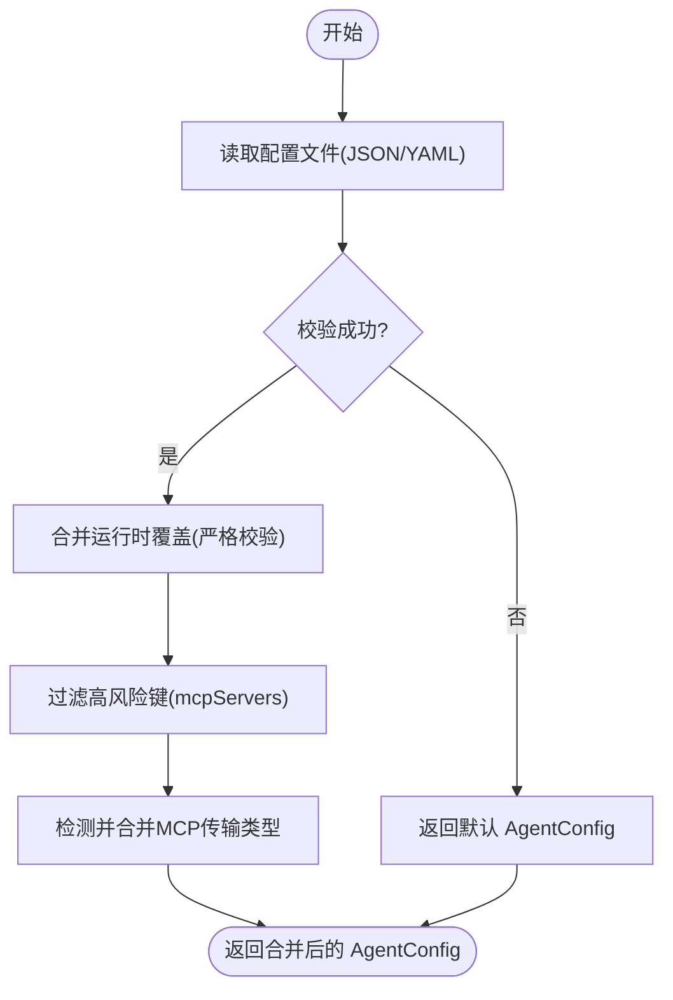
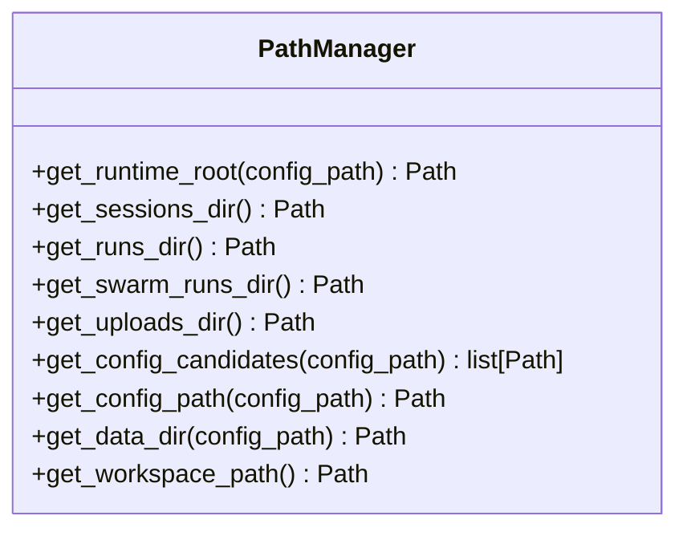
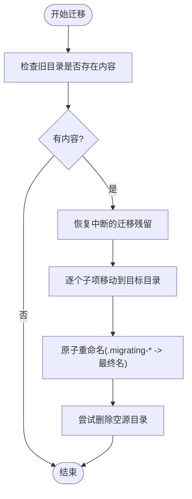
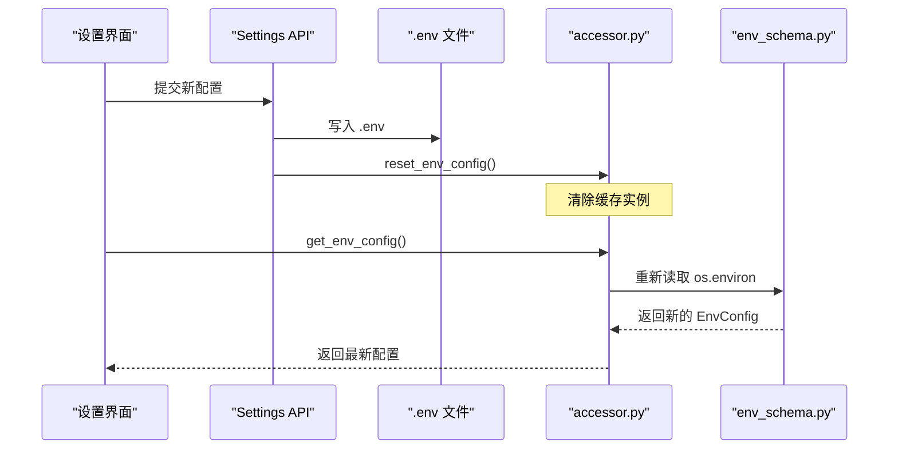
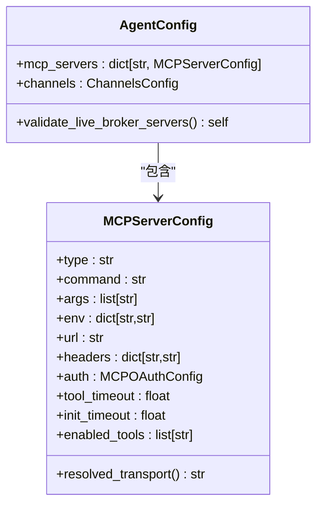
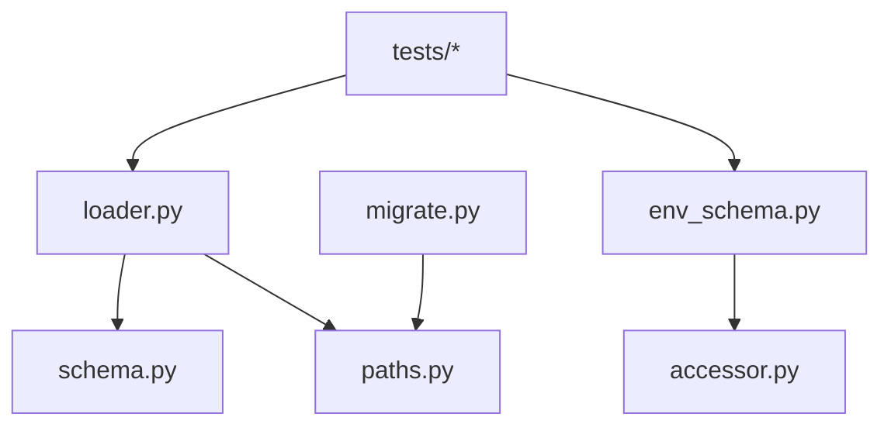

# 运行时配置管理

<cite>
**本文引用的文件**
- [agent/src/config/__init__.py](file://agent/src/config/__init__.py)
- [agent/src/config/loader.py](file://agent/src/config/loader.py)
- [agent/src/config/migrate.py](file://agent/src/config/migrate.py)
- [agent/src/config/paths.py](file://agent/src/config/paths.py)
- [agent/src/config/schema.py](file://agent/src/config/schema.py)
- [agent/src/config/env_schema.py](file://agent/src/config/env_schema.py)
- [agent/src/config/accessor.py](file://agent/src/config/accessor.py)
- [agent/tests/test_agent_config.py](file://agent/tests/test_agent_config.py)
- [agent/tests/test_env_schema.py](file://agent/tests/test_env_schema.py)
</cite>

## 目录
1. [简介](#简介)
2. [项目结构](#项目结构)
3. [核心组件](#核心组件)
4. [架构总览](#架构总览)
5. [详细组件分析](#详细组件分析)
6. [依赖关系分析](#依赖关系分析)
7. [性能考虑](#性能考虑)
8. [故障排查指南](#故障排查指南)
9. [结论](#结论)
10. [附录](#附录)

## 简介
本文件系统性说明 Vibe-Trading 的运行时配置管理，覆盖以下主题：
- 配置加载器：配置文件读取、环境变量合并、运行时覆盖与校验
- 路径配置管理：运行时根目录、会话/运行产物/上传等路径解析与安全校验
- 配置迁移机制：版本升级时的旧数据迁移与原子化恢复
- 动态更新与生命周期：初始化、更新通知、失效处理与性能优化
- 多环境配置：开发/测试/生产的隔离与切换策略

该实现以 Pydantic 模型为核心，结合文件系统、环境变量与运行时覆盖层，提供强类型、可验证、可扩展的配置体系。

## 项目结构
配置子系统位于 agent/src/config，主要模块职责如下：
- loader.py：结构化 AgentConfig 的磁盘加载、合并、MCP 服务器覆盖与沙箱安全过滤
- schema.py：AgentConfig、MCPServerConfig、ChannelsConfig 等 Pydantic 模型与校验规则
- paths.py：运行时根目录、会话/运行/上传/工作区等路径解析与创建
- env_schema.py：集中化的环境变量 Schema（LLM、数据源、API、Swarm、路径等）
- accessor.py：EnvConfig 的单例访问器，支持线程安全的懒加载与重置
- migrate.py：将历史代码相对状态迁移到用户级运行时根目录，保证升级不丢数据

图表来源
- [agent/src/config/loader.py:28-151](file://agent/src/config/loader.py#L28-L151)
- [agent/src/config/schema.py:301-513](file://agent/src/config/schema.py#L301-L513)
- [agent/src/config/paths.py:13-113](file://agent/src/config/paths.py#L13-L113)
- [agent/src/config/env_schema.py:1-200](file://agent/src/config/env_schema.py#L1-L200)
- [agent/src/config/accessor.py:1-149](file://agent/src/config/accessor.py#L1-L149)
- [agent/src/config/migrate.py:1-153](file://agent/src/config/migrate.py#L1-L153)

章节来源
- [agent/src/config/__init__.py:1-25](file://agent/src/config/__init__.py#L1-L25)

## 核心组件
- 配置加载器（loader）：从磁盘读取 JSON/YAML，构建并校验 AgentConfig；支持运行时覆盖与 MCP 服务器字段的安全合并
- 配置模型（schema）：定义 AgentConfig、MCPServerConfig、ChannelsConfig 等，内置传输类型校验、OAuth 约束、实时券商白名单限制
- 路径管理（paths）：统一解析运行时根目录、会话/运行/上传/工作区路径，支持 VIBE_TRADING_HOME 覆盖与 UNC 路径拒绝
- 环境变量（env_schema + accessor）：集中式 EnvConfig 模型，按字段别名从 os.environ 读取，支持布尔/数值类型转换与默认值回退；通过单例缓存与重置实现热更新
- 迁移工具（migrate）：首次启动时将旧位置（如 sessions/runs/uploads/.swarm/runs）迁移至运行时根目录，使用隐藏前缀原子重命名，确保中断恢复

章节来源
- [agent/src/config/loader.py:28-151](file://agent/src/config/loader.py#L28-L151)
- [agent/src/config/schema.py:301-513](file://agent/src/config/schema.py#L301-L513)
- [agent/src/config/paths.py:13-113](file://agent/src/config/paths.py#L13-L113)
- [agent/src/config/env_schema.py:1-200](file://agent/src/config/env_schema.py#L1-L200)
- [agent/src/config/accessor.py:1-149](file://agent/src/config/accessor.py#L1-L149)
- [agent/src/config/migrate.py:1-153](file://agent/src/config/migrate.py#L1-L153)

## 架构总览
配置系统由“文件配置 + 环境变量 + 运行时覆盖”三层组成，最终汇聚为强类型的 AgentConfig/EnvConfig。

图表来源
- [agent/src/config/loader.py:28-151](file://agent/src/config/loader.py#L28-L151)
- [agent/src/config/schema.py:301-513](file://agent/src/config/schema.py#L301-L513)
- [agent/src/config/paths.py:13-113](file://agent/src/config/paths.py#L13-L113)
- [agent/src/config/env_schema.py:1-200](file://agent/src/config/env_schema.py#L1-L200)
- [agent/src/config/accessor.py:1-149](file://agent/src/config/accessor.py#L1-L149)
- [agent/src/config/migrate.py:1-153](file://agent/src/config/migrate.py#L1-L153)

## 详细组件分析

### 配置加载器与合并机制
- 文件读取：支持 .json 与 .yaml/.yml，缺失时返回默认 AgentConfig；YAML 缺失依赖时抛出明确错误
- 运行时覆盖：merge_agent_config_overrides 对部分覆盖进行严格校验，仅覆盖显式提供的字段；MCP 服务器字段采用特殊合并逻辑，避免传输类型冲突
- 安全过滤：sanitize_session_overrides 移除 mcpServers/mcp_servers 等高风险键，除非设置 ALLOW_SESSION_MCP_SERVERS=1
- Swarm 配置解析：优先使用环境变量指定路径，其次查找 swarm-agent.json，最后回退到主 agent 配置文件

图表来源
- [agent/src/config/loader.py:28-151](file://agent/src/config/loader.py#L28-L151)
- [agent/src/config/loader.py:232-346](file://agent/src/config/loader.py#L232-L346)

章节来源
- [agent/src/config/loader.py:28-151](file://agent/src/config/loader.py#L28-L151)
- [agent/src/config/loader.py:232-346](file://agent/src/config/loader.py#L232-L346)
- [agent/tests/test_agent_config.py:63-200](file://agent/tests/test_agent_config.py#L63-L200)

### 路径配置管理系统
- 运行时根目录：get_runtime_root 支持显式 config_path 推导、VIBE_TRADING_HOME 覆盖、默认 ~/.vibe-trading；拒绝 UNC 路径
- 子目录解析：sessions、runs、swarm/runs、uploads、workspace 均基于运行时根目录派生，自动创建父目录
- 配置文件候选：get_config_candidates 按优先级返回 agent.json、agent.yaml、agent.yml；get_config_path 选择首个存在的文件或推荐默认路径
- 数据目录：get_data_dir 返回并创建配置文件所在目录

图表来源
- [agent/src/config/paths.py:13-113](file://agent/src/config/paths.py#L13-L113)

章节来源
- [agent/src/config/paths.py:13-113](file://agent/src/config/paths.py#L13-L113)

### 配置迁移机制
- 目标：将旧位置（sessions、runs、.swarm/runs、uploads）迁移到运行时根目录，避免升级后丢失历史数据
- 原子化：使用 .migrating-{pid}-{name} 临时名，成功后重命名为最终名称；中断后可恢复
- 幂等：已存在目标跳过迁移；Python 包目录（含 __init__.py）被识别为非 Vibe-Trading 状态而跳过
- 清理：迁移完成后尝试删除空源目录；若失败则保留以便下次重试

图表来源
- [agent/src/config/migrate.py:44-153](file://agent/src/config/migrate.py#L44-L153)

章节来源
- [agent/src/config/migrate.py:1-153](file://agent/src/config/migrate.py#L1-L153)

### 环境变量与动态更新
- 集中式 Schema：env_schema.py 定义所有环境变量字段，支持类型转换、默认值、别名
- 单例访问器：accessor.py 提供 get_env_config 懒加载单例，reset_env_config 支持运行时重置
- 动态更新流程：Settings API 写入 .env 后，调用 reset_env_config 使下一次 get_env_config 读取新值
- 布尔解析：统一 _parse_bool 处理多种真值字符串

图表来源
- [agent/src/config/env_schema.py:1-200](file://agent/src/config/env_schema.py#L1-L200)
- [agent/src/config/accessor.py:1-149](file://agent/src/config/accessor.py#L1-L149)

章节来源
- [agent/src/config/env_schema.py:1-200](file://agent/src/config/env_schema.py#L1-L200)
- [agent/src/config/accessor.py:1-149](file://agent/src/config/accessor.py#L1-L149)
- [agent/tests/test_env_schema.py:1-200](file://agent/tests/test_env_schema.py#L1-L200)

### 配置模型与安全校验
- MCPServerConfig：强制传输类型（stdio/sse/streamableHttp），HTTP 必须显式 type，禁止 stdio 使用 url/headers/auth
- OAuth 约束：HTTPS 必需，禁止与静态 headers 混用
- 实时券商限制：robinhood/ibkr 等禁止 wildcard enabled_tools=["*"]，除非满足只读探测条件
- ChannelsConfig：全局 operators 白名单、发送进度/重试/超时等通道行为

图表来源
- [agent/src/config/schema.py:301-513](file://agent/src/config/schema.py#L301-L513)

章节来源
- [agent/src/config/schema.py:301-513](file://agent/src/config/schema.py#L301-L513)
- [agent/tests/test_agent_config.py:63-200](file://agent/tests/test_agent_config.py#L63-L200)

## 依赖关系分析
- loader.py 依赖 schema.py（模型）、paths.py（路径）
- env_schema.py 与 accessor.py 构成环境变量配置层，独立于文件配置
- migrate.py 依赖 paths.py 获取运行时根目录
- 测试文件覆盖加载、合并、路径、环境变量等关键路径

图表来源
- [agent/src/config/loader.py:1-30](file://agent/src/config/loader.py#L1-L30)
- [agent/src/config/env_schema.py:1-200](file://agent/src/config/env_schema.py#L1-L200)
- [agent/src/config/accessor.py:1-149](file://agent/src/config/accessor.py#L1-L149)
- [agent/src/config/migrate.py:1-153](file://agent/src/config/migrate.py#L1-L153)

章节来源
- [agent/src/config/loader.py:1-30](file://agent/src/config/loader.py#L1-L30)
- [agent/src/config/env_schema.py:1-200](file://agent/src/config/env_schema.py#L1-L200)
- [agent/src/config/accessor.py:1-149](file://agent/src/config/accessor.py#L1-L149)
- [agent/src/config/migrate.py:1-153](file://agent/src/config/migrate.py#L1-L153)

## 性能考虑
- 懒加载：EnvConfig 单例在首次访问时创建，避免启动开销
- 缓存：get_env_config 缓存实例，减少重复解析
- 增量合并：merge_agent_config_overrides 仅覆盖显式字段，避免全量重建
- 文件 I/O：配置文件读取仅在必要时进行，缺失时快速返回默认值
- 迁移优化：原子重命名与中断恢复避免长时间锁定

## 故障排查指南
- 配置文件格式错误：loader.py 捕获 ValueError/ValidationError，记录警告并回退默认配置
- YAML 依赖缺失：明确提示缺少 PyYAML
- 路径非法：get_runtime_root 拒绝 UNC 路径，抛出 ValueError
- 环境变量类型错误：env_schema.py 静默回退到默认值，避免启动失败
- 迁移失败：migrate.py 记录警告并继续其他目录迁移，保留未移动数据供下次重试

章节来源
- [agent/src/config/loader.py:44-54](file://agent/src/config/loader.py#L44-L54)
- [agent/src/config/loader.py:245-259](file://agent/src/config/loader.py#L245-L259)
- [agent/src/config/paths.py:25-34](file://agent/src/config/paths.py#L25-L34)
- [agent/src/config/env_schema.py:81-114](file://agent/src/config/env_schema.py#L81-L114)
- [agent/src/config/migrate.py:77-102](file://agent/src/config/migrate.py#L77-L102)

## 结论
Vibe-Trading 的运行时配置管理通过强类型模型、分层合并、路径安全校验、原子化迁移与环境变量集中化，实现了高内聚、低耦合、可维护的配置体系。其设计兼顾了安全性（实时券商限制、高风险键过滤）、可靠性（中断恢复、默认回退）与扩展性（运行时覆盖、环境变量集中）。

## 附录
- 多环境配置建议：
  - 开发：使用本地 agent.json + 开发环境变量（如调试开关）
  - 测试：CI 中通过环境变量覆盖关键路径与超时
  - 生产：使用受保护的 agent.json + 严格的环境变量管理，启用安全选项（如 ALLOW_SESSION_MCP_SERVERS=0）
- 最佳实践：
  - 始终使用 Pydantic 模型进行配置校验
  - 通过环境变量注入敏感信息，避免硬编码
  - 使用迁移工具确保升级平滑
  - 定期备份 ~/.vibe-trading 目录