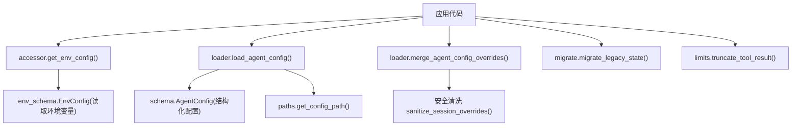
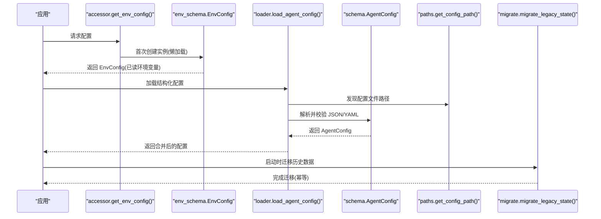
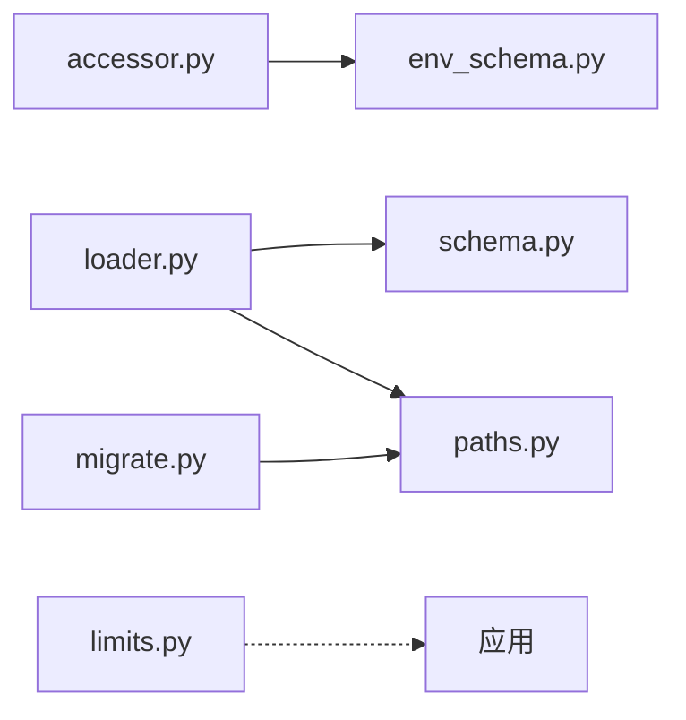

# 配置架构设计

<cite>
**本文引用的文件**
- [env_schema.py](file://agent/src/config/env_schema.py)
- [schema.py](file://agent/src/config/schema.py)
- [loader.py](file://agent/src/config/loader.py)
- [accessor.py](file://agent/src/config/accessor.py)
- [paths.py](file://agent/src/config/paths.py)
- [migrate.py](file://agent/src/config/migrate.py)
- [limits.py](file://agent/src/config/limits.py)
- [test_env_schema.py](file://agent/tests/test_env_schema.py)
</cite>

## 目录
1. [简介](#简介)
2. [项目结构](#项目结构)
3. [核心组件](#核心组件)
4. [架构总览](#架构总览)
5. [详细组件分析](#详细组件分析)
6. [依赖关系分析](#依赖关系分析)
7. [性能与可扩展性](#性能与可扩展性)
8. [故障排查指南](#故障排查指南)
9. [结论](#结论)
10. [附录：扩展新配置项示例](#附录：扩展新配置项示例)

## 简介
本文件系统性阐述 Vibe-Trading 的配置架构，围绕基于 Pydantic 的环境变量驱动模型展开。重点包括：
- _EnvBase 基类的设计模式与环境变量自动加载机制
- EnvBool 布尔解析器、数值类型安全转换与默认值处理
- EnvConfig 根配置类的组合模式与各子配置职责划分（LLMConfig、DataConfig、APIConfig、SwarmConfig、AgentTuningConfig、PathConfig、OcrConfig、MemoryConfig）
- 配置项别名映射、向后兼容与迁移策略
- 配置验证流程、错误处理策略与热重载支持
- 环境隔离与运行时路径管理

该架构将原本分散的 os.getenv 调用集中为单一可信源，提供强类型、可验证、可维护的配置体系。

## 项目结构
配置子系统位于 agent/src/config，主要模块职责如下：
- env_schema.py：定义所有环境变量对应的 Pydantic 模型与默认值、别名、校验规则
- schema.py：结构化 Agent 配置（如 MCP 服务器、通道等），含安全校验与种子配置
- loader.py：从磁盘加载 JSON/YAML 配置文件，合并运行时覆盖，并实现安全清洗
- accessor.py：EnvConfig 的单例访问器，提供线程安全的懒加载与热重载能力
- paths.py：运行时根目录、配置文件发现与数据目录工具函数
- migrate.py：历史状态迁移，确保升级后数据不丢失
- limits.py：统一的工具结果长度限制与截断提示

图表来源
- [accessor.py:52-76](file://agent/src/config/accessor.py#L52-L76)
- [env_schema.py:545-577](file://agent/src/config/env_schema.py#L545-L577)
- [loader.py:28-54](file://agent/src/config/loader.py#L28-L54)
- [schema.py:452-492](file://agent/src/config/schema.py#L452-L492)
- [paths.py:13-34](file://agent/src/config/paths.py#L13-L34)
- [migrate.py:114-152](file://agent/src/config/migrate.py#L114-L152)
- [limits.py:22-49](file://agent/src/config/limits.py#L22-L49)

章节来源
- [env_schema.py:1-577](file://agent/src/config/env_schema.py#L1-L577)
- [schema.py:1-513](file://agent/src/config/schema.py#L1-L513)
- [loader.py:1-346](file://agent/src/config/loader.py#L1-L346)
- [accessor.py:1-149](file://agent/src/config/accessor.py#L1-L149)
- [paths.py:1-113](file://agent/src/config/paths.py#L1-L113)
- [migrate.py:1-153](file://agent/src/config/migrate.py#L1-L153)
- [limits.py:1-49](file://agent/src/config/limits.py#L1-L49)

## 核心组件
- _EnvBase：所有环境变量模型的基类，负责从环境变量按字段别名填充缺失值，并对数值进行安全转换，失败时回退到默认值
- EnvBool：基于 BeforeValidator 的布尔解析器，接受多种字符串真值/假值形式
- EnvConfig：根配置类，组合 LLM/Data/API/Swarm/AgentTuning/Path/Ocr/Memory 等子配置
- 各子配置类：按领域拆分职责，例如 LLMConfig 管理大模型参数，DataConfig 管理数据源凭据，APIConfig 管理 API 安全开关等
- MemoryConfig：通过预设 VT_MEMORY=off|on|full 批量启用记忆功能，同时允许逐位覆盖
- 结构化配置：schema.py 中的 AgentConfig、MCPServerConfig 等用于 JSON/YAML 配置文件的强类型校验与安全约束
- 加载器：loader.py 提供从磁盘加载、合并覆盖、安全清洗的能力
- 单例访问器：accessor.py 提供线程安全的懒加载与热重载

章节来源
- [env_schema.py:47-115](file://agent/src/config/env_schema.py#L47-L115)
- [env_schema.py:122-563](file://agent/src/config/env_schema.py#L122-L563)
- [schema.py:301-492](file://agent/src/config/schema.py#L301-L492)
- [loader.py:28-151](file://agent/src/config/loader.py#L28-L151)
- [accessor.py:52-93](file://agent/src/config/accessor.py#L52-L93)

## 架构总览
下图展示配置加载与使用的主流程：应用通过 accessor 获取缓存的 EnvConfig；EnvConfig 在构造时读取环境变量并按字段别名填充；结构化配置由 loader 从磁盘加载并通过 schema 校验；运行时覆盖通过 merge 与 sanitize 保证安全；路径与迁移由 paths 与 migrate 提供支持。

图表来源
- [accessor.py:52-76](file://agent/src/config/accessor.py#L52-L76)
- [env_schema.py:545-577](file://agent/src/config/env_schema.py#L545-L577)
- [loader.py:28-54](file://agent/src/config/loader.py#L28-L54)
- [paths.py:57-87](file://agent/src/config/paths.py#L57-L87)
- [schema.py:452-492](file://agent/src/config/schema.py#L452-L492)
- [migrate.py:114-152](file://agent/src/config/migrate.py#L114-L152)

## 详细组件分析

### _EnvBase 基类与环境变量自动加载
- 设计要点
  - 使用 ConfigDict(populate_by_name=True, extra="ignore") 允许通过 Python 名或别名赋值，忽略未知字段
  - model_validator(mode="before") 在字段赋值前从 os.environ 读取缺失值
  - 对 int/float 类型进行安全转换：若环境变量无法解析则跳过，交由 Pydantic 使用默认值
  - 避免在无效环境变量上抛出 ValidationError，提升鲁棒性

- 关键行为
  - 字段优先顺序：显式构造参数 > 环境变量 > 默认值
  - 仅当字段未提供且存在 UPPER_SNAKE_CASE 别名时才尝试从环境变量填充
  - 数值转换失败即静默回退，便于部署中临时设置不影响启动

章节来源
- [env_schema.py:71-115](file://agent/src/config/env_schema.py#L71-L115)

### EnvBool 布尔解析器
- 接受字符串形式的真值/假值：true/yes/on/1 为真；false/no/off/0/空串为假
- 非字符串值直接交给 Pydantic 内置转换，保持灵活性
- 统一了配置层布尔语义，避免各处重复实现

章节来源
- [env_schema.py:47-64](file://agent/src/config/env_schema.py#L47-L64)
- [test_env_schema.py:415-443](file://agent/tests/test_env_schema.py#L415-L443)

### EnvConfig 根配置与子配置职责
- 组合模式
  - EnvConfig 聚合 llm/data/api/swarm/agent_tuning/paths/ocr/memory 等子配置
  - 每个子配置独立维护一组环境变量与默认值，职责清晰

- 子配置职责概览
  - LLMConfig：大模型提供商、超时、重试、代理开关等
  - DataConfig：市场数据源凭据与调优（Tushare、CCXT、Futu、Finnhub、AlphaVantage、Tiingo、FMP、Fred、OpenAlex、Qveris、Rsshub、Dashscope、Longbridge、Etoro 等）
  - APIConfig：API 鉴权、CORS、主机白名单、Shell 工具开关、文件/运行根白名单、Docker 环回信任、CSP 报告模式等
  - SwarmConfig：多智能体工作区超时、迭代上限、心跳间隔、流重试延迟、 grounding 符号上限
  - AgentTuningConfig：令牌阈值、心跳/重试间隔、内容过滤阈值、调度器开关与重试策略、搜索后端、SSE 超时、授权超时等
  - PathConfig：假设/目标数据库/剧本目录、会话级 MCP 信任、主题、策略存储路径
  - OcrConfig：OCR 引擎与模型选择，含旧别名迁移
  - MemoryConfig：记忆系统预设与逐位开关

- 特殊逻辑
  - OcrConfig 的 _alias_legacy_env_vars：将旧环境变量 VIBE_TRADING_OCR_QWEN_MODEL 迁移到新字段，并发出弃用警告
  - MemoryConfig 的 _apply_preset：VT_MEMORY 预设作为基线，逐位环境变量可覆盖
  - EnvConfig._resolve_api_key_alias：当仅设置 VIBE_TRADING_API_KEY 时，复制到 api_auth_key，弥合 CLI 与服务端差异

章节来源
- [env_schema.py:122-563](file://agent/src/config/env_schema.py#L122-L563)
- [test_env_schema.py:72-157](file://agent/tests/test_env_schema.py#L72-L157)

### 结构化配置与安全校验（schema.py）
- 支持 snake_case 与 camelCase 键，便于外部配置兼容
- MCPOAuthConfig：OAuth 认证参数，要求 HTTPS，禁止与静态 headers 混用
- MCPServerConfig：传输类型推断与校验（stdio/sse/streamableHttp），强制命令/URL 互斥
- AgentConfig：对“在线券商”MCP 服务器拒绝通配 enabled_tools=["*"]，除非满足只读探测条件（如 IBKR 的 mcp.read 范围）
- 提供 Robinhood/IBKR 的只读种子配置，引导操作员安全启用

章节来源
- [schema.py:301-492](file://agent/src/config/schema.py#L301-L492)

### 配置加载与合并（loader.py）
- load_agent_config：从磁盘加载 JSON/YAML，失败时降级为默认配置并记录日志
- merge_agent_config_overrides：先以部分模型校验覆盖层，再深度合并，最后整体校验
- sanitize_session_overrides：剥离敏感键（mcpServers/mcp_servers），防止不受信调用者注入进程执行
- 合并策略：针对 MCP 服务器，若覆盖改变了传输族（如 stdio 与 HTTP 切换），会重置不兼容字段，保留 tool/init 超时与 enabled_tools

章节来源
- [loader.py:28-151](file://agent/src/config/loader.py#L28-L151)
- [loader.py:262-346](file://agent/src/config/loader.py#L262-L346)

### 单例访问器与热重载（accessor.py）
- get_env_config：线程安全的懒加载单例，首次访问构建 EnvConfig，后续复用
- reset_env_config：清空缓存，下次访问重新读取环境变量，支持 Settings API 动态更新
- _parse_bool：统一布尔解析，替代多处重复实现
- get_env_or/get_env_value：便捷读取环境变量，支持别名回退与动态键

章节来源
- [accessor.py:52-149](file://agent/src/config/accessor.py#L52-L149)
- [test_env_schema.py:308-377](file://agent/tests/test_env_schema.py#L308-L377)

### 路径与环境隔离（paths.py）
- get_runtime_root：支持通过 VIBE_TRADING_HOME 指定运行时根目录，或根据显式配置文件推导
- get_config_path/get_config_candidates：按优先级发现配置文件（JSON/YAML）
- get_data_dir/get_workspace_path：创建并返回数据与工作区目录
- 限制 UNC 路径，增强安全性

章节来源
- [paths.py:13-113](file://agent/src/config/paths.py#L13-L113)

### 历史状态迁移（migrate.py）
- 将旧版代码相对路径下的 sessions/runs/.swarm/runs/uploads 迁移至运行时根目录
- 原子化移动（先移动到隐藏 staging 名称，再重命名），中断恢复与幂等保障
- 识别并跳过疑似 Python 包的目录，避免误操作

章节来源
- [migrate.py:1-153](file://agent/src/config/migrate.py#L1-L153)

### 工具结果限制（limits.py）
- TOOL_RESULT_LIMIT：统一限制工具结果长度，避免超长响应影响模型
- truncate_tool_result：截断并附加提示，告知实际展示长度与总长度

章节来源
- [limits.py:1-49](file://agent/src/config/limits.py#L1-L49)

## 依赖关系分析
- 模块耦合
  - accessor 依赖 env_schema 的 EnvConfig，但通过延迟导入避免循环依赖
  - loader 依赖 schema 的 AgentConfig 与 paths 的路径工具
  - env_schema 内部自包含，仅依赖 Pydantic 与标准库
  - migrate 依赖 paths 的运行时根目录
  - limits 无外部依赖，纯工具函数

- 外部依赖
  - Pydantic：模型定义、校验、别名、验证器
  - YAML（可选）：当安装 PyYAML 时支持 YAML 配置

图表来源
- [accessor.py:52-76](file://agent/src/config/accessor.py#L52-L76)
- [loader.py:28-54](file://agent/src/config/loader.py#L28-L54)
- [migrate.py:114-152](file://agent/src/config/migrate.py#L114-L152)

章节来源
- [accessor.py:1-149](file://agent/src/config/accessor.py#L1-L149)
- [loader.py:1-346](file://agent/src/config/loader.py#L1-L346)
- [env_schema.py:1-577](file://agent/src/config/env_schema.py#L1-L577)
- [schema.py:1-513](file://agent/src/config/schema.py#L1-L513)
- [paths.py:1-113](file://agent/src/config/paths.py#L1-L113)
- [migrate.py:1-153](file://agent/src/config/migrate.py#L1-L153)
- [limits.py:1-49](file://agent/src/config/limits.py#L1-L49)

## 性能与可扩展性
- 性能特性
  - 单例缓存减少重复构造与环境变量读取开销
  - 懒加载避免启动时立即解析重型模型
  - 数值转换失败静默回退，降低启动失败概率
  - 工具结果截断控制内存与传输成本

- 可扩展性建议
  - 新增配置类别：继承 _EnvBase，定义字段与别名，并在 EnvConfig 中组合
  - 新增布尔字段：使用 EnvBool 类型，遵循统一解析规则
  - 新增数值字段：利用 _EnvBase 的安全转换，无需额外校验逻辑
  - 新增结构化配置：在 schema.py 中添加模型，并在 loader 中支持合并与校验
  - 新增路径：在 paths.py 中提供工具函数，必要时在 migrate.py 中加入迁移逻辑

[本节为通用指导，不直接分析具体文件]

## 故障排查指南
- 常见问题
  - 环境变量未生效：确认字段别名是否匹配 UPPER_SNAKE_CASE，检查 _EnvBase 的 before 验证器是否被覆盖
  - 数值类型错误：检查环境变量是否为合法数字，非法值会被丢弃并回退默认值
  - 布尔值解析异常：确认使用 EnvBool 或 _parse_bool 的统一解析
  - 结构化配置校验失败：查看 loader 日志，定位具体字段错误
  - 在线券商通配符被拒：检查 enabled_tools 是否为 ["*"]，需改为明确只读列表或使用受支持的只读探测

- 调试技巧
  - 使用 reset_env_config 后重新获取配置，验证环境变量变更
  - 打印 EnvConfig.model_dump() 查看最终解析结果
  - 检查 sanitize_session_overrides 是否移除了敏感键
  - 使用 migrate 日志确认历史数据迁移情况

章节来源
- [loader.py:28-54](file://agent/src/config/loader.py#L28-L54)
- [loader.py:107-134](file://agent/src/config/loader.py#L107-L134)
- [schema.py:452-492](file://agent/src/config/schema.py#L452-L492)
- [accessor.py:79-93](file://agent/src/config/accessor.py#L79-L93)
- [migrate.py:114-152](file://agent/src/config/migrate.py#L114-L152)

## 结论
Vibe-Trading 的配置架构以 Pydantic 为核心，通过 _EnvBase 与环境变量自动加载实现了强类型、可验证、易维护的配置体系。EnvConfig 的组合模式清晰划分了各子配置职责，配合结构化配置的安全校验与加载器的合并清洗，提供了健壮的运行期配置管理能力。单例访问器支持热重载，路径与迁移模块保障了环境隔离与数据连续性。整体设计兼顾了易用性、安全性与可扩展性。

[本节为总结，不直接分析具体文件]

## 附录：扩展新配置项示例
- 新增环境变量字段
  - 在对应子配置类中添加字段，设置 Field(alias="NEW_ENV_VAR", default=...)
  - 若为布尔值，使用 EnvBool；若为数值，直接使用 int/float，_EnvBase 会安全转换
  - 示例参考：LLMConfig.timeout_seconds、DataConfig.ccxt_timeout_ms、APIConfig.enable_session_runtime

- 新增配置类别
  - 定义新类继承 _EnvBase，添加字段与别名
  - 在 EnvConfig 中通过 Field(default_factory=NewConfig) 组合
  - 示例参考：MemoryConfig 的预设与逐位开关

- 新增结构化配置
  - 在 schema.py 中定义新模型，加入校验逻辑
  - 在 loader.py 中支持合并与校验，必要时增加安全清洗

- 向后兼容与迁移
  - 使用 model_validator(mode="before") 处理旧环境变量到新字段的映射
  - 示例参考：OcrConfig 的旧别名迁移与弃用警告

- 测试验证
  - 参考 test_env_schema.py 的断言方式，覆盖默认值、类型转换、环境变量覆盖、单例与线程安全

章节来源
- [env_schema.py:122-563](file://agent/src/config/env_schema.py#L122-L563)
- [schema.py:301-492](file://agent/src/config/schema.py#L301-L492)
- [loader.py:262-346](file://agent/src/config/loader.py#L262-L346)
- [test_env_schema.py:72-157](file://agent/tests/test_env_schema.py#L72-L157)
- [test_env_schema.py:164-214](file://agent/tests/test_env_schema.py#L164-L214)
- [test_env_schema.py:277-300](file://agent/tests/test_env_schema.py#L277-L300)
- [test_env_schema.py:308-377](file://agent/tests/test_env_schema.py#L308-L377)
- [test_env_schema.py:498-518](file://agent/tests/test_env_schema.py#L498-L518)