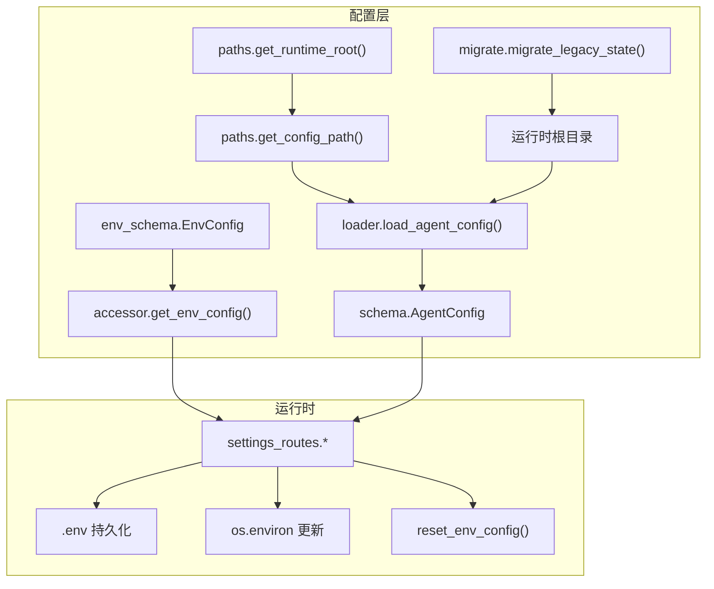
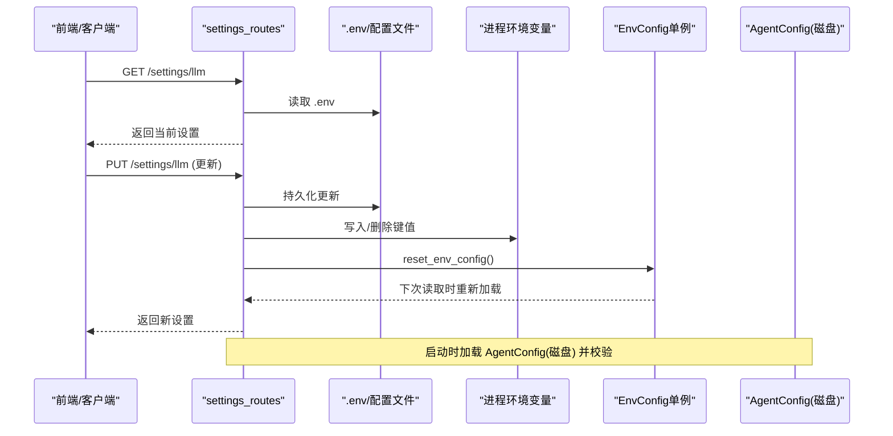
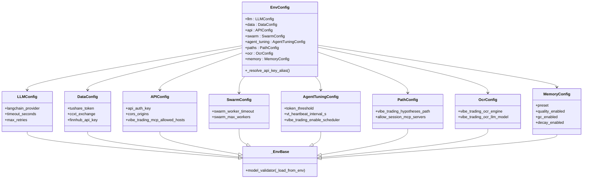
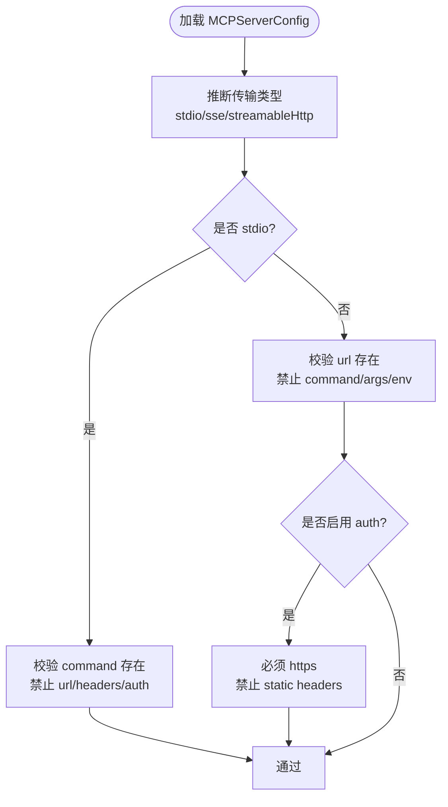
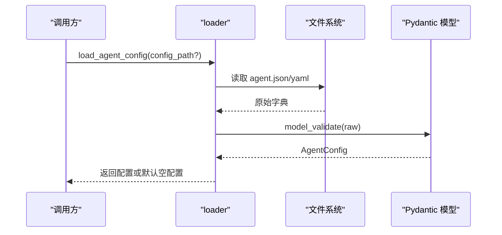
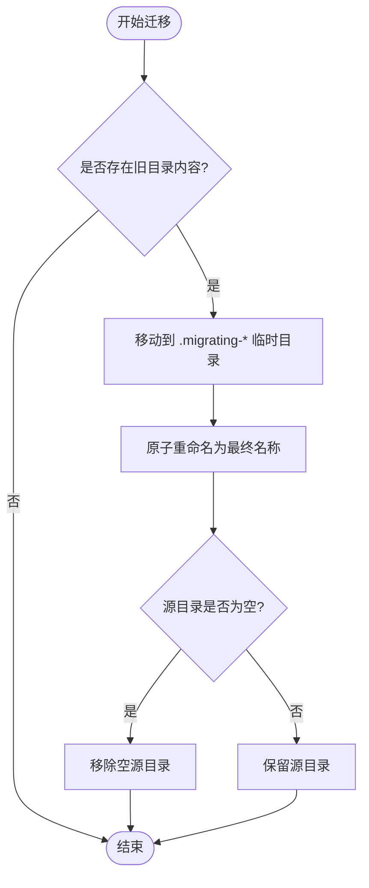
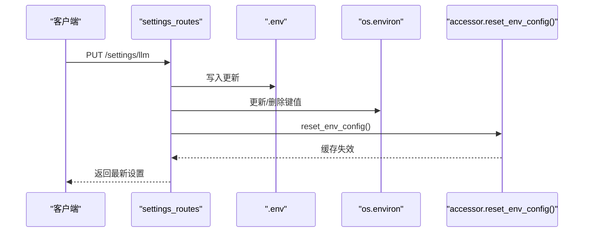
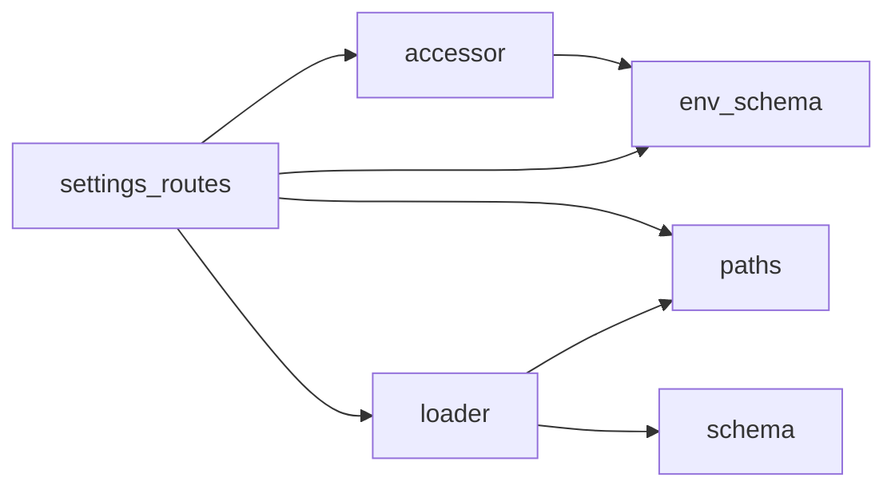

# 配置管理

<cite>
**本文引用的文件**
- [agent/src/config/env_schema.py](file://agent/src/config/env_schema.py)
- [agent/src/config/accessor.py](file://agent/src/config/accessor.py)
- [agent/src/config/loader.py](file://agent/src/config/loader.py)
- [agent/src/config/schema.py](file://agent/src/config/schema.py)
- [agent/src/config/paths.py](file://agent/src/config/paths.py)
- [agent/src/config/migrate.py](file://agent/src/config/migrate.py)
- [agent/src/api/settings_routes.py](file://agent/src/api/settings_routes.py)
</cite>

## 目录
1. [简介](#简介)
2. [项目结构](#项目结构)
3. [核心组件](#核心组件)
4. [架构总览](#架构总览)
5. [详细组件分析](#详细组件分析)
6. [依赖关系分析](#依赖关系分析)
7. [性能考虑](#性能考虑)
8. [故障排查指南](#故障排查指南)
9. [结论](#结论)
10. [附录](#附录)

## 简介
本文件系统性说明 Vibe-Trading 的配置管理体系，覆盖环境变量管理、配置文件结构与校验、运行时热重载、配置迁移、备份与同步，以及与其它组件的集成方式。文档基于仓库中的实际实现进行解读，并提供流程图和时序图帮助理解数据流与控制流。

## 项目结构
配置相关代码集中在 agent/src/config 与 agent/src/api/settings_routes.py：
- env_schema.py：集中定义所有环境变量的类型、默认值与别名，提供 EnvConfig 根模型。
- accessor.py：EnvConfig 的单例访问器，支持线程安全读取与运行时重置（热重载）。
- loader.py：结构化 Agent 配置加载、合并与覆盖（JSON/YAML），以及 Swarm 专用配置解析。
- schema.py：AgentConfig、MCPServerConfig、ChannelsConfig 等结构化配置模型与安全校验。
- paths.py：运行时根目录、配置文件候选路径、数据目录与工作区路径。
- migrate.py：将旧版“代码相对”状态迁移到运行时根目录，保证升级不丢失历史。
- settings_routes.py：通过 HTTP API 暴露设置读写能力，持久化到 .env 并触发进程内热重载。

图表来源
- [agent/src/config/env_schema.py:545-577](file://agent/src/config/env_schema.py#L545-L577)
- [agent/src/config/accessor.py:52-93](file://agent/src/config/accessor.py#L52-L93)
- [agent/src/config/loader.py:28-55](file://agent/src/config/loader.py#L28-L55)
- [agent/src/config/schema.py:452-492](file://agent/src/config/schema.py#L452-L492)
- [agent/src/config/paths.py:13-87](file://agent/src/config/paths.py#L13-L87)
- [agent/src/config/migrate.py:114-152](file://agent/src/config/migrate.py#L114-L152)
- [agent/src/api/settings_routes.py:403-466](file://agent/src/api/settings_routes.py#L403-L466)

章节来源
- [agent/src/config/env_schema.py:1-577](file://agent/src/config/env_schema.py#L1-L577)
- [agent/src/config/accessor.py:1-149](file://agent/src/config/accessor.py#L1-L149)
- [agent/src/config/loader.py:1-346](file://agent/src/config/loader.py#L1-L346)
- [agent/src/config/schema.py:1-513](file://agent/src/config/schema.py#L1-L513)
- [agent/src/config/paths.py:1-113](file://agent/src/config/paths.py#L1-L113)
- [agent/src/config/migrate.py:1-153](file://agent/src/config/migrate.py#L1-L153)
- [agent/src/api/settings_routes.py:1-674](file://agent/src/api/settings_routes.py#L1-L674)

## 核心组件
- 环境变量配置模型（EnvConfig）：以 Pydantic 模型统一声明所有环境变量，自动从 os.environ 读取并应用默认值，内置布尔解析、数值容错与字段别名。
- 结构化 Agent 配置（AgentConfig/MCPServerConfig）：对磁盘上的 agent.json/yaml 进行强类型校验，包含 MCP 服务器、通道等配置，并对高风险配置（如 live broker）做安全限制。
- 配置加载与覆盖（loader）：支持 JSON/YAML 读取、运行时覆盖合并、MCP 传输切换时的字段重置、会话级覆盖的安全清洗。
- 路径与运行时根（paths）：确定用户态运行时根目录、配置文件候选路径、数据与工作区目录。
- 迁移工具（migrate）：将旧版状态迁移至运行时根目录，原子化移动并恢复中断任务。
- 设置 API（settings_routes）：提供 HTTP 接口读写 .env，并在写入后即时生效（热重载）。

章节来源
- [agent/src/config/env_schema.py:42-115](file://agent/src/config/env_schema.py#L42-L115)
- [agent/src/config/schema.py:301-492](file://agent/src/config/schema.py#L301-L492)
- [agent/src/config/loader.py:28-151](file://agent/src/config/loader.py#L28-L151)
- [agent/src/config/paths.py:13-113](file://agent/src/config/paths.py#L13-L113)
- [agent/src/config/migrate.py:1-153](file://agent/src/config/migrate.py#L1-L153)
- [agent/src/api/settings_routes.py:476-674](file://agent/src/api/settings_routes.py#L476-L674)

## 架构总览
下图展示了配置在系统中的整体流转：从环境变量与磁盘配置到运行时生效，再到设置 API 的热重载流程。

图表来源
- [agent/src/api/settings_routes.py:497-587](file://agent/src/api/settings_routes.py#L497-L587)
- [agent/src/config/accessor.py:79-93](file://agent/src/config/accessor.py#L79-L93)
- [agent/src/config/loader.py:28-55](file://agent/src/config/loader.py#L28-L55)

## 详细组件分析

### 环境变量管理（EnvConfig）
- 设计要点
  - 使用 Pydantic 模型集中声明所有环境变量，字段带 alias（大写蛇形环境变量名）、默认值与约束。
  - _EnvBase 在构造前从 os.environ 填充缺失字段，对 int/float 做安全转换，避免无效值导致验证失败。
  - 提供 EnvBool 自定义布尔解析，兼容多种真值字符串。
  - EnvConfig 聚合多组配置（LLM、Data、API、Swarm、AgentTuning、Paths、OCR、Memory）。
- 关键行为
  - 内存模块 MemoryConfig 支持 VT_MEMORY 预设（off/on/full），并可被各 VT_MEMORY_* 标志覆盖。
  - OCR 模块 OcrConfig 兼容旧环境变量别名并输出弃用警告。
  - API 模块 APIConfig 处理认证、CORS、主机白名单、沙箱文件根等安全开关。
- 复杂度与性能
  - 首次构建 EnvConfig 会遍历字段并读取环境变量，后续通过单例缓存，避免重复解析。
  - 布尔解析与数值容错在构造阶段完成，运行期开销低。

图表来源
- [agent/src/config/env_schema.py:71-115](file://agent/src/config/env_schema.py#L71-L115)
- [agent/src/config/env_schema.py:122-197](file://agent/src/config/env_schema.py#L122-L197)
- [agent/src/config/env_schema.py:205-237](file://agent/src/config/env_schema.py#L205-L237)
- [agent/src/config/env_schema.py:245-295](file://agent/src/config/env_schema.py#L245-L295)
- [agent/src/config/env_schema.py:302-316](file://agent/src/config/env_schema.py#L302-L316)
- [agent/src/config/env_schema.py:323-378](file://agent/src/config/env_schema.py#L323-L378)
- [agent/src/config/env_schema.py:385-404](file://agent/src/config/env_schema.py#L385-L404)
- [agent/src/config/env_schema.py:461-537](file://agent/src/config/env_schema.py#L461-L537)
- [agent/src/config/env_schema.py:545-577](file://agent/src/config/env_schema.py#L545-L577)

章节来源
- [agent/src/config/env_schema.py:42-115](file://agent/src/config/env_schema.py#L42-L115)
- [agent/src/config/env_schema.py:122-577](file://agent/src/config/env_schema.py#L122-L577)

### 结构化配置与校验（AgentConfig/MCPServerConfig）
- 设计要点
  - MCPServerConfig 支持 stdio/sse/streamableHttp 三种传输，自动推断并校验必填字段；OAuth 仅允许 HTTPS，且禁止与静态 headers 混用。
  - AgentConfig 对 live broker（如 robinhood、ibkr）启用严格策略：禁止通配 enabledTools=["*"]，除非满足只读探测条件。
  - 提供 Robinhood/IBKR 的 seed 配置模板，便于操作员安全启用。
- 安全与错误处理
  - 当检测到 live broker 使用通配符时抛出 ValueError，并给出引导信息。
  - URL 主机检测防止通过别名 key 绕过安全策略。

图表来源
- [agent/src/config/schema.py:349-411](file://agent/src/config/schema.py#L349-L411)
- [agent/src/config/schema.py:452-492](file://agent/src/config/schema.py#L452-L492)

章节来源
- [agent/src/config/schema.py:301-513](file://agent/src/config/schema.py#L301-L513)

### 配置加载与覆盖（loader）
- 功能概览
  - load_agent_config：从磁盘读取 JSON/YAML，失败则回退到默认空配置。
  - merge_agent_config_overrides：将运行时覆盖（如 session 配置）与基础配置合并，先按部分模型校验再合并。
  - sanitize_session_overrides：剥离敏感键（mcpServers/mcp_servers），除非显式开启 ALLOW_SESSION_MCP_SERVERS。
  - load_swarm_agent_config：按优先级解析 swarm 专用配置路径（环境变量 > 运行时根下的 swarm-agent.json > 主 agent 配置）。
- 合并策略
  - 非 mcp_servers 字段递归合并；mcp_servers 按 server name 合并，若覆盖改变了传输家族，则重置为传输中性默认负载。

图表来源
- [agent/src/config/loader.py:28-55](file://agent/src/config/loader.py#L28-L55)
- [agent/src/config/loader.py:232-259](file://agent/src/config/loader.py#L232-L259)

章节来源
- [agent/src/config/loader.py:28-346](file://agent/src/config/loader.py#L28-L346)

### 路径与运行时根（paths）
- 功能概览
  - get_runtime_root：优先使用显式 config_path 的父目录，其次 VIBE_TRADING_HOME 环境变量，最后 ~/.vibe-trading。
  - get_config_candidates/get_config_path：按顺序查找 agent.json/yaml/yml，不存在时返回推荐默认路径。
  - get_data_dir/get_workspace_path：创建并返回数据目录与工作区目录。
- 安全与健壮性
  - 拒绝 UNC 路径作为运行时根。
  - 自动创建目录，确保后续写入不会失败。

章节来源
- [agent/src/config/paths.py:13-113](file://agent/src/config/paths.py#L13-L113)

### 配置迁移（migrate）
- 目标
  - 将旧版“代码相对”状态目录（sessions/runs/.swarm/runs/uploads）迁移到运行时根目录，保证升级/重装后历史不丢失。
- 机制
  - 原子化移动：先移动到隐藏临时目录（.migrating-*），再重命名为最终名称；中断后可恢复。
  - 跳过冲突：目标已存在的同名条目会被跳过并记录警告。
  - 清理空源：迁移完成后尝试移除空源目录。
- 幂等性
  - 多次执行不会产生副作用；若源看起来像 Python 包则跳过。

图表来源
- [agent/src/config/migrate.py:57-112](file://agent/src/config/migrate.py#L57-L112)
- [agent/src/config/migrate.py:114-152](file://agent/src/config/migrate.py#L114-L152)

章节来源
- [agent/src/config/migrate.py:1-153](file://agent/src/config/migrate.py#L1-L153)

### 热重载与运行时更新（settings_routes + accessor）
- 能力
  - 通过 HTTP API 读取/更新 LLM 与数据源设置，持久化到 .env。
  - 更新后立即写入 os.environ，并调用 reset_env_config() 使 EnvConfig 单例失效，下次读取时重建。
- 安全
  - 写操作需要认证；桌面模式下可启用安全凭据存储，避免明文落盘。
  - 对 base_url 进行合法性校验，阻止携带凭据的 URL。
- 典型流程
  - 获取设置 -> 更新设置 -> 持久化 -> 同步进程环境变量 -> 重置配置缓存 -> 返回新设置。

图表来源
- [agent/src/api/settings_routes.py:403-466](file://agent/src/api/settings_routes.py#L403-L466)
- [agent/src/api/settings_routes.py:497-587](file://agent/src/api/settings_routes.py#L497-L587)
- [agent/src/config/accessor.py:79-93](file://agent/src/config/accessor.py#L79-L93)

章节来源
- [agent/src/api/settings_routes.py:1-674](file://agent/src/api/settings_routes.py#L1-L674)
- [agent/src/config/accessor.py:1-149](file://agent/src/config/accessor.py#L1-L149)

## 依赖关系分析
- 组件耦合
  - settings_routes 依赖 accessor.reset_env_config 实现热重载；依赖 paths 与 loader 提供的路径与配置能力。
  - loader 依赖 schema 进行强类型校验；依赖 paths 解析运行时根与配置文件路径。
  - env_schema 被 accessor 与 settings_routes 间接使用，用于统一的环境变量解析。
- 外部依赖
  - Pydantic 用于模型校验与默认值管理。
  - YAML 可选（仅在存在时支持 YAML 配置）。
  - httpx 用于模型列表发现（settings_routes）。

图表来源
- [agent/src/api/settings_routes.py:20-24](file://agent/src/api/settings_routes.py#L20-L24)
- [agent/src/config/loader.py:13-15](file://agent/src/config/loader.py#L13-L15)
- [agent/src/config/accessor.py:18-24](file://agent/src/config/accessor.py#L18-L24)

章节来源
- [agent/src/api/settings_routes.py:1-674](file://agent/src/api/settings_routes.py#L1-L674)
- [agent/src/config/loader.py:1-346](file://agent/src/config/loader.py#L1-L346)
- [agent/src/config/accessor.py:1-149](file://agent/src/config/accessor.py#L1-L149)
- [agent/src/config/env_schema.py:1-577](file://agent/src/config/env_schema.py#L1-L577)

## 性能考虑
- 配置加载
  - EnvConfig 首次构建会遍历字段并读取环境变量，之后通过单例缓存，避免重复解析。
  - 结构化配置加载失败时快速回退到默认配置，减少启动阻塞。
- 热重载
  - reset_env_config 仅重置缓存指针，下次读取时重建，避免重启进程。
- 迁移
  - 原子化移动与恢复逻辑降低长时间迁移的风险；逐个条目迁移，避免整块复制的性能问题。

[本节为通用指导，无需特定文件引用]

## 故障排查指南
- 常见问题
  - 环境变量未生效：确认已通过 settings_routes 更新并调用 reset_env_config；检查 .env 是否成功写入。
  - YAML 配置不可用：缺少 PyYAML 时会报错，需安装依赖或使用 JSON。
  - Live broker 配置被拒绝：检查 enabled_tools 是否使用了通配符；按提示添加只读工具列表。
  - 迁移失败：查看日志中关于冲突或权限的警告；手动清理残留的 .migrating-* 目录。
- 定位方法
  - 使用 settings API 获取当前设置，对比期望值。
  - 检查路径函数返回的运行时根与配置文件路径是否符合预期。
  - 关注 loader 与 schema 的异常日志，定位具体字段校验失败原因。

章节来源
- [agent/src/config/loader.py:44-55](file://agent/src/config/loader.py#L44-L55)
- [agent/src/config/schema.py:458-492](file://agent/src/config/schema.py#L458-L492)
- [agent/src/config/migrate.py:77-112](file://agent/src/config/migrate.py#L77-L112)
- [agent/src/api/settings_routes.py:434-466](file://agent/src/api/settings_routes.py#L434-L466)

## 结论
Vibe-Trading 的配置体系以 Pydantic 为核心，实现了类型安全、集中管理与强校验；通过 loader 与 schema 保障结构化配置的可靠性；借助 accessor 与 settings_routes 实现进程内热重载；migrate 保证历史数据迁移的稳健性。该设计兼顾了安全性（live broker 限制、OAuth 校验）、可维护性（集中环境变量定义）与可用性（热重载与友好错误提示）。

[本节为总结性内容，无需特定文件引用]

## 附录
- 环境变量分组与用途
  - LLM：提供商、模型、超时、重试、推理努力等。
  - Data：数据源密钥、交易所、预算与缓存开关等。
  - API：认证、CORS、主机白名单、沙箱文件根等。
  - Swarm：工作器超时、最大迭代、心跳间隔等。
  - AgentTuning：令牌阈值、心跳、搜索后端、调度器等。
  - Paths：假设库路径、目标数据库路径、主题等。
  - OCR：引擎选择与模型。
  - Memory：质量、GC、衰减、层级、链接、压缩、全文索引等。
- 配置选项与参数
  - 详见各 EnvConfig 子模型的字段定义与默认值。
- 返回值与错误
  - 配置加载失败返回默认空配置；结构化配置校验失败抛出 ValidationError 或 ValueError。
- 与其他组件的集成
  - settings_routes 与 provider、tools、channels 等通过环境变量与结构化配置协作。
  - loader 与 schema 为 swarm、session、live trading 等模块提供一致的配置入口。

[本节为补充信息，无需特定文件引用]