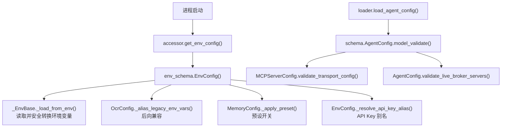
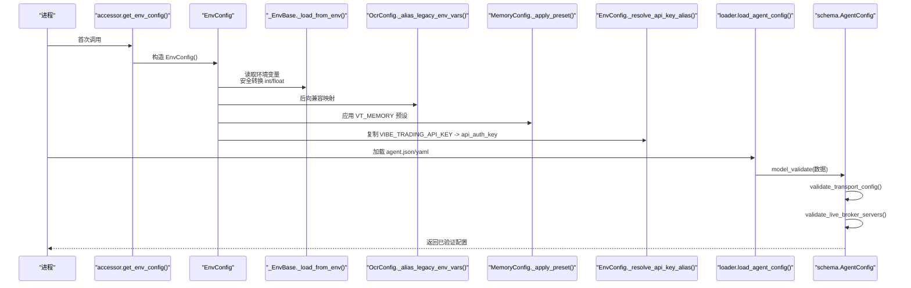
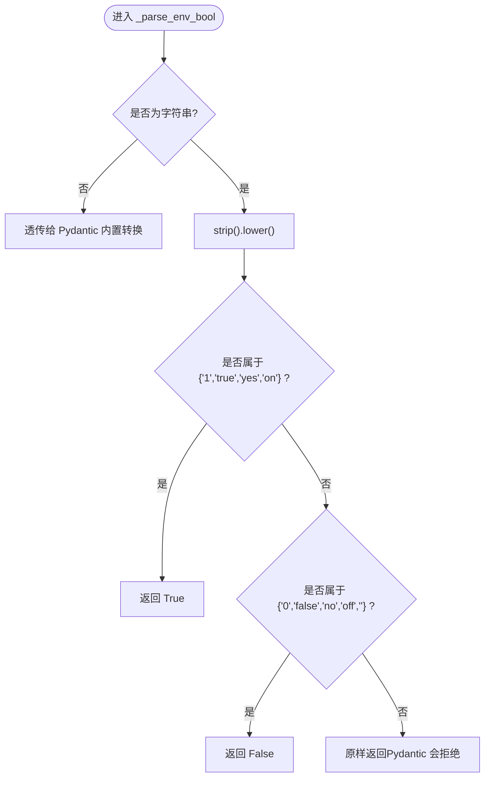
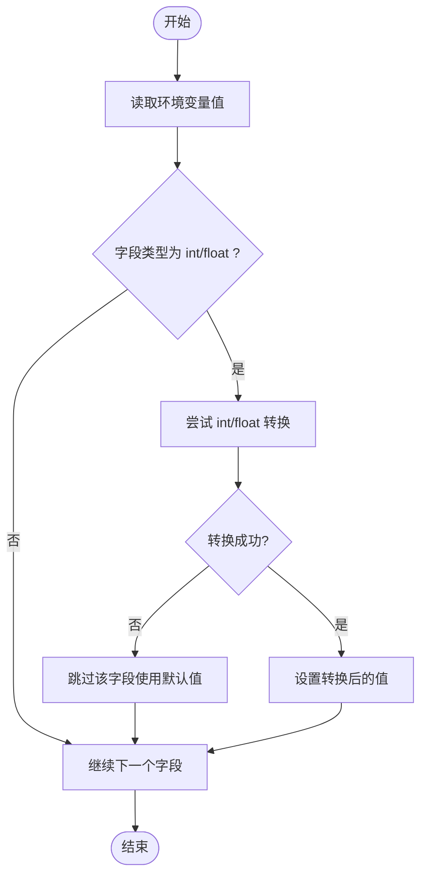
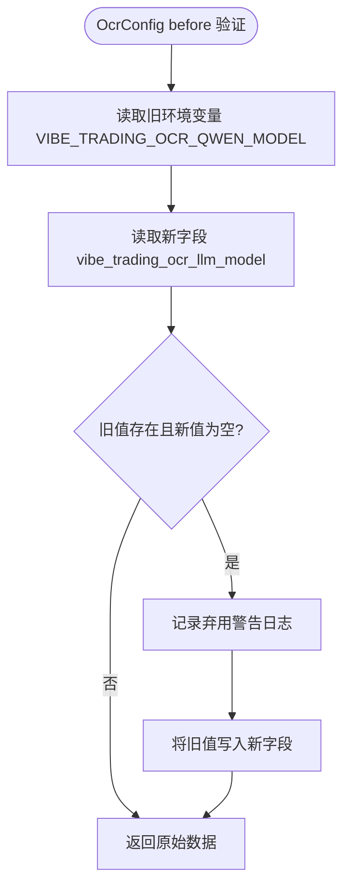
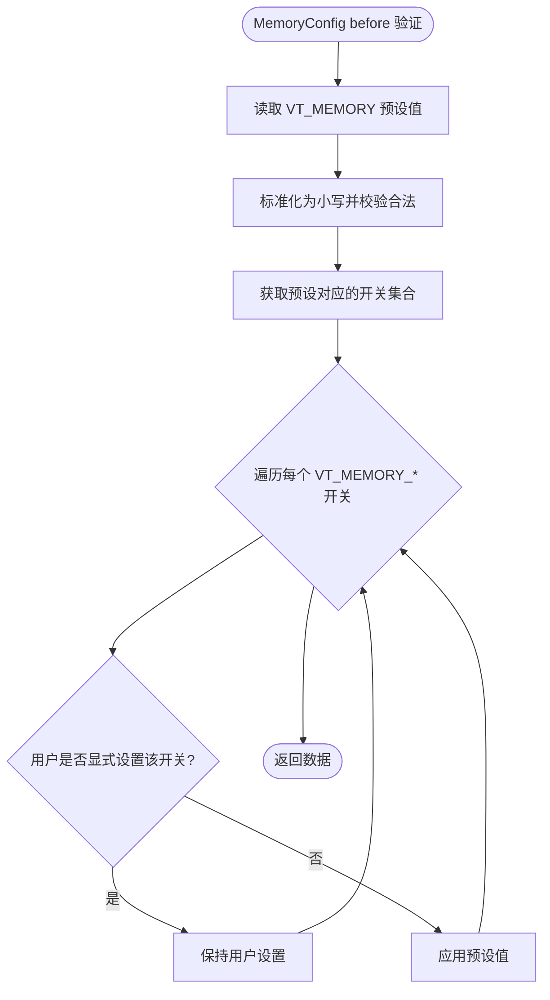
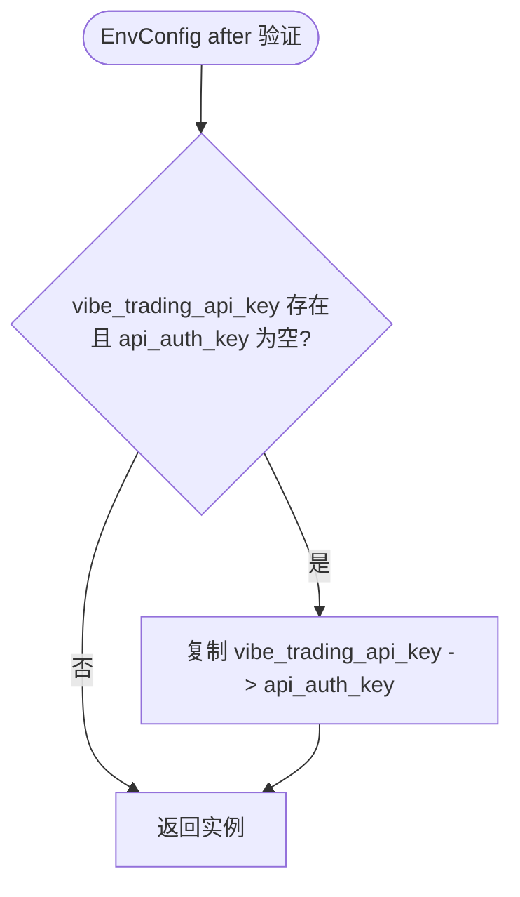
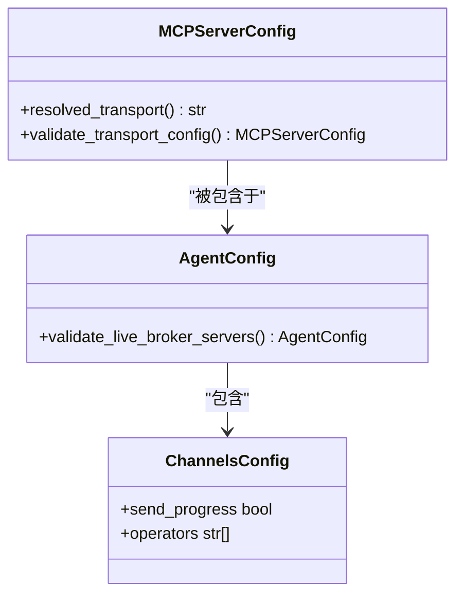
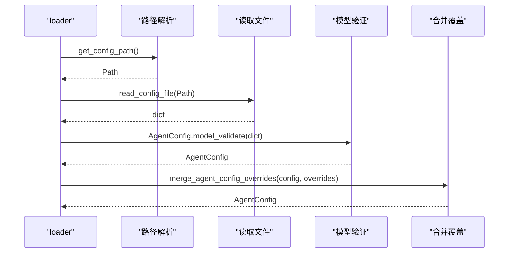
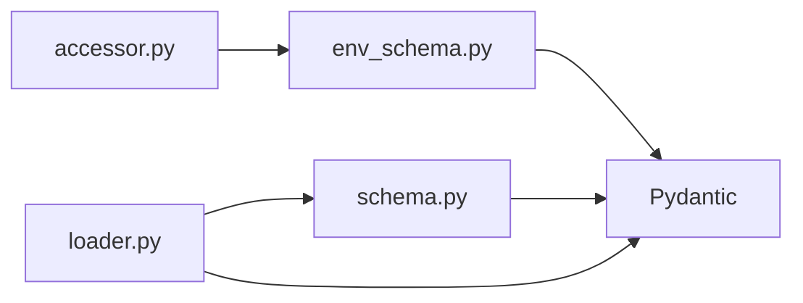

# 配置验证机制

<cite>
**本文引用的文件**
- [env_schema.py](file://agent/src/config/env_schema.py)
- [schema.py](file://agent/src/config/schema.py)
- [loader.py](file://agent/src/config/loader.py)
- [accessor.py](file://agent/src/config/accessor.py)
- [test_env_schema.py](file://agent/tests/test_env_schema.py)
</cite>

## 目录
1. [简介](#简介)
2. [项目结构](#项目结构)
3. [核心组件](#核心组件)
4. [架构总览](#架构总览)
5. [详细组件分析](#详细组件分析)
6. [依赖关系分析](#依赖关系分析)
7. [性能考虑](#性能考虑)
8. [故障排查指南](#故障排查指南)
9. [结论](#结论)
10. [附录](#附录)

## 简介
本文件系统性说明 Vibe-Trading 的配置验证机制，重点围绕基于 Pydantic 的模型与验证器：
- 类型验证、范围检查、自定义验证器（BeforeValidator）与模型级验证器（model_validator）。
- 布尔值解析器 _parse_env_bool 的工作原理、支持的值格式与大小写处理。
- 数值类型的自动转换与错误回退策略（int/float 字符串到数字）。
- model_validator 的典型使用场景：OCR 配置的后向兼容、MemoryConfig 的预设应用、EnvConfig 的 API Key 别名解析。
- 验证错误的捕获与处理、配置调试与问题诊断方法。

## 项目结构
配置相关代码集中在 agent/src/config 目录下，分为三类：
- 环境变量配置模型：env_schema.py（集中定义所有环境变量的默认值、类型、别名与验证逻辑）。
- 结构化 Agent 配置模型：schema.py（MCP 服务器、通道等结构化配置的校验与安全策略）。
- 配置加载与合并：loader.py（从磁盘读取 JSON/YAML，合并运行时覆盖，安全过滤）。
- 访问器与单例：accessor.py（线程安全的 EnvConfig 单例、统一布尔解析与环境变量读取工具）。

图表来源
- [env_schema.py:71-114](file://agent/src/config/env_schema.py#L71-L114)
- [env_schema.py:205-237](file://agent/src/config/env_schema.py#L205-L237)
- [env_schema.py:461-537](file://agent/src/config/env_schema.py#L461-L537)
- [env_schema.py:545-576](file://agent/src/config/env_schema.py#L545-L576)
- [schema.py:349-411](file://agent/src/config/schema.py#L349-L411)
- [schema.py:452-492](file://agent/src/config/schema.py#L452-L492)
- [loader.py:28-54](file://agent/src/config/loader.py#L28-L54)

章节来源
- [env_schema.py:1-114](file://agent/src/config/env_schema.py#L1-L114)
- [schema.py:301-492](file://agent/src/config/schema.py#L301-L492)
- [loader.py:28-100](file://agent/src/config/loader.py#L28-L100)
- [accessor.py:52-93](file://agent/src/config/accessor.py#L52-L93)

## 核心组件
- 环境变量配置基类 _EnvBase：提供统一的“从环境变量填充字段”的能力，并对 int/float 做安全转换，失败时回退到默认值。
- EnvBool：基于 BeforeValidator 的布尔类型，将多种字符串形式转换为 bool。
- 各子配置模型：LLMConfig、DataConfig、APIConfig、SwarmConfig、AgentTuningConfig、PathConfig、OcrConfig、MemoryConfig。
- 顶层组合模型 EnvConfig：聚合上述子模型，并在 after 阶段完成 API Key 别名解析。
- 结构化 Agent 配置模型：MCPOAuthConfig、MCPServerConfig、ChannelsConfig、AgentConfig 等，用于 MCP 服务器与通道的严格校验与安全策略。
- 配置加载器：负责读取 JSON/YAML、合并覆盖、安全过滤（如限制 session 注入 mcpServers）。

章节来源
- [env_schema.py:71-114](file://agent/src/config/env_schema.py#L71-L114)
- [env_schema.py:122-198](file://agent/src/config/env_schema.py#L122-L198)
- [env_schema.py:205-237](file://agent/src/config/env_schema.py#L205-L237)
- [env_schema.py:245-295](file://agent/src/config/env_schema.py#L245-L295)
- [env_schema.py:302-316](file://agent/src/config/env_schema.py#L302-L316)
- [env_schema.py:323-378](file://agent/src/config/env_schema.py#L323-L378)
- [env_schema.py:385-404](file://agent/src/config/env_schema.py#L385-L404)
- [env_schema.py:411-537](file://agent/src/config/env_schema.py#L411-L537)
- [env_schema.py:545-576](file://agent/src/config/env_schema.py#L545-L576)
- [schema.py:301-492](file://agent/src/config/schema.py#L301-L492)
- [loader.py:28-100](file://agent/src/config/loader.py#L28-L100)

## 架构总览
下图展示了配置加载与验证的整体流程：进程启动通过 accessor 获取 EnvConfig 单例；EnvConfig 在 before 阶段从环境变量填充并安全转换数值，在 after 阶段执行别名解析；同时，结构化 Agent 配置由 loader 读取并经由 schema 中的多个 model_validator 进行严格校验。

图表来源
- [accessor.py:52-76](file://agent/src/config/accessor.py#L52-L76)
- [env_schema.py:71-114](file://agent/src/config/env_schema.py#L71-L114)
- [env_schema.py:205-237](file://agent/src/config/env_schema.py#L205-L237)
- [env_schema.py:461-537](file://agent/src/config/env_schema.py#L461-L537)
- [env_schema.py:545-576](file://agent/src/config/env_schema.py#L545-L576)
- [loader.py:28-54](file://agent/src/config/loader.py#L28-L54)
- [schema.py:349-411](file://agent/src/config/schema.py#L349-L411)
- [schema.py:452-492](file://agent/src/config/schema.py#L452-L492)

## 详细组件分析

### 布尔值解析器 _parse_env_bool
- 作用：为 EnvBool 类型提供 BeforeValidator，将字符串形式的布尔值转换为 Python bool。
- 支持的 True 值：不区分大小写的 "1"、"true"、"yes"、"on"。
- 支持的 False 值：不区分大小写的 "0"、"false"、"no"、"off"、""。
- 非字符串值：直接透传给 Pydantic 内置转换（例如已经是 bool/int/None）。
- 未识别字符串：原样返回，交由 Pydantic 后续校验拒绝。

图表来源
- [env_schema.py:47-63](file://agent/src/config/env_schema.py#L47-L63)

章节来源
- [env_schema.py:47-63](file://agent/src/config/env_schema.py#L47-L63)
- [test_env_schema.py:415-443](file://agent/tests/test_env_schema.py#L415-L443)

### 数值类型的自动转换与错误处理
- 机制：_EnvBase._load_from_env 在 before 阶段读取环境变量，针对 int/float 字段尝试转换；若转换失败则跳过该字段，使 Pydantic 使用字段默认值，避免抛出 ValidationError。
- 效果：非法数值不会导致配置加载失败，而是静默回退到默认值，提升鲁棒性。
- 示例：TIMEOUT_SECONDS 设置为非数字字符串时，最终取默认值 120。

图表来源
- [env_schema.py:81-114](file://agent/src/config/env_schema.py#L81-L114)

章节来源
- [env_schema.py:81-114](file://agent/src/config/env_schema.py#L81-L114)
- [test_env_schema.py:167-187](file://agent/tests/test_env_schema.py#L167-L187)

### OcrConfig 后向兼容性处理
- 场景：旧环境变量 VIBE_TRADING_OCR_QWEN_MODEL 迁移到新字段 vibe_trading_ocr_llm_model。
- 实现：在 OcrConfig 的 before 模型验证器中检测旧环境变量是否存在且新字段为空时，将旧值复制到新字段，并记录警告日志。
- 目的：保证历史配置在新版本中仍可用，同时提示用户迁移。

图表来源
- [env_schema.py:205-237](file://agent/src/config/env_schema.py#L205-L237)

章节来源
- [env_schema.py:205-237](file://agent/src/config/env_schema.py#L205-L237)

### MemoryConfig 预设应用
- 预设：VT_MEMORY=off|on|full，分别对应不同功能开关的组合。
- 行为：before 模型验证器根据预设设置基础开关；如果用户显式设置了某个 VT_MEMORY_* 环境变量或构造函数参数，则保留用户设置，不被预设覆盖。
- 映射：quality_enabled、gc_enabled、decay_enabled、hierarchy_enabled、links_enabled、compression_enabled、fts_index_enabled。

图表来源
- [env_schema.py:411-537](file://agent/src/config/env_schema.py#L411-L537)

章节来源
- [env_schema.py:411-537](file://agent/src/config/env_schema.py#L411-L537)

### EnvConfig API Key 别名解析
- 背景：CLI 历史优先读取 VIBE_TRADING_API_KEY，而 API 服务器仅读取 API_AUTH_KEY。
- 解决：EnvConfig 的 after 模型验证器在 vibe_trading_api_key 存在且 api_auth_key 为空时，将前者复制到后者，确保两个入口语义一致。

图表来源
- [env_schema.py:545-576](file://agent/src/config/env_schema.py#L545-L576)

章节来源
- [env_schema.py:545-576](file://agent/src/config/env_schema.py#L545-L576)
- [test_env_schema.py:277-300](file://agent/tests/test_env_schema.py#L277-L300)

### 结构化 Agent 配置的安全校验
- MCPServerConfig.validate_transport_config：校验传输类型与必填字段，禁止 HTTP OAuth 使用明文 URL，禁止 stdio 使用 url/headers/auth 等冲突配置。
- AgentConfig.validate_live_broker_servers：对真实券商 MCP 服务器禁止 wildcard enabled_tools=["*"]，除非满足特定只读探测条件（如 IBKR 的 mcp.read 范围）。

图表来源
- [schema.py:349-411](file://agent/src/config/schema.py#L349-L411)
- [schema.py:429-457](file://agent/src/config/schema.py#L429-L457)
- [schema.py:452-492](file://agent/src/config/schema.py#L452-L492)

章节来源
- [schema.py:349-411](file://agent/src/config/schema.py#L349-L411)
- [schema.py:452-492](file://agent/src/config/schema.py#L452-L492)

### 配置加载与合并
- load_agent_config：从磁盘读取 JSON/YAML，失败时记录警告并回退到默认配置。
- merge_agent_config_overrides：先按部分模式验证覆盖层，再合并并重新验证整体配置；失败时忽略覆盖层，保留基础配置。
- sanitize_session_overrides：剥离敏感键（如 mcpServers），防止非操作员信任的来源注入可执行命令。

图表来源
- [loader.py:28-54](file://agent/src/config/loader.py#L28-L54)
- [loader.py:57-100](file://agent/src/config/loader.py#L57-L100)
- [loader.py:107-134](file://agent/src/config/loader.py#L107-L134)

章节来源
- [loader.py:28-100](file://agent/src/config/loader.py#L28-L100)
- [loader.py:107-134](file://agent/src/config/loader.py#L107-L134)

## 依赖关系分析
- env_schema 依赖 Pydantic 的 BaseModel、Field、model_validator、BeforeValidator。
- schema 依赖 Pydantic 的 ConfigDict、Field、model_validator，以及 urllib 解析 URL。
- loader 依赖 schema 的 AgentConfig、MCPServerConfig，并使用 Pydantic 的 ValidationError 进行异常处理。
- accessor 提供线程安全的 EnvConfig 单例，避免循环导入与重复初始化。

图表来源
- [accessor.py:52-93](file://agent/src/config/accessor.py#L52-L93)
- [env_schema.py:27-114](file://agent/src/config/env_schema.py#L27-L114)
- [schema.py:9-10](file://agent/src/config/schema.py#L9-L10)
- [loader.py:11-15](file://agent/src/config/loader.py#L11-L15)

章节来源
- [accessor.py:52-93](file://agent/src/config/accessor.py#L52-L93)
- [env_schema.py:27-114](file://agent/src/config/env_schema.py#L27-L114)
- [schema.py:9-10](file://agent/src/config/schema.py#L9-L10)
- [loader.py:11-15](file://agent/src/config/loader.py#L11-L15)

## 性能考虑
- 单例缓存：get_env_config 使用模块级锁与双重检查锁定，避免重复创建 EnvConfig，降低初始化开销。
- 安全转换：_EnvBase 对 int/float 的 try/except 转换避免抛出异常导致的配置加载失败，减少错误分支成本。
- 懒加载：accessor 延迟导入 EnvConfig，减少模块加载时的重型依赖影响。

[本节为通用性能讨论，无需具体文件分析]

## 故障排查指南
- 常见错误来源：
  - 环境变量类型不匹配：如 TIMEOUT_SECONDS 为非数字字符串，会被安全回退到默认值。
  - 布尔值解析失败：未识别的字符串将被透传并由 Pydantic 拒绝。
  - 结构化配置校验失败：MCPServerConfig 的传输配置错误或 AgentConfig 的 live broker wildcard 不允许。
- 定位方法：
  - 查看 loader 的警告日志，确认配置文件读取与合并过程。
  - 检查 EnvConfig 的 after 验证器是否生效（API Key 别名）。
  - 使用测试用例作为参考，验证环境变量覆盖与默认值行为。
- 调试建议：
  - 重置单例：调用 reset_env_config() 后重新获取配置，确保最新环境变量生效。
  - 逐步缩小范围：先验证基本字段类型，再检查 model_validator 逻辑。
  - 关注日志：OcrConfig 的弃用警告、loader 的加载失败详情。

章节来源
- [loader.py:28-54](file://agent/src/config/loader.py#L28-L54)
- [env_schema.py:205-237](file://agent/src/config/env_schema.py#L205-L237)
- [env_schema.py:545-576](file://agent/src/config/env_schema.py#L545-L576)
- [accessor.py:79-93](file://agent/src/config/accessor.py#L79-L93)
- [test_env_schema.py:167-187](file://agent/tests/test_env_schema.py#L167-L187)

## 结论
Vibe-Trading 的配置验证机制以 Pydantic 为核心，通过 BeforeValidator 与 model_validator 实现了：
- 健壮的类型转换与错误回退。
- 灵活的后向兼容与预设管理。
- 严格的安全策略与传输配置校验。
配合线程安全的单例访问器与安全的配置加载合并流程，确保了配置的一致性与可靠性。

[本节为总结性内容，无需具体文件分析]

## 附录
- 新增验证逻辑的建议步骤：
  - 在 env_schema 中为新字段添加 Field(alias=...) 与合适的默认值。
  - 如需复杂规则，使用 @field_validator 或 @model_validator(mode="before"/"after")。
  - 在测试中覆盖正常与异常路径，包括类型转换失败、别名解析、预设覆盖等。
- 参考测试用例：
  - 布尔解析与类型转换：test_env_schema.py 中的 TestParseEnvBool、TestEnvConfigTypeCoercion。
  - API Key 别名：TestAPIKeyAlias。
  - 单例与线程安全：TestSingletonBehavior、TestThreadSafety。

章节来源
- [test_env_schema.py:167-187](file://agent/tests/test_env_schema.py#L167-L187)
- [test_env_schema.py:277-300](file://agent/tests/test_env_schema.py#L277-L300)
- [test_env_schema.py:308-377](file://agent/tests/test_env_schema.py#L308-L377)
- [test_env_schema.py:415-443](file://agent/tests/test_env_schema.py#L415-L443)