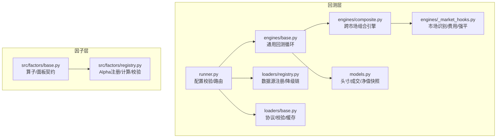
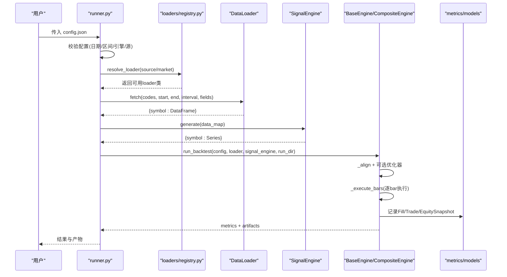
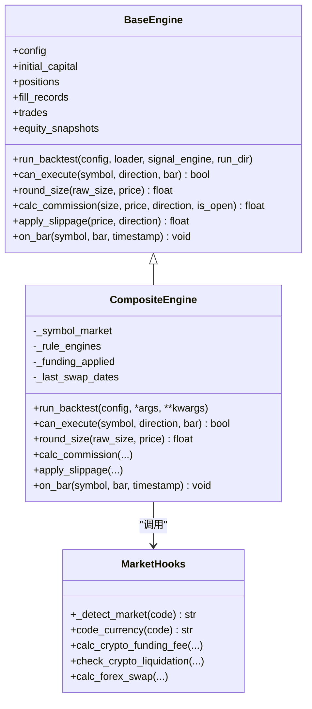
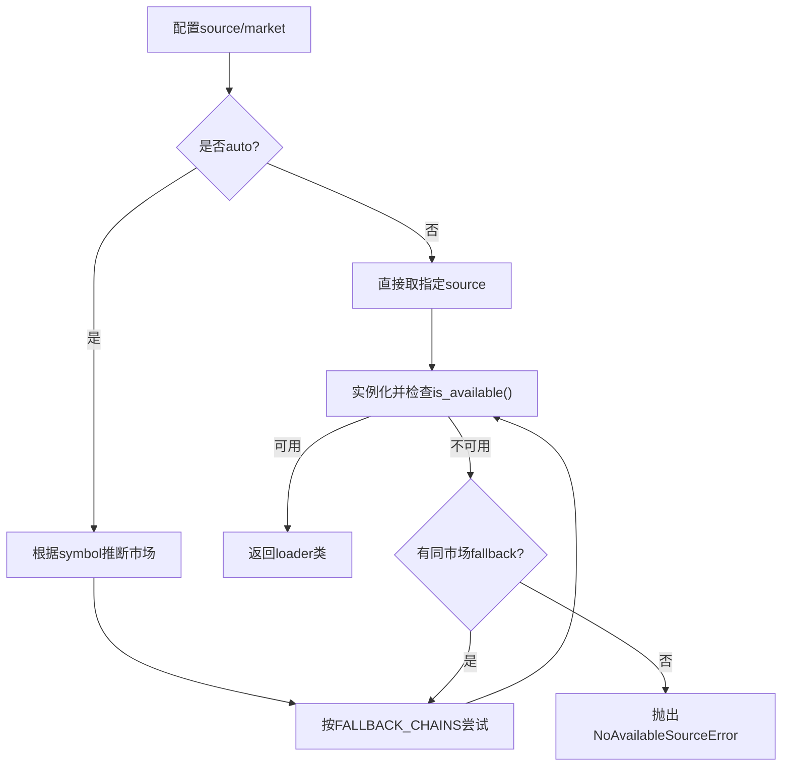
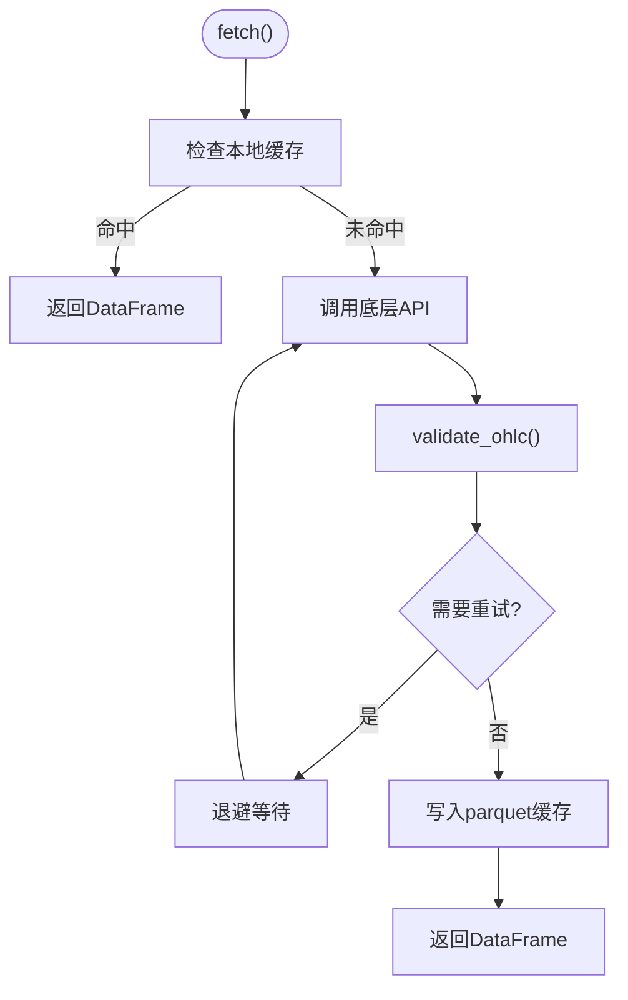
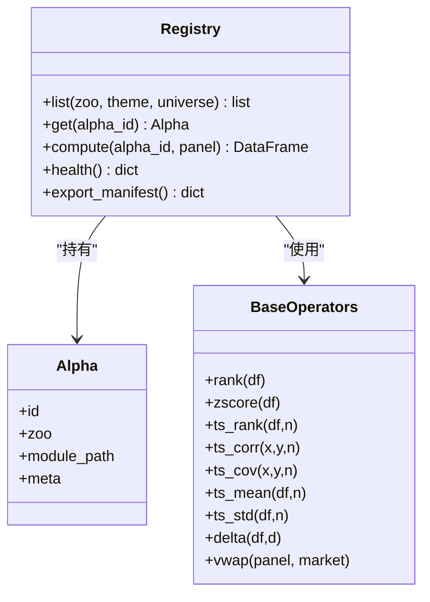
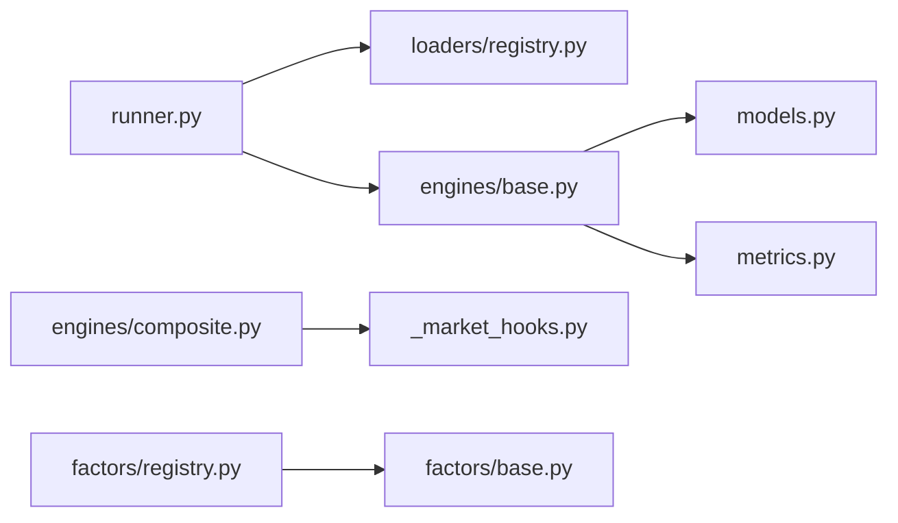

# 量化回测引擎

<cite>
**本文引用的文件**
- [agent/backtest/engines/base.py](file://agent/backtest/engines/base.py)
- [agent/backtest/engines/composite.py](file://agent/backtest/engines/composite.py)
- [agent/backtest/engines/_market_hooks.py](file://agent/backtest/engines/_market_hooks.py)
- [agent/backtest/loaders/base.py](file://agent/backtest/loaders/base.py)
- [agent/backtest/loaders/registry.py](file://agent/backtest/loaders/registry.py)
- [agent/backtest/runner.py](file://agent/backtest/runner.py)
- [agent/backtest/models.py](file://agent/backtest/models.py)
- [agent/src/factors/base.py](file://agent/src/factors/base.py)
- [agent/src/factors/registry.py](file://agent/src/factors/registry.py)
</cite>

## 目录
1. [简介](#简介)
2. [项目结构](#项目结构)
3. [核心组件](#核心组件)
4. [架构总览](#架构总览)
5. [详细组件分析](#详细组件分析)
6. [依赖关系分析](#依赖关系分析)
7. [性能考量](#性能考量)
8. [故障排查指南](#故障排查指南)
9. [结论](#结论)
10. [附录：使用模式与示例路径](#附录使用模式与示例路径)

## 简介
本文件面向 Vibe-Trading 量化回测引擎，系统性说明多市场回测架构、引擎选择与路由机制、性能优化策略、错误处理机制；数据加载器架构、内置数据源、自定义数据源开发与数据缓存策略；因子分析系统架构、内置因子实现、因子计算方法和因子验证流程；以及与数据管理层、交易集成系统的关系。文档以代码级为依据，提供可视化图示和可追溯的源码引用，帮助读者从入门到深入理解并扩展该回测系统。

## 项目结构
回测子系统主要位于 agent/backtest 与 agent/src/factors 两个目录：
- backtest：回测执行引擎、数据加载器、指标与模型定义、运行入口等
- factors：因子（Alpha）注册表、基础算子、zoo 因子库

图表来源
- [agent/backtest/runner.py:1-120](file://agent/backtest/runner.py#L1-L120)
- [agent/backtest/engines/base.py:647-718](file://agent/backtest/engines/base.py#L647-L718)
- [agent/backtest/engines/composite.py:102-147](file://agent/backtest/engines/composite.py#L102-L147)
- [agent/backtest/loaders/registry.py:158-193](file://agent/backtest/loaders/registry.py#L158-L193)
- [agent/backtest/loaders/base.py:618-645](file://agent/backtest/loaders/base.py#L618-L645)
- [agent/src/factors/registry.py:201-397](file://agent/src/factors/registry.py#L201-L397)

章节来源
- [agent/backtest/runner.py:1-120](file://agent/backtest/runner.py#L1-L120)
- [agent/backtest/engines/base.py:647-718](file://agent/backtest/engines/base.py#L647-L718)
- [agent/backtest/loaders/registry.py:158-193](file://agent/backtest/loaders/registry.py#L158-L193)
- [agent/src/factors/registry.py:201-397](file://agent/src/factors/registry.py#L201-L397)

## 核心组件
- 回测运行器 runner：读取配置、校验参数、选择数据源与引擎、加载信号、执行回测、输出指标与产物
- 数据加载器 loaders：统一 DataLoaderProtocol，支持多市场、自动降级、本地缓存、OHLC 校验
- 引擎 engines：BaseEngine 提供通用 bar-by-bar 执行循环；CompositeEngine 管理跨市场共享资金池并按市场路由规则；_market_hooks 提供市场识别、费用、强平、掉期等
- 模型 models：Position/FillRecord/TradeRecord/EquitySnapshot 等不可变记录
- 因子系统 factors：base 提供面板算子与输入契约；registry 扫描 zoo、静态解析元数据、懒加载 compute、严格输出校验

章节来源
- [agent/backtest/runner.py:68-163](file://agent/backtest/runner.py#L68-L163)
- [agent/backtest/loaders/base.py:618-645](file://agent/backtest/loaders/base.py#L618-L645)
- [agent/backtest/engines/base.py:377-644](file://agent/backtest/engines/base.py#L377-L644)
- [agent/backtest/engines/composite.py:102-147](file://agent/backtest/engines/composite.py#L102-L147)
- [agent/backtest/models.py:13-118](file://agent/backtest/models.py#L13-L118)
- [agent/src/factors/base.py:1-13](file://agent/src/factors/base.py#L1-L13)
- [agent/src/factors/registry.py:201-397](file://agent/src/factors/registry.py#L201-L397)

## 架构总览
回测主流程由 runner 驱动，按配置选择数据源与引擎，调用 BaseEngine.run_backtest 完成“数据→信号→权重→逐bar执行→指标”的闭环。CompositeEngine 在跨市场场景下维护共享资金池，并将规则委托给各市场专用引擎。

图表来源
- [agent/backtest/runner.py:68-163](file://agent/backtest/runner.py#L68-L163)
- [agent/backtest/loaders/registry.py:158-193](file://agent/backtest/loaders/registry.py#L158-L193)
- [agent/backtest/engines/base.py:647-718](file://agent/backtest/engines/base.py#L647-L718)
- [agent/backtest/models.py:13-118](file://agent/backtest/models.py#L13-L118)

## 详细组件分析

### 多市场回测引擎与路由
- BaseEngine 抽象出 can_execute/round_size/calc_commission/apply_slippage/on_bar 等市场规则钩子，并提供统一的 run_backtest 管线：数据加载→信号生成→对齐与权重→逐bar执行→指标与产物
- CompositeEngine 负责跨市场组合回测：检测所有 code 的市场类型，构建子引擎映射，统一资金池，并在 on_bar 中处理加密货币资金费率与强平、外汇掉期等
- _market_hooks 集中符号到市场的识别逻辑、结算货币映射、中国期货识别、加密货币资金费与强平、外汇掉期计算

图表来源
- [agent/backtest/engines/base.py:377-644](file://agent/backtest/engines/base.py#L377-L644)
- [agent/backtest/engines/composite.py:102-257](file://agent/backtest/engines/composite.py#L102-L257)
- [agent/backtest/engines/_market_hooks.py:23-115](file://agent/backtest/engines/_market_hooks.py#L23-L115)
- [agent/backtest/engines/_market_hooks.py:223-374](file://agent/backtest/engines/_market_hooks.py#L223-L374)

章节来源
- [agent/backtest/engines/base.py:377-644](file://agent/backtest/engines/base.py#L377-L644)
- [agent/backtest/engines/composite.py:102-257](file://agent/backtest/engines/composite.py#L102-L257)
- [agent/backtest/engines/_market_hooks.py:23-115](file://agent/backtest/engines/_market_hooks.py#L23-L115)
- [agent/backtest/engines/_market_hooks.py:223-374](file://agent/backtest/engines/_market_hooks.py#L223-L374)

### 引擎选择与路由机制
- runner 通过 BacktestConfigSchema 校验 source、engine、interval 等字段
- 数据源选择：LOADER_REGISTRY 维护已注册的数据源；resolve_loader 根据市场类型按 FALLBACK_CHAINS 顺序尝试，直到找到可用的 loader；get_loader_cls_with_fallback 支持显式 source 的降级
- 市场识别：_detect_market 基于正则将 symbol 分类为 a_share/us_equity/hk_equity/india_equity/kr_equity/ca_equity/crypto/futures/forex；_is_china_futures 区分中国期货；_detect_submarket 用于美股/港股/加股细分

图表来源
- [agent/backtest/loaders/registry.py:23-59](file://agent/backtest/loaders/registry.py#L23-L59)
- [agent/backtest/loaders/registry.py:136-155](file://agent/backtest/loaders/registry.py#L136-L155)
- [agent/backtest/loaders/registry.py:158-193](file://agent/backtest/loaders/registry.py#L158-L193)
- [agent/backtest/loaders/registry.py:196-249](file://agent/backtest/loaders/registry.py#L196-L249)
- [agent/backtest/engines/_market_hooks.py:23-60](file://agent/backtest/engines/_market_hooks.py#L23-L60)
- [agent/backtest/engines/_market_hooks.py:135-150](file://agent/backtest/engines/_market_hooks.py#L135-L150)

章节来源
- [agent/backtest/runner.py:68-163](file://agent/backtest/runner.py#L68-L163)
- [agent/backtest/loaders/registry.py:158-249](file://agent/backtest/loaders/registry.py#L158-L249)
- [agent/backtest/engines/_market_hooks.py:23-60](file://agent/backtest/engines/_market_hooks.py#L23-L60)

### 数据加载器架构与缓存策略
- DataLoaderProtocol 定义了 name/markets/requires_auth/is_available/fetch 的统一接口
- OHLC 校验 validate_ohlc 强制 high>=low、open/close 被 high/low 包围、非正价格拒绝（可配置允许负价）
- 重试与预算：retry_with_budget/check_budget 提供带超时预算的重试，避免外部 API 抖动导致长时间阻塞
- 本地缓存：loader_cache_enabled/loader_cache_root/make_loader_cache_key/loader_cache_path/loader_cache_get/loader_cache_put/cached_loader_fetch 构成内容寻址的 parquet 缓存，仅对已结算范围写入，读失败不中断流程
- 内置数据源：registry 维护 tushare/yfinance/akshare/baostock/tencent/mootdx/ccxt/futu/eastmoney/sina/stooq/yahoo/finnhub/alphavantage/tiingo/fmp/qveris/india_broker/pykrx/longbridge/mt5/local 等，并按市场设定 fallback 链

图表来源
- [agent/backtest/loaders/base.py:31-119](file://agent/backtest/loaders/base.py#L31-L119)
- [agent/backtest/loaders/base.py:163-236](file://agent/backtest/loaders/base.py#L163-L236)
- [agent/backtest/loaders/base.py:251-439](file://agent/backtest/loaders/base.py#L251-L439)
- [agent/backtest/loaders/registry.py:83-108](file://agent/backtest/loaders/registry.py#L83-L108)

章节来源
- [agent/backtest/loaders/base.py:31-119](file://agent/backtest/loaders/base.py#L31-L119)
- [agent/backtest/loaders/base.py:163-236](file://agent/backtest/loaders/base.py#L163-L236)
- [agent/backtest/loaders/base.py:251-439](file://agent/backtest/loaders/base.py#L251-L439)
- [agent/backtest/loaders/registry.py:83-108](file://agent/backtest/loaders/registry.py#L83-L108)

### 自定义数据源开发
- 实现 DataLoaderProtocol：声明 name/markets/requires_auth、is_available、fetch
- 在 fetch 中返回 {symbol: DataFrame}，确保包含 open/high/low/close/volume 等列
- 建议复用 retry_with_budget/check_budget 做网络健壮性
- 建议在 fetch 后调用 validate_ohlc 保证数据质量
- 若启用本地缓存，可使用 cached_loader_fetch 包装 fetch

章节来源
- [agent/backtest/loaders/base.py:618-645](file://agent/backtest/loaders/base.py#L618-L645)
- [agent/backtest/loaders/base.py:163-236](file://agent/backtest/loaders/base.py#L163-L236)
- [agent/backtest/loaders/base.py:251-439](file://agent/backtest/loaders/base.py#L251-L439)

### 因子分析系统架构
- 面板契约：因子算子输入为宽表 DataFrame（index=交易日期，columns=标的代码），输出同形状原始分数，NaN 传播，禁止 +/- inf
- 基础算子：rank/zscore/ts_rank/ts_corr/ts_cov/ts_mean/ts_std/ts_max/ts_min/ts_argmax/ts_argmin/delta/decay_linear/safe_div/vwap 等，均保证因果性与数值安全
- Alpha 注册表：Registry 扫描 zoo 目录，AST 提取 __alpha_meta__ 元数据，懒加载 compute，严格校验输出形状、无穷值、NaN 比例
- 主题与宇宙：AlphaMeta 声明 theme/universe/frequency/decay_horizon/min_warmup_bars 等约束，便于筛选与评估

图表来源
- [agent/src/factors/base.py:27-356](file://agent/src/factors/base.py#L27-L356)
- [agent/src/factors/registry.py:87-125](file://agent/src/factors/registry.py#L87-L125)
- [agent/src/factors/registry.py:201-397](file://agent/src/factors/registry.py#L201-L397)

章节来源
- [agent/src/factors/base.py:27-356](file://agent/src/factors/base.py#L27-L356)
- [agent/src/factors/registry.py:87-125](file://agent/src/factors/registry.py#L87-L125)
- [agent/src/factors/registry.py:201-397](file://agent/src/factors/registry.py#L201-L397)

### 因子计算方法与验证流程
- 方法：每个 alpha 模块暴露 compute(panel) -> DataFrame；Registry.compute 懒加载模块并调用 compute
- 验证：
  - 元数据 AST 解析与 Pydantic 校验（AlphaMeta）
  - 必需列与额外列检查（columns_required/extras_required）
  - 输出形状必须与 close 一致
  - 禁止 +/- inf
  - NaN 比例不得过高（默认 >95% 视为异常）
- 健康检查：Registry.health 返回 loaded/failed/errors

章节来源
- [agent/src/factors/registry.py:147-184](file://agent/src/factors/registry.py#L147-L184)
- [agent/src/factors/registry.py:321-397](file://agent/src/factors/registry.py#L321-L397)

### 与数据管理层、交易集成系统的关系
- 数据管理层：backtest.loaders 负责行情与基本面数据获取与缓存，与 src.trading/connectors 不同——后者用于真实账户下单与账户状态同步
- 交易集成：runner 的安全沙箱限制策略代码访问 trading/live 等模块，防止回测期间误触真实交易
- 资产组合：CompositeEngine 维护单一结算货币的资金池，避免混合货币导致的净值曲线无意义

章节来源
- [agent/backtest/runner.py:274-467](file://agent/backtest/runner.py#L274-L467)
- [agent/backtest/engines/composite.py:68-99](file://agent/backtest/engines/composite.py#L68-L99)

## 依赖关系分析
- runner 依赖 loaders.registry 进行数据源选择与降级
- engines.base 依赖 metrics、models、constraints、fundamentals/events 增强
- composite 依赖 _market_hooks 进行市场识别与费用/强平/掉期
- factors.registry 依赖 factors.base 提供的算子与面板契约

图表来源
- [agent/backtest/runner.py:30-47](file://agent/backtest/runner.py#L30-L47)
- [agent/backtest/engines/base.py:26-44](file://agent/backtest/engines/base.py#L26-L44)
- [agent/backtest/engines/composite.py:16-23](file://agent/backtest/engines/composite.py#L16-L23)
- [agent/src/factors/registry.py:24-40](file://agent/src/factors/registry.py#L24-L40)

章节来源
- [agent/backtest/runner.py:30-47](file://agent/backtest/runner.py#L30-L47)
- [agent/backtest/engines/base.py:26-44](file://agent/backtest/engines/base.py#L26-L44)
- [agent/backtest/engines/composite.py:16-23](file://agent/backtest/engines/composite.py#L16-L23)
- [agent/src/factors/registry.py:24-40](file://agent/src/factors/registry.py#L24-L40)

## 性能考量
- 数据对齐与矩阵运算：_align 使用 numpy 数组与 searchsorted 构建 close/position 矩阵，减少 pandas 开销；ffill 使用向量化实现
- 因子计算：ts_rank/ts_argmax/ts_argmin 等使用 bottleneck/sliding_window_view 加速；decay_linear 使用 einsum 向量计算
- 重试与预算：retry_with_budget 控制最大重试次数与退避时间，结合 check_budget 在分页拉取时快速失败
- 本地缓存：parquet 内容寻址缓存，避免重复网络请求；读写失败不影响主流程
- 引擎执行：BaseEngine._execute_bars 逐 bar 执行，配合优化器与约束减少无效调仓

章节来源
- [agent/backtest/engines/base.py:149-249](file://agent/backtest/engines/base.py#L149-L249)
- [agent/src/factors/base.py:93-144](file://agent/src/factors/base.py#L93-L144)
- [agent/src/factors/base.py:221-252](file://agent/src/factors/base.py#L221-L252)
- [agent/src/factors/base.py:265-296](file://agent/src/factors/base.py#L265-L296)
- [agent/backtest/loaders/base.py:163-236](file://agent/backtest/loaders/base.py#L163-L236)
- [agent/backtest/loaders/base.py:251-439](file://agent/backtest/loaders/base.py#L251-L439)

## 故障排查指南
- 无可用数据源：当所有候选 loader 不可用时，会抛出 NoAvailableSourceError；检查网络与 API Token，或调整 source/fallback 链
- 信号引擎安全问题：runner 对策略代码进行 AST 扫描，禁止 import socket/http/subprocess 等危险模块与 os.system/popen 等系统调用；如报错，请移除不安全代码
- OHLC 数据异常：validate_ohlc 会丢弃或拒绝非法 K 线；检查数据源或放宽 allow_nonpositive_prices
- 因子计算失败：Registry.compute 会报告缺失列、输出形状不一致、含无穷值或 NaN 比例过高；检查面板输入与 alpha 实现
- 跨市场货币混用：CompositeEngine 拒绝结算货币不一致的组合；拆分回测或统一到同一货币

章节来源
- [agent/backtest/loaders/registry.py:158-193](file://agent/backtest/loaders/registry.py#L158-L193)
- [agent/backtest/loaders/registry.py:196-249](file://agent/backtest/loaders/registry.py#L196-L249)
- [agent/backtest/loaders/base.py:31-119](file://agent/backtest/loaders/base.py#L31-L119)
- [agent/backtest/runner.py:274-467](file://agent/backtest/runner.py#L274-L467)
- [agent/src/factors/registry.py:321-397](file://agent/src/factors/registry.py#L321-L397)
- [agent/backtest/engines/composite.py:68-99](file://agent/backtest/engines/composite.py#L68-L99)

## 结论
Vibe-Trading 的回测引擎以 BaseEngine 为核心，提供跨市场、可扩展的 bar-by-bar 执行框架；通过 loaders.registry 的灵活降级链与本地缓存保障数据稳定性与性能；factors 系统以面板契约与严格校验确保因子计算的可靠性与可维护性；runner 的安全沙箱隔离策略代码与生产交易环境，降低风险。整体设计兼顾了多市场适配、性能优化与工程稳健性。

## 附录：使用模式与示例路径
- 运行回测：通过 runner 读取 config.json，指定 codes/start_date/end_date/source/interval/engine，并准备 signal_engine.py
- 数据源选择：source 可为具体名称或 auto；auto 会根据 symbol 格式推断市场并按 fallback 链选择
- 因子计算：在 factor zoo 中编写 compute(panel) 函数，遵循面板契约与 NaN/inf 规则；通过 Registry.compute 调用
- 自定义数据源：实现 DataLoaderProtocol，复用重试与缓存工具，确保 OHLC 校验通过
- 与交易系统集成：loader 仅用于历史数据；真实下单与账户操作通过 src.trading/connectors，回测阶段被安全沙箱阻止

章节来源
- [agent/backtest/runner.py:68-163](file://agent/backtest/runner.py#L68-L163)
- [agent/backtest/loaders/registry.py:158-249](file://agent/backtest/loaders/registry.py#L158-L249)
- [agent/src/factors/registry.py:201-397](file://agent/src/factors/registry.py#L201-L397)
- [agent/backtest/loaders/base.py:618-645](file://agent/backtest/loaders/base.py#L618-L645)
- [agent/backtest/runner.py:274-467](file://agent/backtest/runner.py#L274-L467)