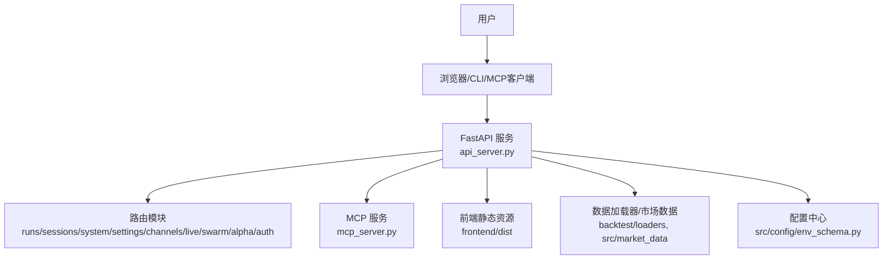
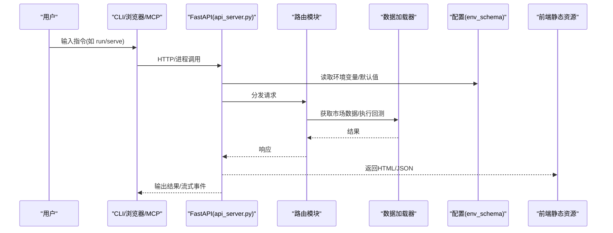
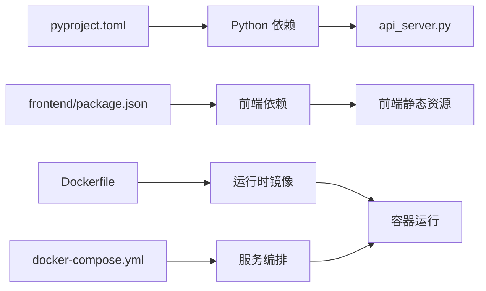

# 快速开始指南

<cite>
**本文引用的文件**
- [README_zh.md](file://README_zh.md)
- [pyproject.toml](file://pyproject.toml)
- [Dockerfile](file://Dockerfile)
- [docker-compose.yml](file://docker-compose.yml)
- [api_server.py](file://agent/api_server.py)
- [mcp_server.py](file://agent/mcp_server.py)
- [cli/main.py](file://agent/cli/main.py)
- [frontend/package.json](file://frontend/package.json)
- [env_schema.py](file://agent/src/config/env_schema.py)
</cite>

## 目录
1. [简介](#简介)
2. [项目结构](#项目结构)
3. [核心组件](#核心组件)
4. [架构总览](#架构总览)
5. [详细组件分析](#详细组件分析)
6. [依赖分析](#依赖分析)
7. [性能注意事项](#性能注意事项)
8. [故障排除指南](#故障排除指南)
9. [结论](#结论)
10. [附录](#附录)

## 简介
本指南面向首次接触 Vibe-Trading 的用户，目标是在 30 分钟内完成环境准备、安装配置、启动服务，并运行第一个 AI 研究任务与简单回测。你将学到：
- 本地安装与开发环境搭建
- Docker 容器化部署
- 环境变量与关键配置项
- 通过 CLI、Web UI、MCP 三种方式体验核心功能
- 常见问题的定位与解决

Vibe-Trading 是一个自然语言驱动的金融研究智能体，支持多数据源、回测、因子分析、策略生成与多代理协作等能力。

## 项目结构
仓库采用前后端分离与模块化设计：
- 后端（Python/FastAPI）：提供 REST API、CLI、MCP 工具服务
- 前端（React/Vite）：Web UI，构建产物由后端静态托管
- 配置与环境：集中式环境变量 schema，统一读取与校验
- 容器化：Dockerfile 与 docker-compose 一键拉起服务

图示来源
- [api_server.py:163-183](file://agent/api_server.py#L163-L183)
- [mcp_server.py:69-81](file://agent/mcp_server.py#L69-L81)
- [env_schema.py:1-18](file://agent/src/config/env_schema.py#L1-L18)

章节来源
- [pyproject.toml:77-87](file://pyproject.toml#L77-L87)
- [frontend/package.json:1-16](file://frontend/package.json#L1-L16)
- [Dockerfile:1-108](file://Dockerfile#L1-L108)
- [docker-compose.yml:1-90](file://docker-compose.yml#L1-L90)

## 核心组件
- CLI 入口与交互界面：提供交互式 TUI、单任务运行、服务启动、Alpha 库浏览等命令
- API 服务：基于 FastAPI，挂载安全中间件、CORS、SPA 静态资源与各类业务路由
- MCP 服务：暴露研究工具集，支持 stdio/SSE/HTTP 传输，默认仅本地可达
- 配置系统：集中式 Pydantic 模型管理所有环境变量，带类型校验与默认值
- 前端：React + Vite，构建后由后端在 / 路径下以 SPA 模式提供

章节来源
- [cli/main.py:1-18](file://agent/cli/main.py#L1-L18)
- [api_server.py:163-183](file://agent/api_server.py#L163-L183)
- [mcp_server.py:1-50](file://agent/mcp_server.py#L1-L50)
- [env_schema.py:1-18](file://agent/src/config/env_schema.py#L1-L18)

## 架构总览
下图展示了从用户到后端各层的关键交互：

图示来源
- [api_server.py:163-183](file://agent/api_server.py#L163-L183)
- [env_schema.py:1-18](file://agent/src/config/env_schema.py#L1-L18)

## 详细组件分析

### 安装与环境准备
- Python 版本要求：>=3.11，<3.14
- Node.js 版本要求：>=22（用于前端开发与构建）
- Docker：可选，用于容器化部署
- 推荐模型：根据 README_zh 的“推荐模型”表格选择合适模型；默认示例使用 DeepSeek 官方 API

步骤概览
- 克隆仓库
- 创建虚拟环境并安装依赖
- 复制并编辑 .env 配置文件
- 安装前端依赖（如需本地开发）
- 启动服务或容器

章节来源
- [pyproject.toml:1-23](file://pyproject.toml#L1-L23)
- [frontend/package.json:1-16](file://frontend/package.json#L1-L16)
- [README_zh.md:740-750](file://README_zh.md#L740-L750)

### 本地安装与开发环境
- 安装 Python 依赖：使用 pyproject 定义的脚本入口
- 安装前端依赖：进入 frontend 目录，执行构建或开发模式
- 启动 API 服务：可通过 CLI 子命令或直接运行 api_server
- 启动前端开发服务器：vite dev，默认端口可配置

注意
- 若未找到前端构建产物，后端会提示先构建前端
- 开发模式下可自动拉起 Vite 开发服务器

章节来源
- [pyproject.toml:77-87](file://pyproject.toml#L77-L87)
- [api_server.py:321-395](file://agent/api_server.py#L321-L395)
- [frontend/package.json:9-16](file://frontend/package.json#L9-L16)

### Docker 容器化部署
- 镜像构建：Dockerfile 分阶段构建前端与 Python 运行时
- Compose 编排：暴露 8899 端口，挂载持久卷，设置 Ollama 地址等
- 健康检查：/live 探针
- 安全加固：只读根文件系统、限制能力、资源上限

常用操作
- 构建并启动：docker compose up --build
- 访问 Web UI：http://localhost:8899
- 停止服务：docker compose down

章节来源
- [Dockerfile:1-108](file://Dockerfile#L1-L108)
- [docker-compose.yml:1-90](file://docker-compose.yml#L1-L90)

### 环境变量与关键配置
集中式配置位于 env_schema.py，涵盖 LLM、数据源、API、Swarm、OCR、Memory 等类别。常用变量包括：
- LLM：LANGCHAIN_PROVIDER、LANGCHAIN_MODEL_NAME、TIMEOUT_SECONDS、MAX_RETRIES、OPENAI_CODEX_BASE_URL 等
- 数据源：TUSHARE_TOKEN、CCXT_EXCHANGE、FINNHUB_API_KEY、ALPHAVANTAGE_API_KEY、TIINGO_API_KEY、FMP_API_KEY、QVERIS_API_KEY、QVERIS_BASE_URL 等
- API 与安全：API_AUTH_KEY、VIBE_TRADING_ENABLE_SHELL_TOOLS、VIBE_TRADING_ALLOWED_FILE_ROOTS、VIBE_TRADING_ALLOWED_RUN_ROOTS、VIBE_TW_STOCK_DB、VIBE_TRADING_EXTRA_CORS_ORIGINS
- 缓存：VIBE_TRADING_DATA_CACHE、VIBE_TRADING_DATA_CACHE_ROOT

说明
- 布尔型变量支持多种字符串真值
- 数值型变量对非法值进行安全降级
- 运行时可通过 Settings API 写入 .env 并刷新配置

章节来源
- [env_schema.py:1-18](file://agent/src/config/env_schema.py#L1-L18)
- [env_schema.py:122-197](file://agent/src/config/env_schema.py#L122-L197)
- [README_zh.md:720-739](file://README_zh.md#L720-L739)

### 启动服务与基本使用
- CLI 交互：vibe-trading 进入 TUI，支持 slash 命令
- 单任务运行：vibe-trading run -p "你的研究问题"
- 启动 API：vibe-trading serve
- 启动 MCP：python mcp_server.py（stdio/sse/http）

示例流程
- 启动服务后，打开 http://localhost:8899 访问 Web UI
- 在聊天框输入研究问题，智能体会调用工具、拉取数据、执行回测并输出结果
- 也可通过 CLI 直接运行单任务

章节来源
- [README_zh.md:754-826](file://README_zh.md#L754-L826)
- [cli/main.py:1-18](file://agent/cli/main.py#L1-L18)
- [mcp_server.py:1-50](file://agent/mcp_server.py#L1-L50)

### 运行第一个 AI 研究任务
- 在 CLI 中执行：vibe-trading run -p "Backtest BTC-USDT MACD strategy, last 30 days"
- 或在 Web UI 中输入相同意图
- 智能体会自动选择数据源、生成信号、执行回测并输出指标与图表

章节来源
- [README_zh.md:804-826](file://README_zh.md#L804-L826)

### 执行简单的回测分析
- 使用内置 Alpha 库进行基准测试：vibe-trading alpha bench --zoo gtja191 --universe csi300 --period 2018-2025 --top 20
- 对比多个 Alpha：vibe-trading alpha compare <id1> <id2> ... --sort ir
- 查看 Alpha 列表与详情：vibe-trading alpha list/show

章节来源
- [README_zh.md:804-826](file://README_zh.md#L804-L826)

### 通过 MCP 集成外部工具
- 启动 MCP 服务：python mcp_server.py
- 支持 stdio、SSE、HTTP 传输；HTTP 为当前默认
- 暴露研究工具集，供 Claude Desktop、Cursor、OpenClaw 等客户端调用

章节来源
- [mcp_server.py:1-50](file://agent/mcp_server.py#L1-L50)

## 依赖分析
- Python 依赖：由 pyproject 统一管理，包含 FastAPI、LangChain、Pandas、Numpy、yfinance、akshare、ccxt 等
- 前端依赖：React、Vite、Tailwind、ECharts 等
- 可选依赖：ibkr、longbridge、mt5、deepseek、anthropic、openbb、krx、stats、ashare、harmonic、channels 等
- 容器依赖：Node 22、Python 3.11-slim，预编译 venv 拷贝至运行时镜像

图示来源
- [pyproject.toml:24-69](file://pyproject.toml#L24-L69)
- [frontend/package.json:17-55](file://frontend/package.json#L17-L55)
- [Dockerfile:17-86](file://Dockerfile#L17-L86)
- [docker-compose.yml:1-66](file://docker-compose.yml#L1-L66)

章节来源
- [pyproject.toml:105-230](file://pyproject.toml#L105-L230)
- [Dockerfile:17-86](file://Dockerfile#L17-L86)
- [docker-compose.yml:68-90](file://docker-compose.yml#L68-L90)

## 性能注意事项
- 数据缓存：启用 VIBE_TRADING_DATA_CACHE 可减少重复网络请求，提升回测速度
- 资源限制：Compose 中设置了内存、CPU、PID 限制，避免单个任务占用过多资源
- 并行与批处理：部分数据加载器支持批量下载与重试，合理设置超时与预算参数
- 前端渲染：按需加载图表数据，避免首屏过大负载

[本节为通用指导，不直接分析具体文件]

## 故障排除指南
常见问题与排查要点
- 无法连接 LLM：检查 LANGCHAIN_PROVIDER、MODEL、API_KEY、BASE_URL 是否正确；使用 provider doctor 诊断
- 数据源不可用：确认对应 API Key 或免费源是否可用；必要时切换备选数据源
- 前端页面空白：确保已构建前端产物或处于开发模式；检查后端是否挂载了 dist
- Docker 启动失败：检查端口占用、卷权限、Ollama 地址映射；查看健康检查日志
- 远程访问被拒：设置 API_AUTH_KEY 或使用 localhost；或通过 VITE_API_URL 调整前端代理

建议步骤
- 使用 CLI 的 provider doctor 打印脱敏的诊断信息
- 检查 .env 中的关键变量是否生效
- 查看 API 日志与容器日志定位错误堆栈
- 逐步禁用可选依赖，缩小问题范围

章节来源
- [README_zh.md:720-739](file://README_zh.md#L720-L739)
- [api_server.py:321-395](file://agent/api_server.py#L321-L395)
- [docker-compose.yml:1-66](file://docker-compose.yml#L1-L66)

## 结论
通过本指南，你应能在 30 分钟内完成 Vibe-Trading 的安装与基础使用，体验 AI 驱动的研究与回测能力。后续可根据需求扩展数据源、接入更多模型、启用定时研究与多代理协作。

[本节为总结，不直接分析具体文件]

## 附录
- 推荐模型与默认配置：参考 README_zh 的“推荐模型”段落
- CLI 命令速查：run、serve、alpha list/bench/compare、playbook list、channels status、provider doctor
- 环境变量清单：见 env_schema.py 的分类字段与 README_zh 的环境变量表

章节来源
- [README_zh.md:720-826](file://README_zh.md#L720-L826)
- [env_schema.py:122-197](file://agent/src/config/env_schema.py#L122-L197)