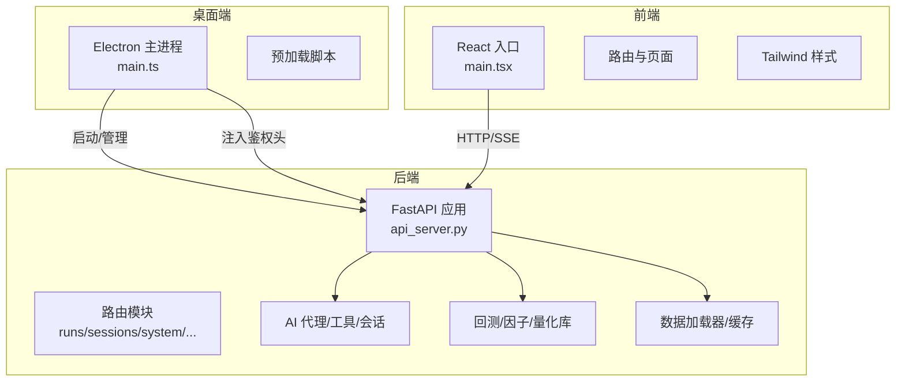
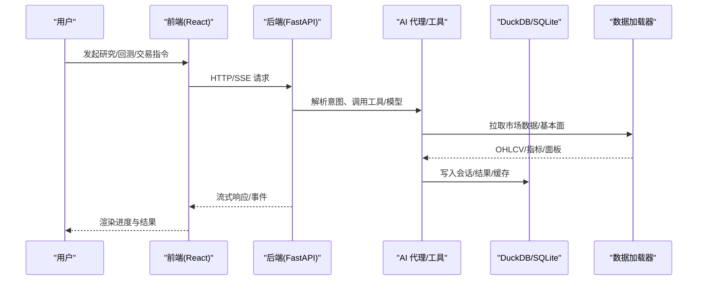
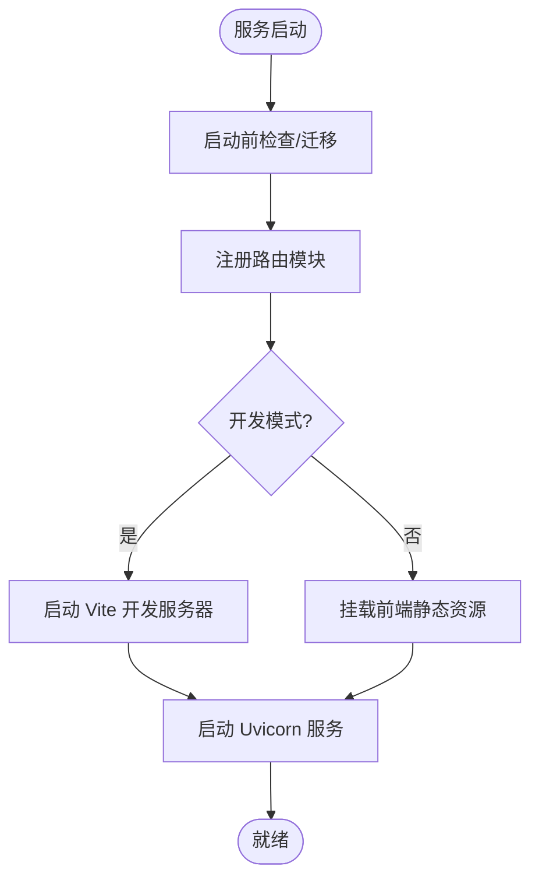
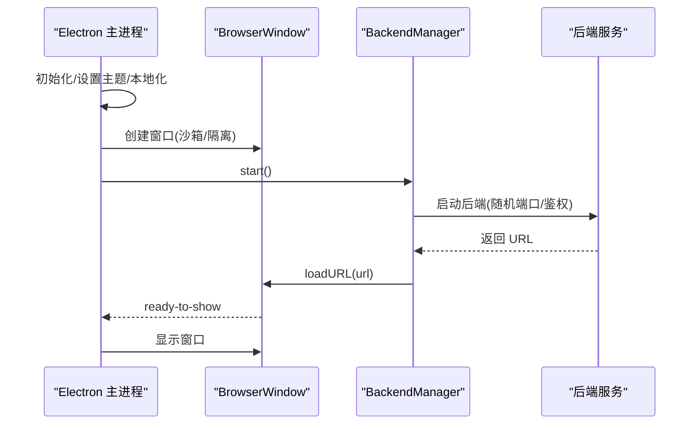
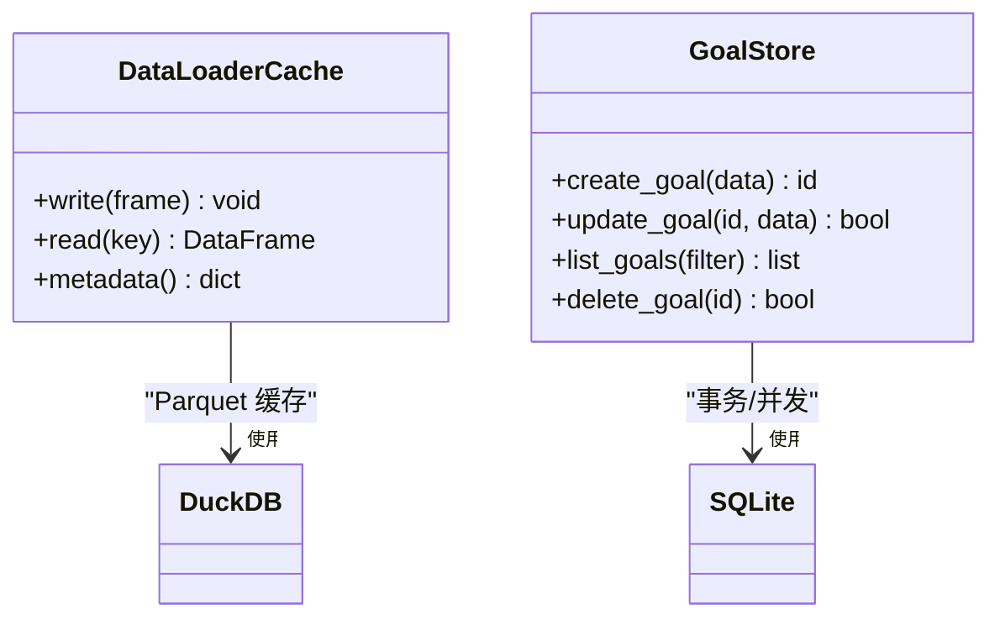

# 技术栈概览

<cite>
**本文引用的文件**
- [pyproject.toml](file://pyproject.toml)
- [requirements.txt](file://agent/requirements.txt)
- [api_server.py](file://agent/api_server.py)
- [main.tsx](file://frontend/src/main.tsx)
- [package.json（前端）](file://frontend/package.json)
- [package.json（Electron）](file://desktop/electron/package.json)
- [main.ts（Electron）](file://desktop/electron/src/main.ts)
- [base.py（数据加载缓存）](file://agent/backtest/loaders/base.py)
- [store.py（目标存储）](file://agent/src/goal/store.py)
</cite>

## 目录
1. [简介](#简介)
2. [项目结构](#项目结构)
3. [核心组件](#核心组件)
4. [架构总览](#架构总览)
5. [详细组件分析](#详细组件分析)
6. [依赖关系分析](#依赖关系分析)
7. [性能考量](#性能考量)
8. [故障排查指南](#故障排查指南)
9. [结论](#结论)
10. [附录](#附录)

## 简介
本技术栈概览面向 Vibe-Trading 项目的工程与研发读者，系统梳理后端、前端、桌面端的技术选型与职责边界，解释关键依赖库的作用与选型原因，并给出前后端分离与微服务化设计的整体视图。项目采用：
- 后端：Python + FastAPI，提供 REST/SSE/MCP 等接口，承载 AI 代理、回测、因子计算、会话与策略编排等能力
- 前端：React + TypeScript + Tailwind CSS，构建 Web UI，通过 API 与后端交互
- 桌面应用：Electron 封装本地运行时，内嵌后端进程并提供安全凭证管理、多语言与生命周期控制

开发环境要求：
- Python 3.11+（兼容 3.11/3.12/3.13，上限 <3.14）
- Node.js >=22（前端要求），Electron 用于桌面打包与运行

版本兼容性说明详见“依赖关系分析”章节。

## 项目结构
仓库采用多模块组织：
- agent：后端核心，包含 FastAPI 入口、AI 代理、回测引擎、数据加载器、通道集成、量化库等
- frontend：Web 前端，基于 React + TypeScript + Tailwind，使用 Vite 构建
- desktop/electron：桌面壳层，负责启动/管理后端进程、渲染界面、安全凭证与本地化
- 其他：测试、文档站点、脚本与配置

图表来源
- [api_server.py:163-183](file://agent/api_server.py#L163-L183)
- [main.tsx:1-36](file://frontend/src/main.tsx#L1-L36)
- [main.ts（Electron）:49-192](file://desktop/electron/src/main.ts#L49-L192)

章节来源
- [api_server.py:163-183](file://agent/api_server.py#L163-L183)
- [package.json（前端）:1-58](file://frontend/package.json#L1-L58)
- [package.json（Electron）:1-86](file://desktop/electron/package.json#L1-L86)

## 核心组件
- 后端服务（FastAPI）
  - 统一入口与中间件：CORS、安全头、SPA 深度链接回退、访问日志脱敏
  - 模块化路由：Runs、Sessions、System、Settings、Uploads、Channels、Swarm、Live、Alpha Zoo、Auth、Scheduled Research 等
  - 生命周期：启动前检查、迁移、定时研究执行、通道运行时启停
- 前端（React + TS + Tailwind）
  - 应用根节点、错误边界、路由、国际化、图表与 Markdown 渲染
  - 通过 HTTP/SSE 与后端交互，支持流式进度与实时状态
- 桌面端（Electron）
  - 主进程创建窗口、注入安全请求头、管理后端进程生命周期
  - 安全凭证存储、多语言、菜单与日志打开、异常上报

章节来源
- [api_server.py:127-183](file://agent/api_server.py#L127-L183)
- [api_server.py:321-395](file://agent/api_server.py#L321-L395)
- [main.tsx:1-36](file://frontend/src/main.tsx#L1-L36)
- [main.ts（Electron）:49-192](file://desktop/electron/src/main.ts#L49-L192)

## 架构总览
Vibe-Trading 采用前后端分离与可插拔的微服务化设计：
- 前端作为展示与交互层，不直接访问外部数据源或模型
- 后端以 FastAPI 为中心，聚合 AI 代理、回测、因子、数据加载、通道、调度等能力
- 桌面端作为宿主，负责安全地启动后端、注入凭据、隔离权限与资源
- 数据层通过 DuckDB/SQLite 进行高性能分析与持久化；消息队列与通道通过异步框架与第三方 SDK 接入

图表来源
- [api_server.py:163-183](file://agent/api_server.py#L163-L183)
- [base.py（数据加载缓存）:517-571](file://agent/backtest/loaders/base.py#L517-L571)
- [store.py（目标存储）:1-60](file://agent/src/goal/store.py#L1-L60)

## 详细组件分析

### 后端（FastAPI）
- 应用装配
  - 创建 FastAPI 实例，注册 CORS、安全头、SPA 回退中间件
  - 按功能拆分路由模块，集中挂载到 app
  - 生命周期钩子：启动前检查、迁移、定时任务与通道运行时初始化
- 开发模式
  - 自动启动 Vite 开发服务器，便于联调
  - 生产模式静态托管前端构建产物
- 安全与认证
  - 支持 API Key、SSE Ticket、同源/环回校验、跨站防护
  - 访问日志中敏感参数脱敏

图表来源
- [api_server.py:127-183](file://agent/api_server.py#L127-L183)
- [api_server.py:321-395](file://agent/api_server.py#L321-L395)

章节来源
- [api_server.py:127-183](file://agent/api_server.py#L127-L183)
- [api_server.py:321-395](file://agent/api_server.py#L321-L395)

### 前端（React + TypeScript + Tailwind）
- 应用入口
  - 初始化国际化、错误边界、路由、通知与主题样式
  - 空闲时预取图表组件以提升首屏体验
- 构建与测试
  - 使用 Vite 构建，TypeScript 编译，Vitest 单元测试
  - Tailwind 样式与排版插件增强 UI 一致性

章节来源
- [main.tsx:1-36](file://frontend/src/main.tsx#L1-L36)
- [package.json（前端）:1-58](file://frontend/package.json#L1-L58)

### 桌面端（Electron）
- 主进程职责
  - 创建 BrowserWindow，启用沙箱与上下文隔离
  - 为本地后端请求注入 Bearer 鉴权头，限制导航与外链
  - 管理后端进程生命周期（启动、重启、关闭）
  - 提供菜单、日志路径、错误弹窗与多语言
- 安全凭证
  - 使用安全存储读写凭据，避免明文泄露
  - 仅允许受信任的本地后端地址通信

图表来源
- [main.ts（Electron）:49-192](file://desktop/electron/src/main.ts#L49-L192)

章节来源
- [main.ts（Electron）:49-192](file://desktop/electron/src/main.ts#L49-L192)
- [package.json（Electron）:1-86](file://desktop/electron/package.json#L1-L86)

### 数据处理与存储
- 数据处理
  - 使用 Pandas/NumPy 进行面板数据计算、因子运算与指标处理
  - 使用 SciPy/Scikit-learn 进行统计与机器学习相关计算
- 数据存储
  - DuckDB：用于数据加载器缓存与高效列存分析（Parquet 格式）
  - SQLite：用于研究目标、会话元数据等结构化持久化

图表来源
- [base.py（数据加载缓存）:517-571](file://agent/backtest/loaders/base.py#L517-L571)
- [store.py（目标存储）:1-60](file://agent/src/goal/store.py#L1-L60)

章节来源
- [base.py（数据加载缓存）:517-571](file://agent/backtest/loaders/base.py#L517-L571)
- [store.py（目标存储）:1-60](file://agent/src/goal/store.py#L1-L60)

### AI 代理与模型集成
- LangChain/LangGraph：构建 Agent Loop、工具绑定、记忆与会话上下文
- 多 LLM 提供商适配：OpenAI、DeepSeek、Anthropic、Google Gemini 等，具备流式推理、重试与能力探测
- 工具生态：市场数据、研报阅读、搜索、量化计算、订单执行（受约束）等

章节来源
- [pyproject.toml:24-69](file://pyproject.toml#L24-L69)

## 依赖关系分析
- Python 后端
  - 核心框架：FastAPI、Uvicorn、Pydantic、httpx、websockets、sse-starlette
  - AI 与图：LangChain、LangGraph、各 Provider SDK（可选 extras）
  - 数据科学：Pandas、NumPy、SciPy、scikit-learn、bottleneck
  - 存储与分析：DuckDB、SQLite（标准库）、openpyxl/python-docx/pypdfium2/Pillow
  - 数据源：yfinance、akshare、ccxt、tushare、finnhub、fmp、tiingo、eastmoney、stooq、okx、binance、futu、longbridge、mt5（Windows）
  - 可视化与报告：matplotlib、weasyprint、jinja2
  - CLI 与交互：rich、prompt_toolkit、python-dotenv
- 前端
  - React 19、TypeScript、Vite、Tailwind、i18next、ECharts、Zustand、Sonner、React Router
  - 测试：Vitest、jsdom、Testing Library
- 桌面端
  - Electron 43、electron-builder、TypeScript
  - 构建脚本与资源打包

版本兼容性
- Python：>=3.11,<3.14（受限于部分依赖如 llvmlite 的 wheel 支持）
- Node.js：>=22（前端 engines 字段限定）
- Electron：43.x（社区构建）

章节来源
- [pyproject.toml:1-272](file://pyproject.toml#L1-L272)
- [package.json（前端）:1-58](file://frontend/package.json#L1-L58)
- [package.json（Electron）:1-86](file://desktop/electron/package.json#L1-L86)

## 性能考量
- 数据缓存与并行
  - 数据加载器缓存使用 DuckDB 内存连接生成 Parquet，原子替换提升并发安全
  - 批量下载与连接复用减少网络与连接开销
- 计算加速
  - 使用 bottleneck/NumPy 向量化优化滚动因子与时间序列计算
  - 因子计算与回测流程支持并行与分页输出，避免大对象阻塞
- I/O 与流式
  - SSE 流式传输提高交互体验，前端按需懒加载图表与详情
  - 日志与访问记录对敏感字段脱敏，降低 IO 压力与安全风险

[本节为通用指导，不直接分析具体文件]

## 故障排查指南
- 启动失败
  - 检查 Python/Node 版本是否符合要求
  - 确认环境变量（API_KEY、LLM_BASE_URL、数据源密钥）已正确配置
  - 查看后端启动日志与前端构建输出
- 前端无法连接后端
  - 确认后端监听地址与端口，开发模式下 Vite 是否启动成功
  - 桌面端需确保本地后端已启动且注入的鉴权头有效
- 数据加载失败
  - 检查数据源限流与网络代理设置
  - 查看缓存目录是否可写，必要时清理缓存重试
- 会话/目标存储异常
  - 检查 SQLite 文件权限与磁盘空间
  - 查看会话目录与日志定位错误堆栈

章节来源
- [api_server.py:127-183](file://agent/api_server.py#L127-L183)
- [base.py（数据加载缓存）:517-571](file://agent/backtest/loaders/base.py#L517-L571)
- [store.py（目标存储）:1-60](file://agent/src/goal/store.py#L1-L60)

## 结论
Vibe-Trading 以 FastAPI 为核心，结合 LangChain 的 AI 代理能力，构建了覆盖数据获取、因子计算、回测与交易的完整研究闭环。前端以 React + TypeScript + Tailwind 提供现代化交互体验，Electron 则封装本地运行时，保障安全与易用性。通过 DuckDB/SQLite 的高性能存储与缓存机制，以及丰富的数据源与通道集成，项目在可扩展性与稳定性方面具备良好基础。建议在生产环境中严格遵循版本约束与安全配置，并结合监控与日志完善运维体系。

[本节为总结性内容，不直接分析具体文件]

## 附录
- 快速开始
  - 安装 Python 3.11+ 与 Node.js >=22
  - 后端：进入 agent 目录，安装依赖并启动服务
  - 前端：进入 frontend 目录，安装依赖并运行开发服务器
  - 桌面端：进入 desktop/electron 目录，构建并运行
- 扩展与可选依赖
  - 根据需求安装 broker 连接器、渠道适配器与统计工具集 extras
  - 参考 pyproject.toml 中的 optional-dependencies 配置

[本节为补充信息，不直接分析具体文件]