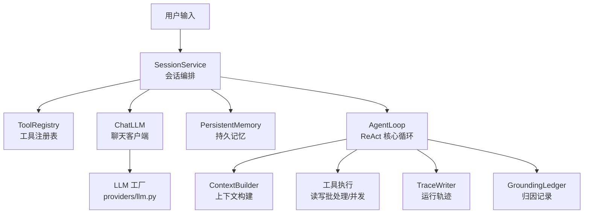
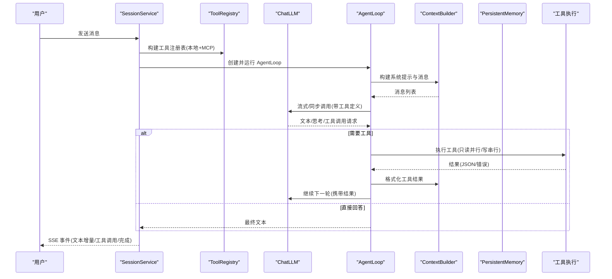
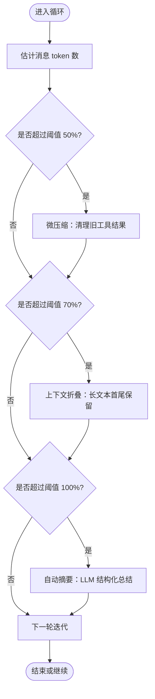
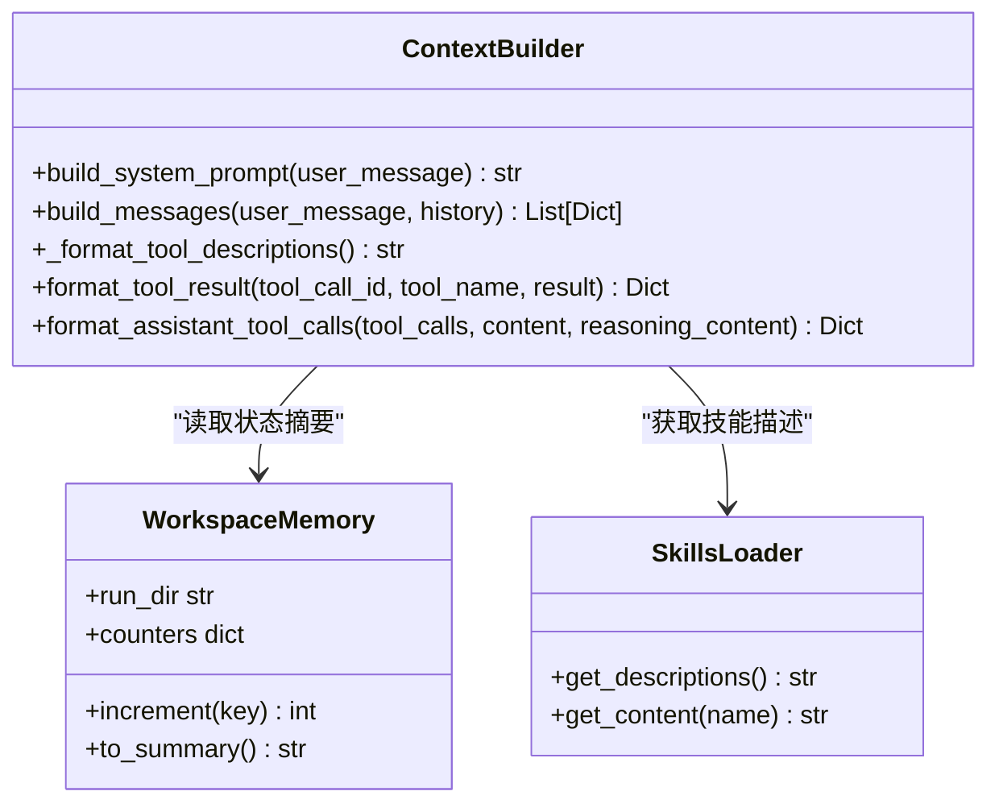
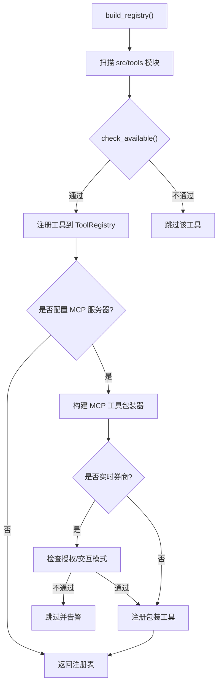
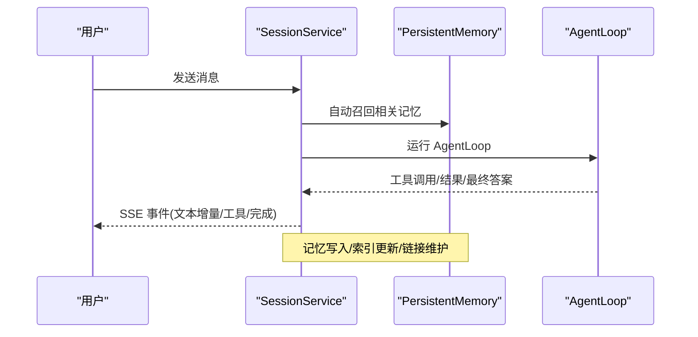
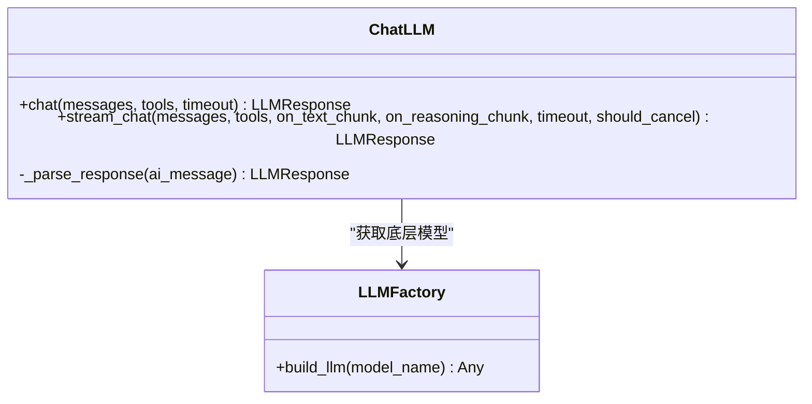
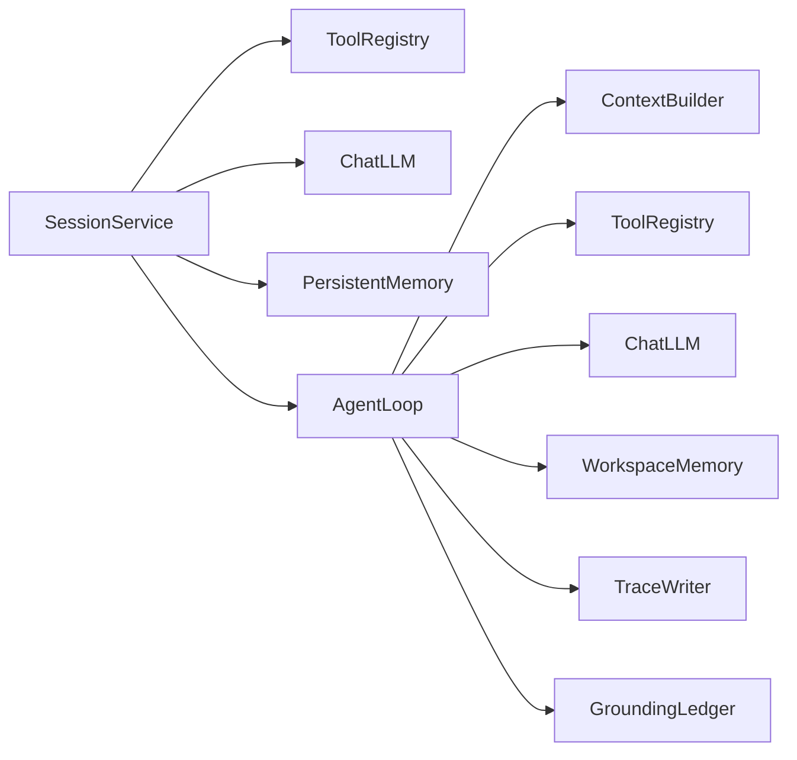

# AI代理系统

<cite>
**本文引用的文件**
- [loop.py](file://agent/src/agent/loop.py)
- [context.py](file://agent/src/agent/context.py)
- [memory.py](file://agent/src/agent/memory.py)
- [tools.py](file://agent/src/agent/tools.py)
- [chat.py](file://agent/src/providers/chat.py)
- [llm.py](file://agent/src/providers/llm.py)
- [persistent.py](file://agent/src/memory/persistent.py)
- [skills.py](file://agent/src/agent/skills.py)
- [service.py](file://agent/src/session/service.py)
- [__init__.py](file://agent/src/tools/__init__.py)
- [path_utils.py](file://agent/src/tools/path_utils.py)
- [web_reader_tool.py](file://agent/src/tools/web_reader_tool.py)
- [edit_file_tool.py](file://agent/src/tools/edit_file_tool.py)
- [bash_tool.py](file://agent/src/tools/bash_tool.py)
- [remember_tool.py](file://agent/src/tools/remember_tool.py)
- [goal_tool.py](file://agent/src/tools/goal_tool.py)
</cite>

## 更新摘要
**变更内容**
- 增强了上下文构建器的工具描述生成功能，提供更清晰的工具安全上下文
- 改进了工具参数描述的格式化和安全提示
- 更新了路径安全验证和沙箱机制的文档说明
- 完善了工具调用流程中的安全控制说明

## 目录
1. [简介](#简介)
2. [项目结构](#项目结构)
3. [核心组件](#核心组件)
4. [架构总览](#架构总览)
5. [详细组件分析](#详细组件分析)
6. [依赖关系分析](#依赖关系分析)
7. [性能考量](#性能考量)
8. [故障排除指南](#故障排除指南)
9. [结论](#结论)
10. [附录：使用示例与最佳实践](#附录使用示例与最佳实践)

## 简介
本文件为 Vibe-Trading 的 AI 代理系统提供系统化、可操作的技术文档。重点覆盖以下能力与机制：
- 基于自然语言的智能研究与策略开发（含回测验证）
- Agent 核心循环（ReAct）与上下文管理
- 工具注册与发现、工具调用流程与安全控制
- 会话状态管理与持久化记忆
- 与 LLM 提供商的集成方式、流式推理与重试
- 性能优化策略、故障排查与最佳实践

该系统通过"五层上下文压缩"、"并行只读工具执行"、"结构化摘要更新"、"跨会话持久记忆"和"安全沙箱化的工具白名单"，在长对话与复杂金融任务中保持稳定、可控与可追溯。

## 项目结构
围绕 AgentLoop 的核心代码位于 agent/src/agent，配合 providers、session、memory、tools 等模块构成完整闭环：
- agent/src/agent：AgentLoop、ContextBuilder、SkillsLoader、WorkspaceMemory、工具基类与注册表
- agent/src/providers：ChatLLM、LLM 工厂与多提供商适配
- agent/src/session：会话生命周期编排、SSE 事件总线、消息历史与尝试（Attempt）管理
- agent/src/memory：跨会话持久化记忆（文件索引、语义链接、FTS 搜索）
- agent/src/tools：自动发现与构建工具注册表，支持 MCP 远程工具注入与安全过滤

**图表来源**
- [service.py:158-440](file://agent/src/session/service.py#L158-L440)
- [loop.py:502-750](file://agent/src/agent/loop.py#L502-L750)
- [context.py:210-322](file://agent/src/agent/context.py#L210-L322)
- [tools.py:54-95](file://agent/src/agent/tools.py#L54-L95)
- [chat.py:272-397](file://agent/src/providers/chat.py#L272-L397)
- [llm.py:89-423](file://agent/src/providers/llm.py#L89-L423)

**章节来源**
- [service.py:158-440](file://agent/src/session/service.py#L158-L440)
- [loop.py:502-750](file://agent/src/agent/loop.py#L502-L750)
- [context.py:210-322](file://agent/src/agent/context.py#L210-L322)
- [tools.py:54-95](file://agent/src/agent/tools.py#L54-L95)
- [chat.py:272-397](file://agent/src/providers/chat.py#L272-L397)
- [llm.py:89-423](file://agent/src/providers/llm.py#L89-L423)

## 核心组件
- AgentLoop：实现 ReAct 主循环，负责消息迭代、上下文压缩、工具调度、追踪与终止条件。
- ContextBuilder：组装系统提示词、技能描述、工具描述、工作区状态与持久记忆快照，生成 OpenAI 格式消息列表。
- ToolRegistry + BaseTool：统一工具抽象、自动发现、参数校验、执行封装与错误返回。
- ChatLLM：对 LangChain 的封装，支持函数调用、流式输出、DSML 解析、内容过滤与 Provider 错误包装。
- PersistentMemory：跨会话的文件级记忆存储，支持重要性衰减、去重、FTS 检索与语义链接。
- SessionService：会话生命周期管理、并发限制、SSE 事件广播、消息历史与指标加载。

**章节来源**
- [loop.py:502-750](file://agent/src/agent/loop.py#L502-L750)
- [context.py:210-322](file://agent/src/agent/context.py#L210-L322)
- [tools.py:13-95](file://agent/src/agent/tools.py#L13-L95)
- [chat.py:272-397](file://agent/src/providers/chat.py#L272-397)
- [persistent.py:196-438](file://agent/src/memory/persistent.py#L196-L438)
- [service.py:158-440](file://agent/src/session/service.py#L158-L440)

## 架构总览
下图展示从用户输入到最终输出的端到端流程，包括 ReAct 循环、上下文构建、工具执行、记忆存取与 SSE 事件推送。

**图表来源**
- [service.py:158-440](file://agent/src/session/service.py#L158-L440)
- [loop.py:624-800](file://agent/src/agent/loop.py#L624-L800)
- [context.py:286-322](file://agent/src/agent/context.py#L286-L322)
- [chat.py:299-397](file://agent/src/providers/chat.py#L299-L397)
- [tools.py:66-245](file://agent/src/tools/__init__.py#L66-L245)

## 详细组件分析

### AgentLoop（ReAct 核心循环）
- 五层上下文管理：
  - 微压缩：仅清理旧工具结果，保留最近 N 条
  - 上下文折叠：对长文本进行首尾保留、中间折叠（零 API 成本）
  - 自动摘要：超过阈值时触发 LLM 结构化摘要，带尾部预算保护
  - 显式压缩工具：模型主动调用 compact 工具触发摘要
  - 迭代更新：第 N 次压缩更新前一次摘要而非从头开始
- 工具执行：
  - 连续只读工具并行执行（线程池），写操作串行
  - 超时、取消、重试、内容过滤熔断
- 追踪与归因：
  - TraceWriter 写入 trace.jsonl
  - GroundingLedger 记录数据来源与引用
  - run_manifest.json 记录系统提示哈希、工具集、包版本

**图表来源**
- [loop.py:227-322](file://agent/src/agent/loop.py#L227-L322)
- [loop.py:727-749](file://agent/src/agent/loop.py#L727-L749)

**章节来源**
- [loop.py:227-322](file://agent/src/agent/loop.py#L227-L322)
- [loop.py:502-750](file://agent/src/agent/loop.py#L502-L750)

### 上下文管理（ContextBuilder）
- 系统提示词模板包含：
  - 输出原则（数据溯源、as-of 标注、证据优先、分析非建议、深度匹配、拒绝越界）
  - 工具与技能描述（动态注入）
  - 工作区状态摘要（run_dir、计数器）
  - 持久记忆快照（可选）
- 自动召回：根据用户消息检索相关记忆片段并注入
- 工具结果与助手消息格式化：兼容 provider 差异（reasoning_content、tool_calls、extra_content）

**更新** 改进了工具描述生成逻辑，现在包含更详细的参数说明和安全上下文信息，帮助 AI 代理更好地理解工具的使用限制和安全边界。

**图表来源**
- [context.py:210-322](file://agent/src/agent/context.py#L210-L322)
- [memory.py:13-54](file://agent/src/agent/memory.py#L13-L54)
- [skills.py:100-189](file://agent/src/agent/skills.py#L100-L189)

**章节来源**
- [context.py:210-322](file://agent/src/agent/context.py#L210-L322)
- [memory.py:13-54](file://agent/src/agent/memory.py#L13-L54)
- [skills.py:100-189](file://agent/src/agent/skills.py#L100-L189)

### 工具注册与发现（ToolRegistry + build_registry）
- 自动发现：扫描 src/tools 下所有模块，收集 BaseTool 子类并注册
- 安全策略：
  - shell 工具默认禁用，需显式开启
  - check_available 用于依赖检查（如 API Key、包缺失）
  - 会话注入：目标工具（如 goal、autopilot）注入 session_id 与事件回调
- MCP 集成：
  - 按配置追加远程工具，失败隔离不影响本地工具
  - 实时券商通道受 mandate/kill switch 保护，未授权跳过

**更新** 增强了工具描述的安全上下文，现在在工具描述中包含更明确的安全限制和使用约束，帮助 AI 代理做出更安全的选择。

**图表来源**
- [__init__.py:33-245](file://agent/src/tools/__init__.py#L33-L245)
- [tools.py:54-95](file://agent/src/agent/tools.py#L54-L95)

**章节来源**
- [__init__.py:33-245](file://agent/src/tools/__init__.py#L33-L245)
- [tools.py:54-95](file://agent/src/agent/tools.py#L54-L95)

### 会话状态管理与持久化存储（SessionService + PersistentMemory）
- 会话服务：
  - 并发限制：每会话一个 AgentLoop，防止消息交错
  - 事件总线：SSE 推送 message.received、attempt.started/completed/cancelled/failed
  - 指标加载：从 artifacts/metrics.csv 提取回测指标
- 持久记忆：
  - 文件索引 MEMORY.md，条目 .md 文件含 frontmatter
  - 重要性衰减（访问频率、时间）、去重窗口、FTS 搜索、语义链接扩展
  - 层级目录与压缩级别（raw/daily/digest）

**图表来源**
- [service.py:158-440](file://agent/src/session/service.py#L158-L440)
- [persistent.py:196-438](file://agent/src/memory/persistent.py#L196-L438)

**章节来源**
- [service.py:158-440](file://agent/src/session/service.py#L158-L440)
- [persistent.py:196-438](file://agent/src/memory/persistent.py#L196-L438)

### 与 LLM 提供商的集成（ChatLLM + llm.py）
- 统一接口：chat/stream_chat，支持函数调用、流式文本与推理内容
- 多提供商适配：
  - OpenAI 兼容、Anthropic、DeepSeek 原生/兼容路径
  - 自定义头部隔离、代理禁用、温度字段自适应
- 健壮性：
  - 无流响应降级为非流调用
  - ProviderStreamError 包装并提供可重试判断
  - DSML 工具调用解析（部分模型以文本形式返回）

**图表来源**
- [chat.py:272-397](file://agent/src/providers/chat.py#L272-397)
- [llm.py:89-423](file://agent/src/providers/llm.py#L89-L423)

**章节来源**
- [chat.py:272-397](file://agent/src/providers/chat.py#L272-397)
- [llm.py:89-423](file://agent/src/providers/llm.py#L89-L423)

### 工具安全与路径验证
**新增** 增强的工具安全机制确保 AI 代理只能在受控环境中执行操作：

- **路径安全验证**：
  - `safe_path()`：确保文件路径在工作区内
  - `resolve_safe_path()`：支持运行时目录和允许根目录的回退机制
  - `allowed_write_roots()`：配置可写入的目录白名单
  - `safe_run_dir()`：验证运行目录的合法性

- **网络请求安全**：
  - URL 白名单验证，阻止内网地址和私有 IP
  - 协议限制，仅允许 http/https
  - 敏感信息过滤，移除用户名密码

- **文件系统安全**：
  - UNC 路径阻止
  - 路径逃逸检测
  - 工作区边界保护

**章节来源**
- [path_utils.py:46-74](file://agent/src/tools/path_utils.py#L46-L74)
- [path_utils.py:185-240](file://agent/src/tools/path_utils.py#L185-L240)
- [web_reader_tool.py:24-58](file://agent/src/tools/web_reader_tool.py#L24-L58)
- [edit_file_tool.py:45-51](file://agent/src/tools/edit_file_tool.py#L45-L51)

## 依赖关系分析
- AgentLoop 依赖：
  - ContextBuilder（上下文构建）
  - ToolRegistry（工具执行）
  - ChatLLM（模型调用）
  - PersistentMemory（跨会话记忆）
  - TraceWriter/GroundingLedger（追踪与归因）
- SessionService 依赖：
  - ToolRegistry（构建工具集）
  - ChatLLM（模型实例）
  - PersistentMemory（记忆注入）
  - EventBus（SSE 事件）
- 工具注册表依赖：
  - BaseTool 子类（自动发现）
  - MCP 包装器（可选）
  - 安全策略（shell 工具、实时券商）

**图表来源**
- [service.py:346-440](file://agent/src/session/service.py#L346-L440)
- [loop.py:502-750](file://agent/src/agent/loop.py#L502-L750)
- [tools.py:54-95](file://agent/src/agent/tools.py#L54-L95)
- [context.py:210-322](file://agent/src/agent/context.py#L210-L322)

**章节来源**
- [service.py:346-440](file://agent/src/session/service.py#L346-L440)
- [loop.py:502-750](file://agent/src/agent/loop.py#L502-L750)
- [tools.py:54-95](file://agent/src/agent/tools.py#L54-L95)
- [context.py:210-322](file://agent/src/agent/context.py#L210-L322)

## 性能考量
- 上下文压缩分层：
  - 微压缩与上下文折叠避免不必要的 LLM 调用
  - 自动摘要带尾部预算，防止关键信息丢失
- 工具执行优化：
  - 只读工具并行执行，减少等待时间
  - 结果截断与分页，控制消息大小
- 流式输出与节流：
  - 推理内容节流，降低 UI 回放缓冲压力
  - 首次推理块立即发出，提升感知速度
- 资源限制：
  - 会话并发限制（每会话一个 AgentLoop）
  - 工具超时、重试与熔断（内容过滤）
- 记忆系统：
  - 重要性衰减与去重窗口，减少冗余写入
  - FTS 搜索与语义链接，加速召回

## 故障排除指南
- 工具不可用：
  - 检查 check_available 返回（依赖缺失、API Key 未配置）
  - 查看日志中的"工具不可用，跳过"
- 会话忙：
  - 同一会话不允许并发 send_message，先取消或等待完成
- 流式失败：
  - ProviderStreamError 提供 provider/model 信息与可重试判断
  - 无流响应自动降级为非流调用
- 内容过滤：
  - 连续过滤触发熔断，调整输入或模型设置
- 记忆写入失败：
  - 文件锁超时、权限问题，检查磁盘与路径
- MCP 连接失败：
  - 单个服务器失败不影响其他工具，查看警告日志
- **路径安全错误**：
  - 检查文件路径是否在允许的根目录下
  - 确认运行目录配置正确
  - 验证 UNC 路径不被接受

**章节来源**
- [__init__.py:136-154](file://agent/src/tools/__init__.py#L136-L154)
- [service.py:43-50](file://agent/src/session/service.py#L43-L50)
- [chat.py:117-163](file://agent/src/providers/chat.py#L117-L163)
- [persistent.py:42-73](file://agent/src/memory/persistent.py#L42-L73)
- [path_utils.py:238-240](file://agent/src/tools/path_utils.py#L238-L240)

## 结论
Vibe-Trading 的 AI 代理系统通过 ReAct 循环、分层上下文管理、安全工具注册与发现、跨会话持久记忆以及健壮的 LLM 集成，实现了高可用、可扩展且可追溯的智能研究与策略开发平台。其设计兼顾了性能、安全与可维护性，适合复杂的金融分析与自动化交易研究场景。

## 附录：使用示例与最佳实践

### 自然语言驱动的研究与策略开发
- 步骤概览：
  1. 描述需求（如"分析某股票近一年走势并生成均值回归策略"）
  2. Agent 自动识别任务类型，加载对应技能（如 strategy-generate）
  3. 生成策略代码与配置，执行回测
  4. 输出指标（收益率、夏普、最大回撤、交易次数）
  5. 进行归因分析（交易归因、Beta 回归、 regime 分析、蒙特卡洛检验）
- 关键工具：
  - backtest、write_file、read_file、factor_analysis、options_pricing、market_data
- 注意事项：
  - 每个数字必须指向具体工具调用
  - 标注数据截止时间与来源
  - 若工具失败，明确说明"未获取到"或"覆盖率截止于某日期"

**章节来源**
- [context.py:23-200](file://agent/src/agent/context.py#L23-L200)
- [loop.py:727-749](file://agent/src/agent/loop.py#L727-L749)

### 回测验证与报告
- 自动生成 artifacts/metrics.csv，SessionService 自动加载指标
- 支持多层归因分析，按策略健康度路由不同分析层
- 输出 Markdown 表格，便于渲染与分享

**章节来源**
- [service.py:567-581](file://agent/src/session/service.py#L567-L581)
- [context.py:82-129](file://agent/src/agent/context.py#L82-L129)

### 工具调用安全控制
- Shell 工具默认禁用，需显式启用
- 实时券商通道需授权，未授权跳过并告警
- 工具参数校验与结果截断，防止溢出与泄露
- **路径安全验证**：所有文件操作都经过严格的路径验证，确保不会访问工作区外的文件

**章节来源**
- [__init__.py:136-154](file://agent/src/tools/__init__.py#L136-L154)
- [__init__.py:174-244](file://agent/src/tools/__init__.py#L174-L244)
- [path_utils.py:46-74](file://agent/src/tools/path_utils.py#L46-L74)

### 性能优化建议
- 合理设置 token 阈值，平衡上下文长度与成本
- 利用只读工具并行执行，缩短等待时间
- 使用流式输出与推理节流，提升用户体验
- 启用记忆衰减与去重，减少冗余写入

### 安全最佳实践
- **文件路径安全**：始终使用相对路径，避免绝对路径和路径遍历攻击
- **网络请求安全**：只访问白名单中的域名，避免内网探测
- **命令执行安全**：谨慎使用 bash 工具，避免执行危险命令
- **内存管理**：及时释放大型对象，避免内存泄漏

**章节来源**
- [web_reader_tool.py:24-58](file://agent/src/tools/web_reader_tool.py#L24-L58)
- [bash_tool.py:47-52](file://agent/src/tools/bash_tool.py#L47-L52)
- [edit_file_tool.py:45-51](file://agent/src/tools/edit_file_tool.py#L45-L51)