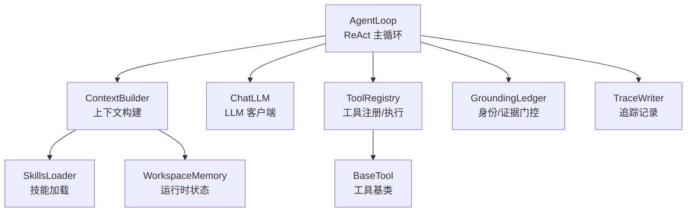
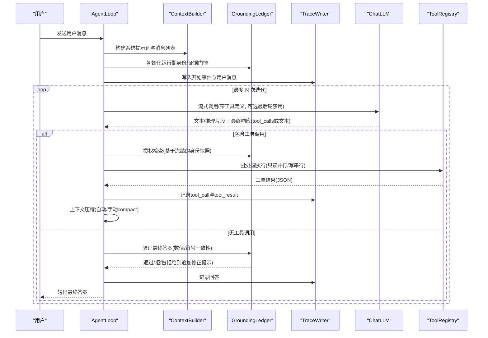
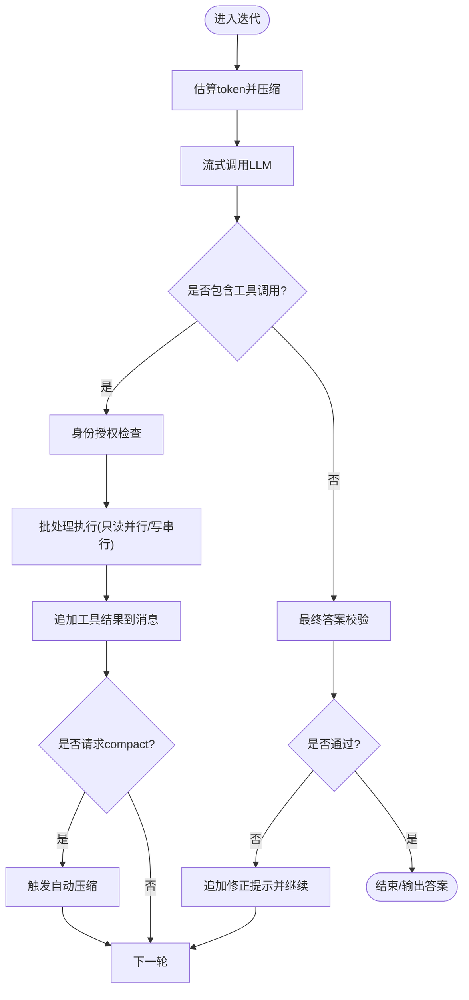
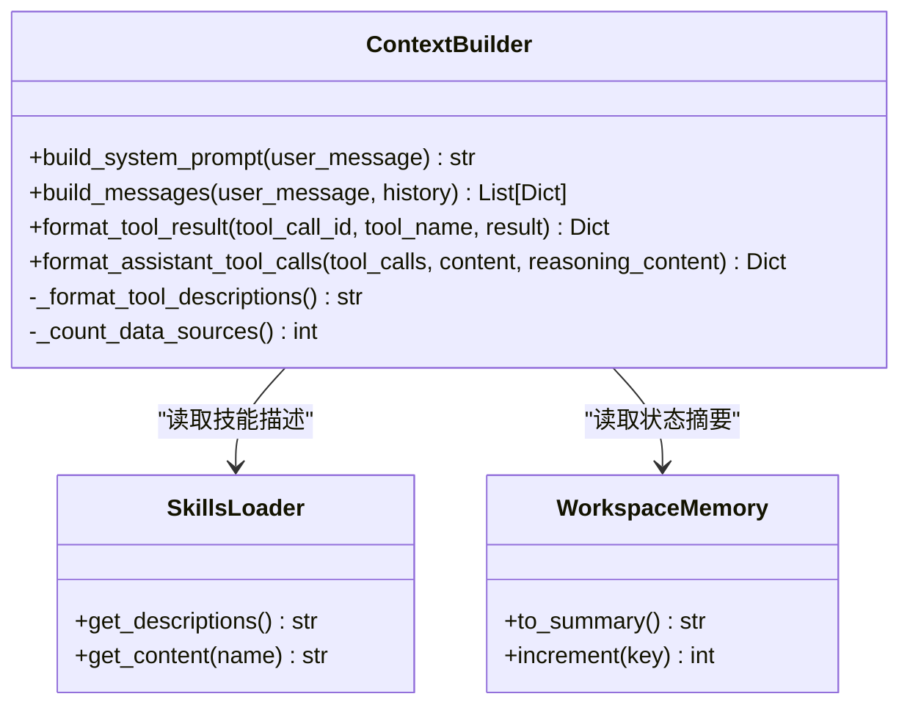
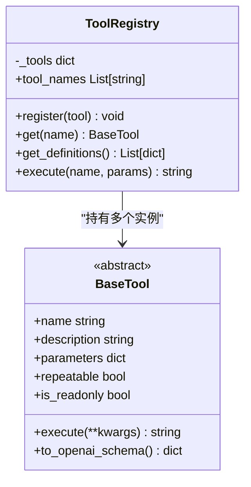
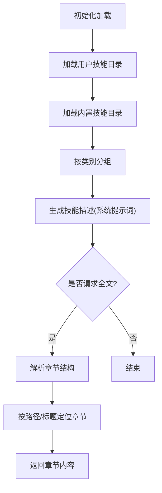
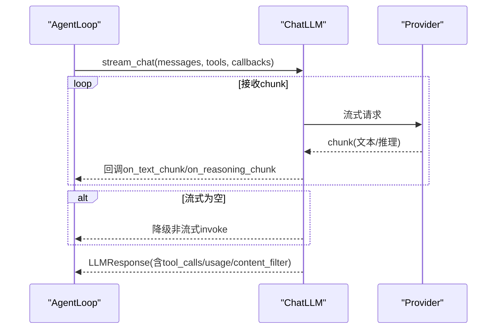
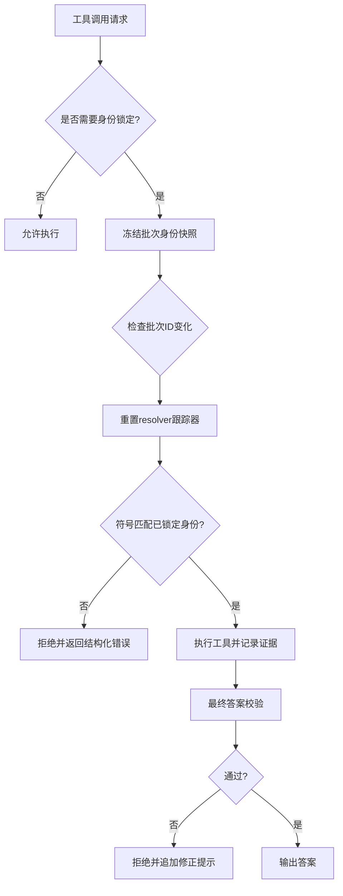
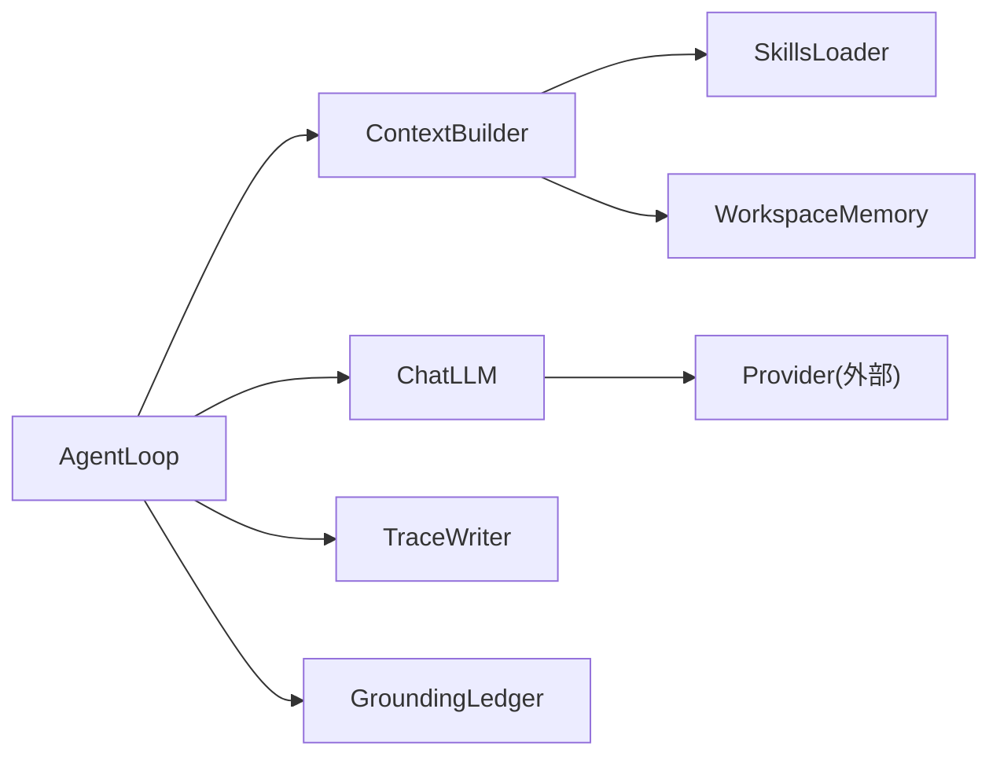

# Agent核心循环

<cite>
**本文引用的文件**
- [loop.py](file://agent/src/agent/loop.py)
- [context.py](file://agent/src/agent/context.py)
- [memory.py](file://agent/src/agent/memory.py)
- [tools.py](file://agent/src/agent/tools.py)
- [skills.py](file://agent/src/agent/skills.py)
- [chat.py](file://agent/src/providers/chat.py)
- [grounding.py](file://agent/src/agent/grounding.py)
- [trace.py](file://agent/src/agent/trace.py)
</cite>

## 更新摘要
**变更内容**
- 增强了 grounding 模块的批量调用冲突检测机制，改进了 resolver 工具调用的状态管理
- 引入了单调批次 ID 跟踪以防止竞态条件
- 增强了数值证据验证能力，包括对英文和中文市场数据格式的改进价格字段映射
- 优化了批量执行中的身份授权检查和冲突处理

## 目录
1. [简介](#简介)
2. [项目结构](#项目结构)
3. [核心组件](#核心组件)
4. [架构总览](#架构总览)
5. [详细组件分析](#详细组件分析)
6. [依赖关系分析](#依赖关系分析)
7. [性能考量](#性能考量)
8. [故障排除指南](#故障排除指南)
9. [结论](#结论)
10. [附录](#附录)

## 简介
本文件聚焦 Vibe-Trading Agent 的"思考-行动-观察"（ReAct）核心循环，系统性说明：
- ReAct 循环的执行流程、状态管理与错误处理策略
- 上下文构建器的工作方式：系统提示词生成、工具描述注入、记忆摘要整合与会话历史管理
- Agent 如何解析用户意图、选择并执行工具、处理结果
- 与 LLM 提供商的交互模式：流式响应、重试与超时控制
- 性能优化建议与常见问题排查

## 项目结构
围绕 Agent 核心循环的关键模块与职责如下：
- AgentLoop：实现 ReAct 主循环，负责消息构建、LLM 调用、工具调度、压缩与追踪
- ContextBuilder：构建系统提示词、注入工具与技能描述、组装消息历史与持久化记忆
- ToolRegistry/BaseTool：工具注册与执行入口，统一返回 JSON 字符串
- SkillsLoader：加载技能文档，提供按需展开与章节定位能力
- WorkspaceMemory：单轮运行内的轻量共享状态（如 run_dir、计数器）
- ChatLLM：封装 LLM 调用，支持函数调用、流式输出、内容过滤与异常包装
- GroundingLedger：运行期身份与数值证据门控，约束最终答案可溯源
- TraceWriter：崩溃安全的 JSONL 追踪记录，大字段旁路存储

**图表来源**
- [loop.py:502-710](file://agent/src/agent/loop.py#L502-L710)
- [context.py:210-322](file://agent/src/agent/context.py#L210-L322)
- [chat.py:272-398](file://agent/src/providers/chat.py#L272-L398)
- [tools.py:13-95](file://agent/src/agent/tools.py#L13-L95)
- [grounding.py:584-753](file://agent/src/agent/grounding.py#L584-L753)
- [trace.py:64-180](file://agent/src/agent/trace.py#L64-L180)

**章节来源**
- [loop.py:502-710](file://agent/src/agent/loop.py#L502-L710)
- [context.py:210-322](file://agent/src/agent/context.py#L210-L322)
- [tools.py:13-95](file://agent/src/agent/tools.py#L13-L95)
- [skills.py:100-189](file://agent/src/agent/skills.py#L100-L189)
- [memory.py:13-54](file://agent/src/agent/memory.py#L13-L54)
- [chat.py:272-398](file://agent/src/providers/chat.py#L272-L398)
- [grounding.py:584-753](file://agent/src/agent/grounding.py#L584-L753)
- [trace.py:64-180](file://agent/src/agent/trace.py#L64-L180)

## 核心组件
- AgentLoop：实现五层上下文压缩、工具批处理（只读并行、写串行）、流式 LLM 调用、内容过滤熔断、目标延续、使用量统计与追踪。
- ContextBuilder：生成稳定可缓存的系统提示词，注入工具描述、技能摘要、工作区状态与持久化记忆快照；自动召回相关记忆并注入到用户消息中。
- ToolRegistry/BaseTool：统一工具接口与 OpenAI function calling 描述；执行失败时返回结构化错误 JSON。
- SkillsLoader：按分类组织技能，提供"仅摘要"和"按需全文"两级加载；支持章节定位与路径寻址。
- WorkspaceMemory：单轮内共享状态，便于工具间协作与状态汇总。
- ChatLLM：封装 provider 差异，统一流式与非流式调用，解析 tool_calls、reasoning_content、usage_metadata 与内容过滤标志。
- GroundingLedger：强制"先锁定标的身份再消费"，对最终答案进行数值与符号一致性校验，必要时拒绝并重试或回退。
- TraceWriter：每条事件落盘并 fsync，大文本旁路存储，保证崩溃后仍可恢复完整追踪。

**章节来源**
- [loop.py:502-1203](file://agent/src/agent/loop.py#L502-L1203)
- [context.py:210-396](file://agent/src/agent/context.py#L210-L396)
- [tools.py:13-95](file://agent/src/agent/tools.py#L13-L95)
- [skills.py:100-387](file://agent/src/agent/skills.py#L100-L387)
- [memory.py:13-54](file://agent/src/agent/memory.py#L13-L54)
- [chat.py:272-554](file://agent/src/providers/chat.py#L272-L554)
- [grounding.py:584-800](file://agent/src/agent/grounding.py#L584-L800)
- [trace.py:64-180](file://agent/src/agent/trace.py#L64-L180)

## 架构总览
下图展示一次 ReAct 迭代从消息构建到工具执行与结果处理的端到端流程。

**图表来源**
- [loop.py:624-1203](file://agent/src/agent/loop.py#L624-L1203)
- [context.py:286-322](file://agent/src/agent/context.py#L286-L322)
- [chat.py:315-398](file://agent/src/providers/chat.py#L315-L398)
- [grounding.py:666-753](file://agent/src/agent/grounding.py#L666-L753)
- [trace.py:92-180](file://agent/src/agent/trace.py#L92-L180)

## 详细组件分析

### ReAct 核心循环（AgentLoop）
- 启动阶段
  - 创建运行目录与状态存储，初始化 GroundingLedger、ContextBuilder、TraceWriter
  - 根据 session_id 获取目标上下文，将目标信息包裹进用户消息
  - 构建初始消息列表（system + history + user），写入 manifest 与 trace
- 迭代阶段
  - 估算 token 数，触发多层压缩：
    - 层1：微压缩（清理旧工具结果）
    - 层2：上下文折叠（长文本保留头尾）
    - 层3：自动压缩（LLM 结构化摘要，尾部预算保护）
  - 接近最大迭代时注入"收尾提示"，引导模型停止工具调用并给出最终答案
  - 流式调用 LLM：
    - 收集 thinking/reasoning 片段，节流发射
    - 捕获 usage_metadata，累计 per-iteration 用量并持久化
    - 内容过滤熔断：连续被阻断达到阈值则终止
  - 若响应含 tool_calls：
    - 格式化 assistant 消息，附加 thought_signature
    - 预处理工具调用：去重、授权、compact 标记
    - **增强功能**：引入单调批次 ID 跟踪，防止 resolver 工具调用在批次内的竞态条件
    - 批处理执行：只读工具并行（线程池），写操作串行
    - 记录 tool_call/tool_result，更新消息历史
    - 若请求 compact，触发手动压缩
  - 若无 tool_calls：
    - 校验最终答案（GroundingLedger），不通过则追加修正提示继续
    - 若存在目标延续条件，可能插入中间答案并继续推进
    - 否则结束本轮，输出最终答案
- 结束阶段
  - 确定最终状态（成功/取消/失败），写入 trace 并返回结果（含 provider/model/迭代次数等元数据）

**图表来源**
- [loop.py:710-1203](file://agent/src/agent/loop.py#L710-L1203)

**章节来源**
- [loop.py:502-1203](file://agent/src/agent/loop.py#L502-L1203)

### 上下文构建器（ContextBuilder）
- 系统提示词生成
  - 注入工具数量、技能数量、数据源数量
  - 注入工具描述（名称、参数、必填项）
  - 注入技能摘要（按分类分组）
  - 注入工作区状态摘要（run_dir、计数器）
  - 注入持久化记忆快照（跨会话记忆）
  - 注入当前时间
- 消息构建
  - 首条 system 消息固定为系统提示词
  - 追加历史消息（如有）
  - 自动召回相关持久化记忆，以 <recalled-memories> 包裹注入到用户消息前
- 工具结果与助手消息格式化
  - format_tool_result：构造 tool 角色消息
  - format_assistant_tool_calls：构造 assistant 消息，携带 tool_calls、reasoning_content 与 extra_content

**图表来源**
- [context.py:210-396](file://agent/src/agent/context.py#L210-L396)
- [skills.py:100-189](file://agent/src/agent/skills.py#L100-L189)
- [memory.py:13-54](file://agent/src/agent/memory.py#L13-L54)

**章节来源**
- [context.py:210-396](file://agent/src/agent/context.py#L210-L396)

### 工具注册与执行（ToolRegistry/BaseTool）
- BaseTool 抽象出 name、description、parameters、repeatable、is_readonly 与 execute 方法
- ToolRegistry 维护工具字典，提供 get_definitions（OpenAI function calling 格式）与 execute（统一异常处理，返回 JSON）
- AgentLoop 在工具执行前进行授权检查与重复调用拦截，随后分批执行

**图表来源**
- [tools.py:13-95](file://agent/src/agent/tools.py#L13-L95)

**章节来源**
- [tools.py:13-95](file://agent/src/agent/tools.py#L13-L95)

### 技能加载（SkillsLoader）
- 加载顺序：用户技能优先覆盖内置技能
- 描述聚合：按类别分组，便于系统提示词紧凑呈现
- 全文加载：load_skill 工具按需返回完整文档，支持章节定位与路径寻址
- 章节解析：split_sections 将 Markdown 文档映射为层级化的 SkillSection，支持 ancestor_titles、qualified_path、find_sections/find_section

**图表来源**
- [skills.py:100-387](file://agent/src/agent/skills.py#L100-L387)

**章节来源**
- [skills.py:100-387](file://agent/src/agent/skills.py#L100-L387)

### 运行期状态（WorkspaceMemory）
- 维护 run_dir 与工具调用计数器
- to_summary 生成简洁状态文本，供系统提示词引用，帮助模型记住当前上下文

**章节来源**
- [memory.py:13-54](file://agent/src/agent/memory.py#L13-L54)

### 与 LLM 提供商交互（ChatLLM）
- 统一 chat/stream_chat 接口，支持 tools 绑定
- 流式处理：
  - 文本片段回调 on_text_chunk
  - 推理片段回调 on_reasoning_chunk（节流）
  - 支持 should_cancel 每 chunk 检查，实现协作式取消
  - 若 provider 不支持流式（零 chunk），自动降级为非流式 invoke
- 响应解析：
  - 提取 tool_calls（原生或 DSML 文本嵌入）
  - 提取 reasoning_content、usage_metadata、finish_reason、content_filter_triggered、response_model
- 异常包装：ProviderStreamError，区分可重试与不可重试错误，附带 provider/model 信息与提示

**图表来源**
- [chat.py:315-398](file://agent/src/providers/chat.py#L315-L398)
- [chat.py:426-514](file://agent/src/providers/chat.py#L426-L514)

**章节来源**
- [chat.py:272-554](file://agent/src/providers/chat.py#L272-L554)

### 身份与证据门控（GroundingLedger）

**更新** 增强了批量调用冲突检测机制和改进的状态管理

- 身份锁定：对涉及市场数据的工具调用，要求先通过 search_symbol 锁定唯一标的与交易所后缀，禁止静默改写
- **增强的批量冲突检测**：
  - 引入单调批次 ID（`_last_batch_id`）跟踪，防止 resolver 工具调用在批次内的竞态条件
  - 维护 `_batch_resolver_call_ids` 集合，记录当前批次中的 resolver 调用
  - 当批次 ID 变化时重置 resolver 跟踪器，确保批次边界清晰
- 授权检查：在工具执行前基于"批次冻结"的身份快照进行判断，阻止未锁定或冲突身份的消费
- **改进的数值证据验证**：
  - 扩展 `_GENERIC_PRICE_FIELD_ALIASES` 映射表，支持更多中英文价格字段别名
  - 支持中文市场数据格式：开盘价、最高价、最低价、收盘价、现价、最新价等
  - 支持英文市场数据格式：open_price、high_price、low_price、close_price、last_price 等
- 证据采集：解析工具结果中的价格/时间戳/符号等，建立证据账本
- 最终答案校验：检查数值主张是否与观测证据一致，是否存在缺失或冲突，必要时拒绝并给出修正提示

**图表来源**
- [grounding.py:584-800](file://agent/src/agent/grounding.py#L584-L800)

**章节来源**
- [grounding.py:584-800](file://agent/src/agent/grounding.py#L584-L800)

### 追踪记录（TraceWriter）
- 每条事件写入 JSONL 并 flush/fsync，确保崩溃安全
- 大字段旁路存储：超过阈值的文本/工具结果写入 sidecar，主记录仅保留预览与路径
- 读取支持选择性解析 offload 字段，避免不必要的大文件 IO

**章节来源**
- [trace.py:64-180](file://agent/src/agent/trace.py#L64-L180)
- [trace.py:185-268](file://agent/src/agent/trace.py#L185-L268)
- [trace.py:302-370](file://agent/src/agent/trace.py#L302-L370)

## 依赖关系分析
- AgentLoop 强依赖 ContextBuilder、ChatLLM、ToolRegistry、GroundingLedger、TraceWriter
- ContextBuilder 依赖 SkillsLoader 与 WorkspaceMemory
- ChatLLM 依赖底层 provider（由 build_llm 装配），对外暴露统一接口
- GroundingLedger 独立于 provider 与工具注册表，保证确定性校验
- TraceWriter 作为通用基础设施，被各组件用于持久化事件与大文本

**图表来源**
- [loop.py:502-710](file://agent/src/agent/loop.py#L502-L710)
- [context.py:210-322](file://agent/src/agent/context.py#L210-L322)
- [chat.py:272-398](file://agent/src/providers/chat.py#L272-L398)

**章节来源**
- [loop.py:502-710](file://agent/src/agent/loop.py#L502-L710)
- [context.py:210-322](file://agent/src/agent/context.py#L210-L322)
- [chat.py:272-398](file://agent/src/providers/chat.py#L272-L398)

## 性能考量
- 上下文压缩分层
  - 层1/层2：纯字符串操作，零 API 成本，降低 token 占用
  - 层3：LLM 结构化摘要，配合尾部预算保护，避免关键信息丢失
- 工具批处理
  - 只读工具并行执行（线程池上限 8），写操作串行，兼顾吞吐与一致性
  - **增强功能**：单调批次 ID 跟踪减少不必要的 resolver 跟踪器重置
- 流式响应与节流
  - 推理片段节流发射，减少 UI/SSE 缓冲压力
  - 支持协作式取消，及时中断长耗时任务
- 内容过滤熔断
  - 连续阻断达到阈值即中止，避免无效循环
- 追踪大字段旁路
  - 避免 trace.jsonl 膨胀，提升读写效率
- **新增优化**：改进的价格字段映射减少误报，提高验证准确性
- 建议
  - 合理设置 token_threshold、heartbeat_interval、stream_retry_delay、vibe_trading_tool_timeout_seconds 等配置
  - 针对高频只读工具，评估并发度与下游限流
  - 关注 usage_metadata 累计，监控成本与延迟

**章节来源**
- [loop.py:727-749](file://agent/src/agent/loop.py#L727-L749)
- [loop.py:1393-1498](file://agent/src/agent/loop.py#L1393-L1498)
- [chat.py:315-398](file://agent/src/providers/chat.py#L315-L398)
- [trace.py:44-53](file://agent/src/agent/trace.py#L44-L53)

## 故障排除指南
- 流式失败与重试
  - ProviderStreamError：区分可重试（超时、限流、5xx、无状态码）与不可重试（4xx 除 408/429）
  - AgentLoop 对可重试错误进行一次重试，重置 thinking/reasoning 缓冲，避免重复
- 内容过滤阻断
  - 连续阻断触发熔断，记录 circuit_breaker 事件，终止运行
- 空响应
  - 若模型返回空内容且无工具调用，记录 empty_model_response 并终止
- **增强的身份冲突处理**：
  - 工具调用被拒绝时，返回结构化错误，提示需先调用 search_symbol 锁定标的
  - 批次边界检测更精确，避免 resolver 结果的竞态条件
- 工具超时
  - 通过 _tool_timeout_seconds 配置，超时时停止后续批处理
- **改进的数值验证**：
  - 支持更多中英文价格字段别名，减少误报
  - 更好的日期匹配逻辑，支持无年份日期格式
- 追踪与诊断
  - 查看 trace.jsonl 与 sidecar 文件，定位 tool_call/tool_result/thinking/answer 等事件
  - 检查 run_manifest.json 确认系统提示词哈希与工具集

**章节来源**
- [chat.py:117-163](file://agent/src/providers/chat.py#L117-L163)
- [chat.py:315-398](file://agent/src/providers/chat.py#L315-L398)
- [loop.py:816-857](file://agent/src/agent/loop.py#L816-L857)
- [loop.py:920-944](file://agent/src/agent/loop.py#L920-L944)
- [loop.py:946-958](file://agent/src/agent/loop.py#L946-L958)
- [grounding.py:666-753](file://agent/src/agent/grounding.py#L666-L753)
- [trace.py:92-180](file://agent/src/agent/trace.py#L92-L180)

## 结论
Vibe-Trading 的 Agent 核心循环以 ReAct 为主线，结合五层上下文压缩、工具批处理、身份与证据门控、流式 LLM 交互与崩溃安全的追踪机制，实现了高可靠、可追溯、可扩展的智能体执行环境。**最新的增强功能包括改进的批量调用冲突检测、单调批次 ID 跟踪和增强的数值证据验证能力**，进一步提升了系统的稳定性和准确性。通过合理的配置与监控，可在复杂金融研究场景中稳定运行，并提供清晰的诊断与排障能力。

## 附录
- 关键配置项参考（来自 AgentLoop 与 ChatLLM）
  - token_threshold：触发自动压缩的 token 阈值
  - vt_heartbeat_interval_s：工具心跳间隔
  - vt_reasoning_delta_min_interval_s：推理片段节流最小间隔
  - vt_stream_retry_delay_s：流式重试等待时间
  - vibe_trading_tool_timeout_seconds：工具超时秒数
  - vibe_trading_goal_max_continuations：目标延续最大次数
- 典型事件类型（TraceWriter）
  - start/message/thinking/tool_call/tool_result/answer/end
  - 大字段旁路：result_path/tool-result-{tool}-{call_id}

**章节来源**
- [loop.py:74-120](file://agent/src/agent/loop.py#L74-L120)
- [trace.py:92-180](file://agent/src/agent/trace.py#L92-L180)