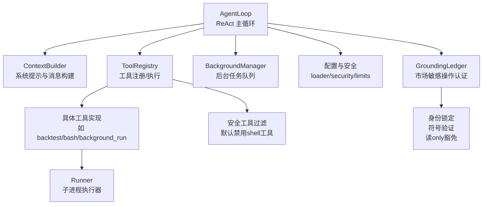
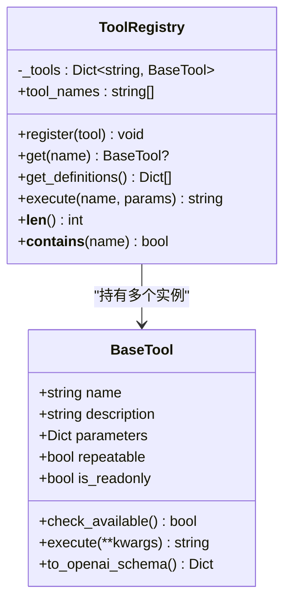
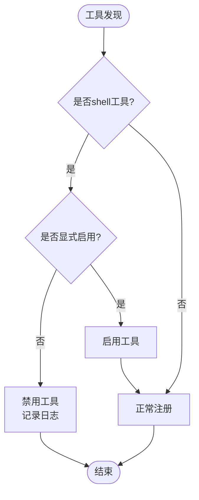
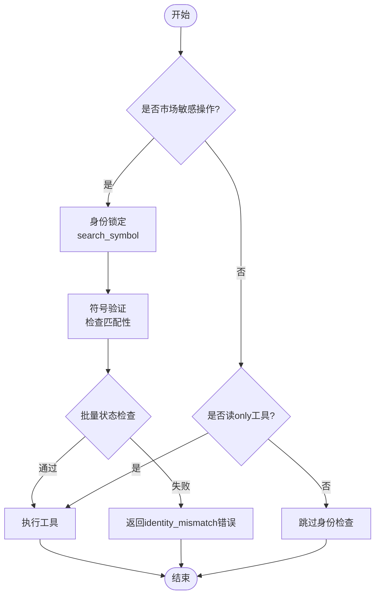
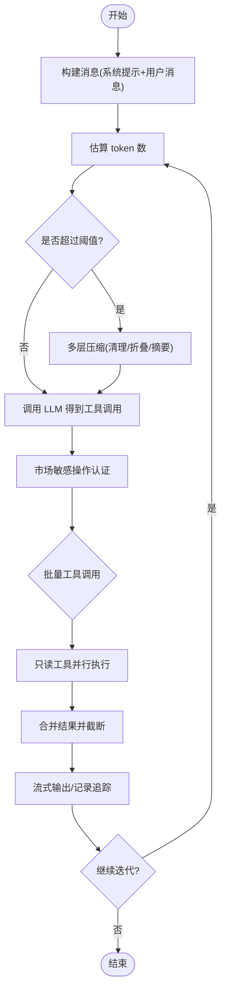
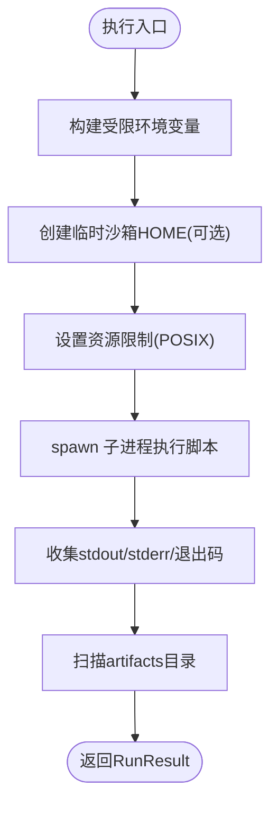
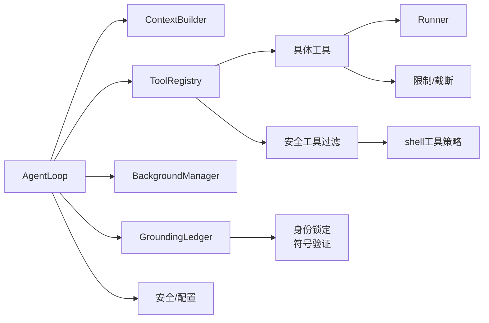
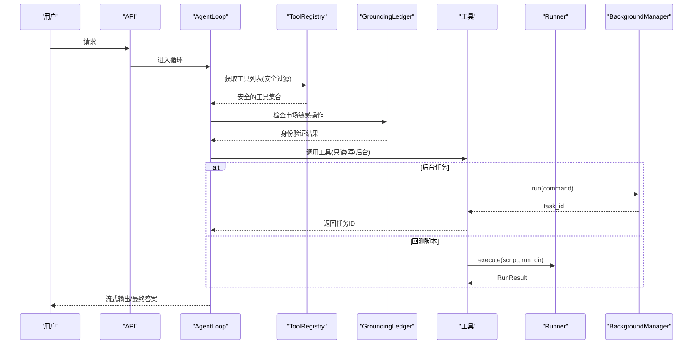

# 工具执行框架

<cite>
**本文引用的文件**
- [agent/src/agent/tools.py](file://agent/src/agent/tools.py)
- [agent/src/tools/__init__.py](file://agent/src/tools/__init__.py)
- [agent/src/core/runner.py](file://agent/src/core/runner.py)
- [agent/src/config/loader.py](file://agent/src/config/loader.py)
- [agent/src/api/security.py](file://agent/src/api/security.py)
- [agent/src/agent/context.py](file://agent/src/agent/context.py)
- [agent/src/agent/loop.py](file://agent/src/agent/loop.py)
- [agent/src/tools/background_tools.py](file://agent/src/tools/background_tools.py)
- [agent/src/config/limits.py](file://agent/src/config/limits.py)
- [agent/src/agent/grounding.py](file://agent/src/agent/grounding.py)
- [agent/tests/test_tool_registry_security.py](file://agent/tests/test_tool_registry_security.py)
</cite>

## 更新摘要
**变更内容**
- 增强了市场敏感操作的认证机制，特别是在符号查找和市场数据检索等关键金融操作中的安全控制
- 改进了工具执行框架的权限验证和身份锁定机制，防止符号混淆和未授权访问
- 强化了读-only工具的豁免策略，确保市场数据获取的安全性同时保持功能完整性
- 更新了工具注册表的安全默认设置，默认禁用shell工具需要显式启用
- 新增了路由级别的安全检查和安全头强制策略

## 目录
1. [简介](#简介)
2. [项目结构](#项目结构)
3. [核心组件](#核心组件)
4. [架构总览](#架构总览)
5. [详细组件分析](#详细组件分析)
6. [依赖关系分析](#依赖关系分析)
7. [性能考量](#性能考量)
8. [故障排查指南](#故障排查指南)
9. [结论](#结论)
10. [附录：执行示例与调试方法](#附录：执行示例与调试方法)

## 简介
本文件系统化说明"工具执行框架"的完整流程，覆盖参数解析、输入验证、执行调度与结果处理；解释异步执行模型、并发控制与任务队列管理；详述错误处理机制（异常捕获、重试策略、降级处理）；介绍工具调用的安全控制（权限验证、资源限制、执行环境隔离）；提供性能优化策略（缓存机制、连接池管理、内存优化）；并给出完整的执行示例与调试方法。

**更新** 本次更新重点增强了市场敏感操作的认证机制和安全控制，特别是在金融数据操作中的符号识别和价格验证方面，同时加强了工具注册的安全默认设置。

## 项目结构
围绕工具执行的关键模块分布如下：
- 工具注册与执行：BaseTool、ToolRegistry
- Agent 循环与上下文：AgentLoop、ContextBuilder
- 子进程执行器：Runner（沙箱化执行回测脚本）
- 配置加载与安全：配置合并、会话覆盖清洗、API 鉴权与安全头
- 后台任务：BackgroundManager（线程+进程组管理）
- 运行时限制：工具结果截断等
- **新增** 市场敏感操作认证：GroundingLedger（身份锁定和符号验证）
- **新增** 工具注册安全控制：默认禁用shell工具的安全加固



**图表来源**
- [agent/src/agent/loop.py:502-750](file://agent/src/agent/loop.py#L502-L750)
- [agent/src/agent/context.py:210-336](file://agent/src/agent/context.py#L210-L336)
- [agent/src/agent/tools.py:13-95](file://agent/src/agent/tools.py#L13-L95)
- [agent/src/tools/__init__.py:66-245](file://agent/src/tools/__init__.py#L66-L245)
- [agent/src/core/runner.py:372-620](file://agent/src/core/runner.py#L372-L620)
- [agent/src/tools/background_tools.py:102-319](file://agent/src/tools/background_tools.py#L102-L319)
- [agent/src/config/loader.py:28-151](file://agent/src/config/loader.py#L28-L151)
- [agent/src/api/security.py:463-622](file://agent/src/api/security.py#L463-L622)
- [agent/src/config/limits.py:12-49](file://agent/src/config/limits.py#L12-L49)
- [agent/src/agent/grounding.py:759-830](file://agent/src/agent/grounding.py#L759-L830)

**章节来源**
- [agent/src/agent/loop.py:502-750](file://agent/src/agent/loop.py#L502-L750)
- [agent/src/agent/context.py:210-336](file://agent/src/agent/context.py#L210-L336)
- [agent/src/agent/tools.py:13-95](file://agent/src/agent/tools.py#L13-L95)
- [agent/src/tools/__init__.py:66-245](file://agent/src/tools/__init__.py#L66-L245)
- [agent/src/core/runner.py:372-620](file://agent/src/core/runner.py#L372-L620)
- [agent/src/tools/background_tools.py:102-319](file://agent/src/tools/background_tools.py#L102-L319)
- [agent/src/config/loader.py:28-151](file://agent/src/config/loader.py#L28-L151)
- [agent/src/api/security.py:463-622](file://agent/src/api/security.py#L463-L622)
- [agent/src/config/limits.py:12-49](file://agent/src/config/limits.py#L12-L49)
- [agent/src/agent/grounding.py:759-830](file://agent/src/agent/grounding.py#L759-L830)

## 核心组件
- BaseTool/ToolRegistry：定义工具抽象、注册表与统一执行入口，保证返回 JSON 字符串并捕获异常。
- AgentLoop：ReAct 主循环，负责消息压缩、工具调用批处理、流式输出、取消与追踪。
- Runner：在受限环境中执行生成的回测脚本，包含环境变量白名单、沙箱 HOME、资源限制与超时。
- BackgroundManager：后台任务管理器，基于线程启动子进程，支持超时终止、进程组信号与通知队列。
- 配置与安全：加载与合并配置、清洗会话级注入、API 鉴权、CORS/CSP/DNS 重绑定防护。
- 限制与裁剪：统一工具结果长度限制，避免超限影响 LLM 上下文。
- **新增** GroundingLedger：市场敏感操作的身份锁定和符号验证机制，确保金融数据的准确性和安全性。
- **新增** 工具注册安全控制：默认禁用shell工具，需要通过环境变量或显式参数启用。

**章节来源**
- [agent/src/agent/tools.py:13-95](file://agent/src/agent/tools.py#L13-L95)
- [agent/src/tools/__init__.py:66-245](file://agent/src/tools/__init__.py#L66-L245)
- [agent/src/agent/loop.py:502-750](file://agent/src/agent/loop.py#L502-L750)
- [agent/src/core/runner.py:372-620](file://agent/src/core/runner.py#L372-L620)
- [agent/src/tools/background_tools.py:102-319](file://agent/src/tools/background_tools.py#L102-L319)
- [agent/src/config/loader.py:28-151](file://agent/src/config/loader.py#L28-L151)
- [agent/src/api/security.py:463-622](file://agent/src/api/security.py#L463-L622)
- [agent/src/config/limits.py:12-49](file://agent/src/config/limits.py#L12-L49)
- [agent/src/agent/grounding.py:759-830](file://agent/src/agent/grounding.py#L759-L830)

## 架构总览
下图展示了从 API 请求到工具执行、再到结果处理的端到端流程，包括鉴权、配置加载、Agent 循环、工具执行、后台任务与结果归档。

```mermaid
sequenceDiagram
participant Client as "客户端"
participant API as "API 鉴权与安全"
participant Loop as "AgentLoop"
participant Ctx as "ContextBuilder"
participant Reg as "ToolRegistry"
participant GL as "GroundingLedger"
participant Tool as "具体工具"
participant Run as "Runner(子进程)"
participant BG as "BackgroundManager"
Client->>API : 发起请求(携带凭据/票据)
API-->>Client : 通过/拒绝(401/403/安全头)
API->>Loop : 进入 ReAct 循环
Loop->>Ctx : 构建系统提示与消息
Loop->>Reg : 获取工具定义/执行工具
alt 工具注册安全检查
Reg->>Reg : 默认禁用shell工具
Reg-->>Loop : 安全的工具列表
end
Loop->>GL : 检查市场敏感操作
alt 市场敏感操作
GL->>GL : 身份锁定和符号验证
GL-->>Loop : 授权状态
end
Loop->>Reg : 执行工具
alt 同步工具
Reg->>Tool : execute(**params)
Tool-->>Reg : JSON 结果(可能截断)
Reg-->>Loop : 标准化结果
else 后台任务
Reg->>BG : run(command)
BG-->>Reg : task_id
Reg-->>Loop : 立即返回任务ID
end
opt 需要执行回测脚本
Tool->>Run : execute(entry_script, run_dir)
Run-->>Tool : RunResult(stdout/stderr/artifacts)
end
Loop-->>Client : 流式文本/工具结果/最终答案
```

**图表来源**
- [agent/src/api/security.py:463-622](file://agent/src/api/security.py#L463-L622)
- [agent/src/agent/loop.py:624-750](file://agent/src/agent/loop.py#L624-L750)
- [agent/src/agent/context.py:235-336](file://agent/src/agent/context.py#L235-L336)
- [agent/src/agent/tools.py:54-95](file://agent/src/agent/tools.py#L54-L95)
- [agent/src/tools/__init__.py:136-154](file://agent/src/tools/__init__.py#L136-L154)
- [agent/src/core/runner.py:503-620](file://agent/src/core/runner.py#L503-L620)
- [agent/src/tools/background_tools.py:110-139](file://agent/src/tools/background_tools.py#L110-L139)
- [agent/src/agent/grounding.py:759-830](file://agent/src/agent/grounding.py#L759-L830)

## 详细组件分析

### 工具注册与执行（BaseTool / ToolRegistry）
- 职责：统一工具接口、注册表管理、OpenAI function-calling 描述生成、执行与异常兜底。
- 关键点：
  - 所有工具必须返回 JSON 字符串；Registry.execute 捕获异常并返回结构化错误。
  - 支持只读标记 repeatable/is_readonly，便于上层做并行与幂等策略。
  - 可查询工具名列表与定义，供 LLM 选择。
  - **更新** 默认禁用shell工具，需要通过环境变量显式启用以提高安全性。



**图表来源**
- [agent/src/agent/tools.py:13-95](file://agent/src/agent/tools.py#L13-L95)

**章节来源**
- [agent/src/agent/tools.py:13-95](file://agent/src/agent/tools.py#L13-L95)
- [agent/tests/test_tool_registry_security.py:10-28](file://agent/tests/test_tool_registry_security.py#L10-L28)

### 工具注册安全控制
- 职责：在工具注册阶段实施安全策略，默认禁用高风险工具。
- 关键点：
  - shell工具（bash、background_run、cancel_background）默认被禁用。
  - 需要通过 `include_shell_tools=True` 参数或环境变量显式启用。
  - 在工具发现阶段进行安全过滤，记录日志以便审计。
  - 支持选择性注册，允许特定场景下启用shell工具。



**图表来源**
- [agent/src/tools/__init__.py:136-154](file://agent/src/tools/__init__.py#L136-L154)

**章节来源**
- [agent/src/tools/__init__.py:136-154](file://agent/src/tools/__init__.py#L136-L154)
- [agent/tests/test_tool_registry_security.py:10-28](file://agent/tests/test_tool_registry_security.py#L10-L28)

### 市场敏感操作认证（GroundingLedger）
- 职责：为市场敏感操作提供身份锁定和符号验证，确保金融数据的准确性和安全性。
- 关键点：
  - 身份锁定：在执行市场敏感操作前，先通过search_symbol确定唯一标识符。
  - 符号验证：消费工具的符号必须与锁定的身份匹配，防止符号混淆攻击。
  - 读only豁免：get_market_data等读only工具可以绕过身份检查，允许从任何来源获取数据。
  - 批量状态共享：同一批次内的工具调用共享身份状态，防止竞态条件。



**图表来源**
- [agent/src/agent/grounding.py:759-830](file://agent/src/agent/grounding.py#L759-L830)
- [agent/src/agent/context.py:160-180](file://agent/src/agent/context.py#L160-180)

**章节来源**
- [agent/src/agent/grounding.py:759-830](file://agent/src/agent/grounding.py#L759-L830)
- [agent/src/agent/context.py:160-180](file://agent/src/agent/context.py#L160-180)
- [agent/tests/test_agent_grounding.py:302-352](file://agent/tests/test_agent_grounding.py#L302-L352)

### Agent 循环与上下文（AgentLoop / ContextBuilder）
- 职责：组织 ReAct 循环、消息压缩（多层）、工具调用批处理（只读并行）、流式输出、取消与追踪。
- 关键点：
  - 四层上下文压缩：微清理、折叠长文本、LLM 摘要、迭代更新。
  - 工具调用批处理：连续只读工具并行执行，提升吞吐。
  - 取消机制：线程安全的取消事件，在迭代边界、流式 chunk 间检查。
  - 使用 ContextBuilder 组装系统提示与用户消息，注入技能与工具描述。
  - **更新** 集成市场敏感操作认证，在执行前进行身份锁定和符号验证。



**图表来源**
- [agent/src/agent/loop.py:227-320](file://agent/src/agent/loop.py#L227-L320)
- [agent/src/agent/loop.py:502-750](file://agent/src/agent/loop.py#L502-L750)
- [agent/src/agent/context.py:235-336](file://agent/src/agent/context.py#L235-L336)
- [agent/src/config/limits.py:22-49](file://agent/src/config/limits.py#L22-L49)
- [agent/src/agent/grounding.py:759-830](file://agent/src/agent/grounding.py#L759-L830)

**章节来源**
- [agent/src/agent/loop.py:227-320](file://agent/src/agent/loop.py#L227-L320)
- [agent/src/agent/loop.py:502-750](file://agent/src/agent/loop.py#L502-L750)
- [agent/src/agent/context.py:235-336](file://agent/src/agent/context.py#L235-L336)
- [agent/src/config/limits.py:22-49](file://agent/src/config/limits.py#L22-L49)
- [agent/src/agent/grounding.py:759-830](file://agent/src/agent/grounding.py#L759-L830)

### 子进程执行器（Runner）
- 职责：以受限环境执行生成的回测脚本，收集日志与产物。
- 关键点：
  - 环境变量白名单：仅允许必要的环境变量进入子进程，防止凭证泄露。
  - 沙箱 HOME：临时 HOME 目录，仅暴露必要的只读路径，避免读取真实家目录敏感数据。
  - 资源限制：POSIX 下设置虚拟内存与文件句柄上限；Windows 无 resource 模块则跳过。
  - 超时与退出码：统一超时保护，记录 stdout/stderr 与 artifacts。
  - Python 解释器选择：优先使用项目虚拟环境或当前解释器。



**图表来源**
- [agent/src/core/runner.py:431-479](file://agent/src/core/runner.py#L431-L479)
- [agent/src/core/runner.py:503-620](file://agent/src/core/runner.py#L503-L620)
- [agent/src/core/runner.py:113-172](file://agent/src/core/runner.py#L113-L172)
- [agent/src/core/runner.py:73-110](file://agent/src/core/runner.py#L73-L110)

**章节来源**
- [agent/src/core/runner.py:431-479](file://agent/src/core/runner.py#L431-L479)
- [agent/src/core/runner.py:503-620](file://agent/src/core/runner.py#L503-L620)
- [agent/src/core/runner.py:113-172](file://agent/src/core/runner.py#L113-L172)
- [agent/src/core/runner.py:73-110](file://agent/src/core/runner.py#L73-L110)

### 后台任务与队列（BackgroundManager）
- 职责：后台运行 shell 命令，管理进程组生命周期，提供状态查询与取消。
- 关键点：
  - 线程启动子进程，支持跨平台进程组终止（POSIX killpg，Windows taskkill）。
  - 超时自动终止，输出截断，状态机（running/cancelling/completed/error/timeout/cancelled）。
  - 通知队列：主循环定期拉取通知，将结果注入对话上下文。

```mermaid
sequenceDiagram
participant Tool as "background_run工具"
participant BG as "BackgroundManager"
participant Proc as "子进程"
participant Loop as "AgentLoop"
Tool->>BG : run(command)
BG->>Proc : Popen(shell=True, 新会话)
BG-->>Tool : {"status" : "ok","task_id" : ...}
Note over BG,Proc : 后台线程等待communicate(timeout=300s)
Loop->>BG : drain_notifications()
BG-->>Loop : [{task_id,status,result,...}]
Loop->>Loop : 将结果作为系统消息注入
```

**图表来源**
- [agent/src/tools/background_tools.py:110-139](file://agent/src/tools/background_tools.py#L110-L139)
- [agent/src/tools/background_tools.py:141-204](file://agent/src/tools/background_tools.py#L141-L204)
- [agent/src/tools/background_tools.py:258-311](file://agent/src/tools/background_tools.py#L258-L311)
- [agent/src/agent/loop.py:720-726](file://agent/src/agent/loop.py#L720-L726)

**章节来源**
- [agent/src/tools/background_tools.py:110-139](file://agent/src/tools/background_tools.py#L110-L139)
- [agent/src/tools/background_tools.py:141-204](file://agent/src/tools/background_tools.py#L141-L204)
- [agent/src/tools/background_tools.py:258-311](file://agent/src/tools/background_tools.py#L258-L311)
- [agent/src/agent/loop.py:720-726](file://agent/src/agent/loop.py#L720-L726)

### 配置加载与安全控制
- 配置加载：支持 JSON/YAML，失败时降级为默认配置；支持运行时覆盖合并，并对 MCP 服务器配置进行传输切换兼容。
- 会话覆盖清洗：禁止非受信任来源注入 mcpServers/mcp_servers，除非显式开启环境变量开关。
- API 鉴权与安全头：
  - 支持 Bearer Token 与 SSE ticket 两种认证方式。
  - CORS 严格校验，禁止 credentialed wildcard。
  - CSP/Permissions-Policy/Referrer-Policy 等响应头强制。
  - DNS 重绑定防护：本地回环 Host 白名单校验。
  - 访问日志脱敏：对 api_key/ticket 等查询参数值进行脱敏。
  - **更新** 新增路由级别的安全检查，确保所有敏感端点都经过适当的认证。

**章节来源**
- [agent/src/config/loader.py:28-151](file://agent/src/config/loader.py#L28-L151)
- [agent/src/config/loader.py:107-134](file://agent/src/config/loader.py#L107-L134)
- [agent/src/api/security.py:69-158](file://agent/src/api/security.py#L69-L158)
- [agent/src/api/security.py:166-253](file://agent/src/api/security.py#L166-L253)
- [agent/src/api/security.py:260-297](file://agent/src/api/security.py#L260-L297)
- [agent/src/api/security.py:463-622](file://agent/src/api/security.py#L463-L622)

## 依赖关系分析
- AgentLoop 依赖 ContextBuilder、ToolRegistry、BackgroundManager、配置与安全模块。
- ToolRegistry 聚合具体工具，工具内部可能调用 Runner（如回测工具）或外部网络服务。
- Runner 依赖操作系统能力（POSIX resource/pwd），在不可用时降级。
- BackgroundManager 依赖 subprocess 与信号机制，跨平台差异封装。
- 配置与安全模块被 API 层与 Agent 层共同消费，确保一致的策略。
- **新增** GroundingLedger 被 AgentLoop 调用，为市场敏感操作提供认证服务。
- **新增** 工具注册安全控制被 build_registry 调用，实施默认安全策略。



**图表来源**
- [agent/src/agent/loop.py:502-750](file://agent/src/agent/loop.py#L502-L750)
- [agent/src/agent/tools.py:54-95](file://agent/src/agent/tools.py#L54-L95)
- [agent/src/tools/__init__.py:136-154](file://agent/src/tools/__init__.py#L136-L154)
- [agent/src/core/runner.py:372-620](file://agent/src/core/runner.py#L372-L620)
- [agent/src/tools/background_tools.py:102-319](file://agent/src/tools/background_tools.py#L102-L319)
- [agent/src/config/loader.py:28-151](file://agent/src/config/loader.py#L28-L151)
- [agent/src/api/security.py:463-622](file://agent/src/api/security.py#L463-L622)
- [agent/src/config/limits.py:12-49](file://agent/src/config/limits.py#L12-L49)
- [agent/src/agent/grounding.py:759-830](file://agent/src/agent/grounding.py#L759-L830)

**章节来源**
- [agent/src/agent/loop.py:502-750](file://agent/src/agent/loop.py#L502-L750)
- [agent/src/agent/tools.py:54-95](file://agent/src/agent/tools.py#L54-L95)
- [agent/src/tools/__init__.py:136-154](file://agent/src/tools/__init__.py#L136-L154)
- [agent/src/core/runner.py:372-620](file://agent/src/core/runner.py#L372-L620)
- [agent/src/tools/background_tools.py:102-319](file://agent/src/tools/background_tools.py#L102-L319)
- [agent/src/config/loader.py:28-151](file://agent/src/config/loader.py#L28-L151)
- [agent/src/api/security.py:463-622](file://agent/src/api/security.py#L463-L622)
- [agent/src/config/limits.py:12-49](file://agent/src/config/limits.py#L12-L49)
- [agent/src/agent/grounding.py:759-830](file://agent/src/agent/grounding.py#L759-L830)

## 性能考量
- 工具结果截断：统一限制单条工具结果长度，避免上下文膨胀。
- 上下文压缩：多层压缩减少 token 消耗，降低 LLM 调用成本。
- 只读工具并行：连续只读工具批量并行执行，提高吞吐。
- 后台任务超时：后台命令最大 300 秒，避免长期占用资源。
- 子进程资源限制：虚拟内存与文件句柄上限，防止 DoS。
- 环境变量最小化：仅传递必要环境变量，减少不必要开销与风险。
- 缓存与连接池：各数据源/连接器通常自带连接复用与缓存（例如 OKX/yfinance 等），框架侧通过 Runner 的 XDG_CACHE_HOME 保留缓存目录以提升重复运行效率。
- **新增** 身份锁定缓存：避免重复的身份解析，提高市场敏感操作的执行效率。
- **新增** 工具注册缓存：工具子类发现结果缓存，避免重复导入开销。

## 故障排查指南
- 工具执行失败：
  - 检查 ToolRegistry.execute 返回的错误 JSON，定位工具名称与异常信息。
  - 查看 Runner 的 logs/runner_stdout.txt 与 logs/runner_stderr.txt，确认子进程输出。
- 后台任务卡死：
  - 使用 check_background 查看状态与剩余时间；必要时 cancel_background 安全终止。
  - 注意跨平台进程组终止行为差异（POSIX killpg vs Windows taskkill）。
- 鉴权失败：
  - 确认 API_AUTH_KEY 或本地回环信任策略；检查 CORS 与 CSP 配置。
  - 浏览器 EventSource 需先获取 ticket，再传入 ?ticket=。
- 配置问题：
  - 配置文件格式错误或缺失会降级为默认配置；检查合并后的配置与覆盖项。
  - 会话级注入 mcpServers 被清洗时，检查环境变量开关。
- **新增** 市场敏感操作认证失败：
  - 检查 identity_status 是否为 unresolved/conflicting/invalidated。
  - 确认 search_symbol 工具是否正确执行并返回有效符号。
  - 验证消费工具的符号是否与锁定的身份完全匹配。
- **新增** 工具注册安全问题：
  - 检查 shell 工具是否被正确禁用或启用。
  - 确认 include_shell_tools 参数设置是否符合预期。
  - 查看工具注册日志，确认工具是否被安全策略过滤。

**章节来源**
- [agent/src/agent/tools.py:72-84](file://agent/src/agent/tools.py#L72-L84)
- [agent/src/core/runner.py:595-619](file://agent/src/core/runner.py#L595-L619)
- [agent/src/tools/background_tools.py:206-311](file://agent/src/tools/background_tools.py#L206-L311)
- [agent/src/api/security.py:463-622](file://agent/src/api/security.py#L463-L622)
- [agent/src/config/loader.py:28-151](file://agent/src/config/loader.py#L28-L151)
- [agent/src/agent/grounding.py:759-830](file://agent/src/agent/grounding.py#L759-L830)
- [agent/src/tools/__init__.py:136-154](file://agent/src/tools/__init__.py#L136-L154)

## 结论
该工具执行框架通过清晰的层次划分实现了高内聚、低耦合的执行管线：AgentLoop 负责任务编排与上下文管理，ToolRegistry 统一工具接入与执行，Runner 保障子进程执行的安全与可控，BackgroundManager 提供可靠的后台任务能力，配置与安全模块贯穿始终，确保权限、资源与环境隔离。**新增的市场敏感操作认证机制**进一步增强了金融数据操作的安全性，通过身份锁定和符号验证防止了潜在的符号混淆攻击。**新增的工具注册安全控制**通过默认禁用shell工具等措施，显著提升了框架的整体安全性。结合多层上下文压缩、结果截断与资源限制，整体具备较好的可扩展性与鲁棒性。

## 附录：执行示例与调试方法

### 典型执行流程示例
- 用户发起请求，API 层完成鉴权与安全头设置。
- AgentLoop 构建消息，调用 LLM 得到工具调用计划。
- **新增** 工具注册阶段执行安全过滤，默认禁用shell工具。
- **新增** 对于市场敏感操作，先执行身份锁定和符号验证。
- 对于只读工具，批量并行执行；对于写操作或耗时任务，使用后台任务。
- 如需执行回测脚本，通过 Runner 在受限环境中运行，收集日志与产物。
- 后台任务完成后，通知被注入到对话上下文，继续后续推理。



**图表来源**
- [agent/src/api/security.py:463-622](file://agent/src/api/security.py#L463-L622)
- [agent/src/agent/loop.py:624-750](file://agent/src/agent/loop.py#L624-L750)
- [agent/src/tools/__init__.py:136-154](file://agent/src/tools/__init__.py#L136-L154)
- [agent/src/tools/background_tools.py:110-139](file://agent/src/tools/background_tools.py#L110-L139)
- [agent/src/core/runner.py:503-620](file://agent/src/core/runner.py#L503-L620)
- [agent/src/agent/grounding.py:759-830](file://agent/src/agent/grounding.py#L759-L830)

### 调试方法
- 查看工具执行结果：检查 ToolRegistry 返回的 JSON 中的 status 与 error 字段。
- 查看子进程输出：打开 runner_stdout.txt 与 runner_stderr.txt。
- 监控后台任务：使用 check_background 列出任务，cancel_background 安全停止。
- 检查配置合并：确认 load_agent_config 与 merge_agent_config_overrides 的结果是否符合预期。
- 安全相关：确认 CORS、CSP、Host 白名单与 API 密钥配置正确。
- **新增** 市场敏感操作调试：
  - 检查 grounding.py 中的 identity_status 和 authorized_symbols。
  - 验证 search_symbol 工具返回的符号格式是否正确。
  - 确认消费工具的符号参数与锁定身份完全匹配。
- **新增** 工具注册调试：
  - 检查工具注册日志，确认shell工具是否被正确过滤。
  - 验证 include_shell_tools 参数设置。
  - 使用测试用例验证工具注册安全策略。

**章节来源**
- [agent/src/agent/tools.py:72-84](file://agent/src/agent/tools.py#L72-L84)
- [agent/src/core/runner.py:595-619](file://agent/src/core/runner.py#L595-L619)
- [agent/src/tools/background_tools.py:258-311](file://agent/src/tools/background_tools.py#L258-L311)
- [agent/src/config/loader.py:28-151](file://agent/src/config/loader.py#L28-L151)
- [agent/src/api/security.py:69-158](file://agent/src/api/security.py#L69-L158)
- [agent/src/agent/grounding.py:759-830](file://agent/src/agent/grounding.py#L759-L830)
- [agent/src/tools/__init__.py:136-154](file://agent/src/tools/__init__.py#L136-L154)
- [agent/tests/test_tool_registry_security.py:10-28](file://agent/tests/test_tool_registry_security.py#L10-L28)