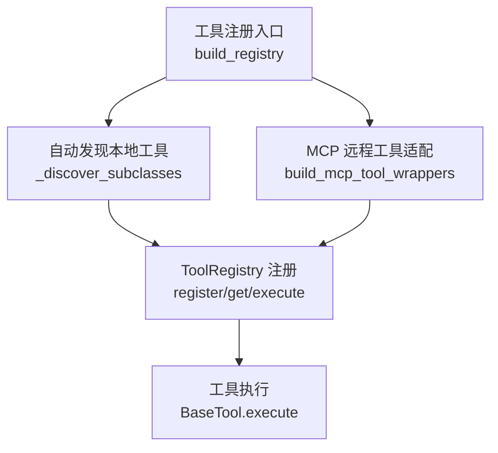
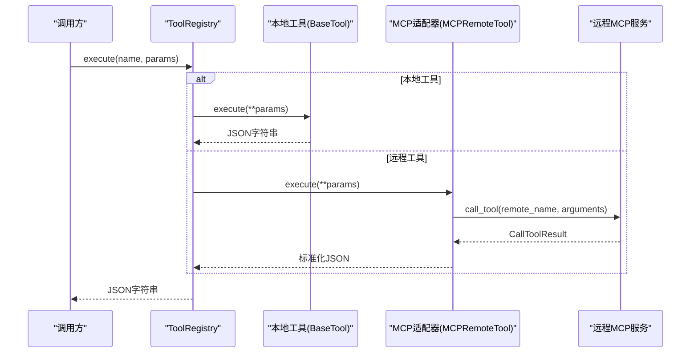
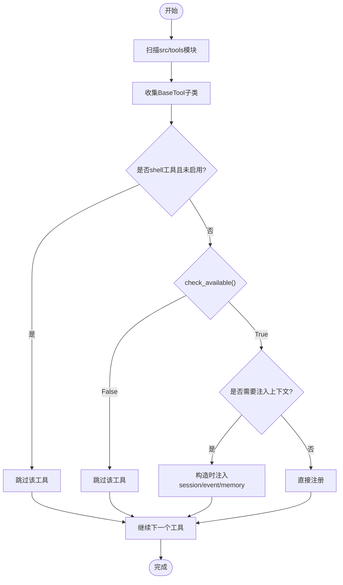
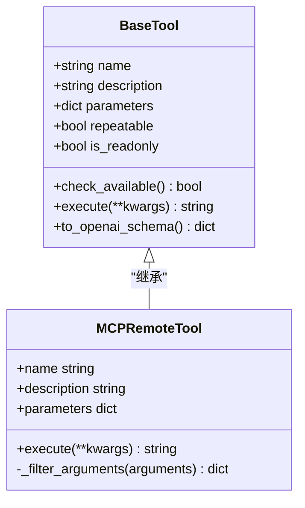
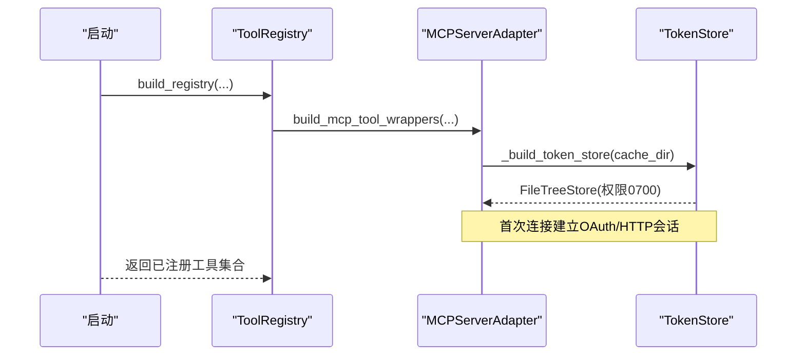
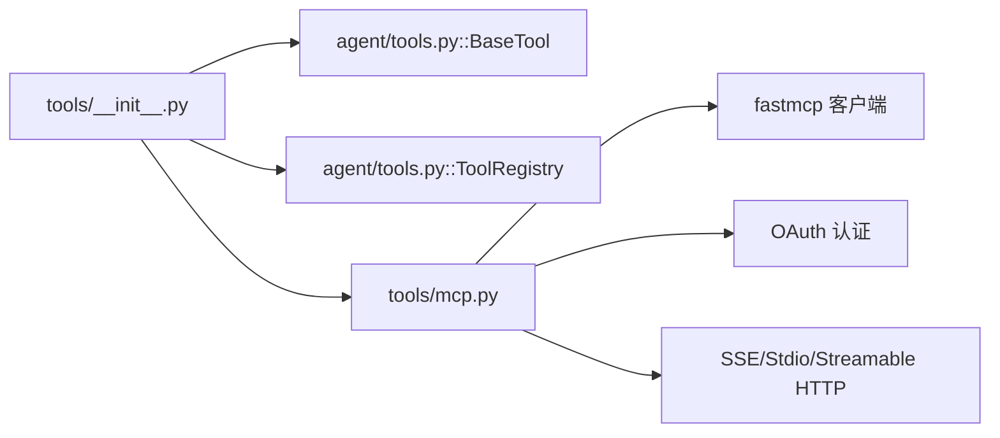

# 工具注册与发现

<cite>
**本文引用的文件**
- [agent/src/tools/__init__.py](file://agent/src/tools/__init__.py)
- [agent/src/agent/tools.py](file://agent/src/agent/tools.py)
- [agent/src/tools/mcp.py](file://agent/src/tools/mcp.py)
- [agent/src/tools/market_data_tool.py](file://agent/src/tools/market_data_tool.py)
- [agent/src/tools/web_search_tool.py](file://agent/src/tools/web_search_tool.py)
</cite>

## 目录
1. [简介](#简介)
2. [项目结构](#项目结构)
3. [核心组件](#核心组件)
4. [架构总览](#架构总览)
5. [详细组件分析](#详细组件分析)
6. [依赖关系分析](#依赖关系分析)
7. [性能考量](#性能考量)
8. [故障排查指南](#故障排查指南)
9. [结论](#结论)
10. [附录：自定义工具注册示例](#附录自定义工具注册示例)

## 简介
本文件系统性说明 Vibe-Trading 中“工具注册与发现”机制的实现原理，覆盖以下关键点：
- 工具类的自动发现、元数据提取与依赖解析
- 工具描述生成、参数 JSON Schema 验证与类型检查
- 工具生命周期管理（初始化、配置加载、资源清理）
- 自定义工具注册的完整示例（接口实现、参数与返回值约定）
- 工具冲突解决、版本管理与热重载支持

该机制以 BaseTool 抽象基类为核心，通过包扫描自动发现本地工具，并通过 MCP 适配器将远程工具包装为本地工具，统一纳入 ToolRegistry 进行调度。

## 项目结构
- 工具基础设施定义在 agent/src/agent/tools.py，包含 BaseTool 与 ToolRegistry
- 工具自动发现与装配入口在 agent/src/tools/__init__.py，提供 build_registry 等构建函数
- 远程工具适配在 agent/src/tools/mcp.py，负责 MCP 协议客户端、工具发现、名称去重与参数归一化
- 具体工具示例：
  - 市场数据获取：agent/src/tools/market_data_tool.py
  - 网络搜索：agent/src/tools/web_search_tool.py

图表来源
- [agent/src/tools/__init__.py:66-245](file://agent/src/tools/__init__.py#L66-L245)
- [agent/src/agent/tools.py:54-95](file://agent/src/agent/tools.py#L54-L95)
- [agent/src/tools/mcp.py:143-206](file://agent/src/tools/mcp.py#L143-L206)

章节来源
- [agent/src/tools/__init__.py:1-365](file://agent/src/tools/__init__.py#L1-L365)
- [agent/src/agent/tools.py:1-95](file://agent/src/agent/tools.py#L1-L95)
- [agent/src/tools/mcp.py:1-800](file://agent/src/tools/mcp.py#L1-L800)

## 核心组件
- BaseTool：所有工具的抽象基类，声明 name、description、parameters、repeatable、is_readonly，并提供 to_openai_schema 转换；check_available 用于可选依赖检测；execute 为执行入口，返回 JSON 字符串。
- ToolRegistry：维护工具实例映射，提供 register、get、get_definitions、execute 等方法，统一执行并保证返回合法 JSON。
- 自动发现：通过遍历 src/tools 包模块，收集 BaseTool 子类并过滤无效项，缓存结果避免重复导入。
- MCP 适配：将远程 MCP 工具暴露为本地 BaseTool 包装器，处理名称去重、参数归一化、调用封装与安全策略。

章节来源
- [agent/src/agent/tools.py:13-95](file://agent/src/agent/tools.py#L13-L95)
- [agent/src/tools/__init__.py:33-63](file://agent/src/tools/__init__.py#L33-L63)
- [agent/src/tools/mcp.py:123-206](file://agent/src/tools/mcp.py#L123-L206)

## 架构总览
系统由三层组成：
- 本地工具层：继承 BaseTool 的具体工具，通过包扫描自动注册
- 远程工具层：通过 MCP 协议发现并包装为本地工具
- 注册与调度层：ToolRegistry 统一管理工具生命周期与执行

图表来源
- [agent/src/agent/tools.py:72-84](file://agent/src/agent/tools.py#L72-L84)
- [agent/src/tools/mcp.py:629-665](file://agent/src/tools/mcp.py#L629-L665)
- [agent/src/tools/mcp.py:439-473](file://agent/src/tools/mcp.py#L439-L473)

## 详细组件分析

### 自动发现与注册流程
- 包扫描：遍历 src/tools 下模块，跳过下划线前缀模块，尝试导入并收集 BaseTool 子类
- 过滤策略：
  - 排除 shell 工具（除非显式启用）
  - 调用 check_available 判断依赖是否满足
  - 特殊工具注入 session_id、event_callback、persistent_memory 等上下文
- 注册顺序：先本地工具，后成功发现的 MCP 工具；单个 MCP 服务器失败不影响其他服务器或本地工具

图表来源
- [agent/src/tools/__init__.py:33-63](file://agent/src/tools/__init__.py#L33-L63)
- [agent/src/tools/__init__.py:136-154](file://agent/src/tools/__init__.py#L136-L154)

章节来源
- [agent/src/tools/__init__.py:33-63](file://agent/src/tools/__init__.py#L33-L63)
- [agent/src/tools/__init__.py:66-245](file://agent/src/tools/__init__.py#L66-L245)

### 元数据提取与参数Schema
- 本地工具：通过类属性 parameters 声明 JSON Schema，to_openai_schema 将其转换为 OpenAI function calling 格式
- 远程工具：MCP 适配器对 remote inputSchema 进行 normalize，确保兼容对象结构与 required 字段，去除空联合分支，必要时回退到空对象 schema
- 安全过滤：远程工具调用前按 schema 的 properties 白名单过滤参数，仅允许本地专用键（如 run_dir）被保留

图表来源
- [agent/src/agent/tools.py:13-51](file://agent/src/agent/tools.py#L13-L51)
- [agent/src/tools/mcp.py:629-693](file://agent/src/tools/mcp.py#L629-L693)

章节来源
- [agent/src/agent/tools.py:13-51](file://agent/src/agent/tools.py#L13-L51)
- [agent/src/tools/mcp.py:289-324](file://agent/src/tools/mcp.py#L289-L324)
- [agent/src/tools/mcp.py:667-693](file://agent/src/tools/mcp.py#L667-L693)

### 依赖解析与可用性检查
- 每个工具可重写 check_available 来探测依赖（如第三方库、API Key、环境变量）
- 若返回 False，则工具被静默排除，不进入注册表
- 示例：WebSearchTool 检查 ddgs 或 duckduckgo_search 是否安装；QVeris 工具根据配置开关决定是否可用

章节来源
- [agent/src/agent/tools.py:29-36](file://agent/src/agent/tools.py#L29-L36)
- [agent/src/tools/web_search_tool.py:139-149](file://agent/src/tools/web_search_tool.py#L139-L149)
- [agent/src/tools/qveris_tool.py:382-391](file://agent/src/tools/qveris_tool.py#L382-L391)

### 工具描述生成与类型检查
- 描述生成：BaseTool.description 直接作为 LLM 可见的工具描述；MCP 远程工具若无描述则使用默认文本
- 类型检查：参数校验基于 JSON Schema；远程工具调用前按 properties 白名单过滤参数，防止传递无关键；异常路径统一返回错误 JSON

章节来源
- [agent/src/agent/tools.py:42-51](file://agent/src/agent/tools.py#L42-L51)
- [agent/src/tools/mcp.py:667-693](file://agent/src/tools/mcp.py#L667-L693)
- [agent/src/agent/tools.py:72-84](file://agent/src/agent/tools.py#L72-L84)

### 生命周期管理
- 初始化：build_registry 在构建时创建工具实例，注入必要上下文（session_id、event_callback、persistent_memory）
- 配置加载：MCP 服务器配置从 AgentConfig 读取，支持 stdio/SSE/Streamable HTTP 传输与 OAuth 认证
- 资源清理：MCP 客户端使用上下文管理器，每次调用结束后释放连接；Token 存储使用持久化文件树，权限收紧至所有者可读
- 热重载：MCP 工具发现结果有线程安全缓存，可通过 invalidate_mcp_specs_cache 清空缓存以支持重新发现

图表来源
- [agent/src/tools/__init__.py:66-245](file://agent/src/tools/__init__.py#L66-L245)
- [agent/src/tools/mcp.py:340-367](file://agent/src/tools/mcp.py#L340-L367)
- [agent/src/tools/mcp.py:475-535](file://agent/src/tools/mcp.py#L475-L535)

章节来源
- [agent/src/tools/__init__.py:66-245](file://agent/src/tools/__init__.py#L66-L245)
- [agent/src/tools/mcp.py:340-367](file://agent/src/tools/mcp.py#L340-L367)
- [agent/src/tools/mcp.py:475-535](file://agent/src/tools/mcp.py#L475-L535)

### 工具冲突解决与版本管理
- 名称冲突：MCP 服务器名与工具名经规范化后可能冲突，系统通过哈希后缀去重，保证本地工具名唯一
- 版本管理：当前未发现显式版本号字段；建议通过 server_name 或 enabled_tools 列表区分不同版本或环境
- 热重载：invalidate_mcp_specs_cache 可清除发现缓存，配合配置变更实现“热重载”效果

章节来源
- [agent/src/tools/mcp.py:240-286](file://agent/src/tools/mcp.py#L240-L286)
- [agent/src/tools/mcp.py:766-793](file://agent/src/tools/mcp.py#L766-L793)
- [agent/src/tools/mcp.py:77-84](file://agent/src/tools/mcp.py#L77-L84)

## 依赖关系分析
- 本地工具依赖：各工具内部按需 import 第三方库，并在 check_available 中检测
- 远程工具依赖：fastmcp 客户端、OAuth、传输层（stdio/sse/streamable http）
- 注册器依赖：工具包扫描、MCP 适配器、AgentConfig

图表来源
- [agent/src/tools/__init__.py:66-245](file://agent/src/tools/__init__.py#L66-L245)
- [agent/src/agent/tools.py:13-95](file://agent/src/agent/tools.py#L13-L95)
- [agent/src/tools/mcp.py:17-41](file://agent/src/tools/mcp.py#L17-L41)

章节来源
- [agent/src/tools/__init__.py:66-245](file://agent/src/tools/__init__.py#L66-L245)
- [agent/src/tools/mcp.py:17-41](file://agent/src/tools/mcp.py#L17-L41)

## 性能考量
- 包扫描缓存：_discover_subclasses 结果缓存，避免重复导入与遍历
- MCP 发现缓存：_MCP_SPECS_CACHE 线程安全缓存，减少重复 list_tools 开销
- 重试与退避：web_search 工具对搜索引擎失败进行有限重试与退避；MCP 操作支持短暂失败重试
- 超时控制：MCP 客户端设置 init_timeout 与 tool_timeout，避免长时间阻塞

章节来源
- [agent/src/tools/__init__.py:29-63](file://agent/src/tools/__init__.py#L29-L63)
- [agent/src/tools/mcp.py:62-84](file://agent/src/tools/mcp.py#L62-L84)
- [agent/src/tools/mcp.py:521-535](file://agent/src/tools/mcp.py#L521-L535)
- [agent/src/tools/web_search_tool.py:249-285](file://agent/src/tools/web_search_tool.py#L249-L285)

## 故障排查指南
- 工具不可用：检查 check_available 返回；确认依赖包或 API Key 已配置
- 工具未注册：确认工具名未被 shell 工具策略屏蔽；查看日志中的 skipped 警告
- MCP 服务器失败：查看 warn_callback 输出与日志；确认 enabled_tools 列表与服务器可达性
- 参数错误：检查 JSON Schema 的 required 与类型；远程工具会过滤非白名单参数
- 执行异常：ToolRegistry.execute 捕获异常并返回标准错误 JSON，便于上层统一处理

章节来源
- [agent/src/tools/__init__.py:136-154](file://agent/src/tools/__init__.py#L136-L154)
- [agent/src/tools/__init__.py:155-245](file://agent/src/tools/__init__.py#L155-L245)
- [agent/src/agent/tools.py:72-84](file://agent/src/agent/tools.py#L72-L84)
- [agent/src/tools/mcp.py:439-473](file://agent/src/tools/mcp.py#L439-L473)

## 结论
Vibe-Trading 的工具注册与发现机制以 BaseTool 为核心，结合包扫描与 MCP 适配器，实现了本地与远程工具的统一接入与管理。通过 JSON Schema 描述参数、严格的参数过滤与统一的执行封装，确保了工具调用的安全性与一致性。同时，提供了依赖检测、冲突去重、缓存与重试等工程化能力，支撑复杂场景下的稳定运行。

## 附录：自定义工具注册示例
以下为自定义工具注册的步骤与要点（不展示代码内容，仅提供路径参考）：
- 创建工具类：继承 BaseTool，定义 name、description、parameters、repeatable、is_readonly
- 实现 check_available：检测依赖（如第三方库、环境变量），返回布尔值
- 实现 execute：接收 **kwargs，返回 JSON 字符串；内部进行参数校验与业务逻辑
- 注册与发现：将工具类放入 src/tools 目录下，无需额外注册，build_registry 会自动发现
- 参数与返回值：
  - 参数：使用 JSON Schema 描述，required 列出必填字段
  - 返回值：统一 JSON 字符串，错误时包含 status 与 error 字段

参考路径
- [agent/src/agent/tools.py:13-51](file://agent/src/agent/tools.py#L13-L51)
- [agent/src/tools/market_data_tool.py:11-104](file://agent/src/tools/market_data_tool.py#L11-L104)
- [agent/src/tools/web_search_tool.py:134-170](file://agent/src/tools/web_search_tool.py#L134-L170)
- [agent/src/tools/__init__.py:33-63](file://agent/src/tools/__init__.py#L33-L63)