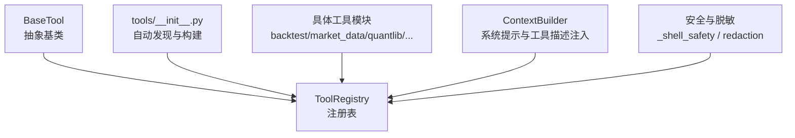
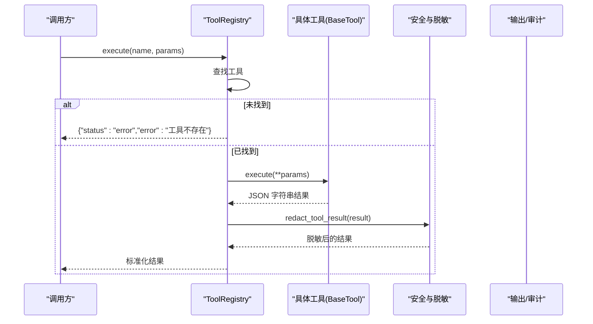
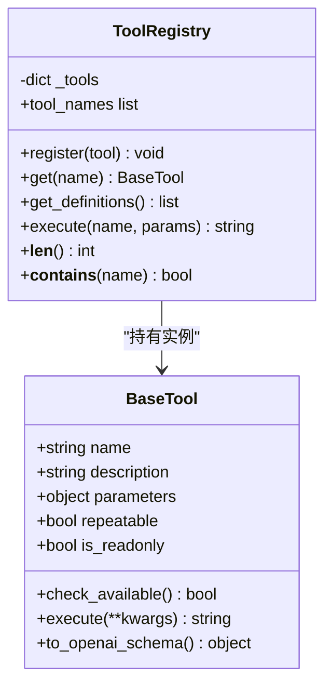
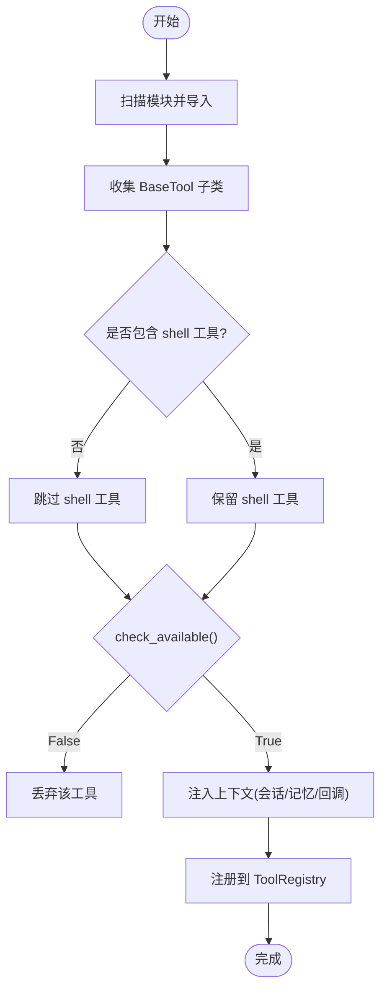
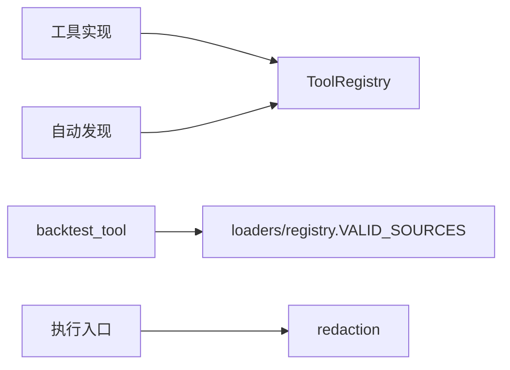

# 工具系统

<cite>
**本文引用的文件**
- [agent/src/agent/tools.py](file://agent/src/agent/tools.py)
- [agent/src/tools/__init__.py](file://agent/src/tools/__init__.py)
- [agent/src/agent/context.py](file://agent/src/agent/context.py)
- [agent/src/tools/backtest_tool.py](file://agent/src/tools/backtest_tool.py)
- [agent/src/tools/market_data_tool.py](file://agent/src/tools/market_data_tool.py)
- [agent/src/tools/quantlib_tool.py](file://agent/src/tools/quantlib_tool.py)
- [agent/src/tools/_shell_safety.py](file://agent/src/tools/_shell_safety.py)
- [agent/src/tools/redaction.py](file://agent/src/tools/redaction.py)
- [agent/backtest/loaders/registry.py](file://agent/backtest/loaders/registry.py)
- [agent/tests/test_options_payoff_tool.py](file://agent/tests/test_options_payoff_tool.py)
- [agent/tests/test_report_audit_tool.py](file://agent/tests/test_report_audit_tool.py)
- [agent/tests/test_institutional_holdings_tool.py](file://agent/tests/test_institutional_holdings_tool.py)
- [agent/tests/test_tools_type_value_safety.py](file://agent/tests/test_tools_type_value_safety.py)
</cite>

## 目录
1. [简介](#简介)
2. [项目结构](#项目结构)
3. [核心组件](#核心组件)
4. [架构总览](#架构总览)
5. [详细组件分析](#详细组件分析)
6. [依赖关系分析](#依赖关系分析)
7. [性能考量](#性能考量)
8. [故障排查指南](#故障排查指南)
9. [结论](#结论)
10. [附录：开发示例与调试技巧](#附录开发示例与调试技巧)

## 简介
本文件为 Vibe-Trading 工具系统的权威文档，聚焦以下目标：
- 工具注册机制、自动发现模式与动态加载原理
- 工具接口规范、参数校验与执行框架
- 内置工具分类与功能（回测、市场数据、金融分析等）
- 自定义工具开发流程（类定义、参数 schema、错误处理、日志记录）
- 工具调用安全控制（权限验证、资源限制、执行沙箱）
- 性能监控、缓存策略与批量处理最佳实践
- 完整开发示例与调试技巧

## 项目结构
工具系统围绕“基类 + 注册表 + 自动发现”的三层设计展开：
- 基类与执行框架：定义统一工具契约与执行入口
- 自动发现与构建：扫描模块、收集子类、按需注入上下文并组装注册表
- 工具实现：按领域划分的具体工具（回测、行情、量化计算、文件/网络等）

图表来源
- [agent/src/agent/tools.py:13-95](file://agent/src/agent/tools.py#L13-L95)
- [agent/src/tools/__init__.py:33-245](file://agent/src/tools/__init__.py#L33-L245)
- [agent/src/agent/context.py:210-336](file://agent/src/agent/context.py#L210-L336)

章节来源
- [agent/src/agent/tools.py:13-95](file://agent/src/agent/tools.py#L13-L95)
- [agent/src/tools/__init__.py:33-245](file://agent/src/tools/__init__.py#L33-L245)
- [agent/src/agent/context.py:210-336](file://agent/src/agent/context.py#L210-L336)

## 核心组件
- BaseTool：定义工具的最小契约（名称、描述、参数 schema、是否可重复、是否只读），并提供 OpenAI 函数调用格式转换。
- ToolRegistry：维护工具实例映射，提供获取、枚举、执行与异常兜底封装。
- 自动发现与构建：通过包扫描导入所有工具模块，收集 BaseTool 子类，按策略过滤（如 shell 工具）、可用性检查、上下文注入（会话 ID、持久化记忆、事件回调），并可选合并远程 MCP 工具。
- ContextBuilder：将工具描述注入系统提示，使 LLM 能理解可用能力；同时负责消息构造与结果格式化。

章节来源
- [agent/src/agent/tools.py:13-95](file://agent/src/agent/tools.py#L13-L95)
- [agent/src/tools/__init__.py:33-245](file://agent/src/tools/__init__.py#L33-L245)
- [agent/src/agent/context.py:210-336](file://agent/src/agent/context.py#L210-L336)

## 架构总览
下图展示从“请求进入”到“工具执行”的端到端流程，包括自动发现、注册、参数校验、执行与结果脱敏。

图表来源
- [agent/src/agent/tools.py:72-84](file://agent/src/agent/tools.py#L72-L84)
- [agent/src/tools/redaction.py:452-487](file://agent/src/tools/redaction.py#L452-L487)

## 详细组件分析

### 工具基类与注册表
- 基类职责
  - 声明 name/description/parameters/repeatable/is_readonly
  - check_available() 用于依赖检查（如 API Key、可选包）
  - to_openai_schema() 生成函数调用描述
  - execute(**kwargs) 返回 JSON 字符串
- 注册表职责
  - register/get/get_definitions/tool_names
  - execute(name, params) 统一捕获异常并返回结构化错误
  - 保证返回值始终为合法 JSON

图表来源
- [agent/src/agent/tools.py:13-95](file://agent/src/agent/tools.py#L13-L95)

章节来源
- [agent/src/agent/tools.py:13-95](file://agent/src/agent/tools.py#L13-L95)

### 自动发现与动态加载
- 扫描 src.tools 下所有非私有模块，导入后收集 BaseTool 子类
- 构建注册表时：
  - 过滤 shell 工具（默认关闭）
  - 调用 check_available() 跳过不可用工具
  - 注入 session_id、event_callback、persistent_memory 等上下文
  - 可选追加 MCP 远程工具（隔离失败、白名单、活券商网关）
- 支持构建全量、过滤、Swarm 专用三种注册表

图表来源
- [agent/src/tools/__init__.py:33-245](file://agent/src/tools/__init__.py#L33-L245)

章节来源
- [agent/src/tools/__init__.py:33-245](file://agent/src/tools/__init__.py#L33-L245)

### 工具接口规范与参数校验
- 参数使用 JSON Schema 描述，required/properties/type 等字段约束输入
- 工具内部对非法参数进行早检，返回结构化错误信封（避免抛出异常破坏循环）
- 测试覆盖常见非法输入场景，确保错误信息可操作且不含敏感信息

章节来源
- [agent/tests/test_institutional_holdings_tool.py:1634-1664](file://agent/tests/test_institutional_holdings_tool.py#L1634-L1664)
- [agent/tests/test_options_payoff_tool.py:100-136](file://agent/tests/test_options_payoff_tool.py#L100-L136)
- [agent/tests/test_tools_type_value_safety.py:122-158](file://agent/tests/test_tools_type_value_safety.py#L122-L158)

### 执行框架与结果处理
- 统一执行入口在 ToolRegistry.execute，捕获异常并返回标准错误结构
- 结果经 redaction 层处理，屏蔽内部路径、凭据、PII 等敏感内容
- 系统提示中注入工具描述，便于 LLM 正确选择工具

章节来源
- [agent/src/agent/tools.py:72-84](file://agent/src/agent/tools.py#L72-L84)
- [agent/src/tools/redaction.py:452-487](file://agent/src/tools/redaction.py#L452-L487)
- [agent/src/agent/context.py:324-336](file://agent/src/agent/context.py#L324-L336)

### 内置工具分类与功能

#### 回测工具
- 作用：校验 run_dir 下的 config.json 与 signal_engine.py，调用内置引擎执行回测
- 关键行为：source 白名单校验、超时保护、产物收集、进度事件
- 数据源白名单来自 backtest loaders registry

章节来源
- [agent/src/tools/backtest_tool.py:15-95](file://agent/src/tools/backtest_tool.py#L15-L95)
- [agent/backtest/loaders/registry.py:23-81](file://agent/backtest/loaders/registry.py#L23-L81)

#### 市场数据工具
- 作用：通过共享 loader 层拉取标准化 OHLCV 数据，支持多市场与自动源检测
- 关键行为：codes/start_date/end_date 必填，interval/max_rows 可选，source 枚举限定
- 适合在写脚本前优先使用该工具获取数据

章节来源
- [agent/src/tools/market_data_tool.py:11-104](file://agent/src/tools/market_data_tool.py#L11-L104)

#### 金融分析工具（QuantLib 调用）
- 作用：以白名单方式调用 src.quantlib 中的纯计算函数（期权、固收、风险、估值等）
- 安全边界：仅允许指定模块与公开函数，禁止文件写入；结果序列化带叶子数预算
- 交互模式：list/describe/call 三步走，便于探索与调试

章节来源
- [agent/src/tools/quantlib_tool.py:61-450](file://agent/src/tools/quantlib_tool.py#L61-L450)

#### 其他常用工具类别（概览）
- 文件与文档：read_file/write_file/edit_file/doc_reader/web_reader
- 搜索与信息：web_search/iwencai/sec_filings/research_papers/research_reports
- 交易与账户：trading_connector_tool/block_trades/northbound/shadow_account
- 因子与指标：factor_analysis_tool/technical_indicator_tool/pattern_tool
- 组合与风险：portfolio_risk_tool/options_chain_tool/options_pricing_tool/options_payoff_tool
- 运营与治理：report_audit_tool/sdm_* 系列工具

说明：以上类别由 tools 目录下众多工具文件构成，均遵循 BaseTool 契约并通过自动发现注册。

### 自定义工具开发流程
- 步骤
  1) 新建工具类继承 BaseTool，设置 name/description/parameters/repeatable/is_readonly
  2) 实现 execute(**kwargs)，返回 JSON 字符串；对非法输入返回结构化错误
  3) 如需外部依赖，重写 check_available() 返回 False 以静默排除
  4) 放入 src/tools/ 目录，无需额外注册即可被自动发现
- 建议
  - 参数 schema 明确 required/properties/type/description
  - 错误信息可操作且不泄露敏感信息
  - 长耗时任务配合 emit_progress 上报进度
  - 对大结果做截断或分页，避免上下文溢出

章节来源
- [agent/src/agent/tools.py:13-95](file://agent/src/agent/tools.py#L13-L95)
- [agent/src/tools/__init__.py:33-63](file://agent/src/tools/__init__.py#L33-L63)

### 安全控制机制
- Shell 安全：阻止宽泛 Python 进程终止命令，防止误杀宿主进程
- 参数与结果脱敏：递归清洗凭据键名与 PII，文本面也进行模式匹配替换
- 执行沙箱与资源限制：回测通过 Runner 执行并设置超时；shell 工具默认禁用；MCP 工具按服务器隔离与白名单
- 身份与授权：工具调用需通过上下文与策略校验（例如 live broker 工具受 mandate/kill switch 保护）

章节来源
- [agent/src/tools/_shell_safety.py:1-60](file://agent/src/tools/_shell_safety.py#L1-L60)
- [agent/src/tools/redaction.py:1-487](file://agent/src/tools/redaction.py#L1-L487)
- [agent/src/tools/__init__.py:155-245](file://agent/src/tools/__init__.py#L155-L245)
- [agent/src/tools/backtest_tool.py:57-63](file://agent/src/tools/backtest_tool.py#L57-L63)

### 性能考量
- 结果大小控制：QuantLib 工具对序列化结果进行叶子计数与截断，避免超大响应
- 数据拉取上限：市场数据工具提供 max_rows 限制，避免一次性拉取过多数据
- 超时保护：回测执行设置超时，防止长时间阻塞
- 缓存与复用：自动发现结果缓存；Loader 层可结合缓存减少重复请求（由具体 loader 实现）

章节来源
- [agent/src/tools/quantlib_tool.py:168-241](file://agent/src/tools/quantlib_tool.py#L168-L241)
- [agent/src/tools/market_data_tool.py:84-88](file://agent/src/tools/market_data_tool.py#L84-L88)
- [agent/src/tools/backtest_tool.py:57-63](file://agent/src/tools/backtest_tool.py#L57-L63)
- [agent/src/tools/__init__.py:29-63](file://agent/src/tools/__init__.py#L29-L63)

## 依赖关系分析
- 工具模块依赖 BaseTool 与 ToolRegistry
- 自动发现依赖 pkgutil/importlib 扫描与缓存
- 回测工具依赖 backtest loaders registry 的 VALID_SOURCES
- 安全与脱敏贯穿工具执行前后

图表来源
- [agent/src/tools/__init__.py:33-245](file://agent/src/tools/__init__.py#L33-L245)
- [agent/src/tools/backtest_tool.py:8-12](file://agent/src/tools/backtest_tool.py#L8-L12)
- [agent/backtest/loaders/registry.py:23-81](file://agent/backtest/loaders/registry.py#L23-L81)
- [agent/src/tools/redaction.py:452-487](file://agent/src/tools/redaction.py#L452-L487)

章节来源
- [agent/src/tools/__init__.py:33-245](file://agent/src/tools/__init__.py#L33-L245)
- [agent/src/tools/backtest_tool.py:8-12](file://agent/src/tools/backtest_tool.py#L8-L12)
- [agent/backtest/loaders/registry.py:23-81](file://agent/backtest/loaders/registry.py#L23-L81)
- [agent/src/tools/redaction.py:452-487](file://agent/src/tools/redaction.py#L452-L487)

## 性能考量
- 批量处理
  - 市场数据工具支持 codes 数组一次拉取多标的，减少往返
  - 合理设置 interval 与 max_rows 平衡精度与体积
- 缓存策略
  - 自动发现结果缓存，避免重复扫描
  - Loader 层可按实现启用本地缓存或幂等请求
- 超时与限流
  - 回测执行设置超时，避免长时间占用
  - 对远端 MCP 工具连接失败进行隔离，不影响本地工具

[本节为通用指导，不直接分析具体文件]

## 故障排查指南
- 工具未注册
  - 检查模块是否位于 src/tools/ 且类名继承 BaseTool
  - 确认 check_available() 返回 True
  - 查看构建日志中的跳过原因
- 参数校验失败
  - 对照 parameters 的 required/properties/type 检查入参
  - 关注错误信息中的关键字段提示
- 执行异常
  - ToolRegistry 会捕获异常并返回结构化错误，检查 error 字段
  - 对长耗时任务，检查超时与资源限制
- 敏感信息泄露
  - 确认结果经 redaction 处理；若仍出现，检查上游是否绕过统一出口
- Shell 工具被禁用
  - 确认 include_shell_tools 配置；生产环境建议保持关闭

章节来源
- [agent/src/tools/__init__.py:136-154](file://agent/src/tools/__init__.py#L136-L154)
- [agent/src/agent/tools.py:72-84](file://agent/src/agent/tools.py#L72-L84)
- [agent/tests/test_report_audit_tool.py:246-271](file://agent/tests/test_report_audit_tool.py#L246-L271)

## 结论
Vibe-Trading 的工具系统以 BaseTool + ToolRegistry + 自动发现为核心，提供统一的接口规范、安全的执行框架与丰富的内置工具集。通过严格的参数校验、结果脱敏、超时与沙箱控制，既保证了扩展性与易用性，又确保了在生产环境的安全与稳定。建议在新增工具时严格遵循契约与安全实践，并结合性能优化策略提升整体吞吐与可靠性。

## 附录：开发示例与调试技巧
- 最小工具模板
  - 继承 BaseTool，设置 name/description/parameters
  - 实现 execute(**kwargs)，返回 JSON 字符串
  - 如需依赖检查，重写 check_available()
- 调试技巧
  - 使用 build_registry().get("your_tool") 验证是否自动发现
  - 打印 tool.to_openai_schema() 检查参数 schema
  - 对非法输入构造用例，确保返回结构化错误
  - 对长耗时任务，增加 emit_progress 观察阶段
- 参考测试
  - 工具自动发现与只读标记：options_payoff、cashflow_performance
  - 参数校验与错误信封：institutional_holdings、options_payoff
  - 类型安全与防错：place_order 参数校验

章节来源
- [agent/tests/test_options_payoff_tool.py:72-97](file://agent/tests/test_options_payoff_tool.py#L72-L97)
- [agent/tests/test_cashflow_analytics_tool.py:221-237](file://agent/tests/test_cashflow_analytics_tool.py#L221-L237)
- [agent/tests/test_institutional_holdings_tool.py:1634-1664](file://agent/tests/test_institutional_holdings_tool.py#L1634-L1664)
- [agent/tests/test_tools_type_value_safety.py:122-158](file://agent/tests/test_tools_type_value_safety.py#L122-L158)