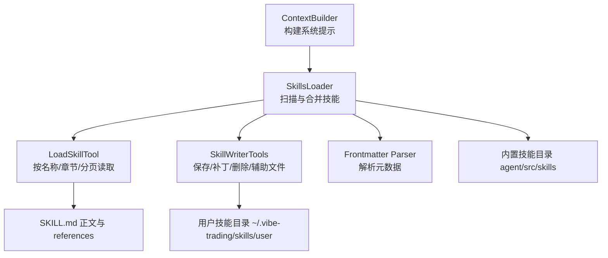
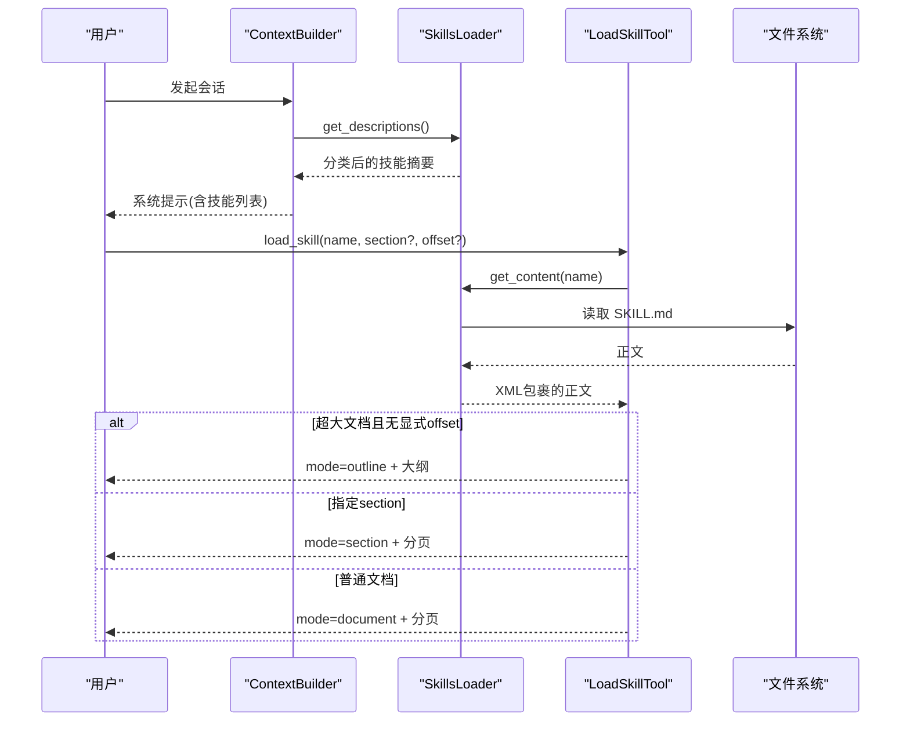
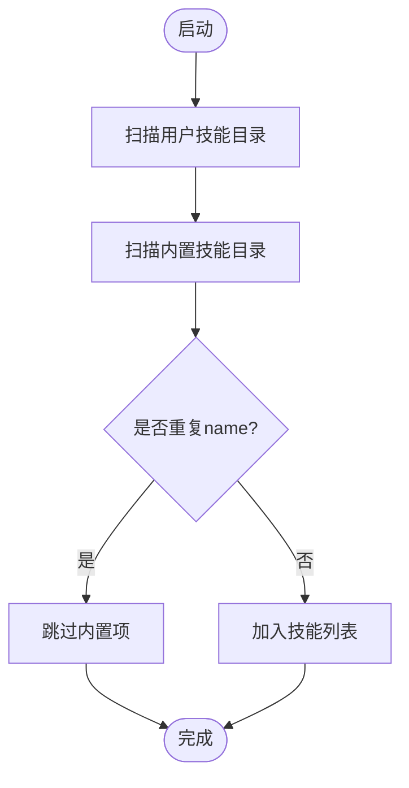
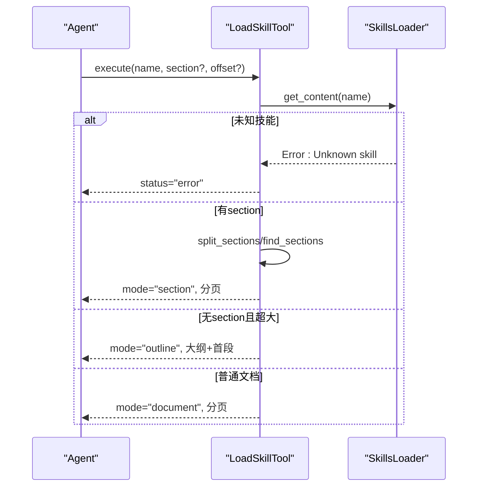
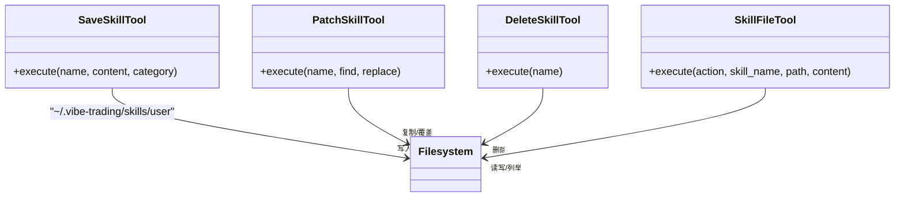
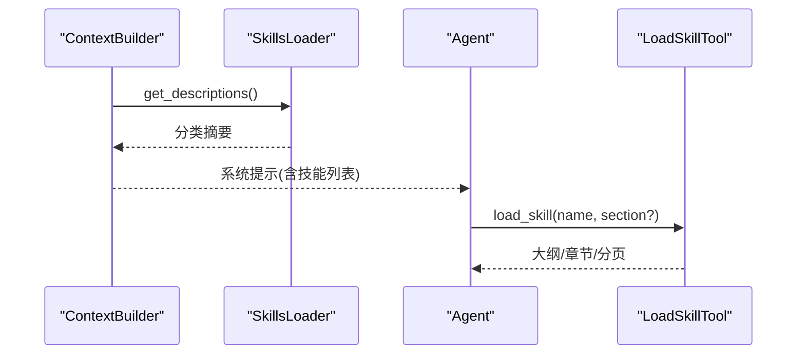
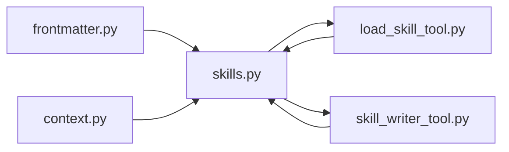

# 技能系统

<cite>
**本文引用的文件**
- [agent/src/agent/skills.py](file://agent/src/agent/skills.py)
- [agent/src/agent/frontmatter.py](file://agent/src/agent/frontmatter.py)
- [agent/src/tools/load_skill_tool.py](file://agent/src/tools/load_skill_tool.py)
- [agent/src/tools/skill_writer_tool.py](file://agent/src/tools/skill_writer_tool.py)
- [agent/src/agent/context.py](file://agent/src/agent/context.py)
- [agent/src/governance/manifest.py](file://agent/src/governance/manifest.py)
- [agent/src/skills/eastmoney/SKILL.md](file://agent/src/skills/eastmoney/SKILL.md)
- [agent/src/skills/tushare/SKILL.md](file://agent/src/skills/tushare/SKILL.md)
- [agent/tests/test_agent_output_discipline.py](file://agent/tests/test_agent_output_discipline.py)
</cite>

## 目录
1. [简介](#简介)
2. [项目结构](#项目结构)
3. [核心组件](#核心组件)
4. [架构总览](#架构总览)
5. [详细组件分析](#详细组件分析)
6. [依赖关系分析](#依赖关系分析)
7. [性能考虑](#性能考虑)
8. [故障排查指南](#故障排查指南)
9. [结论](#结论)
10. [附录](#附录)

## 简介
本文件为 Vibe-Trading 的“技能系统”提供全面文档。内容涵盖：
- 技能的定义格式、元数据结构与加载机制
- 技能的生命周期管理（安装、更新、卸载与版本控制）
- 技能的发现机制（本地扫描、用户覆盖、动态加载）
- 技能的执行框架（参数传递、上下文注入、结果处理）
- 技能开发指南（SKILL.md 编写、脚本开发与测试验证）
- 现有技能使用示例与自定义技能最佳实践

## 项目结构
技能系统围绕以下关键路径组织：
- 内置技能目录：agent/src/skills/<skill-name>/，每个技能包含 SKILL.md 及可选 references/templates/examples/assets/scripts
- 用户技能目录：~/.vibe-trading/skills/user/<skill-name>/，用于保存、覆盖和扩展内置技能
- 技能加载器：agent/src/agent/skills.py，负责从用户目录与内置目录扫描并合并技能
- 技能读取工具：agent/src/tools/load_skill_tool.py，提供大纲/章节/分页三种读取模式
- 技能写入与管理工具：agent/src/tools/skill_writer_tool.py，提供保存、补丁、删除与辅助文件管理
- 上下文构建：agent/src/agent/context.py，将技能摘要注入系统提示，驱动按需加载
- 元数据解析：agent/src/agent/frontmatter.py，解析 SKILL.md 的 frontmatter

图表来源
- [agent/src/agent/context.py:235-268](file://agent/src/agent/context.py#L235-L268)
- [agent/src/agent/skills.py:100-164](file://agent/src/agent/skills.py#L100-L164)
- [agent/src/tools/load_skill_tool.py:150-307](file://agent/src/tools/load_skill_tool.py#L150-L307)
- [agent/src/tools/skill_writer_tool.py:48-370](file://agent/src/tools/skill_writer_tool.py#L48-L370)
- [agent/src/agent/frontmatter.py:16-49](file://agent/src/agent/frontmatter.py#L16-L49)

章节来源
- [agent/src/agent/context.py:235-268](file://agent/src/agent/context.py#L235-L268)
- [agent/src/agent/skills.py:100-164](file://agent/src/agent/skills.py#L100-L164)
- [agent/src/tools/load_skill_tool.py:150-307](file://agent/src/tools/load_skill_tool.py#L150-L307)
- [agent/src/tools/skill_writer_tool.py:48-370](file://agent/src/tools/skill_writer_tool.py#L48-L370)
- [agent/src/agent/frontmatter.py:16-49](file://agent/src/agent/frontmatter.py#L16-L49)

## 核心组件
- Skill 数据模型：封装技能名、描述、分类、正文、目录路径与元数据，支持按需加载辅助文件
- SkillsLoader：从用户目录与内置目录扫描 SKILL.md，去重合并，生成分类摘要与全文检索
- Frontmatter 解析：解析 YAML-like 头部，提取 name/description/category 等字段
- LoadSkillTool：以 JSON 信封返回文档大纲、指定章节或字符分页；保证不超过工具结果限制
- SkillWriterTools：save_skill/patch_skill/delete_skill/skill_file，实现用户技能的全生命周期管理
- ContextBuilder：在系统提示中注入技能摘要，驱动“按需加载”策略

章节来源
- [agent/src/agent/skills.py:22-60](file://agent/src/agent/skills.py#L22-L60)
- [agent/src/agent/skills.py:100-164](file://agent/src/agent/skills.py#L100-L164)
- [agent/src/agent/frontmatter.py:16-49](file://agent/src/agent/frontmatter.py#L16-L49)
- [agent/src/tools/load_skill_tool.py:150-307](file://agent/src/tools/load_skill_tool.py#L150-L307)
- [agent/src/tools/skill_writer_tool.py:48-370](file://agent/src/tools/skill_writer_tool.py#L48-L370)
- [agent/src/agent/context.py:235-268](file://agent/src/agent/context.py#L235-L268)

## 架构总览
技能系统采用“渐进式披露”设计：
- 系统提示仅注入技能一行摘要，减少上下文占用
- 完整文档通过 load_skill 按需加载，支持大纲导航与章节定位
- 超长文档自动转为“大纲+首段”，后续可按标题精确拉取章节
- 用户技能优先于内置技能，便于覆盖与热修复

图表来源
- [agent/src/agent/context.py:235-268](file://agent/src/agent/context.py#L235-L268)
- [agent/src/agent/skills.py:166-189](file://agent/src/agent/skills.py#L166-L189)
- [agent/src/tools/load_skill_tool.py:196-307](file://agent/src/tools/load_skill_tool.py#L196-L307)

## 详细组件分析

### 技能定义与元数据结构
- SKILL.md 必须包含 frontmatter 头部，至少声明 name；可选 description、category
- 正文可包含多级标题，系统将自动切分为章节，支持“父级 > 子级”的路径寻址
- 支持 references/templates/examples/assets 等辅助目录，供脚本与模板引用

章节来源
- [agent/src/agent/frontmatter.py:16-49](file://agent/src/agent/frontmatter.py#L16-L49)
- [agent/src/agent/skills.py:22-60](file://agent/src/agent/skills.py#L22-L60)
- [agent/src/skills/eastmoney/SKILL.md:1-99](file://agent/src/skills/eastmoney/SKILL.md#L1-L99)
- [agent/src/skills/tushare/SKILL.md:1-284](file://agent/src/skills/tushare/SKILL.md#L1-L284)

### 技能发现与加载机制
- 扫描顺序：先用户目录，再内置目录；同名技能用户覆盖内置
- 去重策略：基于 name 字段，首次出现者保留
- 动态加载：get_content 支持会话期间新增的用户技能即时生效
- 分类展示：按预设类别顺序输出，未列出类别置于末尾

图表来源
- [agent/src/agent/skills.py:120-136](file://agent/src/agent/skills.py#L120-L136)
- [agent/src/agent/skills.py:143-164](file://agent/src/agent/skills.py#L143-L164)

章节来源
- [agent/src/agent/skills.py:120-164](file://agent/src/agent/skills.py#L120-L164)

### 技能读取与执行框架
- 三种模式：
  - document：整篇文档的分页读取
  - outline：超大文档的首次响应，返回大纲与首段，便于按标题精准拉取
  - section：按标题或“父级 > 子级”路径精确读取章节
- 分页策略：受限于工具结果上限，自动收缩页面大小，确保不超限
- 错误处理：未知技能、偏移越界、章节歧义均有明确错误信封

图表来源
- [agent/src/tools/load_skill_tool.py:196-307](file://agent/src/tools/load_skill_tool.py#L196-L307)
- [agent/src/agent/skills.py:229-387](file://agent/src/agent/skills.py#L229-L387)

章节来源
- [agent/src/tools/load_skill_tool.py:196-307](file://agent/src/tools/load_skill_tool.py#L196-L307)
- [agent/src/agent/skills.py:229-387](file://agent/src/agent/skills.py#L229-L387)

### 生命周期管理（安装、更新、卸载、版本控制）
- 安装：通过 save_skill 创建用户技能，自动生成 SKILL.md 与必要目录
- 更新：通过 patch_skill 对文本进行替换；若目标为内置技能，会先复制到用户目录再修改
- 卸载：通过 delete_skill 删除用户技能及其全部文件
- 辅助文件：通过 skill_file 的 write/remove/list 管理 references/templates/examples/assets
- 版本控制：当前实现基于文件系统快照；建议结合外部版本管理（如 Git）维护变更历史

图表来源
- [agent/src/tools/skill_writer_tool.py:48-370](file://agent/src/tools/skill_writer_tool.py#L48-L370)

章节来源
- [agent/src/tools/skill_writer_tool.py:48-370](file://agent/src/tools/skill_writer_tool.py#L48-L370)

### 上下文注入与执行流程
- 系统提示注入技能摘要，使 Agent 知晓可用技能集合
- 实际文档按需加载，避免一次性注入导致上下文膨胀
- 治理层记录 manifest，便于审计与复现

图表来源
- [agent/src/agent/context.py:235-268](file://agent/src/agent/context.py#L235-L268)
- [agent/src/tools/load_skill_tool.py:196-307](file://agent/src/tools/load_skill_tool.py#L196-L307)

章节来源
- [agent/src/agent/context.py:235-268](file://agent/src/agent/context.py#L235-L268)
- [agent/src/governance/manifest.py:24-45](file://agent/src/governance/manifest.py#L24-L45)

### 现有技能使用示例
- 东方财富（eastmoney）：提供资金面、龙虎榜、研报舆情、财务报表、选股检索等接口索引与调用约定
- Tushare：提供股票、基金、期货、宏观等多类数据接口索引与参数说明

章节来源
- [agent/src/skills/eastmoney/SKILL.md:1-99](file://agent/src/skills/eastmoney/SKILL.md#L1-L99)
- [agent/src/skills/tushare/SKILL.md:1-284](file://agent/src/skills/tushare/SKILL.md#L1-L284)

### 自定义技能开发最佳实践
- 规范 SKILL.md：
  - 明确 name、description、category
  - 使用清晰的标题层级，便于大纲导航
  - 在正文中给出参数格式、返回格式、链接约定（references/ 前缀）
- 组织辅助资源：
  - references：接口参考、字段说明
  - scripts：调用示例脚本
  - templates：配置/代码模板
  - examples：端到端用例
- 测试与验证：
  - 使用 save_skill 创建后，立即用 load_skill 校验大纲与章节
  - 针对长文档，优先使用 section 模式验证章节定位
  - 利用测试夹具快速构造多技能环境进行回归验证

章节来源
- [agent/src/tools/skill_writer_tool.py:48-111](file://agent/src/tools/skill_writer_tool.py#L48-L111)
- [agent/tests/test_agent_output_discipline.py:515-545](file://agent/tests/test_agent_output_discipline.py#L515-L545)

## 依赖关系分析
- SkillsLoader 依赖 frontmatter 解析与文件系统
- LoadSkillTool 依赖 SkillsLoader 与章节分割/查找工具函数
- ContextBuilder 依赖 SkillsLoader 获取技能摘要
- SkillWriterTools 直接操作用户技能目录，必要时复制内置技能到用户目录

图表来源
- [agent/src/agent/frontmatter.py:16-49](file://agent/src/agent/frontmatter.py#L16-L49)
- [agent/src/agent/skills.py:100-164](file://agent/src/agent/skills.py#L100-L164)
- [agent/src/tools/load_skill_tool.py:150-307](file://agent/src/tools/load_skill_tool.py#L150-L307)
- [agent/src/tools/skill_writer_tool.py:48-370](file://agent/src/tools/skill_writer_tool.py#L48-L370)
- [agent/src/agent/context.py:235-268](file://agent/src/agent/context.py#L235-L268)

章节来源
- [agent/src/agent/skills.py:100-164](file://agent/src/agent/skills.py#L100-L164)
- [agent/src/tools/load_skill_tool.py:150-307](file://agent/src/tools/load_skill_tool.py#L150-L307)
- [agent/src/tools/skill_writer_tool.py:48-370](file://agent/src/tools/skill_writer_tool.py#L48-L370)
- [agent/src/agent/context.py:235-268](file://agent/src/agent/context.py#L235-L268)

## 性能考虑
- 渐进式披露：系统提示仅注入摘要，大幅降低上下文开销
- 大纲优先：超大文档首次返回大纲，避免逐页盲翻
- 自适应分页：根据序列化体积动态调整页面大小，确保不超限
- 章节定位：通过标题路径精确定位，减少不必要读取

[本节为通用指导，无需特定文件来源]

## 故障排查指南
- 未知技能：检查 name 是否正确，确认用户目录或内置目录存在对应 SKILL.md
- 章节歧义：当标题重复时，需使用“父级 > 子级”路径唯一标识
- 偏移越界：确认 offset 未超过文档或章节长度
- 无法找到 section：确认文档包含有效标题，且未被 fenced code block 干扰
- 用户技能未生效：确认 save_skill 已写入用户目录，并在后续会话重新加载

章节来源
- [agent/src/tools/load_skill_tool.py:213-273](file://agent/src/tools/load_skill_tool.py#L213-L273)
- [agent/src/agent/skills.py:166-189](file://agent/src/agent/skills.py#L166-L189)

## 结论
Vibe-Trading 的技能系统通过“渐进式披露 + 大纲导航 + 章节定位 + 用户覆盖”的设计，实现了高效、可扩展、可维护的技能生态。开发者可基于 SKILL.md 与辅助目录快速构建领域知识包，并通过标准化工具链进行全生命周期管理。

[本节为总结性内容，无需特定文件来源]

## 附录
- 推荐工作流：
  - 新建技能：save_skill → 编写 SKILL.md → 添加 references/scripts/templates
  - 调试技能：load_skill(name) → 查看 outline → 按 section 拉取 → 验证分页
  - 更新技能：patch_skill → 验证变更 → 提交版本管理
  - 删除技能：delete_skill → 清理残留文件
- 安全与合规：
  - 辅助文件路径白名单校验，防止路径穿越
  - 禁止直接删除 SKILL.md（需通过 delete_skill）
  - 用户技能与内置技能隔离，避免污染

[本节为补充信息，无需特定文件来源]