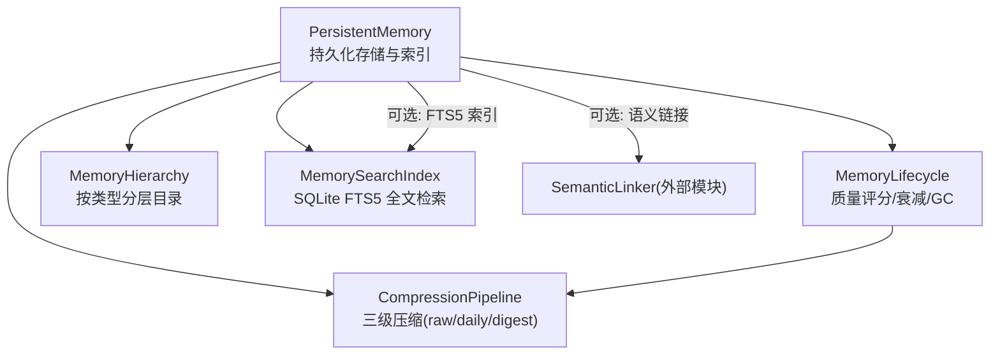
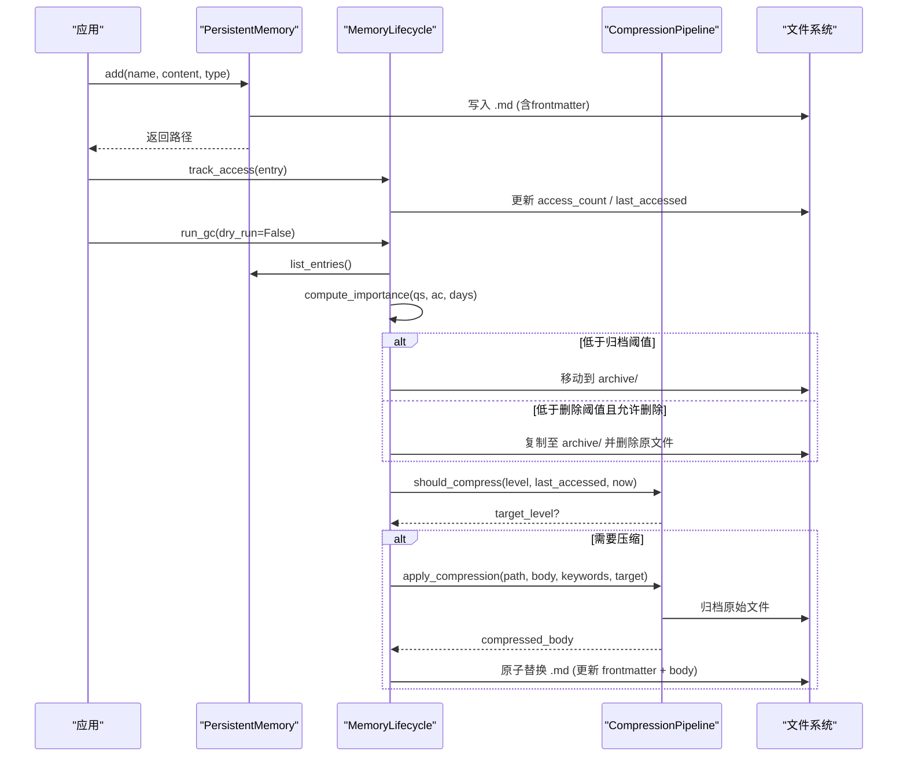
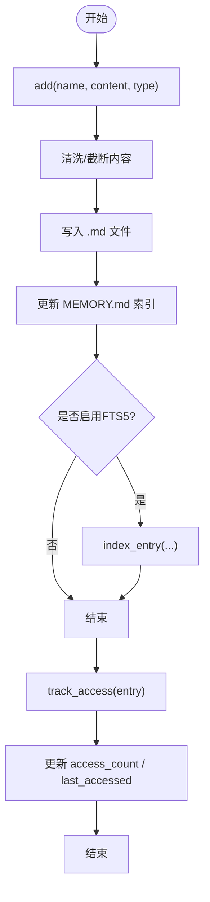
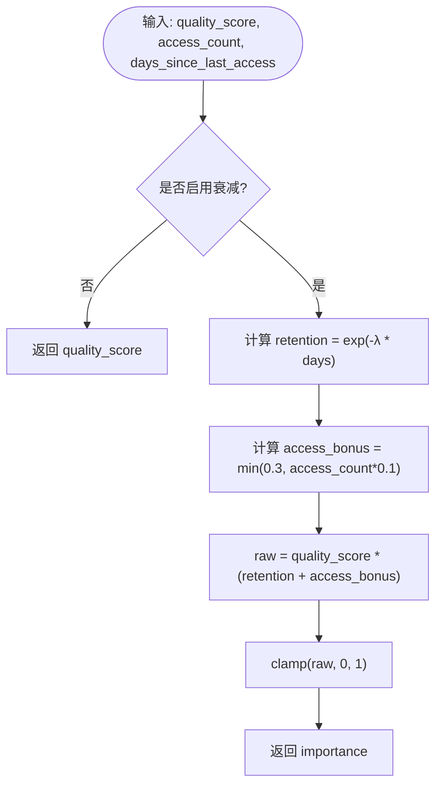
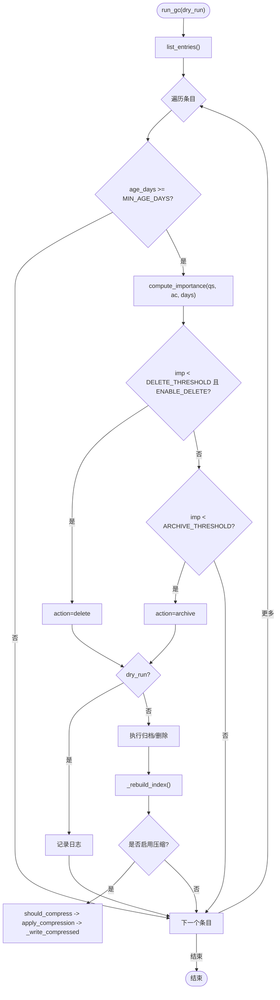
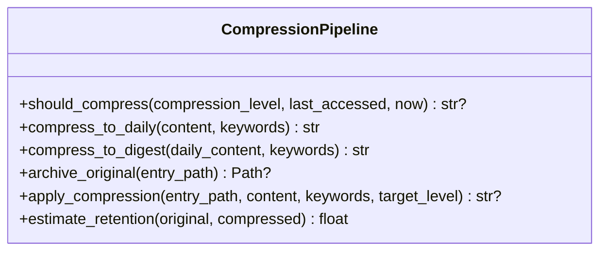
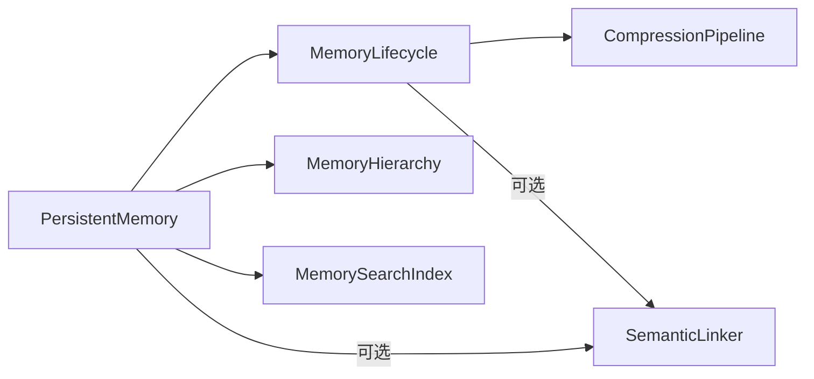

# 记忆生命周期管理

<cite>
**本文引用的文件**
- [agent/src/memory/lifecycle.py](file://agent/src/memory/lifecycle.py)
- [agent/src/memory/compression.py](file://agent/src/memory/compression.py)
- [agent/src/memory/persistent.py](file://agent/src/memory/persistent.py)
- [agent/src/memory/hierarchy.py](file://agent/src/memory/hierarchy.py)
- [agent/src/memory/search_index.py](file://agent/src/memory/search_index.py)
- [agent/src/config/env_schema.py](file://agent/src/config/env_schema.py)
- [agent/src/config/accessor.py](file://agent/src/config/accessor.py)
- [agent/tests/test_memory_lifecycle.py](file://agent/tests/test_memory_lifecycle.py)
</cite>

## 目录
1. [简介](#简介)
2. [项目结构](#项目结构)
3. [核心组件](#核心组件)
4. [架构总览](#架构总览)
5. [详细组件分析](#详细组件分析)
6. [依赖关系分析](#依赖关系分析)
7. [性能考量](#性能考量)
8. [故障排查指南](#故障排查指南)
9. [结论](#结论)
10. [附录：配置与最佳实践](#附录配置与最佳实践)

## 简介
本文件系统性说明记忆系统的生命周期管理，覆盖记忆的创建、激活（访问追踪）、休眠（重要性衰减）与销毁（归档/删除），并详解自动垃圾回收机制（访问频率统计、时间衰减算法、存储空间监控）。进一步阐述记忆压缩策略（文本压缩、去重合并、格式优化）、迁移与版本管理（数据格式升级、兼容性处理、备份恢复），并提供生命周期监控工具（状态查询、性能分析、故障诊断）以及配置示例与最佳实践。

## 项目结构
记忆系统由多个模块协作完成：
- 持久化存储与索引：persistent.py
- 生命周期管理：lifecycle.py
- 压缩流水线：compression.py
- 层级目录路由：hierarchy.py
- 全文检索索引：search_index.py
- 配置开关与环境变量：env_schema.py, accessor.py

图表来源
- [agent/src/memory/persistent.py:196-637](file://agent/src/memory/persistent.py#L196-L637)
- [agent/src/memory/lifecycle.py:71-421](file://agent/src/memory/lifecycle.py#L71-L421)
- [agent/src/memory/compression.py:160-353](file://agent/src/memory/compression.py#L160-L353)
- [agent/src/memory/hierarchy.py:34-436](file://agent/src/memory/hierarchy.py#L34-L436)
- [agent/src/memory/search_index.py:113-481](file://agent/src/memory/search_index.py#L113-L481)

章节来源
- [agent/src/memory/persistent.py:196-637](file://agent/src/memory/persistent.py#L196-L637)
- [agent/src/memory/lifecycle.py:71-421](file://agent/src/memory/lifecycle.py#L71-L421)
- [agent/src/memory/compression.py:160-353](file://agent/src/memory/compression.py#L160-L353)
- [agent/src/memory/hierarchy.py:34-436](file://agent/src/memory/hierarchy.py#L34-L436)
- [agent/src/memory/search_index.py:113-481](file://agent/src/memory/search_index.py#L113-L481)

## 核心组件
- PersistentMemory：负责记忆条目读写、前元数据解析、重复检测、索引更新、搜索（含FTS5回退）、语义链接集成。
- MemoryLifecycle：封装质量评分、访问追踪、重要性衰减、垃圾回收（归档/删除）、压缩触发与写入。
- CompressionPipeline：实现三级压缩（raw→daily→digest），包含TF-IDF关键句抽取、摘要生成、原始内容归档、保留率估算。
- MemoryHierarchy：将记忆按类型路由到子目录，支持扁平兼容、扩展名修复、关键词优先级扫描。
- MemorySearchIndex：基于SQLite FTS5的全文检索索引，提供增删改查与批量重建，支持CJK分词与查询安全化。
- 配置层：通过环境变量VT_MEMORY及VT_MEMORY_*控制功能开关，支持预设off/on/full。

章节来源
- [agent/src/memory/persistent.py:196-637](file://agent/src/memory/persistent.py#L196-L637)
- [agent/src/memory/lifecycle.py:71-421](file://agent/src/memory/lifecycle.py#L71-L421)
- [agent/src/memory/compression.py:160-353](file://agent/src/memory/compression.py#L160-L353)
- [agent/src/memory/hierarchy.py:34-436](file://agent/src/memory/hierarchy.py#L34-L436)
- [agent/src/memory/search_index.py:113-481](file://agent/src/memory/search_index.py#L113-L481)
- [agent/src/config/env_schema.py:411-546](file://agent/src/config/env_schema.py#L411-L546)

## 架构总览
记忆从创建到销毁的关键路径如下：
- 创建：PersistentMemory.add() 写入带前元数据的Markdown文件，更新MEMORY.md索引，可选写入FTS5索引与语义链接。
- 激活：调用track_access()增加access_count与last_accessed；搜索时根据importance加权排序。
- 休眠：compute_importance()依据quality_score、access_count与days_since_last_access计算重要性，启用衰减时按指数衰减。
- 销毁：run_gc()评估阈值，执行archive或delete，并触发压缩；压缩后原子写回frontmatter与正文。

图表来源
- [agent/src/memory/persistent.py:462-578](file://agent/src/memory/persistent.py#L462-L578)
- [agent/src/memory/lifecycle.py:183-379](file://agent/src/memory/lifecycle.py#L183-L379)
- [agent/src/memory/compression.py:168-334](file://agent/src/memory/compression.py#L168-L334)

## 详细组件分析

### 记忆创建与激活
- 创建流程：
  - 名称规范化与slug生成，内容清洗与截断，生成唯一id与时间戳。
  - 写入frontmatter与正文，更新MEMORY.md索引。
  - 若开启FTS5索引，则index_entry；若开启语义链接，则discover_links并保存。
- 激活流程：
  - track_access()在内存锁保护下递增access_count与更新时间。
  - 搜索时，若开启decay，则importance参与权重；否则仅token匹配。

图表来源
- [agent/src/memory/persistent.py:462-578](file://agent/src/memory/persistent.py#L462-L578)
- [agent/src/memory/lifecycle.py:164-178](file://agent/src/memory/lifecycle.py#L164-L178)

章节来源
- [agent/src/memory/persistent.py:462-578](file://agent/src/memory/persistent.py#L462-L578)
- [agent/src/memory/lifecycle.py:164-178](file://agent/src/memory/lifecycle.py#L164-L178)

### 记忆休眠与重要性衰减
- 重要性计算：
  - 启用衰减时，retention = exp(-λ * days_since_last_access)，access_bonus = min(0.3, access_count * 0.1)。
  - importance = clamp(quality_score * (retention + access_bonus), 0, 1)。
- 搜索加权：
  - 若启用衰减，最终得分乘以(0.5 + 0.5 * importance)。
- 质量评分强化：
  - reinforce()根据事件类型调整quality_score，限制会话内最大增量，支持user/system源折扣。

图表来源
- [agent/src/memory/persistent.py:75-92](file://agent/src/memory/persistent.py#L75-L92)
- [agent/src/memory/lifecycle.py:112-158](file://agent/src/memory/lifecycle.py#L112-L158)

章节来源
- [agent/src/memory/persistent.py:75-92](file://agent/src/memory/persistent.py#L75-L92)
- [agent/src/memory/lifecycle.py:112-158](file://agent/src/memory/lifecycle.py#L112-L158)

### 自动垃圾回收机制
- 触发条件：
  - 条目年龄≥MIN_AGE_DAYS（默认7天）。
  - 计算importance并与阈值比较：低于ARCHIVE_THRESHOLD归档，低于DELETE_THRESHOLD删除（可配置为仅归档）。
- 动作执行：
  - 归档：移动至archive目录。
  - 删除：先复制到archive再删除原文件。
  - 记录gc.log（dry_run模式不修改文件）。
- 压缩联动：
  - 非dry_run且启用压缩时，对老化条目执行压缩并原子写回。

图表来源
- [agent/src/memory/lifecycle.py:183-379](file://agent/src/memory/lifecycle.py#L183-L379)
- [agent/src/memory/compression.py:168-334](file://agent/src/memory/compression.py#L168-L334)

章节来源
- [agent/src/memory/lifecycle.py:183-379](file://agent/src/memory/lifecycle.py#L183-L379)
- [agent/src/memory/compression.py:168-334](file://agent/src/memory/compression.py#L168-L334)

### 记忆压缩策略
- 三级压缩：
  - raw → daily：使用TF-IDF句子打分，保留首尾句与Top-K关键句，附加keywords上下文头。
  - daily → digest：提取Top-N重要术语，生成要点列表。
- 触发条件：
  - 基于last_accessed与当前时间的天数差，超过DAILY_THRESHOLD_DAYS或DIGEST_THRESHOLD_DAYS即升级压缩级别。
- 安全与保留率：
  - 压缩前归档原始文件；压缩后原子替换文件；估算信息保留率（Jaccard重叠）。

图表来源
- [agent/src/memory/compression.py:160-353](file://agent/src/memory/compression.py#L160-L353)

章节来源
- [agent/src/memory/compression.py:160-353](file://agent/src/memory/compression.py#L160-L353)

### 记忆迁移与版本管理
- 层级路由与兼容：
  - 新写入按memory_type路由到category子目录；旧扁平文件仍被扫描识别。
  - recover_extensionless_entries()修复缺失“.md”后缀的孤儿条目。
  - migrate_flat_entry()可将扁平条目迁移到对应分类目录。
- 数据格式升级：
  - frontmatter新增字段（如compression_level、related_memories等）具备默认值与容错解析。
  - id自动生成与校验，keywords与related_memories过滤非法值。
- 备份恢复：
  - 压缩前自动归档原始文件至archive目录；GC归档/删除也保留副本。
  - 可通过archive目录恢复历史版本。

章节来源
- [agent/src/memory/hierarchy.py:92-143](file://agent/src/memory/hierarchy.py#L92-L143)
- [agent/src/memory/hierarchy.py:381-436](file://agent/src/memory/hierarchy.py#L381-L436)
- [agent/src/memory/persistent.py:222-307](file://agent/src/memory/persistent.py#L222-L307)
- [agent/src/memory/compression.py:258-291](file://agent/src/memory/compression.py#L258-L291)

### 生命周期监控工具
- 状态查询：
  - list_entries()获取所有条目；find()/find_relevant()按名称或关键词检索。
  - snapshot属性提供冻结索引用于系统提示注入。
- 性能分析：
  - FTS5索引加速搜索；层级扫描减少O(n)全量扫描。
  - 压缩降低存储与IO压力；保留率指标辅助评估压缩效果。
- 故障诊断：
  - gc.log记录GC决策与模式（dry_run/execute）。
  - 日志输出锁定超时、压缩失败、FTS5不可用等异常信息。

章节来源
- [agent/src/memory/persistent.py:309-438](file://agent/src/memory/persistent.py#L309-L438)
- [agent/src/memory/search_index.py:252-302](file://agent/src/memory/search_index.py#L252-L302)
- [agent/src/memory/lifecycle.py:300-318](file://agent/src/memory/lifecycle.py#L300-L318)

## 依赖关系分析
- 模块耦合：
  - lifecycle依赖persistent进行读写与索引重建；compression独立但被lifecycle调用；hierarchy与search_index作为可选增强。
- 外部依赖：
  - SQLite FTS5用于全文检索；fcntl文件锁用于并发安全；Pydantic模型用于配置解析。
- 循环依赖规避：
  - 配置读取采用延迟导入；FTS5与语义链接按需加载，避免启动时强依赖。

图表来源
- [agent/src/memory/persistent.py:196-637](file://agent/src/memory/persistent.py#L196-L637)
- [agent/src/memory/lifecycle.py:71-421](file://agent/src/memory/lifecycle.py#L71-L421)
- [agent/src/memory/compression.py:160-353](file://agent/src/memory/compression.py#L160-L353)
- [agent/src/memory/hierarchy.py:34-436](file://agent/src/memory/hierarchy.py#L34-L436)
- [agent/src/memory/search_index.py:113-481](file://agent/src/memory/search_index.py#L113-L481)

章节来源
- [agent/src/memory/persistent.py:196-637](file://agent/src/memory/persistent.py#L196-L637)
- [agent/src/memory/lifecycle.py:71-421](file://agent/src/memory/lifecycle.py#L71-L421)

## 性能考量
- 搜索性能：
  - 启用FTS5后，搜索复杂度从O(n)降至近似O(log n)；CJK分词与查询安全化提升召回与稳定性。
- 存储与IO：
  - 压缩降低文件大小与磁盘占用；归档保证可恢复性。
  - 层级路由缩小扫描范围，减少I/O。
- 并发与一致性：
  - 文件级独占锁防止并发写冲突；原子写（tmp+rename）确保崩溃安全。
- 资源上限：
  - 索引行数限制、条目字符数限制、最近哈希滑动窗口防内存膨胀。

[本节为通用指导，无需特定文件引用]

## 故障排查指南
- 常见问题定位：
  - 压缩失败：检查archive目录权限与磁盘空间；查看日志中的错误堆栈。
  - FTS5不可用：确认SQLite编译选项支持FTS5；必要时回退到扫描模式。
  - 锁定超时：高并发场景下适当提高锁等待时间或降低并发度。
- 诊断步骤：
  - 查看gc.log了解GC行为；检查MEMORY.md索引一致性；验证frontmatter字段完整性。
  - 使用list_entries/find_relevant验证数据可见性与相关性。

章节来源
- [agent/src/memory/lifecycle.py:300-318](file://agent/src/memory/lifecycle.py#L300-L318)
- [agent/src/memory/search_index.py:160-173](file://agent/src/memory/search_index.py#L160-L173)
- [agent/src/memory/persistent.py:41-73](file://agent/src/memory/persistent.py#L41-L73)

## 结论
记忆生命周期管理通过质量评分、访问追踪、重要性衰减与垃圾回收形成闭环，结合三级压缩与层级路由显著提升存储效率与检索性能。FTS5全文检索与语义链接进一步增强可用性。通过环境变量灵活控制功能开关，配合归档与原子写保障数据安全与可恢复性。建议在生产环境逐步启用Tier 2特性，并结合监控与日志持续优化。

[本节为总结，无需特定文件引用]

## 附录：配置与最佳实践
- 环境变量与预设：
  - VT_MEMORY=off|on|full：统一预设，分别关闭全部、启用基础功能、启用全部功能。
  - 单项覆盖：VT_MEMORY_QUALITY、VT_MEMORY_GC、VT_MEMORY_DECAY、VT_MEMORY_HIERARCHY、VT_MEMORY_LINKS、VT_MEMORY_COMPRESSION、VT_MEMORY_FTS_INDEX。
- 推荐配置：
  - 生产基线：VT_MEMORY=on，确保质量评分、衰减与GC生效。
  - 高性能：VT_MEMORY=full，启用层级、压缩、FTS5与语义链接。
  - 开发调试：VT_MEMORY=off或按需开启单项以隔离问题。
- 最佳实践：
  - 定期运行GC（可定时任务），优先dry_run观察影响后再执行。
  - 合理设置压缩阈值与保留率目标，避免过度压缩导致信息丢失。
  - 监控gc.log与系统日志，及时处理压缩失败与索引重建异常。
  - 利用层级目录组织记忆，便于按类型管理与备份。

章节来源
- [agent/src/config/env_schema.py:411-546](file://agent/src/config/env_schema.py#L411-L546)
- [agent/tests/test_memory_lifecycle.py:313-330](file://agent/tests/test_memory_lifecycle.py#L313-L330)