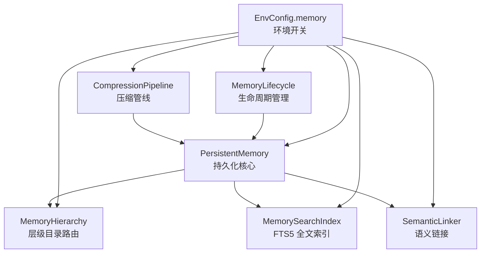
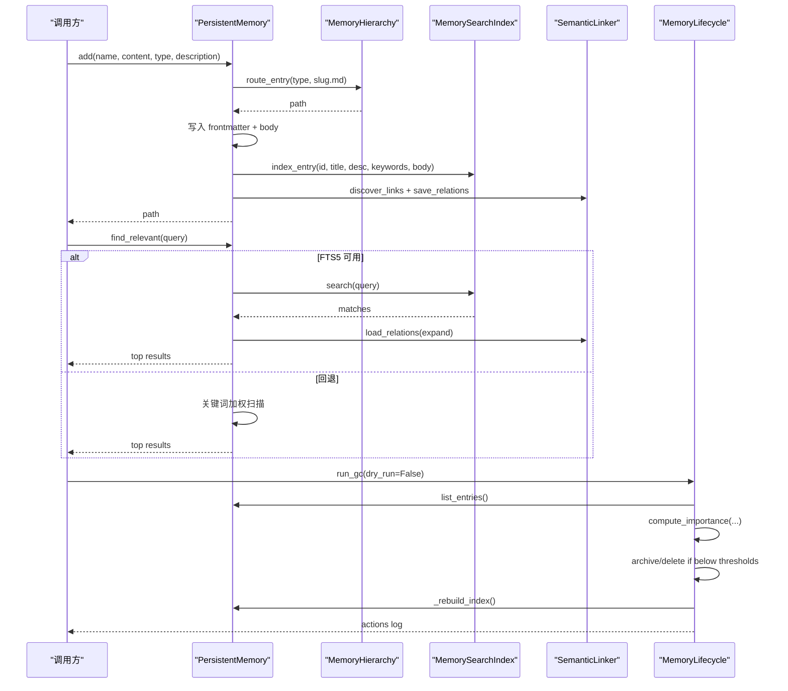
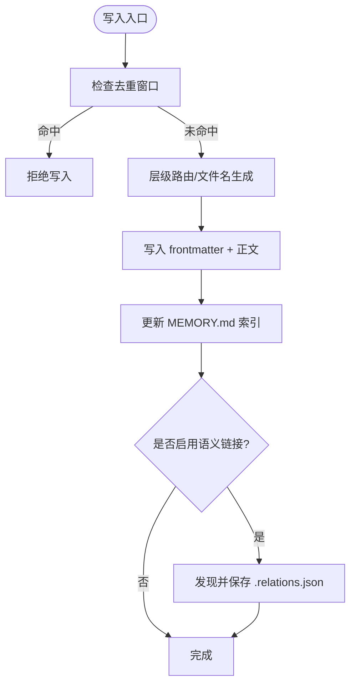
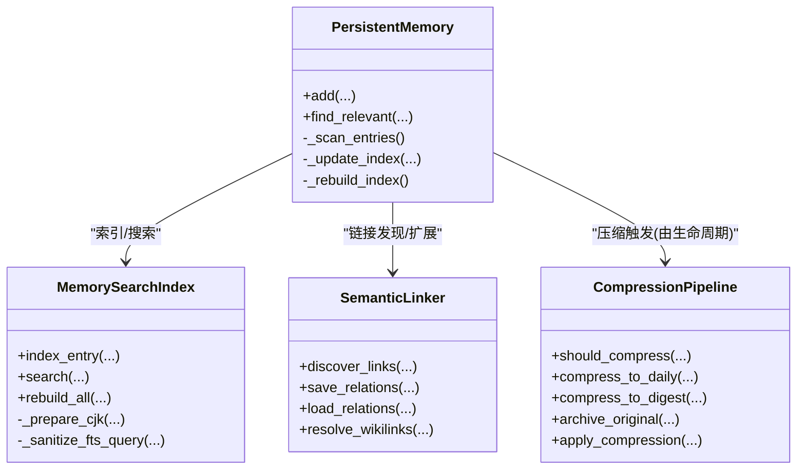
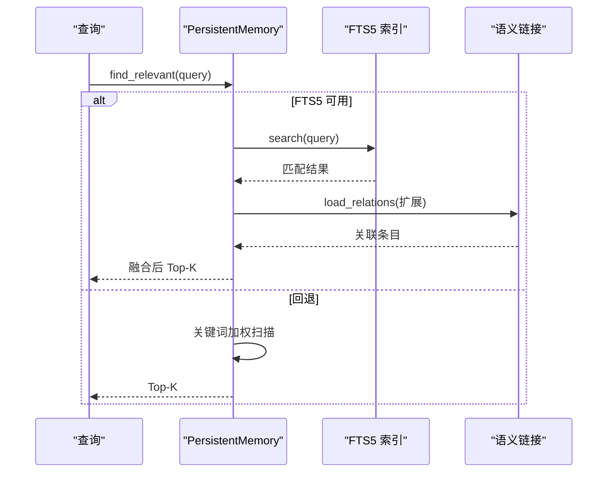
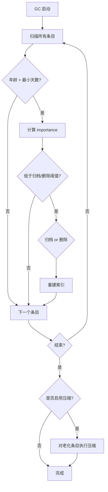
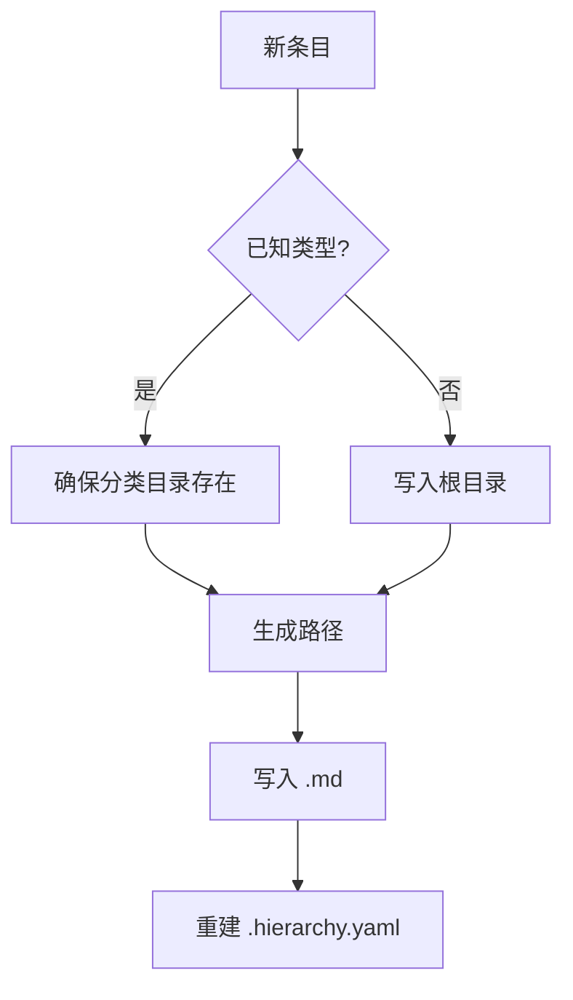
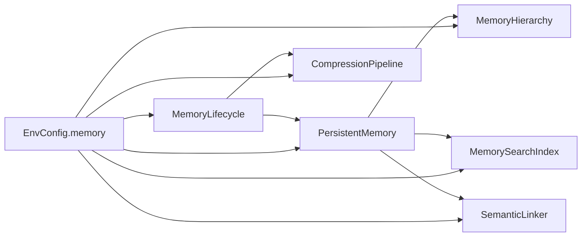

# 记忆管理系统

<cite>
**本文引用的文件**
- [persistent.py](file://agent/src/memory/persistent.py)
- [hierarchy.py](file://agent/src/memory/hierarchy.py)
- [compression.py](file://agent/src/memory/compression.py)
- [search_index.py](file://agent/src/memory/search_index.py)
- [lifecycle.py](file://agent/src/memory/lifecycle.py)
- [semantic_links.py](file://agent/src/memory/semantic_links.py)
- [env_schema.py](file://agent/src/config/env_schema.py)
- [memory.py](file://agent/cli/commands/memory.py)
</cite>

## 目录
1. [简介](#简介)
2. [项目结构](#项目结构)
3. [核心组件](#核心组件)
4. [架构总览](#架构总览)
5. [详细组件分析](#详细组件分析)
6. [依赖关系分析](#依赖关系分析)
7. [性能考虑](#性能考虑)
8. [故障排查指南](#故障排查指南)
9. [结论](#结论)
10. [附录：使用示例与最佳实践](#附录使用示例与最佳实践)

## 简介
本文件系统性地梳理 Vibe-Trading 的记忆管理系统，围绕“分层记忆架构、持久化机制、自动回忆、生命周期管理、存储优化”五大主题展开。系统以文件为持久化载体，通过工作记忆（进程内快照）、短期记忆（会话级索引与缓存）和长期记忆（磁盘上的 Markdown 条目）协同工作；提供基于 TF-IDF/BM25 的压缩、SQLite FTS5 全文检索、语义链接发现、以及质量衰减与垃圾回收等能力。所有功能均通过环境变量开关进行分级启用，便于在生产环境中按需裁剪。

## 项目结构
记忆子系统位于 agent/src/memory 下，按职责拆分为多个模块：
- persistent.py：跨会话持久化核心，负责读写 .md 条目、构建 MEMORY.md 索引、基础搜索与去重
- hierarchy.py：层级目录路由与扫描，将条目按类型分目录组织，提升 O(类别规模) 范围搜索
- compression.py：三级压缩管线（原始→每日摘要→要点摘要），归档原内容并估算信息保留率
- search_index.py：SQLite FTS5 全文检索索引，支持 CJK 大模型友好分词与查询
- lifecycle.py：生命周期管理，包括质量评分、访问追踪、重要性衰减、垃圾回收与压缩触发
- semantic_links.py：基于 BM25 的语义链接发现与持久化，支持显式 wikilink 解析
- env_schema.py：统一的环境变量配置，包含记忆系统的预设与开关
- CLI memory.py：命令行入口，封装列表、查看、搜索、删除等操作

图表来源
- [persistent.py:196-637](file://agent/src/memory/persistent.py#L196-L637)
- [hierarchy.py:34-436](file://agent/src/memory/hierarchy.py#L34-L436)
- [search_index.py:113-481](file://agent/src/memory/search_index.py#L113-L481)
- [semantic_links.py:158-372](file://agent/src/memory/semantic_links.py#L158-L372)
- [compression.py:160-353](file://agent/src/memory/compression.py#L160-L353)
- [lifecycle.py:71-421](file://agent/src/memory/lifecycle.py#L71-L421)
- [env_schema.py:461-537](file://agent/src/config/env_schema.py#L461-L537)

章节来源
- [persistent.py:196-637](file://agent/src/memory/persistent.py#L196-L637)
- [hierarchy.py:34-436](file://agent/src/memory/hierarchy.py#L34-L436)
- [search_index.py:113-481](file://agent/src/memory/search_index.py#L113-L481)
- [semantic_links.py:158-372](file://agent/src/memory/semantic_links.py#L158-L372)
- [compression.py:160-353](file://agent/src/memory/compression.py#L160-L353)
- [lifecycle.py:71-421](file://agent/src/memory/lifecycle.py#L71-L421)
- [env_schema.py:461-537](file://agent/src/config/env_schema.py#L461-L537)

## 核心组件
- PersistentMemory：跨会话持久化核心，维护 MEMORY.md 索引、条目扫描、关键词加权搜索、去重、写入锁、以及与 FTS5/语义链接的集成
- MemoryHierarchy：按 memory_type 分类的目录路由与扫描，支持扩展名恢复、索引重建、按关键词重叠度排序的搜索范围裁剪
- CompressionPipeline：三级压缩（raw/daily/digest），基于 TF-IDF 句子打分与关键词提取，归档原内容并评估保留率
- MemorySearchIndex：SQLite FTS5 索引，提供 O(log n) 全文检索，CJK 字符增广（单字+二元组），WAL 模式与线程安全
- SemanticLinker：BM25 相似度计算，自动发现关联条目，保存 .relations.json 侧边文件，解析 [[id]] 显式引用
- MemoryLifecycle：质量评分更新、访问计数、重要性衰减、垃圾回收（归档/删除）、压缩周期触发
- EnvConfig.memory：统一的特征开关与预设（off/on/full），控制各子模块启用状态

章节来源
- [persistent.py:196-637](file://agent/src/memory/persistent.py#L196-L637)
- [hierarchy.py:34-436](file://agent/src/memory/hierarchy.py#L34-L436)
- [compression.py:160-353](file://agent/src/memory/compression.py#L160-L353)
- [search_index.py:113-481](file://agent/src/memory/search_index.py#L113-L481)
- [semantic_links.py:158-372](file://agent/src/memory/semantic_links.py#L158-L372)
- [lifecycle.py:71-421](file://agent/src/memory/lifecycle.py#L71-L421)
- [env_schema.py:461-537](file://agent/src/config/env_schema.py#L461-L537)

## 架构总览
记忆系统采用“工作记忆 + 短期记忆 + 长期记忆”的分层设计：
- 工作记忆：进程内的 MEMORY.md 快照（snapshot），用于系统提示注入与快速读取
- 短期记忆：内存中的近期哈希去重窗口、会话级质量增量、临时搜索结果缓存
- 长期记忆：磁盘上的 .md 条目，按类型分目录组织，附带 .relations.json 语义链接与 archive 归档

图表来源
- [persistent.py:462-578](file://agent/src/memory/persistent.py#L462-L578)
- [persistent.py:358-438](file://agent/src/memory/persistent.py#L358-L438)
- [search_index.py:207-355](file://agent/src/memory/search_index.py#L207-L355)
- [semantic_links.py:179-230](file://agent/src/memory/semantic_links.py#L179-L230)
- [lifecycle.py:183-273](file://agent/src/memory/lifecycle.py#L183-L273)

## 详细组件分析

### 分层记忆架构与存储策略
- 工作记忆：PersistentMemory._load_snapshot 加载 MEMORY.md 前 MAX_INDEX_LINES 行作为只读快照，供系统提示注入
- 短期记忆：is_duplicate 使用滑动窗口（默认 30 秒）记录最近写入哈希，避免并发重试导致的重复条目
- 长期记忆：条目以 .md 形式持久化，frontmatter 包含元数据（名称、描述、类型、时间戳、质量分数、访问次数、相关记忆、分类、压缩级别），正文被截断至固定长度并清理控制字符

图表来源
- [persistent.py:440-578](file://agent/src/memory/persistent.py#L440-L578)
- [hierarchy.py:70-90](file://agent/src/memory/hierarchy.py#L70-L90)

章节来源
- [persistent.py:196-637](file://agent/src/memory/persistent.py#L196-L637)
- [hierarchy.py:34-436](file://agent/src/memory/hierarchy.py#L34-L436)

### 持久化记忆的机制：压缩、索引构建与语义搜索
- 压缩：CompressionPipeline 根据 last_accessed 与阈值决定压缩目标（daily/digest），先归档原文件再重写压缩后的正文，并估算信息保留率
- 索引构建：MEMORY.md 维护条目清单；可选的 SQLite FTS5 索引提供全文检索，支持 CJK 增广与查询净化
- 语义搜索：find_relevant 优先走 FTS5 MATCH，失败回退到关键词加权扫描；可结合语义链接扩展结果集

图表来源
- [persistent.py:196-637](file://agent/src/memory/persistent.py#L196-L637)
- [search_index.py:113-481](file://agent/src/memory/search_index.py#L113-L481)
- [semantic_links.py:158-372](file://agent/src/memory/semantic_links.py#L158-L372)
- [compression.py:160-353](file://agent/src/memory/compression.py#L160-L353)

章节来源
- [compression.py:160-353](file://agent/src/memory/compression.py#L160-L353)
- [search_index.py:113-481](file://agent/src/memory/search_index.py#L113-L481)
- [semantic_links.py:158-372](file://agent/src/memory/semantic_links.py#L158-L372)
- [persistent.py:358-438](file://agent/src/memory/persistent.py#L358-L438)

### 自动回忆：相关性匹配、上下文注入与记忆融合
- 相关性匹配：关键词加权（标题/描述/关键词权重更高）+ 重要性衰减因子；FTS5 提供相关性排名
- 上下文注入：MEMORY.md 快照在系统提示中注入，提供全局记忆上下文
- 记忆融合：语义链接扩展结果，将高相关条目追加到召回集合，实现跨条目的知识融合

图表来源
- [persistent.py:358-438](file://agent/src/memory/persistent.py#L358-L438)
- [search_index.py:252-302](file://agent/src/memory/search_index.py#L252-L302)
- [semantic_links.py:282-319](file://agent/src/memory/semantic_links.py#L282-L319)

章节来源
- [persistent.py:358-438](file://agent/src/memory/persistent.py#L358-L438)
- [search_index.py:252-302](file://agent/src/memory/search_index.py#L252-L302)
- [semantic_links.py:282-319](file://agent/src/memory/semantic_links.py#L282-L319)

### 生命周期管理：创建、更新、删除与垃圾回收
- 创建：add 生成唯一 id、frontmatter、正文，更新索引，可选建立语义链接与 FTS5 索引
- 更新：reinforce 更新 quality_score 与 updated_at；track_access 增加 access_count 与 last_accessed
- 删除：remove/remove_entry 删除文件、重建索引、移除 FTS5 条目与语义链接
- 垃圾回收：run_gc 依据 importance 阈值归档或删除，记录 gc.log；非 dry_run 时触发压缩周期

图表来源
- [lifecycle.py:183-273](file://agent/src/memory/lifecycle.py#L183-L273)
- [lifecycle.py:275-318](file://agent/src/memory/lifecycle.py#L275-L318)
- [persistent.py:328-356](file://agent/src/memory/persistent.py#L328-L356)

章节来源
- [lifecycle.py:71-421](file://agent/src/memory/lifecycle.py#L71-L421)
- [persistent.py:328-356](file://agent/src/memory/persistent.py#L328-L356)

### 层级目录与索引构建
- 层级路由：route_entry 将条目写入 base_dir/{type}/{filename}.md，未知类型回退到根目录
- 扫描与恢复：scan_all 同时扫描根目录与分类目录，recover_extensionless_entries 修复缺失 .md 后缀的孤儿条目
- 索引重建：rebuild_index 生成 .hierarchy.yaml，统计每类数量与关键词，支持 prune_search_scope 按关键词重叠度排序扫描顺序

图表来源
- [hierarchy.py:70-90](file://agent/src/memory/hierarchy.py#L70-L90)
- [hierarchy.py:145-176](file://agent/src/memory/hierarchy.py#L145-L176)
- [hierarchy.py:200-261](file://agent/src/memory/hierarchy.py#L200-L261)
- [hierarchy.py:313-379](file://agent/src/memory/hierarchy.py#L313-L379)

章节来源
- [hierarchy.py:34-436](file://agent/src/memory/hierarchy.py#L34-L436)

## 依赖关系分析
- PersistentMemory 依赖：
  - MemoryHierarchy（可选，受 VT_MEMORY_HIERARCHY 控制）
  - MemorySearchIndex（可选，受 VT_MEMORY_FTS_INDEX 控制）
  - SemanticLinker（可选，受 VT_MEMORY_LINKS 控制）
  - CompressionPipeline（由 MemoryLifecycle 触发，受 VT_MEMORY_COMPRESSION 控制）
- MemoryLifecycle 依赖 PersistentMemory 提供的条目扫描与写入能力
- EnvConfig.memory 集中控制各模块开关，支持 off/on/full 预设

图表来源
- [env_schema.py:461-537](file://agent/src/config/env_schema.py#L461-L537)
- [persistent.py:196-637](file://agent/src/memory/persistent.py#L196-L637)
- [lifecycle.py:71-421](file://agent/src/memory/lifecycle.py#L71-L421)

章节来源
- [env_schema.py:461-537](file://agent/src/config/env_schema.py#L461-L537)
- [persistent.py:196-637](file://agent/src/memory/persistent.py#L196-L637)
- [lifecycle.py:71-421](file://agent/src/memory/lifecycle.py#L71-L421)

## 性能考虑
- 全文检索：启用 FTS5 可将搜索从 O(n) 降为近似 O(log n)，并返回相关性排名与片段
- 层级目录：按类型分目录使扫描复杂度从 O(n) 降至 O(类别规模)，并通过关键词重叠度排序进一步减少无关扫描
- 压缩：三级压缩降低长期存储体积，归档原内容保障可恢复性；压缩周期仅在 GC 非 dry_run 时执行
- 并发与一致性：
  - 文件锁：memory_lock 使用 fcntl 独占锁（Windows 跳过），防止并发写冲突
  - WAL 模式：FTS5 数据库使用 WAL 提升并发读性能
  - 原子写入：relations.json 与压缩写入均采用 tmp + rename 策略，避免部分写入
- 去重：30 秒滑动窗口哈希去重，抑制重试或并行调用导致的重复写入
- 索引大小限制：MEMORY.md 仅保留前 MAX_INDEX_LINES 行，避免过大影响读取

[本节为通用性能建议，不直接分析具体文件]

## 故障排查指南
- 搜索无结果：
  - 检查 FTS5 是否可用（不可用会回退到扫描）；必要时触发 rebuild_all
  - 确认 query 经净化后仍含有效 token
- 写入失败：
  - 检查 memory_lock 是否超时；确认磁盘权限与空间
  - 检查 frontmatter 格式是否正确（分隔符与字段）
- 语义链接异常：
  - 检查 .relations.json 是否存在且版本兼容
  - 确认 BM25 参数与阈值设置合理
- 压缩问题：
  - 归档失败会导致压缩中止，检查 archive 目录权限
  - 压缩后验证 frontmatter 的 compression_level 与 updated_at 是否更新
- 垃圾回收误删：
  - 调整 DELETE_THRESHOLD/ARCHIVE_THRESHOLD 与 MIN_AGE_DAYS
  - 使用 dry_run=True 预演动作，确认后再执行真实操作

章节来源
- [search_index.py:147-196](file://agent/src/memory/search_index.py#L147-L196)
- [search_index.py:252-302](file://agent/src/memory/search_index.py#L252-L302)
- [semantic_links.py:232-319](file://agent/src/memory/semantic_links.py#L232-L319)
- [compression.py:258-334](file://agent/src/memory/compression.py#L258-L334)
- [lifecycle.py:183-273](file://agent/src/memory/lifecycle.py#L183-L273)

## 结论
Vibe-Trading 的记忆管理系统以文件为核心，结合层级目录、全文索引、语义链接与压缩归档，构建了可扩展、可观测、可维护的跨会话记忆体系。通过环境变量预设与模块化开关，可在不同部署场景灵活启用功能。配合生命周期管理与性能优化策略，系统在大规模记忆场景下仍能保持高效与稳定。

[本节为总结性内容，不直接分析具体文件]

## 附录：使用示例与最佳实践
- 启用全量功能：
  - 设置环境变量 VT_MEMORY=full，将启用质量评分、GC、衰减、层级目录、语义链接、压缩与 FTS5 索引
- 日常操作（CLI）：
  - /memory：列出记忆条目
  - /memory <name>：查看指定条目
  - /memory search <q>：全文检索
  - /memory forget <name>：删除指定条目
- 最佳实践：
  - 合理使用层级目录：为不同类型条目设置合适的 memory_type，利用层级路由提升检索效率
  - 定期运行 GC：在非 dry_run 模式下归档低重要性条目，并结合压缩降低存储占用
  - 使用语义链接：在条目正文中使用 [[六进制id]] 显式引用，增强知识关联
  - 监控 FTS5：若搜索性能下降，检查索引完整性并触发 rebuild_all
  - 控制写入频率：利用去重窗口与质量评分，避免冗余写入与噪声累积

章节来源
- [memory.py:24-64](file://agent/cli/commands/memory.py#L24-L64)
- [env_schema.py:461-537](file://agent/src/config/env_schema.py#L461-L537)
- [semantic_links.py:321-344](file://agent/src/memory/semantic_links.py#L321-L344)
- [search_index.py:304-355](file://agent/src/memory/search_index.py#L304-L355)