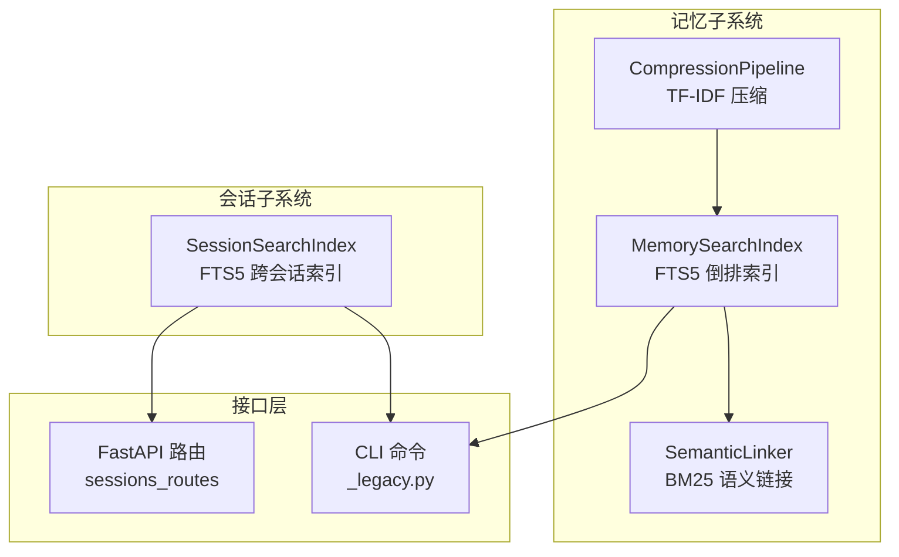
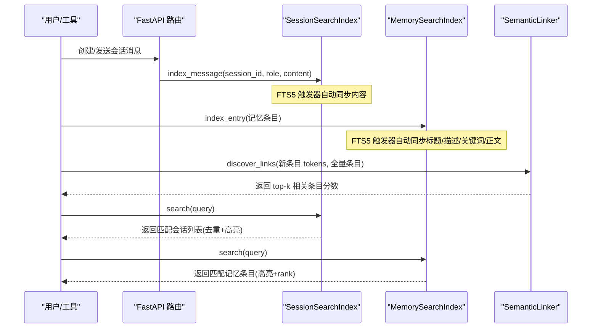
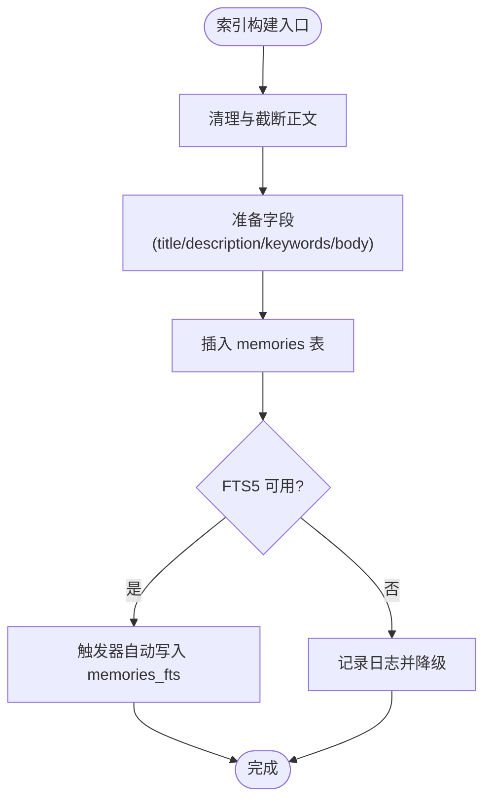
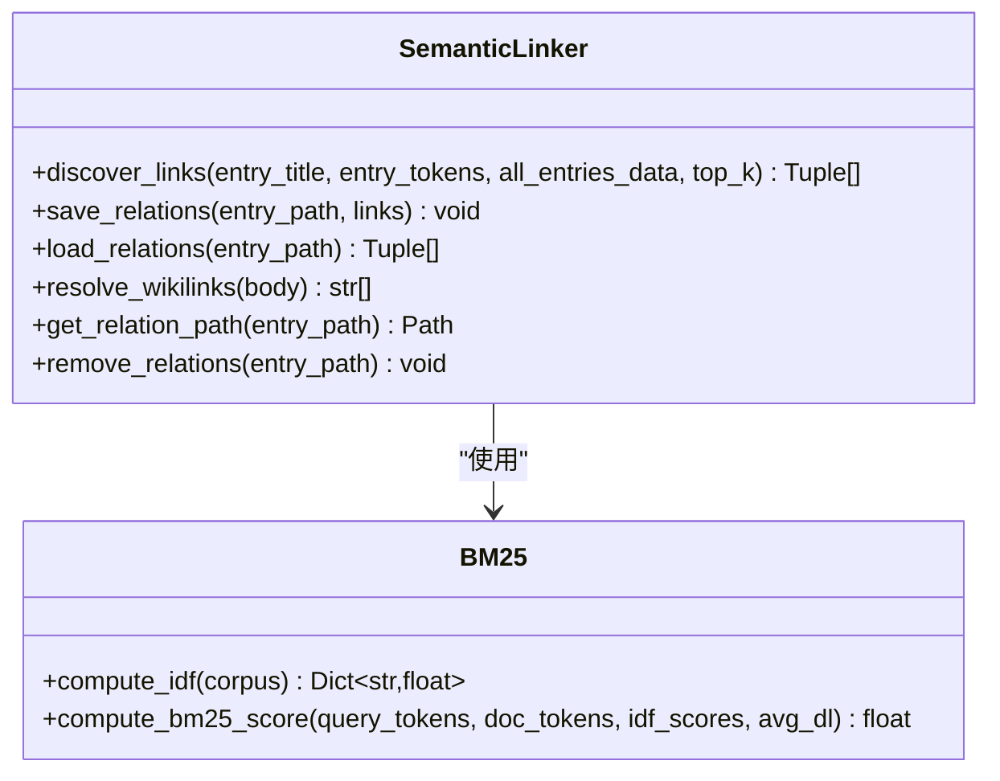
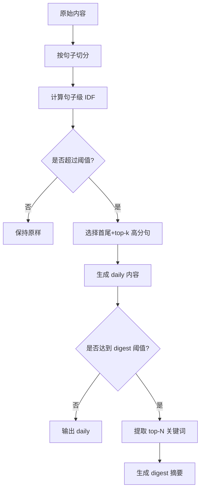
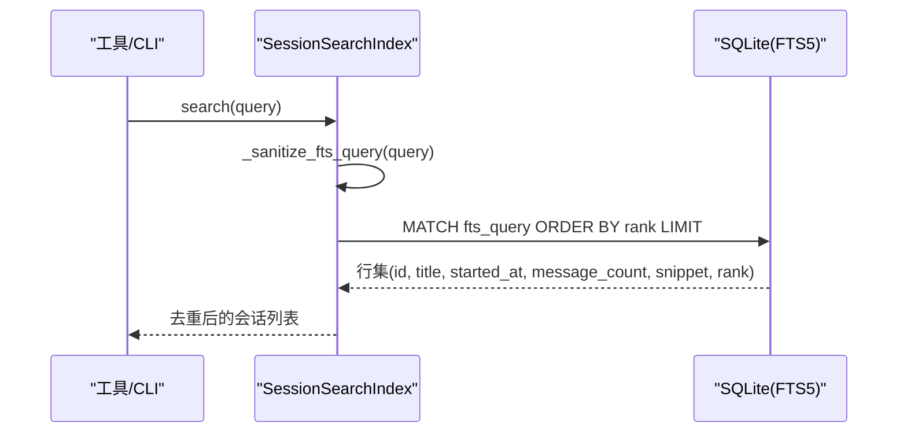
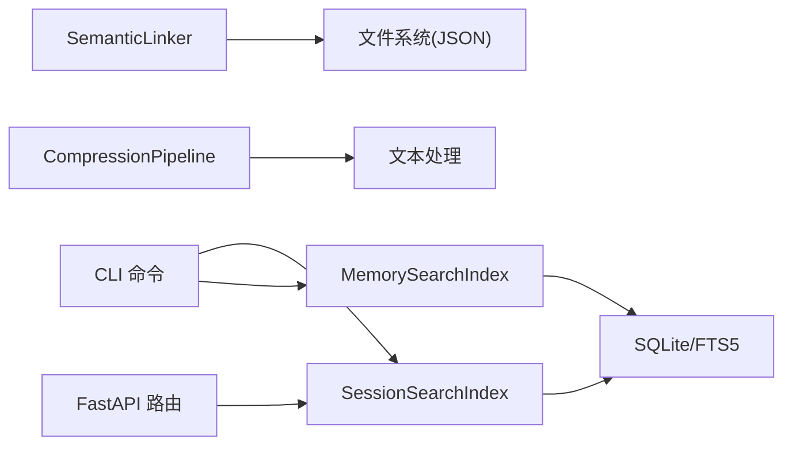

# 语义搜索

<cite>
**本文引用的文件**
- [agent/src/memory/search_index.py](file://agent/src/memory/search_index.py)
- [agent/src/memory/semantic_links.py](file://agent/src/memory/semantic_links.py)
- [agent/src/memory/compression.py](file://agent/src/memory/compression.py)
- [agent/src/session/search.py](file://agent/src/session/search.py)
- [agent/src/api/sessions_routes.py](file://agent/src/api/sessions_routes.py)
- [agent/cli/_legacy.py](file://agent/cli/_legacy.py)
- [agent/tests/test_session_search.py](file://agent/tests/test_session_search.py)
- [agent/tests/memory/test_tier2_integration.py](file://agent/tests/memory/test_tier2_integration.py)
</cite>

## 目录
1. [简介](#简介)
2. [项目结构](#项目结构)
3. [核心组件](#核心组件)
4. [架构总览](#架构总览)
5. [详细组件分析](#详细组件分析)
6. [依赖关系分析](#依赖关系分析)
7. [性能考量](#性能考量)
8. [故障排查指南](#故障排查指南)
9. [结论](#结论)
10. [附录：API使用示例与评估调优](#附录api使用示例与评估调优)

## 简介
本系统提供面向“记忆”和“会话”的语义搜索能力，覆盖索引构建、关键词提取、相似度计算、语义链接维护以及查询优化。其核心包括：
- 基于 SQLite FTS5 的全量倒排索引，支持中英文混合检索与高亮片段返回。
- 基于 BM25 的语义链接发现，自动为记忆条目建立相关关系并持久化。
- 三层压缩管线（原始/每日/摘要），利用 TF-IDF 抽取关键句与关键词，提升存储与检索效率。
- 跨会话搜索与 CLI/API 暴露，便于在工具链中复用。

## 项目结构
语义搜索相关代码主要分布在 memory 与 session 两个子系统：
- memory：负责持久化记忆的索引、压缩、语义链接。
- session：负责跨会话消息的索引与检索。
- api：通过 FastAPI 路由对外暴露会话管理能力（含事件流）。
- cli：提供命令行检索入口。

图表来源
- [agent/src/memory/search_index.py:113-145](file://agent/src/memory/search_index.py#L113-L145)
- [agent/src/memory/semantic_links.py:158-230](file://agent/src/memory/semantic_links.py#L158-L230)
- [agent/src/memory/compression.py:160-218](file://agent/src/memory/compression.py#L160-L218)
- [agent/src/session/search.py:60-135](file://agent/src/session/search.py#L60-L135)
- [agent/src/api/sessions_routes.py:289-365](file://agent/src/api/sessions_routes.py#L289-L365)
- [agent/cli/_legacy.py:5235-5261](file://agent/cli/_legacy.py#L5235-L5261)

章节来源
- [agent/src/memory/search_index.py:1-480](file://agent/src/memory/search_index.py#L1-L480)
- [agent/src/memory/semantic_links.py:1-372](file://agent/src/memory/semantic_links.py#L1-L372)
- [agent/src/memory/compression.py:1-353](file://agent/src/memory/compression.py#L1-L353)
- [agent/src/session/search.py:1-365](file://agent/src/session/search.py#L1-L365)
- [agent/src/api/sessions_routes.py:1-802](file://agent/src/api/sessions_routes.py#L1-L802)
- [agent/cli/_legacy.py:5235-5261](file://agent/cli/_legacy.py#L5235-L5261)

## 核心组件
- MemorySearchIndex：基于 SQLite FTS5 的记忆全文检索索引，支持增量写入、批量重建、CJK 分词与 bigram 扩展、安全查询构造与结果高亮。
- SemanticLinker：基于 BM25 的语义链接发现与持久化，维护 .relations.json 侧车文件，解析显式 wikilink 引用。
- CompressionPipeline：三层压缩（raw/daily/digest），使用 TF-IDF 句子评分与关键词抽取，降低存储体积并保持信息保留率。
- SessionSearchIndex：跨会话消息的 FTS5 索引，支持按会话聚合去重、时间格式化与批量重建。
- API/CLI：通过 FastAPI 路由与 CLI 命令暴露检索能力，供上层工具或用户调用。

章节来源
- [agent/src/memory/search_index.py:113-480](file://agent/src/memory/search_index.py#L113-L480)
- [agent/src/memory/semantic_links.py:63-230](file://agent/src/memory/semantic_links.py#L63-L230)
- [agent/src/memory/compression.py:60-218](file://agent/src/memory/compression.py#L60-L218)
- [agent/src/session/search.py:60-365](file://agent/src/session/search.py#L60-L365)
- [agent/src/api/sessions_routes.py:289-802](file://agent/src/api/sessions_routes.py#L289-L802)
- [agent/cli/_legacy.py:5235-5261](file://agent/cli/_legacy.py#L5235-L5261)

## 架构总览
整体流程分为“索引构建”、“语义链接”、“查询检索”三部分：
- 索引构建：记忆条目写入时触发 FTS5 自动同步；会话消息写入时同样触发 FTS5 同步；支持批量重建。
- 语义链接：对新增/更新条目进行 BM25 打分，生成 top-k 相关条目并保存为 .relations.json。
- 查询检索：对用户查询进行安全清洗与 CJK bigram 扩展，执行 MATCH 查询并返回带高亮的片段与相关性排序。

图表来源
- [agent/src/session/search.py:137-192](file://agent/src/session/search.py#L137-L192)
- [agent/src/memory/search_index.py:207-302](file://agent/src/memory/search_index.py#L207-L302)
- [agent/src/memory/semantic_links.py:179-230](file://agent/src/memory/semantic_links.py#L179-L230)

## 详细组件分析

### 记忆索引（MemorySearchIndex）
- 数据结构：SQLite 表 memories + FTS5 虚拟表 memories_fts，通过触发器实现自动同步。
- 中文处理：将连续 CJK 字符展开为 unigram + bigram，提高短语匹配召回；查询时同样生成 bigram 并安全拼接。
- 查询安全：对用户输入进行 token 提取与引号包裹，避免 FTS5 操作符注入。
- 结果展示：使用 snippet 函数返回命中上下文片段，并按 rank 排序。

图表来源
- [agent/src/memory/search_index.py:147-196](file://agent/src/memory/search_index.py#L147-L196)
- [agent/src/memory/search_index.py:207-250](file://agent/src/memory/search_index.py#L207-L250)

章节来源
- [agent/src/memory/search_index.py:113-480](file://agent/src/memory/search_index.py#L113-L480)

### 语义链接（SemanticLinker）
- 分词策略：与持久化模块一致的分词正则，保证一致性。
- IDF/BM25：计算文档频率得到 IDF，再按 BM25 公式计算 query-doc 相关性，过滤低分并限制出边数量。
- 持久化：原子写入 .relations.json，包含版本、links、更新时间戳。
- 显式链接：解析 [[hex-id]] 形式的 wikilink，用于显式跨引用。

图表来源
- [agent/src/memory/semantic_links.py:63-150](file://agent/src/memory/semantic_links.py#L63-L150)
- [agent/src/memory/semantic_links.py:158-372](file://agent/src/memory/semantic_links.py#L158-L372)

章节来源
- [agent/src/memory/semantic_links.py:1-372](file://agent/src/memory/semantic_links.py#L1-L372)

### 压缩管线（CompressionPipeline）
- 触发条件：根据最后访问时间决定压缩级别（raw→daily→digest）。
- 关键句抽取：按句子切分，计算每句 IDF 权重之和作为分数，保留首尾句与 top-k 高分句。
- 摘要生成：统计词频与句子级 IDF，选取 top-N 关键词形成要点列表。
- 信息保留率：用 Jaccard 重叠估算压缩前后信息保留程度。

图表来源
- [agent/src/memory/compression.py:69-154](file://agent/src/memory/compression.py#L69-L154)
- [agent/src/memory/compression.py:168-256](file://agent/src/memory/compression.py#L168-L256)

章节来源
- [agent/src/memory/compression.py:1-353](file://agent/src/memory/compression.py#L1-L353)

### 会话搜索（SessionSearchIndex）
- 数据模型：sessions 与 messages 两张表，messages_fts 为 FTS5 虚拟表，通过触发器自动同步。
- 查询清洗：提取字母数字与 CJK 字符，引号包裹并以 OR 连接，扩大匹配范围。
- 结果聚合：按会话去重，限制返回会话数，附带高亮片段与时间格式。

图表来源
- [agent/src/session/search.py:194-267](file://agent/src/session/search.py#L194-L267)

章节来源
- [agent/src/session/search.py:1-365](file://agent/src/session/search.py#L1-L365)

### API 与 CLI 暴露
- CLI：提供 /search 子命令，调用共享索引进行检索并打印结果。
- API：FastAPI 路由提供会话 CRUD、消息发送、事件流等能力；搜索能力可通过工具层调用索引。

章节来源
- [agent/cli/_legacy.py:5235-5261](file://agent/cli/_legacy.py#L5235-L5261)
- [agent/src/api/sessions_routes.py:289-802](file://agent/src/api/sessions_routes.py#L289-L802)

## 依赖关系分析
- MemorySearchIndex 依赖 SQLite 与 FTS5 扩展，具备降级机制。
- SemanticLinker 依赖文件系统与 JSON 序列化，使用原子写保障一致性。
- CompressionPipeline 依赖文本切分与统计，无外部依赖。
- SessionSearchIndex 依赖 SQLite 与 FTS5，与 sessions.db 配合。
- API/CLI 依赖 FastAPI 与进程内共享索引单例。

图表来源
- [agent/src/memory/search_index.py:137-145](file://agent/src/memory/search_index.py#L137-L145)
- [agent/src/memory/semantic_links.py:232-281](file://agent/src/memory/semantic_links.py#L232-L281)
- [agent/src/session/search.py:80-135](file://agent/src/session/search.py#L80-L135)
- [agent/src/api/sessions_routes.py:289-365](file://agent/src/api/sessions_routes.py#L289-L365)
- [agent/cli/_legacy.py:5235-5261](file://agent/cli/_legacy.py#L5235-L5261)

章节来源
- [agent/src/memory/search_index.py:1-480](file://agent/src/memory/search_index.py#L1-L480)
- [agent/src/memory/semantic_links.py:1-372](file://agent/src/memory/semantic_links.py#L1-L372)
- [agent/src/memory/compression.py:1-353](file://agent/src/memory/compression.py#L1-L353)
- [agent/src/session/search.py:1-365](file://agent/src/session/search.py#L1-L365)
- [agent/src/api/sessions_routes.py:1-802](file://agent/src/api/sessions_routes.py#L1-L802)
- [agent/cli/_legacy.py:5235-5261](file://agent/cli/_legacy.py#L5235-L5261)

## 性能考量
- 倒排索引：FTS5 提供 O(log n) 级别的检索复杂度，显著优于线性扫描。
- 并发与持久化：WAL 模式与 NORMAL 同步策略提升读写吞吐；线程锁保护索引写入。
- 中文优化：CJK unigram + bigram 扩展提升短语匹配召回，同时通过去重与清洗减少冗余。
- 链接发现：限制最大出边与最低分数阈值，控制计算开销。
- 压缩：按访问时效性分层压缩，降低存储与后续扫描成本。
- 查询优化：安全清洗避免复杂表达式，OR 连接提升召回；snippet 仅返回必要片段。

[本节为通用性能讨论，不直接分析具体文件]

## 故障排查指南
- FTS5 不可用：当 SQLite 未启用 FTS5 扩展时，索引会记录警告并降级为空结果；需检查 SQLite 编译选项或升级版本。
- 查询无结果：确认查询已正确清洗并包含有效 token；对于纯 CJK 查询，确保存在 unigram/bigram 匹配。
- 链接缺失：检查 .relations.json 是否存在且格式正确；若损坏则会被忽略并记录警告。
- 压缩失败：归档失败会中止压缩以避免数据丢失；检查磁盘权限与空间。

章节来源
- [agent/src/memory/search_index.py:160-173](file://agent/src/memory/search_index.py#L160-L173)
- [agent/src/memory/search_index.py:288-290](file://agent/src/memory/search_index.py#L288-L290)
- [agent/src/memory/semantic_links.py:296-305](file://agent/src/memory/semantic_links.py#L296-L305)
- [agent/src/memory/compression.py:306-334](file://agent/src/memory/compression.py#L306-L334)

## 结论
该语义搜索系统以 FTS5 为核心，结合 BM25 与 TF-IDF，实现了高效、可扩展的记忆与会话检索，并通过语义链接增强知识关联。压缩管线在保证信息保留的前提下显著降低了存储成本。系统具备良好的容错与降级能力，适合在生产环境中稳定运行。

[本节为总结性内容，不直接分析具体文件]

## 附录：API使用示例与评估调优

### 搜索 API 使用示例
- 创建会话：POST /sessions
- 发送消息：POST /sessions/{id}/messages
- 获取消息：GET /sessions/{id}/messages
- 事件流：GET /sessions/{id}/events（SSE）

以上端点由 FastAPI 路由注册并提供鉴权与会话状态管理。

章节来源
- [agent/src/api/sessions_routes.py:335-400](file://agent/src/api/sessions_routes.py#L335-L400)
- [agent/src/api/sessions_routes.py:697-750](file://agent/src/api/sessions_routes.py#L697-L750)
- [agent/src/api/sessions_routes.py:752-802](file://agent/src/api/sessions_routes.py#L752-L802)

### 关键词搜索与语义检索
- 关键词搜索：通过 CLI 的 /search 命令或工具调用 SessionSearchIndex.search()，返回匹配会话及片段。
- 语义检索：对记忆条目使用 MemorySearchIndex.search()，返回匹配条目与高亮片段；可结合 SemanticLinker 提供的 related 信息增强结果。

章节来源
- [agent/cli/_legacy.py:5235-5261](file://agent/cli/_legacy.py#L5235-L5261)
- [agent/src/session/search.py:216-267](file://agent/src/session/search.py#L216-L267)
- [agent/src/memory/search_index.py:252-302](file://agent/src/memory/search_index.py#L252-L302)

### 相关性排序
- FTS5 内置 rank 提供相关性排序，结合 snippet 高亮便于理解命中位置。
- 语义链接分数可用于辅助排序或展示“相关条目”。

章节来源
- [agent/src/memory/search_index.py:273-302](file://agent/src/memory/search_index.py#L273-L302)
- [agent/src/memory/semantic_links.py:179-230](file://agent/src/memory/semantic_links.py#L179-L230)

### 评估方法与调优建议
- 评估方法：
  - 使用测试用例中的基准对比（如 BM25 vs 基线）评估召回与排序质量。
  - 通过 CJK 搜索用例验证多语言匹配效果。
- 调优建议：
  - 调整 BM25 参数（k1、b）与阈值以平衡精确度与召回率。
  - 优化 CJK bigram 扩展策略，避免过度重复导致噪声。
  - 定期重建索引以确保一致性；监控 FTS5 可用性。
  - 合理设置压缩阈值与 top-k 参数，兼顾存储与检索性能。

章节来源
- [agent/tests/memory/test_tier2_integration.py:144-170](file://agent/tests/memory/test_tier2_integration.py#L144-L170)
- [agent/tests/memory/test_tier2_integration.py:297-328](file://agent/tests/memory/test_tier2_integration.py#L297-L328)
- [agent/tests/test_session_search.py:101-126](file://agent/tests/test_session_search.py#L101-L126)