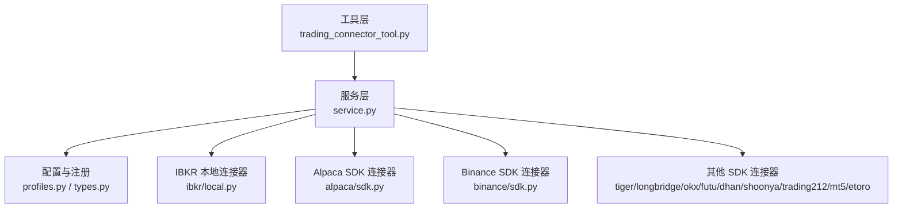
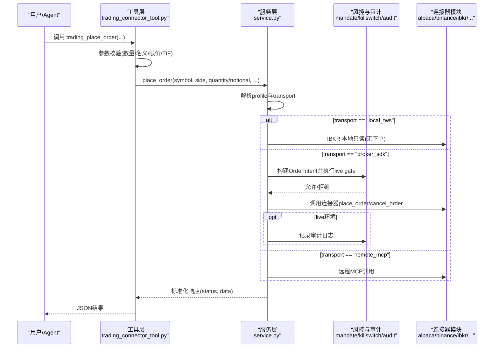
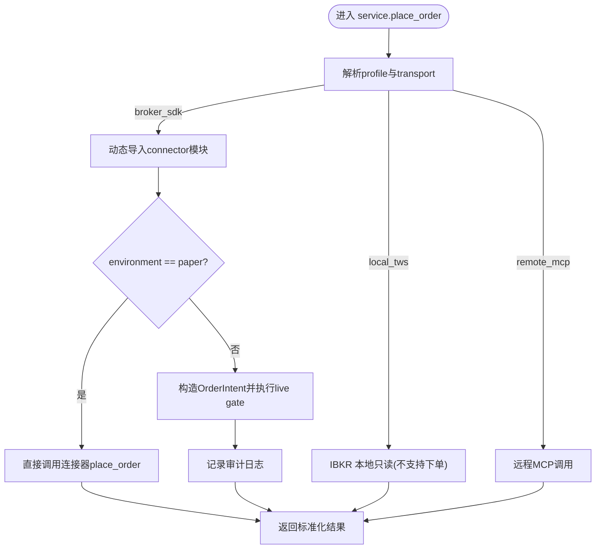
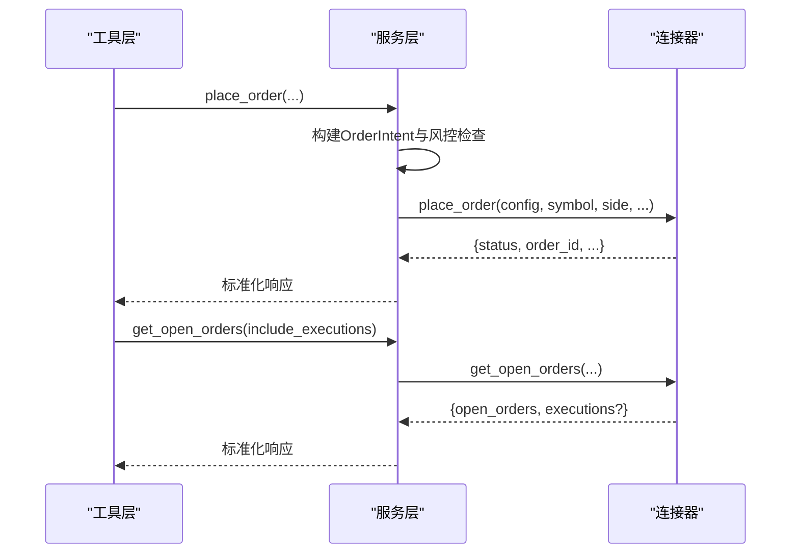
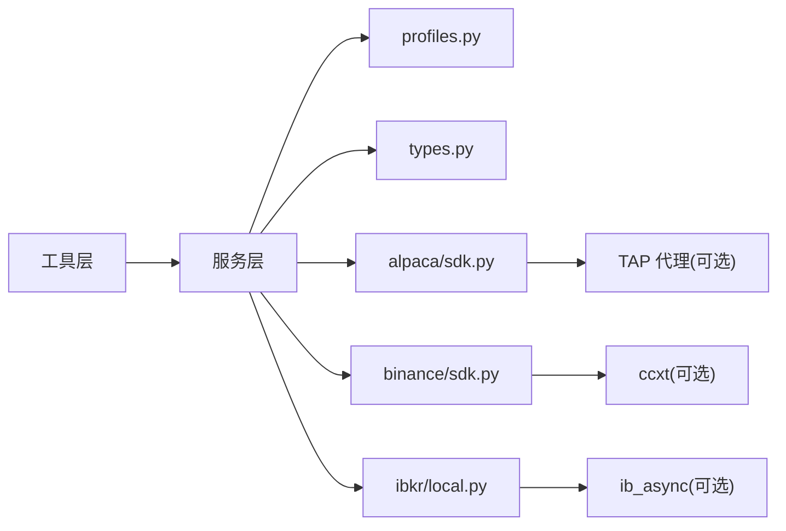

# 交易连接器

<cite>
**本文引用的文件**
- [agent/src/trading/service.py](file://agent/src/trading/service.py)
- [agent/src/trading/profiles.py](file://agent/src/trading/profiles.py)
- [agent/src/trading/types.py](file://agent/src/trading/types.py)
- [agent/src/tools/trading_connector_tool.py](file://agent/src/tools/trading_connector_tool.py)
- [agent/src/trading/connectors/alpaca/sdk.py](file://agent/src/trading/connectors/alpaca/sdk.py)
- [agent/src/trading/connectors/binance/sdk.py](file://agent/src/trading/connectors/binance/sdk.py)
- [agent/src/trading/connectors/ibkr/local.py](file://agent/src/trading/connectors/ibkr/local.py)
</cite>

## 目录
1. [简介](#简介)
2. [项目结构](#项目结构)
3. [核心组件](#核心组件)
4. [架构总览](#架构总览)
5. [详细组件分析](#详细组件分析)
6. [依赖关系分析](#依赖关系分析)
7. [性能考量](#性能考量)
8. [故障排查指南](#故障排查指南)
9. [结论](#结论)
10. [附录](#附录)

## 简介
本文件为 Vibe-Trading 的交易连接器系统提供全面文档，覆盖支持的12个主流券商与交易所连接器的实现架构、抽象层设计、认证授权机制、订单生命周期管理、风险控制策略、配置方法、API限制与错误处理，以及实盘交易的监控、审计与合规要求。同时给出连接器扩展开发指南，并展示订单执行、持仓管理与资金查询的实际使用示例路径。

## 项目结构
Vibe-Trading 的交易连接器采用“服务层 + 连接器模块”的分层架构：
- 工具层（Tools）：对外暴露统一的操作接口（账户、持仓、订单、行情、历史数据等），负责参数校验与结果封装。
- 服务层（Service）：根据所选 Profile 的 transport 类型路由到具体连接器实现（本地 TWS、远程 MCP、或 broker_sdk）。
- 连接器层（Connectors）：每个券商/交易所一个独立模块，实现统一的读/写接口；部分支持可选的安全代理（如 TAP）与凭据隔离。
- 配置与注册（Profiles）：集中管理所有内置 Profile 与默认选择，持久化当前选中的 Profile。

**图表来源**
- [agent/src/tools/trading_connector_tool.py:208-504](file://agent/src/tools/trading_connector_tool.py#L208-L504)
- [agent/src/trading/service.py:42-171](file://agent/src/trading/service.py#L42-L171)
- [agent/src/trading/profiles.py:27-41](file://agent/src/trading/profiles.py#L27-L41)
- [agent/src/trading/connectors/ibkr/local.py:165-218](file://agent/src/trading/connectors/ibkr/local.py#L165-L218)
- [agent/src/trading/connectors/alpaca/sdk.py:261-296](file://agent/src/trading/connectors/alpaca/sdk.py#L261-L296)
- [agent/src/trading/connectors/binance/sdk.py:217-264](file://agent/src/trading/connectors/binance/sdk.py#L217-L264)

**章节来源**
- [agent/src/trading/service.py:1-171](file://agent/src/trading/service.py#L1-L171)
- [agent/src/trading/profiles.py:1-100](file://agent/src/trading/profiles.py#L1-L100)
- [agent/src/trading/types.py:1-52](file://agent/src/trading/types.py#L1-L52)
- [agent/src/tools/trading_connector_tool.py:1-800](file://agent/src/tools/trading_connector_tool.py#L1-L800)

## 核心组件
- 工具层（TradingConnectorTool）：提供查看连接、选择默认连接、检查连通性、读取账户/持仓/订单/报价/历史、下单、撤单、eToro 专属操作等工具。所有数值参数在调用服务前进行严格校验，失败即关闭（fail-closed）。
- 服务层（Service）：根据 profile.transport 分发到 local_tws、broker_sdk 或 remote_mcp；对 live 环境写入操作强制通过 mandate gate 与 kill switch，并记录审计日志。
- 连接器模块（Connectors）：每个券商/交易所实现统一的 read/write 接口；部分支持可选安全代理（如 Alpaca 的 TAP）以实现凭据隔离与人工审批。
- 配置与注册（Profiles/Types）：集中定义所有内置 Profile（12个），并提供 selected_profile 的读写能力。

**章节来源**
- [agent/src/tools/trading_connector_tool.py:208-504](file://agent/src/tools/trading_connector_tool.py#L208-L504)
- [agent/src/trading/service.py:42-171](file://agent/src/trading/service.py#L42-L171)
- [agent/src/trading/profiles.py:27-41](file://agent/src/trading/profiles.py#L27-L41)
- [agent/src/trading/types.py:1-52](file://agent/src/trading/types.py#L1-L52)

## 架构总览
下图展示了从工具调用到具体连接器的完整流程，包括 live 环境的强制风控与审计。

**图表来源**
- [agent/src/tools/trading_connector_tool.py:431-504](file://agent/src/tools/trading_connector_tool.py#L431-L504)
- [agent/src/trading/service.py:279-342](file://agent/src/trading/service.py#L279-L342)
- [agent/src/trading/connectors/alpaca/sdk.py:429-577](file://agent/src/trading/connectors/alpaca/sdk.py#L429-L577)
- [agent/src/trading/connectors/binance/sdk.py:423-547](file://agent/src/trading/connectors/binance/sdk.py#L423-L547)
- [agent/src/trading/connectors/ibkr/local.py:165-218](file://agent/src/trading/connectors/ibkr/local.py#L165-L218)

## 详细组件分析

### 连接器抽象层与服务路由
- 服务层维护 broker_sdk 连接器映射表，按 connector key 动态导入对应模块，调用其统一接口（build_config、check_status、get_account_snapshot、get_positions、get_open_orders、get_quote、get_historical_bars、place_order、cancel_order 等）。
- local_tws 仅用于 IBKR 本地只读访问，不暴露下单能力。
- remote_mcp 作为远程通道，由服务层统一封装。

**图表来源**
- [agent/src/trading/service.py:279-342](file://agent/src/trading/service.py#L279-L342)

**章节来源**
- [agent/src/trading/service.py:1-171](file://agent/src/trading/service.py#L1-L171)

### 认证与授权机制
- 凭据隔离（Alpaca TAP）：当启用 TAP 时，所有 egress（读/写）通过代理转发，服务端注入密钥，Agent 进程不持有明文密钥；写操作需人工审批，读操作自动放行。
- 主机分离（Binance）：paper 与 live 使用不同 host，连接器在提交前断言 host 与 profile 一致，防止 testnet key 误连 live。
- IBKR 本地：仅连接本地 TWS/Gateway，端口与账号过滤，且纸面账户检测（DU 前缀）确保不会误连真实账户。

**章节来源**
- [agent/src/trading/connectors/alpaca/sdk.py:183-227](file://agent/src/trading/connectors/alpaca/sdk.py#L183-L227)
- [agent/src/trading/connectors/alpaca/sdk.py:580-665](file://agent/src/trading/connectors/alpaca/sdk.py#L580-L665)
- [agent/src/trading/connectors/binance/sdk.py:643-663](file://agent/src/trading/connectors/binance/sdk.py#L643-L663)
- [agent/src/trading/connectors/ibkr/local.py:530-541](file://agent/src/trading/connectors/ibkr/local.py#L530-L541)

### 订单生命周期管理
- 下单：工具层严格校验参数（quantity/notional互斥、limit_price必填、TIF合法），服务层在 live 环境通过 mandate gate 与 kill switch 控制，最终调用连接器 place_order。
- 撤单：风险降低操作，live 环境仍记录审计；部分连接器（如 Binance）要求提供 symbol。
- 状态查询：open orders、executions（可选）、positions、account snapshot 均通过连接器统一接口获取。

**图表来源**
- [agent/src/tools/trading_connector_tool.py:431-504](file://agent/src/tools/trading_connector_tool.py#L431-L504)
- [agent/src/trading/service.py:279-342](file://agent/src/trading/service.py#L279-L342)
- [agent/src/trading/connectors/alpaca/sdk.py:429-577](file://agent/src/trading/connectors/alpaca/sdk.py#L429-L577)
- [agent/src/trading/connectors/binance/sdk.py:423-547](file://agent/src/trading/connectors/binance/sdk.py#L423-L547)

**章节来源**
- [agent/src/tools/trading_connector_tool.py:431-504](file://agent/src/tools/trading_connector_tool.py#L431-L504)
- [agent/src/trading/service.py:279-342](file://agent/src/trading/service.py#L279-L342)

### 风险控制策略
- Mandate Gate：live 下单前基于 instrument_type 与 asset_class 判断是否允许（例如多市场股票按符号后缀推断资产类别）。
- Kill Switch：全局熔断，阻止任何新增风险暴露。
- Fail-Closed：任何非法输入或上游错误均返回错误信封，不执行潜在危险操作。
- 审计：所有 live 写操作（下单、撤单、eToro 复制交易等）记录审计事件，便于追踪与合规审查。

**章节来源**
- [agent/src/trading/service.py:245-342](file://agent/src/trading/service.py#L245-L342)
- [agent/src/trading/service.py:345-370](file://agent/src/trading/service.py#L345-L370)
- [agent/src/trading/service.py:512-551](file://agent/src/trading/service.py#L512-L551)

### 各连接器特性与 API 限制
- Alpaca：支持 TAP 凭据隔离；read 走 REST 或 SDK；write 需人工审批；host 分离（paper/live）。
- Binance：ccxt 统一客户端；spot 无 positions，用余额模拟；testnet/live host 分离；取消订单必须提供 symbol。
- IBKR 本地：仅本地 TWS/Gateway 只读；端口扫描与账户前缀校验；不提供下单能力。
- 其他 SDK 连接器（tiger、longbridge、okx、futu、dhan、shoonya、trading212、mt5、etoro）：通过 service._SDK_CONNECTOR_MODULES 动态加载，遵循统一接口。

**章节来源**
- [agent/src/trading/connectors/alpaca/sdk.py:261-296](file://agent/src/trading/connectors/alpaca/sdk.py#L261-L296)
- [agent/src/trading/connectors/binance/sdk.py:217-264](file://agent/src/trading/connectors/binance/sdk.py#L217-L264)
- [agent/src/trading/connectors/ibkr/local.py:165-218](file://agent/src/trading/connectors/ibkr/local.py#L165-L218)
- [agent/src/trading/service.py:13-29](file://agent/src/trading/service.py#L13-L29)

### 配置方法与最佳实践
- 选择与保存默认连接：使用 trading_select_connection 工具设置 selected_profile，配置文件位于运行时根目录。
- 连接器配置：每个连接器有独立的配置文件（如 alpaca.json、binance.json、ibkr-local.json），支持 profile 与环境切换。
- 安全建议：优先使用 TAP 进行凭据隔离；启用 host 分离；避免在 Agent 进程保留明文密钥。

**章节来源**
- [agent/src/tools/trading_connector_tool.py:234-259](file://agent/src/tools/trading_connector_tool.py#L234-L259)
- [agent/src/trading/profiles.py:44-100](file://agent/src/trading/profiles.py#L44-L100)
- [agent/src/trading/connectors/alpaca/sdk.py:143-179](file://agent/src/trading/connectors/alpaca/sdk.py#L143-L179)
- [agent/src/trading/connectors/binance/sdk.py:157-205](file://agent/src/trading/connectors/binance/sdk.py#L157-L205)
- [agent/src/trading/connectors/ibkr/local.py:121-153](file://agent/src/trading/connectors/ibkr/local.py#L121-L153)

### 实盘交易监控、审计与合规
- 监控：通过 check_connection、get_account、get_positions、get_open_orders 持续观察账户与订单状态。
- 审计：live 写操作（下单、撤单、eToro 复制交易）记录审计事件，包含意图、结果与上下文。
- 合规：mandate gate 与 kill switch 确保仅在授权范围内执行；fail-closed 设计降低误操作风险。

**章节来源**
- [agent/src/trading/service.py:42-65](file://agent/src/trading/service.py#L42-L65)
- [agent/src/trading/service.py:345-370](file://agent/src/trading/service.py#L345-L370)
- [agent/src/trading/service.py:512-551](file://agent/src/trading/service.py#L512-L551)

### 连接器扩展开发指南
- 步骤：
  1. 在 connectors 目录下创建新连接器模块，实现 build_config、check_status、get_account_snapshot、get_positions、get_open_orders、get_quote、get_historical_bars、place_order、cancel_order 等接口。
  2. 在 profiles.py 中注册新 Profile（id、connector、label、environment、transport、capabilities、readonly、config）。
  3. 在 service.py 的 _SDK_CONNECTOR_MODULES 中添加映射（若为 broker_sdk）。
  4. 编写测试用例验证读/写路径、错误处理与审计记录。
- 最佳实践：
  - 保持 fail-closed 的错误处理风格。
  - 明确区分 paper/live 主机与凭据。
  - 对敏感操作（写）启用 mandate gate 与审计。
  - 提供健康检查（check_status）以便快速定位问题。

**章节来源**
- [agent/src/trading/profiles.py:27-41](file://agent/src/trading/profiles.py#L27-L41)
- [agent/src/trading/service.py:13-29](file://agent/src/trading/service.py#L13-L29)

### 实际使用示例（路径引用）
- 订单执行：
  - 工具调用：[agent/src/tools/trading_connector_tool.py:431-504](file://agent/src/tools/trading_connector_tool.py#L431-L504)
  - 服务路由与风控：[agent/src/trading/service.py:279-342](file://agent/src/trading/service.py#L279-L342)
  - 连接器实现（Alpaca/Binance）：[agent/src/trading/connectors/alpaca/sdk.py:429-577](file://agent/src/trading/connectors/alpaca/sdk.py#L429-L577), [agent/src/trading/connectors/binance/sdk.py:423-547](file://agent/src/trading/connectors/binance/sdk.py#L423-L547)
- 持仓管理：
  - 工具调用：[agent/src/tools/trading_connector_tool.py:300-314](file://agent/src/tools/trading_connector_tool.py#L300-L314)
  - 服务路由：[agent/src/trading/service.py:81-91](file://agent/src/trading/service.py#L81-L91)
  - 连接器实现（IBKR 本地）：[agent/src/trading/connectors/ibkr/local.py:260-288](file://agent/src/trading/connectors/ibkr/local.py#L260-L288)
- 资金查询：
  - 工具调用：[agent/src/tools/trading_connector_tool.py:283-297](file://agent/src/tools/trading_connector_tool.py#L283-L297)
  - 服务路由：[agent/src/trading/service.py:68-78](file://agent/src/trading/service.py#L68-L78)
  - 连接器实现（Alpaca/Binance）：[agent/src/trading/connectors/alpaca/sdk.py:299-322](file://agent/src/trading/connectors/alpaca/sdk.py#L299-L322), [agent/src/trading/connectors/binance/sdk.py:267-285](file://agent/src/trading/connectors/binance/sdk.py#L267-L285)

## 依赖关系分析
- 服务层依赖 profiles 与 types 以解析配置与能力。
- 连接器模块依赖各自 SDK（alpaca-py、ccxt、ib_async）与可选安全代理（TAP）。
- 工具层依赖 service 提供的统一接口，屏蔽底层差异。

**图表来源**
- [agent/src/trading/service.py:13-29](file://agent/src/trading/service.py#L13-L29)
- [agent/src/trading/connectors/alpaca/sdk.py:252-258](file://agent/src/trading/connectors/alpaca/sdk.py#L252-L258)
- [agent/src/trading/connectors/binance/sdk.py:208-214](file://agent/src/trading/connectors/binance/sdk.py#L208-L214)
- [agent/src/trading/connectors/ibkr/local.py:156-162](file://agent/src/trading/connectors/ibkr/local.py#L156-L162)

**章节来源**
- [agent/src/trading/service.py:13-29](file://agent/src/trading/service.py#L13-L29)
- [agent/src/trading/connectors/alpaca/sdk.py:252-258](file://agent/src/trading/connectors/alpaca/sdk.py#L252-L258)
- [agent/src/trading/connectors/binance/sdk.py:208-214](file://agent/src/trading/connectors/binance/sdk.py#L208-L214)
- [agent/src/trading/connectors/ibkr/local.py:156-162](file://agent/src/trading/connectors/ibkr/local.py#L156-L162)

## 性能考量
- 连接池：IBKR 本地使用线程局部连接池，避免并发冲突与重复连接开销。
- 超时与重试：连接器普遍设置网络超时；Binance 启用速率限制。
- 数据归一化：统一将不同源数据转换为标准格式，减少上层处理成本。
- 按需加载：可选依赖（alpaca-py、ccxt、ib_async）延迟导入，降低启动开销。

**章节来源**
- [agent/src/trading/connectors/ibkr/local.py:429-503](file://agent/src/trading/connectors/ibkr/local.py#L429-L503)
- [agent/src/trading/connectors/binance/sdk.py:628-640](file://agent/src/trading/connectors/binance/sdk.py#L628-L640)

## 故障排查指南
- 连接失败：检查端口开放（IBKR 本地）、SDK 安装（alpaca-py/ccxt/ib_async）、凭据配置（Alpaca/Binance）。
- 权限拒绝：确认 mandate gate 与 kill switch 状态；检查 live 环境是否允许目标资产类别。
- 参数错误：工具层已做严格校验，关注返回的错误消息；确保 quantity/notional 互斥、limit_price 必填等。
- 审计缺失：确认 live 写操作是否触发审计记录；检查 session_id 传递是否正确。

**章节来源**
- [agent/src/trading/connectors/ibkr/local.py:165-218](file://agent/src/trading/connectors/ibkr/local.py#L165-L218)
- [agent/src/trading/connectors/alpaca/sdk.py:261-296](file://agent/src/trading/connectors/alpaca/sdk.py#L261-L296)
- [agent/src/trading/connectors/binance/sdk.py:217-264](file://agent/src/trading/connectors/binance/sdk.py#L217-L264)
- [agent/src/trading/service.py:345-370](file://agent/src/trading/service.py#L345-L370)

## 结论
Vibe-Trading 的交易连接器系统通过清晰的分层架构与严格的 fail-closed 设计，实现了跨券商/交易所的统一接入、安全可控的实盘交易与完善的审计合规。服务层的路由机制与连接器的模块化设计使得扩展新券商变得简单而稳健。推荐在生产环境中启用 mandate gate、kill switch 与审计记录，并结合 TAP 实现凭据隔离与人工审批。

## 附录
- 常用工具调用路径：
  - 查看连接列表：[agent/src/tools/trading_connector_tool.py:208-231](file://agent/src/tools/trading_connector_tool.py#L208-L231)
  - 选择默认连接：[agent/src/tools/trading_connector_tool.py:234-259](file://agent/src/tools/trading_connector_tool.py#L234-L259)
  - 检查连通性：[agent/src/tools/trading_connector_tool.py:262-280](file://agent/src/tools/trading_connector_tool.py#L262-L280)
  - 读取账户：[agent/src/tools/trading_connector_tool.py:283-297](file://agent/src/tools/trading_connector_tool.py#L283-L297)
  - 读取持仓：[agent/src/tools/trading_connector_tool.py:300-314](file://agent/src/tools/trading_connector_tool.py#L300-L314)
  - 读取订单：[agent/src/tools/trading_connector_tool.py:317-344](file://agent/src/tools/trading_connector_tool.py#L317-L344)
  - 下单：[agent/src/tools/trading_connector_tool.py:431-504](file://agent/src/tools/trading_connector_tool.py#L431-L504)
  - 撤单：[agent/src/tools/trading_connector_tool.py:507-545](file://agent/src/tools/trading_connector_tool.py#L507-L545)