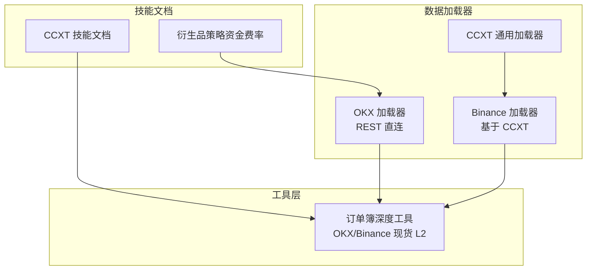
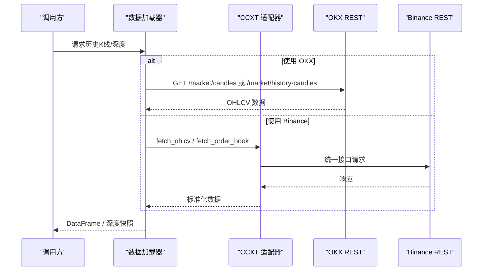
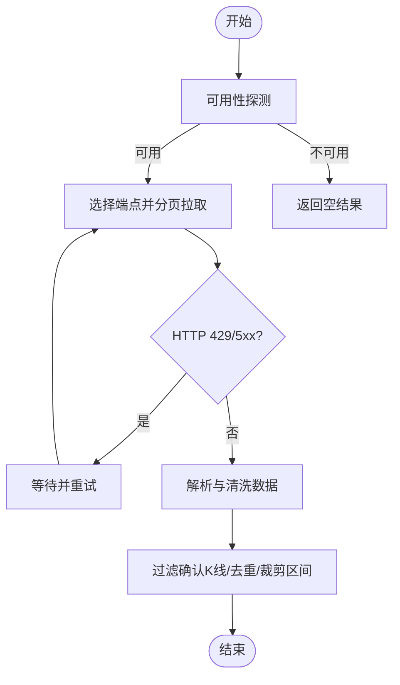
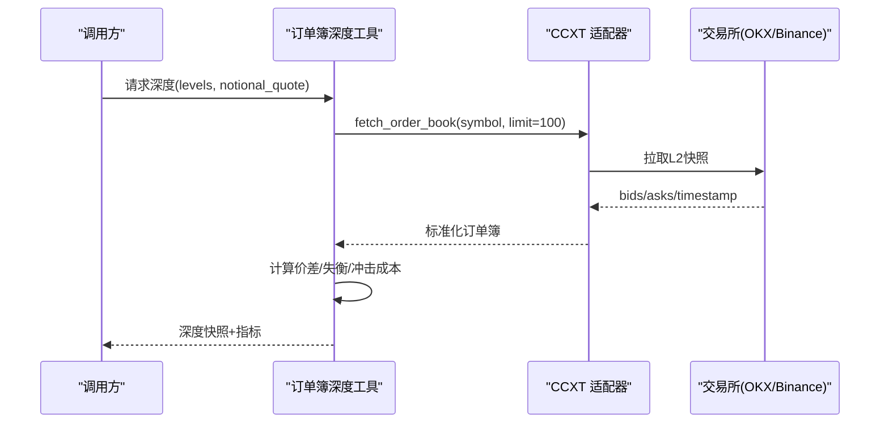
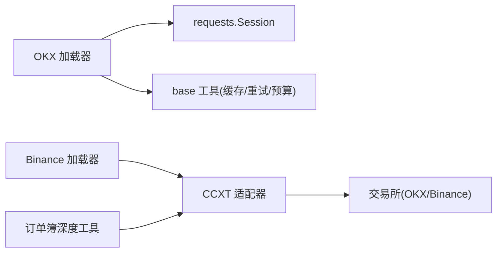

# 加密货币连接器

<cite>
**本文引用的文件**
- [agent/backtest/loaders/binance_loader.py](file://agent/backtest/loaders/binance_loader.py)
- [agent/backtest/loaders/okx.py](file://agent/backtest/loaders/okx.py)
- [agent/backtest/loaders/ccxt_loader.py](file://agent/backtest/loaders/ccxt_loader.py)
- [agent/src/tools/orderbook_depth_tool.py](file://agent/src/tools/orderbook_depth_tool.py)
- [agent/src/skills/crypto-derivatives/SKILL.md](file://agent/src/skills/crypto-derivatives/SKILL.md)
- [agent/src/skills/ccxt/SKILL.md](file://agent/src/skills/ccxt/SKILL.md)
- [README.md](file://README.md)
</cite>

## 目录
1. [简介](#简介)
2. [项目结构](#项目结构)
3. [核心组件](#核心组件)
4. [架构总览](#架构总览)
5. [详细组件分析](#详细组件分析)
6. [依赖关系分析](#依赖关系分析)
7. [性能与限流](#性能与限流)
8. [实时数据与订单簿深度](#实时数据与订单簿深度)
9. [风险控制与异常处理](#风险控制与异常处理)
10. [账户管理与资金操作](#账户管理与资金操作)
11. [24/7 交易对系统架构的影响与优化](#247-交易对系统架构的影响与优化)
12. [故障排查指南](#故障排查指南)
13. [结论](#结论)

## 简介
本文件为 Vibe-Trading 的加密货币连接器提供系统化文档，聚焦 Binance 与 OKX 两大主流交易所的连接实现。内容涵盖：
- 现货、合约（永续）、杠杆交易与资金费率处理的业务要点
- API 限流策略、WebSocket 实时数据订阅与订单簿深度数据处理
- 加密货币特有的风险控制机制（价格波动监控、流动性检查、异常交易检测）
- 账户管理、资金划转与提现的实现说明
- 24/7 市场特性对系统架构的影响与优化建议

本项目在“加载器层”提供历史 K 线等点-in-time 数据；实时行情与订单簿通过 broker connector（如 okx、binance、ccxt）获取。

**章节来源**
- [README.md:478-482](file://README.md#L478-L482)

## 项目结构
围绕加密货币连接器的关键代码组织如下：
- 数据加载器（Backtest Loaders）：OKX 直连 REST、Binance 通过 CCXT、通用 CCXT 加载器
- 工具层（Tools）：订单簿深度快照工具（基于 ccxt 统一接口）
- 技能文档（Skills）：CCXT 使用指南、衍生品策略（含资金费率）



**图表来源**
- [agent/backtest/loaders/okx.py:101-129](file://agent/backtest/loaders/okx.py#L101-L129)
- [agent/backtest/loaders/binance_loader.py:23-44](file://agent/backtest/loaders/binance_loader.py#L23-L44)
- [agent/backtest/loaders/ccxt_loader.py:208-224](file://agent/backtest/loaders/ccxt_loader.py#L208-L224)
- [agent/src/tools/orderbook_depth_tool.py:121-147](file://agent/src/tools/orderbook_depth_tool.py#L121-L147)
- [agent/src/skills/ccxt/SKILL.md:1-56](file://agent/src/skills/ccxt/SKILL.md#L1-L56)
- [agent/src/skills/crypto-derivatives/SKILL.md:13-64](file://agent/src/skills/crypto-derivatives/SKILL.md#L13-L64)

**章节来源**
- [agent/backtest/loaders/okx.py:101-129](file://agent/backtest/loaders/okx.py#L101-L129)
- [agent/backtest/loaders/binance_loader.py:23-44](file://agent/backtest/loaders/binance_loader.py#L23-L44)
- [agent/backtest/loaders/ccxt_loader.py:208-224](file://agent/backtest/loaders/ccxt_loader.py#L208-L224)
- [agent/src/tools/orderbook_depth_tool.py:121-147](file://agent/src/tools/orderbook_depth_tool.py#L121-L147)
- [agent/src/skills/ccxt/SKILL.md:1-56](file://agent/src/skills/ccxt/SKILL.md#L1-L56)
- [agent/src/skills/crypto-derivatives/SKILL.md:13-64](file://agent/src/skills/crypto-derivatives/SKILL.md#L13-L64)

## 核心组件
- OKX 加载器：公开 REST 获取 OHLCV，支持代理、重试、预算控制、可用性探测
- Binance 加载器：基于 CCXT 的 Binance 现货/USD-M 永续 OHLCV 获取
- CCXT 通用加载器：统一抽象，支持多交易所、时间框架映射、缓存与重试
- 订单簿深度工具：基于 ccxt 的统一 fetch_order_book，返回买卖盘深度、价差、深度失衡、冲击成本等指标

**章节来源**
- [agent/backtest/loaders/okx.py:101-129](file://agent/backtest/loaders/okx.py#L101-L129)
- [agent/backtest/loaders/binance_loader.py:23-44](file://agent/backtest/loaders/binance_loader.py#L23-L44)
- [agent/backtest/loaders/ccxt_loader.py:208-224](file://agent/backtest/loaders/ccxt_loader.py#L208-L224)
- [agent/src/tools/orderbook_depth_tool.py:121-147](file://agent/src/tools/orderbook_depth_tool.py#L121-L147)

## 架构总览
下图展示从调用方到交易所的数据流与关键组件交互：



**图表来源**
- [agent/backtest/loaders/okx.py:220-265](file://agent/backtest/loaders/okx.py#L220-L265)
- [agent/backtest/loaders/binance_loader.py:31-44](file://agent/backtest/loaders/binance_loader.py#L31-L44)
- [agent/backtest/loaders/ccxt_loader.py:208-224](file://agent/backtest/loaders/ccxt_loader.py#L208-L224)
- [agent/src/tools/orderbook_depth_tool.py:121-147](file://agent/src/tools/orderbook_depth_tool.py#L121-L147)

## 详细组件分析

### OKX 加载器（现货 OHLCV）
- 公开 REST 端点：近期 K 线与历史 K 线双通道，按时间范围智能选择
- 代理与超时：支持 HTTP/HTTPS 代理，可配置超时与探测超时
- 限流与重试：对 429/5xx 进行重试，业务码非 0 时抛出异常
- 分页与预算：按页拉取，设置最大页数与预算时间，避免长时间阻塞
- 数据清洗：确认标志过滤、UTC 时间对齐、去重与区间裁剪



**图表来源**
- [agent/backtest/loaders/okx.py:109-125](file://agent/backtest/loaders/okx.py#L109-L125)
- [agent/backtest/loaders/okx.py:220-265](file://agent/backtest/loaders/okx.py#L220-L265)
- [agent/backtest/loaders/okx.py:267-372](file://agent/backtest/loaders/okx.py#L267-L372)

**章节来源**
- [agent/backtest/loaders/okx.py:101-129](file://agent/backtest/loaders/okx.py#L101-L129)
- [agent/backtest/loaders/okx.py:220-265](file://agent/backtest/loaders/okx.py#L220-L265)
- [agent/backtest/loaders/okx.py:267-372](file://agent/backtest/loaders/okx.py#L267-L372)

### Binance 加载器（基于 CCXT）
- 固定使用 Binance 现货或 USD-M 永续（swap），忽略全局 CCXT_EXCHANGE
- 启用速率限制与超时，支持代理
- 复用 CCXT 统一接口，便于扩展至其他交易所

```mermaid
classDiagram
class BinanceDataLoader {
+name = "binance"
+markets = {"crypto"}
+requires_auth = False
+_get_exchange(instrument_type) Exchange
}
class CcxtDataLoader {
+fetch(codes, start_date, end_date, interval, fields) Dict
}
BinanceDataLoader --|> CcxtDataLoader : "继承"
```

**图表来源**
- [agent/backtest/loaders/binance_loader.py:23-44](file://agent/backtest/loaders/binance_loader.py#L23-L44)
- [agent/backtest/loaders/ccxt_loader.py:208-224](file://agent/backtest/loaders/ccxt_loader.py#L208-L224)

**章节来源**
- [agent/backtest/loaders/binance_loader.py:23-44](file://agent/backtest/loaders/binance_loader.py#L23-L44)
- [agent/backtest/loaders/ccxt_loader.py:208-224](file://agent/backtest/loaders/ccxt_loader.py#L208-L224)

### 订单簿深度工具（现货 L2）
- 支持 OKX 与 Binance 现货，通过 ccxt 统一 fetch_order_book
- 输出包括：原始买卖盘、价差（绝对与相对 bps）、深度失衡比、冲击成本（买/卖方向）
- 严格校验：空盘、单边盘、交叉盘直接拒绝；部分成交明确标注
- 单位规范：基础资产数量与计价货币名义价值分离，避免混用



**图表来源**
- [agent/src/tools/orderbook_depth_tool.py:121-147](file://agent/src/tools/orderbook_depth_tool.py#L121-L147)
- [agent/src/tools/orderbook_depth_tool.py:285-305](file://agent/src/tools/orderbook_depth_tool.py#L285-L305)

**章节来源**
- [agent/src/tools/orderbook_depth_tool.py:121-147](file://agent/src/tools/orderbook_depth_tool.py#L121-L147)
- [agent/src/tools/orderbook_depth_tool.py:285-305](file://agent/src/tools/orderbook_depth_tool.py#L285-L305)

### 资金费率与衍生品策略（概念性说明）
- 永续合约无到期日，依靠资金费率锚定现货价格
- 正向套利：做多现货 + 做空永续，收取资金费率
- 反向套利：做空现货（借币卖出） + 做多永续，收取资金费率
- 风控要点：杠杆上限、保证金比率、单币种分配、止损阈值

**章节来源**
- [agent/src/skills/crypto-derivatives/SKILL.md:13-64](file://agent/src/skills/crypto-derivatives/SKILL.md#L13-L64)

## 依赖关系分析
- OKX 加载器依赖 requests 会话与代理配置，内部使用缓存与重试工具
- Binance 加载器依赖 CCXT，统一封装交易所差异
- 订单簿深度工具依赖 CCXT 的 fetch_order_book，统一符号格式转换
- CCXT 技能文档提供常用方法与时间框架约定



**图表来源**
- [agent/backtest/loaders/okx.py:93-98](file://agent/backtest/loaders/okx.py#L93-L98)
- [agent/backtest/loaders/binance_loader.py:31-44](file://agent/backtest/loaders/binance_loader.py#L31-L44)
- [agent/src/tools/orderbook_depth_tool.py:121-147](file://agent/src/tools/orderbook_depth_tool.py#L121-L147)

**章节来源**
- [agent/backtest/loaders/okx.py:93-98](file://agent/backtest/loaders/okx.py#L93-L98)
- [agent/backtest/loaders/binance_loader.py:31-44](file://agent/backtest/loaders/binance_loader.py#L31-L44)
- [agent/src/tools/orderbook_depth_tool.py:121-147](file://agent/src/tools/orderbook_depth_tool.py#L121-L147)

## 性能与限流
- 代理与超时：OKX 与 CCXT 均支持代理与超时配置，提升跨网络稳定性
- 重试与预算：对 429/5xx 进行重试，结合预算时间防止长尾阻塞
- 分页策略：分钟级 K 线提高最大页数，日线/周线降低页数
- 缓存：加载器使用缓存减少重复请求
- 可用性探测：OKX 启动前进行轻量探测，失败快速回退

**章节来源**
- [agent/backtest/loaders/okx.py:67-69](file://agent/backtest/loaders/okx.py#L67-L69)
- [agent/backtest/loaders/okx.py:109-125](file://agent/backtest/loaders/okx.py#L109-L125)
- [agent/backtest/loaders/okx.py:267-372](file://agent/backtest/loaders/okx.py#L267-L372)
- [agent/backtest/loaders/ccxt_loader.py:208-224](file://agent/backtest/loaders/ccxt_loader.py#L208-L224)

## 实时数据与订单簿深度
- 加载器层仅负责历史点-in-time 数据；实时 ticks/深度由 broker connector 提供
- 订单簿深度工具通过 ccxt 获取现货 L2 快照，适合做流动性评估与冲击成本测算
- 符号规范：BASE-QUOTE 形式（如 BTC-USDT），内部转换为 ccxt 的 slash 形式

**章节来源**
- [README.md:478-482](file://README.md#L478-L482)
- [agent/src/tools/orderbook_depth_tool.py:121-147](file://agent/src/tools/orderbook_depth_tool.py#L121-L147)
- [agent/src/skills/ccxt/SKILL.md:46-56](file://agent/src/skills/ccxt/SKILL.md#L46-L56)

## 风险控制与异常处理
- 订单簿深度工具：
  - 空盘/单边盘/交叉盘直接拒绝，避免错误信号
  - 部分成交明确标注，不伪装为完全成交
  - 冲击成本计算采用固定名义金额，买/卖方向一致可比
- OKX 加载器：
  - 业务码非 0 抛出异常，记录错误信息
  - 对 429/5xx 进行重试，避免瞬时失败影响
- 资金费率策略：
  - 杠杆上限、保证金比率、单币种分配、止损阈值等参数化风控

**章节来源**
- [agent/src/tools/orderbook_depth_tool.py:285-305](file://agent/src/tools/orderbook_depth_tool.py#L285-L305)
- [agent/backtest/loaders/okx.py:291-315](file://agent/backtest/loaders/okx.py#L291-L315)
- [agent/src/skills/crypto-derivatives/SKILL.md:50-64](file://agent/src/skills/crypto-derivatives/SKILL.md#L50-L64)

## 账户管理与资金操作
- 当前仓库未包含针对 Binance/OKX 的账户查询、资金划转与提现的直接实现
- 如需对接账户与资金操作，建议通过 broker connector 或交易所官方 SDK 集成，并在工具层增加鉴权与风控校验
- 本项目更侧重市场数据与订单簿深度工具，账户类功能需另行扩展

[本节为概念性说明，不涉及具体文件分析]

## 24/7 交易对系统架构的影响与优化
- 持续运行：系统需支持不间断轮询与事件驱动，避免定时任务遗漏
- 容错与恢复：网络抖动、交易所维护时需具备自动重试与状态同步
- 资源管理：合理设置超时、预算与并发，避免资源耗尽
- 数据一致性：多源数据合并时需统一时间戳与去重策略

[本节为概念性说明，不涉及具体文件分析]

## 故障排查指南
- 可用性探测失败：检查代理配置与网络连通性
- 429/5xx 错误：观察重试次数与预算时间，必要时调整限流策略
- 业务码非 0：查看错误消息，确认请求参数与标的格式
- 订单簿为空或交叉：视为数据错误，检查交易所状态与网络延迟

**章节来源**
- [agent/backtest/loaders/okx.py:109-125](file://agent/backtest/loaders/okx.py#L109-L125)
- [agent/backtest/loaders/okx.py:291-315](file://agent/backtest/loaders/okx.py#L291-L315)
- [agent/src/tools/orderbook_depth_tool.py:285-305](file://agent/src/tools/orderbook_depth_tool.py#L285-L305)

## 结论
- OKX 与 Binance 连接器在本项目中分别以直连 REST 与 CCXT 方式实现，覆盖历史 K 线与订单簿深度
- 限流、重试、预算与代理配置提升了鲁棒性
- 订单簿深度工具提供了严格的流动性与冲击成本评估能力
- 资金费率与衍生品策略在技能文档中有清晰指导
- 账户管理与资金操作需通过外部 connector 或 SDK 扩展
- 24/7 市场要求系统具备高可用与强容错能力

[本节为总结性内容，不涉及具体文件分析]