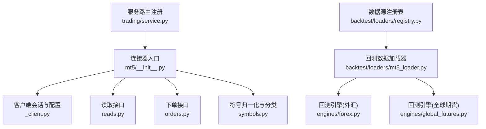
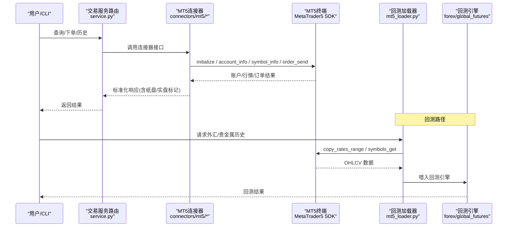
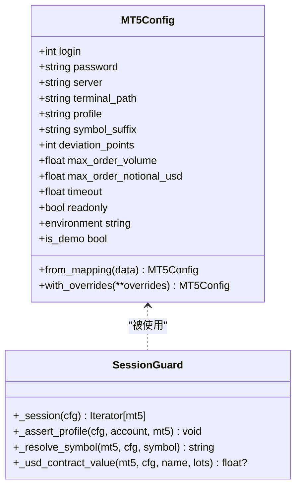
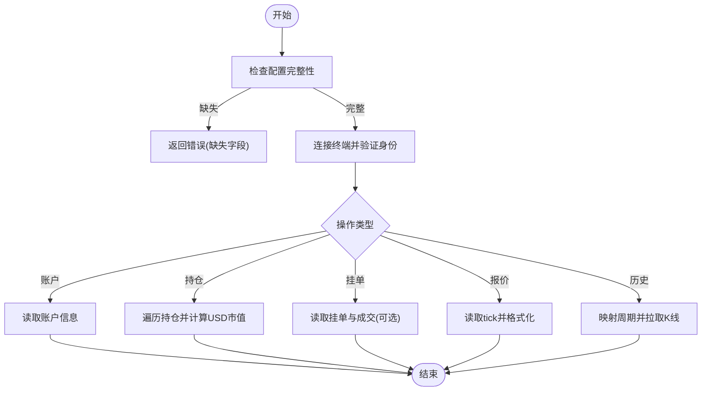
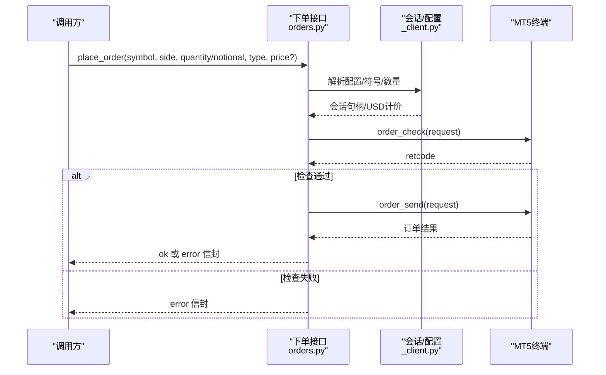
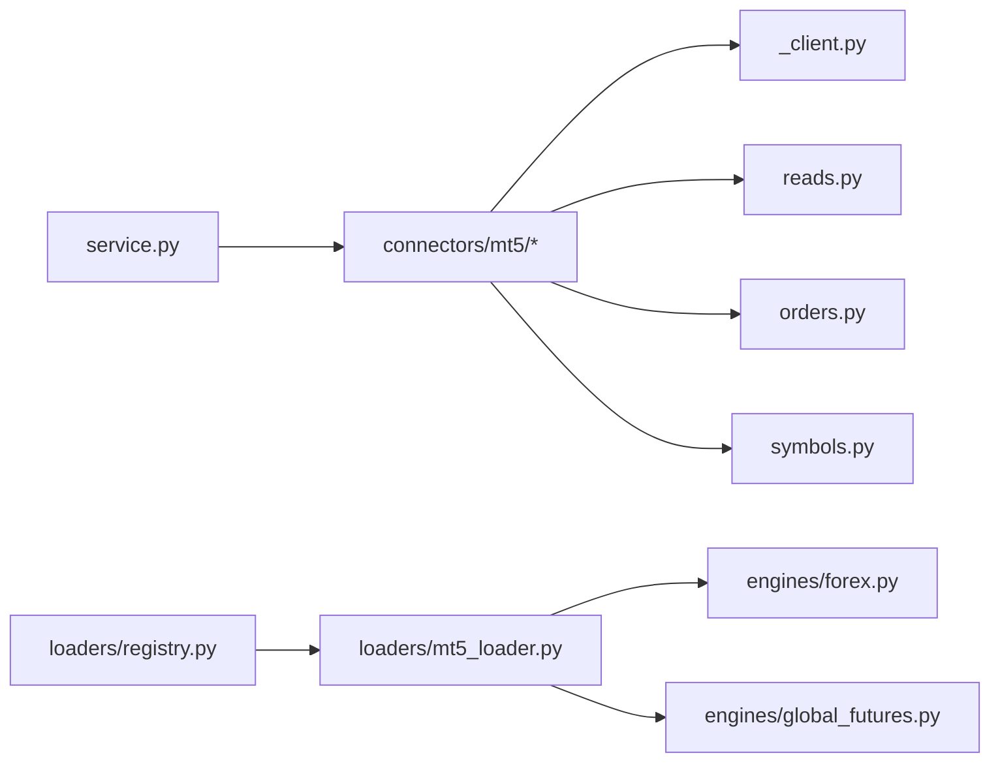

# 外汇期货连接器

<cite>
**本文引用的文件**
- [agent/src/trading/connectors/mt5/__init__.py](file://agent/src/trading/connectors/mt5/__init__.py)
- [agent/src/trading/connectors/mt5/_client.py](file://agent/src/trading/connectors/mt5/_client.py)
- [agent/src/trading/connectors/mt5/orders.py](file://agent/src/trading/connectors/mt5/orders.py)
- [agent/src/trading/connectors/mt5/reads.py](file://agent/src/trading/connectors/mt5/reads.py)
- [agent/src/trading/connectors/mt5/symbols.py](file://agent/src/trading/connectors/mt5/symbols.py)
- [agent/backtest/loaders/mt5_loader.py](file://agent/backtest/loaders/mt5_loader.py)
- [agent/backtest/loaders/registry.py](file://agent/backtest/loaders/registry.py)
- [agent/backtest/engines/forex.py](file://agent/backtest/engines/forex.py)
- [agent/backtest/engines/futures_base.py](file://agent/backtest/engines/futures_base.py)
- [agent/backtest/engines/global_futures.py](file://agent/backtest/engines/global_futures.py)
- [agent/src/trading/service.py](file://agent/src/trading/service.py)
- [README.md](file://README.md)
- [README_zh.md](file://README_zh.md)
</cite>

## 目录
1. [简介](#简介)
2. [项目结构](#项目结构)
3. [核心组件](#核心组件)
4. [架构总览](#架构总览)
5. [详细组件分析](#详细组件分析)
6. [依赖关系分析](#依赖关系分析)
7. [性能与可靠性](#性能与可靠性)
8. [故障排查指南](#故障排查指南)
9. [结论](#结论)
10. [附录](#附录)

## 简介
本文件为 Vibe-Trading 的外汇期货连接器专业文档，聚焦于 MetaTrader 5（MT5）平台的集成实现。内容涵盖：
- MT5 客户端安装配置、本地服务启动与 MQL5 脚本支持说明
- 外汇交易点差计算、杠杆倍数与保证金管理
- 期货合约到期日处理、展期策略与交割机制
- 技术分析指标调用、EA 自动交易与回测引擎集成示例
- 外汇市场 24 小时交易特性、跨时区处理与流动性管理
- 高级订单类型、止损止盈设置与风险管理工具使用

该连接器通过官方 Python SDK 与本地运行的 MT5 终端通信，提供只读与可下单能力；同时为回测系统提供基于本地终端的行情数据源。

## 项目结构
围绕 MT5 的关键代码分布在以下模块：
- 连接器核心：会话生命周期、身份校验、USD 计价与符号解析
- 读取接口：账户快照、持仓、挂单、报价与历史 K 线
- 下单接口：市价/限价单、取消与按票号平仓（风险降低）
- 符号归一化与分类：用于授权门控与回退链选择
- 回测数据加载器：从本地 MT5 终端拉取外汇/贵金属历史数据
- 回测引擎：外汇与全球期货引擎，封装点差、滑点、保证金与乘数等规则

图表来源
- [agent/src/trading/connectors/mt5/__init__.py:1-14](file://agent/src/trading/connectors/mt5/__init__.py#L1-L14)
- [agent/src/trading/connectors/mt5/_client.py:1-380](file://agent/src/trading/connectors/mt5/_client.py#L1-L380)
- [agent/src/trading/connectors/mt5/reads.py:1-301](file://agent/src/trading/connectors/mt5/reads.py#L1-L301)
- [agent/src/trading/connectors/mt5/orders.py:1-408](file://agent/src/trading/connectors/mt5/orders.py#L1-L408)
- [agent/src/trading/connectors/mt5/symbols.py:1-77](file://agent/src/trading/connectors/mt5/symbols.py#L1-L77)
- [agent/backtest/loaders/mt5_loader.py:1-251](file://agent/backtest/loaders/mt5_loader.py#L1-L251)
- [agent/backtest/loaders/registry.py:149-155](file://agent/backtest/loaders/registry.py#L149-L155)
- [agent/backtest/engines/forex.py:1-137](file://agent/backtest/engines/forex.py#L1-L137)
- [agent/backtest/engines/global_futures.py:1-156](file://agent/backtest/engines/global_futures.py#L1-L156)
- [agent/src/trading/service.py:1-34](file://agent/src/trading/service.py#L1-L34)

章节来源
- [agent/src/trading/connectors/mt5/__init__.py:1-14](file://agent/src/trading/connectors/mt5/__init__.py#L1-L14)
- [agent/src/trading/connectors/mt5/_client.py:1-380](file://agent/src/trading/connectors/mt5/_client.py#L1-L380)
- [agent/backtest/loaders/mt5_loader.py:1-251](file://agent/backtest/loaders/mt5_loader.py#L1-L251)
- [agent/backtest/loaders/registry.py:149-155](file://agent/backtest/loaders/registry.py#L149-L155)
- [agent/backtest/engines/forex.py:1-137](file://agent/backtest/engines/forex.py#L1-L137)
- [agent/backtest/engines/global_futures.py:1-156](file://agent/backtest/engines/global_futures.py#L1-L156)
- [agent/src/trading/service.py:1-34](file://agent/src/trading/service.py#L1-L34)

## 核心组件
- 连接器入口与传输层：通过 broker_sdk 传输与本地 MT5 终端交互，支持 Windows 平台可选扩展包安装。
- 会话与身份守卫：每个操作在受保护会话中执行，确保 demo/live 环境一致且账号登录号匹配。
- 读取接口：提供状态检查、账户快照、持仓、挂单、实时报价与历史 K 线。
- 下单接口：支持市价与限价单，支持按票号取消挂单或关闭持仓（仅减少敞口）。
- 符号与授权：符号归一化与分类，配合授权门控限制 CFD/外汇等品种。
- 回测数据加载器：从本地终端拉取外汇/贵金属历史数据，失败时回退到其他数据源。
- 回测引擎：外汇引擎处理点差/滑点/隔夜利息；全球期货引擎处理乘数、保证金与涨跌停。

章节来源
- [agent/src/trading/connectors/mt5/__init__.py:1-14](file://agent/src/trading/connectors/mt5/__init__.py#L1-L14)
- [agent/src/trading/connectors/mt5/_client.py:1-380](file://agent/src/trading/connectors/mt5/_client.py#L1-L380)
- [agent/src/trading/connectors/mt5/reads.py:1-301](file://agent/src/trading/connectors/mt5/reads.py#L1-L301)
- [agent/src/trading/connectors/mt5/orders.py:1-408](file://agent/src/trading/connectors/mt5/orders.py#L1-L408)
- [agent/src/trading/connectors/mt5/symbols.py:1-77](file://agent/src/trading/connectors/mt5/symbols.py#L1-L77)
- [agent/backtest/loaders/mt5_loader.py:1-251](file://agent/backtest/loaders/mt5_loader.py#L1-L251)
- [agent/backtest/engines/forex.py:1-137](file://agent/backtest/engines/forex.py#L1-L137)
- [agent/backtest/engines/global_futures.py:1-156](file://agent/backtest/engines/global_futures.py#L1-L156)

## 架构总览
下图展示从 CLI/工具到 MT5 终端的数据与订单流，以及回测数据加载路径。

图表来源
- [agent/src/trading/service.py:1-34](file://agent/src/trading/service.py#L1-L34)
- [agent/src/trading/connectors/mt5/_client.py:237-301](file://agent/src/trading/connectors/mt5/_client.py#L237-L301)
- [agent/src/trading/connectors/mt5/reads.py:64-101](file://agent/src/trading/connectors/mt5/reads.py#L64-L101)
- [agent/src/trading/connectors/mt5/orders.py:59-158](file://agent/src/trading/connectors/mt5/orders.py#L59-L158)
- [agent/backtest/loaders/mt5_loader.py:170-251](file://agent/backtest/loaders/mt5_loader.py#L170-L251)
- [agent/backtest/engines/forex.py:56-137](file://agent/backtest/engines/forex.py#L56-L137)
- [agent/backtest/engines/global_futures.py:130-156](file://agent/backtest/engines/global_futures.py#L130-L156)

## 详细组件分析

### MT5 连接器核心（会话、配置、身份守卫）
- 配置模型：集中管理登录号、密码、服务器、终端路径、符号后缀、偏差点数、单笔最大手数与名义金额上限、超时等。
- 会话上下文：进程级锁保证串行访问；每次会话初始化后读取账户信息并校验 trade_mode 与登录号，防止纸盘/实盘混用。
- USD 计价辅助：根据合约规模与基础/报价货币，结合中间价换算名义美元价值，用于风控门控。
- 符号解析：优先尝试带后缀名称，其次裸名，最后通过通配搜索最短匹配（如 Exness 的 EURUSDm）。

图表来源
- [agent/src/trading/connectors/mt5/_client.py:54-126](file://agent/src/trading/connectors/mt5/_client.py#L54-L126)
- [agent/src/trading/connectors/mt5/_client.py:237-301](file://agent/src/trading/connectors/mt5/_client.py#L237-L301)
- [agent/src/trading/connectors/mt5/_client.py:303-380](file://agent/src/trading/connectors/mt5/_client.py#L303-L380)

章节来源
- [agent/src/trading/connectors/mt5/_client.py:1-380](file://agent/src/trading/connectors/mt5/_client.py#L1-L380)

### 读取接口（状态、账户、持仓、挂单、报价、历史）
- 状态检查：报告 SDK 是否可用、配置是否完整、终端/账户身份是否匹配。
- 账户快照：返回余额、净值、保证金、杠杆、交易模式等。
- 持仓与挂单：逐行输出票据号、方向、成交量、开仓价、当前价、止损止盈、盈亏、时间，并附带 USD 市值估算。
- 报价：返回买卖价、时间与价差；当 last 为 0 时省略 last，避免误导。
- 历史 K 线：将项目风格的时间周期映射到 MT5 时间框架常量，拉取最近 N 根 K 线。

图表来源
- [agent/src/trading/connectors/mt5/reads.py:64-101](file://agent/src/trading/connectors/mt5/reads.py#L64-L101)
- [agent/src/trading/connectors/mt5/reads.py:104-163](file://agent/src/trading/connectors/mt5/reads.py#L104-L163)
- [agent/src/trading/connectors/mt5/reads.py:166-208](file://agent/src/trading/connectors/mt5/reads.py#L166-L208)
- [agent/src/trading/connectors/mt5/reads.py:211-238](file://agent/src/trading/connectors/mt5/reads.py#L211-L238)
- [agent/src/trading/connectors/mt5/reads.py:241-264](file://agent/src/trading/connectors/mt5/reads.py#L241-L264)

章节来源
- [agent/src/trading/connectors/mt5/reads.py:1-301](file://agent/src/trading/connectors/mt5/reads.py#L1-L301)

### 下单接口（市价/限价、取消、按票号平仓）
- 数量与名义金额：支持以手为单位或以美元名义金额下单；后者会按合约规模与汇率换算为手数，并按最小步长向下取整。
- 风控护栏：每笔订单均受 connector 级别的手数与名义金额上限约束；无法定价时 fail-closed。
- 订单构建：市价单使用最新 ask/bid；限价单支持 day/gtc 有效期；填充模式根据标的允许位掩码协商。
- 取消与平仓：取消挂单或按票号关闭持仓，关闭逻辑强制“仅减少敞口”，避免对冲账户反向开仓扩大风险。

图表来源
- [agent/src/trading/connectors/mt5/orders.py:59-158](file://agent/src/trading/connectors/mt5/orders.py#L59-L158)
- [agent/src/trading/connectors/mt5/orders.py:228-321](file://agent/src/trading/connectors/mt5/orders.py#L228-L321)
- [agent/src/trading/connectors/mt5/orders.py:336-392](file://agent/src/trading/connectors/mt5/orders.py#L336-L392)
- [agent/src/trading/connectors/mt5/_client.py:303-380](file://agent/src/trading/connectors/mt5/_client.py#L303-L380)

章节来源
- [agent/src/trading/connectors/mt5/orders.py:1-408](file://agent/src/trading/connectors/mt5/orders.py#L1-L408)

### 符号归一化与授权分类
- 符号归一化：去除分隔符与市场标签，统一为大写；保留券商后缀以便后续解析。
- 后缀拆分：对标准六字符货币对识别后缀，便于区分经纪商账户类型。
- 授权分类：货币对归类为外汇；其余（金属、指数/能源/股票 CFD 等）归类为 CFD，需授权明确允许。

章节来源
- [agent/src/trading/connectors/mt5/symbols.py:1-77](file://agent/src/trading/connectors/mt5/symbols.py#L1-L77)

### 回测数据加载器（MT5 历史数据）
- 可用性：若缺少 SDK 或未连接到终端，则不可用，回退链继续尝试其他数据源。
- 符号解析：优先精确匹配，再尝试规范化基名，最后通过通配搜索最短匹配。
- 历史拉取：将 ISO 日期转为 UTC 时间戳，避免本地时区偏移导致范围错位；将结构化数组转换为 DataFrame 并过滤无效列。
- 缓存：过程级初始化缓存与符号解析缓存，提升批量拉取效率。

章节来源
- [agent/backtest/loaders/mt5_loader.py:1-251](file://agent/backtest/loaders/mt5_loader.py#L1-L251)
- [agent/backtest/loaders/registry.py:149-155](file://agent/backtest/loaders/registry.py#L149-L155)

### 回测引擎（外汇与全球期货）
- 外汇引擎：
  - 24x5 交易，无涨跌停限制；点差作为成本，叠加滑点；支持隔夜利息（swap）。
  - 标准手为 100,000 单位；PnL 以报价货币计，交叉对通过退出价转换。
- 全球期货引擎：
  - 近 24x5 交易；保证金由交易所设定；指数类有动态涨跌停，商品类固定涨跌停。
  - 合约乘数影响 PnL、保证金与头寸规模；佣金按合约收取。

章节来源
- [agent/backtest/engines/forex.py:1-137](file://agent/backtest/engines/forex.py#L1-L137)
- [agent/backtest/engines/futures_base.py:1-57](file://agent/backtest/engines/futures_base.py#L1-L57)
- [agent/backtest/engines/global_futures.py:1-156](file://agent/backtest/engines/global_futures.py#L1-L156)

## 依赖关系分析
- 服务路由将 MT5 连接器注册为 broker_sdk 传输之一，供 CLI/MCP/Agent 工具统一调用。
- 回测数据源注册表中，外汇市场优先尝试 MT5 加载器，失败则回退至 akshare/yfinance/local。
- 连接器内部依赖：
  - reads/orders 依赖 _client 提供的会话、配置、符号解析与 USD 计价。
  - symbols 模块不引入 SDK，便于授权门控在任何平台安全导入。

图表来源
- [agent/src/trading/service.py:1-34](file://agent/src/trading/service.py#L1-L34)
- [agent/backtest/loaders/registry.py:149-155](file://agent/backtest/loaders/registry.py#L149-L155)
- [agent/src/trading/connectors/mt5/_client.py:1-380](file://agent/src/trading/connectors/mt5/_client.py#L1-L380)
- [agent/src/trading/connectors/mt5/reads.py:1-301](file://agent/src/trading/connectors/mt5/reads.py#L1-L301)
- [agent/src/trading/connectors/mt5/orders.py:1-408](file://agent/src/trading/connectors/mt5/orders.py#L1-L408)
- [agent/src/trading/connectors/mt5/symbols.py:1-77](file://agent/src/trading/connectors/mt5/symbols.py#L1-L77)
- [agent/backtest/loaders/mt5_loader.py:1-251](file://agent/backtest/loaders/mt5_loader.py#L1-L251)
- [agent/backtest/engines/forex.py:1-137](file://agent/backtest/engines/forex.py#L1-L137)
- [agent/backtest/engines/global_futures.py:1-156](file://agent/backtest/engines/global_futures.py#L1-L156)

章节来源
- [agent/src/trading/service.py:1-34](file://agent/src/trading/service.py#L1-L34)
- [agent/backtest/loaders/registry.py:149-155](file://agent/backtest/loaders/registry.py#L149-L155)

## 性能与可靠性
- 会话串行化：通过进程级锁避免并发访问 MT5 SDK 导致的竞态。
- 初始化缓存：回测加载器对终端初始化结果进行进程内缓存，减少重复 attach 开销。
- 符号解析缓存：避免重复查询 Market Watch，提升批量拉取性能。
- 容错降级：任何上游异常均返回标准化错误信封，不会中断整体流程；回测加载器对单个标的失败不影响批次。
- 时区处理：历史拉取使用 UTC 时间戳，避免本地时区偏移造成数据错位。

章节来源
- [agent/src/trading/connectors/mt5/_client.py:225-272](file://agent/src/trading/connectors/mt5/_client.py#L225-L272)
- [agent/backtest/loaders/mt5_loader.py:53-108](file://agent/backtest/loaders/mt5_loader.py#L53-L108)
- [agent/backtest/loaders/mt5_loader.py:121-147](file://agent/backtest/loaders/mt5_loader.py#L121-L147)
- [agent/backtest/loaders/mt5_loader.py:229-251](file://agent/backtest/loaders/mt5_loader.py#L229-L251)

## 故障排查指南
- 依赖缺失：未安装 Windows-only 的 MetaTrader5 包会导致连接器不可用；请安装可选扩展并确保在 Windows 运行。
- 终端未运行：initialize 失败通常表示终端未启动或未登录到配置的服务器；检查终端状态与服务名。
- 账户不匹配：paper/live 环境与终端实际 trade_mode 不一致会被拒绝；确认配置文件与终端账户一致。
- 符号不存在：若 Market Watch 中找不到符号，连接器会尝试后缀与通配匹配；仍失败则需检查经纪商是否提供该品种。
- 订单被拒：order_check 或 order_send 返回非成功码时，查看 retcode 与 comment 定位原因（如价格无效、填充模式不支持等）。
- 历史为空：检查终端“图表最大K线数”设置与时间范围；确保传入的是 UTC 时间。

章节来源
- [agent/src/trading/connectors/mt5/_client.py:173-191](file://agent/src/trading/connectors/mt5/_client.py#L173-L191)
- [agent/src/trading/connectors/mt5/_client.py:237-301](file://agent/src/trading/connectors/mt5/_client.py#L237-L301)
- [agent/src/trading/connectors/mt5/reads.py:64-101](file://agent/src/trading/connectors/mt5/reads.py#L64-L101)
- [agent/src/trading/connectors/mt5/orders.py:139-158](file://agent/src/trading/connectors/mt5/orders.py#L139-L158)
- [agent/backtest/loaders/mt5_loader.py:15-18](file://agent/backtest/loaders/mt5_loader.py#L15-L18)

## 结论
本连接器以稳健的会话管理与身份守卫为核心，提供安全的纸盘/实盘隔离与严格的订单风控；通过统一的符号解析与 USD 计价，支撑授权门控与限额控制。回测侧借助本地 MT5 终端获取真实经纪商符号与会话时间，提高仿真贴近度；外汇与全球期货引擎分别封装了各自市场的点差、滑点、保证金与乘数规则。整体设计强调可降级、可审计与可扩展，便于在生产环境中稳定运行。

## 附录

### 安装与配置（MT5）
- 在 Windows 上安装可选扩展包，并运行已登录的 MT5 终端。
- 创建并配置 ~/.vibe-trading/mt5.json，包含登录号、密码、服务器、符号后缀、单笔最大手数与名义金额上限等。
- 使用 CLI 切换并检查连接器状态、账户信息与报价/历史数据。

章节来源
- [README.md:1225-1253](file://README.md#L1225-L1253)
- [README_zh.md:1171-1201](file://README_zh.md#L1171-L1201)

### 外汇交易要点
- 点差与滑点：回测中采用点差+滑点模拟；实盘中以 tick bid/ask 为准。
- 杠杆与保证金：账户杠杆来自终端；connector 通过 USD 名义金额护栏控制风险。
- 24x5 交易：外汇市场几乎全天候交易；历史拉取使用 UTC 以避免时区偏移。

章节来源
- [agent/backtest/engines/forex.py:1-137](file://agent/backtest/engines/forex.py#L1-L137)
- [agent/src/trading/connectors/mt5/_client.py:347-380](file://agent/src/trading/connectors/mt5/_client.py#L347-L380)

### 期货合约到期日、展期与交割
- 回测假设连续主力合约数据，未显式建模到期与展期；如需更精细建模，可在上层策略中处理合约切换。
- 全球期货引擎考虑合约乘数与保证金，适用于 CME/ICE/Eurex 等主流交易所。

章节来源
- [agent/backtest/engines/global_futures.py:1-11](file://agent/backtest/engines/global_futures.py#L1-L11)
- [agent/backtest/engines/global_futures.py:130-156](file://agent/backtest/engines/global_futures.py#L130-L156)

### 技术分析指标与 EA 集成
- 技术指标：可通过回测引擎输入 OHLCV 数据，结合内置或自定义因子生成信号（例如 EMA/ADX/RSI/OBV 组合）。
- EA 自动交易：MT5 原生 EA 可通过终端事件驱动；本连接器提供外部 API 与终端交互，适合与 EA 协同工作。
- 回测集成：通过 MT5 加载器获取本地终端的真实符号与会话时间，提升回测真实性。

章节来源
- [agent/backtest/loaders/mt5_loader.py:1-251](file://agent/backtest/loaders/mt5_loader.py#L1-L251)
- [agent/backtest/engines/forex.py:1-137](file://agent/backtest/engines/forex.py#L1-L137)

### 高级订单与风险管理
- 订单类型：支持市价与限价单；限价单支持 day/gtc 有效期。
- 止损止盈：持仓快照中包含 SL/TP 字段；可根据业务需求在策略层维护。
- 风险管理：connector 级别的手数与名义金额上限；live 下单还需通过 mandate 门控与 kill switch。

章节来源
- [agent/src/trading/connectors/mt5/orders.py:59-158](file://agent/src/trading/connectors/mt5/orders.py#L59-L158)
- [agent/src/trading/connectors/mt5/reads.py:104-163](file://agent/src/trading/connectors/mt5/reads.py#L104-L163)
- [README_zh.md:1171-1201](file://README_zh.md#L1171-L1201)