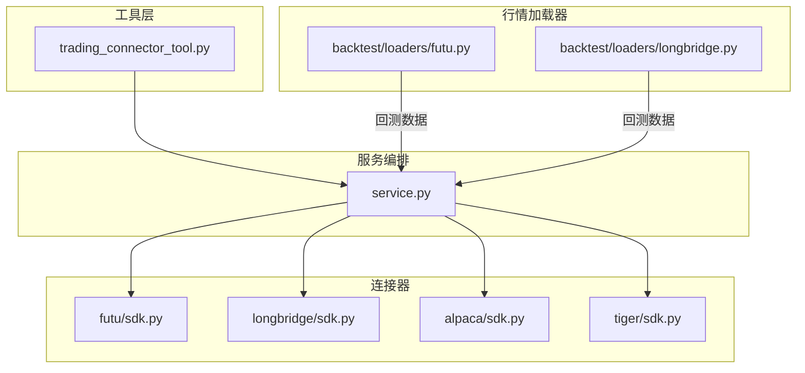
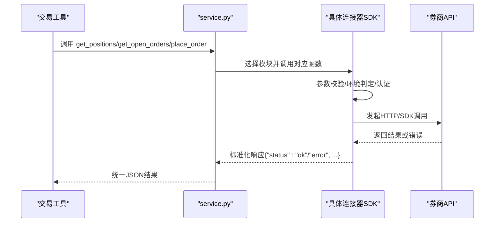
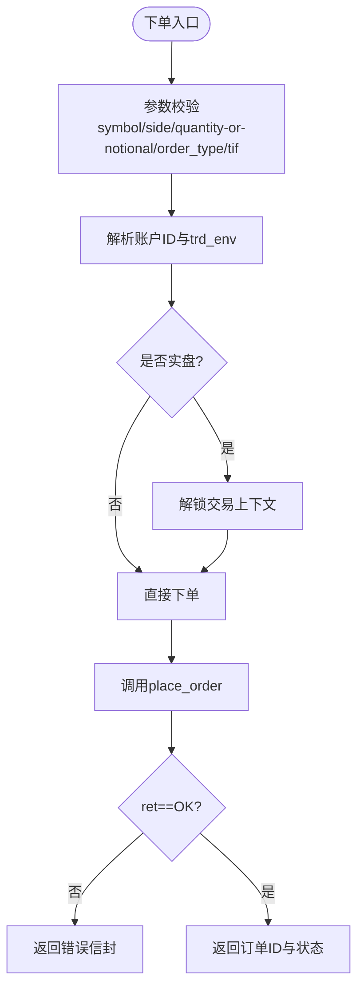
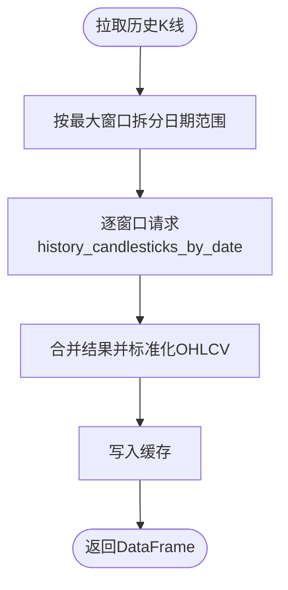
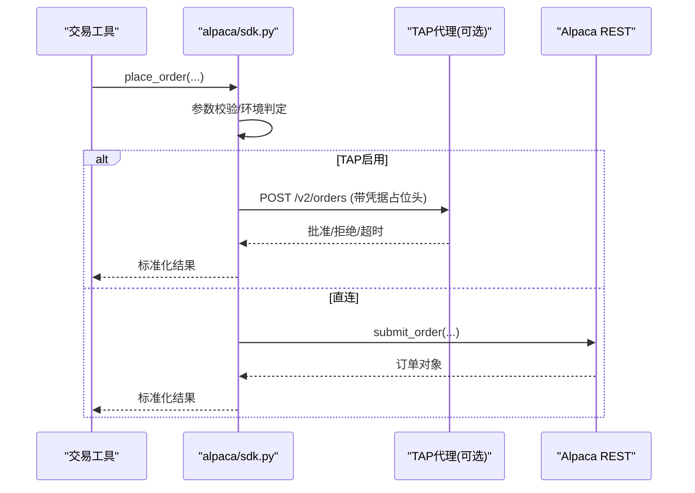
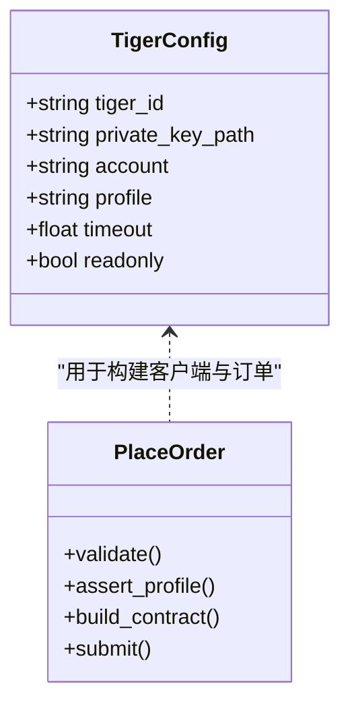
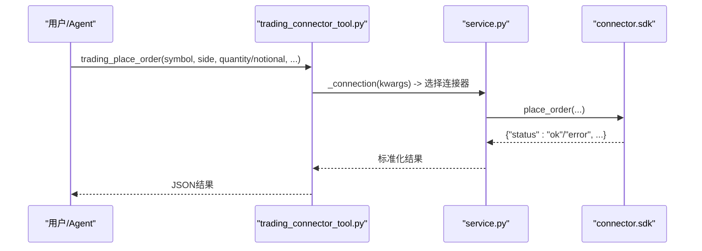
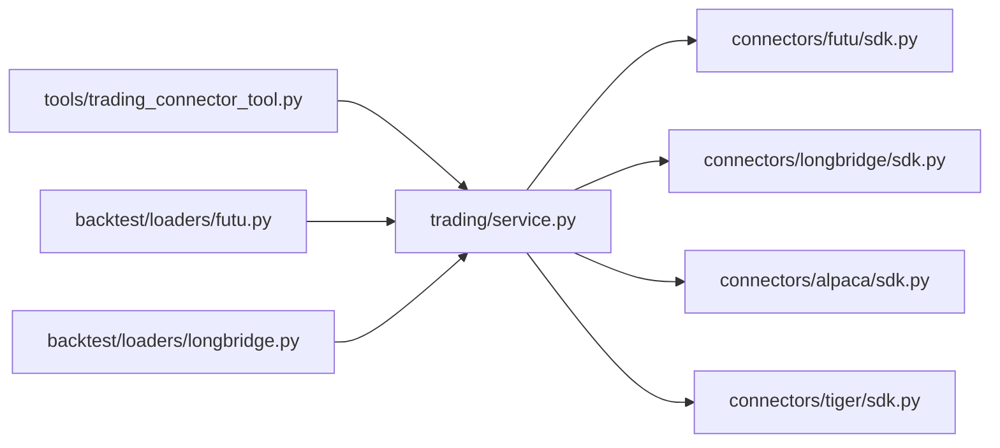

# 股票连接器

<cite>
**本文引用的文件**
- [agent/src/trading/connectors/futu/sdk.py](file://agent/src/trading/connectors/futu/sdk.py)
- [agent/backtest/loaders/futu.py](file://agent/backtest/loaders/futu.py)
- [agent/src/trading/connectors/longbridge/sdk.py](file://agent/src/trading/connectors/longbridge/sdk.py)
- [agent/backtest/loaders/longbridge.py](file://agent/backtest/loaders/longbridge.py)
- [agent/src/trading/connectors/alpaca/sdk.py](file://agent/src/trading/connectors/alpaca/sdk.py)
- [agent/src/trading/connectors/tiger/sdk.py](file://agent/src/trading/connectors/tiger/sdk.py)
- [agent/src/tools/trading_connector_tool.py](file://agent/src/tools/trading_connector_tool.py)
- [agent/src/trading/service.py](file://agent/src/trading/service.py)
- [agent/tests/test_market_detection.py](file://agent/tests/test_market_detection.py)
</cite>

## 目录
1. [简介](#简介)
2. [项目结构](#项目结构)
3. [核心组件](#核心组件)
4. [架构总览](#架构总览)
5. [详细组件分析](#详细组件分析)
6. [依赖关系分析](#依赖关系分析)
7. [性能与限制](#性能与限制)
8. [故障排查指南](#故障排查指南)
9. [结论](#结论)
10. [附录](#附录)

## 简介
本文件面向 Vibe-Trading 的股票连接器，聚焦富途牛牛（Futu）、长桥证券（Longbridge）、Alpaca 和老虎证券（Tiger）的集成实现。文档覆盖以下主题：
- 多市场支持：A股、港股、美股的符号识别与市场路由
- 交易规则与时区差异：盘前盘后、时区归一化、历史数据窗口拆分
- 特殊功能边界：融资融券、期权、ETF 买卖在各券商的能力与限制
- API 限制、认证方式与错误码处理
- 账户查询、持仓管理、订单执行与成交确认流程
- 交易时间管理、节假日与复权因子
- 多账户管理与资金调拨方案

## 项目结构
Vibe-Trading 将“行情加载器”（回测/研究）与“交易连接器”（实盘/模拟交易）分层组织：
- 行情加载器：backtest/loaders/* 提供统一的历史 OHLCV 拉取接口，适配不同券商或数据源
- 交易连接器：src/trading/connectors/* 提供统一的读接口（账户、持仓、订单、报价、历史），并在上层工具层暴露下单能力
- 服务编排：src/trading/service.py 将各连接器模块注册为可调用 SDK 模块，供 CLI/MCP/Agent 工具统一调度
- 工具层：src/tools/trading_connector_tool.py 暴露通用交易工具（如查看持仓、下单等）

图表来源
- [agent/src/trading/service.py:17-29](file://agent/src/trading/service.py#L17-L29)
- [agent/src/tools/trading_connector_tool.py:309-468](file://agent/src/tools/trading_connector_tool.py#L309-L468)
- [agent/backtest/loaders/futu.py:106-117](file://agent/backtest/loaders/futu.py#L106-L117)
- [agent/backtest/loaders/longbridge.py:199-209](file://agent/backtest/loaders/longbridge.py#L199-L209)

章节来源
- [agent/src/trading/service.py:17-29](file://agent/src/trading/service.py#L17-L29)
- [agent/src/tools/trading_connector_tool.py:309-468](file://agent/src/tools/trading_connector_tool.py#L309-L468)
- [agent/backtest/loaders/futu.py:106-117](file://agent/backtest/loaders/futu.py#L106-L117)
- [agent/backtest/loaders/longbridge.py:199-209](file://agent/backtest/loaders/longbridge.py#L199-L209)

## 核心组件
- 富途（Futu）连接器：通过本地 OpenD 网关访问富途 OpenAPI，支持 A 股与港股；提供账户快照、持仓、订单、报价、历史 K 线；下单需解锁交易上下文并遵循富途订单模型
- 长桥（Longbridge）连接器：基于 LongPort OpenAPI，支持美股与港股；历史数据按日期范围自动拆窗以避免单请求条数上限；提供账户、持仓、订单、报价、历史 K 线
- Alpaca 连接器：基于 alpaca-py SDK，支持美股；可选 TAP 代理进行凭据隔离与人工审批；提供账户、持仓、订单、报价、历史 K 线以及下单/撤单
- 老虎（Tiger）连接器：基于 tigeropen SDK，支持美股；RSA 签名静态密钥认证；提供账户、持仓、订单、报价、历史 K 线以及下单/撤单

章节来源
- [agent/src/trading/connectors/futu/sdk.py:1-25](file://agent/src/trading/connectors/futu/sdk.py#L1-L25)
- [agent/src/trading/connectors/longbridge/sdk.py:1-16](file://agent/src/trading/connectors/longbridge/sdk.py#L1-L16)
- [agent/src/trading/connectors/alpaca/sdk.py:1-20](file://agent/src/trading/connectors/alpaca/sdk.py#L1-L20)
- [agent/src/trading/connectors/tiger/sdk.py:1-18](file://agent/src/trading/connectors/tiger/sdk.py#L1-L18)

## 架构总览
整体采用“统一接口 + 多后端”的连接器架构：
- 工具层通过 service.py 动态导入具体 connector 模块，调用统一的 read/write 函数
- 每个 connector 负责自身认证、环境区分（paper/live）、参数校验、错误封装
- 回测数据通过 backtest/loaders 独立于交易连接器的数据通道获取

图表来源
- [agent/src/trading/service.py:17-29](file://agent/src/trading/service.py#L17-L29)
- [agent/src/trading/connectors/alpaca/sdk.py:299-364](file://agent/src/trading/connectors/alpaca/sdk.py#L299-L364)
- [agent/src/trading/connectors/tiger/sdk.py:233-274](file://agent/src/trading/connectors/tiger/sdk.py#L233-L274)
- [agent/src/trading/connectors/futu/sdk.py:396-519](file://agent/src/trading/connectors/futu/sdk.py#L396-L519)
- [agent/src/trading/connectors/longbridge/sdk.py:1-200](file://agent/src/trading/connectors/longbridge/sdk.py#L1-L200)

## 详细组件分析

### 富途（Futu）连接器
- 认证与环境：本地 OpenD 网关（默认 127.0.0.1:11111），通过 trd_env（SIMULATE/REAL）区分模拟/实盘；账户列表匹配 profile 环境
- 数据能力：账户快照、持仓、订单、报价、历史 K 线；下单需解锁交易上下文
- 市场支持：A 股、港股（通过符号转换与 KLType 映射）
- 限制与错误：不支持 notional-only 下单；网络/网关不可达会抛出 NoAvailableSourceError；所有错误以 {"status":"error",...} 封装

图表来源
- [agent/src/trading/connectors/futu/sdk.py:396-519](file://agent/src/trading/connectors/futu/sdk.py#L396-L519)
- [agent/backtest/loaders/futu.py:39-79](file://agent/backtest/loaders/futu.py#L39-L79)

章节来源
- [agent/src/trading/connectors/futu/sdk.py:1-25](file://agent/src/trading/connectors/futu/sdk.py#L1-L25)
- [agent/src/trading/connectors/futu/sdk.py:396-519](file://agent/src/trading/connectors/futu/sdk.py#L396-L519)
- [agent/backtest/loaders/futu.py:106-117](file://agent/backtest/loaders/futu.py#L106-L117)
- [agent/backtest/loaders/futu.py:140-172](file://agent/backtest/loaders/futu.py#L140-L172)

### 长桥（Longbridge）连接器
- 认证与环境：App Key + App Secret + Access Token；无显式 paper/live 字段，profile 为声明式信任
- 数据能力：账户快照、持仓、订单、报价、历史 K 线；历史数据按 ~180 天窗口拆分，避免单次条数上限
- 市场支持：美股、港股（符号兼容 .US/.HK 等）
- 限制与错误：日期范围过长会拒绝；初始化失败或凭证缺失会抛出 NoAvailableSourceError

图表来源
- [agent/backtest/loaders/longbridge.py:135-156](file://agent/backtest/loaders/longbridge.py#L135-L156)
- [agent/backtest/loaders/longbridge.py:255-412](file://agent/backtest/loaders/longbridge.py#L255-L412)

章节来源
- [agent/src/trading/connectors/longbridge/sdk.py:1-16](file://agent/src/trading/connectors/longbridge/sdk.py#L1-L16)
- [agent/backtest/loaders/longbridge.py:199-209](file://agent/backtest/loaders/longbridge.py#L199-L209)
- [agent/backtest/loaders/longbridge.py:255-412](file://agent/backtest/loaders/longbridge.py#L255-L412)

### Alpaca 连接器
- 认证与环境：alpaca-py SDK；paper/live 使用不同 host；可选 TAP 代理进行凭据隔离与人工审批
- 数据能力：账户快照、持仓、订单、报价、历史 K 线；下单/撤单
- 市场支持：美股（含 ETF）
- 限制与错误：feed 可选 iex/sip；TAP 路径下读写均经代理；所有错误以 {"status":"error",...} 封装

图表来源
- [agent/src/trading/connectors/alpaca/sdk.py:429-577](file://agent/src/trading/connectors/alpaca/sdk.py#L429-L577)
- [agent/src/trading/connectors/alpaca/sdk.py:580-665](file://agent/src/trading/connectors/alpaca/sdk.py#L580-L665)

章节来源
- [agent/src/trading/connectors/alpaca/sdk.py:1-20](file://agent/src/trading/connectors/alpaca/sdk.py#L1-L20)
- [agent/src/trading/connectors/alpaca/sdk.py:299-364](file://agent/src/trading/connectors/alpaca/sdk.py#L299-L364)
- [agent/src/trading/connectors/alpaca/sdk.py:429-577](file://agent/src/trading/connectors/alpaca/sdk.py#L429-L577)
- [agent/src/trading/connectors/alpaca/sdk.py:580-665](file://agent/src/trading/connectors/alpaca/sdk.py#L580-L665)

### 老虎（Tiger）连接器
- 认证与环境：RSA 签名静态密钥（tiger_id + 私钥路径 + 账号）；17 位数字账号为模拟盘
- 数据能力：账户快照、持仓、订单、报价、历史 K 线；下单/撤单
- 市场支持：美股（ETF 作为股票合约）
- 限制与错误：模拟盘不支持 GTC；notional-only 下单被拒绝；所有错误以 {"status":"error",...} 封装

图表来源
- [agent/src/trading/connectors/tiger/sdk.py:61-95](file://agent/src/trading/connectors/tiger/sdk.py#L61-L95)
- [agent/src/trading/connectors/tiger/sdk.py:333-489](file://agent/src/trading/connectors/tiger/sdk.py#L333-L489)

章节来源
- [agent/src/trading/connectors/tiger/sdk.py:1-18](file://agent/src/trading/connectors/tiger/sdk.py#L1-L18)
- [agent/src/trading/connectors/tiger/sdk.py:233-274](file://agent/src/trading/connectors/tiger/sdk.py#L233-L274)
- [agent/src/trading/connectors/tiger/sdk.py:333-489](file://agent/src/trading/connectors/tiger/sdk.py#L333-L489)

### 工具与服务编排
- trading_connector_tool.py 暴露统一工具：查看持仓、查看挂单、下单、历史K线等
- service.py 维护 broker_sdk 连接器映射，动态导入并调用统一接口

图表来源
- [agent/src/tools/trading_connector_tool.py:431-468](file://agent/src/tools/trading_connector_tool.py#L431-L468)
- [agent/src/trading/service.py:17-29](file://agent/src/trading/service.py#L17-L29)

章节来源
- [agent/src/tools/trading_connector_tool.py:309-468](file://agent/src/tools/trading_connector_tool.py#L309-L468)
- [agent/src/trading/service.py:17-29](file://agent/src/trading/service.py#L17-L29)

## 依赖关系分析
- 连接器与工具：工具层通过 service.py 动态选择连接器模块，保证统一调用契约
- 行情加载器与连接器：回测数据通过 backtest/loaders 独立获取，不依赖交易连接器的实时通道
- 市场识别：测试用例展示了 A 股、港股、美股的符号识别与分类

图表来源
- [agent/src/trading/service.py:17-29](file://agent/src/trading/service.py#L17-L29)
- [agent/backtest/loaders/futu.py:106-117](file://agent/backtest/loaders/futu.py#L106-L117)
- [agent/backtest/loaders/longbridge.py:199-209](file://agent/backtest/loaders/longbridge.py#L199-L209)

章节来源
- [agent/src/trading/service.py:17-29](file://agent/src/trading/service.py#L17-L29)
- [agent/tests/test_market_detection.py:32-68](file://agent/tests/test_market_detection.py#L32-L68)

## 性能与限制
- 富途：历史数据分页拉取（page_req_key），单页最大计数限制；OpenD 本地网关可用性影响连接成功率
- 长桥：历史数据按 ~180 天窗口拆分，避免单次条数上限；日期范围超过窗口预算会明确拒绝
- Alpaca：可选 TAP 代理引入额外审批延迟；feed 选择影响数据成本与时效
- 老虎：模拟盘不支持 GTC；下单必须提供 quantity，不支持 notional-only
- 通用：所有连接器对输入进行严格校验，错误以统一信封返回，便于上层重试与审计

章节来源
- [agent/backtest/loaders/futu.py:140-172](file://agent/backtest/loaders/futu.py#L140-L172)
- [agent/backtest/loaders/longbridge.py:135-156](file://agent/backtest/loaders/longbridge.py#L135-L156)
- [agent/src/trading/connectors/alpaca/sdk.py:429-577](file://agent/src/trading/connectors/alpaca/sdk.py#L429-L577)
- [agent/src/trading/connectors/tiger/sdk.py:333-489](file://agent/src/trading/connectors/tiger/sdk.py#L333-L489)

## 故障排查指南
- 富途
  - 无法连接 OpenD：检查主机与端口配置；is_available 探测失败会返回 false
  - 下单失败：检查 trd_env 与 acc_id 匹配；确保已解锁交易上下文
- 长桥
  - 凭证缺失/冲突：check_status 会报告 missing/partial/conflict；历史请求失败会抛 NoAvailableSourceError
  - 日期范围过大：超出窗口预算会被拒绝
- Alpaca
  - TAP 拒绝/超时：返回中包含 tap_decision 字段；检查代理审批策略
  - feed 配置错误：iex/sip 必须合法
- 老虎
  - 模拟盘 GTC：自动降级为 DAY；若仍失败，检查订单类型与价格
  - notional-only：明确拒绝，改为 quantity

章节来源
- [agent/backtest/loaders/futu.py:125-138](file://agent/backtest/loaders/futu.py#L125-L138)
- [agent/backtest/loaders/longbridge.py:241-253](file://agent/backtest/loaders/longbridge.py#L241-L253)
- [agent/backtest/loaders/longbridge.py:309-332](file://agent/backtest/loaders/longbridge.py#L309-L332)
- [agent/src/trading/connectors/alpaca/sdk.py:261-296](file://agent/src/trading/connectors/alpaca/sdk.py#L261-L296)
- [agent/src/trading/connectors/alpaca/sdk.py:580-665](file://agent/src/trading/connectors/alpaca/sdk.py#L580-L665)
- [agent/src/trading/connectors/tiger/sdk.py:333-489](file://agent/src/trading/connectors/tiger/sdk.py#L333-L489)

## 结论
Vibe-Trading 的股票连接器通过统一的服务编排与标准化的错误封装，实现了富途、长桥、Alpaca、老虎的多券商接入。其优势在于：
- 清晰的纸盘/实盘身份保护机制（Futu 的 trd_env、Alpaca 的 host 分离、Tiger 的账号格式校验）
- 稳健的历史数据拉取策略（长桥的窗口拆分、富途的分页拉取）
- 可扩展的 TAP 代理路径（Alpaca）提升凭据安全与合规性
- 统一的工具接口简化了跨券商的交易操作

对于更复杂的业务（融资融券、期权、ETF 买卖），建议在连接器之上增加策略层与风控层，结合各券商的具体能力进行适配与校验。

## 附录

### 多市场与符号识别
- 测试用例覆盖了 A 股（SH/SZ/BJ）、港股（HK）、美股（US）及印度、韩国等市场的符号识别与分类
- 建议在上层根据符号后缀与规则进行路由，确保正确的连接器与数据源选择

章节来源
- [agent/tests/test_market_detection.py:32-68](file://agent/tests/test_market_detection.py#L32-L68)

### 交易时间与复权因子
- 长桥历史数据在标准化过程中进行时区归一化（UTC 无时区）
- 富途历史数据通过 KLType 映射到分钟/日/周/月级别
- 复权因子：长桥 loader 使用 NoAdjust；其他连接器未在此处体现复权逻辑，需在策略层按需处理

章节来源
- [agent/backtest/loaders/longbridge.py:159-196](file://agent/backtest/loaders/longbridge.py#L159-L196)
- [agent/backtest/loaders/futu.py:22-36](file://agent/backtest/loaders/futu.py#L22-L36)

### 多账户管理与资金调拨
- 富途：通过 acc_id 与 trd_env 选择账户；不同账户可在同一 OpenD 中管理
- 长桥：Access Token 决定纸盘/实盘；region 控制区域主机
- Alpaca：paper/live 使用不同 host；TAP 代理集中管理凭据
- 老虎：账号格式区分纸盘/实盘；私钥与 tiger_id 绑定账户
- 资金调拨：建议在连接器之上实现跨账户转账逻辑，依据各券商 API 能力与合规要求实现

章节来源
- [agent/src/trading/connectors/futu/sdk.py:71-95](file://agent/src/trading/connectors/futu/sdk.py#L71-L95)
- [agent/src/trading/connectors/longbridge/sdk.py:58-83](file://agent/src/trading/connectors/longbridge/sdk.py#L58-L83)
- [agent/src/trading/connectors/alpaca/sdk.py:65-83](file://agent/src/trading/connectors/alpaca/sdk.py#L65-L83)
- [agent/src/trading/connectors/tiger/sdk.py:61-95](file://agent/src/trading/connectors/tiger/sdk.py#L61-L95)