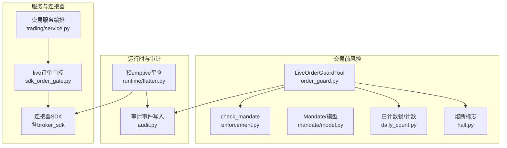
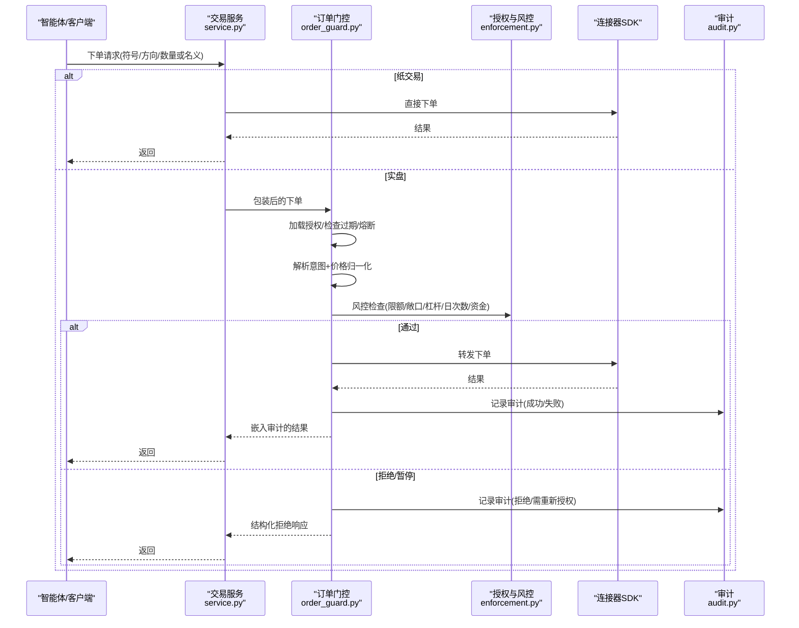
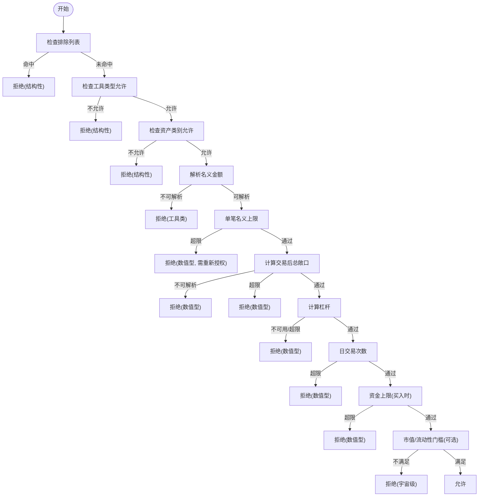
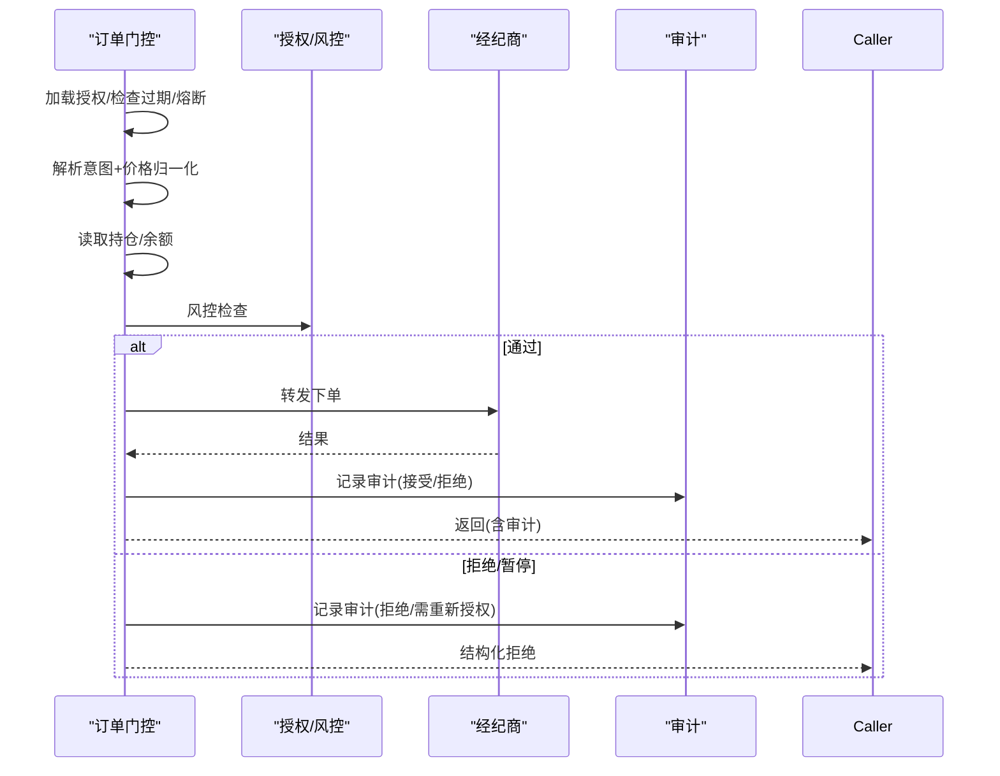
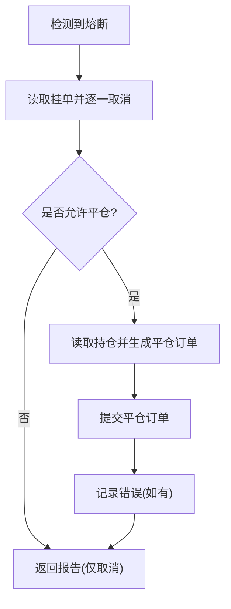
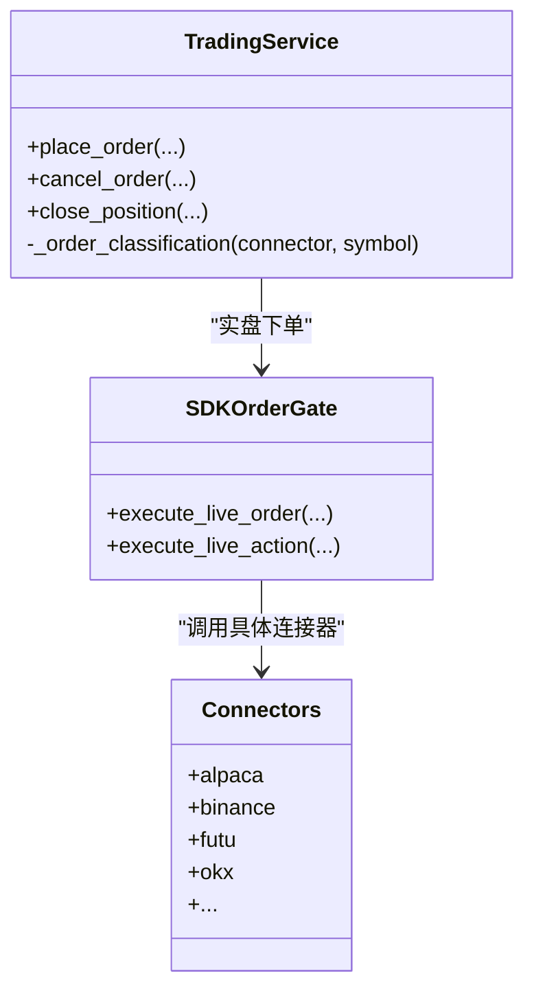
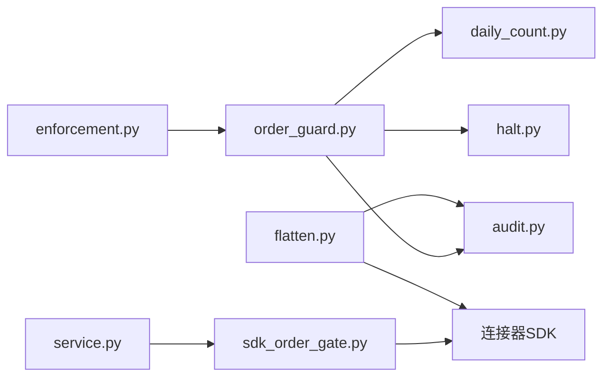

# 订单管理系统

<cite>
**本文引用的文件**
- [enforcement.py](file://agent/src/live/enforcement.py)
- [order_guard.py](file://agent/src/live/order_guard.py)
- [service.py](file://agent/src/trading/service.py)
- [flatten.py](file://agent/src/live/runtime/flatten.py)
- [audit.py](file://agent/src/live/audit.py)
- [halt.py](file://agent/src/live/halt.py)
- [daily_count.py](file://agent/src/live/daily_count.py)
- [mandate/model.py](file://agent/src/live/mandate/model.py)
- [sdk_order_gate.py](file://agent/src/live/sdk_order_gate.py)
</cite>

## 目录
1. [简介](#简介)
2. [项目结构](#项目结构)
3. [核心组件](#核心组件)
4. [架构总览](#架构总览)
5. [详细组件分析](#详细组件分析)
6. [依赖关系分析](#依赖关系分析)
7. [性能考量](#性能考量)
8. [故障排查指南](#故障排查指南)
9. [结论](#结论)
10. [附录](#附录)

## 简介
本文件为 Vibe-Trading 的订单管理系统提供全面文档，覆盖订单从创建、路由、执行到结算的全生命周期。重点包括：
- 订单校验机制、风控检查与合规验证（事前授权与限额）
- 订单状态跟踪、异常处理与重试策略（无重试原则）
- 订单优先级管理、批量操作与订单拆分策略
- 审计日志、实时监控与告警通知的实现要点
- 不同市场的订单类型支持与特殊处理逻辑
- 订单执行算法、滑点控制与成交确认机制
- 订单取消、修改与撤销的完整流程

## 项目结构
订单管理相关代码主要分布在 live（交易前风控与运行时）、trading（连接器与服务编排）、以及各市场连接器 SDK 中。关键模块职责如下：
- 交易前风控与授权：enforcement、order_guard、mandate、daily_count、halt
- 运行时紧急平仓与审计：runtime/flatten、audit
- 服务编排与连接器路由：trading/service、sdk_order_gate
- 连接器实现：各 broker_sdk 模块（如 alpaca、binance、futu 等）

**图表来源**
- [order_guard.py:130-214](file://agent/src/live/order_guard.py#L130-L214)
- [enforcement.py:455-617](file://agent/src/live/enforcement.py#L455-L617)
- [flatten.py:61-127](file://agent/src/live/runtime/flatten.py#L61-L127)
- [service.py:279-342](file://agent/src/trading/service.py#L279-L342)

**章节来源**
- [order_guard.py:1-800](file://agent/src/live/order_guard.py#L1-L800)
- [enforcement.py:1-798](file://agent/src/live/enforcement.py#L1-L798)
- [flatten.py:1-318](file://agent/src/live/runtime/flatten.py#L1-L318)
- [service.py:1-800](file://agent/src/trading/service.py#L1-L800)

## 核心组件
- 订单意图与风控引擎
  - OrderIntent：标准化订单表示（符号、方向、名义金额或数量、工具类型、资产类别）
  - check_mandate：按固定顺序执行风控检查（排除列表→工具类型→资产类别→单笔名义→总敞口→杠杆→日次数→资金），任一失败即拒绝
- 订单门控器
  - LiveOrderGuardTool：在每次下单前加载授权、检查过期、熔断、解析意图、价格归一化、读取持仓与余额、调用风控、放行或拒绝并审计
- 运行时紧急平仓
  - flatten_and_cancel：触发熔断后先取消挂单，再在授权允许时平掉所有持仓；严格“先取消后平仓”的顺序，错误不重试
- 服务编排与连接器
  - place_order/cancel_order/close_position 等统一入口，区分纸交易与实盘；实盘通过 sdk_order_gate 进入风控门控
- 审计与监控
  - write_live_action：记录每笔决策与执行结果，支持 SSE 实时推送

**章节来源**
- [enforcement.py:111-177](file://agent/src/live/enforcement.py#L111-L177)
- [order_guard.py:97-214](file://agent/src/live/order_guard.py#L97-L214)
- [flatten.py:61-127](file://agent/src/live/runtime/flatten.py#L61-L127)
- [service.py:279-342](file://agent/src/trading/service.py#L279-L342)

## 架构总览
订单从发起至执行的端到端流程如下：

**图表来源**
- [service.py:279-342](file://agent/src/trading/service.py#L279-L342)
- [order_guard.py:130-214](file://agent/src/live/order_guard.py#L130-L214)
- [enforcement.py:455-617](file://agent/src/live/enforcement.py#L455-L617)
- [audit.py:1-200](file://agent/src/live/audit.py#L1-L200)

## 详细组件分析

### 订单意图与风控检查（enforcement）
- 标准化意图：OrderIntent 明确单位与维度，避免歧义
- 检查顺序（fail-closed）：
  1) 排除列表 → 2) 工具类型允许 → 3) 资产类别允许 → 4) 单笔名义上限 → 5) 交易后总敞口 → 6) 杠杆上限 → 7) 日交易次数 → 8) 资金上限（防御性）→ 9) 市值/流动性门槛（可选）
- 价格与数据回退：当仅指定数量时，通过经纪商报价工具或数据加载器获取USD价格，取较大者作为名义金额，防止绕过限额
- 市场映射：根据工具类型与资产类别选择数据源（美股、加密、外汇等），缺失数据一律拒绝

**图表来源**
- [enforcement.py:455-617](file://agent/src/live/enforcement.py#L455-L617)
- [enforcement.py:620-676](file://agent/src/live/enforcement.py#L620-L676)

**章节来源**
- [enforcement.py:111-177](file://agent/src/live/enforcement.py#L111-L177)
- [enforcement.py:455-617](file://agent/src/live/enforcement.py#L455-L617)
- [enforcement.py:620-676](file://agent/src/live/enforcement.py#L620-L676)

### 订单门控器（order_guard）
- 执行流程：
  1) 加载授权并校验版本与有效期
  2) 检查熔断标志
  3) 解析订单意图并进行价格归一化（数量→名义）
  4) 读取持仓与账户余额
  5) 调用风控检查
  6) 通过则转发给连接器；拒绝则返回结构化拒绝并写入审计
- 价格归一化：优先使用经纪商报价工具，否则回退到数据加载器；若无法获得价格则拒绝
- 审计与监控：每笔决策与执行均写入审计，并通过 SSE 实时推送

**图表来源**
- [order_guard.py:130-214](file://agent/src/live/order_guard.py#L130-L214)
- [order_guard.py:321-389](file://agent/src/live/order_guard.py#L321-L389)
- [order_guard.py:471-573](file://agent/src/live/order_guard.py#L471-L573)

**章节来源**
- [order_guard.py:97-214](file://agent/src/live/order_guard.py#L97-L214)
- [order_guard.py:321-389](file://agent/src/live/order_guard.py#L321-L389)
- [order_guard.py:471-573](file://agent/src/live/order_guard.py#L471-L573)

### 运行时紧急平仓（flatten）
- 触发条件：熔断标志被设置
- 动作顺序：先取消所有挂单，再在授权允许时提交平仓订单；严格“先取消后平仓”，避免对冲风险
- 无重试原则：任何失败的经纪商调用只记录错误并继续，绝不重试，防止重复交易
- 审计：每个取消和平仓动作都写入审计，确保可重建

**图表来源**
- [flatten.py:61-127](file://agent/src/live/runtime/flatten.py#L61-L127)
- [flatten.py:154-273](file://agent/src/live/runtime/flatten.py#L154-L273)

**章节来源**
- [flatten.py:1-318](file://agent/src/live/runtime/flatten.py#L1-L318)

### 服务编排与连接器路由（service）
- 统一入口：place_order、cancel_order、close_position 等
- 纸交易与实盘分流：纸交易直接调用连接器；实盘通过 sdk_order_gate 进入风控门控
- 多市场分类：根据连接器与符号推断工具类型与资产类别（如美股、港股、A股、加密、外汇、CFD）
- 审计：实盘取消操作会写入审计

**图表来源**
- [service.py:279-342](file://agent/src/trading/service.py#L279-L342)
- [service.py:245-277](file://agent/src/trading/service.py#L245-L277)

**章节来源**
- [service.py:279-342](file://agent/src/trading/service.py#L279-L342)
- [service.py:245-277](file://agent/src/trading/service.py#L245-L277)

### 审计日志、实时监控与告警
- 审计事件：每笔订单决策与执行均写入审计，包含意图、请求、响应、风控决策与错误信息
- 实时监控：审计记录嵌入到返回结果中，由 API 服务器通过 SSE 推送 live.action 事件
- 告警通知：可在审计层接入外部通道（如消息平台）进行告警（扩展点）

**章节来源**
- [order_guard.py:623-664](file://agent/src/live/order_guard.py#L623-L664)
- [flatten.py:285-317](file://agent/src/live/runtime/flatten.py#L285-L317)
- [audit.py:1-200](file://agent/src/live/audit.py#L1-L200)

## 依赖关系分析
- 低耦合高内聚：
  - enforcement 专注于风控规则，不感知连接器细节
  - order_guard 负责流程编排与审计，依赖 enforcement 与 daily_count
  - runtime/flatten 独立于下单路径，专注紧急处置
  - service 作为编排层，将业务需求映射到连接器与风控门控
- 外部依赖：
  - 数据加载器用于价格与流动性指标（美股、加密等）
  - 审计系统用于持久化与实时推送

**图表来源**
- [order_guard.py:130-214](file://agent/src/live/order_guard.py#L130-L214)
- [service.py:279-342](file://agent/src/trading/service.py#L279-L342)
- [flatten.py:61-127](file://agent/src/live/runtime/flatten.py#L61-L127)

**章节来源**
- [order_guard.py:130-214](file://agent/src/live/order_guard.py#L130-L214)
- [service.py:279-342](file://agent/src/trading/service.py#L279-L342)
- [flatten.py:61-127](file://agent/src/live/runtime/flatten.py#L61-L127)

## 性能考量
- 价格归一化与数据回退：优先使用经纪商报价工具，减少网络开销；回退到数据加载器时使用短窗口与缓存友好查询
- 风控检查顺序：早期快速失败（排除列表、工具类型、资产类别）降低后续昂贵计算
- 日计数锁：并发下单场景下保证计数一致性，避免超卖
- 无重试策略：避免重复下单导致的资源浪费与对账复杂度

[本节为通用指导，无需特定文件引用]

## 故障排查指南
- 常见拒绝原因：
  - 授权无效或过期：检查授权版本与有效期
  - 熔断触发：检查熔断标志并解除后再试
  - 风控拒绝：查看 BreachEvent 的 limit、attempted_value、overage 与 kind
  - 价格不可用：确认经纪商报价工具可用或数据加载器正常
- 审计定位：
  - 通过审计记录的 intent_normalized、gate_decision、broker_request/response 定位问题
  - 运行时紧急平仓的错误会在报告中列出 phase 与 error
- 连接器问题：
  - 检查连接器状态与配置；纸交易与实盘行为不同，注意环境差异

**章节来源**
- [order_guard.py:471-573](file://agent/src/live/order_guard.py#L471-L573)
- [flatten.py:154-273](file://agent/src/live/runtime/flatten.py#L154-L273)
- [service.py:279-342](file://agent/src/trading/service.py#L279-L342)

## 结论
Vibe-Trading 的订单管理系统以“事前授权+严格风控+运行时紧急处置+全量审计”为核心，确保订单在全生命周期中的安全与可控。通过标准化的订单意图、固定的风控检查顺序、无重试的执行策略与完善的审计体系，系统在多市场、多连接器环境下提供了稳健的交易保障。未来可扩展更多市场与风控规则，同时保持 fail-closed 的安全原则。

[本节为总结，无需特定文件引用]

## 附录

### 订单生命周期与状态跟踪
- 状态流转：
  - 创建 → 风控检查 → 放行/拒绝 → 执行 → 成交确认/失败 → 审计记录
- 异常处理：
  - 结构化拒绝响应，携带 breach 详情与是否需要重新授权
  - 运行时紧急平仓的错误记录与报告
- 重试机制：
  - 明确无重试原则，避免重复交易

**章节来源**
- [order_guard.py:321-389](file://agent/src/live/order_guard.py#L321-L389)
- [flatten.py:285-317](file://agent/src/live/runtime/flatten.py#L285-L317)

### 订单优先级、批量操作与拆分策略
- 优先级：当前实现未显式定义优先级队列；可通过策略层或调度器实现
- 批量操作：运行时紧急平仓为批量取消与平仓；日常下单建议逐笔风控，避免批量绕过限额
- 拆分策略：建议在策略层按限额与流动性拆分大单，结合 ADV 与滑点控制

[本节为概念性内容，无需特定文件引用]

### 不同市场的订单类型支持与特殊处理
- 美股/ETF：默认资产类别 US_EQUITY/US_ETF，支持市值/流动性门槛
- 加密：资产类别 CRYPTO，使用加密数据源
- 外汇/CFD：通过连接器分类（如 MT5），部分市场不支持市值/流动性门槛
- 多市场权益：通过符号标记推断资产类别（HK、US、CN）

**章节来源**
- [service.py:245-277](file://agent/src/trading/service.py#L245-L277)
- [enforcement.py:57-91](file://agent/src/live/enforcement.py#L57-L91)

### 执行算法、滑点控制与成交确认
- 执行算法：连接器 SDK 负责具体执行；系统层面关注风控与审计
- 滑点控制：通过名义金额上限、总敞口与杠杆限制间接控制；可在策略层结合流动性指标调整
- 成交确认：审计记录包含 broker_response，可用于确认与对账

**章节来源**
- [order_guard.py:321-389](file://agent/src/live/order_guard.py#L321-L389)
- [service.py:279-342](file://agent/src/trading/service.py#L279-L342)

### 订单取消、修改与撤销
- 取消：cancel_order 直接调用连接器；实盘写入审计
- 修改：连接器 SDK 可能支持 modify_order；系统层无统一封装，需按连接器实现
- 撤销：紧急平仓为撤销暴露的批量撤销；普通订单撤销遵循连接器能力

**章节来源**
- [service.py:345-370](file://agent/src/trading/service.py#L345-L370)
- [flatten.py:154-204](file://agent/src/live/runtime/flatten.py#L154-L204)