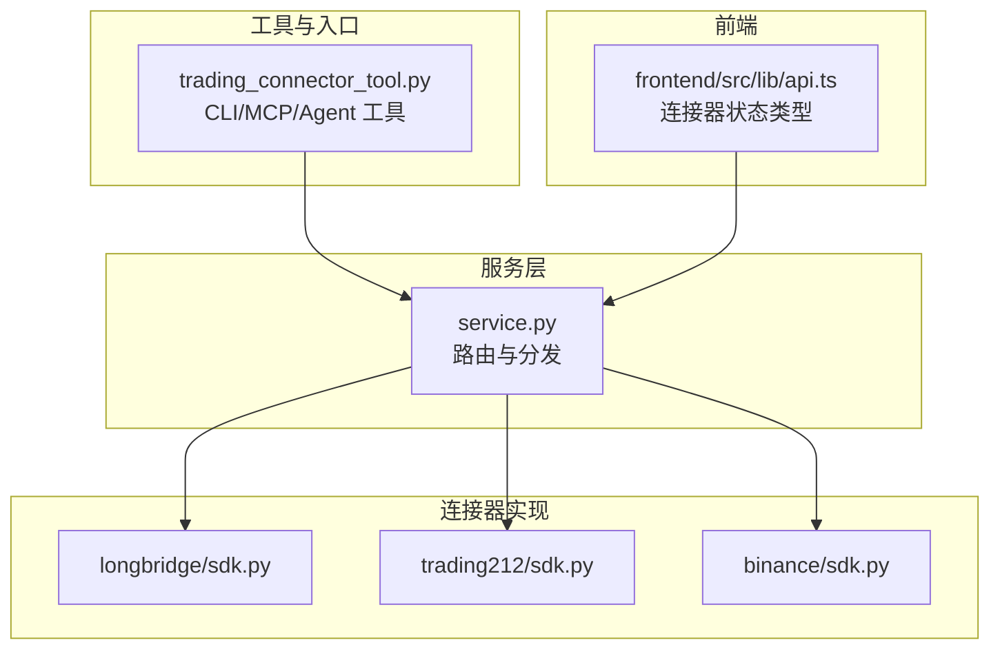
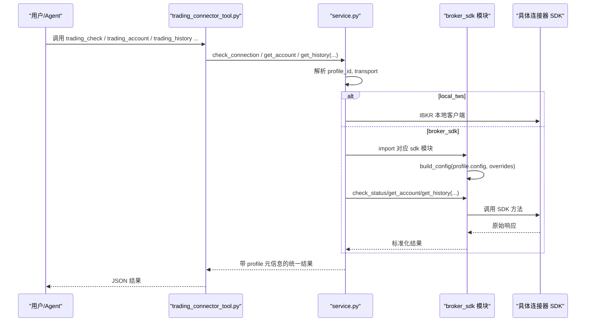
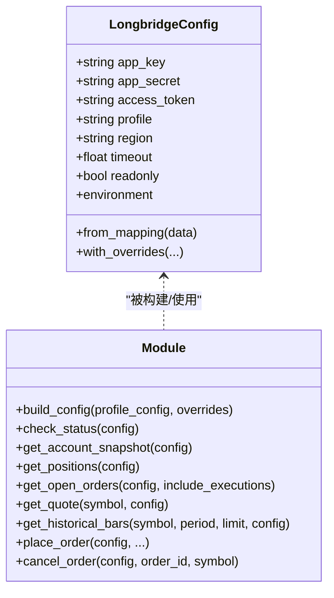
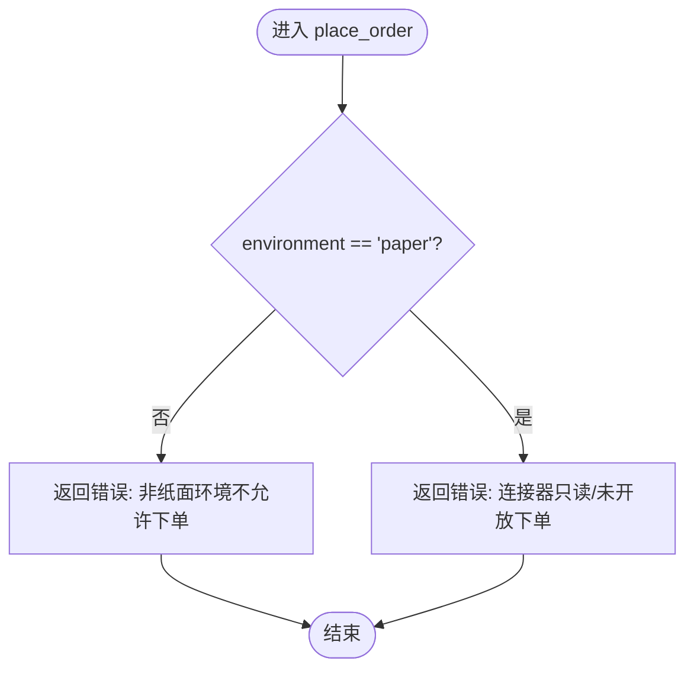
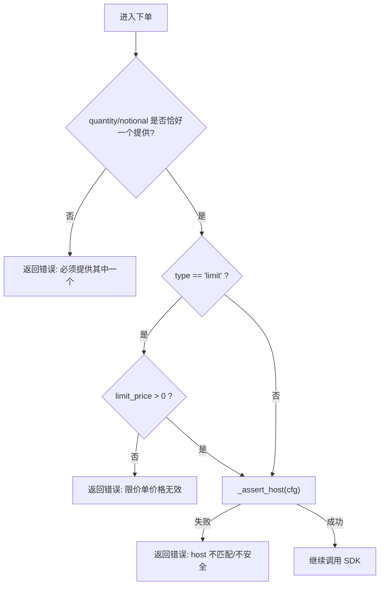
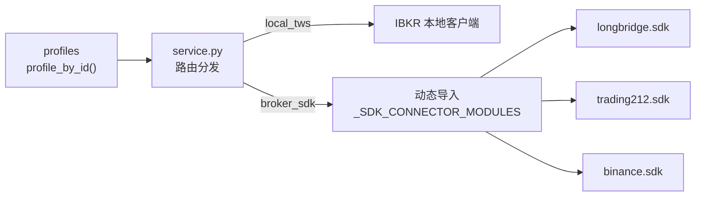
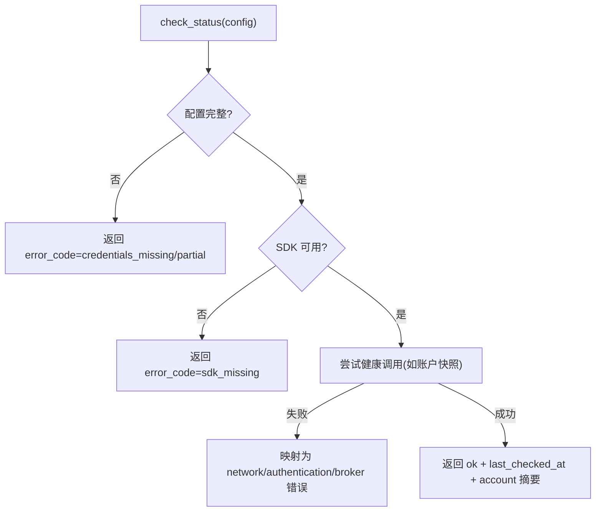
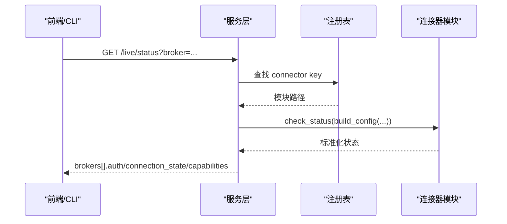

# 连接器架构设计

<cite>
**本文引用的文件**
- [agent/src/trading/service.py](file://agent/src/trading/service.py)
- [agent/src/tools/trading_connector_tool.py](file://agent/src/tools/trading_connector_tool.py)
- [agent/src/trading/connectors/longbridge/sdk.py](file://agent/src/trading/connectors/longbridge/sdk.py)
- [agent/src/trading/connectors/trading212/sdk.py](file://agent/src/trading/connectors/trading212/sdk.py)
- [agent/src/trading/connectors/binance/sdk.py](file://agent/src/trading/connectors/binance/sdk.py)
- [agent/tests/test_longbridge_runtime.py](file://agent/tests/test_longbridge_runtime.py)
- [frontend/src/lib/api.ts](file://frontend/src/lib/api.ts)
</cite>

## 目录
1. [简介](#简介)
2. [项目结构](#项目结构)
3. [核心组件](#核心组件)
4. [架构总览](#架构总览)
5. [详细组件分析](#详细组件分析)
6. [依赖关系分析](#依赖关系分析)
7. [性能与并发](#性能与并发)
8. [故障恢复与错误处理](#故障恢复与错误处理)
9. [配置与动态加载](#配置与动态加载)
10. [扩展开发指南](#扩展开发指南)
11. [注册、发现与路由](#注册发现与路由)
12. [结论](#结论)

## 简介
本文件面向 Vibe-Trading 的“连接器架构”，聚焦于统一抽象层、认证机制、错误处理策略、连接池管理、生命周期与状态同步、故障恢复、配置文件结构与验证规则、动态加载、性能优化、并发控制与资源管理，以及新券商接入的标准流程。文档以代码级事实为依据，结合类图、时序图和流程图，帮助读者从高层到细节全面理解系统如何把多家券商/数据源抽象为一致的“连接器”能力，并通过服务层进行路由与编排。

## 项目结构
Vibe-Trading 将“连接器”按券商或协议拆分为独立模块，每个模块提供统一的只读接口（账户、持仓、订单、行情、历史），并在需要时暴露下单/撤单等写操作。服务层负责根据“交易资料（profile）”选择具体实现；工具层对外暴露稳定的 CLI/MCP/REST 入口；前端通过 API 类型定义消费连接器状态。

图表来源
- [agent/src/tools/trading_connector_tool.py:1-800](file://agent/src/tools/trading_connector_tool.py#L1-L800)
- [agent/src/trading/service.py:1-200](file://agent/src/trading/service.py#L1-L200)
- [agent/src/trading/connectors/longbridge/sdk.py:1-800](file://agent/src/trading/connectors/longbridge/sdk.py#L1-L800)
- [agent/src/trading/connectors/trading212/sdk.py:1-587](file://agent/src/trading/connectors/trading212/sdk.py#L1-L587)
- [agent/src/trading/connectors/binance/sdk.py:475-503](file://agent/src/trading/connectors/binance/sdk.py#L475-L503)
- [frontend/src/lib/api.ts:1125-1184](file://frontend/src/lib/api.ts#L1125-L1184)

章节来源
- [agent/src/tools/trading_connector_tool.py:1-800](file://agent/src/tools/trading_connector_tool.py#L1-L800)
- [agent/src/trading/service.py:1-200](file://agent/src/trading/service.py#L1-L200)

## 核心组件
- 统一接口契约：所有 broker_sdk 连接器需暴露 build_config、check_status、get_account_snapshot、get_positions、get_open_orders、get_quote、get_historical_bars 等函数，以便服务层无差别调用。
- 配置对象：每个连接器使用不可变 dataclass 描述连接参数，并提供 from_mapping/with_overrides 等方法做校验与覆盖。
- 健康检查：check_status 返回标准化诊断信息，包含配置完整性、SDK 可用性、环境标识、最近检查时间等。
- 安全边界：对 live/paper 的区分采用“结构性守卫”（如 host 隔离、profile 标签、API 能力限制），在连接器内部拒绝不安全路径。
- 工具与服务：工具层只做参数校验与结果包装；服务层负责 profile 解析、连接器选择与结果归一化。

章节来源
- [agent/src/trading/service.py:1-200](file://agent/src/trading/service.py#L1-L200)
- [agent/src/trading/connectors/longbridge/sdk.py:58-171](file://agent/src/trading/connectors/longbridge/sdk.py#L58-L171)
- [agent/src/trading/connectors/trading212/sdk.py:46-131](file://agent/src/trading/connectors/trading212/sdk.py#L46-L131)

## 架构总览
下图展示从工具到服务再到具体连接器的调用链，以及前端对连接器状态的消费。

图表来源
- [agent/src/tools/trading_connector_tool.py:262-428](file://agent/src/tools/trading_connector_tool.py#L262-L428)
- [agent/src/trading/service.py:42-200](file://agent/src/trading/service.py#L42-L200)
- [agent/src/trading/connectors/longbridge/sdk.py:220-269](file://agent/src/trading/connectors/longbridge/sdk.py#L220-L269)
- [agent/src/trading/connectors/trading212/sdk.py:162-195](file://agent/src/trading/connectors/trading212/sdk.py#L162-L195)

## 详细组件分析

### Longbridge 连接器
- 配置模型：不可变 dataclass，支持 from_mapping 校验 profile/region，with_overrides 仅允许安全覆盖。
- 凭证解析：集中式 resolve_longbridge_credentials，记录 _credential_source/_credential_error，避免敏感字段泄露。
- 健康检查：check_status 输出结构化报告，包括 configured、sdk_installed、paper_guard、last_checked_at 等。
- 只读优先：默认 readonly=True；下单路径仅在 paper 环境且满足严格输入校验后执行。
- 周期映射：内置 period→SDK Period 枚举映射，保证跨周期一致性。

图表来源
- [agent/src/trading/connectors/longbridge/sdk.py:58-171](file://agent/src/trading/connectors/longbridge/sdk.py#L58-L171)
- [agent/src/trading/connectors/longbridge/sdk.py:220-428](file://agent/src/trading/connectors/longbridge/sdk.py#L220-L428)
- [agent/src/trading/connectors/longbridge/sdk.py:449-619](file://agent/src/trading/connectors/longbridge/sdk.py#L449-L619)

章节来源
- [agent/src/trading/connectors/longbridge/sdk.py:58-171](file://agent/src/trading/connectors/longbridge/sdk.py#L58-L171)
- [agent/src/trading/connectors/longbridge/sdk.py:220-428](file://agent/src/trading/connectors/longbridge/sdk.py#L220-L428)
- [agent/src/trading/connectors/longbridge/sdk.py:449-619](file://agent/src/trading/connectors/longbridge/sdk.py#L449-L619)

### Trading 212 连接器
- 配置模型：不可变 dataclass，校验 base_url 必须以 http(s) 开头，profile 限定为 paper/live-readonly/live。
- 健康检查：check_status 先校验缺失字段，再尝试读取账户快照，失败时返回结构化 error。
- 市场数据能力声明：quote/history 明确返回“不支持”的错误负载，避免伪造数据。
- 下单/撤单：在未具备结构性 paper/live 边界前，一律拒绝。

图表来源
- [agent/src/trading/connectors/trading212/sdk.py:350-390](file://agent/src/trading/connectors/trading212/sdk.py#L350-L390)

章节来源
- [agent/src/trading/connectors/trading212/sdk.py:46-131](file://agent/src/trading/connectors/trading212/sdk.py#L46-L131)
- [agent/src/trading/connectors/trading212/sdk.py:162-195](file://agent/src/trading/connectors/trading212/sdk.py#L162-L195)
- [agent/src/trading/connectors/trading212/sdk.py:317-336](file://agent/src/trading/connectors/trading212/sdk.py#L317-L336)
- [agent/src/trading/connectors/trading212/sdk.py:350-390](file://agent/src/trading/connectors/trading212/sdk.py#L350-L390)

### Binance 连接器（示例：下单前置校验）
- 数量/名义值互斥校验：quantity 与 notional 必须二选一且为正数。
- 限价单要求：limit_price 必须为正数。
- 结构性守卫：在真正调用 SDK 前，通过 _assert_host 断言 host 隔离，防止误连生产。

图表来源
- [agent/src/trading/connectors/binance/sdk.py:475-503](file://agent/src/trading/connectors/binance/sdk.py#L475-L503)

章节来源
- [agent/src/trading/connectors/binance/sdk.py:475-503](file://agent/src/trading/connectors/binance/sdk.py#L475-L503)

## 依赖关系分析
服务层通过“transport”和“connector”两个维度决定调用路径：
- local_tws：直接调用 IBKR 本地客户端。
- broker_sdk：通过映射表动态导入对应 sdk 模块，并调用其统一接口。
- remote：走远程 MCP/其他通道（不在本节展开）。

图表来源
- [agent/src/trading/service.py:13-39](file://agent/src/trading/service.py#L13-L39)
- [agent/src/trading/service.py:42-65](file://agent/src/trading/service.py#L42-L65)

章节来源
- [agent/src/trading/service.py:13-65](file://agent/src/trading/service.py#L13-L65)

## 性能与并发
- 连接池与超时：部分渠道（如 IM 通道）展示了分离请求池与超时配置的最佳实践，可借鉴到连接器 HTTP/SDK 客户端中，避免长轮询阻塞出站请求。
- 批量与分页：连接器应尽可能利用 SDK 的分页/批量能力，减少往返次数。
- 缓存与降级：历史数据拉取建议引入可选本地缓存（如数据缓存开关），命中则跳过网络；对不可用数据源快速失败而非静默降级。
- 序列化与数值安全：Decimal/浮点转换要谨慎，避免 NaN/Inf 泄漏；JSON 输出保持 strict。

[本节为通用指导，不直接分析具体文件]

## 故障恢复与错误处理
- 健康检查：check_status 将错误分类为 credentials_missing、credentials_partial、sdk_missing、network_unreachable、authentication_failed、broker_error 等，便于上层统一呈现与重试策略。
- 错误消息脱敏：公共配置输出中对密钥进行掩码，避免日志泄露。
- 结构性拒绝：对于不具备结构性 paper/live 边界的券商，连接器在入口处直接拒绝 live 下单，确保 fail-closed。
- 前端状态消费：前端定义了 ConnectorVerifyResponse/LiveBrokerStatus 等类型，用于渲染连接状态、能力集、只读标记等。

图表来源
- [agent/src/trading/connectors/longbridge/sdk.py:220-318](file://agent/src/trading/connectors/longbridge/sdk.py#L220-L318)
- [agent/src/trading/connectors/trading212/sdk.py:162-195](file://agent/src/trading/connectors/trading212/sdk.py#L162-L195)
- [frontend/src/lib/api.ts:1125-1184](file://frontend/src/lib/api.ts#L1125-L1184)

章节来源
- [agent/src/trading/connectors/longbridge/sdk.py:220-318](file://agent/src/trading/connectors/longbridge/sdk.py#L220-L318)
- [agent/src/trading/connectors/trading212/sdk.py:162-195](file://agent/src/trading/connectors/trading212/sdk.py#L162-L195)
- [frontend/src/lib/api.ts:1125-1184](file://frontend/src/lib/api.ts#L1125-L1184)

## 配置与动态加载
- 配置文件：每个连接器维护独立的 JSON 配置文件（如 longbridge.json、trading212.json），位于运行时根目录；保存时设置 owner-only 权限。
- 配置解析：from_mapping 负责字段校验与规范化（profile、region/base_url、timeout 等），with_overrides 支持 CLI/工具覆盖。
- 动态加载：服务层通过 _SDK_CONNECTOR_MODULES 映射表，按 connector key 动态 import 对应 sdk 模块，无需硬编码分支。
- 环境变量与 .env：CLI 启动时会尝试加载 .env 候选路径，使凭据与环境变量可在运行期注入。

章节来源
- [agent/src/trading/connectors/longbridge/sdk.py:174-208](file://agent/src/trading/connectors/longbridge/sdk.py#L174-L208)
- [agent/src/trading/connectors/trading212/sdk.py:134-159](file://agent/src/trading/connectors/trading212/sdk.py#L134-L159)
- [agent/src/trading/service.py:13-39](file://agent/src/trading/service.py#L13-L39)
- [agent/cli/main.py:289-327](file://agent/cli/main.py#L289-L327)

## 扩展开发指南
新增券商接入标准流程（以 broker_sdk 为例）：
1. 创建模块目录与 sdk.py，定义不可变 Config dataclass，实现 from_mapping/with_overrides/environment。
2. 实现统一接口：build_config、check_status、get_account_snapshot、get_positions、get_open_orders、get_quote、get_historical_bars；如需下单，实现 place_order/cancel_order 并确保结构性安全守卫。
3. 在 service.py 的 _SDK_CONNECTOR_MODULES 中注册 connector key → 模块路径。
4. 编写测试：覆盖配置校验、健康检查、只读能力、错误映射、下单拒绝路径（若适用）。
5. 文档与类型：在前端 api.ts 中补充连接器状态字段（如 capabilities、readonly、connection_state）。

最佳实践
- 始终在入口处进行结构性安全判断（host 隔离、profile 标签、能力白名单）。
- 错误分类清晰，消息脱敏，避免泄露密钥。
- 对不支持的能力明确返回“不支持”，而不是伪造数据。
- 配置变更幂等，保存时设置最小权限。

章节来源
- [agent/src/trading/service.py:13-39](file://agent/src/trading/service.py#L13-L39)
- [agent/src/trading/connectors/longbridge/sdk.py:58-171](file://agent/src/trading/connectors/longbridge/sdk.py#L58-L171)
- [agent/src/trading/connectors/trading212/sdk.py:46-131](file://agent/src/trading/connectors/trading212/sdk.py#L46-L131)
- [frontend/src/lib/api.ts:1125-1184](file://frontend/src/lib/api.ts#L1125-L1184)

## 注册、发现与路由
- 注册：服务层维护 _SDK_CONNECTOR_MODULES 映射，新增连接器只需在此登记。
- 发现：CLI/工具通过 profiles 列表展示可用连接资料；前端通过 /live/status 获取各券商连接状态。
- 路由：service.py 根据 profile.transport 与 profile.connector 选择 local_tws 或 broker_sdk 路径；后者通过动态 import 调用具体模块。

图表来源
- [agent/src/trading/service.py:42-65](file://agent/src/trading/service.py#L42-L65)
- [agent/tests/test_longbridge_runtime.py:104-136](file://agent/tests/test_longbridge_runtime.py#L104-L136)
- [agent/tests/test_longbridge_runtime.py:230-247](file://agent/tests/test_longbridge_runtime.py#L230-L247)
- [agent/tests/test_longbridge_runtime.py:389-427](file://agent/tests/test_longbridge_runtime.py#L389-L427)

章节来源
- [agent/src/trading/service.py:42-65](file://agent/src/trading/service.py#L42-L65)
- [agent/tests/test_longbridge_runtime.py:104-136](file://agent/tests/test_longbridge_runtime.py#L104-L136)
- [agent/tests/test_longbridge_runtime.py:230-247](file://agent/tests/test_longbridge_runtime.py#L230-L247)
- [agent/tests/test_longbridge_runtime.py:389-427](file://agent/tests/test_longbridge_runtime.py#L389-L427)

## 结论
Vibe-Trading 的连接器架构通过“统一接口 + 服务层路由 + 模块化实现”的方式，实现了多券商/协议的解耦接入与一致体验。其关键优势在于：
- 强约束的配置与校验，降低误配风险。
- 标准化的健康检查与错误分类，提升可观测性与可运维性。
- 结构性安全守卫（host/profile/能力）保障 live 环境安全。
- 动态加载与注册表机制，使扩展成本低、耦合小。
- 工具/服务/连接器分层清晰，便于测试与维护。

遵循本文档的流程与最佳实践，可以快速、安全地接入新的券商或协议，并保持与现有生态的一致性。