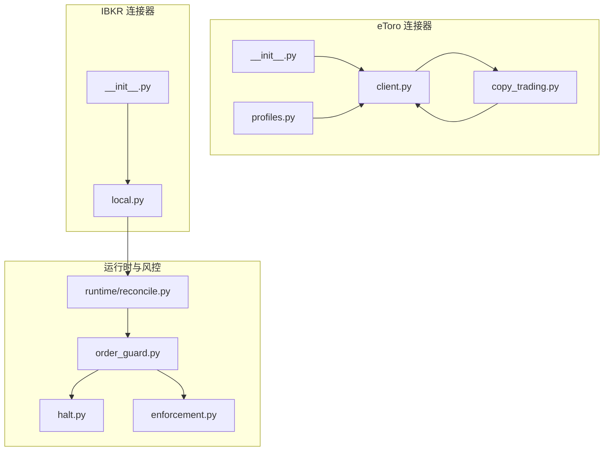
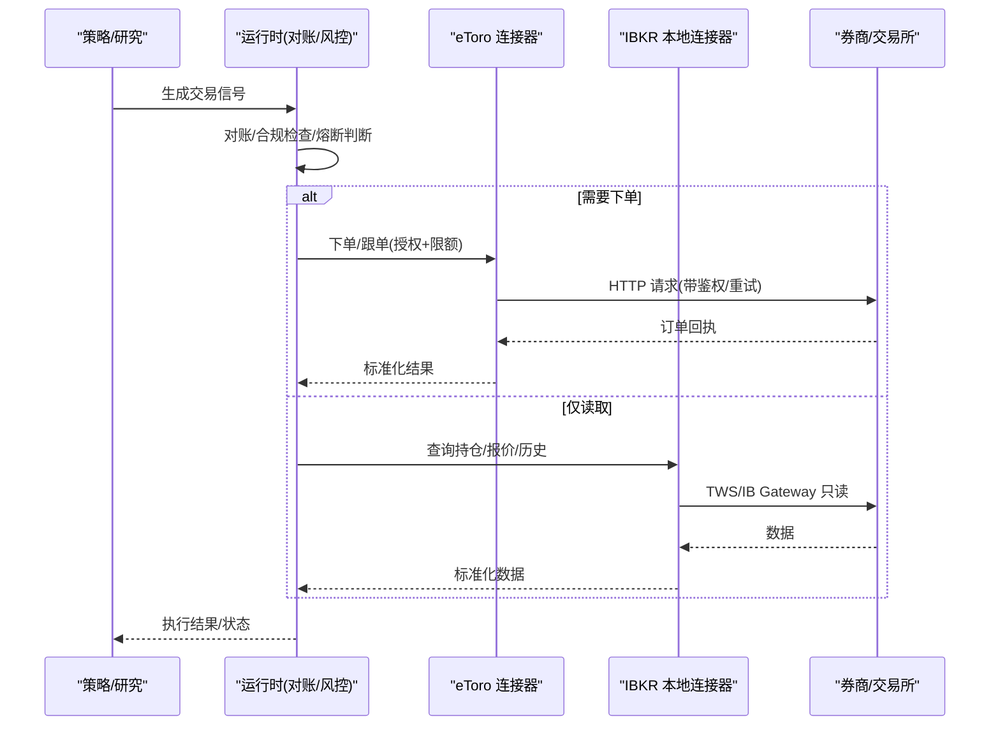
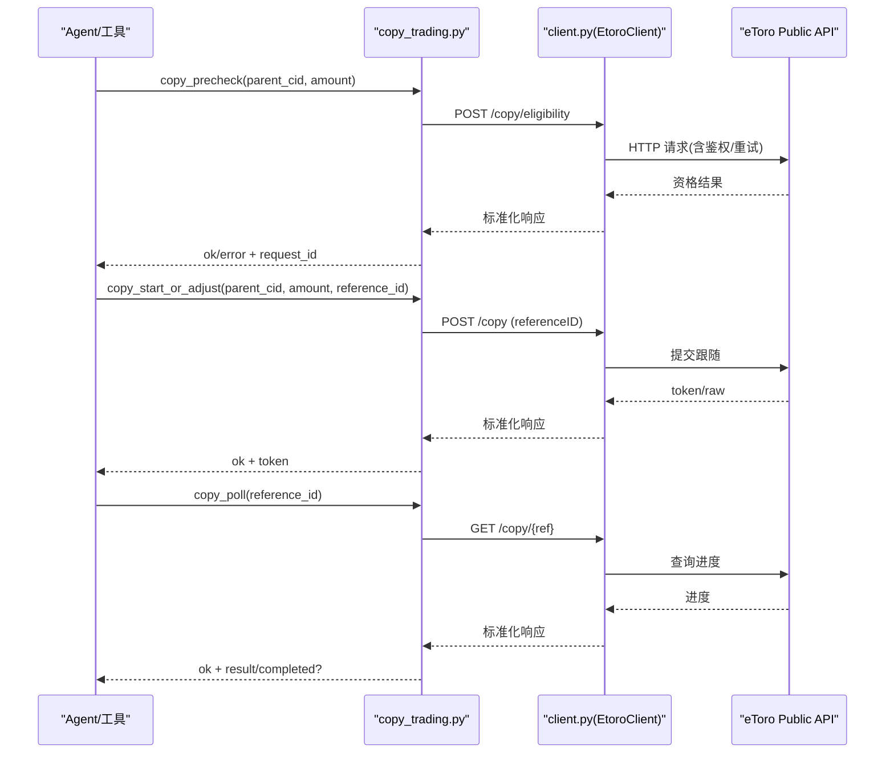
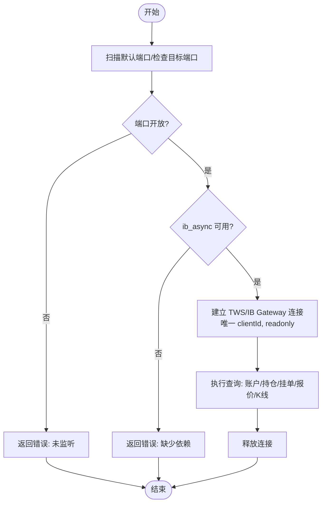
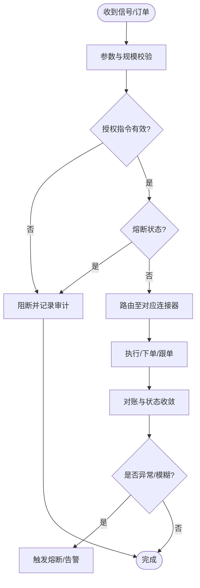
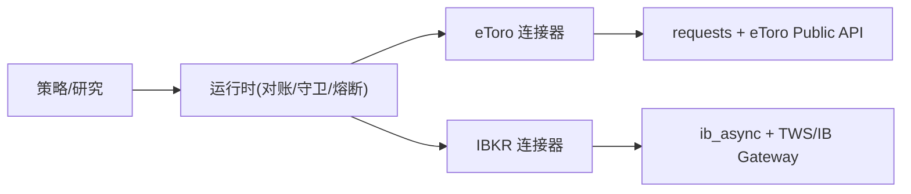

# 高级交易连接器

<cite>
**本文引用的文件**
- [agent/src/trading/connectors/etoro/__init__.py](file://agent/src/trading/connectors/etoro/__init__.py)
- [agent/src/trading/connectors/etoro/client.py](file://agent/src/trading/connectors/etoro/client.py)
- [agent/src/trading/connectors/etoro/copy_trading.py](file://agent/src/trading/connectors/etoro/copy_trading.py)
- [agent/src/trading/connectors/etoro/profiles.py](file://agent/src/trading/connectors/etoro/profiles.py)
- [agent/src/trading/connectors/ibkr/__init__.py](file://agent/src/trading/connectors/ibkr/__init__.py)
- [agent/src/trading/connectors/ibkr/local.py](file://agent/src/trading/connectors/ibkr/local.py)
- [agent/src/trading/connectors/futu/sdk.py](file://agent/src/trading/connectors/futu/sdk.py)
- [agent/src/trading/connectors/mt5/orders.py](file://agent/src/trading/connectors/mt5/orders.py)
- [agent/src/live/runtime/reconcile.py](file://agent/src/live/runtime/reconcile.py)
- [agent/src/live/order_guard.py](file://agent/src/live/order_guard.py)
- [agent/src/live/halt.py](file://agent/src/live/halt.py)
- [agent/src/live/enforcement.py](file://agent/src/live/enforcement.py)
- [README.md](file://README.md)
</cite>

## 目录
1. [简介](#简介)
2. [项目结构](#项目结构)
3. [核心组件](#核心组件)
4. [架构总览](#架构总览)
5. [详细组件分析](#详细组件分析)
6. [依赖关系分析](#依赖关系分析)
7. [性能考量](#性能考量)
8. [故障排查指南](#故障排查指南)
9. [结论](#结论)
10. [附录](#附录)

## 简介
本文件面向 Vibe-Trading 的高级交易连接器，聚焦 eToro 社交交易平台与 Interactive Brokers（IBKR）本地客户端的集成实现，并覆盖专业级交易系统的关键能力：跟单交易（Copy Trading）、智能投资组合、算法交易、复杂订单路由、风险管理与合规检查、机构级托管/清算结算与报告生成，以及与第三方研究与数据分析平台的集成方案。文档以代码级事实为依据，提供架构图、序列图、流程图和可操作的最佳实践。

## 项目结构
Vibe-Trading 的交易连接器采用“按券商/平台分目录”的组织方式，每个连接器包含配置、客户端封装、能力声明与读写路径隔离等模块。eToro 通过 REST API 暴露交易与跟单能力；IBKR 通过本地 TWS/IB Gateway 只读连接，避免直接云端直连带来的凭证与权限风险。

图表来源
- [agent/src/trading/connectors/etoro/__init__.py:1-7](file://agent/src/trading/connectors/etoro/__init__.py#L1-L7)
- [agent/src/trading/connectors/etoro/client.py:1-325](file://agent/src/trading/connectors/etoro/client.py#L1-L325)
- [agent/src/trading/connectors/etoro/copy_trading.py:1-213](file://agent/src/trading/connectors/etoro/copy_trading.py#L1-L213)
- [agent/src/trading/connectors/etoro/profiles.py:1-22](file://agent/src/trading/connectors/etoro/profiles.py#L1-L22)
- [agent/src/trading/connectors/ibkr/__init__.py:1-26](file://agent/src/trading/connectors/ibkr/__init__.py#L1-L26)
- [agent/src/trading/connectors/ibkr/local.py:1-686](file://agent/src/trading/connectors/ibkr/local.py#L1-L686)
- [agent/src/live/runtime/reconcile.py](file://agent/src/live/runtime/reconcile.py)
- [agent/src/live/order_guard.py](file://agent/src/live/order_guard.py)
- [agent/src/live/halt.py](file://agent/src/live/halt.py)
- [agent/src/live/enforcement.py](file://agent/src/live/enforcement.py)

章节来源
- [agent/src/trading/connectors/etoro/__init__.py:1-7](file://agent/src/trading/connectors/etoro/__init__.py#L1-L7)
- [agent/src/trading/connectors/ibkr/__init__.py:1-26](file://agent/src/trading/connectors/ibkr/__init__.py#L1-L26)

## 核心组件
- eToro 连接器
  - 配置与传输层：统一的路径选择（demo vs live）、请求重试与错误归一化、凭据校验。
  - 跟单交易：预检查、启动/调整、轮询完成、关闭/解绑，支持幂等参考 ID 与超时控制。
  - 能力声明：读写分离、写操作需授权指令与熔断保护。
- IBKR 连接器
  - 本地只读：通过 TWS/IB Gateway 获取账户快照、持仓、挂单、报价与历史K线。
  - 连接池：线程安全、唯一 client_id、自动断连释放。
  - 环境校验：纸盘/实盘账户前缀校验，防止误连。
- 运行时与风控
  - 对账与恢复：发现孤儿订单、模糊状态订单时触发熔断。
  - 订单守卫：下单前规模/名义价值限制、活体授权门控。
  - 熔断与执行：在异常或合规不通过时阻止新增风险动作。

章节来源
- [agent/src/trading/connectors/etoro/client.py:1-325](file://agent/src/trading/connectors/etoro/client.py#L1-L325)
- [agent/src/trading/connectors/etoro/copy_trading.py:1-213](file://agent/src/trading/connectors/etoro/copy_trading.py#L1-L213)
- [agent/src/trading/connectors/etoro/profiles.py:1-22](file://agent/src/trading/connectors/etoro/profiles.py#L1-L22)
- [agent/src/trading/connectors/ibkr/local.py:1-686](file://agent/src/trading/connectors/ibkr/local.py#L1-L686)
- [agent/src/live/runtime/reconcile.py](file://agent/src/live/runtime/reconcile.py)
- [agent/src/live/order_guard.py](file://agent/src/live/order_guard.py)
- [agent/src/live/halt.py](file://agent/src/live/halt.py)
- [agent/src/live/enforcement.py](file://agent/src/live/enforcement.py)

## 架构总览
下图展示从策略到执行的全链路：策略信号经运行时对账与风控后，进入各券商连接器；eToro 走 REST API 并支持跟单交易；IBKR 仅做本地只读数据接入，便于组合分析与监控。

图表来源
- [agent/src/trading/connectors/etoro/client.py:218-304](file://agent/src/trading/connectors/etoro/client.py#L218-L304)
- [agent/src/trading/connectors/etoro/copy_trading.py:29-185](file://agent/src/trading/connectors/etoro/copy_trading.py#L29-L185)
- [agent/src/trading/connectors/ibkr/local.py:165-425](file://agent/src/trading/connectors/ibkr/local.py#L165-L425)
- [agent/src/live/runtime/reconcile.py](file://agent/src/live/runtime/reconcile.py)
- [agent/src/live/order_guard.py](file://agent/src/live/order_guard.py)

## 详细组件分析

### eToro 跟单交易（Copy Trading）
- 能力与流程
  - 预检查：校验金额与环境，调用 eligibility 接口。
  - 启动/调整：提交跟随任务，要求 URL-safe 参考 ID，返回 token 用于后续轮询。
  - 轮询：按 reference_id 查询进度，直至完成或超时。
  - 关闭/解绑：按 mirror_id 关闭或解绑跟随。
- 安全边界
  - demo/live 路径隔离，写操作需授权指令与熔断保护。
  - 金额单位与账户币种一致，失败快速返回结构化错误。

图表来源
- [agent/src/trading/connectors/etoro/copy_trading.py:29-185](file://agent/src/trading/connectors/etoro/copy_trading.py#L29-L185)
- [agent/src/trading/connectors/etoro/client.py:218-304](file://agent/src/trading/connectors/etoro/client.py#L218-L304)

章节来源
- [agent/src/trading/connectors/etoro/copy_trading.py:1-213](file://agent/src/trading/connectors/etoro/copy_trading.py#L1-L213)
- [agent/src/trading/connectors/etoro/client.py:1-325](file://agent/src/trading/connectors/etoro/client.py#L1-L325)
- [agent/src/trading/connectors/etoro/profiles.py:1-22](file://agent/src/trading/connectors/etoro/profiles.py#L1-L22)
- [README.md:1275-1296](file://README.md#L1275-L1296)

### IBKR 本地只读连接与数据服务
- 功能范围
  - 账户快照、持仓、挂单、报价、历史K线。
  - 默认端口扫描、健康检查、SDK 可用性检测。
  - 纸盘/实盘账户前缀校验，防止误配。
- 连接模型
  - 线程本地连接池，唯一 client_id，自动释放。
  - 通过 TWS/IB Gateway 本地 Socket 通信，不直接访问云端。

图表来源
- [agent/src/trading/connectors/ibkr/local.py:165-239](file://agent/src/trading/connectors/ibkr/local.py#L165-L239)
- [agent/src/trading/connectors/ibkr/local.py:429-503](file://agent/src/trading/connectors/ibkr/local.py#L429-L503)
- [agent/src/trading/connectors/ibkr/local.py:241-425](file://agent/src/trading/connectors/ibkr/local.py#L241-L425)

章节来源
- [agent/src/trading/connectors/ibkr/local.py:1-686](file://agent/src/trading/connectors/ibkr/local.py#L1-L686)
- [agent/src/trading/connectors/ibkr/__init__.py:1-26](file://agent/src/trading/connectors/ibkr/__init__.py#L1-L26)

### 其他专业级系统示例（Futu、MT5）
- Futu SDK
  - 严格数量与限价校验，市场单/限价单映射，下单与撤销。
  - 错误归一化，失败快速返回结构化信息。
- MT5 订单
  - 对冲账户下反向开仓不等于平仓，需基于票据号精确平仓。
  - 连接器级别规模限制（手数/名义价值），作为兜底防护。

章节来源
- [agent/src/trading/connectors/futu/sdk.py:453-599](file://agent/src/trading/connectors/futu/sdk.py#L453-L599)
- [agent/src/trading/connectors/mt5/orders.py:1-39](file://agent/src/trading/connectors/mt5/orders.py#L1-L39)

### 运行时对账、订单守卫与熔断
- 对账（Reconcile）
  - 识别孤儿订单、模糊状态订单，必要时触发熔断，禁止重发。
- 订单守卫（Order Guard）
  - 下单前进行规模/名义价值限制，结合授权指令与熔断状态。
- 熔断（Halt）
  - 在异常或合规不通过时阻止新增风险动作，保留只读与减仓能力。

图表来源
- [agent/src/live/runtime/reconcile.py](file://agent/src/live/runtime/reconcile.py)
- [agent/src/live/order_guard.py](file://agent/src/live/order_guard.py)
- [agent/src/live/halt.py](file://agent/src/live/halt.py)
- [agent/src/live/enforcement.py](file://agent/src/live/enforcement.py)

章节来源
- [agent/src/live/runtime/reconcile.py](file://agent/src/live/runtime/reconcile.py)
- [agent/src/live/order_guard.py](file://agent/src/live/order_guard.py)
- [agent/src/live/halt.py](file://agent/src/live/halt.py)
- [agent/src/live/enforcement.py](file://agent/src/live/enforcement.py)

## 依赖关系分析
- eToro 连接器
  - 依赖 requests 进行 HTTP 通信，内置重试与退避。
  - 配置文件与密钥来自用户目录与环境变量，路径与环境强绑定。
- IBKR 连接器
  - 依赖 ib_async 与本地 TWS/IB Gateway，强调只读与安全边界。
  - 连接池管理生命周期，避免并发冲突。
- 运行时
  - 对账、守卫、熔断与执行编排形成闭环，确保一致性。

图表来源
- [agent/src/trading/connectors/etoro/client.py:218-304](file://agent/src/trading/connectors/etoro/client.py#L218-L304)
- [agent/src/trading/connectors/ibkr/local.py:429-503](file://agent/src/trading/connectors/ibkr/local.py#L429-L503)
- [agent/src/live/runtime/reconcile.py](file://agent/src/live/runtime/reconcile.py)
- [agent/src/live/order_guard.py](file://agent/src/live/order_guard.py)
- [agent/src/live/halt.py](file://agent/src/live/halt.py)

章节来源
- [agent/src/trading/connectors/etoro/client.py:1-325](file://agent/src/trading/connectors/etoro/client.py#L1-L325)
- [agent/src/trading/connectors/ibkr/local.py:1-686](file://agent/src/trading/connectors/ibkr/local.py#L1-L686)
- [agent/src/live/runtime/reconcile.py](file://agent/src/live/runtime/reconcile.py)
- [agent/src/live/order_guard.py](file://agent/src/live/order_guard.py)
- [agent/src/live/halt.py](file://agent/src/live/halt.py)

## 性能考量
- eToro
  - 使用指数退避与 429 重试，降低瞬时拥塞影响。
  - 跟单轮询建议合理间隔与超时，避免频繁请求。
- IBKR
  - 连接池复用减少握手开销；批量查询尽量合并。
  - 历史K线与报价按需拉取，避免过大窗口导致延迟。
- 运行时
  - 对账与守卫应在内存中快速完成，避免阻塞主循环。
  - 熔断触发后优先保障减仓与只读能力，提升恢复速度。

[本节为通用指导，无需特定文件引用]

## 故障排查指南
- eToro 常见问题
  - 凭据缺失：检查配置文件与环境变量是否完整。
  - 网络/限流：关注 429 与重试次数，适当增大间隔。
  - 跟单失败：确认 parent_cid、amount、reference_id 格式与账户币种。
- IBKR 常见问题
  - 端口未监听：确认 TWS/IB Gateway 已登录并启用 API。
  - 依赖缺失：安装 ib_async 并确保版本兼容。
  - 纸盘/实盘误配：检查账户前缀与 profile 设置。
- 运行时问题
  - 对账发现孤儿/模糊订单：根据提示修复或触发熔断。
  - 下单被拒：检查授权指令、熔断状态与规模限制。

章节来源
- [agent/src/trading/connectors/etoro/client.py:169-187](file://agent/src/trading/connectors/etoro/client.py#L169-L187)
- [agent/src/trading/connectors/etoro/client.py:225-290](file://agent/src/trading/connectors/etoro/client.py#L225-L290)
- [agent/src/trading/connectors/ibkr/local.py:165-239](file://agent/src/trading/connectors/ibkr/local.py#L165-L239)
- [agent/src/trading/connectors/ibkr/local.py:530-541](file://agent/src/trading/connectors/ibkr/local.py#L530-L541)
- [agent/src/live/runtime/reconcile.py](file://agent/src/live/runtime/reconcile.py)
- [agent/src/live/order_guard.py](file://agent/src/live/order_guard.py)
- [agent/src/live/halt.py](file://agent/src/live/halt.py)

## 结论
Vibe-Trading 的高级交易连接器通过 eToro 的 REST API 与 IBKR 的本地只读连接，构建了安全、可扩展且可审计的执行与数据通路。eToro 的跟单交易提供了社交交易的便捷入口，IBKR 的本地连接确保了数据的安全与稳定。运行时对账、订单守卫与熔断机制共同保障了生产环境的稳健性。建议在部署中严格遵循纸盘/实盘隔离、授权指令与熔断策略，并结合第三方研究与数据分析平台进行组合优化与风险管理。

[本节为总结性内容，无需特定文件引用]

## 附录
- 专业级功能清单（基于仓库实现）
  - 跟单交易：eToro 预检查、启动/调整、轮询、关闭/解绑。
  - 本地只读数据：IBKR 账户快照、持仓、挂单、报价、历史K线。
  - 复杂订单类型：Futu 市场单/限价单；MT5 对冲账户精确平仓。
  - 条件单与算法订单：通过连接器与运行时规则组合实现（如止损、跟踪止盈）。
  - 批量操作：按标的集合批量查询与下单（注意速率限制与风控）。
  - 投资组合分析：结合 IBKR 持仓与外部数据源进行组合度量。
  - 风险管理与合规：订单规模/名义价值限制、授权指令、熔断与审计日志。
  - 机构级能力：托管/清算结算与报告生成可通过运行时与外部系统集成扩展。
  - 第三方集成：将 eToro/IBKR 数据对接至研究与分析平台，形成闭环决策。

[本节为概念性补充，无需特定文件引用]