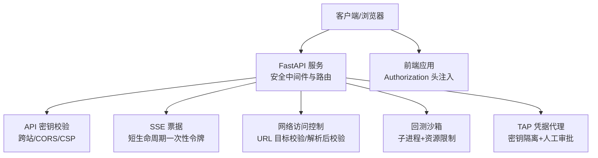
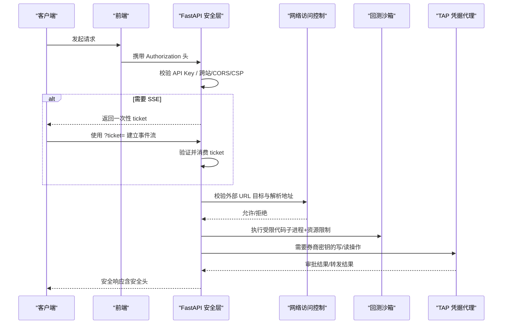
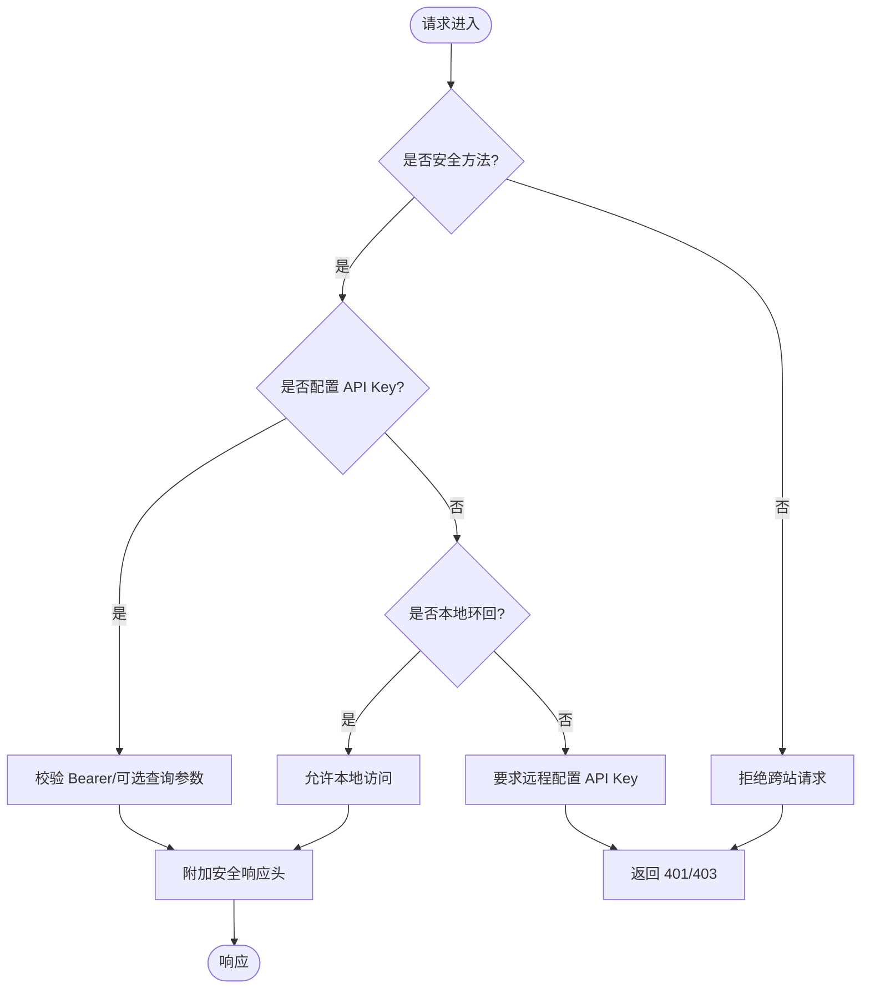
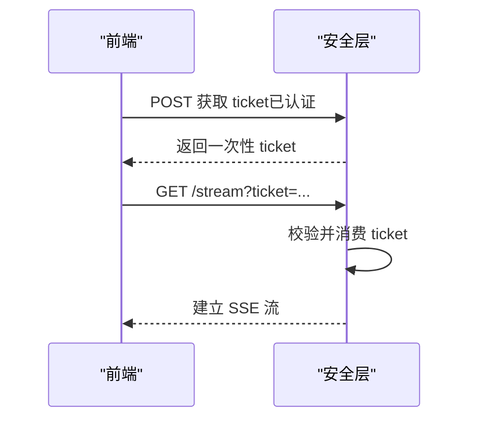
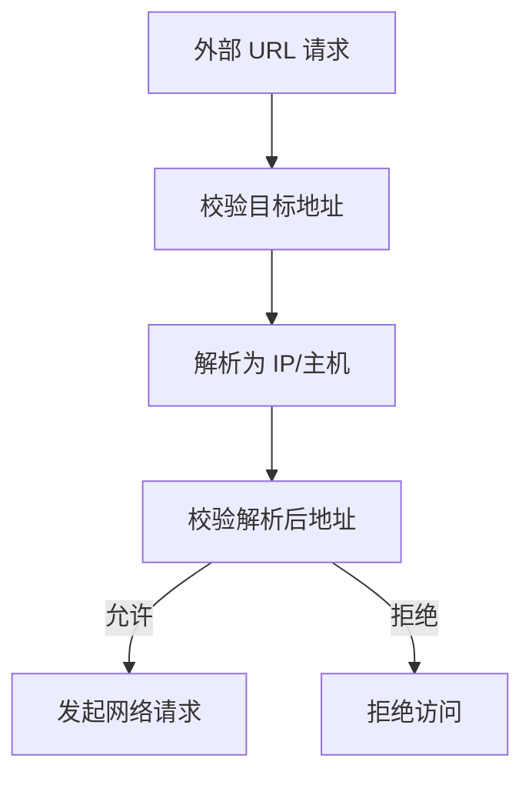
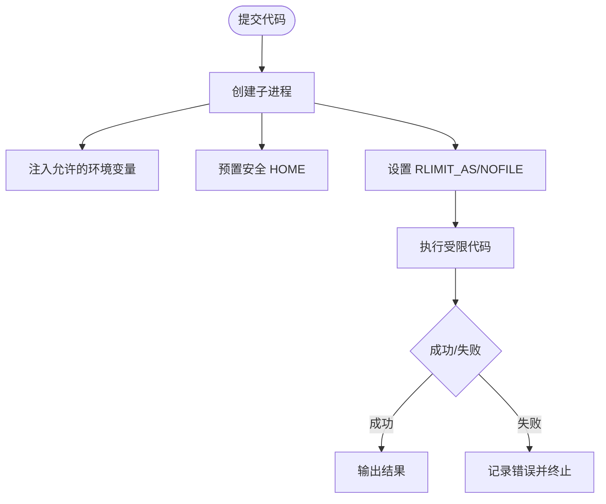
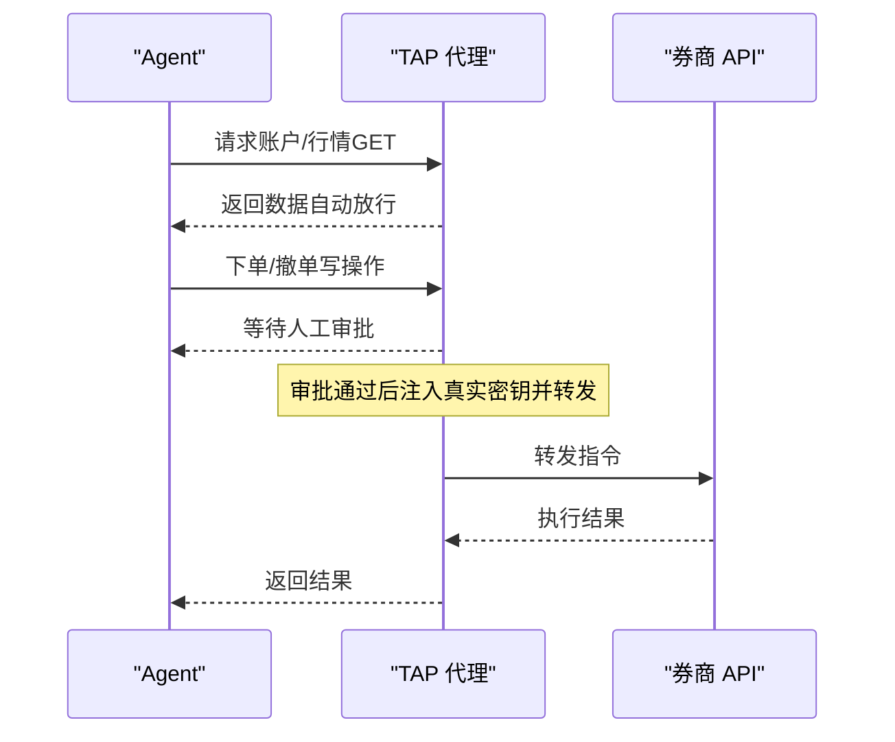
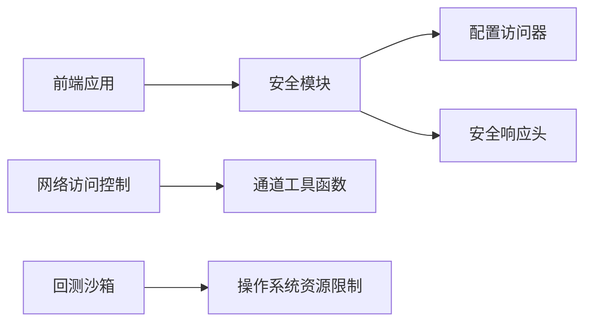

# 企业级安全

<cite>
**本文引用的文件**
- [agent/src/api/security.py](file://agent/src/api/security.py)
- [agent/src/security/network.py](file://agent/src/security/network.py)
- [agent/src/channels/utils.py](file://agent/src/channels/utils.py)
- [agent/src/core/runner.py](file://agent/src/core/runner.py)
- [agent/tests/test_runner_env.py](file://agent/tests/test_runner_env.py)
- [agent/tests/test_sse_ticket_and_headers.py](file://agent/tests/test_sse_ticket_and_headers.py)
- [frontend/src/lib/apiAuth.ts](file://frontend/src/lib/apiAuth.ts)
- [README_zh.md](file://README_zh.md)
- [README.md](file://README.md)
</cite>

## 目录
1. [简介](#简介)
2. [项目结构](#项目结构)
3. [核心组件](#核心组件)
4. [架构总览](#架构总览)
5. [详细组件分析](#详细组件分析)
6. [依赖关系分析](#依赖关系分析)
7. [性能与安全特性](#性能与安全特性)
8. [故障排除指南](#故障排除指南)
9. [结论](#结论)
10. [附录：合规与审计清单](#附录合规与审计清单)

## 简介
本文件面向 Vibe-Trading 的企业级安全体系，聚焦多层防护机制：API 密钥管理、会话与流式认证、权限控制、审计追踪、代码沙箱执行环境、资源限制、网络访问控制、工作区隔离、数据加密与传输安全。文档同时提供安全配置最佳实践、漏洞防护与威胁检测思路、审计日志分析方法、合规检查清单以及策略配置示例与故障排除指引。

## 项目结构
围绕安全的关键位置包括：
- API 鉴权与安全头：位于后端 FastAPI 安全模块，统一处理 Bearer 校验、跨站请求保护、CORS、CSP、SSE 票据等。
- 网络访问控制：对通道媒体与外部 URL 进行目标白名单与解析后地址校验，防止 SSRF。
- 回测沙箱与资源限制：通过子进程执行与 rlimit 约束，限制内存与文件句柄，避免滥用。
- 前端凭证注入：浏览器侧将 API Key 以 Authorization 头附加到请求。
- 券商凭据代理（TAP）：将敏感密钥隔离在代理层，写操作需人工审批，读操作自动放行。

**图示来源**
- [agent/src/api/security.py:166-253](file://agent/src/api/security.py#L166-L253)
- [agent/src/security/network.py:1-11](file://agent/src/security/network.py#L1-L11)
- [agent/src/core/runner.py:1-200](file://agent/src/core/runner.py#L1-L200)
- [frontend/src/lib/apiAuth.ts:1-21](file://frontend/src/lib/apiAuth.ts#L1-L21)
- [README_zh.md:1313-1325](file://README_zh.md#L1313-L1325)

**章节来源**
- [agent/src/api/security.py:166-253](file://agent/src/api/security.py#L166-L253)
- [agent/src/security/network.py:1-11](file://agent/src/security/network.py#L1-L11)
- [agent/src/core/runner.py:1-200](file://agent/src/core/runner.py#L1-L200)
- [frontend/src/lib/apiAuth.ts:1-21](file://frontend/src/lib/apiAuth.ts#L1-L21)
- [README_zh.md:1313-1325](file://README_zh.md#L1313-L1325)

## 核心组件
- API 密钥管理与跨站保护：支持 Bearer Token、可选查询参数透传（受控）、同源校验、CSRF 加固、CORS 严格白名单、CSP 响应头。
- SSE 流式认证票据：浏览器无法发送 Authorization 头时，先换取一次性 ticket，再用于 EventSource 连接，避免密钥泄露到 URL/日志。
- 网络访问控制：对通道媒体与外部 URL 进行目标合法性校验与解析后地址校验，拒绝内网/CGNAT/mesh 等非全局目标。
- 回测沙箱执行：子进程运行用户代码，预置 HOME 与最小化环境变量，设置 RLIMIT_AS/NOFILE 等资源上限，阻断危险系统调用。
- 凭据代理（TAP）：Agent 不持有券商明文密钥；写操作阻塞等待人工审批；读操作自动转发；allowed_hosts 钉死目标主机。
- 前端凭证注入：前端将 API Key 放入 Authorization 头，确保每次请求携带认证信息。

**章节来源**
- [agent/src/api/security.py:343-504](file://agent/src/api/security.py#L343-L504)
- [agent/src/api/security.py:571-622](file://agent/src/api/security.py#L571-L622)
- [agent/src/security/network.py:1-11](file://agent/src/security/network.py#L1-L11)
- [agent/tests/test_runner_env.py:188-318](file://agent/tests/test_runner_env.py#L188-L318)
- [README_zh.md:1313-1325](file://README_zh.md#L1313-L1325)
- [frontend/src/lib/apiAuth.ts:1-21](file://frontend/src/lib/apiAuth.ts#L1-L21)

## 架构总览
下图展示从客户端到后端的安全链路，涵盖认证、流式票据、网络控制、沙箱执行与凭据代理。

**图示来源**
- [agent/src/api/security.py:343-504](file://agent/src/api/security.py#L343-L504)
- [agent/src/api/security.py:571-622](file://agent/src/api/security.py#L571-L622)
- [agent/src/security/network.py:1-11](file://agent/src/security/network.py#L1-L11)
- [agent/src/core/runner.py:1-200](file://agent/src/core/runner.py#L1-L200)
- [README_zh.md:1313-1325](file://README_zh.md#L1313-L1325)

## 详细组件分析

### API 密钥与跨站保护
- 支持 Bearer Token 校验，未配置密钥时仅信任本地环回客户端；远程访问必须提供密钥。
- 对非安全 HTTP 方法（POST/PUT/DELETE）强制同源校验，拦截跨站请求。
- CORS 默认仅信任本地开发端口，额外来源需显式配置且禁止通配符。
- 响应头包含 CSP、X-Content-Type-Options、X-Frame-Options、Permissions-Policy、Referrer-Policy。
- 访问日志中对 api_key/ticket 等敏感查询参数值进行脱敏。

**图示来源**
- [agent/src/api/security.py:343-504](file://agent/src/api/security.py#L343-L504)
- [agent/src/api/security.py:235-253](file://agent/src/api/security.py#L235-L253)
- [agent/src/api/security.py:260-283](file://agent/src/api/security.py#L260-L283)

**章节来源**
- [agent/src/api/security.py:343-504](file://agent/src/api/security.py#L343-L504)
- [agent/src/api/security.py:235-253](file://agent/src/api/security.py#L235-L253)
- [agent/src/api/security.py:260-283](file://agent/src/api/security.py#L260-L283)

### SSE 流式认证票据
- 浏览器 EventSource 不支持 Authorization 头，因此先通过已认证的接口换取一次性 ticket。
- ticket 具备短 TTL 与单次消费语义，被消费后立即失效，防止重放。
- 非浏览器客户端继续使用 Bearer Token，保持兼容。

**图示来源**
- [agent/src/api/security.py:300-341](file://agent/src/api/security.py#L300-L341)
- [agent/src/api/security.py:591-622](file://agent/src/api/security.py#L591-L622)
- [agent/tests/test_sse_ticket_and_headers.py:1-44](file://agent/tests/test_sse_ticket_and_headers.py#L1-L44)

**章节来源**
- [agent/src/api/security.py:300-341](file://agent/src/api/security.py#L300-L341)
- [agent/src/api/security.py:591-622](file://agent/src/api/security.py#L591-L622)
- [agent/tests/test_sse_ticket_and_headers.py:1-44](file://agent/tests/test_sse_ticket_and_headers.py#L1-L44)

### 网络访问控制（SSRF 防护）
- 通道媒体与外部 URL 读取前进行目标合法性校验，拒绝 CGNAT/mesh/non-global 等不安全目标。
- 解析后的地址再次校验，防止 DNS Rebinding。
- 通过统一的工具函数对外暴露，便于各通道复用。

**图示来源**
- [agent/src/security/network.py:1-11](file://agent/src/security/network.py#L1-L11)
- [agent/src/channels/utils.py:1-200](file://agent/src/channels/utils.py#L1-L200)

**章节来源**
- [agent/src/security/network.py:1-11](file://agent/src/security/network.py#L1-L11)
- [agent/src/channels/utils.py:1-200](file://agent/src/channels/utils.py#L1-L200)

### 代码沙箱与资源限制
- 回测脚本在独立子进程中执行，继承最小化环境变量，避免泄露父进程密钥。
- 预置安全的 HOME 目录，确保第三方库初始化不会失败。
- 通过 rlimit 限制地址空间与文件句柄数量，防止资源耗尽攻击。
- 测试覆盖 rlimit 生效路径与 HOME 预置行为。

**图示来源**
- [agent/src/core/runner.py:1-200](file://agent/src/core/runner.py#L1-L200)
- [agent/tests/test_runner_env.py:188-318](file://agent/tests/test_runner_env.py#L188-L318)

**章节来源**
- [agent/src/core/runner.py:1-200](file://agent/src/core/runner.py#L1-L200)
- [agent/tests/test_runner_env.py:188-318](file://agent/tests/test_runner_env.py#L188-L318)

### 凭据代理（TAP）与权限控制
- Agent 不直接持有券商明文密钥，所有出口走 TAP 代理；写操作需人工审批，读操作自动放行。
- 凭据绑定 allowed_hosts，篡改目标会被拒绝。
- 结合 mandate 与订单守卫，实现有界自主交易与完整审计。

**图示来源**
- [README_zh.md:1313-1325](file://README_zh.md#L1313-L1325)
- [README.md:1430-1452](file://README.md#L1430-L1452)

**章节来源**
- [README_zh.md:1313-1325](file://README_zh.md#L1313-L1325)
- [README.md:1430-1452](file://README.md#L1430-L1452)

### 前端凭证注入
- 前端将 API Key 存入本地存储，并在每次请求时附加 Authorization 头。
- 空值时移除键，避免无效头。

**章节来源**
- [frontend/src/lib/apiAuth.ts:1-21](file://frontend/src/lib/apiAuth.ts#L1-L21)

## 依赖关系分析
- 安全模块依赖配置访问器与环境变量解析，保证密钥与 CORS/CSP 策略动态加载。
- 网络访问控制依赖通道工具函数，集中化校验逻辑，降低耦合。
- 沙箱执行依赖操作系统资源限制能力，测试覆盖 POSIX 平台行为。
- 前端依赖后端安全头与认证策略，确保跨域与安全性一致。

**图示来源**
- [agent/src/api/security.py:1-24](file://agent/src/api/security.py#L1-L24)
- [agent/src/security/network.py:1-11](file://agent/src/security/network.py#L1-L11)
- [agent/src/core/runner.py:1-200](file://agent/src/core/runner.py#L1-L200)
- [frontend/src/lib/apiAuth.ts:1-21](file://frontend/src/lib/apiAuth.ts#L1-L21)

**章节来源**
- [agent/src/api/security.py:1-24](file://agent/src/api/security.py#L1-L24)
- [agent/src/security/network.py:1-11](file://agent/src/security/network.py#L1-L11)
- [agent/src/core/runner.py:1-200](file://agent/src/core/runner.py#L1-L200)
- [frontend/src/lib/apiAuth.ts:1-21](file://frontend/src/lib/apiAuth.ts#L1-L21)

## 性能与安全特性
- 低开销认证：Bearer Token 比较采用恒定时间比较，防时序攻击。
- 轻量票据：SSE ticket 短生命周期与单次消费，减少状态膨胀。
- 资源限制：rlimit 限制内存与文件句柄，避免恶意代码耗尽资源。
- 网络节流：外部请求通过共享限速桶与重试退避，降低被限流风险。
- 安全头：CSP/权限策略/引用策略等减少 XSS、点击劫持与敏感信息泄露。

[本节为通用指导，无需特定文件来源]

## 故障排除指南
- 远程访问 403：确认已配置 API_AUTH_KEY 或使用 localhost；检查 CORS 与可信 Host。
- SSE 连接失败：确认已通过认证接口获取有效 ticket；检查 ticket 是否过期或被重复使用。
- 外部 URL 被拒：检查目标是否为非全局地址或内部网段；确认域名解析正常。
- 回测超时或崩溃：检查子进程资源限制与环境变量；查看沙箱 HOME 与依赖初始化日志。
- TAP 审批无响应：确认 TAP 渠道可用、审批超时配置合理；检查 allowed_hosts 是否匹配目标。

**章节来源**
- [agent/src/api/security.py:434-504](file://agent/src/api/security.py#L434-L504)
- [agent/src/api/security.py:591-622](file://agent/src/api/security.py#L591-L622)
- [agent/src/security/network.py:1-11](file://agent/src/security/network.py#L1-L11)
- [agent/tests/test_runner_env.py:188-318](file://agent/tests/test_runner_env.py#L188-L318)
- [README_zh.md:1313-1325](file://README_zh.md#L1313-L1325)

## 结论
Vibe-Trading 在企业级安全方面实现了多层防护：严格的 API 密钥与跨站保护、一次性 SSE 票据、网络访问控制、代码沙箱与资源限制、凭据代理与人工审批、前端凭证注入与安全头。这些机制共同保障了系统在开放环境下的机密性、完整性与可用性，并为审计与合规提供了坚实基础。

[本节为总结，无需特定文件来源]

## 附录：合规与审计清单
- 认证与授权
  - 是否启用 API_AUTH_KEY 并限制远程访问
  - 是否启用跨站请求保护与 CORS 白名单
  - 是否启用 CSP 与权限策略
- 会话与流式
  - SSE ticket 是否短生命周期与单次消费
  - 是否避免在 URL/日志中暴露密钥
- 网络访问
  - 是否对所有外部 URL 进行目标与解析后校验
  - 是否拒绝内网/CGNAT/mesh 目标
- 沙箱与资源
  - 是否限制子进程环境变量与 HOME
  - 是否设置 RLIMIT_AS/NOFILE
- 凭据代理
  - 是否启用 TAP 并配置 allowed_hosts
  - 是否对写操作实施人工审批
- 审计与日志
  - 是否对敏感查询参数进行脱敏
  - 是否记录关键操作与审批结果
- 传输安全
  - 是否在反向代理层启用 HSTS
  - 是否使用 HTTPS 传输敏感数据

[本节为通用清单，无需特定文件来源]