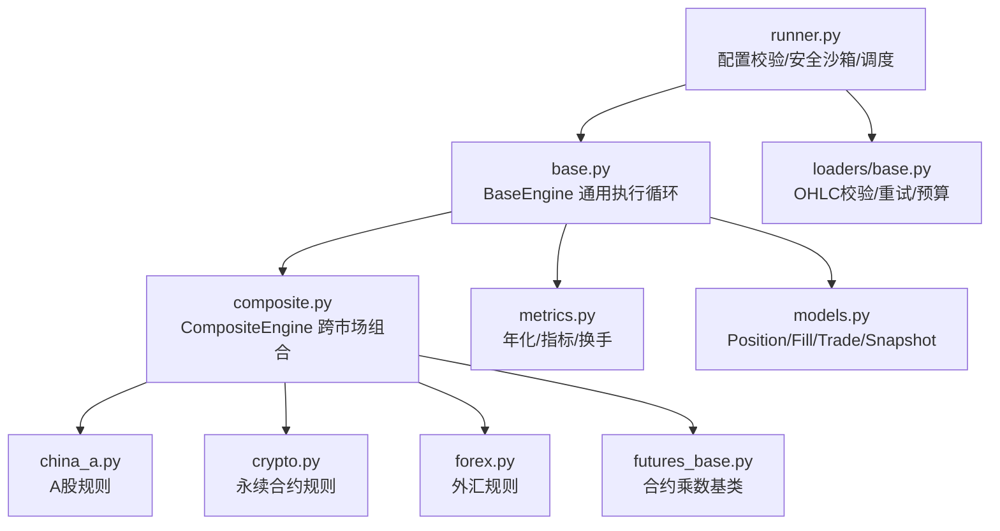
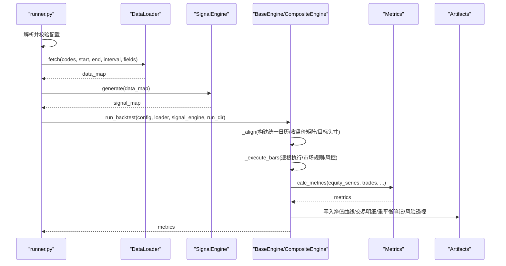
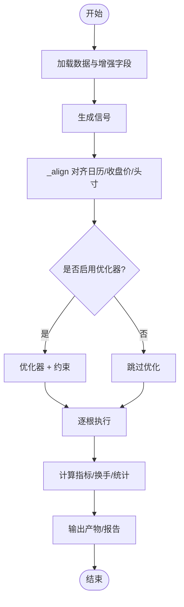
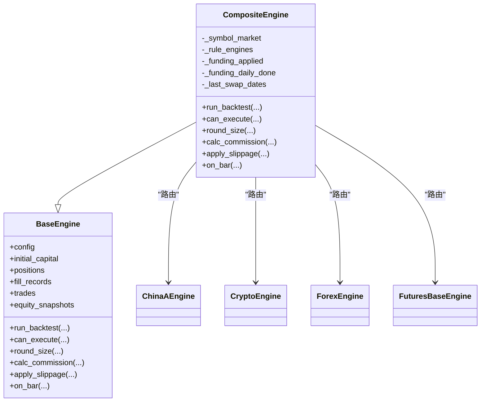
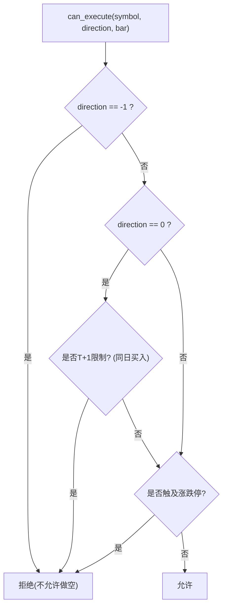
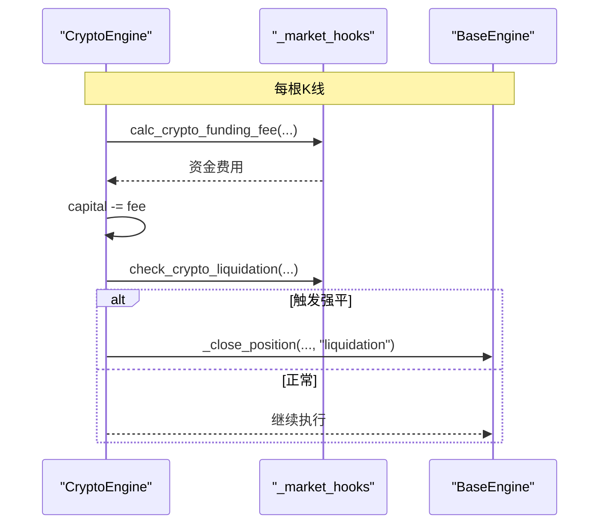
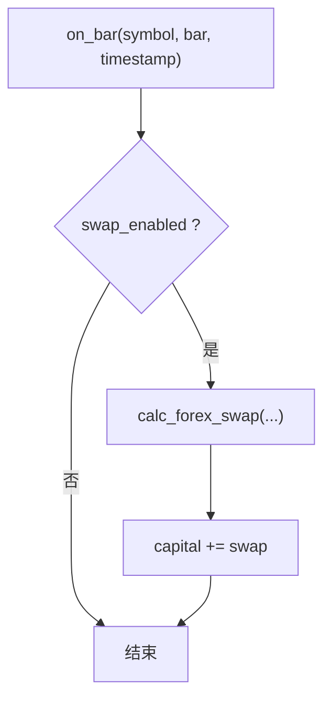
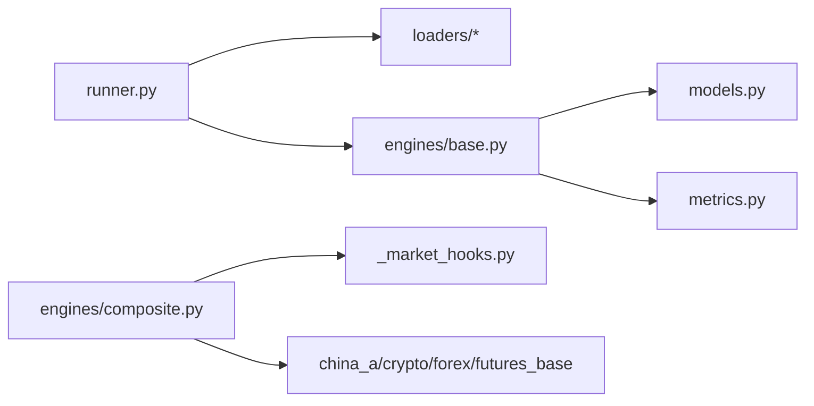

# 多市场回测引擎

<cite>
**本文引用的文件**
- [base.py](file://agent/backtest/engines/base.py)
- [composite.py](file://agent/backtest/engines/composite.py)
- [china_a.py](file://agent/backtest/engines/china_a.py)
- [crypto.py](file://agent/backtest/engines/crypto.py)
- [forex.py](file://agent/backtest/engines/forex.py)
- [futures_base.py](file://agent/backtest/engines/futures_base.py)
- [_market_hooks.py](file://agent/backtest/engines/_market_hooks.py)
- [runner.py](file://agent/backtest/runner.py)
- [models.py](file://agent/backtest/models.py)
- [metrics.py](file://agent/backtest/metrics.py)
- [base_loader.py](file://agent/backtest/loaders/base.py)
</cite>

## 目录
1. [简介](#简介)
2. [项目结构](#项目结构)
3. [核心组件](#核心组件)
4. [架构总览](#架构总览)
5. [详细组件分析](#详细组件分析)
6. [依赖关系分析](#依赖关系分析)
7. [性能考量](#性能考量)
8. [故障排查指南](#故障排查指南)
9. [结论](#结论)
10. [附录：配置与使用示例](#附录配置与使用示例)

## 简介
本文件为 Vibe-Trading 的多市场回测引擎提供系统化、可操作的文档。引擎支持股票（A股、美股、港股、印度、韩国、加拿大）、期货（中国及全球）、加密货币（永续合约）和外汇（现货/CFD）等多资产类别，具备统一的数据对齐、信号到头寸的优化、逐根K线执行、市场特定规则（涨跌停、交易时间、结算、资金费率、强制平仓等）以及跨市场组合回测能力。同时提供指标计算、基准对比、风险透视、重平衡记录与证据输出，便于结果可视化与报告生成。

## 项目结构
回测引擎位于 agent/backtest 目录下，关键模块如下：
- engines：各市场引擎实现与复合引擎
- loaders：数据加载器与校验工具
- metrics：年化因子、收益序列、换手率、统计指标
- models：头寸、成交、交易、净值快照等不可变数据模型
- runner：回测入口、配置校验、安全沙箱、调度与执行

图表来源
- [runner.py:1-120](file://agent/backtest/runner.py#L1-L120)
- [base.py:377-718](file://agent/backtest/engines/base.py#L377-L718)
- [composite.py:102-147](file://agent/backtest/engines/composite.py#L102-L147)
- [metrics.py:150-167](file://agent/backtest/metrics.py#L150-L167)
- [models.py:13-118](file://agent/backtest/models.py#L13-L118)
- [base_loader.py:50-119](file://agent/backtest/loaders/base.py#L50-L119)

章节来源
- [runner.py:1-120](file://agent/backtest/runner.py#L1-L120)
- [base.py:377-718](file://agent/backtest/engines/base.py#L377-L718)
- [composite.py:102-147](file://agent/backtest/engines/composite.py#L102-L147)
- [metrics.py:150-167](file://agent/backtest/metrics.py#L150-L167)
- [models.py:13-118](file://agent/backtest/models.py#L13-L118)
- [base_loader.py:50-119](file://agent/backtest/loaders/base.py#L50-L119)

## 核心组件
- BaseEngine：统一的“按根K线”执行主循环，负责数据加载→信号生成→权重优化→逐根执行→指标计算→产物输出；提供涨跌停/滑点/手续费/保证金/杠杆等钩子接口。
- CompositeEngine：跨市场组合引擎，维护共享资金池，按代码自动路由到对应市场子引擎处理规则（涨跌停、T+1、资金费率、掉期等）。
- 市场引擎：ChinaAEngine、CryptoEngine、ForexEngine、FuturesBaseEngine（及其子类），分别实现各自市场的交易规则、费用、滑点、结算与风控。
- 数据与指标：models 定义不可变状态；metrics 提供年化、收益、换手、统计指标；loaders/base 提供OHLC校验与重试/预算。
- Runner：配置校验、信号引擎安全沙箱、数据源路由、运行编排与产物写入。

章节来源
- [base.py:377-718](file://agent/backtest/engines/base.py#L377-L718)
- [composite.py:102-257](file://agent/backtest/engines/composite.py#L102-L257)
- [china_a.py:20-93](file://agent/backtest/engines/china_a.py#L20-L93)
- [crypto.py:41-140](file://agent/backtest/engines/crypto.py#L41-L140)
- [forex.py:56-137](file://agent/backtest/engines/forex.py#L56-L137)
- [futures_base.py:19-57](file://agent/backtest/engines/futures_base.py#L19-L57)
- [metrics.py:150-167](file://agent/backtest/metrics.py#L150-L167)
- [models.py:13-118](file://agent/backtest/models.py#L13-L118)
- [base_loader.py:50-119](file://agent/backtest/loaders/base.py#L50-L119)
- [runner.py:68-162](file://agent/backtest/runner.py#L68-L162)

## 架构总览
回测流程从 runner 启动，读取配置并校验，选择数据源加载数据，调用信号引擎生成信号，再交由 BaseEngine 进行权重优化与逐根执行，最终输出指标与产物。CompositeEngine 在跨市场场景下将规则委托给具体市场引擎，但资金、头寸、交易记录集中在组合引擎中管理。

图表来源
- [runner.py:1-120](file://agent/backtest/runner.py#L1-L120)
- [base.py:647-718](file://agent/backtest/engines/base.py#L647-L718)
- [base.py:149-249](file://agent/backtest/engines/base.py#L149-L249)
- [metrics.py:150-167](file://agent/backtest/metrics.py#L150-L167)

## 详细组件分析

### BaseEngine：通用执行循环与数据对齐
- 数据对齐：_align 将不同标的的交易日历合并为统一日期索引，构造收盘价矩阵与目标头寸矩阵，对信号做下一根开盘价语义的移位与归一化，支持可选优化器与约束。
- 执行主循环：run_backtest 完成数据加载→信号生成→权重优化→逐根执行→指标计算→产物输出。
- 市场规则钩子：can_execute、round_size、calc_commission、apply_slippage、on_bar、before/after_rebalance_bar、after_position_adjustment 等由子类实现。
- 涨跌停与价格带：historical_base_price 优先取 pre_close/pre_settle，否则用前一根收盘或 pct_chg 推导；limit_band 基于历史基准计算当日合法价格区间；prospective_fill_price 用于判断实际成交价是否越界。
- 基准与指标：支持外部基准序列，计算年化因子（按 source 与 interval），产出 by_symbol/by_exit_reason 统计、重平衡笔记与风险透视。

图表来源
- [base.py:149-249](file://agent/backtest/engines/base.py#L149-L249)
- [base.py:647-718](file://agent/backtest/engines/base.py#L647-L718)
- [base.py:468-557](file://agent/backtest/engines/base.py#L468-L557)

章节来源
- [base.py:149-249](file://agent/backtest/engines/base.py#L149-L249)
- [base.py:377-718](file://agent/backtest/engines/base.py#L377-L718)
- [base.py:468-557](file://agent/backtest/engines/base.py#L468-L557)

### CompositeEngine：跨市场组合与共享资金池
- 自动路由：根据代码格式识别市场类型，动态实例化对应子引擎（A股、美股、港股、印度、韩国、加拿大、加密、外汇、期货）。
- 货币一致性检查：拒绝混合结算货币的代码集合，避免错误汇总权益曲线。
- 规则委派：can_execute、round_size、calc_commission、apply_slippage、PnL/保证金/头寸规模计算均按标的路由至对应子引擎。
- 状态集中：资金、头寸、交易记录保存在组合引擎；子引擎作为无状态“规则书”。
- 市场特定Hook：在 on_bar 中处理加密资金费率与强平、外汇掉期等。

图表来源
- [composite.py:102-257](file://agent/backtest/engines/composite.py#L102-L257)
- [base.py:377-718](file://agent/backtest/engines/base.py#L377-L718)
- [futures_base.py:19-57](file://agent/backtest/engines/futures_base.py#L19-L57)

章节来源
- [composite.py:26-147](file://agent/backtest/engines/composite.py#L26-L147)
- [composite.py:149-257](file://agent/backtest/engines/composite.py#L149-L257)

### ChinaAEngine：A股特殊规则
- T+1：当日买入不可当日卖出（组合层拦截）。
- 禁止做空：direction=-1 直接拒绝。
- 涨跌停：主板±10%，创业板/科创板±20%，ST±5%（启发式），北交所±30%（简化）。
- 最小交易单位：100股整手。
- 费用：佣金（最低5元）、印花税（仅卖出）、过户费。
- 滑点：较小比例。

图表来源
- [china_a.py:40-93](file://agent/backtest/engines/china_a.py#L40-L93)
- [china_a.py:115-193](file://agent/backtest/engines/china_a.py#L115-L193)

章节来源
- [china_a.py:20-93](file://agent/backtest/engines/china_a.py#L20-L93)
- [china_a.py:115-193](file://agent/backtest/engines/china_a.py#L115-L193)

### CryptoEngine：永续合约与严格模式
- 24/7交易，方向自由，支持分数仓位。
- Maker/Taker 费率分离，默认固定资金费率或数据驱动。
- 严格模式（perpetual_strict）：基于 mark_open/mark_extrema 评估维持保证金，触发逐仓/全仓强平；记录完整事件流（资金结算、强平、订单拒绝等）。
- 资金费率：每8小时结算，支持去重与数据驱动；非严格模式下通过 on_bar 扣减。
- 滑点：严格模式下可关闭滑点以贴近真实执行。
- 产物：输出永续合约证据与摘要（资金结算次数、强平事件、费用等）。

图表来源
- [crypto.py:96-140](file://agent/backtest/engines/crypto.py#L96-L140)
- [crypto.py:243-347](file://agent/backtest/engines/crypto.py#L243-L347)
- [crypto.py:601-615](file://agent/backtest/engines/crypto.py#L601-L615)
- [_market_hooks.py:223-307](file://agent/backtest/engines/_market_hooks.py#L223-L307)

章节来源
- [crypto.py:41-140](file://agent/backtest/engines/crypto.py#L41-L140)
- [crypto.py:243-347](file://agent/backtest/engines/crypto.py#L243-L347)
- [crypto.py:601-615](file://agent/backtest/engines/crypto.py#L601-L615)
- [_market_hooks.py:223-307](file://agent/backtest/engines/_market_hooks.py#L223-L307)

### ForexEngine：外汇现货/CFD
- 24x5交易，无涨跌停，方向自由。
- 成本以点差体现（含滑点），无显式佣金。
- 标准手=100,000基础货币，支持微手粒度。
- 每日掉期（swap）：按头寸方向与天数（周三三倍）计算。
- 杠杆默认较高（如100:1），可通过配置调整。

图表来源
- [forex.py:56-137](file://agent/backtest/engines/forex.py#L56-L137)
- [_market_hooks.py:322-374](file://agent/backtest/engines/_market_hooks.py#L322-L374)

章节来源
- [forex.py:56-137](file://agent/backtest/engines/forex.py#L56-L137)
- [_market_hooks.py:322-374](file://agent/backtest/engines/_market_hooks.py#L322-L374)

### FuturesBaseEngine：合约乘数基类
- 在 PnL、保证金、头寸规模计算中引入合约乘数（points-to-currency multiplier）。
- 子类需实现 get_contract_multiplier(symbol)。

章节来源
- [futures_base.py:19-57](file://agent/backtest/engines/futures_base.py#L19-L57)

### 数据对齐与跨市场日历
- _align 构建统一日期索引，处理时区与缺失值，使用前向填充限制以避免长停牌掩盖信号。
- 跨市场场景提高 ffill_limit，适应春节等长假。
- 信号按各标的自身日历移位后映射到统一网格，再进行优化与归一化。

章节来源
- [base.py:149-249](file://agent/backtest/engines/base.py#L149-L249)

### 市场检测与货币一致性
- _detect_market 依据符号格式识别市场类型（A股、美股、加密、期货、外汇等）。
- code_currency 返回结算货币，CompositeEngine 在运行前拒绝混合货币集合，确保权益曲线可比。

章节来源
- [_market_hooks.py:23-116](file://agent/backtest/engines/_market_hooks.py#L23-L116)
- [composite.py:68-99](file://agent/backtest/engines/composite.py#L68-L99)

## 依赖关系分析
- runner 依赖 loaders/registry 选择数据源，依赖 engines 执行回测，依赖 metrics 计算指标。
- base 依赖 models 与 metrics，被 composite 与各类市场引擎继承/组合。
- composite 依赖 _market_hooks 进行市场检测与跨市场 Hook（资金费率、掉期、强平）。
- 各市场引擎依赖 base 提供的通用执行与规则钩子。

图表来源
- [runner.py:30-47](file://agent/backtest/runner.py#L30-L47)
- [base.py:26-44](file://agent/backtest/engines/base.py#L26-L44)
- [composite.py:16-23](file://agent/backtest/engines/composite.py#L16-L23)

章节来源
- [runner.py:30-47](file://agent/backtest/runner.py#L30-L47)
- [base.py:26-44](file://agent/backtest/engines/base.py#L26-L44)
- [composite.py:16-23](file://agent/backtest/engines/composite.py#L16-L23)

## 性能考量
- 数据对齐采用 numpy/pandas 向量化操作，减少 Python 循环开销。
- 跨市场 ffill_limit 自适应，避免长停牌导致的信号失真。
- 年化因子按 source 与 interval 精确映射，保证波动率与 Sharpe 等指标的准确性。
- 严格模式下的加密强平评估基于预构建风险帧，降低重复计算。
- 数据加载器提供重试与预算控制，防止慢查询拖垮整体运行。

章节来源
- [base.py:149-249](file://agent/backtest/engines/base.py#L149-L249)
- [metrics.py:150-167](file://agent/backtest/metrics.py#L150-L167)
- [crypto.py:156-196](file://agent/backtest/engines/crypto.py#L156-L196)
- [base_loader.py:163-200](file://agent/backtest/loaders/base.py#L163-L200)

## 故障排查指南
- 无数据/无效信号：检查 codes、start/end_date、source 与 interval；确认 loader 能拉取数据且信号引擎返回正确类型。
- 混合货币报错：CompositeEngine 会拒绝跨结算货币的组合，请拆分运行或统一到同一货币。
- OHLC 异常：loader 边界校验会丢弃或警告非法 K 线；必要时调整 allow_nonpositive_prices。
- 强平/资金费率：加密严格模式下关注资金结算与强平事件；检查 funding_rate、maintenance_brackets 与 interval 合法性。
- 涨跌停误判：确认 base_price_fields 与 prospective_fill_price 逻辑，避免使用未来信息。

章节来源
- [composite.py:68-99](file://agent/backtest/engines/composite.py#L68-L99)
- [base_loader.py:50-119](file://agent/backtest/loaders/base.py#L50-L119)
- [crypto.py:85-94](file://agent/backtest/engines/crypto.py#L85-L94)
- [base.py:468-557](file://agent/backtest/engines/base.py#L468-L557)

## 结论
该多市场回测引擎通过统一的 BaseEngine 抽象与 CompositeEngine 组合机制，实现了跨资产类别的一致化回测体验。各市场引擎封装了差异化的交易规则与风控逻辑，配合严格的数据对齐、优化器与指标体系，能够支撑复杂策略研究与组合回测。严格模式下的加密合约提供了接近实盘的强平与资金结算模拟，适合高杠杆策略验证。结合可视化与报告输出，用户可高效迭代策略并评估风险收益特征。

## 附录：配置与使用示例
以下为常用配置要点与参数说明（不展示具体代码内容，路径引用见下方）：
- 基本配置
  - codes：标的列表（支持多市场符号格式）
  - start_date/end_date：回测区间（YYYY-MM-DD）
  - source：数据源（如 tushare/yfinance/ccxt/okx/local 等）
  - interval：K线周期（1m/5m/15m/30m/1H/4H/1D）
  - engine：回测引擎（daily/options）
  - initial_cash：初始资金（必须为正）
  - position_adjustment：hold 或 rebalance
- 市场特定参数
  - A股：commission_rate/commission_min/stamp_tax/transfer_fee/slippage
  - 加密：maker_rate/taker_rate/funding_rate/margin_mode/perpetual_strict/liquidation_fee_rate
  - 外汇：leverage/spread_pips_override/lot_size/swap_enabled/slippage_pips
  - 期货：合约乘数由子类实现（get_contract_multiplier）
- 优化器与约束
  - optimizer：优化器名称（如 mean_variance/risk_parity/equal_volatility/max_diversification/turnover_aware）
  - optimizer_params：优化器参数
  - constraints：约束条件（作用于优化器输出）
- 基准与增强
  - benchmark：基准代码或 auto
  - fundamental_fields：基本面字段增强（表名→字段列表）
  - event_feeds：RSSHub 事件增强（name/route_template/event_type/code_style）
- 运行入口
  - 通过 runner 执行：python -m backtest.runner <run_dir>
  - 安全沙箱：信号引擎代码在导入与运行时受限，禁止危险操作

章节来源
- [runner.py:68-162](file://agent/backtest/runner.py#L68-L162)
- [runner.py:165-768](file://agent/backtest/runner.py#L165-L768)
- [base.py:252-279](file://agent/backtest/engines/base.py#L252-L279)
- [base.py:684-718](file://agent/backtest/engines/base.py#L684-L718)
- [china_a.py:20-93](file://agent/backtest/engines/china_a.py#L20-L93)
- [crypto.py:41-140](file://agent/backtest/engines/crypto.py#L41-L140)
- [forex.py:56-137](file://agent/backtest/engines/forex.py#L56-L137)
- [futures_base.py:19-57](file://agent/backtest/engines/futures_base.py#L19-L57)