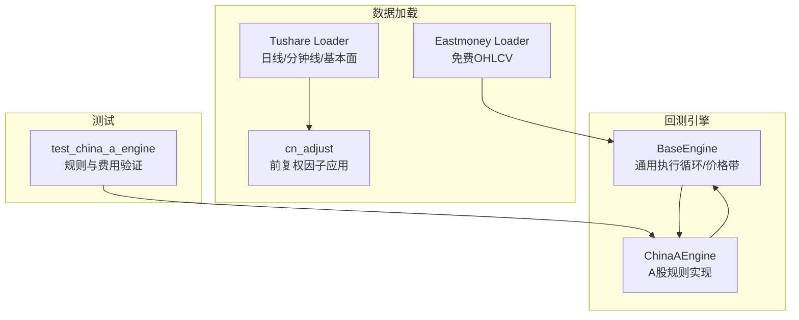
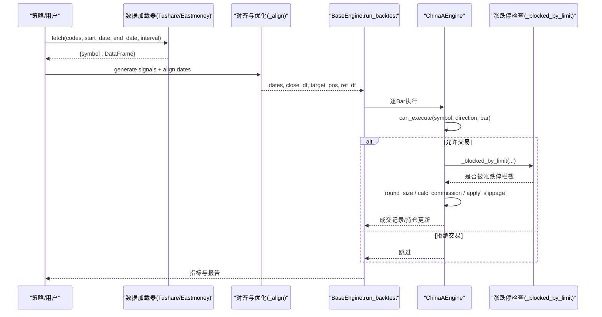
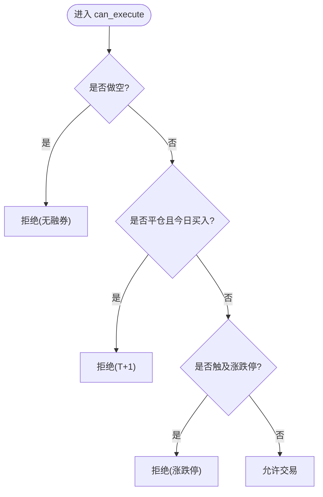
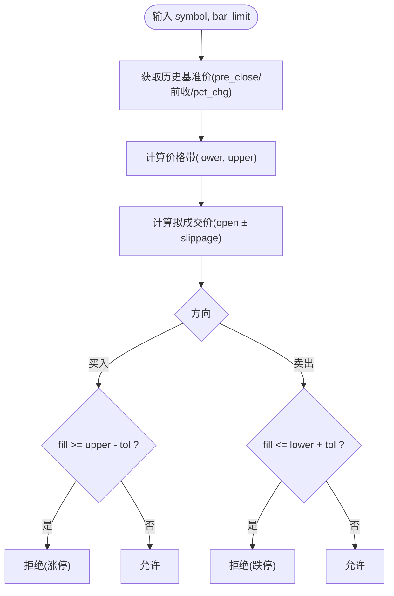
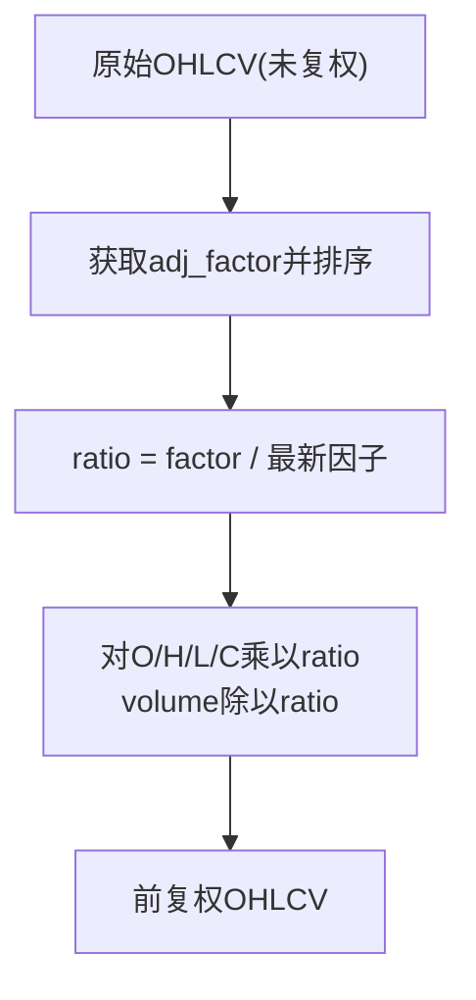
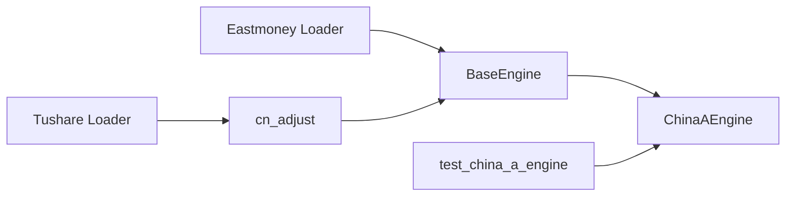

# 中国A股引擎

<cite>
**本文引用的文件**
- [china_a.py](file://agent/backtest/engines/china_a.py)
- [base.py](file://agent/backtest/engines/base.py)
- [cn_adjust.py](file://agent/backtest/loaders/cn_adjust.py)
- [tushare.py](file://agent/backtest/loaders/tushare.py)
- [eastmoney_loader.py](file://agent/backtest/loaders/eastmoney_loader.py)
- [test_china_a_engine.py](file://agent/tests/test_china_a_engine.py)
</cite>

## 目录
1. [简介](#简介)
2. [项目结构](#项目结构)
3. [核心组件](#核心组件)
4. [架构总览](#架构总览)
5. [详细组件分析](#详细组件分析)
6. [依赖关系分析](#依赖关系分析)
7. [性能与回测特性](#性能与回测特性)
8. [故障排查指南](#故障排查指南)
9. [结论](#结论)
10. [附录：配置与调优、常见陷阱](#附录：配置与调优常见陷阱)

## 简介
本文件面向在中国A股市场进行策略回测的开发者，系统性说明本仓库中A股回测引擎的规则实现与数据处理流程。重点覆盖：
- A股特有交易规则：涨跌停板（基于pre_close或pct_chg推导）、T+1制度、印花税与佣金、最低整手（100股）处理、滑点模型等。
- 数据预处理：复权因子处理（前复权）、除权除息调整、交易日历对齐与缺失值填充。
- ChinaAEngine核心方法：can_execute中的做空限制与T+1检查；round_size的100股整手处理；calc_commission的费用结构；_price_limit按代码前缀判断不同板块涨跌幅限制。
- 与真实交易所规则的对比验证思路与回测结果分析方法。

## 项目结构
围绕A股回测的关键代码位于以下模块：
- 引擎层：BaseEngine提供通用执行循环与价格带计算；ChinaAEngine实现A股规则。
- 数据加载层：Tushare/Eastmoney加载器负责获取行情与基本面；cn_adjust提供复权因子应用。
- 测试层：针对A股引擎的交易规则、费用、涨跌停等进行单元测试。

图表来源
- [base.py:377-557](file://agent/backtest/engines/base.py#L377-L557)
- [china_a.py:20-93](file://agent/backtest/engines/china_a.py#L20-L93)
- [tushare.py:116-200](file://agent/backtest/loaders/tushare.py#L116-L200)
- [eastmoney_loader.py:51-177](file://agent/backtest/loaders/eastmoney_loader.py#L51-L177)
- [cn_adjust.py:27-78](file://agent/backtest/loaders/cn_adjust.py#L27-L78)
- [test_china_a_engine.py:1-274](file://agent/tests/test_china_a_engine.py#L1-L274)

章节来源
- [base.py:377-557](file://agent/backtest/engines/base.py#L377-L557)
- [china_a.py:20-93](file://agent/backtest/engines/china_a.py#L20-L93)
- [tushare.py:116-200](file://agent/backtest/loaders/tushare.py#L116-L200)
- [eastmoney_loader.py:51-177](file://agent/backtest/loaders/eastmoney_loader.py#L51-L177)
- [cn_adjust.py:27-78](file://agent/backtest/loaders/cn_adjust.py#L27-L78)
- [test_china_a_engine.py:1-274](file://agent/tests/test_china_a_engine.py#L1-L274)

## 核心组件
- BaseEngine：提供统一的回测执行框架，包括信号对齐、目标权重生成、逐Bar执行、指标统计与基准对比。关键能力：
  - 历史基准价获取：优先使用bar中的pre_close，否则回退到前一交易日close或通过pct_chg反推。
  - 价格带计算：根据limit_band与prospective_fill_price判断是否触及涨跌停。
  - 统一执行入口：run_backtest串联数据加载、信号生成、优化、执行与输出。
- ChinaAEngine：在BaseEngine之上实现A股规则：
  - can_execute：禁止做空、T+1卖出限制、涨跌停拦截。
  - round_size：强制100股整手。
  - calc_commission：佣金（双边，最低5元）、印花税（仅卖出）、过户费（双边）。
  - apply_slippage：相对滑点模型。
- cn_adjust：对Tushare原始未复权行情应用前复权因子，修正除权除息带来的机械性价格跳空，保证收益序列连续可比。
- 数据加载器：Tushare与Eastmoney分别提供A股日/分钟线与免费行情，支持缓存与限流保护。

章节来源
- [base.py:377-557](file://agent/backtest/engines/base.py#L377-L557)
- [china_a.py:20-93](file://agent/backtest/engines/china_a.py#L20-L93)
- [cn_adjust.py:27-78](file://agent/backtest/loaders/cn_adjust.py#L27-L78)
- [tushare.py:116-200](file://agent/backtest/loaders/tushare.py#L116-L200)
- [eastmoney_loader.py:51-177](file://agent/backtest/loaders/eastmoney_loader.py#L51-L177)

## 架构总览
下图展示从数据加载到逐Bar执行的完整链路，以及A股规则如何嵌入执行路径。

图表来源
- [base.py:647-718](file://agent/backtest/engines/base.py#L647-L718)
- [china_a.py:40-93](file://agent/backtest/engines/china_a.py#L40-L93)
- [china_a.py:115-172](file://agent/backtest/engines/china_a.py#L115-L172)

## 详细组件分析

### ChinaAEngine：A股规则实现
- can_execute
  - 做空限制：direction为-1直接拒绝。
  - T+1检查：若当前方向为平仓（0），且持仓买入日期等于当日，则拒绝卖出。
  - 涨跌停拦截：调用_blocked_by_limit结合_price_limit判断是否触及涨停/跌停。
- round_size
  - 将期望手数向下取整至100股的整数倍，避免碎股买入。
- calc_commission
  - 佣金：名义金额×佣金率，不低于最低5元。
  - 过户费：双边收取。
  - 印花税：仅在卖出时收取。
- apply_slippage
  - 相对滑点：买入加价、卖出的减价。

图表来源
- [china_a.py:40-68](file://agent/backtest/engines/china_a.py#L40-L68)
- [china_a.py:115-172](file://agent/backtest/engines/china_a.py#L115-L172)

章节来源
- [china_a.py:20-93](file://agent/backtest/engines/china_a.py#L20-L93)
- [china_a.py:115-172](file://agent/backtest/engines/china_a.py#L115-L172)
- [test_china_a_engine.py:56-156](file://agent/tests/test_china_a_engine.py#L56-L156)

### 涨跌停板计算与板块区分
- 基础价来源：优先使用bar中的pre_close；若无，则通过前一交易日close或pct_chg反推，确保不使用未来信息。
- 价格带：以limit_band(base, limit)计算上下限。
- 实际成交价：使用prospective_fill_price(bar, direction)，即开盘价加滑点后的“拟成交价”。
- 拦截逻辑：买入时若拟成交价≥上限（含容差）则拒绝；卖出时若≤下限则拒绝。
- 板块涨跌幅限制：
  - 主板：±10%
  - 创业板/科创板：±20%
  - ST股：启发式识别（代码层面无法完全判定，此处保留扩展空间）
  - 北交所：±30%（简化处理）

图表来源
- [base.py:468-557](file://agent/backtest/engines/base.py#L468-L557)
- [china_a.py:115-172](file://agent/backtest/engines/china_a.py#L115-L172)
- [china_a.py:174-193](file://agent/backtest/engines/china_a.py#L174-L193)

章节来源
- [base.py:468-557](file://agent/backtest/engines/base.py#L468-L557)
- [china_a.py:115-193](file://agent/backtest/engines/china_a.py#L115-L193)
- [test_china_a_engine.py:119-156](file://agent/tests/test_china_a_engine.py#L119-L156)

### 费用结构与最小整手
- 佣金：双边收取，默认万分之2.5，最低5元。
- 印花税：仅卖出收取，默认万分之5。
- 过户费：双边收取，默认万分之0.1。
- 整手规则：A股买入必须为100股整数倍，round_size向下取整。

章节来源
- [china_a.py:70-93](file://agent/backtest/engines/china_a.py#L70-L93)
- [test_china_a_engine.py:158-221](file://agent/tests/test_china_a_engine.py#L158-L221)

### 数据预处理：复权因子与除权除息
- 问题背景：Tushare返回未复权价格，跨除权除息日的收盘价会因股本变动或分红产生机械性跳空，导致收益率失真。
- 解决方案：使用cn_adjust.apply_qfq对原始OHLCV应用前复权因子（adj_factor），使价格序列连续，便于计算真实收益与技术指标。
- 处理细节：
  - 读取adj_factor并按时间排序，对齐到行情索引。
  - 计算ratio = adj_factor / 最新因子，对open/high/low/close按比例缩放，volume反向缩放以保持市值口径一致，amount保持现金量不变。
  - 若因子缺失或不可用，返回None由上层丢弃该标的，避免污染回测。

图表来源
- [cn_adjust.py:27-78](file://agent/backtest/loaders/cn_adjust.py#L27-L78)

章节来源
- [cn_adjust.py:27-78](file://agent/backtest/loaders/cn_adjust.py#L27-L78)

### 交易日历对齐与停牌处理
- 对齐机制：_align构建统一日期索引，合并各标的交易日历；对close矩阵使用前向填充（ffill）并设置最大填充步数，避免长停牌导致的信号失真。
- 跨市场场景：混合市场采用更大的ffill上限，以容纳长假或长停牌。
- 停牌影响：停牌期间无成交，引擎不会触发交易；恢复交易后按新价格继续执行。

章节来源
- [base.py:149-249](file://agent/backtest/engines/base.py#L149-L249)

### 数据加载器与A股数据源
- Tushare Loader：
  - 支持A股日线和分钟线，自动识别指数与港股/美股符号。
  - 内置限流保护与退避重试，避免频繁请求被拒。
  - 可合并基本面字段，增强信号质量。
- Eastmoney Loader：
  - 免费接口，无需鉴权，但受IP限速；封装了缓存与错误隔离。
  - 统一输出标准OHLCV列，便于引擎消费。

章节来源
- [tushare.py:116-200](file://agent/backtest/loaders/tushare.py#L116-L200)
- [eastmoney_loader.py:51-177](file://agent/backtest/loaders/eastmoney_loader.py#L51-L177)

## 依赖关系分析
- ChinaAEngine依赖BaseEngine提供的通用能力：
  - historical_base_price：获取历史基准价。
  - prospective_fill_price：计算拟成交价。
  - limit_band：计算涨跌停价格带。
  - run_backtest：统一执行循环。
- 数据加载器与复权模块为上游依赖，决定输入数据的质量与连续性。
- 测试用例覆盖A股规则的关键分支，保障实现正确性。

图表来源
- [base.py:377-557](file://agent/backtest/engines/base.py#L377-L557)
- [china_a.py:20-93](file://agent/backtest/engines/china_a.py#L20-L93)
- [cn_adjust.py:27-78](file://agent/backtest/loaders/cn_adjust.py#L27-L78)
- [tushare.py:116-200](file://agent/backtest/loaders/tushare.py#L116-L200)
- [eastmoney_loader.py:51-177](file://agent/backtest/loaders/eastmoney_loader.py#L51-L177)
- [test_china_a_engine.py:1-274](file://agent/tests/test_china_a_engine.py#L1-L274)

章节来源
- [base.py:377-557](file://agent/backtest/engines/base.py#L377-L557)
- [china_a.py:20-93](file://agent/backtest/engines/china_a.py#L20-L93)
- [cn_adjust.py:27-78](file://agent/backtest/loaders/cn_adjust.py#L27-L78)
- [tushare.py:116-200](file://agent/backtest/loaders/tushare.py#L116-L200)
- [eastmoney_loader.py:51-177](file://agent/backtest/loaders/eastmoney_loader.py#L51-L177)
- [test_china_a_engine.py:1-274](file://agent/tests/test_china_a_engine.py#L1-L274)

## 性能与回测特性
- 对齐与填充：_align使用numpy与pandas向量化操作，减少Python循环开销；对停牌与缺失值采用有限步长的前向填充，避免长期空白。
- 涨跌停检查：基于历史基准价与拟成交价比较，避免未来函数；容差用于匹配交易所报价精度。
- 费用与滑点：在每笔成交时精确扣费与滑点，确保净值曲线贴近真实。
- 数据源选择：Tushare适合高质量与基本面融合；Eastmoney适合低成本快速拉取。

[本节为通用指导，不直接分析具体文件]

## 故障排查指南
- 涨跌停误判：
  - 确认bar包含pre_close或可通过pct_chg反推；检查limit_band返回值是否为None（无历史基准价时不应拦截）。
  - 核对拟成交价是否考虑滑点方向。
- T+1误放行：
  - 检查持仓entry_time与当日trade_date是否一致；确保_bar_date能正确解析日期。
- 费用异常：
  - 确认is_open参数正确传递；卖出应叠加印花税；小额交易应命中最低佣金。
- 复权因子缺失：
  - 若apply_qfq返回None，对应标的将被丢弃；需检查adj_factor数据完整性与时间对齐。
- 数据加载失败：
  - Tushare可能触发频率限制，查看日志中的退避重试；Eastmoney受IP限速，注意并发控制。

章节来源
- [china_a.py:40-93](file://agent/backtest/engines/china_a.py#L40-L93)
- [china_a.py:115-172](file://agent/backtest/engines/china_a.py#L115-L172)
- [cn_adjust.py:27-78](file://agent/backtest/loaders/cn_adjust.py#L27-L78)
- [tushare.py:18-80](file://agent/backtest/loaders/tushare.py#L18-L80)
- [eastmoney_loader.py:92-110](file://agent/backtest/loaders/eastmoney_loader.py#L92-L110)

## 结论
本A股回测引擎在BaseEngine的统一框架下，实现了贴合A股交易制度的规则集：涨跌停板、T+1、最低整手、费用与滑点。数据侧通过复权因子与前向填充，确保收益序列连续与对齐稳健。测试覆盖了关键分支，可作为策略开发与实盘前的可靠基线。建议在策略上线前，结合真实交易所规则进行对照验证，并对参数进行敏感性分析。

[本节为总结，不直接分析具体文件]

## 附录：配置与调优、常见陷阱

### 回测配置示例（A股）
- 基本参数：
  - initial_cash：初始资金
  - codes：A股标的列表（如000001.SZ、600519.SH）
  - start_date/end_date：回测区间
  - interval：1D（日线）或分钟级
  - benchmark：可选基准（如沪深300）
- 费用与滑点：
  - commission_rate：默认0.00025（万2.5）
  - commission_min：默认5.0（RMB）
  - stamp_tax：默认0.0005（万5，仅卖出）
  - transfer_fee：默认0.00001（万0.1，双边）
  - slippage：默认0.001（相对滑点）
- 其他：
  - leverage：A股强制为1.0（无杠杆）
  - position_adjustment：hold或rebalance

章节来源
- [china_a.py:20-39](file://agent/backtest/engines/china_a.py#L20-L39)
- [base.py:388-413](file://agent/backtest/engines/base.py#L388-L413)

### 参数调优指南
- 滑点与费用：逐步提高slippage与commission以评估策略鲁棒性；关注小票与高换手策略对费用的敏感度。
- 涨跌停容忍度：观察涨停/跌停日的成交概率与滑点对净值的影响；必要时调整滑点或过滤极端行情。
- 复权因子：确保adj_factor可用；若缺失，策略可能在除权日出现虚假亏损或收益。
- 对齐与停牌：合理设置ffill上限，避免长停牌期间的信号漂移。

[本节为通用指导，不直接分析具体文件]

### 常见陷阱与避免方法
- 使用未来信息：涨跌停检查必须基于历史基准价与拟成交价，避免使用当日close作为基准。
- T+1忽略：确保平仓逻辑检查持仓买入日期与当日是否相同。
- 碎股买入：round_size必须向下取整至100股整数倍。
- 费用遗漏：卖出必须叠加印花税；小额交易需满足最低佣金。
- 数据源偏差：Tushare与Eastmoney的数据差异可能导致信号不一致，建议固定数据源并做一致性校验。

章节来源
- [base.py:468-557](file://agent/backtest/engines/base.py#L468-L557)
- [china_a.py:40-93](file://agent/backtest/engines/china_a.py#L40-L93)
- [cn_adjust.py:27-78](file://agent/backtest/loaders/cn_adjust.py#L27-L78)