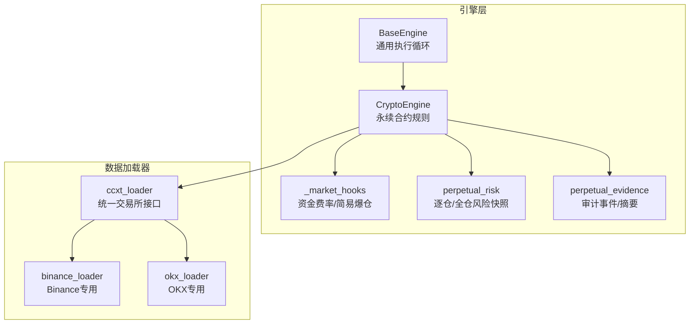
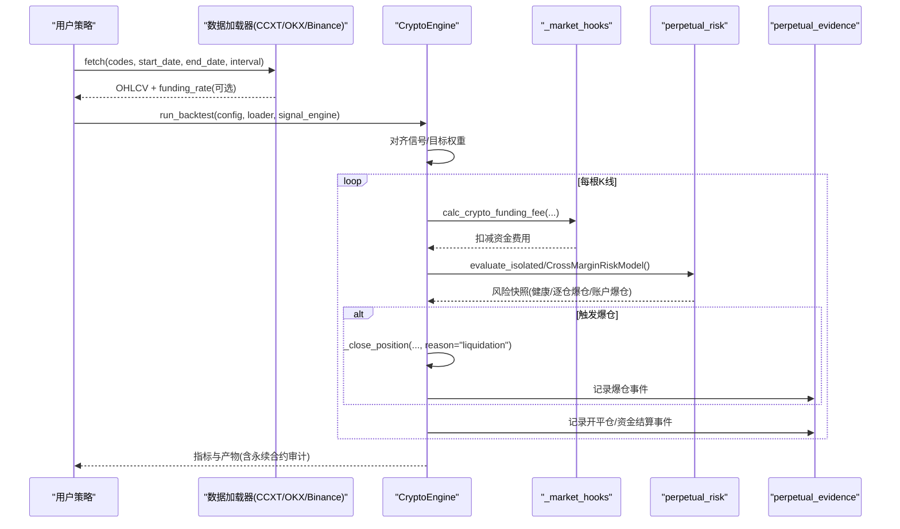
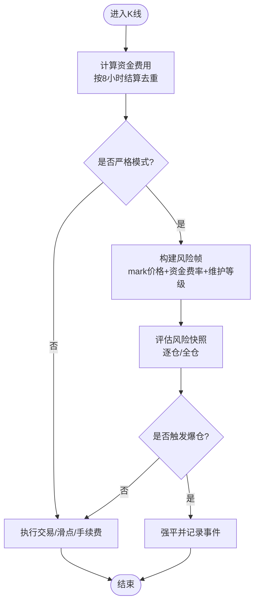
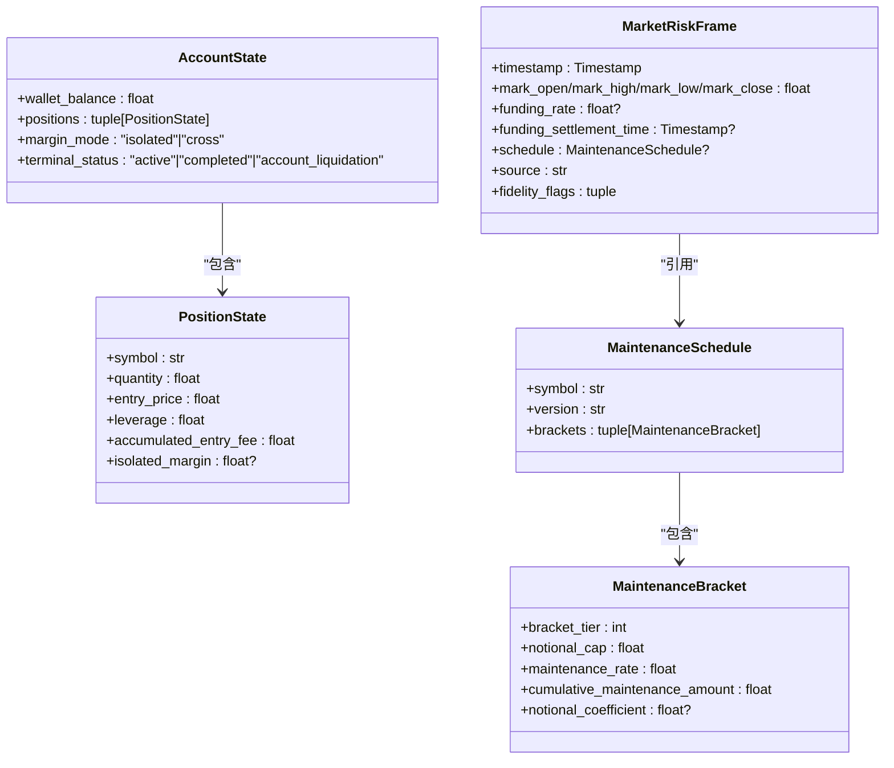
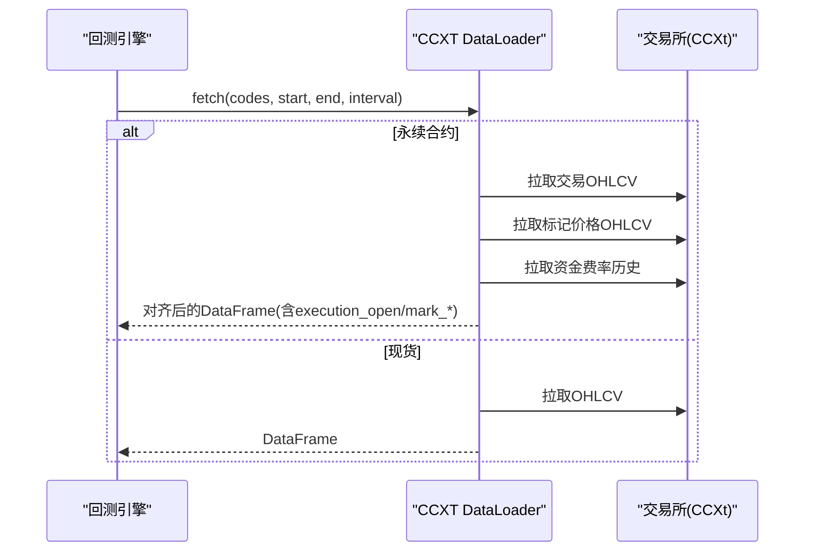
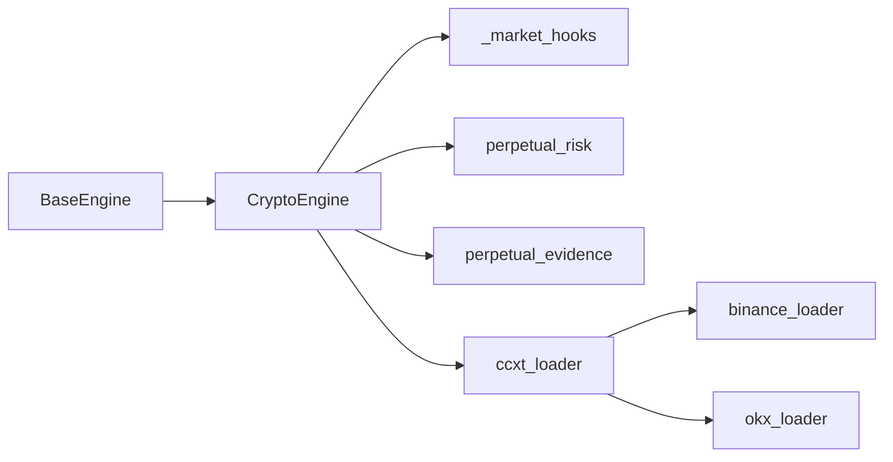

# 加密货币引擎

<cite>
**本文引用的文件**
- [agent/backtest/engines/crypto.py](file://agent/backtest/engines/crypto.py)
- [agent/backtest/engines/base.py](file://agent/backtest/engines/base.py)
- [agent/backtest/engines/_market_hooks.py](file://agent/backtest/engines/_market_hooks.py)
- [agent/backtest/perpetual_risk.py](file://agent/backtest/perpetual_risk.py)
- [agent/backtest/perpetual_evidence.py](file://agent/backtest/perpetual_evidence.py)
- [agent/backtest/loaders/ccxt_loader.py](file://agent/backtest/loaders/ccxt_loader.py)
- [agent/backtest/loaders/binance_loader.py](file://agent/backtest/loaders/binance_loader.py)
- [agent/backtest/loaders/okx.py](file://agent/backtest/loaders/okx.py)
- [agent/tests/test_crypto_engine.py](file://agent/tests/test_crypto_engine.py)
</cite>

## 目录
1. [简介](#简介)
2. [项目结构](#项目结构)
3. [核心组件](#核心组件)
4. [架构总览](#架构总览)
5. [详细组件分析](#详细组件分析)
6. [依赖关系分析](#依赖关系分析)
7. [性能与数据质量](#性能与数据质量)
8. [回测配置与风险管理](#回测配置与风险管理)
9. [故障排查指南](#故障排查指南)
10. [结论](#结论)

## 简介
本文件面向加密货币回测引擎，系统性说明其在永续合约、现货、资金费率、爆仓机制、滑点模型等方面的实现与使用方式。重点覆盖：
- 24小时连续交易、无涨跌停限制、高波动与流动性风险
- 合约杠杆交易、逐仓/全仓保证金模式、分级维持保证金
- USDT本位永续合约的数据接入（CCXT/OKX/Binance）
- 策略回测配置示例、风控参数设置、实盘对接注意事项
- 与传统金融市场的差异及数据质量验证方法

## 项目结构
围绕加密货币回测的关键模块包括：
- 引擎层：通用基类与加密专用引擎
- 市场钩子：资金费率计算、简易爆仓检查
- 风险模型：逐仓/全仓的严格风险评估快照
- 数据加载器：CCXT统一接口、Binance专用、OKX专用
- 证据输出：严格审计事件与摘要

**图表来源**
- [agent/backtest/engines/base.py:377-800](file://agent/backtest/engines/base.py#L377-L800)
- [agent/backtest/engines/crypto.py:41-106](file://agent/backtest/engines/crypto.py#L41-L106)
- [agent/backtest/engines/_market_hooks.py:223-308](file://agent/backtest/engines/_market_hooks.py#L223-L308)
- [agent/backtest/perpetual_risk.py:194-418](file://agent/backtest/perpetual_risk.py#L194-L418)
- [agent/backtest/perpetual_evidence.py:17-85](file://agent/backtest/perpetual_evidence.py#L17-L85)
- [agent/backtest/loaders/ccxt_loader.py:184-372](file://agent/backtest/loaders/ccxt_loader.py#L184-L372)
- [agent/backtest/loaders/binance_loader.py:23-45](file://agent/backtest/loaders/binance_loader.py#L23-L45)
- [agent/backtest/loaders/okx.py:101-208](file://agent/backtest/loaders/okx.py#L101-L208)

**章节来源**
- [agent/backtest/engines/base.py:377-800](file://agent/backtest/engines/base.py#L377-L800)
- [agent/backtest/engines/crypto.py:41-106](file://agent/backtest/engines/crypto.py#L41-L106)

## 核心组件
- 基础引擎：提供统一的回测执行循环、信号对齐、指标计算与产物输出。
- 加密引擎：在基础之上实现永续合约规则（24/7、Maker/Taker费率、资金费率结算、爆仓检查、滑点模型）。
- 市场钩子：按K线周期处理资金费用与简易爆仓判定。
- 风险模型：基于维护保证金分级表与标记价格，生成逐仓/全仓的风险快照并触发强平。
- 数据加载器：通过CCXT或交易所直连获取OHLCV与资金费率历史；支持Binance与OKX。
- 证据输出：记录永续合约生命周期事件（开平仓、资金结算、爆仓等），并生成可审计摘要。

**章节来源**
- [agent/backtest/engines/base.py:377-800](file://agent/backtest/engines/base.py#L377-L800)
- [agent/backtest/engines/crypto.py:41-106](file://agent/backtest/engines/crypto.py#L41-L106)
- [agent/backtest/engines/_market_hooks.py:223-308](file://agent/backtest/engines/_market_hooks.py#L223-L308)
- [agent/backtest/perpetual_risk.py:194-418](file://agent/backtest/perpetual_risk.py#L194-L418)
- [agent/backtest/loaders/ccxt_loader.py:184-372](file://agent/backtest/loaders/ccxt_loader.py#L184-L372)
- [agent/backtest/loaders/binance_loader.py:23-45](file://agent/backtest/loaders/binance_loader.py#L23-L45)
- [agent/backtest/loaders/okx.py:101-208](file://agent/backtest/loaders/okx.py#L101-L208)
- [agent/backtest/perpetual_evidence.py:17-85](file://agent/backtest/perpetual_evidence.py#L17-L85)

## 架构总览
下图展示从数据加载到执行、风控与证据输出的完整流程。

**图表来源**
- [agent/backtest/loaders/ccxt_loader.py:226-372](file://agent/backtest/loaders/ccxt_loader.py#L226-L372)
- [agent/backtest/loaders/okx.py:131-208](file://agent/backtest/loaders/okx.py#L131-L208)
- [agent/backtest/engines/base.py:647-800](file://agent/backtest/engines/base.py#L647-L800)
- [agent/backtest/engines/crypto.py:96-106](file://agent/backtest/engines/crypto.py#L96-L106)
- [agent/backtest/engines/_market_hooks.py:223-308](file://agent/backtest/engines/_market_hooks.py#L223-L308)
- [agent/backtest/perpetual_risk.py:357-418](file://agent/backtest/perpetual_risk.py#L357-L418)
- [agent/backtest/perpetual_evidence.py:17-85](file://agent/backtest/perpetual_evidence.py#L17-L85)

## 详细组件分析

### 加密引擎（CryptoEngine）
- 市场规则
  - 24/7交易，允许做多/做空/平仓，无涨跌停限制
  - Maker/Taker费率分离，开仓通常Taker，平仓可能Maker
  - 支持分数仓位（最小精度保留至小数点后6位）
  - 滑点模型：按方向施加不利偏移；严格模式下可按执行价字段控制
- 资金费率
  - 固定费率或数据驱动（来自加载器的funding_rate列）
  - 每8小时结算（00:00/08:00/16:00 UTC），去重避免重复结算
- 爆仓机制
  - 逐仓：单仓保证金余额低于维持保证金即强平
  - 全仓：账户级可用余额低于总维持保证金即强平
  - 支持阶梯式维持保证金率与累计扣除额
- 严格模式（perpetual_strict）
  - 要求更严格的分辨率（<=1H）、数据完整性校验（mark价格、资金结算时间）
  - 记录完整审计事件（开平仓、资金结算、爆仓、拒绝订单等）
  - 支持隔离保证金跟踪与账户状态快照

**图表来源**
- [agent/backtest/engines/crypto.py:96-106](file://agent/backtest/engines/crypto.py#L96-L106)
- [agent/backtest/engines/crypto.py:108-140](file://agent/backtest/engines/crypto.py#L108-L140)
- [agent/backtest/engines/crypto.py:243-270](file://agent/backtest/engines/crypto.py#L243-L270)
- [agent/backtest/engines/crypto.py:296-347](file://agent/backtest/engines/crypto.py#L296-L347)
- [agent/backtest/engines/_market_hooks.py:223-308](file://agent/backtest/engines/_market_hooks.py#L223-L308)
- [agent/backtest/perpetual_risk.py:357-418](file://agent/backtest/perpetual_risk.py#L357-L418)

**章节来源**
- [agent/backtest/engines/crypto.py:41-106](file://agent/backtest/engines/crypto.py#L41-L106)
- [agent/backtest/engines/crypto.py:108-140](file://agent/backtest/engines/crypto.py#L108-L140)
- [agent/backtest/engines/crypto.py:243-270](file://agent/backtest/engines/crypto.py#L243-L270)
- [agent/backtest/engines/crypto.py:296-347](file://agent/backtest/engines/crypto.py#L296-L347)
- [agent/backtest/engines/crypto.py:349-383](file://agent/backtest/engines/crypto.py#L349-L383)
- [agent/backtest/engines/crypto.py:446-554](file://agent/backtest/engines/crypto.py#L446-L554)
- [agent/backtest/engines/crypto.py:555-615](file://agent/backtest/engines/crypto.py#L555-L615)

### 风险模型（逐仓/全仓）
- 维护保证金
  - 基于名义价值区间选择维持保证金率与累计扣除额
  - 支持可选的名义系数字段（用于未来校准）
- 风险快照
  - 包含账户级别与逐仓级别的未实现盈亏、初始保证金、维持保证金、可用余额
  - 状态：健康、逐仓爆仓、账户爆仓
- 价格字段
  - 执行价与标记价格分离，避免前视偏差
  - 支持“不利极端”价格（多头取最低标记价，空头取最高标记价）

**图表来源**
- [agent/backtest/perpetual_risk.py:42-130](file://agent/backtest/perpetual_risk.py#L42-L130)
- [agent/backtest/perpetual_risk.py:132-179](file://agent/backtest/perpetual_risk.py#L132-L179)
- [agent/backtest/perpetual_risk.py:194-272](file://agent/backtest/perpetual_risk.py#L194-L272)

**章节来源**
- [agent/backtest/perpetual_risk.py:181-192](file://agent/backtest/perpetual_risk.py#L181-L192)
- [agent/backtest/perpetual_risk.py:357-418](file://agent/backtest/perpetual_risk.py#L357-L418)

### 数据加载器（CCXT/OKX/Binance）
- CCXT统一接口
  - 支持100+交易所，默认Binance；可通过环境变量切换
  - 对永续合约拉取交易价格与标记价格，并对齐时间戳
  - 拉取资金费率历史，按8小时结算窗口对齐
  - 维护保证金分级表以版本化工件形式传入，不在线拉取（避免鉴权）
- Binance专用
  - 仅使用Binance现货或USD-M永续（binanceusdm）
  - 公开行情无需API Key
- OKX专用
  - 直接调用OKX V5公共REST API
  - 近期K线与历史K线双端点自动切换，保证长周期回测可用
  - 代理与超时、重试预算、业务错误码处理

**图表来源**
- [agent/backtest/loaders/ccxt_loader.py:226-372](file://agent/backtest/loaders/ccxt_loader.py#L226-L372)
- [agent/backtest/loaders/binance_loader.py:23-45](file://agent/backtest/loaders/binance_loader.py#L23-L45)
- [agent/backtest/loaders/okx.py:131-208](file://agent/backtest/loaders/okx.py#L131-L208)

**章节来源**
- [agent/backtest/loaders/ccxt_loader.py:184-372](file://agent/backtest/loaders/ccxt_loader.py#L184-L372)
- [agent/backtest/loaders/binance_loader.py:23-45](file://agent/backtest/loaders/binance_loader.py#L23-L45)
- [agent/backtest/loaders/okx.py:101-208](file://agent/backtest/loaders/okx.py#L101-L208)

### 市场钩子（资金费率与简易爆仓）
- 资金费率
  - 优先使用加载器提供的历史funding_rate，否则回退到固定配置
  - 按8小时窗口去重，避免重复结算
- 简易爆仓
  - 基于名义价值查表得到维持保证金率，判断保证金余额是否低于维持保证金
  - 返回是否触发爆仓，实际强平由引擎负责

**章节来源**
- [agent/backtest/engines/_market_hooks.py:223-308](file://agent/backtest/engines/_market_hooks.py#L223-L308)

### 证据输出（严格审计）
- 记录事件类型：开平仓、资金结算、爆仓、拒绝订单等
- 输出JSONL事件流与汇总摘要，包含保证金模式、费率模型、终端状态、维护等级版本、市场风险来源等
- 明确假设与局限性（如非精确复制交易所强平引擎、分辨率边界等）

**章节来源**
- [agent/backtest/perpetual_evidence.py:17-85](file://agent/backtest/perpetual_evidence.py#L17-L85)
- [agent/backtest/engines/crypto.py:555-615](file://agent/backtest/engines/crypto.py#L555-L615)

## 依赖关系分析
- 引擎依赖
  - CryptoEngine继承BaseEngine，覆写市场规则与执行细节
  - 依赖_market_hooks进行资金费用与简易爆仓
  - 依赖perpetual_risk进行严格风险快照与强平决策
  - 依赖perpetual_evidence输出审计证据
- 数据依赖
  - CCXT作为统一抽象，Binance/OKX作为具体实现
  - 永续合约需要交易价格、标记价格、资金费率与维护等级工件

**图表来源**
- [agent/backtest/engines/base.py:377-800](file://agent/backtest/engines/base.py#L377-L800)
- [agent/backtest/engines/crypto.py:41-106](file://agent/backtest/engines/crypto.py#L41-L106)
- [agent/backtest/loaders/ccxt_loader.py:184-372](file://agent/backtest/loaders/ccxt_loader.py#L184-L372)
- [agent/backtest/loaders/binance_loader.py:23-45](file://agent/backtest/loaders/binance_loader.py#L23-L45)
- [agent/backtest/loaders/okx.py:101-208](file://agent/backtest/loaders/okx.py#L101-L208)

**章节来源**
- [agent/backtest/engines/base.py:377-800](file://agent/backtest/engines/base.py#L377-L800)
- [agent/backtest/engines/crypto.py:41-106](file://agent/backtest/engines/crypto.py#L41-L106)
- [agent/backtest/loaders/ccxt_loader.py:184-372](file://agent/backtest/loaders/ccxt_loader.py#L184-L372)

## 性能与数据质量
- 网络与超时
  - CCXT：请求超时与分页预算，防止长时间挂起；临时网络错误重试
  - OKX：短探测可用性、HTTP 429/5xx重试、业务错误码处理
- 数据完整性
  - 永续合约需交易与标记价格时间戳一致；缺失资金结算时间将报错
  - 维护等级工件需版本匹配与内容哈希校验
- 内存与计算
  - 使用numpy/pandas向量化对齐与填充，减少开销
  - 严格模式下构造MarketRiskFrame并进行跨标的一致性检查

**章节来源**
- [agent/backtest/loaders/ccxt_loader.py:50-57](file://agent/backtest/loaders/ccxt_loader.py#L50-L57)
- [agent/backtest/loaders/ccxt_loader.py:426-502](file://agent/backtest/loaders/ccxt_loader.py#L426-L502)
- [agent/backtest/loaders/okx.py:67-70](file://agent/backtest/loaders/okx.py#L67-L70)
- [agent/backtest/loaders/okx.py:267-373](file://agent/backtest/loaders/okx.py#L267-L373)
- [agent/backtest/loaders/ccxt_loader.py:310-372](file://agent/backtest/loaders/ccxt_loader.py#L310-L372)

## 回测配置与风险管理

### 关键配置项（加密引擎）
- leverage：默认杠杆倍数
- maker_rate/taker_rate：Maker与Taker手续费率
- slippage：滑点比例（按方向施加不利偏移）
- margin_mode：逐仓或全仓
- funding_mode：fixed或data（数据驱动）
- perpetual_strict：严格模式开关（要求高分辨率与数据完整性）
- liquidation_fee_rate：强平手续费率

参考测试中的构造方式，可组合上述参数形成不同场景的回测配置。

**章节来源**
- [agent/backtest/engines/crypto.py:41-69](file://agent/backtest/engines/crypto.py#L41-L69)
- [agent/tests/test_crypto_engine.py:42-66](file://agent/tests/test_crypto_engine.py#L42-L66)

### 风险管理设置建议
- 逐仓 vs 全仓
  - 逐仓隔离风险，适合多币种分散但需严格控制单仓风险
  - 全仓共享保证金，适合低相关性资产组合，但需关注账户级爆仓
- 维护保证金与杠杆
  - 高杠杆放大收益也放大风险；结合名义价值区间选择合适的维持保证金率
  - 严格模式下使用维护等级工件，确保强平逻辑与交易所一致
- 资金费率管理
  - 长期持仓需考虑资金费率成本；数据驱动模式更贴近真实
  - 注意8小时结算窗口与去重逻辑，避免重复计费
- 滑点与流动性
  - 高波动与低流动性品种应提高滑点假设
  - 严格模式下可使用执行价字段控制成交假设

**章节来源**
- [agent/backtest/perpetual_risk.py:181-192](file://agent/backtest/perpetual_risk.py#L181-L192)
- [agent/backtest/engines/_market_hooks.py:223-308](file://agent/backtest/engines/_market_hooks.py#L223-L308)
- [agent/backtest/engines/crypto.py:116-140](file://agent/backtest/engines/crypto.py#L116-L140)

### 实盘对接注意事项
- 数据源与符号映射
  - 使用CCXT时注意符号规范化（如BTC-USDT-PERP）
  - OKX/Binance直连时需遵循各自API规范与代理配置
- 延迟与撮合
  - 回测使用开盘价或标记价近似；实盘需考虑订单簿深度与延迟
- 风控与限仓
  - 实盘需增加下单前风控（头寸上限、最大回撤、熔断）
  - 与交易所API兼容时注意速率限制与错误码处理
- 合规与审计
  - 保留交易日志与资金流水，便于事后审计与归因

**章节来源**
- [agent/backtest/loaders/ccxt_loader.py:60-71](file://agent/backtest/loaders/ccxt_loader.py#L60-L71)
- [agent/backtest/loaders/okx.py:101-208](file://agent/backtest/loaders/okx.py#L101-L208)
- [agent/backtest/loaders/binance_loader.py:23-45](file://agent/backtest/loaders/binance_loader.py#L23-L45)

## 故障排查指南
- 常见错误
  - 缺少维护等级工件或版本不匹配：检查传入的bracket_artifact与symbol/version
  - 资金结算时间缺失：确保加载器返回的funding_settlement_time与bar时间一致
  - 标记价格不完整：交易与标记价格时间戳必须对齐
  - 不支持的时间框架：确认interval映射与交易所支持范围
- 调试步骤
  - 启用严格模式，查看审计事件（开平仓、资金结算、爆仓）
  - 检查风险快照中的fidelity_flags与价格来源
  - 对比加载器返回的原始数据与引擎内部构造的MarketRiskFrame

**章节来源**
- [agent/backtest/loaders/ccxt_loader.py:310-372](file://agent/backtest/loaders/ccxt_loader.py#L310-L372)
- [agent/backtest/perpetual_risk.py:226-272](file://agent/backtest/perpetual_risk.py#L226-L272)
- [agent/backtest/perpetual_evidence.py:17-85](file://agent/backtest/perpetual_evidence.py#L17-L85)

## 结论
该加密货币回测引擎在通用回测框架基础上，针对永续合约的特殊性实现了完整的规则与风控体系：
- 24/7交易、无涨跌停限制、高波动与流动性风险被显式建模
- 资金费率与爆仓机制通过数据驱动与严格风险快照保障准确性
- 多交易所数据源集成（CCXT/OKX/Binance）提升灵活性与鲁棒性
- 证据输出为策略审计与问题定位提供可靠依据

建议在实盘中结合交易所API特性与风控要求，进一步细化滑点、流动性与延迟模型，并完善下单前风控与审计日志。