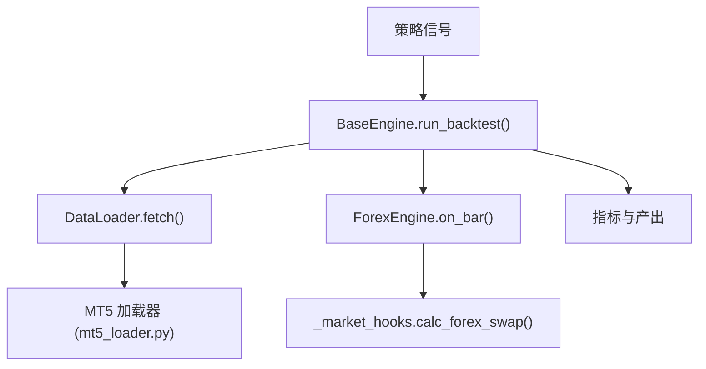
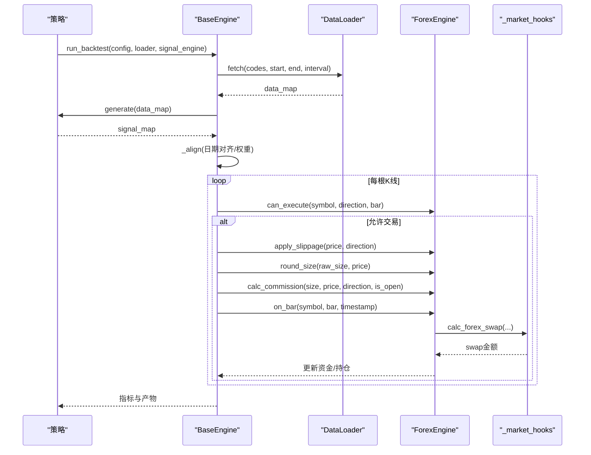
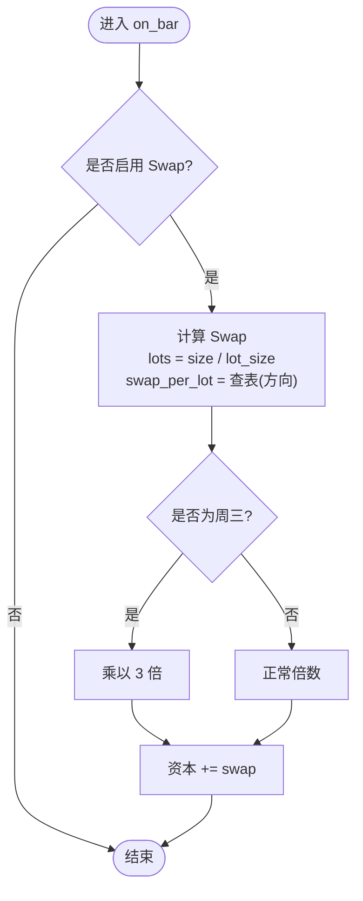
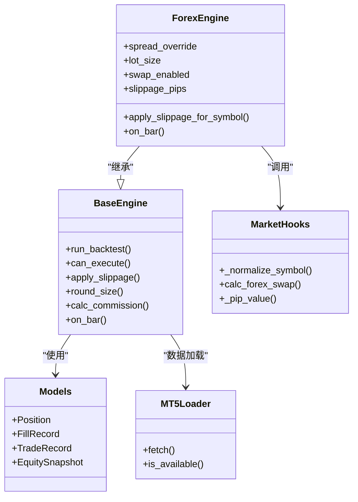

# 外汇引擎

<cite>
**本文引用的文件**
- [forex.py](file://agent/backtest/engines/forex.py)
- [_market_hooks.py](file://agent/backtest/engines/_market_hooks.py)
- [base.py](file://agent/backtest/engines/base.py)
- [models.py](file://agent/backtest/models.py)
- [mt5_loader.py](file://agent/backtest/loaders/mt5_loader.py)
- [README.md](file://README.md)
- [constraints.py](file://agent/backtest/constraints.py)
</cite>

## 目录
1. [简介](#简介)
2. [项目结构](#项目结构)
3. [核心组件](#核心组件)
4. [架构总览](#架构总览)
5. [详细组件分析](#详细组件分析)
6. [依赖关系分析](#依赖关系分析)
7. [性能考量](#性能考量)
8. [故障排查指南](#故障排查指南)
9. [结论](#结论)
10. [附录：配置与示例](#附录：配置与示例)

## 简介
本文件面向外汇回测引擎，系统性说明外汇市场交易特性（货币对报价、点差、隔夜利息 Swap、杠杆、最小交易单位）、主要货币对与交叉汇率处理、交易时间与时区差异、策略回测配置、风险与资金管理、与经纪商 API 的集成方式及数据源选择建议。重点覆盖外汇 24×5 交易特性、高杠杆风险管理以及跨时区数据处理挑战。

## 项目结构
外汇回测能力由“引擎层 + 市场钩子 + 数据加载器”构成：
- 引擎层：ForexEngine 实现外汇特有的滑点、点差、Swap、手数等规则；BaseEngine 提供统一的回测执行框架。
- 市场钩子：_market_hooks.py 集中了符号归一化、点值计算、Swap 表与计算逻辑。
- 数据加载器：mt5_loader.py 对接本地 MT5 终端，获取外汇/贵金属 OHLCV 数据，支持多周期与自动符号解析。

图表来源
- [base.py:647-718](file://agent/backtest/engines/base.py#L647-L718)
- [mt5_loader.py:170-251](file://agent/backtest/loaders/mt5_loader.py#L170-L251)
- [forex.py:124-132](file://agent/backtest/engines/forex.py#L124-L132)
- [_market_hooks.py:332-373](file://agent/backtest/engines/_market_hooks.py#L332-L373)

章节来源
- [forex.py:1-137](file://agent/backtest/engines/forex.py#L1-L137)
- [base.py:377-800](file://agent/backtest/engines/base.py#L377-L800)
- [mt5_loader.py:1-251](file://agent/backtest/loaders/mt5_loader.py#L1-L251)
- [_market_hooks.py:1-374](file://agent/backtest/engines/_market_hooks.py#L1-L374)

## 核心组件
- ForexEngine：外汇专用回测引擎，封装点差模型、滑点、Swap 日终结算、手数粒度、杠杆与保证金计算。
- BaseEngine：统一回测流水线（数据加载→信号对齐→目标权重→逐根 K 线执行→指标输出）。
- _market_hooks：共享的市场规则工具（符号归一化、点值、Swap 表与计算、跨市场识别）。
- mt5_loader：从本地 MT5 终端拉取外汇/贵金属历史数据，支持多种周期与自动符号匹配。
- models：统一的数据模型（头寸、成交记录、交易记录、权益快照），贯穿各引擎。

章节来源
- [forex.py:56-137](file://agent/backtest/engines/forex.py#L56-L137)
- [base.py:377-644](file://agent/backtest/engines/base.py#L377-L644)
- [_market_hooks.py:23-115](file://agent/backtest/engines/_market_hooks.py#L23-L115)
- [mt5_loader.py:170-251](file://agent/backtest/loaders/mt5_loader.py#L170-L251)
- [models.py:13-118](file://agent/backtest/models.py#L13-L118)

## 架构总览
外汇回测的核心流程如下：
- 数据加载：通过 DataLoader 接口获取 OHLCV，优先使用 mt5_loader（若可用），否则走其他数据源。
- 信号生成与对齐：BaseEngine 将信号按各自交易日历对齐，构建统一日期索引与价格矩阵。
- 逐根 K 线执行：调用 ForexEngine 的 can_execute、apply_slippage、round_size、calc_commission、on_bar 等钩子。
- 指标与产出：统计收益、回撤、换手率、按标的统计等，并输出可复现实验产物。

图表来源
- [base.py:647-718](file://agent/backtest/engines/base.py#L647-L718)
- [forex.py:76-132](file://agent/backtest/engines/forex.py#L76-L132)
- [_market_hooks.py:332-373](file://agent/backtest/engines/_market_hooks.py#L332-L373)

## 详细组件分析

### 外汇交易特性与引擎实现
- 交易时间与方向：外汇为 24×5（悉尼开盘至纽约收盘），无涨跌停限制，做多做空均可。
- 点差与滑点：以点差作为成本，买入/卖出各承担一半点差，外加额外滑点；JPY 相关货币对点值为 0.01，其余为 0.0001。
- 隔夜利息（Swap）：每日收盘结算，多头/空头分别对应不同 Swap 值；周三结算三倍 Swap（覆盖周末两天）。
- 杠杆与保证金：默认杠杆可配（如 100:1），保证金 = 名义价值 / 杠杆；PnL 以报价货币计，交叉对在平仓时按退出价换算。
- 手数与最小单位：标准手为 100,000 基础货币单位；下单尺寸按微手（1,000 单位）四舍五入。

图表来源
- [forex.py:124-132](file://agent/backtest/engines/forex.py#L124-L132)
- [_market_hooks.py:332-373](file://agent/backtest/engines/_market_hooks.py#L332-L373)

章节来源
- [forex.py:23-137](file://agent/backtest/engines/forex.py#L23-L137)
- [_market_hooks.py:310-373](file://agent/backtest/engines/_market_hooks.py#L310-L373)

### 主要货币对与点差/点值
- 主要货币对（EUR/USD、GBP/USD、USD/JPY、USD/CHF、AUD/USD、USD/CAD、NZD/USD）具备更窄的点差；交叉对（如 EUR/GBP、GBP/JPY 等）点差更宽；奇异货币对（如 USD/TRY、USD/ZAR）点差显著扩大。
- JPY 相关货币对的 pip 为 0.01，其他为 0.0001；点差以点为单位，滑点叠加在点差的一半之上。

章节来源
- [forex.py:23-54](file://agent/backtest/engines/forex.py#L23-L54)
- [_market_hooks.py:322-329](file://agent/backtest/engines/_market_hooks.py#L322-L329)

### 交叉汇率与定价
- 引擎内部以标准化符号（如 EUR/USD）进行计算，无需显式维护交叉汇率矩阵；所有 PnL 以报价货币计量，交叉对在平仓时按退出价折算。
- 符号归一化支持 “XXX/YYY”、“XXXXXX.FX” 或六字母形式（如 EURUSD），统一为大写带斜杠格式。

章节来源
- [_market_hooks.py:322-329](file://agent/backtest/engines/_market_hooks.py#L322-L329)
- [forex.py:98-122](file://agent/backtest/engines/forex.py#L98-L122)

### 交易时间与跨时区处理
- 外汇 24×5 交易，引擎不限制交易时段；数据加载器需保证时间戳为 UTC 且连续，避免时区偏移导致的时间窗口错误。
- MT5 加载器强制使用 UTC 时间戳构造起止时间，确保跨时区一致性。

章节来源
- [mt5_loader.py:239-246](file://agent/backtest/loaders/mt5_loader.py#L239-L246)
- [forex.py:76-78](file://agent/backtest/engines/forex.py#L76-L78)

### 与经纪商 API 集成（MT5）
- 通过本地 MT5 终端读取外汇/贵金属历史数据，自动解析经纪商符号后缀（如 Exness 的 EURUSDm），并以缓存提升性能。
- 支持 1m–1D 多周期，返回标准 OHLCV 帧；失败时记录日志并跳过，不影响整体回测。

章节来源
- [mt5_loader.py:1-19](file://agent/backtest/loaders/mt5_loader.py#L1-L19)
- [mt5_loader.py:121-147](file://agent/backtest/loaders/mt5_loader.py#L121-L147)
- [mt5_loader.py:170-251](file://agent/backtest/loaders/mt5_loader.py#L170-L251)

### 数据源选择建议
- 首选本地 MT5 数据（真实经纪商符号与交易时间），若无则回退到 akshare/yfinance/local 等免费源。
- 对于全球多资产组合，可使用 CompositeEngine 共享资金池并按市场规则执行。

章节来源
- [mt5_loader.py:1-19](file://agent/backtest/loaders/mt5_loader.py#L1-L19)
- [README.md:338-359](file://README.md#L338-L359)

## 依赖关系分析
- ForexEngine 依赖 BaseEngine 提供的执行框架与通用方法（杠杆、保证金、PnL 计算）。
- ForexEngine 通过 _market_hooks 复用符号归一化与 Swap 计算，避免重复实现。
- mt5_loader 独立于引擎，仅负责数据加载，遵循统一 DataLoader 接口。
- models 被引擎与测试共用，保证数据结构一致。

图表来源
- [base.py:377-644](file://agent/backtest/engines/base.py#L377-L644)
- [forex.py:56-137](file://agent/backtest/engines/forex.py#L56-L137)
- [_market_hooks.py:310-373](file://agent/backtest/engines/_market_hooks.py#L310-L373)
- [mt5_loader.py:170-251](file://agent/backtest/loaders/mt5_loader.py#L170-L251)
- [models.py:13-118](file://agent/backtest/models.py#L13-L118)

章节来源
- [base.py:377-800](file://agent/backtest/engines/base.py#L377-L800)
- [forex.py:56-137](file://agent/backtest/engines/forex.py#L56-L137)
- [_market_hooks.py:310-373](file://agent/backtest/engines/_market_hooks.py#L310-L373)
- [mt5_loader.py:170-251](file://agent/backtest/loaders/mt5_loader.py#L170-L251)
- [models.py:13-118](file://agent/backtest/models.py#L13-L118)

## 性能考量
- 数据对齐与填充：BaseEngine 使用向量化前向填充与 searchsorted 映射，减少 pandas 开销，提高大规模回测性能。
- 滑点与点差：点差与滑点以 pip 为单位计算，避免复杂浮点运算；JPY 与非 JPY 区分处理。
- Swap 计算：按日去重，避免重复结算；周三三倍结算一次性计入。
- MT5 数据：进程级初始化缓存与符号解析缓存，降低连接与查询开销。

章节来源
- [base.py:149-249](file://agent/backtest/engines/base.py#L149-L249)
- [forex.py:98-122](file://agent/backtest/engines/forex.py#L98-L122)
- [_market_hooks.py:332-373](file://agent/backtest/engines/_market_hooks.py#L332-L373)
- [mt5_loader.py:53-58](file://agent/backtest/loaders/mt5_loader.py#L53-L58)

## 故障排查指南
- MT5 不可用：检查 Windows 环境、MetaTrader5 包安装、终端登录状态与配置文件；不可用时自动降级到其他数据源。
- 符号未找到：确认经纪商符号后缀（如 EURUSDm），加载器会尝试模糊匹配并缓存结果。
- Swap 未生效：确认 swap_enabled 为 True，且 on_bar 在交易日触发；注意周三三倍结算。
- 时区问题：确保数据时间戳为 UTC；MT5 加载器强制 UTC 起止时间以避免偏移。

章节来源
- [mt5_loader.py:61-108](file://agent/backtest/loaders/mt5_loader.py#L61-L108)
- [mt5_loader.py:121-147](file://agent/backtest/loaders/mt5_loader.py#L121-L147)
- [forex.py:124-132](file://agent/backtest/engines/forex.py#L124-L132)
- [mt5_loader.py:239-246](file://agent/backtest/loaders/mt5_loader.py#L239-L246)

## 结论
该外汇回测引擎以 BaseEngine 为核心，结合 ForexEngine 的外汇专属规则与 _market_hooks 的工具函数，实现了点差/滑点、Swap、杠杆与保证金、手数粒度等关键特性。通过 mt5_loader 接入本地 MT5 终端，可获得贴近真实市场的历史数据与交易时间。配合约束与优化器，可实现稳健的风险管理与资金管理。建议在实盘前充分验证点差、Swap 与滑点参数，并结合多数据源回退策略保障鲁棒性。

## 附录：配置与示例
- 回测配置关键字（ForexEngine）：
  - leverage：杠杆倍数（默认 100:1）
  - spread_pips_override：全局点差覆盖（点）
  - lot_size：手数大小（默认 100,000）
  - swap_enabled：是否启用 Swap（默认 True）
  - slippage_pips：额外滑点（点）
- 数据源：
  - source="auto" 时，系统按市场类型选择数据源；外汇优先使用 mt5_loader，不可用时回退到 akshare/yfinance/local。
- 风险管理：
  - 使用 constraints 对权重施加上限/下限与分组暴露限制，避免过度集中。
  - 结合优化器（如波动率调整、风险平价）控制风险预算。

章节来源
- [forex.py:59-74](file://agent/backtest/engines/forex.py#L59-L74)
- [README.md:338-359](file://README.md#L338-L359)
- [constraints.py:1-200](file://agent/backtest/constraints.py#L1-L200)