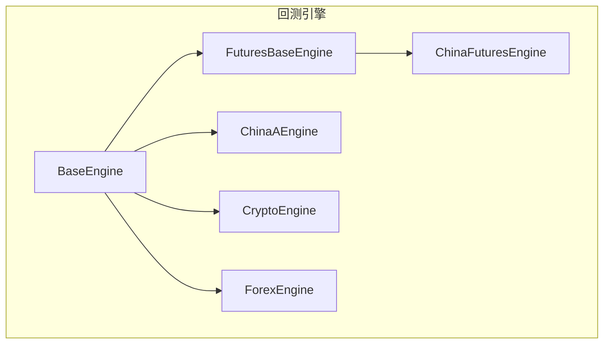
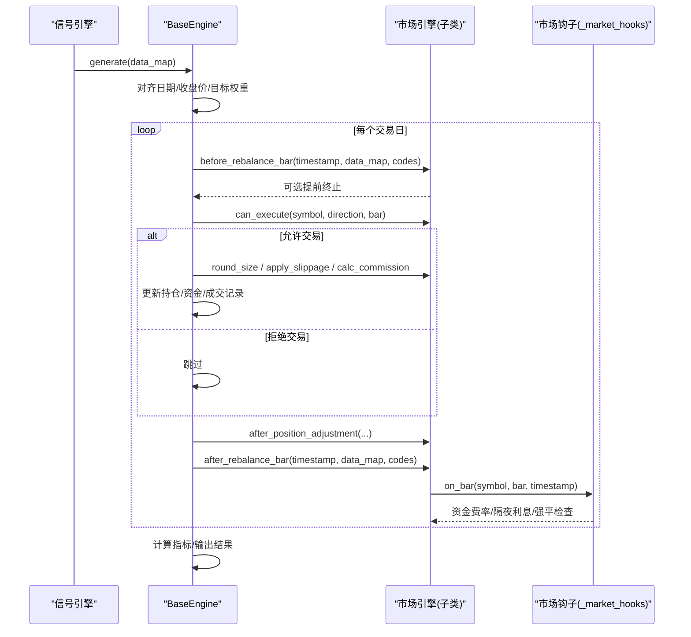
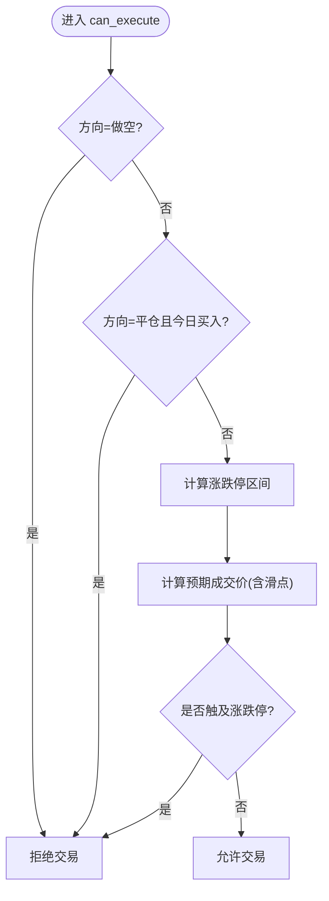
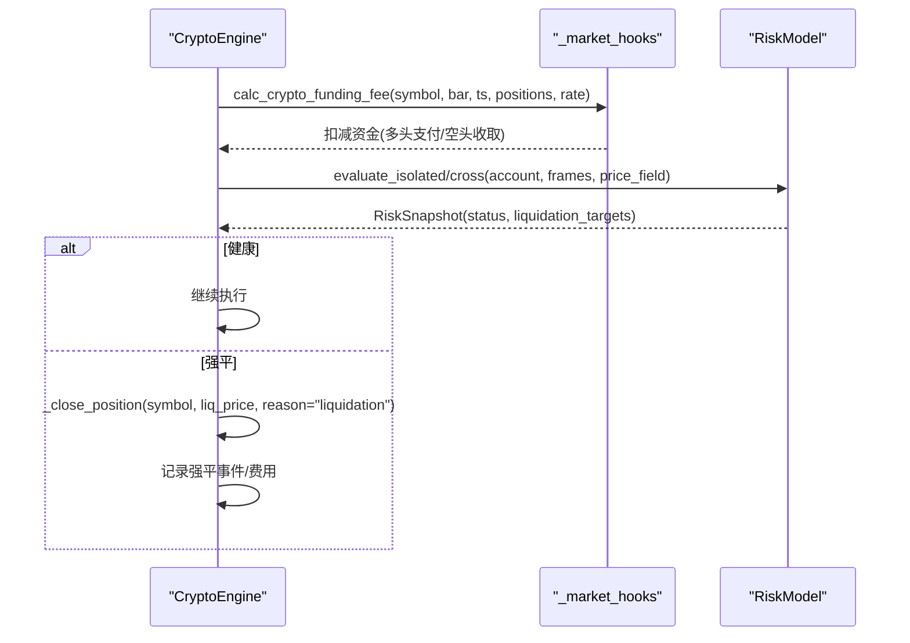
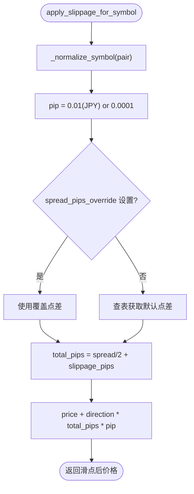
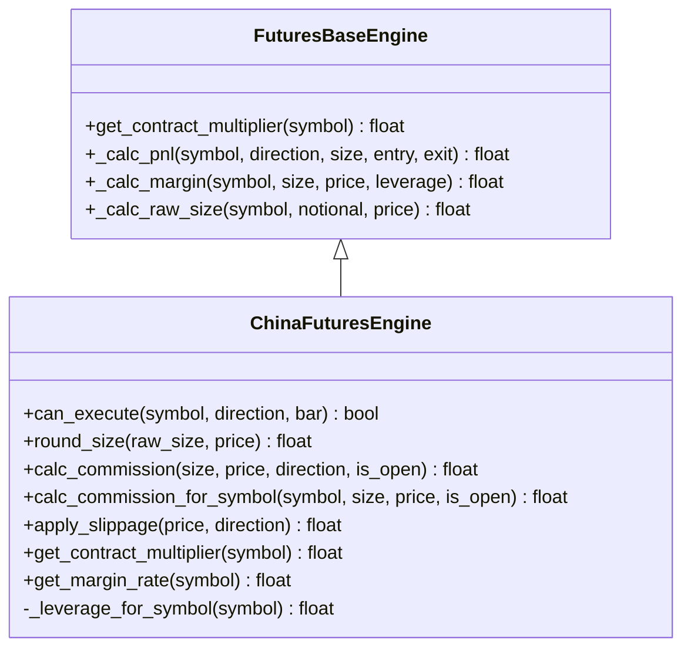
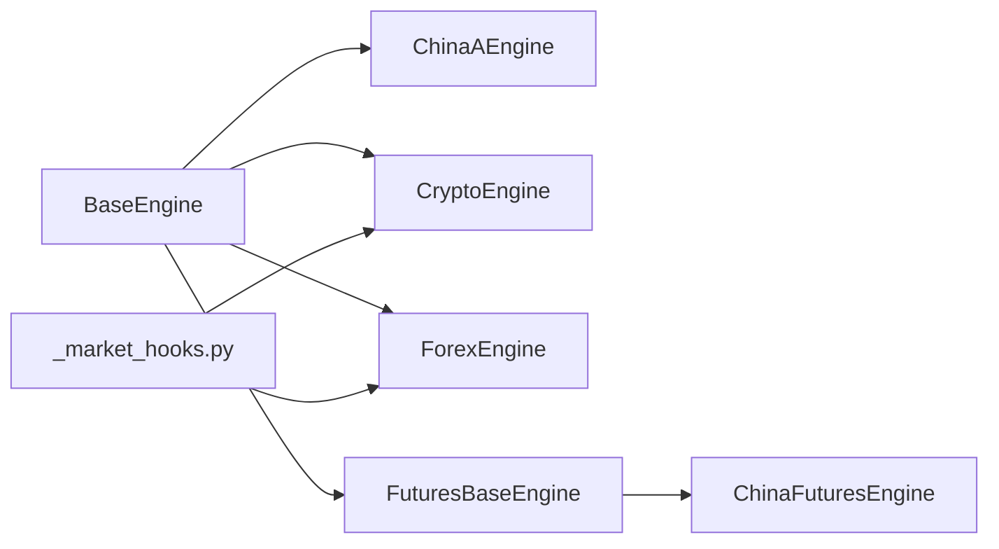

# 市场特定引擎

<cite>
**本文引用的文件**
- [base.py](file://agent/backtest/engines/base.py)
- [futures_base.py](file://agent/backtest/engines/futures_base.py)
- [china_a.py](file://agent/backtest/engines/china_a.py)
- [crypto.py](file://agent/backtest/engines/crypto.py)
- [forex.py](file://agent/backtest/engines/forex.py)
- [china_futures.py](file://agent/backtest/engines/china_futures.py)
- [_market_hooks.py](file://agent/backtest/engines/_market_hooks.py)
- [test_china_a_engine.py](file://agent/tests/test_china_a_engine.py)
- [test_crypto_engine.py](file://agent/tests/test_crypto_engine.py)
</cite>

## 目录
1. [简介](#简介)
2. [项目结构](#项目结构)
3. [核心组件](#核心组件)
4. [架构总览](#架构总览)
5. [详细组件分析](#详细组件分析)
6. [依赖关系分析](#依赖关系分析)
7. [性能考量](#性能考量)
8. [故障排查指南](#故障排查指南)
9. [结论](#结论)
10. [附录：配置与最佳实践](#附录：配置与最佳实践)

## 简介
本文件面向 Vibe-Trading 的“市场特定引擎”，系统梳理并说明中国A股、加密货币（永续合约）、外汇（现货/CFD）、中国期货四大市场的专用回测引擎实现。重点覆盖各市场的特殊交易规则处理，包括：
- A股：涨跌停限制、T+1制度、手续费结构（佣金最低额、印花税、过户费）
- 加密货币：24小时交易、合约杠杆、资金费率结算、逐仓/全仓风控与强平
- 外汇：点差模型、保证金要求、隔夜利息（Swap）
- 期货：合约乘数、保证金率、价格涨跌幅限制、按产品差异化手续费

同时提供各引擎的配置参数、性能特点、适用场景，以及具体配置示例与最佳实践建议。

## 项目结构
市场引擎位于 agent/backtest/engines 目录下，采用“基类 + 市场特化”的分层设计：
- BaseEngine：统一的回测执行循环、信号对齐、指标计算、事件钩子等通用逻辑
- FuturesBaseEngine：在 BaseEngine 基础上增加“合约乘数”对 PnL、保证金、头寸规模的影响
- 市场引擎：ChinaAEngine、CryptoEngine、ForexEngine、ChinaFuturesEngine 分别实现各自市场规则
- _market_hooks.py：跨引擎共享的市场钩子（如资金费率、外汇 Swap、强制平仓判定、符号分类）

图表来源
- [base.py:377-644](file://agent/backtest/engines/base.py#L377-L644)
- [futures_base.py:19-57](file://agent/backtest/engines/futures_base.py#L19-L57)

章节来源
- [base.py:377-644](file://agent/backtest/engines/base.py#L377-L644)
- [futures_base.py:19-57](file://agent/backtest/engines/futures_base.py#L19-L57)

## 核心组件
- BaseEngine：定义统一接口 can_execute、round_size、calc_commission、apply_slippage、on_bar；提供 run_backtest 主流程（数据加载→信号生成→目标权重对齐→逐根K线执行→指标输出）。
- FuturesBaseEngine：重写 PnL、保证金、头寸规模计算以引入合约乘数。
- ChinaAEngine：A股规则（T+1、无做空、涨跌停、100股整手、佣金最低额、印花税卖侧、过户费双边）。
- CryptoEngine：永续合约（24/7、Maker/Taker 费率、资金费率每8小时结算、逐仓/全仓、严格模式下的风险快照与强平）。
- ForexEngine：外汇点差模型（买卖价差嵌入滑点）、标准手、隔夜利息、高杠杆默认值。
- ChinaFuturesEngine：中国期货（T+0、双向交易、交易所保证金率、合约乘数、按产品差异化手续费、价格涨跌幅）。

章节来源
- [base.py:377-644](file://agent/backtest/engines/base.py#L377-L644)
- [futures_base.py:19-57](file://agent/backtest/engines/futures_base.py#L19-L57)
- [china_a.py:20-93](file://agent/backtest/engines/china_a.py#L20-L93)
- [crypto.py:41-130](file://agent/backtest/engines/crypto.py#L41-L130)
- [forex.py:56-137](file://agent/backtest/engines/forex.py#L56-L137)
- [china_futures.py:131-251](file://agent/backtest/engines/china_futures.py#L131-L251)

## 架构总览
下图展示回测主流程与各引擎的协作关系，强调“策略信号→目标权重→逐根K线执行→市场规则校验→费用/滑点→持仓与资金更新”。

图表来源
- [base.py:647-783](file://agent/backtest/engines/base.py#L647-L783)
- [crypto.py:349-376](file://agent/backtest/engines/crypto.py#L349-L376)
- [_market_hooks.py:223-307](file://agent/backtest/engines/_market_hooks.py#L223-L307)

## 详细组件分析

### 中国A股引擎（ChinaAEngine）
- 交易规则
  - T+1：当日买入不可当日卖出
  - 禁止做空（direction=-1 直接拒绝）
  - 涨跌停：主板±10%，创业板/科创板±20%，ST±5%（启发式），北交所±30%
  - 最小交易单位：100股（零股只能卖不能买）
  - 费用：佣金（最低¥5）、印花税（仅卖出）、过户费（双边）
- 关键方法
  - can_execute：做空拦截、T+1检查、涨跌停拦截
  - round_size：按100股取整
  - calc_commission：佣金+过户费+印花税（卖出时）
  - apply_slippage：相对滑点
- 价格带与基准价
  - 使用历史基准价（pre_close 或前收盘）计算涨跌停区间，避免未来函数
  - 通过 limit_band/prospective_fill_price 判断是否触及涨跌停

图表来源
- [china_a.py:40-93](file://agent/backtest/engines/china_a.py#L40-L93)
- [china_a.py:115-193](file://agent/backtest/engines/china_a.py#L115-L193)
- [base.py:468-557](file://agent/backtest/engines/base.py#L468-L557)

章节来源
- [china_a.py:20-93](file://agent/backtest/engines/china_a.py#L20-L93)
- [china_a.py:115-193](file://agent/backtest/engines/china_a.py#L115-L193)
- [test_china_a_engine.py:60-200](file://agent/tests/test_china_a_engine.py#L60-L200)

### 加密货币引擎（CryptoEngine）
- 交易规则
  - 24/7 交易，方向不限
  - Maker/Taker 费率分离（开仓通常Taker，平仓Maker）
  - 资金费率：每8小时结算一次（00:00/08:00/16:00 UTC），支持固定费率或数据驱动
  - 强平：维持保证金比率触发逐仓/全仓强平
  - 支持分数仓位
- 关键能力
  - strict 模式：基于 mark_open/adverse_mark_extrema 的风险评估，记录完整事件与证据
  - 资金费率：优先使用数据列 funding_rate，否则回退到配置固定费率
  - 强平：维护保证金等级表，按名义价值查表得到维持保证金率
  - 隔离/全仓：隔离模式下跟踪各标的占用保证金
- 执行流程要点
  - before_rebalance_bar：构建风险帧、应用资金费率、评估强平
  - after_rebalance_bar：再次评估 adverse 极端行情
  - after_position_adjustment：记录市场成交事件，更新隔离保证金并评估风险

图表来源
- [crypto.py:243-347](file://agent/backtest/engines/crypto.py#L243-L347)
- [_market_hooks.py:223-307](file://agent/backtest/engines/_market_hooks.py#L223-L307)

章节来源
- [crypto.py:41-130](file://agent/backtest/engines/crypto.py#L41-L130)
- [crypto.py:349-376](file://agent/backtest/engines/crypto.py#L349-L376)
- [crypto.py:377-554](file://agent/backtest/engines/crypto.py#L377-L554)
- [_market_hooks.py:223-307](file://agent/backtest/engines/_market_hooks.py#L223-L307)
- [test_crypto_engine.py:184-200](file://agent/tests/test_crypto_engine.py#L184-L200)

### 外汇引擎（ForexEngine）
- 交易规则
  - 24x5（悉尼开盘至纽约收盘）
  - 点差替代显式佣金（Bid-Ask），滑点叠加额外点差
  - 杠杆：默认100:1，可配置
  - 标准手：100,000基础货币单位
  - 隔夜利息（Swap）：每日收盘结算，周三三倍
  - 无涨跌停与方向限制
- 关键方法
  - round_size：按微手（1000单位）取整
  - calc_commission：返回0（成本体现在滑点）
  - apply_slippage_for_symbol：根据货币对点值（JPY为0.01，其他为0.0001）计算半点差+滑点
  - on_bar：调用 calc_forex_swap 计算隔夜利息
- 点差与点值
  - 主要货币对与交叉盘有预设点差（pips），可按 spread_pips_override 全局覆盖
  - pip_value 根据报价货币是否为 JPY 决定点值

图表来源
- [forex.py:43-137](file://agent/backtest/engines/forex.py#L43-L137)
- [_market_hooks.py:322-374](file://agent/backtest/engines/_market_hooks.py#L322-L374)

章节来源
- [forex.py:56-137](file://agent/backtest/engines/forex.py#L56-L137)
- [_market_hooks.py:312-374](file://agent/backtest/engines/_market_hooks.py#L312-L374)

### 中国期货引擎（ChinaFuturesEngine）
- 交易规则
  - T+0：日内可开可平
  - 双向交易：做多/做空均可
  - 保证金：按交易所最低保证金率（不同品种不同）
  - 价格涨跌幅：股指±10%，国债±2%，商品±3%~8%（默认5%）
  - 手续费：按品种区分（按名义或按手固定）
  - 合约乘数：按品种映射（如IF=300，rb=10，au=1000）
- 关键方法
  - can_execute：T+0放行，双向放行，涨跌停拦截（复用 A股 _blocked_by_limit）
  - round_size：整数合约
  - calc_commission_for_symbol：按产品查表（rate/fixed）× 合约乘数
  - get_contract_multiplier：返回合约乘数
  - get_margin_rate：返回保证金率
  - _leverage_for_symbol：由保证金率推导杠杆
- 价格带基准
  - 使用 pre_settle 优先于 pre_close（期货以昨结算价为基准）

图表来源
- [futures_base.py:19-57](file://agent/backtest/engines/futures_base.py#L19-L57)
- [china_futures.py:131-251](file://agent/backtest/engines/china_futures.py#L131-L251)

章节来源
- [china_futures.py:23-109](file://agent/backtest/engines/china_futures.py#L23-L109)
- [china_futures.py:131-251](file://agent/backtest/engines/china_futures.py#L131-L251)

## 依赖关系分析
- BaseEngine 是所有引擎的公共基类，定义了统一的回测生命周期与市场规则接口
- FuturesBaseEngine 扩展了合约乘数相关计算，被 ChinaFuturesEngine 继承
- ChinaAEngine、CryptoEngine、ForexEngine 直接继承 BaseEngine
- _market_hooks.py 提供跨引擎共享功能：
  - 资金费率计算与去重（CryptoEngine）
  - 外汇 Swap 计算（ForexEngine）
  - 强制平仓判定（CryptoEngine）
  - 符号市场分类与币种推断（复合回测路由）

图表来源
- [base.py:377-644](file://agent/backtest/engines/base.py#L377-L644)
- [futures_base.py:19-57](file://agent/backtest/engines/futures_base.py#L19-L57)
- [_market_hooks.py:23-116](file://agent/backtest/engines/_market_hooks.py#L23-L116)

章节来源
- [base.py:377-644](file://agent/backtest/engines/base.py#L377-L644)
- [futures_base.py:19-57](file://agent/backtest/engines/futures_base.py#L19-L57)
- [_market_hooks.py:23-116](file://agent/backtest/engines/_market_hooks.py#L23-L116)

## 性能考量
- 信号对齐与矩阵运算：BaseEngine 使用 numpy/pandas 向量化对齐与填充，减少逐标的循环开销
- 涨跌停检查：通过历史基准价与 prospective_fill_price 避免未来函数，降低误判导致的无效交易
- 加密货币严格模式：
  - 使用 mark_open/adverse_mark_extrema 进行更保守的价格假设，适合高频/高杠杆策略的回测验证
  - 资金费率与强平事件记录用于事后审计与归因
- 外汇点差与隔夜利息：
  - 点差按货币对差异化，JPY 与其他货币对点值不同，避免误差放大
  - Swap 仅在日末结算，减少频繁计算
- 期货合约乘数：
  - 通过乘数将价格变动转换为真实盈亏，确保规模与保证金计算准确

[本节为通用性能讨论，不直接分析具体文件]

## 故障排查指南
- A股无法卖出
  - 检查是否 T+1 限制（当日买入不可当日卖出）
  - 检查是否触及涨跌停（涨停无法买入，跌停无法卖出）
  - 参考测试用例验证行为
- 加密货币强平
  - 检查维持保证金率与名义价值层级
  - 确认资金费率是否正确应用（固定或数据驱动）
  - 查看严格模式下的风险快照与事件日志
- 外汇隔夜利息异常
  - 检查货币对标准化与点值（JPY vs 其他）
  - 确认 swap_enabled 开关与 last_swap_dates 去重逻辑
- 期货手续费与乘数
  - 核对产品代码映射（合约乘数、保证金率、手续费类型）
  - 若自定义覆盖，确保覆盖范围正确

章节来源
- [test_china_a_engine.py:60-200](file://agent/tests/test_china_a_engine.py#L60-L200)
- [test_crypto_engine.py:184-200](file://agent/tests/test_crypto_engine.py#L184-L200)
- [_market_hooks.py:223-307](file://agent/backtest/engines/_market_hooks.py#L223-L307)
- [_market_hooks.py:322-374](file://agent/backtest/engines/_market_hooks.py#L322-L374)
- [china_futures.py:23-109](file://agent/backtest/engines/china_futures.py#L23-L109)

## 结论
Vibe-Trading 的市场特定引擎通过统一的 BaseEngine 抽象与丰富的市场特化实现，覆盖了 A股、加密货币、外汇、中国期货的核心交易规则与费用模型。各引擎在涨跌停、T+1、资金费率、点差、合约乘数等方面提供了精确且可配置的模拟能力，适用于多市场策略研究与回测验证。建议在实盘前结合严格模式与事件证据进行充分压力测试与归因分析。

[本节为总结性内容，不直接分析具体文件]

## 附录：配置与最佳实践

### 中国A股（ChinaAEngine）
- 推荐配置键
  - commission_rate：默认 0.00025（万2.5）
  - commission_min：默认 5.0（人民币最低佣金）
  - stamp_tax：默认 0.0005（卖出印花税）
  - transfer_fee：默认 0.00001（双边过户费）
  - slippage：默认 0.001
- 最佳实践
  - 使用 pre_close 或 pct_chg 保证涨跌停基准的历史性
  - 注意100股整手限制，避免零股买入导致失败
  - 关注 ST 与创业板/科创板的涨跌停差异

章节来源
- [china_a.py:20-93](file://agent/backtest/engines/china_a.py#L20-L93)
- [test_china_a_engine.py:60-200](file://agent/tests/test_china_a_engine.py#L60-L200)

### 加密货币（CryptoEngine）
- 推荐配置键
  - leverage：默认 1.0（可按策略调整）
  - maker_rate：默认 0.0002
  - taker_rate：默认 0.0005
  - slippage：默认 0.0005
  - margin_mode："isolated" 或 "cross"
  - funding_rate：默认 0.0001（固定）
  - perpetual_strict：True 启用严格模式（需 funding_mode="data"）
  - liquidation_fee_rate：强平费用比例
- 最佳实践
  - 严格模式下使用 1m/5m/15m/30m/1h 分辨率，确保风险快照粒度
  - 使用数据驱动的 funding_rate 与 maintenance_brackets，提升真实性
  - 隔离模式下跟踪各标的占用保证金，便于风险控制

章节来源
- [crypto.py:41-130](file://agent/backtest/engines/crypto.py#L41-L130)
- [crypto.py:349-376](file://agent/backtest/engines/crypto.py#L349-L376)
- [_market_hooks.py:223-307](file://agent/backtest/engines/_market_hooks.py#L223-L307)
- [test_crypto_engine.py:184-200](file://agent/tests/test_crypto_engine.py#L184-L200)

### 外汇（ForexEngine）
- 推荐配置键
  - leverage：默认 100.0（100:1）
  - spread_pips_override：全局点差覆盖（可选）
  - lot_size：默认 100000（标准手）
  - swap_enabled：默认 True
  - slippage_pips：额外滑点点数（默认 0.3）
- 最佳实践
  - 针对 JPY 货币对注意点值为 0.01，其他为 0.0001
  - 合理设置 spread_pips_override 以贴近实际经纪商报价
  - 关注周三三倍 Swap 的影响

章节来源
- [forex.py:56-137](file://agent/backtest/engines/forex.py#L56-L137)
- [_market_hooks.py:312-374](file://agent/backtest/engines/_market_hooks.py#L312-L374)

### 中国期货（ChinaFuturesEngine）
- 推荐配置键
  - slippage：默认 0.0005
  - margin_rate_override：全局保证金率覆盖（可选）
  - commission_override：全局手续费覆盖（可选）
- 最佳实践
  - 使用 pre_settle 作为涨跌停基准（期货以昨结算价为准）
  - 按产品选择正确的合约乘数与保证金率
  - 注意不同品种的手续费模式（按名义或按手）

章节来源
- [china_futures.py:23-109](file://agent/backtest/engines/china_futures.py#L23-L109)
- [china_futures.py:131-251](file://agent/backtest/engines/china_futures.py#L131-L251)