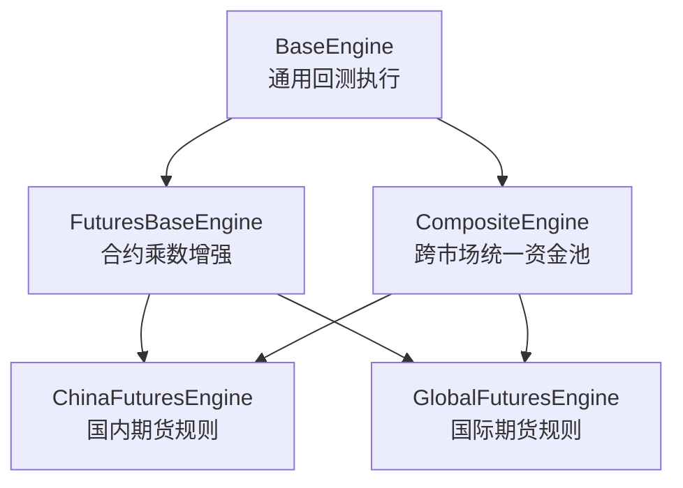
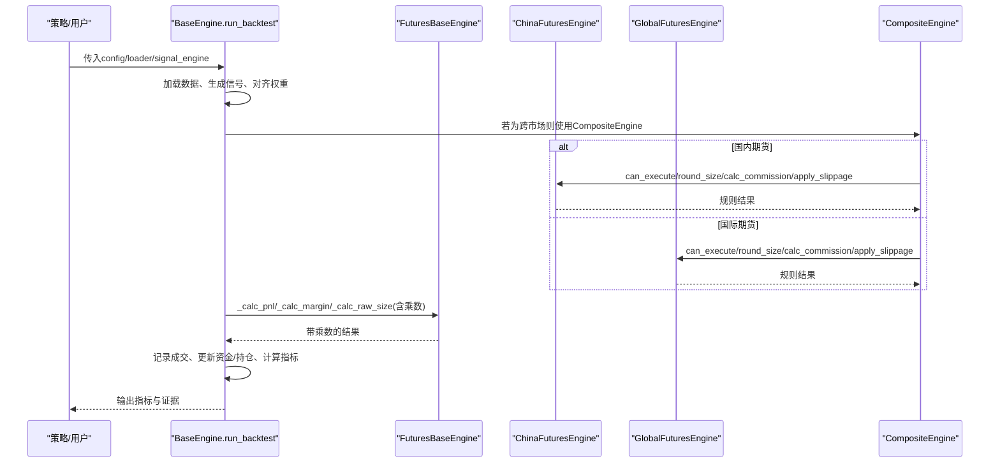
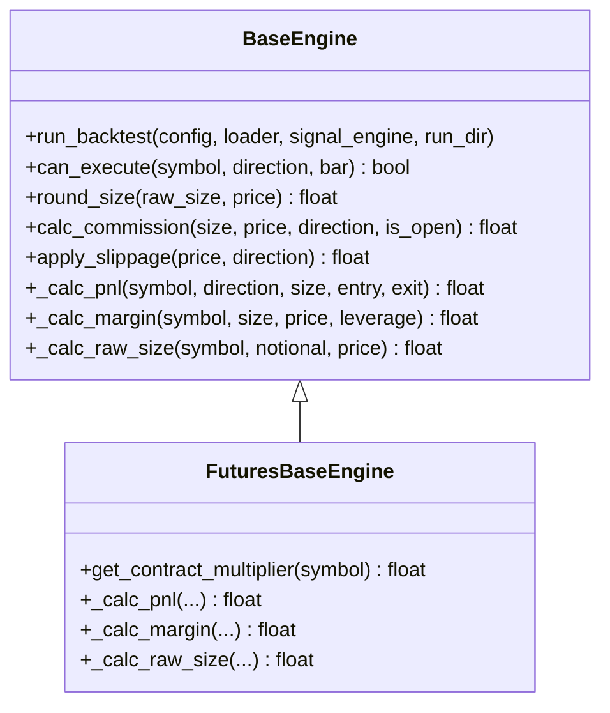
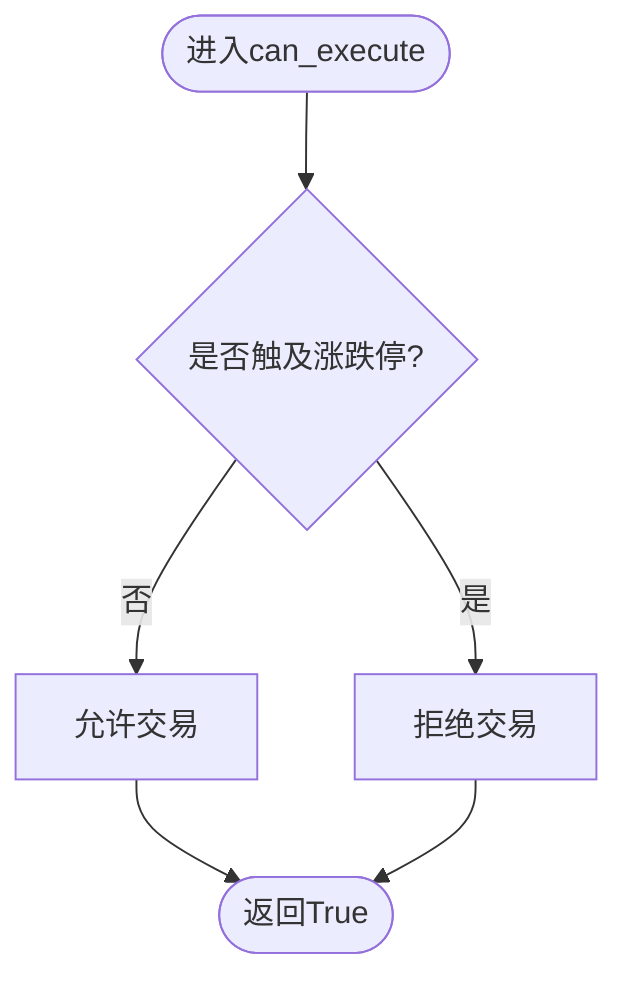
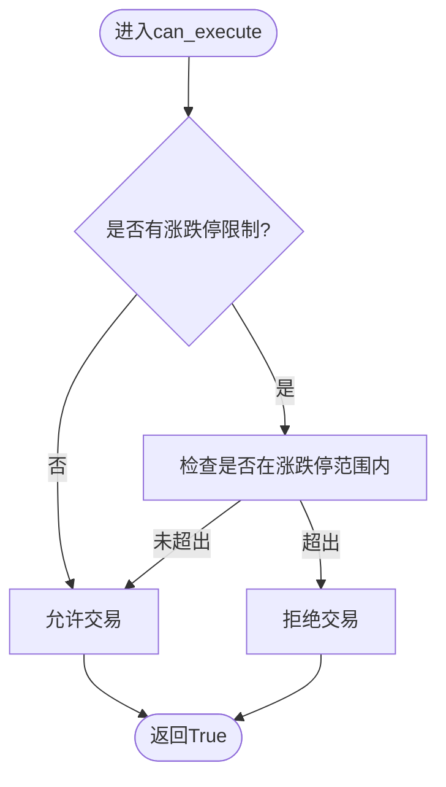
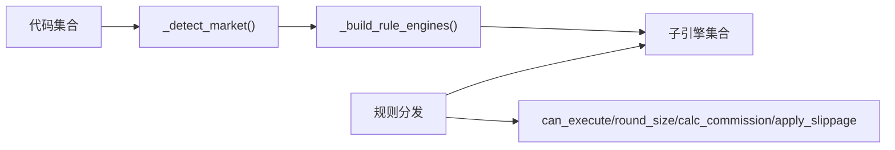
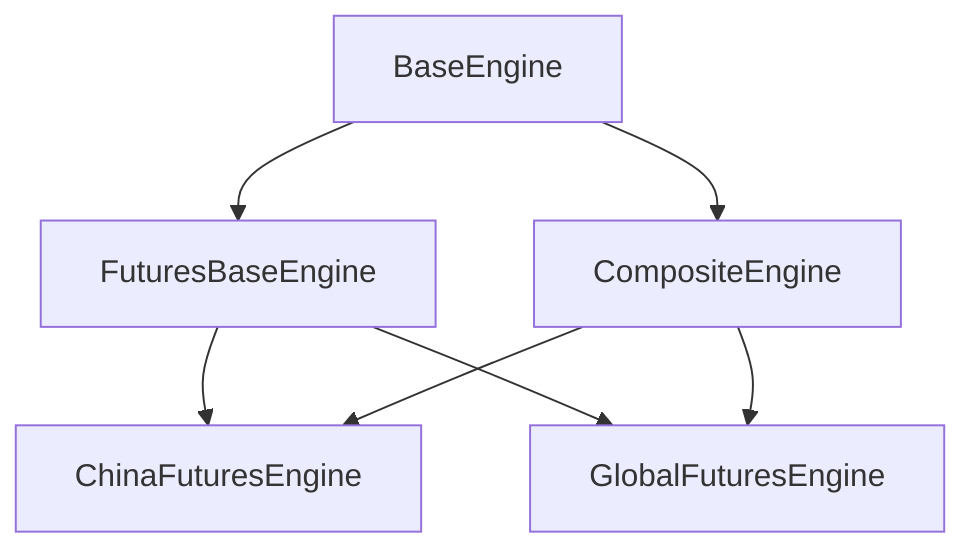

# 期货引擎

<cite>
**本文引用的文件**
- [futures_base.py](file://agent/backtest/engines/futures_base.py)
- [china_futures.py](file://agent/backtest/engines/china_futures.py)
- [global_futures.py](file://agent/backtest/engines/global_futures.py)
- [base.py](file://agent/backtest/engines/base.py)
- [composite.py](file://agent/backtest/engines/composite.py)
- [test_china_futures_engine.py](file://agent/tests/test_china_futures_engine.py)
- [test_global_futures_engine.py](file://agent/tests/test_global_futures_engine.py)
</cite>

## 目录
1. [简介](#简介)
2. [项目结构](#项目结构)
3. [核心组件](#核心组件)
4. [架构总览](#架构总览)
5. [详细组件分析](#详细组件分析)
6. [依赖关系分析](#依赖关系分析)
7. [性能考量](#性能考量)
8. [故障排查指南](#故障排查指南)
9. [结论](#结论)
10. [附录](#附录)

## 简介
本文件面向“期货回测引擎”的完整技术文档，聚焦以下目标：
- 深入说明期货合约的特殊规则：合约乘数、保证金制度、涨跌停板、滑点与手续费、T+0交易、交割结算与展期换月、基差处理等。
- 区分国内期货（中金所CFFEX、上期所SHFE、大商所DCE、郑商所ZCE、INE、广期所GFEX）与国际期货（CME/CBOT/NYMEX/COMEX/ICE/Eurex）的规则差异。
- 提供策略回测配置示例、套期保值策略实现思路与多合约组合管理方法。
- 说明前复权处理、合约切换逻辑与风险控制机制在回测中的落地方式。
- 重点阐述FuturesBase基类的设计模式、不同交易所规则适配与合约生命周期管理。

## 项目结构
期货回测引擎位于 backtest.engines 包中，采用分层继承与规则分发设计：
- BaseEngine：通用回测执行循环、信号对齐、指标计算、资金与持仓管理等。
- FuturesBaseEngine：在基础引擎之上注入“合约乘数”对PnL、保证金、头寸规模的影响。
- ChinaFuturesEngine：国内期货市场规则（T+0、涨跌停、按产品差异化佣金与保证金、合约乘数）。
- GlobalFuturesEngine：国际期货市场规则（T+0、指数品种涨跌停、按合约固定佣金、合约乘数）。
- CompositeEngine：跨市场统一资金池，将各市场规则引擎作为“无状态规则书”进行分发。

图表来源
- [base.py:377-644](file://agent/backtest/engines/base.py#L377-L644)
- [futures_base.py:19-56](file://agent/backtest/engines/futures_base.py#L19-L56)
- [china_futures.py:131-250](file://agent/backtest/engines/china_futures.py#L131-L250)
- [global_futures.py:130-218](file://agent/backtest/engines/global_futures.py#L130-L218)
- [composite.py:102-226](file://agent/backtest/engines/composite.py#L102-L226)

章节来源
- [base.py:377-644](file://agent/backtest/engines/base.py#L377-L644)
- [futures_base.py:19-56](file://agent/backtest/engines/futures_base.py#L19-L56)
- [china_futures.py:131-250](file://agent/backtest/engines/china_futures.py#L131-L250)
- [global_futures.py:130-218](file://agent/backtest/engines/global_futures.py#L130-L218)
- [composite.py:102-226](file://agent/backtest/engines/composite.py#L102-L226)

## 核心组件
- FuturesBaseEngine：为所有期货引擎提供统一的合约乘数接入点，覆盖PnL、保证金、头寸规模三个关键计算路径。
- ChinaFuturesEngine：实现国内期货规则，包括：
  - T+0交易、双向开平仓；
  - 涨跌停板（股指±10%，国债±2%左右，商品默认±5%）；
  - 按产品差异化佣金（按名义或按手固定）；
  - 按产品差异化保证金率；
  - 合约乘数映射（如IF=300、rb=10、au=1000等）。
- GlobalFuturesEngine：实现国际期货规则，包括：
  - T+0交易、双向开平仓；
  - 指数品种涨跌停（如ES/NQ约±7%），商品多数不设百分比涨跌停；
  - 按合约固定佣金（美元）；
  - 合约乘数映射（如ES=50、CL=1000、GC=100等）。
- CompositeEngine：跨市场统一资金池，自动识别代码所属市场并路由到对应规则引擎，保证同一运行内币种一致。

章节来源
- [futures_base.py:19-56](file://agent/backtest/engines/futures_base.py#L19-L56)
- [china_futures.py:23-109](file://agent/backtest/engines/china_futures.py#L23-L109)
- [china_futures.py:131-250](file://agent/backtest/engines/china_futures.py#L131-L250)
- [global_futures.py:23-92](file://agent/backtest/engines/global_futures.py#L23-L92)
- [global_futures.py:130-218](file://agent/backtest/engines/global_futures.py#L130-L218)
- [composite.py:26-65](file://agent/backtest/engines/composite.py#L26-L65)
- [composite.py:102-226](file://agent/backtest/engines/composite.py#L102-L226)

## 架构总览
期货回测的执行流程由BaseEngine驱动，FuturesBaseEngine在关键计算处注入合约乘数，具体市场规则由子类实现。CompositeEngine负责跨市场统一调度。

图表来源
- [base.py:647-784](file://agent/backtest/engines/base.py#L647-L784)
- [futures_base.py:39-56](file://agent/backtest/engines/futures_base.py#L39-L56)
- [china_futures.py:161-232](file://agent/backtest/engines/china_futures.py#L161-L232)
- [global_futures.py:150-218](file://agent/backtest/engines/global_futures.py#L150-L218)
- [composite.py:129-226](file://agent/backtest/engines/composite.py#L129-L226)

## 详细组件分析

### FuturesBaseEngine：合约乘数增强层
- 设计要点：
  - 通过抽象方法get_contract_multiplier(symbol)让子类提供产品级乘数。
  - 重写PnL、保证金、原始头寸规模计算，确保乘数参与：
    - PnL = direction × size × multiplier × (exit - entry)
    - Margin = size × price × multiplier / leverage
    - RawSize = target_notional / (price × multiplier)
- 复杂度与影响：
  - 乘数查找为O(1)字典查询；
  - 对PnL和保证金线性放大，直接影响风险暴露与资金占用。

图表来源
- [base.py:377-644](file://agent/backtest/engines/base.py#L377-L644)
- [futures_base.py:19-56](file://agent/backtest/engines/futures_base.py#L19-L56)

章节来源
- [futures_base.py:19-56](file://agent/backtest/engines/futures_base.py#L19-L56)

### ChinaFuturesEngine：国内期货规则
- 合约乘数：按产品映射（如IF=300、rb=10、au=1000等）。
- 保证金率：按产品最低保证金率（如IF=12%，rb=10%，au=8%等）。
- 涨跌停：股指±10%，国债±2%左右，商品默认±5%。
- 佣金：按产品分为按名义比例或按手固定两种。
- 滑点：按价格比例施加。
- 交易规则：T+0，双向开平仓，最小交易单位1手，整数手数。

图表来源
- [china_futures.py:161-188](file://agent/backtest/engines/china_futures.py#L161-L188)
- [base.py:468-557](file://agent/backtest/engines/base.py#L468-L557)

章节来源
- [china_futures.py:23-109](file://agent/backtest/engines/china_futures.py#L23-L109)
- [china_futures.py:131-250](file://agent/backtest/engines/china_futures.py#L131-L250)
- [test_china_futures_engine.py:67-200](file://agent/tests/test_china_futures_engine.py#L67-L200)

### GlobalFuturesEngine：国际期货规则
- 合约乘数：按产品映射（如ES=50、CL=1000、GC=100等）。
- 涨跌停：指数品种（ES/NQ/YM/RTY/MES/MNQ）约±7%，商品多数不设置百分比涨跌停。
- 佣金：按合约固定费用（美元）。
- 滑点：按价格比例施加。
- 交易规则：T+0，双向开平仓，整数手数。

图表来源
- [global_futures.py:150-177](file://agent/backtest/engines/global_futures.py#L150-L177)
- [base.py:468-557](file://agent/backtest/engines/base.py#L468-L557)

章节来源
- [global_futures.py:23-92](file://agent/backtest/engines/global_futures.py#L23-L92)
- [global_futures.py:130-218](file://agent/backtest/engines/global_futures.py#L130-L218)
- [test_global_futures_engine.py:58-200](file://agent/tests/test_global_futures_engine.py#L58-L200)

### CompositeEngine：跨市场统一资金池
- 功能：
  - 根据代码集合自动识别市场类型，构建子规则引擎（A股、美股、港股、印度、韩国、加密货币、外汇、国内期货、国际期货）。
  - 强制同一运行内结算币种一致，避免混合币种导致权益曲线不可比。
  - 将can_execute、round_size、calc_commission、apply_slippage等规则调用路由到对应子引擎。
  - 对PnL、保证金、头寸规模计算也按symbol路由到对应子引擎。
- 注意：
  - 对于加密货币与外汇，CompositeEngine还承担资金费率、爆仓、掉费等状态性逻辑。

图表来源
- [composite.py:26-65](file://agent/backtest/engines/composite.py#L26-L65)
- [composite.py:102-226](file://agent/backtest/engines/composite.py#L102-L226)

章节来源
- [composite.py:26-65](file://agent/backtest/engines/composite.py#L26-L65)
- [composite.py:102-226](file://agent/backtest/engines/composite.py#L102-L226)

## 依赖关系分析
- BaseEngine提供公共执行框架与指标计算，被FuturesBaseEngine及CompositeEngine复用。
- FuturesBaseEngine依赖BaseEngine，并在PnL、保证金、头寸规模上注入乘数。
- ChinaFuturesEngine与GlobalFuturesEngine均继承自FuturesBaseEngine，分别实现各自市场的规则。
- CompositeEngine聚合多个市场引擎，按符号路由规则调用，同时维护共享资金池与状态。

图表来源
- [base.py:377-644](file://agent/backtest/engines/base.py#L377-L644)
- [futures_base.py:19-56](file://agent/backtest/engines/futures_base.py#L19-L56)
- [china_futures.py:131-250](file://agent/backtest/engines/china_futures.py#L131-L250)
- [global_futures.py:130-218](file://agent/backtest/engines/global_futures.py#L130-L218)
- [composite.py:102-226](file://agent/backtest/engines/composite.py#L102-L226)

章节来源
- [base.py:377-644](file://agent/backtest/engines/base.py#L377-L644)
- [futures_base.py:19-56](file://agent/backtest/engines/futures_base.py#L19-L56)
- [china_futures.py:131-250](file://agent/backtest/engines/china_futures.py#L131-L250)
- [global_futures.py:130-218](file://agent/backtest/engines/global_futures.py#L130-L218)
- [composite.py:102-226](file://agent/backtest/engines/composite.py#L102-L226)

## 性能考量
- 数据对齐与填充：BaseEngine中对close矩阵与位置矩阵使用向量化操作与ffill限制，减少长停牌导致的信号失真。
- 历史基准价：BaseEngine.historical_base_price优先使用pre_settle/pre_close，避免未来函数。
- 涨跌停检查：在can_execute阶段基于历史基准价与当前bar的open/close进行范围判断，避免越界成交。
- 乘数查找：均为O(1)字典查询，开销可忽略。
- 跨市场调度：CompositeEngine按市场类型懒加载子引擎，减少不必要的初始化成本。

[本节为通用性能讨论，不直接分析具体文件]

## 故障排查指南
- 无法交易（涨跌停拦截）：
  - 检查bar中是否存在pre_settle或pre_close，以及涨跌停比例是否正确配置。
  - 国内商品默认±5%，股指±10%，国债±2%左右；国际指数约±7%。
- 成交金额异常：
  - 确认合约乘数是否正确映射（IF=300、rb=10、au=1000、ES=50、CL=1000等）。
  - 检查杠杆与保证金率是否合理（国内按产品最低保证金率推导杠杆）。
- 佣金偏差：
  - 国内按产品区分“按名义比例”或“按手固定”，国际按合约固定费用。
  - 可通过commission_override或commission_per_contract进行覆盖测试。
- 跨市场混币错误：
  - CompositeEngine会拒绝不同结算币种的代码集合，需拆分运行或使用统一币种数据。

章节来源
- [china_futures.py:161-232](file://agent/backtest/engines/china_futures.py#L161-L232)
- [global_futures.py:150-218](file://agent/backtest/engines/global_futures.py#L150-L218)
- [composite.py:68-99](file://agent/backtest/engines/composite.py#L68-L99)
- [test_china_futures_engine.py:120-200](file://agent/tests/test_china_futures_engine.py#L120-L200)
- [test_global_futures_engine.py:101-200](file://agent/tests/test_global_futures_engine.py#L101-L200)

## 结论
该期货回测引擎以BaseEngine为核心执行框架，通过FuturesBaseEngine注入合约乘数，再由ChinaFuturesEngine与GlobalFuturesEngine分别实现国内外市场规则，CompositeEngine提供跨市场统一资金池与规则分发。整体设计清晰、可扩展性强，能够支持多种期货合约的交易规则与风控约束。

[本节为总结性内容，不直接分析具体文件]

## 附录

### 期货合约特殊规则说明
- 合约乘数：决定每点价值与PnL、保证金、头寸规模的放大倍数。
- 保证金制度：国内按产品最低保证金率推导杠杆；国际通常有初始与维护保证金，但回测中以杠杆近似。
- 涨跌停板：国内股指±10%，国债±2%左右，商品默认±5%；国际指数约±7%，商品多数不设百分比涨跌停。
- 滑点与手续费：国内按产品区分比例或固定；国际按合约固定费用。
- T+0与双向交易：国内外期货均支持当日开平与做空。
- 交割结算：回测中假设连续主力合约数据，未显式建模交割过程。
- 展期换月：回测中未内置自动展期逻辑，需在数据层提供连续序列或在策略层切换合约。
- 基差处理：回测中不直接建模基差，可在策略信号中考虑近远月价差。

[本节为概念性说明，不直接分析具体文件]

### 策略回测配置示例（思路）
- 国内期货：
  - codes: ["IF2406.CFFEX", "rb2410.SHFE"]
  - initial_cash: 1000000
  - interval: "1D"
  - slippage: 0.0005
  - margin_rate_override: 可选，覆盖默认保证金率
  - commission_override: 可选，覆盖默认佣金
- 国际期货：
  - codes: ["ESZ4", "CLF25"]
  - initial_cash: 1000000
  - interval: "1D"
  - slippage: 0.0003
  - commission_per_contract: 可选，覆盖默认按合约佣金

[本节为概念性说明，不直接分析具体文件]

### 套期保值策略实现（思路）
- 现货与期货对冲：
  - 持有现货多头，同时在相应期货合约建立空头头寸，利用合约乘数与杠杆控制对冲比例。
  - 通过调整期货头寸规模匹配现货名义敞口，降低系统性风险。
- 跨品种对冲：
  - 选择相关性较高的品种（如原油与成品油），利用价差波动进行统计套利或动态对冲。

[本节为概念性说明，不直接分析具体文件]

### 多合约组合管理（思路）
- 统一资金池：使用CompositeEngine管理跨市场资金，避免币种混用。
- 风险预算：基于合约乘数与保证金占用分配风险预算，控制单合约与组合最大回撤。
- 动态调仓：结合信号与优化器，定期再平衡，考虑换手成本与滑点。

[本节为概念性说明，不直接分析具体文件]

### 数据前复权与合约切换逻辑（思路）
- 前复权：在数据加载阶段对价格序列进行复权处理，确保收益连续性。
- 合约切换：在数据层提供连续主力合约序列；策略层可根据到期日或流动性指标切换合约。
- 回测一致性：确保切换时点前后价格与信号对齐，避免跳跃导致的误判。

[本节为概念性说明，不直接分析具体文件]

### 风险控制机制（思路）
- 涨跌停拦截：在can_execute阶段拒绝越界交易。
- 保证金监控：基于杠杆与乘数计算占用，防止过度杠杆。
- 止损与仓位控制：在策略层实现止损与最大仓位限制。
- 跨币种校验：CompositeEngine拒绝混合币种运行，避免权益曲线不可比。

[本节为概念性说明，不直接分析具体文件]