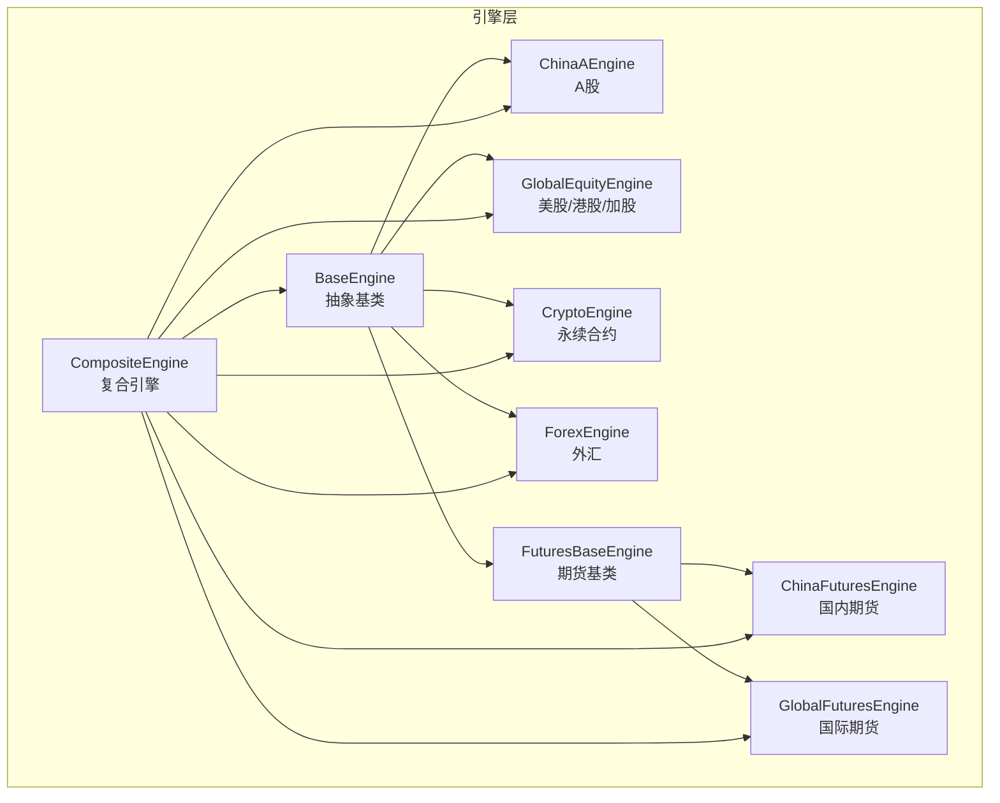
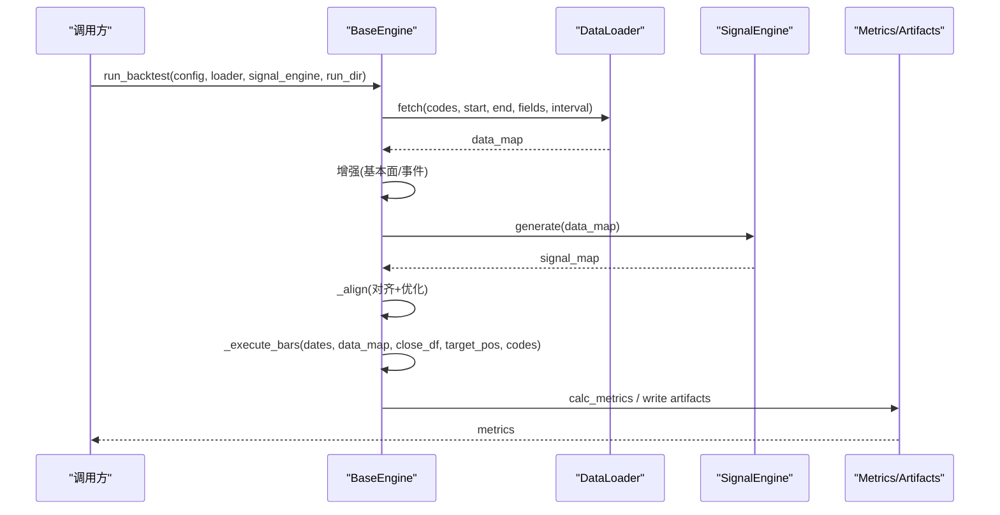
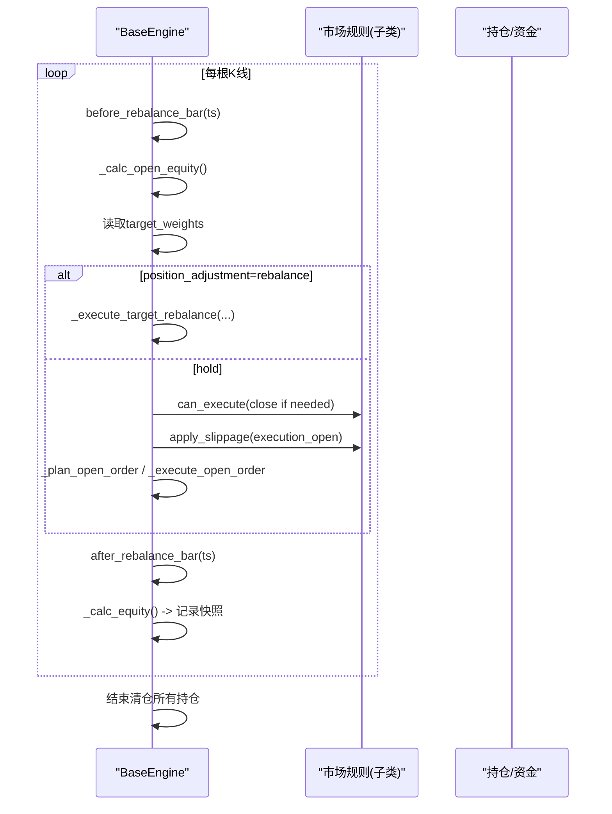
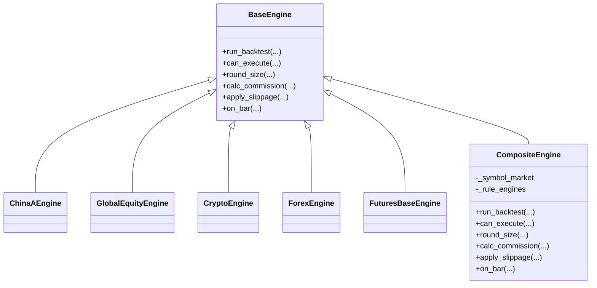
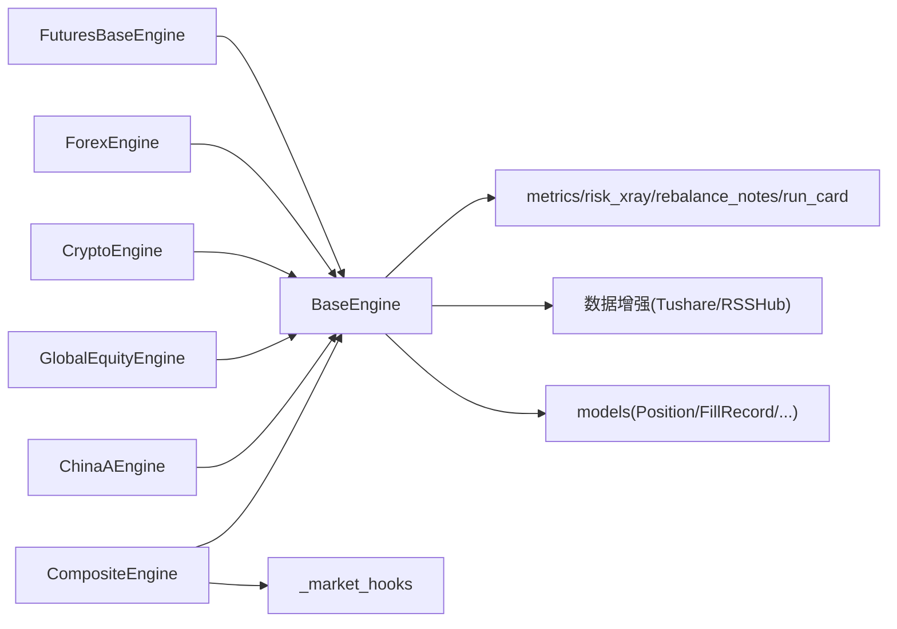

# 引擎架构设计

<cite>
**本文引用的文件**
- [base.py](file://agent/backtest/engines/base.py)
- [composite.py](file://agent/backtest/engines/composite.py)
- [china_a.py](file://agent/backtest/engines/china_a.py)
- [crypto.py](file://agent/backtest/engines/crypto.py)
- [forex.py](file://agent/backtest/engines/forex.py)
- [global_equity.py](file://agent/backtest/engines/global_equity.py)
- [futures_base.py](file://agent/backtest/engines/futures_base.py)
- [_market_hooks.py](file://agent/backtest/engines/_market_hooks.py)
- [__init__.py](file://agent/backtest/engines/__init__.py)
</cite>

## 目录
1. [简介](#简介)
2. [项目结构](#项目结构)
3. [核心组件](#核心组件)
4. [架构总览](#架构总览)
5. [详细组件分析](#详细组件分析)
6. [依赖关系分析](#依赖关系分析)
7. [性能考量](#性能考量)
8. [故障排查指南](#故障排查指南)
9. [结论](#结论)
10. [附录：自定义市场引擎示例](#附录自定义市场引擎示例)

## 简介
本文件系统性梳理 Vibe-Trading 回测引擎的架构与实现，重点围绕 BaseEngine 抽象基类的设计模式、市场规则接口、回测执行循环、信号对齐机制与性能优化策略；并详解 can_execute、round_size、calc_commission、apply_slippage 等关键方法的职责与实现思路。同时说明 Composite Engine（复合引擎）如何协调多个子引擎进行跨市场回测，覆盖生命周期管理、错误处理机制与扩展点设计，并提供继承 BaseEngine 创建自定义市场引擎的实践指引。

## 项目结构
- 引擎层位于 agent/backtest/engines，采用“抽象基类 + 多市场实现 + 复合编排”的分层组织方式。
- BaseEngine 提供统一的回测执行管线与通用逻辑；各市场引擎（A股、全球股票、加密货币、外汇、期货等）仅实现市场特定规则。
- CompositeEngine 作为跨市场编排器，按代码类型动态选择子引擎，统一维护资金池与持仓状态。

图表来源
- [__init__.py:1-31](file://agent/backtest/engines/__init__.py#L1-L31)
- [base.py:377-644](file://agent/backtest/engines/base.py#L377-L644)
- [composite.py:102-159](file://agent/backtest/engines/composite.py#L102-L159)

章节来源
- [__init__.py:1-31](file://agent/backtest/engines/__init__.py#L1-L31)

## 核心组件
- BaseEngine：定义市场规则接口与回测主流程，负责数据加载、信号生成、目标权重预计算、逐根K线执行、指标与产物输出。
- 市场引擎：ChinaAEngine、GlobalEquityEngine、CryptoEngine、ForexEngine、FuturesBaseEngine 及其子类，实现具体市场的交易规则、费用模型、滑点与保证金/PnL计算。
- CompositeEngine：跨市场组合引擎，按代码识别市场类型，将规则方法委派给对应子引擎，统一持有资金、持仓与交易记录。

章节来源
- [base.py:377-848](file://agent/backtest/engines/base.py#L377-L848)
- [composite.py:102-257](file://agent/backtest/engines/composite.py#L102-L257)

## 架构总览
BaseEngine.run_backtest 是回测主入口，串联以下阶段：
1) 数据加载与增强（基本面、事件）
2) 信号生成与校验
3) 信号对齐与目标权重预计算（含可选优化器）
4) 逐根K线执行（开仓/减仓/平仓），期间调用市场规则接口
5) 指标计算与产物输出（基准、风险X光、调仓备注等）
6) 信任层运行卡片写入

图表来源
- [base.py:647-848](file://agent/backtest/engines/base.py#L647-L848)

## 详细组件分析

### BaseEngine 抽象基类
- 市场规则接口（子类必须实现）
  - can_execute(symbol, direction, bar)：是否允许交易（涨跌停、T+1、做空限制等）
  - round_size(raw_size, price)：按最小交易单位取整（如A股100股、外汇微手）
  - calc_commission(size, price, direction, is_open)：佣金/税费模型
  - apply_slippage(price, direction)：滑点模型（买卖方向不同）
- 价格与限价带辅助
  - historical_base_price：获取历史基准价（pre_close/pre_settle或前收盘）
  - prospective_fill_price：预计成交价（open +/- 滑点）
  - limit_band：根据基准价与涨跌幅限制计算合法价格区间
- 估值与PnL/Margin钩子
  - execution_open/valuation_open：执行价与估值价
  - _calc_pnl/_calc_margin/_calc_raw_size/_leverage_for_symbol：可被期货等子类重写
- 执行循环
  - _execute_bars：逐日估值、释放资金、计划订单、预算缩放、提交订单、后处理钩子、记录权益快照、结束清仓
  - _plan_open_order/_execute_open_order/_close_position/_execute_target_rebalance：订单计划与执行细节
- 信号对齐与优化
  - _align：构建统一日期索引、收盘价矩阵、位置矩阵、收益率矩阵；对信号做下一根开盘语义移位、归一化；支持可选优化器与约束
- 生命周期与产物
  - before_rebalance_bar/after_rebalance_bar/after_position_adjustment：扩展点
  - _write_artifacts：写入均衡备注、风险X光、运行卡片等

章节来源
- [base.py:377-644](file://agent/backtest/engines/base.py#L377-L644)
- [base.py:852-1599](file://agent/backtest/engines/base.py#L852-L1599)
- [base.py:149-249](file://agent/backtest/engines/base.py#L149-L249)

#### 执行循环时序图（关键路径）

图表来源
- [base.py:852-1030](file://agent/backtest/engines/base.py#L852-L1030)

### 市场引擎实现要点

#### ChinaAEngine（A股）
- 规则：禁止做空、T+1、涨跌停限制（主板±10%、创业板/科创板±20%、ST±5%）、最小交易单位100股
- 费用：佣金（最低¥5）、印花税（卖出）、过户费
- 滑点：线性比例
- 涨跌停拦截：基于历史基准价与预计成交价比较，避免未来函数

章节来源
- [china_a.py:20-93](file://agent/backtest/engines/china_a.py#L20-L93)
- [china_a.py:115-193](file://agent/backtest/engines/china_a.py#L115-L193)

#### GlobalEquityEngine（美股/港股/加拿大）
- 规则：T+0、双向交易；港股有印花税与附加费；加拿大按交易所价格步进网格
- 费用：美股近似零；港股多层费用；加拿大按配置费率
- 滑点：按市场设定；加拿大额外应用官方tick grid

章节来源
- [global_equity.py:33-124](file://agent/backtest/engines/global_equity.py#L33-L124)

#### CryptoEngine（加密货币永续）
- 规则：24/7、无方向限制；支持严格模式（perpetual_strict）下的资金费率结算与强平检查
- 费用：Maker/Taker 区分；严格模式下开仓通常走Taker
- 滑点：默认方向不利；严格模式下rebalance可关闭滑点
- 强平：基于维护保证金与风险框架评估，触发逐仓/全仓强平
- 证据：记录资金结算、强平事件、风险快照

章节来源
- [crypto.py:41-130](file://agent/backtest/engines/crypto.py#L41-L130)
- [crypto.py:141-347](file://agent/backtest/engines/crypto.py#L141-L347)
- [crypto.py:349-615](file://agent/backtest/engines/crypto.py#L349-L615)

#### ForexEngine（外汇）
- 规则：24x5、无限制；标准手=100,000基础货币；支持隔夜掉期
- 费用：以点差体现（买入/卖出价差），无显式佣金
- 滑点：半点差+额外滑点；按货币对pip值计算
- 掉期：每日收盘时按持仓收取/支付

章节来源
- [forex.py:56-137](file://agent/backtest/engines/forex.py#L56-L137)

#### FuturesBaseEngine（期货基类）
- 在 BaseEngine 基础上引入合约乘数，影响PnL、保证金与头寸规模换算
- 子类需实现 get_contract_multiplier(symbol)

章节来源
- [futures_base.py:19-57](file://agent/backtest/engines/futures_base.py#L19-L57)

### 复合引擎（CompositeEngine）
- 作用：跨市场回测的统一入口，维护共享资金池与全局持仓；子引擎仅作为“规则书”无状态参与
- 路由：按代码识别市场类型，动态构建子引擎映射；期货进一步区分国内/国际
- 委派：can_execute/round_size/calc_commission/apply_slippage 等方法委托到对应子引擎
- 特殊处理：A股T+1拦截、加密货币资金费与强平、外汇掉期
- 币种一致性校验：拒绝混合结算货币的代码集合（避免不可比净值曲线）

图表来源
- [composite.py:102-257](file://agent/backtest/engines/composite.py#L102-L257)
- [base.py:377-644](file://agent/backtest/engines/base.py#L377-L644)

章节来源
- [composite.py:26-159](file://agent/backtest/engines/composite.py#L26-L159)
- [composite.py:161-257](file://agent/backtest/engines/composite.py#L161-L257)

## 依赖关系分析
- BaseEngine 依赖：
  - 数据增强：基本面（Tushare）、事件（RSSHub）
  - 指标与产物：metrics、risk_xray、rebalance_notes、run_card
  - 模型：Position/FillRecord/TradeRecord/EquitySnapshot
- 市场引擎依赖：
  - A股：涨跌停判断、最小交易单位
  - 外汇：点差表、掉期计算
  - 加密货币：资金费率、强平检查、严格模式风险框架
  - 期货：合约乘数
- 复合引擎依赖：
  - 市场探测与工具：_market_hooks（市场识别、汇率符号标准化、掉期/资金费等）

图表来源
- [base.py:26-44](file://agent/backtest/engines/base.py#L26-L44)
- [composite.py:15-23](file://agent/backtest/engines/composite.py#L15-L23)

章节来源
- [base.py:26-44](file://agent/backtest/engines/base.py#L26-L44)
- [composite.py:15-23](file://agent/backtest/engines/composite.py#L15-L23)

## 性能考量
- 信号对齐与矩阵运算
  - 使用numpy数组与searchsorted建立统一日期索引与矩阵映射，减少pandas开销
  - ffill限制跨市场长停牌场景（如春节）
  - 向量化的ffill与clip操作提升对齐效率
- 执行循环优化
  - 预提取目标权重与收盘价矩阵为ndarray，O(1)索引访问
  - 批量计划订单后进行预算缩放（二分法），保证组合比例一致且独立于代码顺序
  - 当未重写PnL/Margin时使用向量化路径计算权益
- 市场规则与滑点
  - 涨跌停检查基于历史基准价与预计成交价，避免未来函数与无效交易
  - 外汇点差与滑点按pip粒度精确建模
- 资源与内存
  - 通过局部变量与数组视图降低中间对象创建
  - 严格模式下加密货币的风险帧缓存与维护保证金版本控制

章节来源
- [base.py:149-249](file://agent/backtest/engines/base.py#L149-L249)
- [base.py:852-1030](file://agent/backtest/engines/base.py#L852-L1030)
- [forex.py:102-123](file://agent/backtest/engines/forex.py#L102-L123)
- [crypto.py:141-196](file://agent/backtest/engines/crypto.py#L141-L196)

## 故障排查指南
- 常见错误与定位
  - 无数据/无有效信号：run_backtest早期校验失败，检查loader与signal_engine返回类型
  - 混合结算货币：CompositeEngine拒绝跨币种代码集，需拆分运行或转换至统一结算货币
  - 非有限值/非法价格：rebalance路径对价格/杠杆/规模进行严格校验，抛出异常提示
  - 强平与资金不足：加密货币严格模式下，若资金不足以支撑新订单将被拒绝；强平触发后标记账户终止状态
- 调试建议
  - 启用日志警告查看对齐与计划阶段的失败原因
  - 检查历史基准价字段（pre_close/pre_settle/pct_chg）是否存在与有效
  - 对于外汇，确认符号标准化与点差配置是否正确
  - 对于期货，确认合约乘数与保证金计算是否符合预期

章节来源
- [base.py:673-706](file://agent/backtest/engines/base.py#L673-L706)
- [base.py:1329-1340](file://agent/backtest/engines/base.py#L1329-L1340)
- [composite.py:68-99](file://agent/backtest/engines/composite.py#L68-L99)
- [crypto.py:296-347](file://agent/backtest/engines/crypto.py#L296-L347)

## 结论
BaseEngine 通过清晰的市场规则接口与稳健的执行循环，提供了可扩展、高性能的回测基础设施；各市场引擎聚焦本地规则与成本模型，复合引擎则实现跨市场协同与统一资金管理。该设计兼顾了准确性（避免未来函数、严格校验）、性能（向量化与批量计划）与可维护性（扩展点与模块化）。

## 附录：自定义市场引擎示例
以下为继承 BaseEngine 创建自定义市场引擎的步骤与要点（不直接粘贴源码，给出路径参考）：

- 步骤
  1) 新建引擎类继承 BaseEngine
     - 参考：[base.py:377-644](file://agent/backtest/engines/base.py#L377-L644)
  2) 实现市场规则接口
     - can_execute：实现交易许可（涨跌停、T+1、做空限制等）
       - 参考：[china_a.py:40-68](file://agent/backtest/engines/china_a.py#L40-L68)
     - round_size：按最小交易单位取整
       - 参考：[china_a.py:70-73](file://agent/backtest/engines/china_a.py#L70-L73)
     - calc_commission：实现佣金/税费模型
       - 参考：[china_a.py:74-88](file://agent/backtest/engines/china_a.py#L74-L88)
     - apply_slippage：实现滑点模型
       - 参考：[china_a.py:90-93](file://agent/backtest/engines/china_a.py#L90-L93)
  3) 如需期货特性，继承 FuturesBaseEngine 并实现 get_contract_multiplier
     - 参考：[futures_base.py:19-57](file://agent/backtest/engines/futures_base.py#L19-L57)
  4) 注册到 CompositeEngine（如需要跨市场）
     - 参考：[composite.py:26-65](file://agent/backtest/engines/composite.py#L26-L65)
  5) 在 run_backtest 中验证
     - 参考：[base.py:647-848](file://agent/backtest/engines/base.py#L647-L848)

- 关键点
  - 使用 historical_base_price/prospective_fill_price/limit_band 确保涨跌停检查无未来函数
    - 参考：[base.py:468-557](file://agent/backtest/engines/base.py#L468-L557)
  - 利用 _plan_open_order 与 _execute_target_rebalance 完成订单计划与执行
    - 参考：[base.py:1157-1327](file://agent/backtest/engines/base.py#L1157-L1327)
  - 通过 on_bar/before_rebalance_bar/after_rebalance_bar/after_position_adjustment 扩展市场特定逻辑（如资金费、强平、掉期）
    - 参考：[base.py:558-599](file://agent/backtest/engines/base.py#L558-L599)
    - 参考：[crypto.py:601-615](file://agent/backtest/engines/crypto.py#L601-L615)
    - 参考：[forex.py:124-133](file://agent/backtest/engines/forex.py#L124-L133)