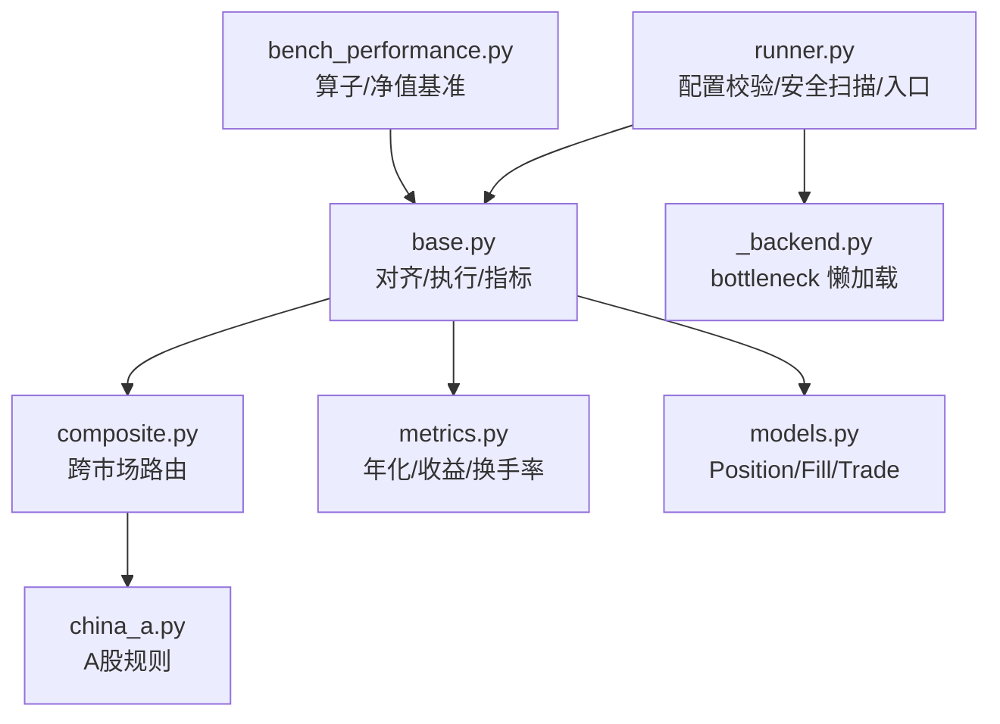
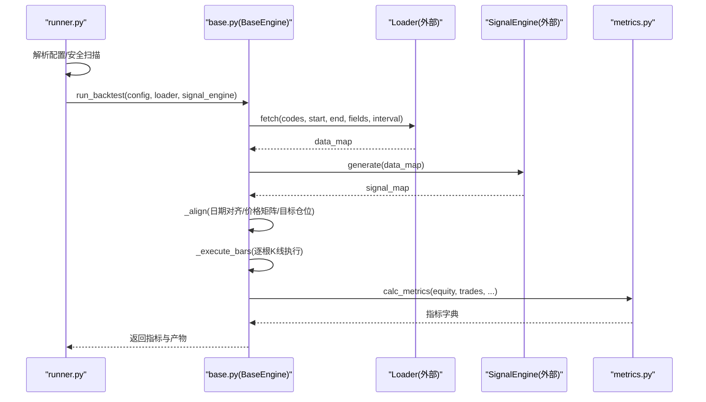
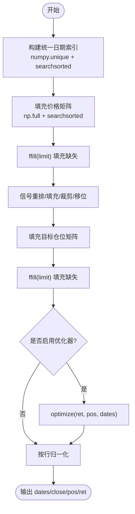
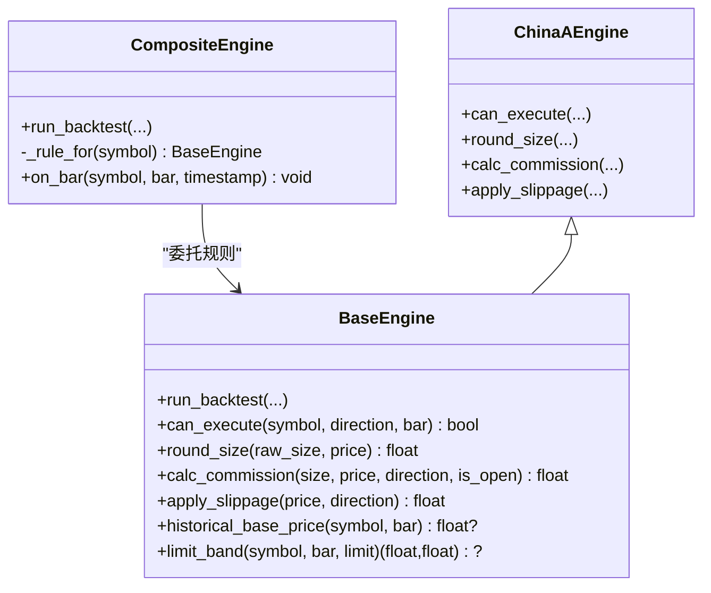
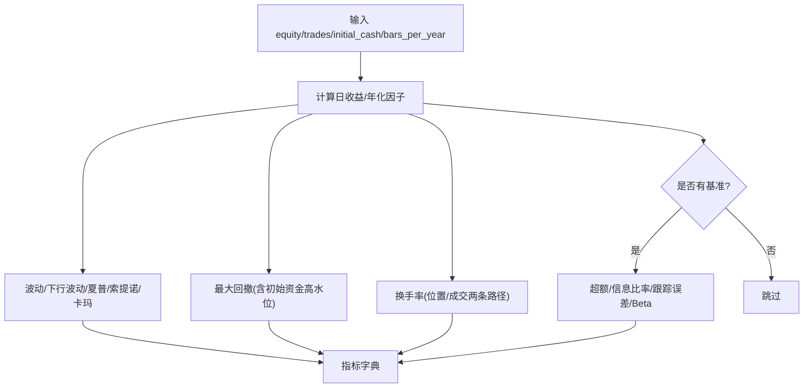
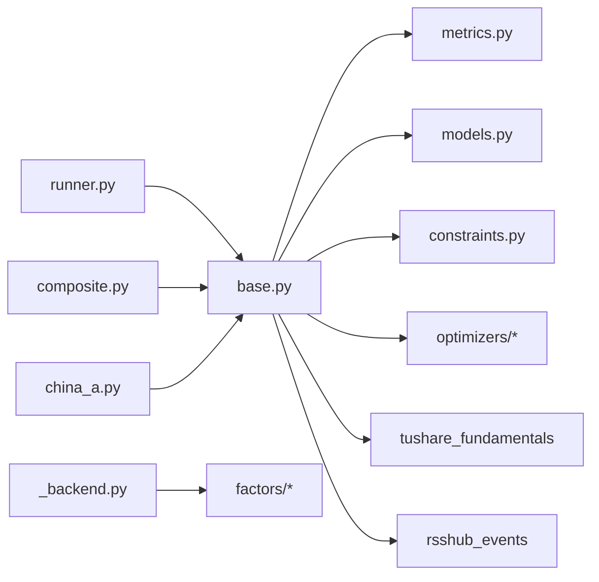

# 性能优化策略

<cite>
**本文引用的文件**
- [runner.py](file://agent/backtest/runner.py)
- [base.py](file://agent/backtest/engines/base.py)
- [composite.py](file://agent/backtest/engines/composite.py)
- [china_a.py](file://agent/backtest/engines/china_a.py)
- [metrics.py](file://agent/backtest/metrics.py)
- [models.py](file://agent/backtest/models.py)
- [_backend.py](file://agent/src/factors/_backend.py)
- [bench_performance.py](file://agent/scripts/bench_performance.py)
</cite>

## 目录
1. [简介](#简介)
2. [项目结构](#项目结构)
3. [核心组件](#核心组件)
4. [架构总览](#架构总览)
5. [详细组件分析](#详细组件分析)
6. [依赖关系分析](#依赖关系分析)
7. [性能考量](#性能考量)
8. [故障排查指南](#故障排查指南)
9. [结论](#结论)
10. [附录](#附录)

## 简介
本文件面向 Vibe-Trading 回测引擎的性能优化，系统性梳理向量化计算、内存管理、并行与缓存策略、大数据集处理技巧，并给出瓶颈识别方法、基准测试与效果评估工具。重点覆盖数据加载优化、信号计算优化、订单执行优化三大环节，提供大规模回测的最佳实践与常见问题解决方案。

## 项目结构
回测性能相关代码主要分布在以下模块：
- 运行入口与配置校验：runner.py
- 通用回测引擎与对齐/执行循环：base.py
- 跨市场组合引擎：composite.py
- 市场规则（以 A 股为例）：china_a.py
- 指标与年化：metrics.py
- 不可变数据模型：models.py
- 因子后端加速（bottleneck 懒加载）：_backend.py
- 性能基准脚本：bench_performance.py

**图示来源**
- [runner.py:1-800](file://agent/backtest/runner.py#L1-L800)
- [base.py:1-800](file://agent/backtest/engines/base.py#L1-L800)
- [composite.py:1-257](file://agent/backtest/engines/composite.py#L1-L257)
- [china_a.py:1-193](file://agent/backtest/engines/china_a.py#L1-L193)
- [metrics.py:1-638](file://agent/backtest/metrics.py#L1-L638)
- [models.py:1-118](file://agent/backtest/models.py#L1-L118)
- [_backend.py:1-69](file://agent/src/factors/_backend.py#L1-L69)
- [bench_performance.py:1-134](file://agent/scripts/bench_performance.py#L1-L134)

**章节来源**
- [runner.py:1-800](file://agent/backtest/runner.py#L1-L800)
- [base.py:1-800](file://agent/backtest/engines/base.py#L1-L800)

## 核心组件
- 运行器 runner.py：负责读取配置、选择数据源、导入信号引擎、执行安全扫描、调用引擎 run_backtest。
- 基础引擎 base.py：统一的数据对齐、目标权重预计算、逐根 K 线执行、指标计算与产出。
- 组合引擎 composite.py：按代码类型路由到具体市场规则引擎，共享资金池与状态。
- 市场规则 china_a.py：A 股交易规则（T+1、涨跌停、手续费、滑点等）。
- 指标 metrics.py：年化因子、收益率、换手率、基准对比等。
- 数据模型 models.py：不可变的 Position/Fill/Trade/EquitySnapshot。
- 因子后端 _backend.py：bottleneck 的懒加载与降级路径。
- 基准 bench_performance.py：算子与净值计算的基准测试。

**章节来源**
- [runner.py:1-800](file://agent/backtest/runner.py#L1-L800)
- [base.py:1-800](file://agent/backtest/engines/base.py#L1-L800)
- [composite.py:1-257](file://agent/backtest/engines/composite.py#L1-L257)
- [china_a.py:1-193](file://agent/backtest/engines/china_a.py#L1-L193)
- [metrics.py:1-638](file://agent/backtest/metrics.py#L1-L638)
- [models.py:1-118](file://agent/backtest/models.py#L1-L118)
- [_backend.py:1-69](file://agent/src/factors/_backend.py#L1-L69)
- [bench_performance.py:1-134](file://agent/scripts/bench_performance.py#L1-L134)

## 架构总览
回测主流程由 runner 驱动，进入 base 的统一执行循环；在信号生成后，进行日期索引对齐、价格矩阵构建、目标仓位矩阵构建与归一化，再进入逐根 K 线的执行与记录；最后汇总指标与产物。

**图示来源**
- [runner.py:1-800](file://agent/backtest/runner.py#L1-L800)
- [base.py:647-785](file://agent/backtest/engines/base.py#L647-L785)
- [metrics.py:458-623](file://agent/backtest/metrics.py#L458-L623)

## 详细组件分析

### 数据对齐与向量化（base.py 的 _align）
- 统一日期索引：合并各标的交易日历，使用 numpy 唯一值与 searchsorted 建立映射，避免多次 reindex 开销。
- 价格矩阵构建：将 close 序列直接写入二维数组，再用 pandas 的 C 优化 ffill(limit) 做跨日填充，减少 Python 层循环。
- 信号矩阵构建：对每个标的在自身日历上重采样、fillna、clip、shift(1)，再映射到统一网格；整体采用 numpy 原地操作与批量赋值。
- 优化器接入：可选权重优化器在向量化的 ret/pos/dates 上工作，随后对每行绝对和归一化，保证 sum(|w|)<=1。

**图示来源**
- [base.py:149-249](file://agent/backtest/engines/base.py#L149-L249)

**章节来源**
- [base.py:149-249](file://agent/backtest/engines/base.py#L149-L249)

### 逐根 K 线执行与订单优化（base.py 的执行循环）
- 执行入口：run_backtest 完成数据加载、信号生成、对齐后，调用内部 _execute_bars 进行逐根 K 线执行。
- 市场规则：can_execute、round_size、calc_commission、apply_slippage 由子类实现，复合引擎按标的路由到对应规则引擎。
- 成交前检查：prospective_fill_price 结合 limit_band 防止越界成交；历史基准价优先取 pre_close/pre_settle，否则回退到前一收盘价或 pct_chg 反推。
- 费用与滑点：子类精确建模佣金、印花税、过户费、滑点等，确保模拟贴近真实。

**图示来源**
- [base.py:377-644](file://agent/backtest/engines/base.py#L377-L644)
- [composite.py:102-257](file://agent/backtest/engines/composite.py#L102-L257)
- [china_a.py:20-93](file://agent/backtest/engines/china_a.py#L20-L93)

**章节来源**
- [base.py:377-644](file://agent/backtest/engines/base.py#L377-L644)
- [composite.py:102-257](file://agent/backtest/engines/composite.py#L102-L257)
- [china_a.py:20-93](file://agent/backtest/engines/china_a.py#L20-L93)

### 指标与年化（metrics.py）
- 年化因子：根据 source 与 interval 查表得到 bars_per_year，支持多市场与不同周期。
- 收益计算：bar_returns 对非正/非有限前价做安全处理，避免 inf/nan 污染累计收益。
- 换手率：支持基于位置矩阵与基于实际成交的两条路径，保持与优化器的约定一致。
- 综合指标：total_return、annual_return、max_drawdown、sharpe、sortino、calmar、信息比率、跟踪误差、beta 等。

**图示来源**
- [metrics.py:150-167](file://agent/backtest/metrics.py#L150-L167)
- [metrics.py:175-232](file://agent/backtest/metrics.py#L175-L232)
- [metrics.py:458-623](file://agent/backtest/metrics.py#L458-L623)

**章节来源**
- [metrics.py:150-167](file://agent/backtest/metrics.py#L150-L167)
- [metrics.py:175-232](file://agent/backtest/metrics.py#L175-L232)
- [metrics.py:458-623](file://agent/backtest/metrics.py#L458-L623)

### 因子后端加速（_backend.py）
- bottleneck 懒加载：首次访问时尝试导入，若禁用或未安装则回退到纯 numpy/pandas 路径，保证结果一致性与可移植性。
- 滑动窗口算子：move_argmax/move_argmin 等由 bottleneck 提供 C 级加速，显著优于 pandas rolling().apply()。
- ts_rank 特殊处理：因语义差异，使用 numpy sliding_window_view 实现，避免误用 bn.move_rank。

**章节来源**
- [_backend.py:1-69](file://agent/src/factors/_backend.py#L1-L69)

### 基准测试（bench_performance.py）
- 算子基准：对比旧 pandas 与新 fast path 的时间，覆盖 ts_rank、ts_argmax、ts_argmin、decay_linear。
- 净值计算基准：对比向量化与循环路径的 _calc_equity 耗时，验证向量化带来的数量级提升。
- 环境探测：打印 bottleneck 可用性与环境变量开关，便于复现实验条件。

**章节来源**
- [bench_performance.py:19-134](file://agent/scripts/bench_performance.py#L19-L134)

## 依赖关系分析
- runner 依赖 loaders.registry 与 engines._market_hooks 进行数据源与市场检测。
- base 依赖 constraints、optimizers、metrics、models 以及 tushare_fundamentals/rsshub_events 增强数据。
- composite 通过 _detect_market 动态实例化各市场引擎，集中管理资金池与状态。
- metrics 依赖 numpy/pandas 并提供统一的年化与统计口径。
- _backend 为因子计算提供可选的 C 加速后端。

**图示来源**
- [runner.py:30-47](file://agent/backtest/runner.py#L30-L47)
- [base.py:23-44](file://agent/backtest/engines/base.py#L23-L44)
- [composite.py:16-23](file://agent/backtest/engines/composite.py#L16-L23)
- [metrics.py:11-14](file://agent/backtest/metrics.py#L11-L14)
- [_backend.py:20-25](file://agent/src/factors/_backend.py#L20-L25)

**章节来源**
- [runner.py:30-47](file://agent/backtest/runner.py#L30-L47)
- [base.py:23-44](file://agent/backtest/engines/base.py#L23-L44)
- [composite.py:16-23](file://agent/backtest/engines/composite.py#L16-L23)
- [metrics.py:11-14](file://agent/backtest/metrics.py#L11-L14)
- [_backend.py:20-25](file://agent/src/factors/_backend.py#L20-L25)

## 性能考量

### 向量化计算
- 价格与信号矩阵采用 numpy 二维数组构建，配合 pandas 的 C 优化 ffill，避免逐元素 Python 循环。
- 使用 searchsorted 将时间戳映射到整数索引，O(log n) 查找替代 O(n) 匹配。
- 因子后端在可用时启用 bottleneck，获得 100-350x 的窗口算子加速。

**章节来源**
- [base.py:149-249](file://agent/backtest/engines/base.py#L149-L249)
- [_backend.py:1-69](file://agent/src/factors/_backend.py#L1-L69)

### 内存管理
- 对齐阶段一次性分配固定大小的二维数组，减少中间对象创建与拷贝。
- 信号矩阵写入前强制 copy=True 以避免 pandas copy-on-write 导致的只读视图问题。
- 指标计算中尽量使用原地操作与数值型数组，降低临时对象开销。

**章节来源**
- [base.py:188-236](file://agent/backtest/engines/base.py#L188-L236)

### 并行处理
- 当前回测主循环为单进程顺序执行；如需并行，可在数据加载阶段按标的分片并行拉取，或在因子计算阶段利用 bottleneck/numpy 的底层并行能力。
- 注意共享状态（如 positions/capital）的并发一致性，建议仅在无状态的数据准备阶段并行。

[本节为通用指导，不直接分析具体文件]

### 缓存策略
- 因子后端对 bottleneck 的懒加载避免启动开销；可按需启用/禁用。
- 对于重复运行的回测，可将 data_map/signal_map 持久化到磁盘，避免重复 I/O 与网络请求。
- 指标与产物已落盘（artifacts），便于后续复用与对比。

**章节来源**
- [_backend.py:36-68](file://agent/src/factors/_backend.py#L36-L68)
- [base.py:770-800](file://agent/backtest/engines/base.py#L770-L800)

### 大数据集处理技巧
- 合理设置 ffill_limit，避免长停牌导致的有效信号被掩盖。
- 使用 bar_returns 的安全实现，避免非正/非有限价格导致的数值爆炸。
- 通过 metrics.calc_bars_per_year 正确年化，避免错误周期假设导致指标失真。

**章节来源**
- [base.py:184-197](file://agent/backtest/engines/base.py#L184-L197)
- [metrics.py:175-232](file://agent/backtest/metrics.py#L175-L232)
- [metrics.py:150-167](file://agent/backtest/metrics.py#L150-L167)

### 数据加载优化
- 通过 runner 的配置校验与自动市场检测，减少无效数据拉取。
- 可选择 extra_fields 仅拉取必要字段，降低内存占用与传输成本。
- 事件与基本面增强按需开启，避免不必要的网络与计算开销。

**章节来源**
- [runner.py:68-124](file://agent/backtest/runner.py#L68-L124)
- [base.py:673-685](file://agent/backtest/engines/base.py#L673-L685)
- [base.py:309-371](file://agent/backtest/engines/base.py#L309-L371)

### 信号计算优化
- 信号在各自交易日历上先处理（fillna/clip/shift），再映射到统一网格，减少广播与对齐开销。
- 使用 np.nan_to_num 与 clip 原地修改，避免额外副本。
- 可选优化器在向量化的 ret/pos/dates 上工作，提高权重分配效率。

**章节来源**
- [base.py:211-249](file://agent/backtest/engines/base.py#L211-L249)

### 订单执行优化
- 成交前通过 prospective_fill_price 与 limit_band 快速拒绝越界订单，减少无效计算。
- 市场规则（涨跌停、T+1、最小手数、滑点、佣金）在子类中高效实现，复合引擎按标的路由，避免分支爆炸。
- 成交证据 FillRecord 与 TradeRecord 不可变且轻量，便于后续指标计算与审计。

**章节来源**
- [base.py:517-557](file://agent/backtest/engines/base.py#L517-L557)
- [china_a.py:40-93](file://agent/backtest/engines/china_a.py#L40-L93)
- [models.py:13-118](file://agent/backtest/models.py#L13-L118)

## 故障排查指南
- 配置校验失败：检查 codes、start_date/end_date、interval、engine、source 等字段是否符合约束。
- 信号生成失败：确认 SignalEngine.generate 返回 Dict[str, pd.Series]，且键名与 data_map 一致。
- 无有效数据：当所有标的在日期范围内无重叠数据时，会抛出异常；请调整日期范围或标的集合。
- 混合货币组合：CompositeEngine 会拒绝结算货币不一致的代码集合，需拆分运行或统一到同一货币。
- 指标异常：关注 bar_returns 的非正/非有限前价告警；必要时检查数据质量与区间。

**章节来源**
- [runner.py:68-124](file://agent/backtest/runner.py#L68-L124)
- [base.py:687-718](file://agent/backtest/engines/base.py#L687-L718)
- [composite.py:68-99](file://agent/backtest/engines/composite.py#L68-L99)
- [metrics.py:175-232](file://agent/backtest/metrics.py#L175-L232)

## 结论
Vibe-Trading 的回测引擎通过严格的向量化设计、安全的数值处理、可插拔的市场规则与指标体系，实现了高性能与高保真度的平衡。建议在大规模回测中优先优化数据加载与信号计算阶段，充分利用 bottleneck 与 numpy 的底层能力；同时结合基准测试与监控指标持续评估优化效果。

[本节为总结性内容，不直接分析具体文件]

## 附录

### 性能监控指标
- 收益类：total_return、annual_return、max_drawdown、sharpe、sortino、calmar
- 风险类：tracking_error、benchmark_beta、information_ratio
- 交易类：trade_count、win_rate、profit_loss_ratio、avg_holding_days
- 换手类：avg_turnover、total_turnover（支持位置与成交两条路径）

**章节来源**
- [metrics.py:458-623](file://agent/backtest/metrics.py#L458-L623)

### 基准测试方法
- 算子基准：对比 pandas 与 fast path 的 ts_rank/ts_argmax/ts_argmin/decay_linear 耗时。
- 净值基准：对比向量化与循环路径的 _calc_equity 耗时，验证速度提升倍数。
- 环境信息：打印 bottleneck 可用性及相关环境变量，便于复现实验。

**章节来源**
- [bench_performance.py:19-134](file://agent/scripts/bench_performance.py#L19-L134)

### 最佳实践清单
- 数据加载：仅拉取必要字段；合理设置 interval；避免跨币种混跑。
- 信号计算：在各自日历上预处理；使用向量化与原地操作；谨慎设置 ffill_limit。
- 订单执行：利用 limit_band 与 prospective_fill_price 提前拦截；细化佣金与滑点模型。
- 指标与产物：使用统一年化；保存 artifacts 以便回溯；定期运行基准测试。

[本节为通用指导，不直接分析具体文件]