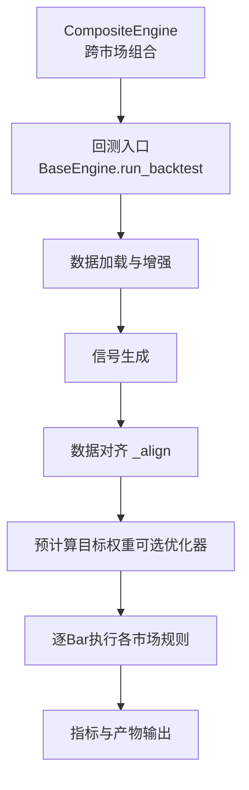
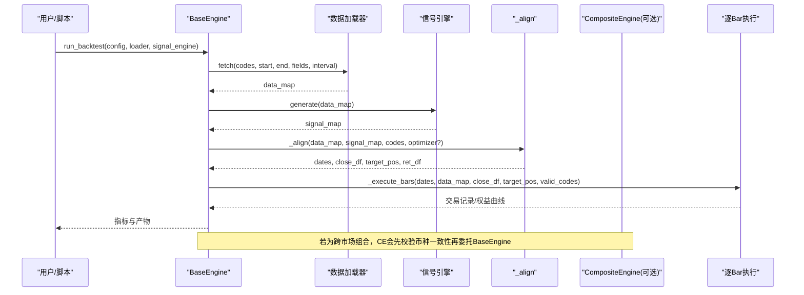
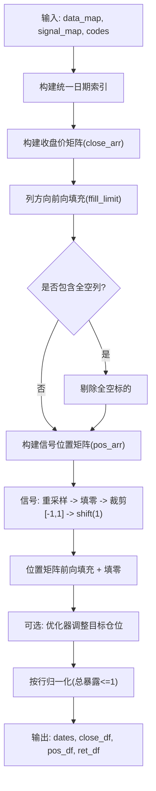
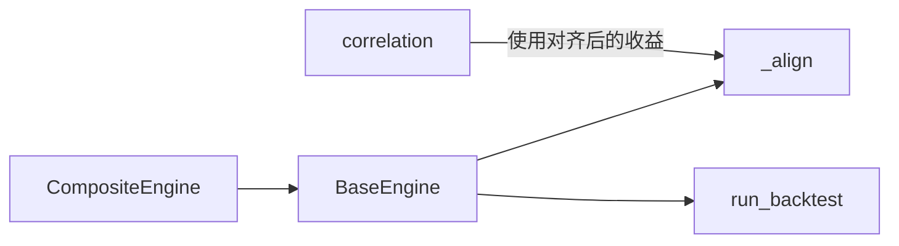

# 数据对齐机制

<cite>
**本文引用的文件**
- [agent/backtest/engines/base.py](file://agent/backtest/engines/base.py)
- [agent/backtest/engines/composite.py](file://agent/backtest/engines/composite.py)
- [agent/backtest/correlation.py](file://agent/backtest/correlation.py)
- [agent/tests/test_base_engine.py](file://agent/tests/test_base_engine.py)
- [agent/tests/test_engine_robustness.py](file://agent/tests/test_engine_robustness.py)
- [agent/tests/test_signal_alignment_perf.py](file://agent/tests/test_signal_alignment_perf.py)
</cite>

## 目录
1. [简介](#简介)
2. [项目结构](#项目结构)
3. [核心组件](#核心组件)
4. [架构总览](#架构总览)
5. [详细组件分析](#详细组件分析)
6. [依赖关系分析](#依赖关系分析)
7. [性能考量](#性能考量)
8. [故障排查指南](#故障排查指南)
9. [结论](#结论)
10. [附录](#附录)

## 简介
本文件系统性说明 Vibe-Trading 在多市场回测中的数据对齐机制，重点围绕 _align 函数的实现原理与行为：统一日期索引构建、收盘价矩阵生成、信号序列对齐、前向填充限制、跨市场日历差异与时区处理、以及数据缺失值（停牌、休市、延迟）的应对策略。同时给出配置选项与性能优化建议，帮助在复杂多资产组合回测中保证结果正确性与执行效率。

## 项目结构
数据对齐的核心位于回测引擎基类中，被各市场引擎复用；跨市场组合由 CompositeEngine 统一管理资金池并调用基类流程。相关测试覆盖了正确性、鲁棒性与性能目标。

图表来源
- [agent/backtest/engines/base.py:647-718](file://agent/backtest/engines/base.py#L647-L718)
- [agent/backtest/engines/composite.py:129-147](file://agent/backtest/engines/composite.py#L129-L147)

章节来源
- [agent/backtest/engines/base.py:647-718](file://agent/backtest/engines/base.py#L647-L718)
- [agent/backtest/engines/composite.py:129-147](file://agent/backtest/engines/composite.py#L129-L147)

## 核心组件
- _align：统一日期索引、构建收盘价矩阵、对齐并移位信号、前向填充限制、可选优化器归一化、返回收益矩阵。
- _detect_market_for_align：轻量级市场识别，用于决定 ffill_limit（单市场 vs 跨市场）。
- CompositeEngine：跨市场组合，统一资金池，按代码路由到对应子引擎执行交易规则。
- 辅助函数：_ffill_1d/_ffill_2d 提供高性能前向填充。

章节来源
- [agent/backtest/engines/base.py:112-249](file://agent/backtest/engines/base.py#L112-L249)
- [agent/backtest/engines/composite.py:102-147](file://agent/backtest/engines/composite.py#L102-L147)

## 架构总览
下图展示从数据加载到对齐再到执行的端到端流程，突出 _align 在其中的关键作用。

图表来源
- [agent/backtest/engines/base.py:647-718](file://agent/backtest/engines/base.py#L647-L718)
- [agent/backtest/engines/composite.py:129-147](file://agent/backtest/engines/composite.py#L129-L147)

## 详细组件分析

### _align 函数：统一索引、矩阵构建、信号对齐与填充
- 统一日期索引
  - 将各标的的交易日历合并为唯一排序时间轴；若所有标的具有相同时区则保留该时区，否则使用无时区索引。
- 收盘价矩阵构建
  - 通过 searchsorted 将各标的收盘价映射到统一网格，形成 (n_dates x n_codes) 矩阵。
- 前向填充限制
  - 使用 pandas 的 ffill(limit=...) 进行列方向前向填充；单市场 limit=5，跨市场 limit=10，避免长停牌或长假掩盖真实价格变动。
- 全空标的剔除
  - 若某标的整列为 NaN，则从对齐结果中移除；若全部标的均无可用数据，抛出异常。
- 信号序列对齐
  - 在每个标的自身日历上重采样信号，填充缺失为 0，裁剪至 [-1, 1]，然后 shift(1) 实现“下一根K线开盘生效”的语义。
  - 将移位后的信号放置到统一网格，并对位置矩阵再次进行带限的前向填充，最终用 nan_to_num 填充剩余 NaN 为 0。
- 收益矩阵与权重归一化
  - 基于收盘价矩阵计算收益率矩阵；若提供优化器，则在对齐后对目标仓位进行优化；最后按行对绝对值之和进行缩放，确保每行总暴露不超过 1。

图表来源
- [agent/backtest/engines/base.py:149-249](file://agent/backtest/engines/base.py#L149-L249)

章节来源
- [agent/backtest/engines/base.py:149-249](file://agent/backtest/engines/base.py#L149-L249)
- [agent/tests/test_base_engine.py:442-520](file://agent/tests/test_base_engine.py#L442-L520)
- [agent/tests/test_engine_robustness.py:40-88](file://agent/tests/test_engine_robustness.py#L40-L88)

### 跨市场组合与币种一致性
- CompositeEngine 在运行前检查所有代码是否结算于同一币种；若混合币种，直接拒绝以避免错误汇总权益曲线。
- 运行时根据代码类型路由到相应子引擎（A股、美股、港股、印度、韩国、加密货币、外汇、期货等），共享资金池与持仓状态。

章节来源
- [agent/backtest/engines/composite.py:68-99](file://agent/backtest/engines/composite.py#L68-L99)
- [agent/backtest/engines/composite.py:102-147](file://agent/backtest/engines/composite.py#L102-L147)

### 时区与日历差异处理
- 统一索引构建时，若所有标的时区一致则保留该时区；否则退化为无时区索引，确保跨市场可比性。
- 不同市场的交易日历差异通过统一索引与各自 reindex 解决；缺失交易日以 ffill_limit 控制前向填充，防止长停牌/长假导致的价格失真。

章节来源
- [agent/backtest/engines/base.py:169-177](file://agent/backtest/engines/base.py#L169-L177)
- [agent/backtest/engines/base.py:184-197](file://agent/backtest/engines/base.py#L184-L197)

### 数据缺失值填充策略与边界情况
- 短缺口（≤limit）：前向填充，模拟停牌/休市期间的可交易价格延续。
- 长缺口（>limit）：保持 NaN，避免用陈旧价格掩盖真实跳涨/跳跌。
- 全空标的：直接剔除；若全部为空则报错。
- 信号缺失：填充为 0，裁剪至 [-1, 1]，shift(1) 后再次填充并置零。
- 收益计算：基于对齐后的收盘价矩阵计算；其他模块（如相关性）显式禁止 pct_change 默认前向填充，避免制造虚假 0% 收益。

章节来源
- [agent/backtest/engines/base.py:184-236](file://agent/backtest/engines/base.py#L184-L236)
- [agent/backtest/correlation.py:146-158](file://agent/backtest/correlation.py#L146-L158)
- [agent/tests/test_engine_robustness.py:40-88](file://agent/tests/test_engine_robustness.py#L40-L88)

### 信号移位与权重归一化
- 信号移位：采用“下一根K线开盘生效”，即 position[t] = signal[t-1]，避免未来信息泄露。
- 权重归一化：按行对绝对值求和并作为分母缩放，确保每行总暴露不超过 1，便于风险预算分配。

章节来源
- [agent/backtest/engines/base.py:211-249](file://agent/backtest/engines/base.py#L211-L249)
- [agent/tests/test_base_engine.py:464-477](file://agent/tests/test_base_engine.py#L464-L477)

## 依赖关系分析
- BaseEngine._align 被 BaseEngine.run_backtest 调用，作为回测预处理的关键步骤。
- CompositeEngine 在运行前进行币种一致性校验，随后委托 BaseEngine 完成对齐与执行。
- 相关性计算模块显式禁用 pct_change 的默认前向填充，确保对齐与后续分析的一致性。

图表来源
- [agent/backtest/engines/base.py:647-718](file://agent/backtest/engines/base.py#L647-L718)
- [agent/backtest/engines/composite.py:129-147](file://agent/backtest/engines/composite.py#L129-L147)
- [agent/backtest/correlation.py:146-158](file://agent/backtest/correlation.py#L146-L158)

章节来源
- [agent/backtest/engines/base.py:647-718](file://agent/backtest/engines/base.py#L647-L718)
- [agent/backtest/engines/composite.py:129-147](file://agent/backtest/engines/composite.py#L129-L147)
- [agent/backtest/correlation.py:146-158](file://agent/backtest/correlation.py#L146-L158)

## 性能考量
- 向量化与内存布局
  - 使用 numpy 数组与 searchsorted 进行索引映射，避免逐行 DataFrame 操作开销。
  - 前向填充通过 pandas 内部 C 路径实现，兼顾性能与正确性。
- 基准性能目标
  - 5000 根 K 线 × 50 标的的中位耗时 < 50ms（CI 安全阈值），显著优于旧实现的秒级耗时。
- 优化技巧
  - 合理设置 ffill_limit：单市场 5，跨市场 10，平衡停牌/长假与价格失真。
  - 避免不必要的 reindex 与拷贝，优先使用视图与原地操作。
  - 对大规模回测，尽量复用已构建的 close_arr 与 code-to-col 映射以减少重复计算。

章节来源
- [agent/tests/test_signal_alignment_perf.py:431-463](file://agent/tests/test_signal_alignment_perf.py#L431-L463)
- [agent/backtest/engines/base.py:181-197](file://agent/backtest/engines/base.py#L181-L197)

## 故障排查指南
- 现象：对齐后仍有 NaN
  - 可能原因：缺口超过 ffill_limit；检查是否为长停牌或数据缺失过多。
  - 处理：确认数据源质量；必要时调整 ffill_limit（跨市场场景默认更大）。
- 现象：某标的被剔除
  - 可能原因：该标的在时间窗口内全为 NaN。
  - 处理：检查数据加载与清洗逻辑；确保至少部分有效数据。
- 现象：跨市场组合报错
  - 可能原因：代码集合包含多种结算币种。
  - 处理：按币种拆分回测，或在数据层统一到单一币种。
- 现象：收益异常或相关性失真
  - 可能原因：使用了默认前向填充的 pct_change。
  - 处理：显式设置 fill_method=None，或使用已修复的对齐收益矩阵。

章节来源
- [agent/tests/test_engine_robustness.py:40-88](file://agent/tests/test_engine_robustness.py#L40-L88)
- [agent/backtest/correlation.py:146-158](file://agent/backtest/correlation.py#L146-L158)

## 结论
Vibe-Trading 的数据对齐机制通过统一的日期索引、严格的信号移位与受限前向填充，有效解决了多市场回测中的日历差异、时区处理与缺失值问题。_align 在保证正确性的前提下实现了高性能向量化实现，并通过 CompositeEngine 支持跨市场组合回测。结合合理的配置与性能优化技巧，可在复杂多资产场景中稳定产出可靠的回测结果。

## 附录
- 配置要点
  - ffill_limit：单市场 5，跨市场 10；可根据数据质量微调。
  - 优化器：可选传入 optimize(ret, pos, dates) 以调整目标仓位。
  - 币种一致性：跨市场组合需统一结算币种，否则拒绝运行。
- 最佳实践
  - 使用对齐后的收盘价矩阵计算收益，避免自行拼接导致的偏差。
  - 对长停牌/长假数据，优先保留 NaN 而非盲目填充，以免扭曲波动率与相关性。
  - 在相关性分析中显式禁用 pct_change 的默认前向填充，确保统计稳健性。