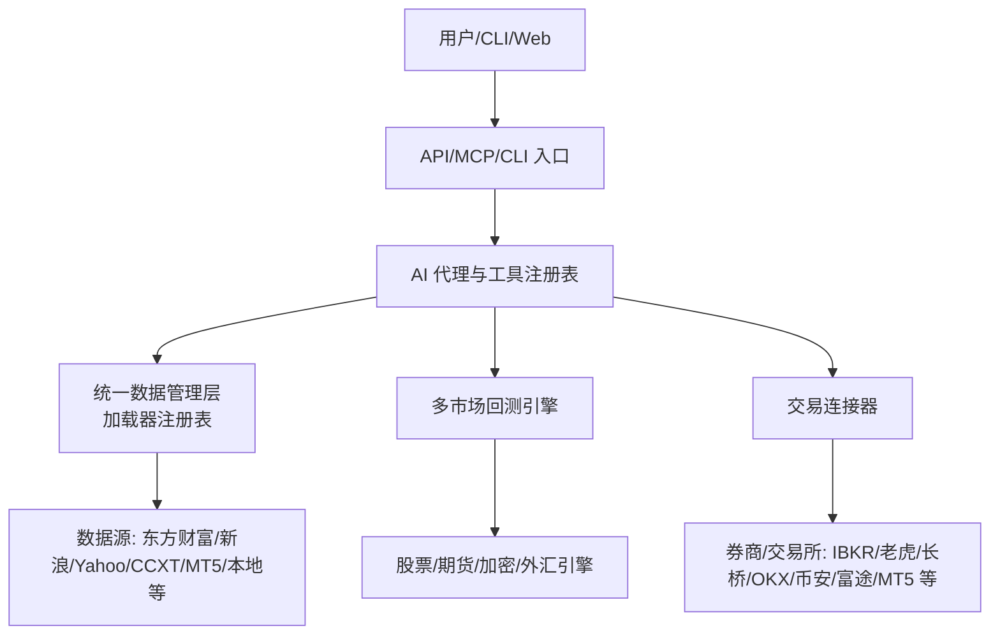
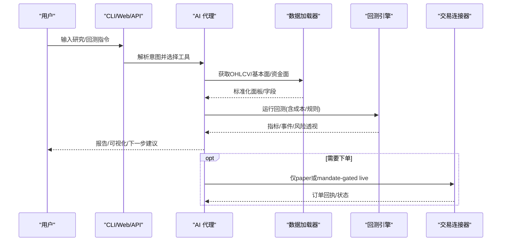
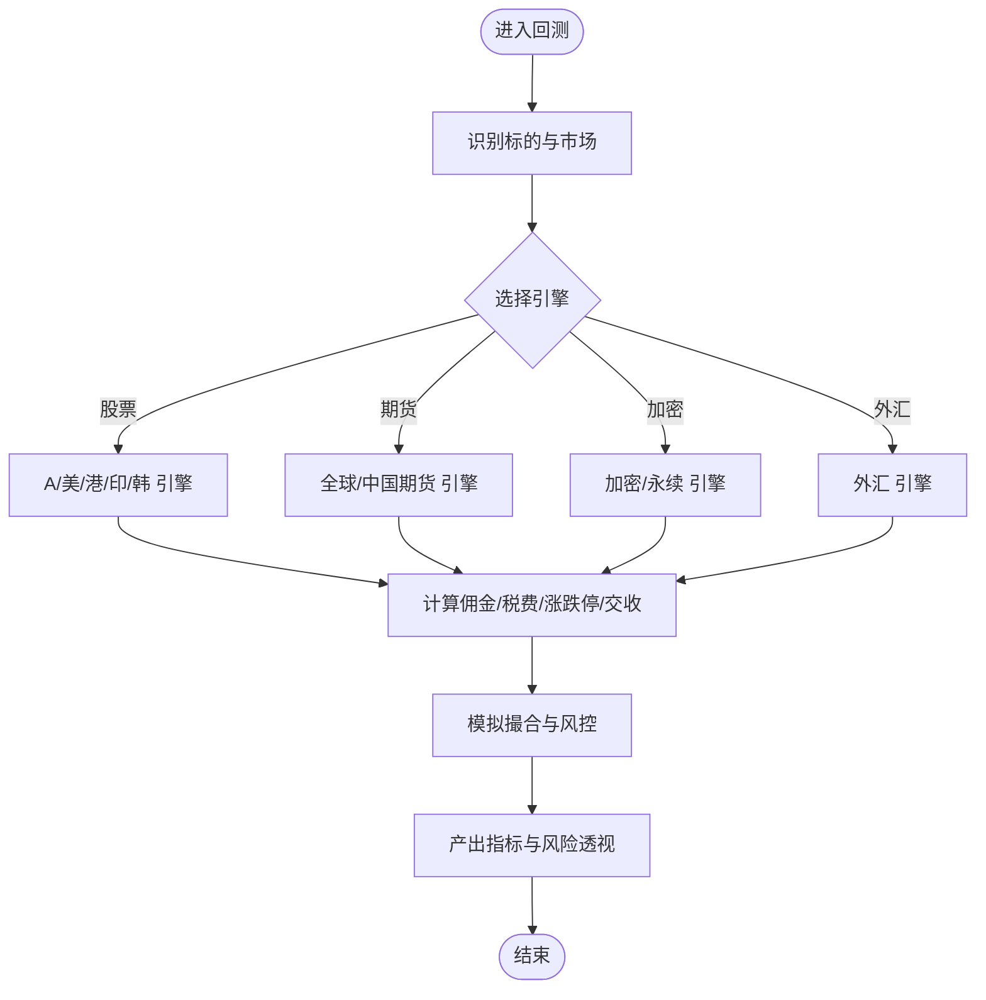
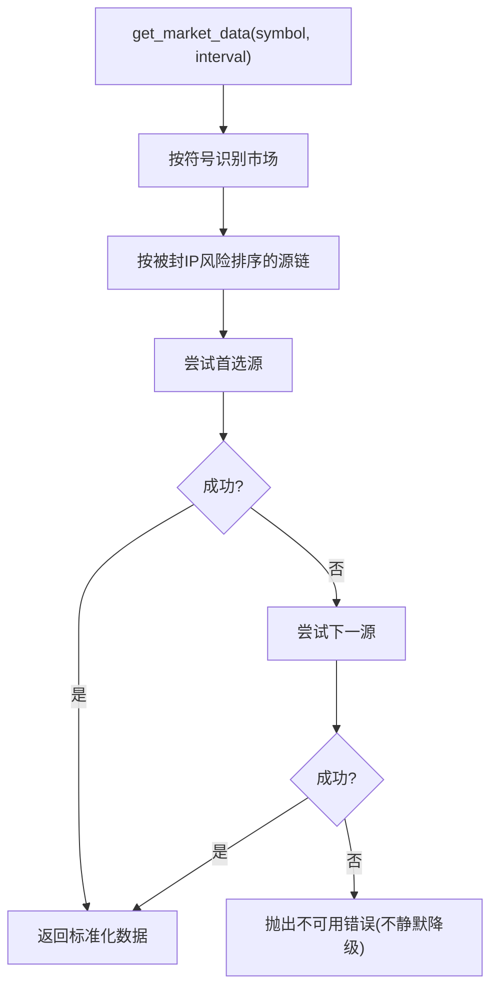
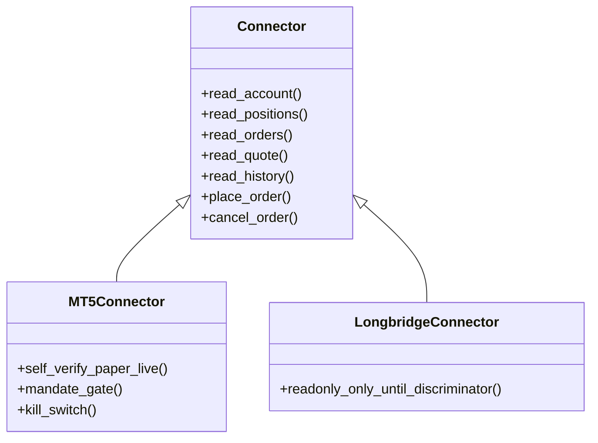
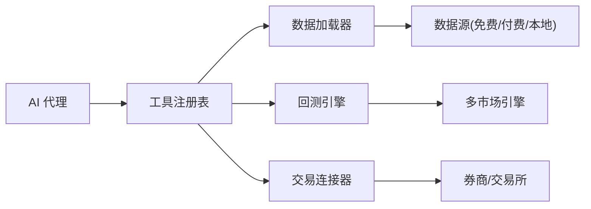

# 核心功能特性

<cite>
**本文引用的文件**
- [README_zh.md](file://README_zh.md)
- [loader_registry.py](file://agent/backtest/loaders/registry.py)
- [forex_engine.py](file://agent/backtest/engines/forex.py)
- [global_futures_engine_test.py](file://agent/tests/test_global_futures_engine.py)
- [mt5_connector_init.py](file://agent/src/trading/connectors/mt5/__init__.py)
- [longbridge_connector_init.py](file://agent/src/trading/connectors/longbridge/__init__.py)
- [market_detection_test.py](file://agent/tests/test_market_detection.py)
- [beginner_zh.html](file://wiki/tutorials/vibe-trading-beginner-zh.html)
</cite>

## 目录
1. [简介](#简介)
2. [项目结构](#项目结构)
3. [核心组件](#核心组件)
4. [架构总览](#架构总览)
5. [详细组件分析](#详细组件分析)
6. [依赖关系分析](#依赖关系分析)
7. [性能考量](#性能考量)
8. [故障排查指南](#故障排查指南)
9. [结论](#结论)
10. [附录](#附录)

## 简介
本文件聚焦 Vibe-Trading 平台的五大核心能力，面向不同背景的读者提供从价值到实现、从场景到指标的完整说明：
- AI 代理系统：以自然语言驱动研究、策略生成与回测闭环。
- 多市场回测引擎：覆盖股票、期货、加密货币、外汇等资产类别的差异化交易规则与成本模型。
- 统一数据管理层：集成 18+ 数据源，自动路由与降级，提供一致的数据访问接口。
- 交易连接器：对接 12 个主流券商与交易所，支持只读、模拟盘与受控实盘下单。
- 企业级安全：多层防护、审计追踪与合规边界，确保研究与交易的可靠性与可追溯性。

## 项目结构
平台采用分层模块化设计，关键目录职责如下：
- agent/backtest：回测引擎、加载器、优化器与指标体系。
- agent/src：AI 代理、工具注册、会话、配置、安全、量化库、交易连接器等。
- agent/cli：命令行入口与交互界面。
- frontend/desktop：Web 前端与桌面壳层。
- wiki：教程与文档站点。

**图表来源**
- [loader_registry.py:117-232](file://agent/backtest/loaders/registry.py#L117-L232)
- [forex_engine.py:1-40](file://agent/backtest/engines/forex.py#L1-L40)
- [beginner_zh.html:386-402](file://wiki/tutorials/vibe-trading-beginner-zh.html#L386-L402)

**章节来源**
- [beginner_zh.html:386-402](file://wiki/tutorials/vibe-trading-beginner-zh.html#L386-L402)

## 核心组件
- AI 代理系统：通过工具注册表暴露研究、数据、回测、连接器等能力；支持研究目标、工作流编排与结果归因。
- 多市场回测引擎：按市场类型选择引擎（A股、港股、美股、印度、韩国、全球期货、中国期货、加密、外汇、期权组合），内置滑点、佣金、涨跌停、保证金、资金费率等规则。
- 统一数据管理层：按符号自动识别市场并选择数据源，沿“被封 IP 风险”排序的链式 fallback；显式 local/qveris 不静默降级。
- 交易连接器：统一账户/持仓/订单/行情/历史/下单/撤单抽象；区分 readonly/paper/live，强制 mandate 与 kill switch。
- 企业级安全：AST 沙箱、路径守卫、CSRF/CORS、SSE 票据、审计账本、权限最小化与失败关闭策略。

**章节来源**
- [README_zh.md:338-401](file://README_zh.md#L338-L401)
- [loader_registry.py:117-232](file://agent/backtest/loaders/registry.py#L117-L232)
- [forex_engine.py:1-40](file://agent/backtest/engines/forex.py#L1-L40)
- [mt5_connector_init.py:1-14](file://agent/src/trading/connectors/mt5/__init__.py#L1-L14)
- [longbridge_connector_init.py:1-13](file://agent/src/trading/connectors/longbridge/__init__.py#L1-L13)

## 架构总览
下图展示一次“自然语言研究 → 信号引擎 → 回测 → 归因”的典型流程，以及数据与连接器的参与方式。

**图表来源**
- [loader_registry.py:117-232](file://agent/backtest/loaders/registry.py#L117-L232)
- [forex_engine.py:1-40](file://agent/backtest/engines/forex.py#L1-L40)
- [mt5_connector_init.py:1-14](file://agent/src/trading/connectors/mt5/__init__.py#L1-L14)
- [longbridge_connector_init.py:1-13](file://agent/src/trading/connectors/longbridge/__init__.py#L1-L13)

## 详细组件分析

### 1) AI 代理系统：基于自然语言的智能研究与策略开发
- 核心价值
  - 用自然语言完成“假设→研究→信号→回测→归因”的闭环，降低量化门槛。
  - 将复杂的多步骤任务拆解为可观测的工具调用，便于审计与复现。
- 技术实现
  - 工具注册表集中管理数据、回测、连接器、因子、研报等能力。
  - 支持研究目标（Goal）生命周期、定时研究、Swarm 多智能体协作。
  - 输出结构化进度与心跳，便于长时间任务的可观测性与中断恢复。
- 使用场景
  - 个股深度研究、宏观研判、加密链上分析、跨市场组合配置。
  - 自动生成信号引擎并跑回测，结合归因与风险透视评估策略稳健性。
- 示例与指标
  - 通过 CLI/Web 发起研究任务，查看工具轨迹、token 用量与 run card。
  - 关注“工具成功率、平均耗时、失败重试率、归因覆盖率”。

**章节来源**
- [README_zh.md:338-401](file://README_zh.md#L338-L401)
- [beginner_zh.html:386-402](file://wiki/tutorials/vibe-trading-beginner-zh.html#L386-L402)

### 2) 多市场回测引擎：覆盖股票、期货、加密、外汇等资产类别
- 核心价值
  - 不同市场具备不同交易规则与成本结构，引擎保证“信号到成交”的真实落地。
- 技术实现
  - 按市场类型路由至专用引擎：A股、港股、美股、印度、韩国、全球期货、中国期货、加密、外汇、期权组合。
  - 内置滑点、佣金、印花税、涨跌停、保证金、资金费率、强平、合约乘数等规则。
  - 组合回测支持跨市场统一资金池与分市场规则隔离。
- 使用场景
  - 策略在不同市场的鲁棒性验证；跨资产配置与对冲；衍生品策略收益情景分析。
- 示例与指标
  - 外汇引擎：标准手、点差、隔夜利息、杠杆；加密永续：资金费率、逐仓/全仓强平。
  - 关注“年化收益、最大回撤、换手率、冲击成本、强平次数、滑点占比”。

**图表来源**
- [forex_engine.py:1-40](file://agent/backtest/engines/forex.py#L1-L40)
- [global_futures_engine_test.py:1-55](file://agent/tests/test_global_futures_engine.py#L1-L55)
- [market_detection_test.py:67-92](file://agent/tests/test_market_detection.py#L67-L92)

**章节来源**
- [forex_engine.py:1-40](file://agent/backtest/engines/forex.py#L1-L40)
- [global_futures_engine_test.py:1-55](file://agent/tests/test_global_futures_engine.py#L1-L55)
- [market_detection_test.py:67-92](file://agent/tests/test_market_detection.py#L67-L92)

### 3) 统一数据管理层：集成 18+ 数据源，一致访问接口
- 核心价值
  - 屏蔽数据源差异与可用性波动，提供稳定一致的 OHLCV/基本面/资金面接口。
- 技术实现
  - 按符号自动识别市场，选择免费公开源优先，再沿“被封 IP 风险”顺序 fallback。
  - 显式 local/qveris 请求绝不静默降级到网络源，避免误用与数据污染。
  - 支持本地 CSV/Parquet/DuckDB 与付费 QVeris 扩展。
- 使用场景
  - 快速试跑、长期回测、离线研究、机构级数据接入。
- 示例与指标
  - 观察“可用源数量、fallback 次数、缺失补齐比例、缓存命中率”。

**图表来源**
- [loader_registry.py:117-232](file://agent/backtest/loaders/registry.py#L117-L232)

**章节来源**
- [loader_registry.py:117-232](file://agent/backtest/loaders/registry.py#L117-L232)
- [README_zh.md:338-401](file://README_zh.md#L338-L401)

### 4) 交易连接器：支持 12 个主流券商和交易所
- 核心价值
  - 统一账户、持仓、订单、行情、历史与下单/撤单能力，降低多券商接入复杂度。
- 技术实现
  - 连接器抽象 profile：readonly/paper/live；live 必须经过 mandate 授权、kill switch 与审计。
  - 部分券商无运行时 paper/live 区分，则默认纸交易 + 只读，直至具备可靠判别。
  - 支持 MT5、Longbridge、IBKR、Tiger、Alpaca、OKX、Binance、Futu 等。
- 使用场景
  - 策略在多家券商模拟盘验证；合规前提下进行有界实盘下单；实时账户与行情监控。
- 示例与指标
  - 关注“授权通过率、下单延迟、拒单原因、审计记录完整性、强平/熔断触发次数”。

**图表来源**
- [mt5_connector_init.py:1-14](file://agent/src/trading/connectors/mt5/__init__.py#L1-L14)
- [longbridge_connector_init.py:1-13](file://agent/src/trading/connectors/longbridge/__init__.py#L1-L13)

**章节来源**
- [mt5_connector_init.py:1-14](file://agent/src/trading/connectors/mt5/__init__.py#L1-L14)
- [longbridge_connector_init.py:1-13](file://agent/src/trading/connectors/longbridge/__init__.py#L1-L13)
- [beginner_zh.html:645-678](file://wiki/tutorials/vibe-trading-beginner-zh.html#L645-L678)

### 5) 企业级安全：多层防护与审计追踪
- 核心价值
  - 保障研究与交易过程的安全、可控、可审计，满足机构合规要求。
- 技术实现
  - AST 沙箱限制子进程/网络/危险函数；路径穿越防护；CSRF/CORS 加固。
  - SSE 短票据认证；敏感信息脱敏；审计账本哈希链防篡改。
  - 环境变量与凭据集中管理，最小权限原则。
- 使用场景
  - 远程部署、团队协作、监管审计、生产环境上线。
- 示例与指标
  - 关注“拦截率、告警数、审计记录完整性、失败关闭比例”。

**章节来源**
- [README_zh.md:61-1311](file://README_zh.md#L61-L1311)

## 依赖关系分析
- 数据层依赖：符号→市场→数据源链；local/qveris 不走网络 fallback。
- 回测层依赖：市场→引擎→成本/风控→指标；组合回测跨引擎协同。
- 连接器依赖：profile→券商/交易所；live 需 mandate/kill switch/审计。
- 代理层依赖：工具注册表→数据/回测/连接器；Swarm 多智能体协作。

**图表来源**
- [loader_registry.py:117-232](file://agent/backtest/loaders/registry.py#L117-L232)
- [forex_engine.py:1-40](file://agent/backtest/engines/forex.py#L1-L40)
- [mt5_connector_init.py:1-14](file://agent/src/trading/connectors/mt5/__init__.py#L1-L14)

**章节来源**
- [loader_registry.py:117-232](file://agent/backtest/loaders/registry.py#L117-L232)
- [forex_engine.py:1-40](file://agent/backtest/engines/forex.py#L1-L40)
- [mt5_connector_init.py:1-14](file://agent/src/trading/connectors/mt5/__init__.py#L1-L14)

## 性能考量
- 数据层
  - 启用可选本地缓存减少重复下载与限流影响；批量 loader 在缓存命中时跳过连接。
  - 周期规范化与严格校验减少无效请求与脏数据。
- 回测层
  - 向量化信号对齐、滚动因子加速；组合回测按市场并行与资源隔离。
  - 关注“CPU/内存峰值、I/O 吞吐、指标计算耗时”。
- 连接器
  - 连接池与快照报价提升并发稳定性；限流与重试策略保护下游服务。
  - 关注“下单延迟、重连次数、超时率”。
- 代理
  - 工具心跳与阶段进度提升长任务可观测性；失败快速退出与重试控制。
  - 关注“平均响应时间、失败重试率、资源占用”。

[本节为通用指导，无需特定文件引用]

## 故障排查指南
- 数据不可用
  - 检查符号是否被正确识别为市场；确认 fallback 链中各源可用性；显式 local/qveris 未配置时会快速失败。
- 回测异常
  - 核对市场规则（涨跌停、手续费、保证金、资金费率）；检查 OHLC 合法性与价格区间；关注强平与流动性事件。
- 连接器问题
  - 确认 profile 类型（readonly/paper/live）；live 下单需 mandate 授权与 kill switch；部分券商需先具备可靠的 paper/live 判别。
- 代理卡顿
  - 查看工具心跳与阶段进度；检查 LLM provider 流式健康；必要时重启会话或切换 provider。

**章节来源**
- [loader_registry.py:117-232](file://agent/backtest/loaders/registry.py#L117-L232)
- [forex_engine.py:1-40](file://agent/backtest/engines/forex.py#L1-L40)
- [mt5_connector_init.py:1-14](file://agent/src/trading/connectors/mt5/__init__.py#L1-L14)
- [longbridge_connector_init.py:1-13](file://agent/src/trading/connectors/longbridge/__init__.py#L1-L13)

## 结论
Vibe-Trading 通过“AI 代理 + 多市场回测 + 统一数据层 + 交易连接器 + 企业级安全”的体系化设计，将自然语言研究转化为可执行、可回测、可审计的交易能力。其核心价值在于：
- 低门槛高上限：自然语言即可驱动端到端研究。
- 真实落地：多市场引擎还原真实交易规则与成本。
- 稳定可靠：数据层自动路由与降级，连接器安全边界明确。
- 可审计可合规：全流程审计与多重防护，满足机构需求。

[本节为总结性内容，无需特定文件引用]

## 附录
- 快速上手
  - 使用 CLI/Web 发起研究或回测任务，查看工具轨迹与 run card。
  - 逐步从只读/模拟盘过渡到受控实盘，始终遵循 mandate 与 kill switch。
- 进阶实践
  - 组合回测与跨市场配置；引入基本面与资金面因子；使用 QVeris 扩展数据能力。
  - 结合 Swarm 多智能体进行团队化研究与策略迭代。

[本节为补充说明，无需特定文件引用]