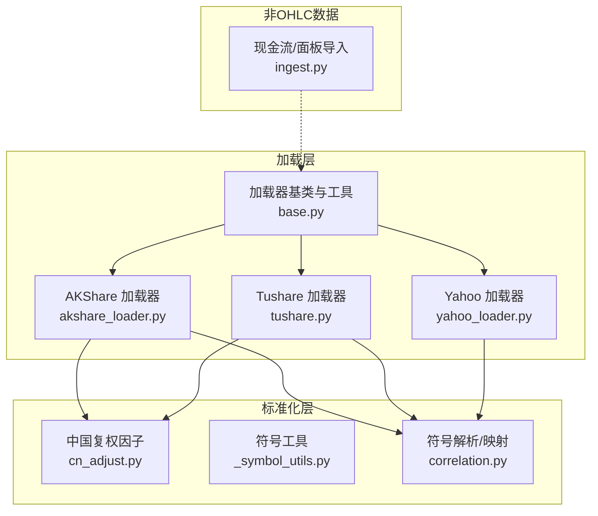
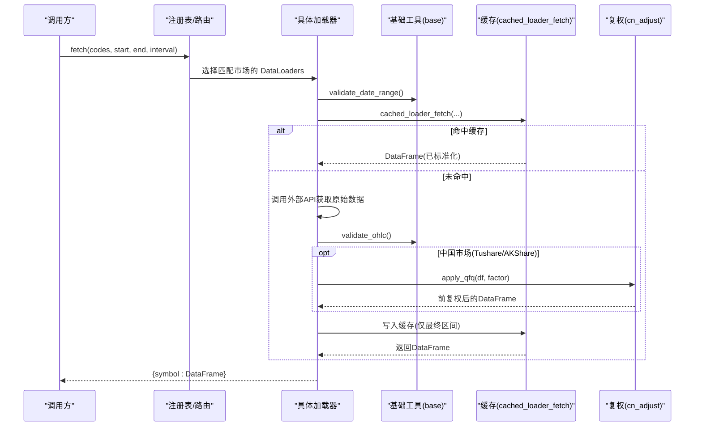
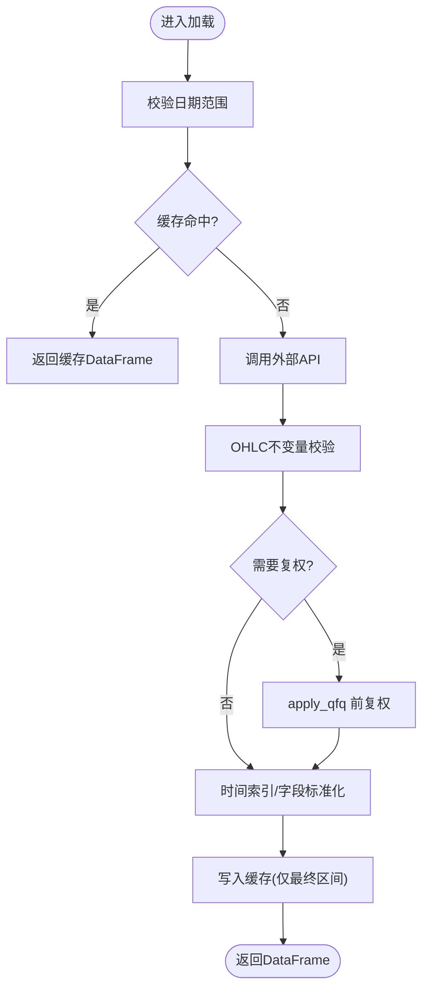
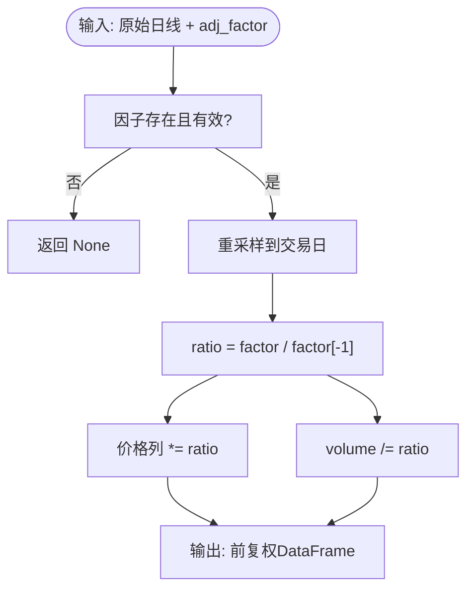
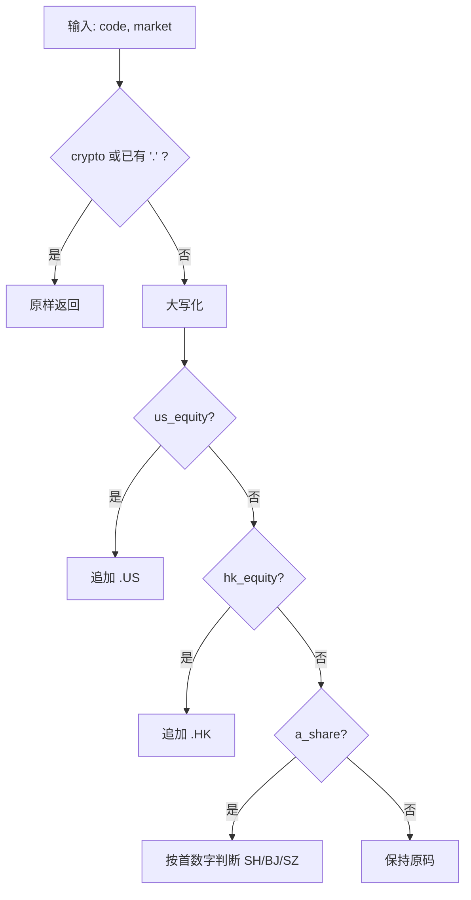
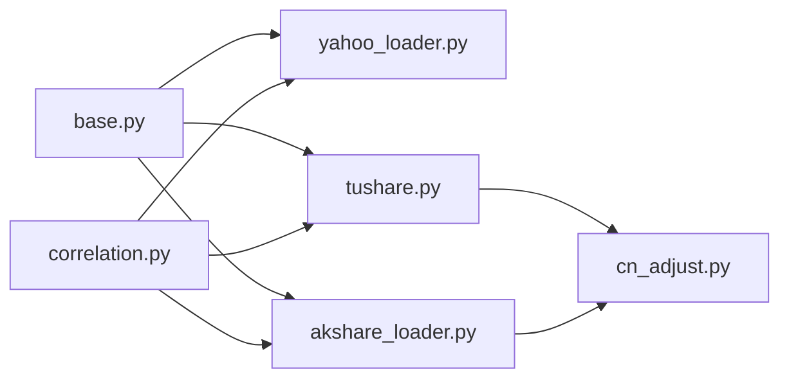

# 数据处理管道

<cite>
**本文引用的文件**
- [base.py](file://agent/backtest/loaders/base.py)
- [cn_adjust.py](file://agent/backtest/loaders/cn_adjust.py)
- [_symbol_utils.py](file://agent/backtest/loaders/_symbol_utils.py)
- [yahoo_loader.py](file://agent/backtest/loaders/yahoo_loader.py)
- [tushare.py](file://agent/backtest/loaders/tushare.py)
- [akshare_loader.py](file://agent/backtest/loaders/akshare_loader.py)
- [ingest.py](file://agent/src/entities/ingest.py)
- [correlation.py](file://agent/backtest/correlation.py)
</cite>

## 目录
1. [简介](#简介)
2. [项目结构](#项目结构)
3. [核心组件](#核心组件)
4. [架构总览](#架构总览)
5. [详细组件分析](#详细组件分析)
6. [依赖关系分析](#依赖关系分析)
7. [性能考虑](#性能考虑)
8. [故障排查指南](#故障排查指南)
9. [结论](#结论)
10. [附录：使用示例](#附录使用示例)

## 简介
本文件面向 Vibe-Trading 的数据处理管道，聚焦于“数据摄入—清洗转换—标准化输出”的端到端流程。文档重点覆盖：
- 原始数据获取：多来源（A 股、美股、港股、加密货币、外汇等）统一接入与路由
- 清洗与标准化：OHLC 校验、时间索引对齐、字段归一化、复权因子应用（中国市场特殊处理）
- 符号解析与映射：跨市场股票代码的统一规范（如 AAPL.US、0700.HK、600000.SH）
- 批量优化：并行/重试/预算控制、本地缓存、内存友好写入
- 质量监控：统计与异常检测思路、可观测性建议
- 实际使用示例：从不同来源拉取并转换为统一格式

## 项目结构
数据处理管道主要由以下模块构成：
- 加载器协议与通用工具：定义 DataLoader 协议、日期/OHLC 校验、重试与预算、本地缓存
- 市场特定加载器：Yahoo Finance、Tushare、AKShare 等
- 中国 A 股复权：前复权因子计算与应用
- 非 OHLC 实体面板：现金流与面板数据的稳健导入
- 符号解析：统一符号到各加载器期望形式

图表来源
- [base.py:1-645](file://agent/backtest/loaders/base.py#L1-L645)
- [cn_adjust.py:1-78](file://agent/backtest/loaders/cn_adjust.py#L1-L78)
- [_symbol_utils.py:1-21](file://agent/backtest/loaders/_symbol_utils.py#L1-L21)
- [yahoo_loader.py:1-200](file://agent/backtest/loaders/yahoo_loader.py#L1-L200)
- [tushare.py:1-200](file://agent/backtest/loaders/tushare.py#L1-L200)
- [akshare_loader.py:1-200](file://agent/backtest/loaders/akshare_loader.py#L1-L200)
- [correlation.py:57-93](file://agent/backtest/correlation.py#L57-L93)
- [ingest.py:1-800](file://agent/src/entities/ingest.py#L1-L800)

章节来源
- [base.py:1-645](file://agent/backtest/loaders/base.py#L1-L645)
- [cn_adjust.py:1-78](file://agent/backtest/loaders/cn_adjust.py#L1-L78)
- [_symbol_utils.py:1-21](file://agent/backtest/loaders/_symbol_utils.py#L1-L21)
- [yahoo_loader.py:1-200](file://agent/backtest/loaders/yahoo_loader.py#L1-L200)
- [tushare.py:1-200](file://agent/backtest/loaders/tushare.py#L1-L200)
- [akshare_loader.py:1-200](file://agent/backtest/loaders/akshare_loader.py#L1-L200)
- [correlation.py:57-93](file://agent/backtest/correlation.py#L57-L93)
- [ingest.py:1-800](file://agent/src/entities/ingest.py#L1-L800)

## 核心组件
- 加载器协议与通用能力
  - DataLoaderProtocol：统一接口 name/markets/requires_auth/is_available/fetch
  - 日期范围校验 validate_date_range
  - OHLC 不变量校验 validate_ohlc（结构性与正负价格策略）
  - 重试与预算：retry_with_budget、check_budget
  - 本地缓存：loader_cache_*、cached_loader_fetch（基于 parquet + duckdb，原子写入）
- 市场特定加载器
  - Yahoo：美股/港股/加拿大等，区间映射、日内/日频时间索引规范化
  - Tushare：A 股/港股/期货/基金，分钟级支持，配额限流退避
  - AKShare：A 股/美股/港股/外汇/宏观，ETF 识别与每日条带
- 中国复权因子
  - apply_qfq：将 Tushare 未复权日线按 adj_factor 前复权，同步调整 volume，保持 amount 不变
- 符号解析与映射
  - _normalize_symbol：将裸代码映射为 .US/.HK/.SH/.SZ/.BJ 等规范形式
  - ETF/LOF 前缀识别：_is_etf_listed

章节来源
- [base.py:27-120](file://agent/backtest/loaders/base.py#L27-L120)
- [base.py:163-236](file://agent/backtest/loaders/base.py#L163-L236)
- [base.py:243-439](file://agent/backtest/loaders/base.py#L243-L439)
- [cn_adjust.py:27-78](file://agent/backtest/loaders/cn_adjust.py#L27-L78)
- [yahoo_loader.py:31-106](file://agent/backtest/loaders/yahoo_loader.py#L31-L106)
- [tushare.py:18-80](file://agent/backtest/loaders/tushare.py#L18-L80)
- [akshare_loader.py:20-72](file://agent/backtest/loaders/akshare_loader.py#L20-L72)
- [_symbol_utils.py:12-21](file://agent/backtest/loaders/_symbol_utils.py#L12-L21)
- [correlation.py:57-93](file://agent/backtest/correlation.py#L57-L93)

## 架构总览
下图展示从“用户请求”到“标准化 DataFrame”的调用链，以及关键的质量控制点（日期校验、OHLC 校验、复权、缓存）。

图表来源
- [base.py:163-236](file://agent/backtest/loaders/base.py#L163-L236)
- [base.py:243-439](file://agent/backtest/loaders/base.py#L243-L439)
- [cn_adjust.py:27-78](file://agent/backtest/loaders/cn_adjust.py#L27-L78)
- [tushare.py:139-200](file://agent/backtest/loaders/tushare.py#L139-L200)
- [akshare_loader.py:93-156](file://agent/backtest/loaders/akshare_loader.py#L93-L156)
- [yahoo_loader.py:125-170](file://agent/backtest/loaders/yahoo_loader.py#L125-L170)

## 详细组件分析

### 组件A：数据加载器协议与通用工具
- 职责
  - 定义统一的 DataLoader 协议，约束 name/markets/requires_auth/is_available/fetch
  - 提供日期范围校验、OHLC 不变量校验、重试/预算、本地缓存
- 关键设计
  - validate_ohlc：对 high < low、open/close 不在 [low,high]、非正价格等进行结构化检查；支持 drop/warn/raise 策略
  - retry_with_budget：针对瞬态错误进行有限重试，受 wall-clock 截止期约束
  - loader_cache_*：以内容寻址生成 key，parquet + duckdb 读写，元数据保存 index 名称与 dtype，原子替换避免并发写冲突
- 复杂度与性能
  - 缓存键 O(k)（k 为参数长度），parquet 读写接近 I/O 线性
  - 重试退避固定步长，整体耗时受 budget 限制
- 错误处理
  - 缓存读/写失败均被吞掉，保证 fetch 主路径不失败
  - OHLC 校验失败可按策略丢弃或抛错

图表来源
- [base.py:31-120](file://agent/backtest/loaders/base.py#L31-L120)
- [base.py:243-439](file://agent/backtest/loaders/base.py#L243-L439)
- [cn_adjust.py:27-78](file://agent/backtest/loaders/cn_adjust.py#L27-L78)

章节来源
- [base.py:27-120](file://agent/backtest/loaders/base.py#L27-L120)
- [base.py:163-236](file://agent/backtest/loaders/base.py#L163-L236)
- [base.py:243-439](file://agent/backtest/loaders/base.py#L243-L439)

### 组件B：中国市场复权因子（前复权）
- 职责
  - 将 Tushare 未复权日线按 adj_factor 前复权，使除权日的机械跳空消除
- 算法要点
  - 读取 adj_factor 序列，重采样至交易日期，ffill/bfill
  - ratio = factor / factor[-1]，对 open/high/low/close 乘以 ratio，volume 除以 ratio，amount 保持不变
  - 若因子缺失或含非正值，返回 None（由上层丢弃该标的）
- 复杂度
  - 线性于交易日数，向量化操作高效
- 错误处理
  - 因子不可用直接返回 None，避免污染收益序列

图表来源
- [cn_adjust.py:27-78](file://agent/backtest/loaders/cn_adjust.py#L27-L78)

章节来源
- [cn_adjust.py:27-78](file://agent/backtest/loaders/cn_adjust.py#L27-L78)

### 组件C：符号解析与映射（多市场统一）
- 职责
  - 将用户输入的裸代码转换为各加载器期望的规范符号（如 AAPL.US、0700.HK、600000.SH/SZ/BJ）
- 规则
  - crypto 与已带交易所后缀的符号透传
  - us_equity -> .US；hk_equity -> .HK；a_share 根据首数字判断 SH/BJ/SZ
- 作用
  - 确保下游加载器能正确路由到对应市场与接口

图表来源
- [correlation.py:57-93](file://agent/backtest/correlation.py#L57-L93)

章节来源
- [correlation.py:57-93](file://agent/backtest/correlation.py#L57-L93)

### 组件D：Yahoo 加载器（全球权益）
- 职责
  - 通过公开图表接口获取美股/港股/加拿大等 OHLCV
  - 区间映射（1D/1H/4H→1h/1W/1M），日内/日频时间索引规范化
- 关键点
  - 支持多种 interval 别名，分钟/小时保留真实时间戳，日及以上归一到午夜
  - 构建 DataFrame 时补齐缺失列、数值转换、裁剪到包含式日期窗口
- 性能
  - 复用进程级节流会话，降低 IP 限流风险

章节来源
- [yahoo_loader.py:1-200](file://agent/backtest/loaders/yahoo_loader.py#L1-L200)

### 组件E：Tushare 加载器（A 股/港股/期货/基金）
- 职责
  - 通过 Tushare Pro 获取 A 股/港股/期货/基金 OHLCV，支持分钟级
  - 合并基本面字段（可选），走本地缓存
- 关键点
  - 配额限流识别与退避（每分钟/每天/频率等关键词）
  - 日线与分钟线分流逻辑
  - 结合 cn_adjust 进行前复权（在后续步骤中）

章节来源
- [tushare.py:1-200](file://agent/backtest/loaders/tushare.py#L1-L200)

### 组件F：AKShare 加载器（A 股/美股/港股/外汇/宏观）
- 职责
  - 免费无鉴权聚合数据，覆盖 A 股/美股/港股/外汇/宏观等
  - ETF/LOF 识别优先于 A 股分支
- 关键点
  - 仅支持日频（部分市场），interval 校验严格
  - 外汇符号通过 symbol_market_map 识别，避免误入 A 股分支

章节来源
- [akshare_loader.py:1-200](file://agent/backtest/loaders/akshare_loader.py#L1-L200)

### 组件G：非 OHLC 实体面板（现金流/指标面板）
- 职责
  - 将不规则时间序列的现金流文件与实体×日期×指标面板文件安全导入
  - 严格的列名映射、货币/单位必填、日期格式强制 ISO-8601（除非显式声明）
- 关键点
  - 拒绝猜测：歧义小数分隔符、日期格式必须显式声明
  - 保留未映射列为 metadata，便于溯源
  - 面板布局自动推断（long / wide_dates_rows / wide_entities_rows）

章节来源
- [ingest.py:1-800](file://agent/src/entities/ingest.py#L1-L800)

## 依赖关系分析
- 耦合度
  - 加载器强依赖 base 提供的校验、重试、缓存；中国市场加载器额外依赖 cn_adjust
  - 符号解析位于 correlation，供上层路由使用
- 外部依赖
  - Tushare Pro API（需 token）
  - Yahoo 公开图表接口（无鉴权）
  - AKShare（无鉴权）
  - DuckDB（用于 parquet 缓存读写）
- 潜在循环
  - 当前模块间单向依赖，未见循环引用

图表来源
- [base.py:1-645](file://agent/backtest/loaders/base.py#L1-L645)
- [cn_adjust.py:1-78](file://agent/backtest/loaders/cn_adjust.py#L1-L78)
- [yahoo_loader.py:1-200](file://agent/backtest/loaders/yahoo_loader.py#L1-L200)
- [tushare.py:1-200](file://agent/backtest/loaders/tushare.py#L1-L200)
- [akshare_loader.py:1-200](file://agent/backtest/loaders/akshare_loader.py#L1-L200)
- [correlation.py:57-93](file://agent/backtest/correlation.py#L57-L93)

章节来源
- [base.py:1-645](file://agent/backtest/loaders/base.py#L1-L645)
- [cn_adjust.py:1-78](file://agent/backtest/loaders/cn_adjust.py#L1-L78)
- [yahoo_loader.py:1-200](file://agent/backtest/loaders/yahoo_loader.py#L1-L200)
- [tushare.py:1-200](file://agent/backtest/loaders/tushare.py#L1-L200)
- [akshare_loader.py:1-200](file://agent/backtest/loaders/akshare_loader.py#L1-L200)
- [correlation.py:57-93](file://agent/backtest/correlation.py#L57-L93)

## 性能考虑
- 本地缓存
  - 仅对“已结算区间”（end_date 早于今日）缓存，避免缓存未完成 K 线
  - 使用 parquet + duckdb 快速读写，元数据记录 index 名称与 dtype，保障往返一致性
  - 原子写入（临时文件 + os.replace）避免并发竞争
- 重试与预算
  - 对瞬态错误采用指数型退避，受 wall-clock 截止期限制，防止长时间阻塞
- 内存管理
  - 逐标的拉取+缓存，避免一次性加载全部数据
  - 数值列 coerce 转换与 dropna 减少无效行
- 建议
  - 大批量任务开启缓存，合理设置预算与重试次数
  - 对高频分钟级数据谨慎使用缓存，关注磁盘空间

[本节为通用指导，不直接分析具体文件]

## 故障排查指南
- 常见错误与定位
  - 日期范围非法：validate_date_range 抛出 ValueError，检查 start/end 格式与大小关系
  - OHLC 异常：validate_ohlc 按策略丢弃/警告/抛错，确认数据源是否可靠
  - 配额限流（Tushare）：识别限流关键字并退避，适当降低并发或延长间隔
  - 复权因子缺失：apply_qfq 返回 None，导致标的被丢弃，检查 Tushare 权限与因子可用性
  - 缓存异常：读/写失败被吞掉并回退到在线获取，检查磁盘权限与 DuckDB 安装
- 诊断建议
  - 打开日志观察 OHLC 校验告警、限流退避、缓存命中/未命中
  - 对异常标的单独拉取最小样本验证
  - 对现金流/面板导入，检查列映射、货币/单位、日期格式

章节来源
- [base.py:31-120](file://agent/backtest/loaders/base.py#L31-L120)
- [base.py:163-236](file://agent/backtest/loaders/base.py#L163-L236)
- [base.py:243-439](file://agent/backtest/loaders/base.py#L243-L439)
- [tushare.py:18-80](file://agent/backtest/loaders/tushare.py#L18-L80)
- [cn_adjust.py:27-78](file://agent/backtest/loaders/cn_adjust.py#L27-L78)
- [ingest.py:316-486](file://agent/src/entities/ingest.py#L316-L486)

## 结论
Vibe-Trading 的数据处理管道通过统一的加载器协议、严格的校验与复权机制、以及健壮的本地缓存与重试策略，实现了跨市场、多来源数据的稳定摄入与标准化。中国市场的前复权处理消除了除权日的机械跳空，保证了收益序列的正确性。对于大规模批量处理，建议充分利用缓存与预算控制，并结合日志与质量监控持续优化。

[本节为总结，不直接分析具体文件]

## 附录：使用示例
以下为典型工作流说明（不展示代码片段，仅提供路径参考）：
- 示例1：拉取 A 股日线并前复权
  - 步骤：选择 tushare 加载器 → 校验日期 → 拉取日线 → 合并基本面（可选）→ 应用前复权 → 写入缓存
  - 参考路径：[tushare.py:139-200](file://agent/backtest/loaders/tushare.py#L139-L200)、[cn_adjust.py:27-78](file://agent/backtest/loaders/cn_adjust.py#L27-L78)
- 示例2：拉取美股/港股日线
  - 步骤：选择 yahoo 加载器 → 区间映射 → 构建 DataFrame → 标准化时间索引 → 校验 OHLC
  - 参考路径：[yahoo_loader.py:125-170](file://agent/backtest/loaders/yahoo_loader.py#L125-L170)
- 示例3：拉取 A 股/美股/港股/外汇（AKShare）
  - 步骤：识别市场类型（ETF/A 股/美股/港股/外汇）→ 调用对应接口 → 标准化列与日期
  - 参考路径：[akshare_loader.py:93-156](file://agent/backtest/loaders/akshare_loader.py#L93-L156)
- 示例4：导入现金流/面板文件
  - 步骤：指定列映射/货币/单位/日期格式 → 解析金额与日期 → 组装 CashFlowSeries/EntityPanel
  - 参考路径：[ingest.py:316-486](file://agent/src/entities/ingest.py#L316-L486)、[ingest.py:694-800](file://agent/src/entities/ingest.py#L694-L800)

[本节为使用指引，不直接分析具体文件]