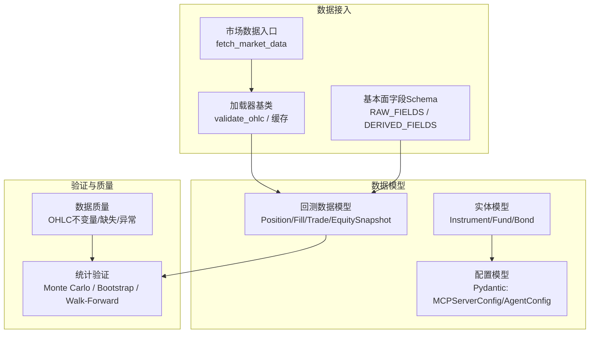
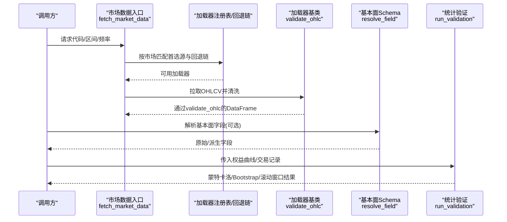
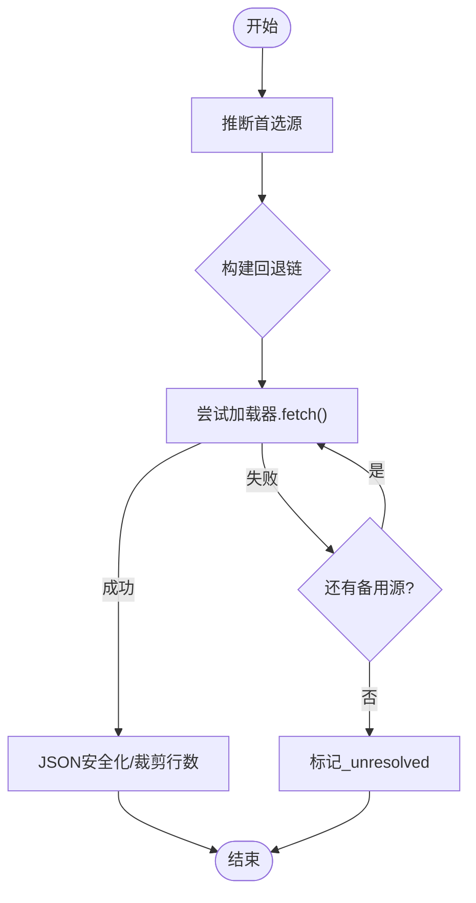
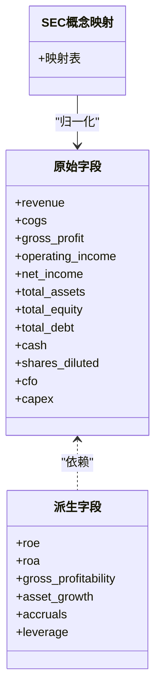
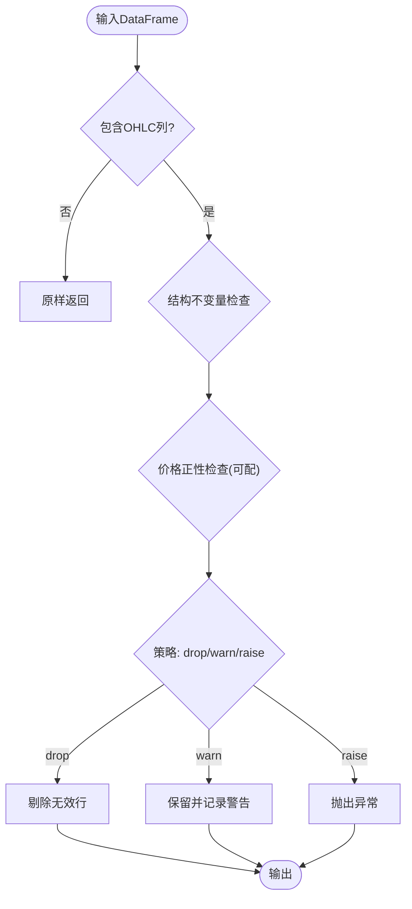
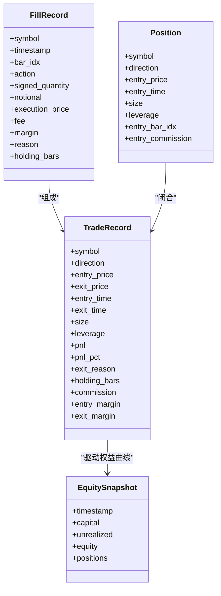
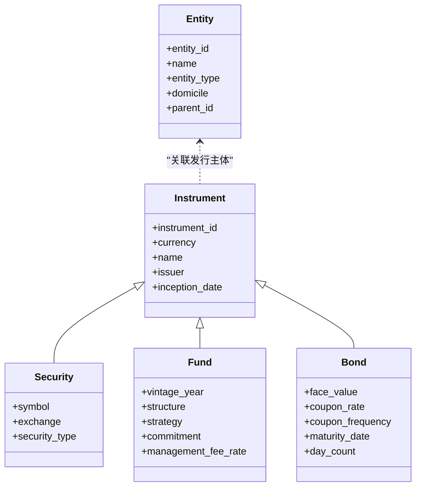
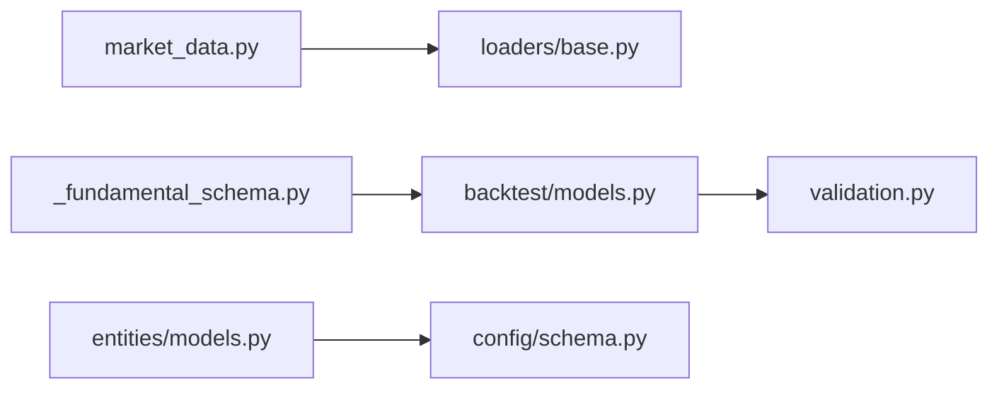

# 数据模型与验证

<cite>
**本文引用的文件**
- [agent/backtest/models.py](file://agent/backtest/models.py)
- [agent/backtest/loaders/_fundamental_schema.py](file://agent/backtest/loaders/_fundamental_schema.py)
- [agent/backtest/loaders/base.py](file://agent/backtest/loaders/base.py)
- [agent/src/market_data.py](file://agent/src/market_data.py)
- [agent/backtest/validation.py](file://agent/backtest/validation.py)
- [agent/src/entities/models.py](file://agent/src/entities/models.py)
- [agent/src/config/schema.py](file://agent/src/config/schema.py)
</cite>

## 目录
1. [简介](#简介)
2. [项目结构](#项目结构)
3. [核心组件](#核心组件)
4. [架构总览](#架构总览)
5. [详细组件分析](#详细组件分析)
6. [依赖关系分析](#依赖关系分析)
7. [性能考量](#性能考量)
8. [故障排查指南](#故障排查指南)
9. [结论](#结论)
10. [附录：使用示例](#附录使用示例)

## 简介
本文件聚焦 Vibe-Trading 的数据模型与验证系统，围绕以下目标展开：
- 核心数据模型设计：MarketData、FundamentalData、TimeSeries 的结构定义与职责边界。
- Pydantic 模型验证规则：数据类型检查、业务规则校验与异常处理策略。
- 财务数据模式：资产负债表、利润表、现金流量表的字段规范与派生指标。
- 数据质量检查：缺失值检测、异常值识别、数据一致性验证。
- 数据转换管道：格式标准化、单位换算、时间序列对齐。
- 实际使用示例：如何定义新数据模型并执行数据验证。

## 项目结构
本项目将“市场数据”“基本面数据”“回测/验证”“实体与配置”分层组织：
- 市场数据层：统一通过加载器（Loader）获取 OHLCV，支持多源自动回退与行级裁剪。
- 基本面数据层：以统一字段 Schema 映射 SEC XBRL 概念，提供原始与派生字段。
- 回测与验证：对交易结果进行统计检验（蒙特卡洛、Bootstrap、滚动窗口）。
- 实体与配置：非价格型资产（基金、债券等）的强类型实体；MCP/Agent 配置的 Pydantic 校验。

图表来源
- [agent/src/market_data.py:97-223](file://agent/src/market_data.py#L97-L223)
- [agent/backtest/loaders/base.py:31-119](file://agent/backtest/loaders/base.py#L31-L119)
- [agent/backtest/loaders/_fundamental_schema.py:28-189](file://agent/backtest/loaders/_fundamental_schema.py#L28-L189)
- [agent/backtest/models.py:13-118](file://agent/backtest/models.py#L13-L118)
- [agent/src/entities/models.py:141-397](file://agent/src/entities/models.py#L141-L397)
- [agent/src/config/schema.py:301-513](file://agent/src/config/schema.py#L301-L513)
- [agent/backtest/validation.py:29-341](file://agent/backtest/validation.py#L29-L341)

章节来源
- [agent/src/market_data.py:97-223](file://agent/src/market_data.py#L97-L223)
- [agent/backtest/loaders/base.py:31-119](file://agent/backtest/loaders/base.py#L31-L119)
- [agent/backtest/loaders/_fundamental_schema.py:28-189](file://agent/backtest/loaders/_fundamental_schema.py#L28-L189)
- [agent/backtest/models.py:13-118](file://agent/backtest/models.py#L13-L118)
- [agent/src/entities/models.py:141-397](file://agent/src/entities/models.py#L141-L397)
- [agent/src/config/schema.py:301-513](file://agent/src/config/schema.py#L301-L513)
- [agent/backtest/validation.py:29-341](file://agent/backtest/validation.py#L29-L341)

## 核心组件
- MarketData（市场数据）：通过统一入口 fetch_market_data 聚合多源加载器，按市场自动选择首选源并支持回退链；返回标准化 OHLCV 记录，支持最大行数裁剪与来源溯源。
- FundamentalData（基本面数据）：以 RAW_FIELDS 与 DERIVED_FIELDS 定义统一字段族，SEC_CONCEPT_MAP 将稀疏 SEC 事实映射到标准字段；派生字段通过依赖计算得到。
- TimeSeries（时间序列）：由加载器产出的 DataFrame（日期索引 + OHLCV 列）构成；在加载器边界通过 validate_ohlc 保证结构一致性与数值合理性。
- 回测数据模型：Position、FillRecord、TradeRecord、EquitySnapshot 描述头寸、成交、完整交易与权益快照，作为回测与验证的输入。
- 实体与配置：Instrument/Fund/Bond 等实体用于非价格现金流资产；MCPServerConfig/AgentConfig 等 Pydantic 模型负责配置安全与约束。

章节来源
- [agent/src/market_data.py:97-223](file://agent/src/market_data.py#L97-L223)
- [agent/backtest/loaders/_fundamental_schema.py:28-189](file://agent/backtest/loaders/_fundamental_schema.py#L28-L189)
- [agent/backtest/loaders/base.py:50-119](file://agent/backtest/loaders/base.py#L50-L119)
- [agent/backtest/models.py:13-118](file://agent/backtest/models.py#L13-L118)
- [agent/src/entities/models.py:141-397](file://agent/src/entities/models.py#L141-L397)
- [agent/src/config/schema.py:301-513](file://agent/src/config/schema.py#L301-L513)

## 架构总览
下图展示从数据接入到验证输出的端到端流程，包括数据清洗、模型化与统计检验。

图表来源
- [agent/src/market_data.py:97-223](file://agent/src/market_data.py#L97-L223)
- [agent/backtest/loaders/base.py:50-119](file://agent/backtest/loaders/base.py#L50-L119)
- [agent/backtest/loaders/_fundamental_schema.py:196-217](file://agent/backtest/loaders/_fundamental_schema.py#L196-L217)
- [agent/backtest/validation.py:286-341](file://agent/backtest/validation.py#L286-L341)

## 详细组件分析

### 市场数据（MarketData）
- 功能要点
  - 自动源选择：根据符号模式推断首选源（如 US/HK/A股/加密货币/外汇），并按市场回退链尝试。
  - 数据裁剪：每标的限制返回行数，避免工具负载过大。
  - 来源溯源：可输出使用的源、是否发生回退、货币换算标记等。
- 关键路径
  - detect_source -> get_loader_cls_with_fallback -> loader.fetch -> cap_rows -> _json_safe
- 错误与健壮性
  - 加载器不可用或失败时记录日志并切换到下一源；超过最大重试次数后标记为未解析。

图表来源
- [agent/src/market_data.py:51-84](file://agent/src/market_data.py#L51-L84)
- [agent/src/market_data.py:97-223](file://agent/src/market_data.py#L97-L223)

章节来源
- [agent/src/market_data.py:51-84](file://agent/src/market_data.py#L51-L84)
- [agent/src/market_data.py:97-223](file://agent/src/market_data.py#L97-L223)

### 基本面数据（FundamentalData）
- 字段体系
  - 原始字段（RAW_FIELDS）：收入、成本、毛利、营业利润、净利润、总资产、总权益、总债务、现金、稀释股本、经营现金流、资本支出等。
  - 派生字段（DERIVED_FIELDS）：ROE、ROA、毛利率/资产比、资产增长率、应计项、杠杆等，基于依赖字段计算。
  - SEC 概念映射（SEC_CONCEPT_MAP）：将不同公司披露的概念名归一到统一字段，优先顺序保障 PIT 安全。
- 解析与计算
  - resolve_field 将字段名解析为原始或派生规格；派生字段通过 compute 函数在依赖就绪后计算。
- 数据质量
  - 安全除法：分母为零时返回 NaN，避免除零污染下游指标。

图表来源
- [agent/backtest/loaders/_fundamental_schema.py:28-189](file://agent/backtest/loaders/_fundamental_schema.py#L28-L189)
- [agent/backtest/loaders/_fundamental_schema.py:196-217](file://agent/backtest/loaders/_fundamental_schema.py#L196-L217)

章节来源
- [agent/backtest/loaders/_fundamental_schema.py:28-189](file://agent/backtest/loaders/_fundamental_schema.py#L28-L189)
- [agent/backtest/loaders/_fundamental_schema.py:196-217](file://agent/backtest/loaders/_fundamental_schema.py#L196-L217)

### 时间序列（TimeSeries）与数据质量
- 时间序列形态
  - 由加载器产出带日期索引的 DataFrame，包含 open/high/low/close/volume 等列。
- 数据质量检查
  - validate_ohlc：强制结构不变量（high>=open/close, low<=open/close），拒绝非正价格（可配置允许负价场景），支持 drop/warn/raise 策略。
  - 缺失值：加载器内部先 dropna，再由 validate_ohlc 清理结构性脏条。
  - 异常值：通过不变量与阈值策略过滤，确保下游 JSON 序列化严格（无 NaN/Inf）。

图表来源
- [agent/backtest/loaders/base.py:50-119](file://agent/backtest/loaders/base.py#L50-L119)

章节来源
- [agent/backtest/loaders/base.py:50-119](file://agent/backtest/loaders/base.py#L50-L119)

### 回测数据模型（Position/Fill/Trade/EquitySnapshot）
- 角色与职责
  - Position：单一标的持仓状态（方向、入场价、时间、规模、杠杆、佣金等）。
  - FillRecord：单笔成交证据（数量、名义价值、费用、保证金、原因等）。
  - TradeRecord：完整往返交易（进出场价/时间、盈亏、持有期、手续费等）。
  - EquitySnapshot：某时刻组合状态（资金、浮盈、权益、持仓数）。
- 用途
  - 作为回测引擎与统计验证的输入，保证不可变性与可追溯性。

图表来源
- [agent/backtest/models.py:13-118](file://agent/backtest/models.py#L13-L118)

章节来源
- [agent/backtest/models.py:13-118](file://agent/backtest/models.py#L13-L118)

### 实体与配置（非价格资产与Pydantic校验）
- 实体模型
  - Instrument/Fund/Bond：描述非价格现金流资产，强制币种、日期规范化与范围校验（如面值>0、费率[0,1]、到期日不早于成立日等）。
- Pydantic 配置
  - MCPServerConfig/AgentConfig：对传输方式、OAuth、工具白名单等进行严格校验，防止危险配置（如在线券商通配符白名单）。

图表来源
- [agent/src/entities/models.py:141-397](file://agent/src/entities/models.py#L141-L397)
- [agent/src/config/schema.py:301-513](file://agent/src/config/schema.py#L301-L513)

章节来源
- [agent/src/entities/models.py:141-397](file://agent/src/entities/models.py#L141-L397)
- [agent/src/config/schema.py:301-513](file://agent/src/config/schema.py#L301-L513)

## 依赖关系分析
- 市场数据入口依赖加载器注册表与回退链，最终产出标准化 DataFrame。
- 基本面数据依赖 SEC 概念映射与派生计算逻辑，产出统一字段面板。
- 回测数据模型被统计验证模块消费，生成蒙特卡洛、Bootstrap、滚动窗口结果。
- 实体与配置模块独立于行情路径，但为上层工具与通道提供安全约束。

图表来源
- [agent/src/market_data.py:97-223](file://agent/src/market_data.py#L97-L223)
- [agent/backtest/loaders/base.py:50-119](file://agent/backtest/loaders/base.py#L50-L119)
- [agent/backtest/loaders/_fundamental_schema.py:28-189](file://agent/backtest/loaders/_fundamental_schema.py#L28-L189)
- [agent/backtest/models.py:13-118](file://agent/backtest/models.py#L13-L118)
- [agent/backtest/validation.py:286-341](file://agent/backtest/validation.py#L286-L341)
- [agent/src/entities/models.py:141-397](file://agent/src/entities/models.py#L141-L397)
- [agent/src/config/schema.py:301-513](file://agent/src/config/schema.py#L301-L513)

章节来源
- [agent/src/market_data.py:97-223](file://agent/src/market_data.py#L97-L223)
- [agent/backtest/loaders/base.py:50-119](file://agent/backtest/loaders/base.py#L50-L119)
- [agent/backtest/loaders/_fundamental_schema.py:28-189](file://agent/backtest/loaders/_fundamental_schema.py#L28-L189)
- [agent/backtest/models.py:13-118](file://agent/backtest/models.py#L13-L118)
- [agent/backtest/validation.py:286-341](file://agent/backtest/validation.py#L286-L341)
- [agent/src/entities/models.py:141-397](file://agent/src/entities/models.py#L141-L397)
- [agent/src/config/schema.py:301-513](file://agent/src/config/schema.py#L301-L513)

## 性能考量
- 加载器缓存：按 source/symbol/timeframe/date range/fields 生成内容寻址键，命中则直接读取 parquet，减少网络开销。
- 回退链与超时预算：通过预算与指数退避控制外部 API 调用，避免长时间阻塞。
- 结果裁剪：对返回记录按步长采样并固定最后一根K线，控制工具响应体积。
- 统计验证：蒙特卡洛与 Bootstrap 支持样本上限与内存保护，避免超大运行导致溢出。

章节来源
- [agent/backtest/loaders/base.py:243-439](file://agent/backtest/loaders/base.py#L243-L439)
- [agent/src/market_data.py:66-84](file://agent/src/market_data.py#L66-L84)
- [agent/backtest/validation.py:60-113](file://agent/backtest/validation.py#L60-L113)
- [agent/backtest/validation.py:131-192](file://agent/backtest/validation.py#L131-L192)

## 故障排查指南
- OHLC 不一致
  - 现象：high<low 或 high/low 不包围 open/close，或非正价格。
  - 处理：validate_ohlc 默认丢弃无效行；可切换 warn/raise 策略定位问题。
- 数据源不可用
  - 现象：首选源失败，触发回退链；若全部失败，结果中会出现 _unresolved 列表。
  - 处理：检查网络、认证、代理；必要时调整 max_fallback_attempts。
- 基本面字段缺失
  - 现象：SEC 概念未命中，字段为 NaN。
  - 处理：确认 SEC_CONCEPT_MAP 覆盖；必要时在上游做补充映射。
- 配置校验失败
  - 现象：在线券商不允许通配符白名单；HTTP 必须 HTTPS；OAuth 与静态 headers 互斥。
  - 处理：按 MCPServerConfig/AgentConfig 的 model_validator 提示修正。

章节来源
- [agent/backtest/loaders/base.py:50-119](file://agent/backtest/loaders/base.py#L50-L119)
- [agent/src/market_data.py:158-223](file://agent/src/market_data.py#L158-L223)
- [agent/backtest/loaders/_fundamental_schema.py:196-217](file://agent/backtest/loaders/_fundamental_schema.py#L196-L217)
- [agent/src/config/schema.py:373-492](file://agent/src/config/schema.py#L373-L492)

## 结论
- 数据模型清晰分层：市场数据、基本面数据、回测模型与实体/配置各司其职。
- 验证贯穿全链路：从 OHLC 结构不变量到统计显著性检验，确保结果稳健。
- 可扩展性强：新增字段/模型可通过 Schema 与 Pydantic 快速集成，保持向后兼容与安全。
- 建议：在接入新数据源时，务必实现 validate_ohlc 与缓存适配；在扩展基本面字段时，遵循依赖声明与派生计算约定。

## 附录：使用示例
- 定义新数据模型（Pydantic）
  - 参考配置模型的写法，使用 BaseModel 与 Field 约束类型与范围，并通过 model_validator 实现业务规则校验。
  - 参考路径：[agent/src/config/schema.py:301-513](file://agent/src/config/schema.py#L301-L513)
- 执行数据验证
  - 使用 run_validation 对权益曲线与交易记录进行蒙特卡洛、Bootstrap、滚动窗口分析。
  - 参考路径：[agent/backtest/validation.py:286-341](file://agent/backtest/validation.py#L286-L341)
- 拉取市场数据
  - 调用 fetch_market_data，指定 codes、start_date、end_date、source/auto、interval、max_rows。
  - 参考路径：[agent/src/market_data.py:97-223](file://agent/src/market_data.py#L97-L223)
- 解析基本面字段
  - 使用 resolve_field 获取字段规格，按依赖计算派生指标。
  - 参考路径：[agent/backtest/loaders/_fundamental_schema.py:196-217](file://agent/backtest/loaders/_fundamental_schema.py#L196-L217)
- 清洗时间序列
  - 在加载器边界调用 validate_ohlc，确保 OHLC 不变量与价格正性。
  - 参考路径：[agent/backtest/loaders/base.py:50-119](file://agent/backtest/loaders/base.py#L50-L119)